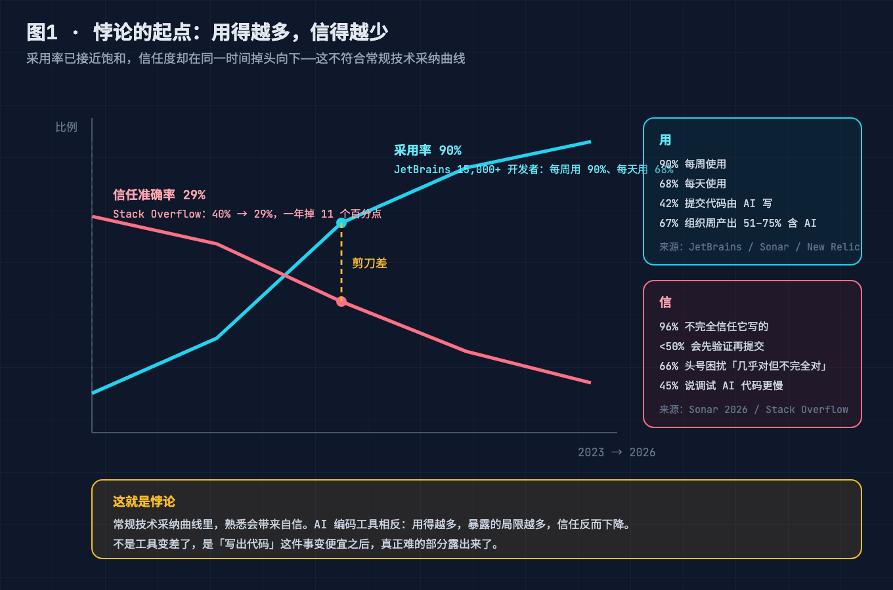
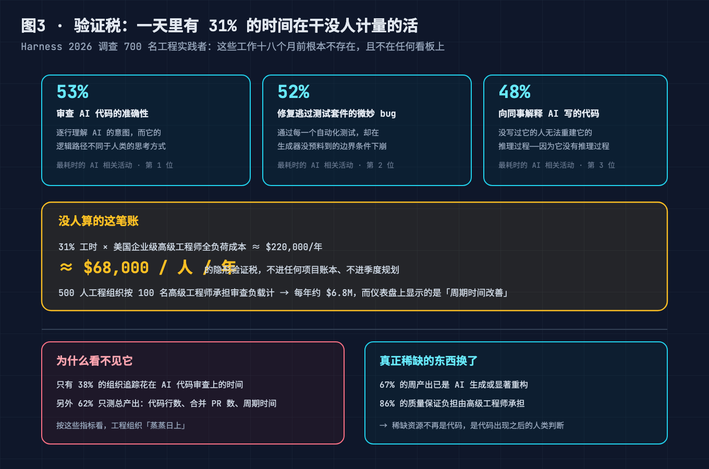
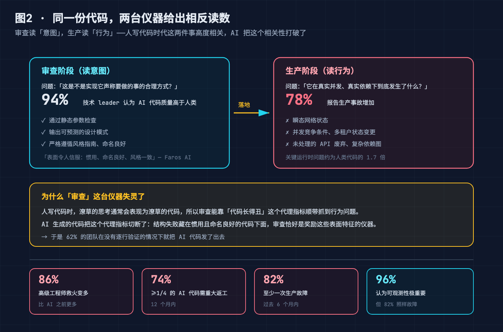
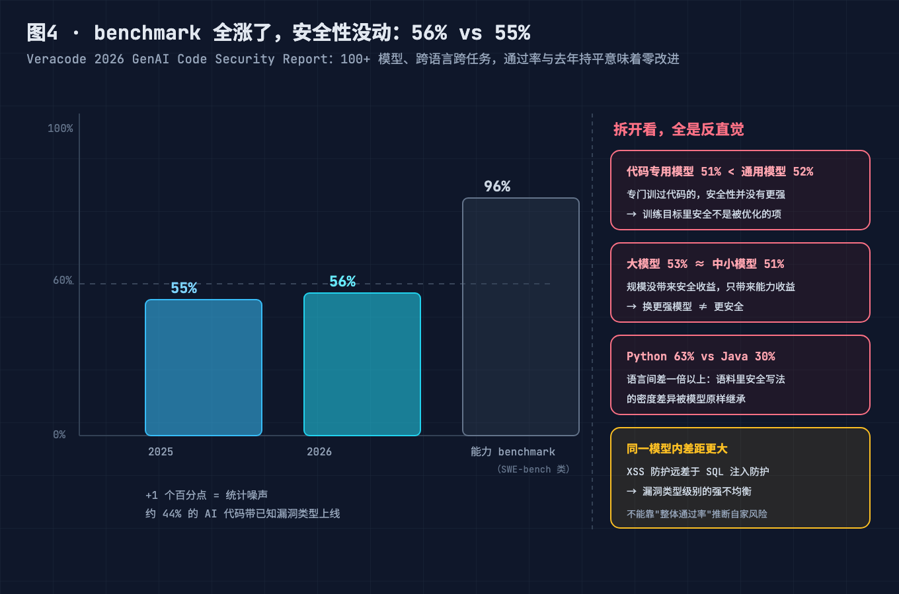
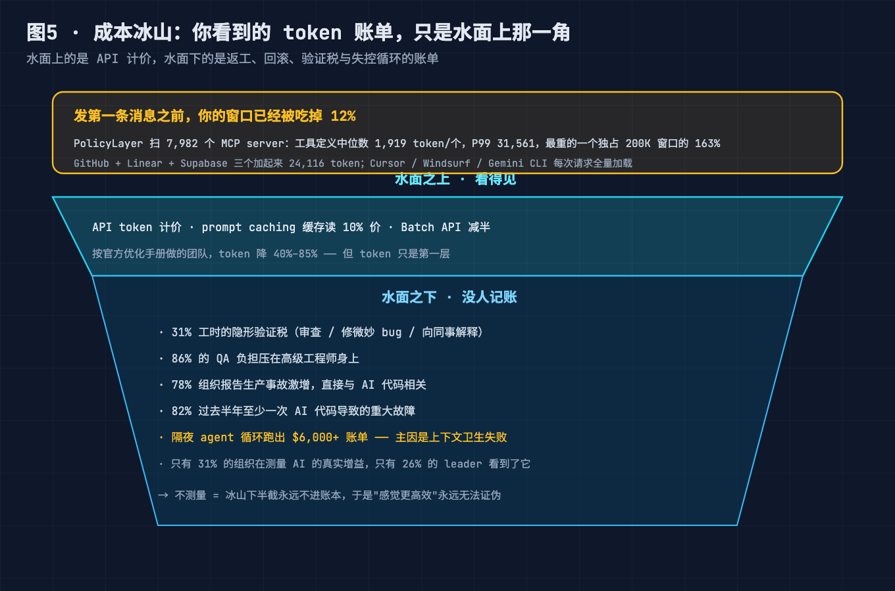
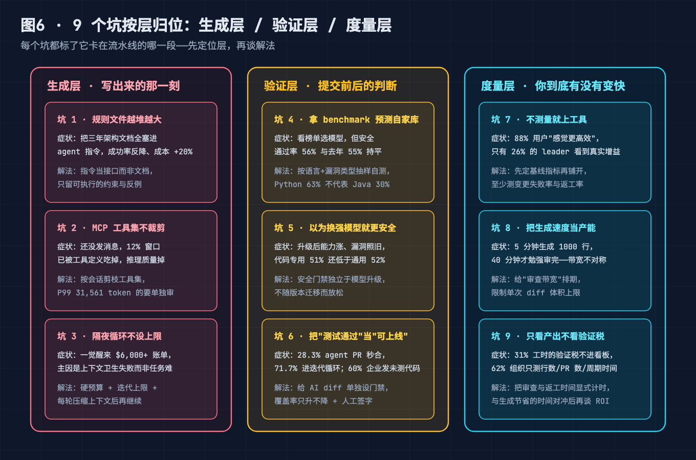

# 用 AI 写得更快，上线却更炸？拆解 AI 编码生产力悖论的 5 个机制，附 9 个坑的自检清单

---

## 0. 先说一个反常识的现象

2026 年的一组调查放一起看，是个自相矛盾的结论：

**用得越来越多**——JetBrains 覆盖 15,000+ 开发者的调查里，90% 每周用 AI 编码工具，68% 每天用；Sonar 显示约 **42% 的提交代码由 AI 写出**。

**信得越来越少**——Stack Overflow 信任准确率从 40% 掉到 **29%**；**96% 的开发者不完全信任**它写的东西，**66%** 说头号困扰是"几乎对，但不完全对"，**45%** 说调试 AI 代码比自己写还慢。

**上线更炸**——New Relic 里有个刺眼错配：审查阶段 94% 的技术 leader 认为 AI 代码质量更高；进生产后，**78% 的组织报告生产事故激增且直接相关**，**82% 半年内至少一次重大故障**。

三条曲线同时发生，说明这不是"工具不好"也不是"你不会用"，而是我们对"生产力"的记账方式失效了。生成变便宜后，真正贵的东西露了出来，而看板、门禁、心智模型还停在"生成稀缺"的年代。

---

## 本文怎么拆这个大问题

标题那句"写得更快却上线更炸"是**症状**不是问题。拆成三个可独立解决的失败模式：

| 失败模式 | 表面症状 | 卡住的环节 |
|---|---|---|
| ① 账算错了 | 感觉更快，实际没快 | 生成与审查带宽不对称，验证成本不进账本 |
| ② 仪器失灵 | 审查通过，生产翻车 | 审查读"意图"、生产读"行为"，代理指标被切断 |
| ③ 尺子没换 | benchmark 全涨，安全性原地 | 安全没写进训练目标，度量只测产出不测返工 |

三者共享总根：**我们把"代码生成"当瓶颈，而它已不是瓶颈。** 生成便宜后，稀缺资源从"写出来"换成"判断对不对"，但度量还在数行数、门禁还在看意图、成本模型还在只算 token。

下面 5 问按"立总根 → 分治三模式 → 守底线"排列。

---

## 问题 1（前提）：瓶颈已经换人了，工具链还没换

Futurum 显示真正跑通全自主端到端 agent **只占 5.84%**，主要失败点是**基础设施访问**而非代码生成。LeadDev 近 600 人调查：Claude Code 采用率 78%，**日常使用掉到 50%**。

arXiv 上对 **33,707 个 agent PR** 的分析：**28.3% 秒合，71.7% 进迭代循环**；Tricentis：**60% 企业承认发布未经充分测试的代码**。

人写代码时慢的是"写"，所以优化"写"能拿收益。AI 把"写"压到近零成本，**"验证"成了新长尾**——而这一环几乎没被工具化。总根就是：用"生成稀缺"时代的度量/门禁/成本模型，管理"验证稀缺"的现实。

---

## 问题 2（治①账算错）：生成带宽是审查的 8 倍

生成侧爆发：月均生成从 **2.5 万行飙到 25 万行**；审查侧线性：**5 分钟生成 1000 行，40 分钟才审完**。

Harness 对 700 人的调查拆出隐形验证税：**53%** 耗在"审查准确性"、**52%** 在"修逃过测试的微妙 bug"、**48%** 在"向同事解释 AI 代码"——三项合计 **31% 工时**被吃掉，且只有 **38% 的组织在追踪它**。

这笔税约 **$68,000/人/年**（基于 $220k 全负荷成本的推算，非调查原文）。解法不是少审查，是**给审查排期、限制入流**。门禁脚本见文末 GitHub。

---

## 问题 3（治②仪器失灵）：审查读不出生产事故

审查问"这是实现意图的合理方式吗"，生产问"真实并发/依赖/数据下到底发生了什么"。人写代码时"丑代码=坏代码"是可靠的代理指标，审查靠代码长相顺带抓行为问题。

AI 切断了它：生成的代码"表面令人信服——惯用、命名良好、风格一致"，稳定通过静态检查、设计模式匹配、风格指南，但**瞬态网络状态、并发竞争、未处理的 API 废弃**这些运行时才暴露的问题系统性弱。New Relic：关键运行时问题约为人类 **1.7 倍**，**62% 团队没逐行验证就发了**。

所以"94% 认为质量更高"和"78% 事故激增"不矛盾——测的是两样东西，只是人类代码上曾巧合重合。解法是把"行为"也拉进门禁：确定性检查 → 属性/模糊测试 → 外部验证器（类型系统、形式化证明，不认模型自评）。

---

## 问题 4（治③尺子没换）：benchmark 全涨，安全性纹丝不动

Veracode 2026（100+ 模型）：**安全通过率 56%，去年 55%**。能力 benchmark 全涨，安全零改进。约 **44% 的 AI 代码带已知漏洞类型上线**。拆开全是反直觉：

- **代码专用 51% < 通用 52%**——安全从不是训练优化目标；
- **大模型 53% ≈ 中小 51%**——换更强模型不会更安全；
- **Python 63% vs Java 30%**——语料里"安全写法"的密度被原样继承；
- **XSS 防护远差于 SQL 注入**——漏洞类型级强不均衡。

你不能拿整体通过率推断自家代码库风险。解法：按自家技术栈抽样自测 + 把安全门禁从"模型升级"链路解耦。

顺带：工具定义本身在吃上下文。PolicyLayer 扫 7,982 个 MCP server，工具定义中位 **1,919 token/个**，P99 **31,561**，最重独占 200K 窗口 **163%**；GitHub+Linear+Supabase 合计 **24,116 token**——发第一条消息前，12% 窗口已没。MCP 预算扫描脚本见文末 GitHub。

---

## 问题 5（守底线）：成本冰山与"你到底有没有变快"

水面上是 API 折扣：Anthropic 说按手册优化的团队 token 降 **40%–85%**，缓存读 10% 价，Batch 再减半。水面下是没人记账的：31% 验证税、86% QA 压在高级工程师、78% 事故激增、隔夜循环跑出 **$6,000+ 账单**（主因上下文卫生失败）。

GitHub 说 **88% 用户感觉更高效，但只有 26% leader 看到增益、31% 在测量**。建议至少测三个指标：变更失败率（DORA）、返工率、验证工时。返工率统计脚本见文末 GitHub。

---

## 小结：5 个问题合起来回答了标题

| 小问题 | 答了什么 | 对应失败模式 |
|---|---|---|
| 问题1 | 瓶颈从"生成"换到"验证"：端到端 agent 仅 5.84%、71.7% PR 进迭代 | 立总根 |
| 问题2 | 生成带宽 8 倍于审查，31% 工时隐形税，仅 38% 在追踪 | ① 账算错 |
| 问题3 | 审查读意图、生产读行为，运行时问题 1.7 倍 | ② 仪器失灵 |
| 问题4 | 安全 56% vs 55%，代码专用<通用、Python 63% vs Java 30% | ③ 尺子没换 |
| 问题5 | 水面下是验证税/事故；88% 感觉快 vs 26% 见增益 | 守底线 |

一句话：**你没变快，只是把成本从"写"搬到了"验"，而后者没被记账。** 三模式是同一总根的三重投影，只修一个能缓解，三件都换掉那个 88% vs 26% 落差才会收敛。

---

## 进阶：三层治理

- **生成层**——指令当接口而非文档（长文档进知识库按需取）；工具集按会话剪枝（卡 10% 预算）；长跑任务硬预算+迭代上限+每轮压缩上下文。
- **验证层**——确定性检查前置；给 AI diff 单独门禁（覆盖率只升不降、diff 体积上限）；属性测试覆盖边界；外部验证器不认自评。
- **度量层**——DORA 四指标打底 + 两个 AI 专属（返工率、验证工时占比）；成本口径统一（API+验证工时+事故）。

三层同时成立：生成决定入流速度，验证决定放行标准，度量决定你知不知道在变好。

---

## 9 个坑：症状 + 解法

**生成层**
1. 规则文件越堆越大：三年文档全塞指令→成功率反降、成本+20%。解法：指令当接口，长文档进知识库按需取。
2. MCP 工具集不剪枝：发首条消息前 12% 窗口被工具定义吃掉。解法：按会话剪枝，P99 3 万+ token 的 server 单审，卡 10% 预算。
3. 隔夜循环不设上限：$6,000+ 账单，主因上下文卫生失败。解法：硬预算+轮数上限+每轮压缩+checkpoint。

**验证层**
4. 拿 benchmark 预测自家库：56% 与去年 55% 持平。解法：按真实语言+漏洞类型自测 20–50 任务得基线。
5. 以为换更强模型更安全：代码专用 51%<通用 52%。解法：安全门禁独立于模型升级，重跑基线。
6. 把"测试通过"当"可上线"：71.7% PR 进迭代、60% 发未充分测试代码。解法：AI diff 单独门禁+危险路径人工签字。

**度量层**
7. 不测量就上工具：88% 感觉快 vs 26% 见增益。解法：铺开前定基线（失败率/返工率/验证工时）+ 三月对照。
8. 把生成速度当产能：5 分钟生成 1000 行、40 分钟审完。解法：给审查排期、限 diff 体积、队列思维管理入流。
9. 只看产出不看验证税：31% 税不进看板。解法：审查返工显式计时，与生成节省对冲后再谈 ROI。

---

## 升华

过去四十年软件工程都在优化"人更可靠地产出代码"，因为代码贵。现在代码便宜了，贵的是**判断**。但工具链、看板、成本模型全围着"代码贵"建，于是出现 88% 感觉快、26% 见收益、78% 事故激增的荒诞组合——这是记账方式的失败，不是 AI 的失败。好消息：可修，且不用等下一个模型。

---

## 本篇做了什么

- 把 JetBrains / Sonar / SO / New Relic / Veracode / Harness 等 2026 调查并排，指出"用得越多、信得越少、上线更炸"三曲线同发，问题在记账不在工具。
- 建故障树：把症状拆成账算错 / 仪器失灵 / 尺子没换三模式，总根=把生成当瓶颈而它已不是。
- 讲 5 机制 + 给 3 段 CI 脚本（已移出到 GitHub）+ 列 9 坑（按层归位）+ 给三层治理。
- 全部数据经 WebSearch 核实，未编造。

## 对哪些群体有用

- **一线开发者**：坑 1/2/3 解释"指令越长越差""突然变笨"，给可执行约束。
- **技术管理 / 工程效能**：坑 7/8/9 + 度量层把"感觉快"变"可证伪快"，31% 验证税值得进季度规划。
- **CI/CD 与质量工程师**：问题 3"仪器失灵"解释既有 review 在 AI 代码上为何失效。
- **安全工程师**：问题 4 的 56% vs 55%、语言/漏洞不均衡说明"用榜单推自家风险"走不通。
- **评估要不要上 AI 工具的团队**：问题 1"瓶颈转移"帮你先定位卡在生成还是验证。

---

如果有用，点个**收藏**——有人问"上了 AI 到底变快没"，把「5 机制 + 9 坑」甩过去。顺手**赞**让更多人看到。

三段可直接进 CI 的脚本（AI diff 门禁 / MCP token 预算扫描 / 返工率统计）和完整数据来源清单，我都整理成了代码文件，放在 GitHub：**github.com/beverlyLee/ai-passage/tree/main/14-AI编码生产力悖论/code**，clone 改两行路径就能跑。

跑完欢迎把你的**返工率**和**验证工时占比**贴评论区——不同技术栈这两个数字能差多少，我很好奇。如果差异够大，下一篇专门拆。

---

## 参考来源

1. JetBrains 2026 开发者调查（15,000+）：90% 每周用、68% 每天用
2. Sonar 2026 State of Code（1,100+）：42% 提交由 AI 写、96% 不完全信任、74% 需重大返工
3. Stack Overflow 2026：信任 40%→29%、资深仅 2.6% 高度信任、66% 困扰"几乎对但不完全"、45% 调试更慢
4. New Relic《2026 AI 编码现状》：94% 审查认为更高、78% 事故激增、86% 救火变多、82% 半年重大故障、运行时问题 1.7×、62% 未逐行验证
5. Veracode 2026（100+ 模型）：56% vs 55%、代码专用 51%<通用 52%、大模型 53%≈中小 51%、Python 63% vs Java 30%
6. Harness 2026（700 人）：31% 工时隐形验证、53%/52%/48% 三项、仅 38% 追踪
7. LeadDev 2026（近 600）：Claude Code 采用 78%→日常 50%
8. GitHub/行业：88% 感觉快 vs 26% 见增益、31% 在测量
9. Futurum：端到端 agent 5.84%
10. arXiv 33,707 agent PR：28.3% 秒合、71.7% 迭代
11. Tricentis 2026：60% 发未充分测试代码
12. Anthropic token 优化手册：降 40%–85%、缓存读 10%、Batch 减半
13. PolicyLayer 7,982 MCP server：中位 1,919、P99 31,561、最重占 200K 163%、三件套 24,116
14. 生成带宽：2.5 万→25 万行/月；5 分钟 1000 行 vs 40 分钟审
15. 隔夜循环 $6,000+ 案例（主因上下文卫生失败）

> 说明："31% 工时 ≈ $68,000/人/年"为基于全负荷成本的推算，非调查原文。

---

## 【发布前删除】图片 CDN 替换清单

| 本地路径 | 替换为掘金 CDN |
|---|---|
| `./diagram/aicode/01-adoption-trust-scissors@2x.png` | 待上传后替换 |
| `./diagram/aicode/02-review-vs-production@2x.png` | 待上传后替换 |
| `./diagram/aicode/03-verification-tax@2x.png` | 待上传后替换 |
| `./diagram/aicode/04-security-passrate-flat@2x.png` | 待上传后替换 |
| `./diagram/aicode/05-cost-iceberg-context-bloat@2x.png` | 待上传后替换 |
| `./diagram/aicode/06-nine-pitfalls-layered@2x.png` | 待上传后替换 |

上传掘金图床后，把上表左列替换为右列链接，然后**连同本节一起删除**。
