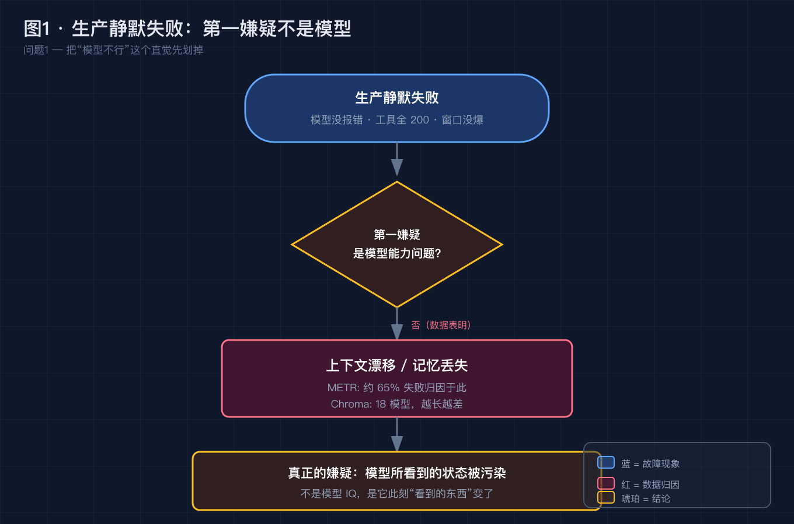
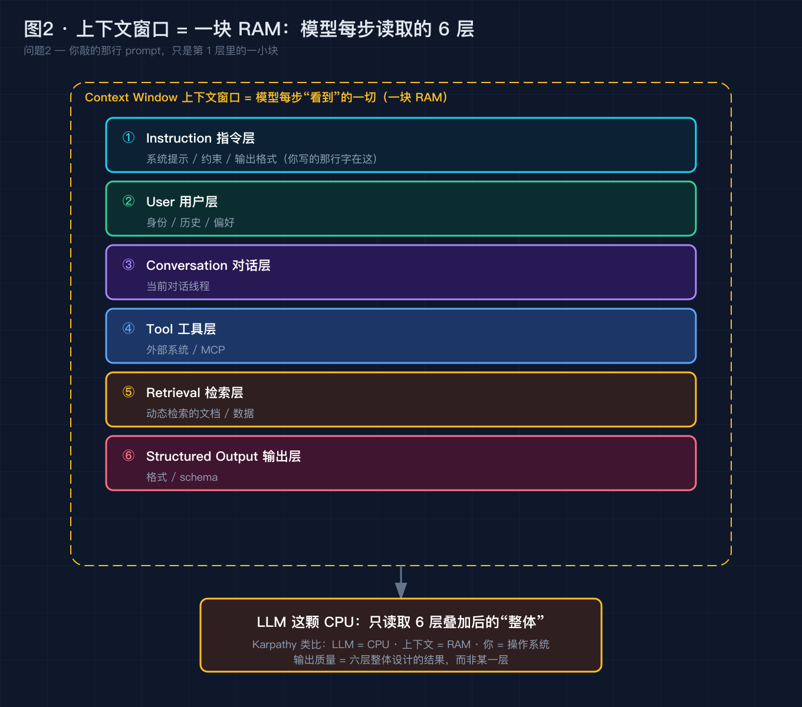
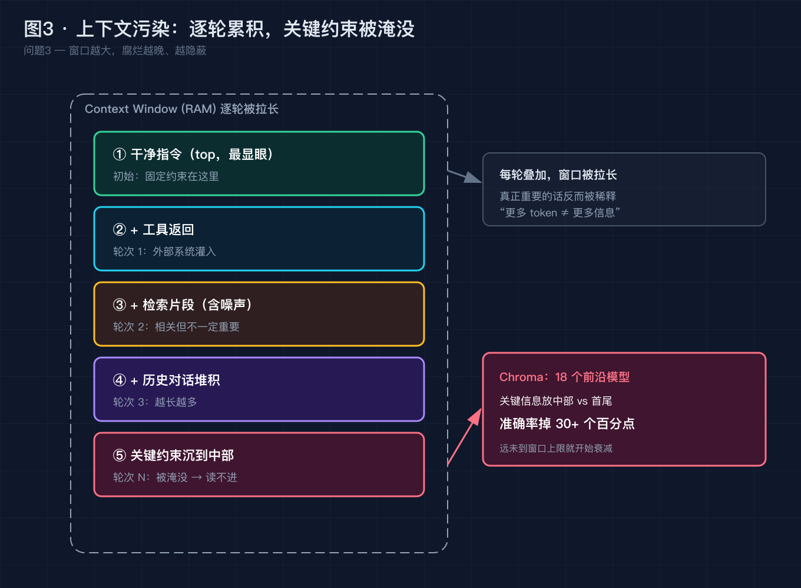
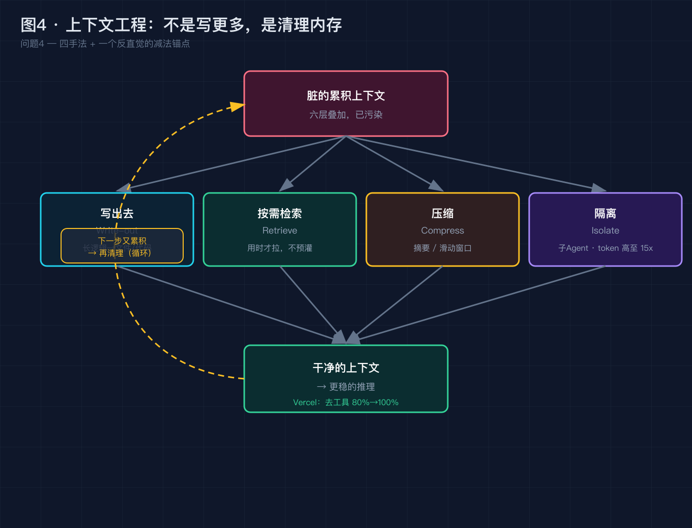
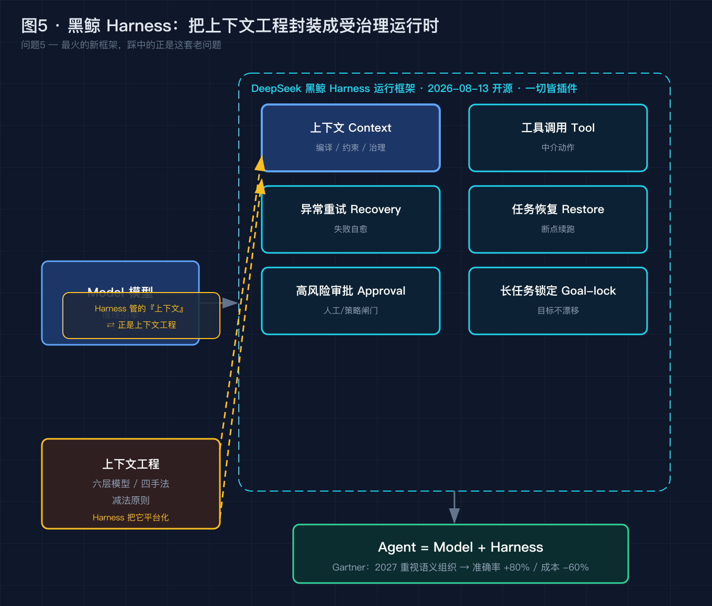

# 上下文窗口都卷到 100 万 token 了，Agent 为什么还在生产里"失忆"？

> 本文不堆概念。我们从一个真实的、半夜能把人叫醒的生产故障开始，把它拆成 5 个递进的小问题，逐个用事实和数据解决。最后你会发现：2026 年 8 月最火的那个词——**Harness（黑鲸）**，踩中的正是这套被盖过的"老问题"。

---

## 0. 先别急着看答案，看这个故障

凌晨 2 点，你被告警叫醒。生产里的"数据对账 Agent"又出事了——不是崩溃，是**静默犯错**：

它把已经对账完成的订单又重复报了一遍，最终报告里凭空多了 6 笔"异常交易"。你拉日志排查，三个事实很快排除了最直觉的猜想：

- **模型没报错**：推理返回正常，没有任何 error；
- **工具没挂**：所有外部调用都是 HTTP 200；
- **窗口没爆**：上下文远没到上限（何况这周刚把模型换成 100 万 token 窗口的版本）。

那么问题出在哪？

如果你现在的猜测是"模型不够强""提示词没写好""再调调 prompt 就行"——这篇文章就是来推翻这三个直觉的。我们把它拆开，一个一个解决。

---

## 问题 1：是模型不行吗？——不，瓶颈早就不在模型

**【论点】** 当一个 Agent"静默犯错"而模型、工具、窗口都正常时，**第一嫌疑不应该是模型能力，而应该是"它此刻看到的东西"变了。**

**【事实】** 2025 到 2026 年，前沿模型的静态能力早已不是生产失败的主因：

- METR 等机构对 2025 年企业 AI 项目的复盘指出，失败案例里**相当大的比例（约 65%）可归因于"上下文漂移 / 记忆丢失"**，而非模型推理能力本身；
- Chroma 在 2025 年测了 **18 个**前沿模型，发现**随着输入变长，准确率普遍下降，且远没到标称窗口上限就开始了**；把关键信息放在上下文中部，比放在首尾准确率能掉 **30 个百分点以上**。

**【论证】** 这说明一件反直觉的事：**模型在"考题"上很强，不代表它在"你家的现场"上很强。** 静态 benchmark 测的是"给定一段干净输入，模型能答多好"；生产测的是"在一堆被污染、被拉长、被历史淹没的状态里，模型还能不能认出那条关键约束"。前者过关，后者翻车，差距就出在**上下文状态**，不是模型 IQ。

所以，先把"模型不行"这个猜想划掉。

> 图 1 · 失败归因：当 METR 把约 65% 的生产失败归到"上下文漂移"，而 Chroma 测出 18 个模型"越长越差"，第一嫌疑就从"模型行不行"转移到"它此刻看到的状态是否被污染"。

---

## 问题 2：如果模型没坏，它"看到"的到底是什么？

**【论点】** Agent 每一步推理读取的，从来不是你敲的那行提示词，而是**"到目前为止累积的那一整块状态"**。理解这一点，整个问题就从"怎么调 prompt"升级成了"怎么设计这块状态"。

**【事实】** Andrej Karpathy 在 2025 年 6 月给了最精准的类比：

> LLM 是一颗 CPU，上下文窗口是一块 RAM，而工程师你，是操作系统。

每次推理前，操作系统要把"正确的代码 + 正确的数据"加载进内存。窗口再大，也只是内存容量；装错、装杂、装太多，一样会崩。

而 Hugging Face 的 Philipp Schmid 把"模型看到的一切"拆成了清晰的六层——**你的提示词，只是其中一层里的一小块**：

> 图 2 · 六层上下文模型（Philipp Schmid / Hugging Face）：你的提示词只是第 1 层里的一小块；LLM 这颗 CPU 读取的是六层叠加后的"整体"，质量由整体设计决定。

**【论证】** 你精心写的系统提示是**静态**的，但每一轮的工具返回、检索片段、历史对话都在**往这块 RAM 里累加**。到第三步、第六步，模型真正反复读取的，是"累积状态"这个整体——而你一开始敲的那行字，早被稀释到了中部。这直接解释了问题 0 的故障：**不是 Agent 忘了你的指令，是指令被后面涌进来的东西压住了。**

---

## 问题 3：为什么"累积状态"会坏？三个机制性真凶

**【论点】** 上下文不是"塞满就好"，窗口越大，污染越隐蔽。有三个机制性的真凶，是所有 Agent 生产翻车的共同根因——它们跟用不用黑鲸、窗口多大，都脱不开干系。

### 真凶一：上下文腐烂（Context Rot）

**【事实】** 回到 Chroma 那项 18 模型研究：输入变长，准确率就降；关键信息放中部，比放首尾掉 30+ 个百分点。

**【论证】** 它推翻了一个朴素直觉：**"更多 token"≠"更多信息"，往往是"更少的有效信息"。** 你往窗口里塞得越多，真正重要的那句话反而越容易被模型"读不进去"。这就是为什么换了 100 万 token 窗口，故障没消失——窗口只是把"腐烂"发生得更晚、更隐蔽。

### 真凶二：系统提示膨胀，且几乎不缓存

**【事实】** Datadog 在《State of AI Engineering》里追踪真实 LLM 调用，发现两个扎比放在一起很说明问题：输入 token 里 **69% 都是 system prompt**；但所有调用中，只有 **28%** 命中了缓存读取。

**【论证】** 那些体量巨大的系统提示，绝大多数每次推理都在被**重新处理一遍**——又慢、又贵，还因为体量巨大稀释了模型对关键约束的注意力。一个本该固定、可缓存的东西，被当成了每次都要重算的变量。

### 真凶三：你测的是 prompt，生产跑的是 context

**【事实】** LangChain《State of Agent Engineering 2026》调研 1340 名从业者：57.3% 的组织已有 Agent 生产，但把"质量"列为最大障碍的占 32%——且 89% 团队上了可观测，却只有 52.4% 做了离线评估。

**【论证】** "看着它失败，却没工具定位它为什么失败"，正是因为没人把"累积状态"当成真正的 prompt 去设计和测试。你优化的是第 1 层里那一小块，生产里崩的却是六层叠加起来的整体。

> 图 3 · 上下文如何被污染：从“干净指令”到“轮次 N 的一条线”，工具返回、检索噪声、历史堆积逐轮累加，关键约束最终被压到中部——Chroma 测出中部信息准确率掉 30+ 个百分点。

---

## 问题 4：怎么修？——不是加 prompt，是"清理内存"

**【论点】** 上下文工程（Context Engineering）的核心动作不是"写更多"，而是**在每一步只把对的信息装进 RAM，并保持它干净**。2025 年 6 月，Karpathy 把这门手艺正式命名：

> "context engineering is the delicate art and science of filling the context window with just the right information for the next step."
> （上下文工程，是一门为下一步精准填入恰当信息的、精妙的艺术与科学。）

同年 6 月 18–19 日，Shopify CEO Tobi Lütke 也公开表达了相同判断。一个工程直觉，由此变成被正式命名的学科。

**【四个能立刻上手、且都有工程依据的手法】**

> 图 4 · 四种清理手法：写出去 / 按需检索 / 压缩 / 隔离。核心不是“加信息”而是“保持上下文干净”——Vercel 去掉部分工具后，准确率从 80% 升到 100%。

- **写出去（Write-out）**：把长逻辑和约束写成文件/代码让模型去读，而非全塞进 prompt。
- **按需检索（Retrieve-on-demand）**：用 RAG 或工具，需要时才拉进来，而非一次性全量灌入。
- **压缩（Compress）**：历史摘要、滑动窗口、旧对话压成结构化摘要，腾出干净内存。
- **隔离（Isolate）**：Anthropic 子 Agent 思路，把子任务上下文隔离子 Agent；token 成本最高到 **15 倍**，但质量更稳——这是值得接受的权衡。

**【一个反直觉的锚点：减法有时胜过加法】**

**事实**：Vercel 的 AI 团队分享，他们**移除掉部分工具**后，Agent 准确率从 **80% 飙升到 100%**，token 用量降 **40%**，速度提升 **3.5 倍**。

**论证**：更简单的系统 + 更好的上下文，往往胜过更复杂的系统 + 更多的工具。**加法上瘾，是上下文工程的头号敌人。** 这也正好呼应 Rich Sutton《苦涩的教训》——简单系统 + 更好的数据/上下文，长期稳定胜过复杂系统 + 聪明手工。

回到问题 0 的故障：那个对账 Agent，根因大概率不是"模型不够"，而是它在第六轮时，三条早已成立的约束被中部堆积的噪声淹没——用"压缩 + 隔离"把关键约束重新顶到窗口首尾，故障多半就消了。

---

## 问题 5：那为什么 2026 年 8 月，这件事反而更重要了？

**【论点】** 因为两股 8 月的新趋势，恰好把"上下文工程"从"个人手艺"推成了"平台级必答题"——窗口越大越需要它，而最火的新框架，本质就是把它自动化。

**【事实一：窗口越大，腐烂越严重，不是越安全】**

2026 年 8 月，1M 上下文窗口模型密集发布：DeepSeek V4 Pro（8 月 12 日 GA，1M 上下文）、NVIDIA Nemotron 3.5（1M 窗口）、Qwen3.8 系列（8 月初）。但正如问题 3 所说：**窗口只是把腐烂推得更晚、更隐蔽**，长任务（METR 观察到 AI 任务时长约每 7 个月翻倍）累积的上下文漂移只会更夸张。

**【事实二：最火的新词，踩中的正是这套老问题】**

2026 年 8 月 13 日，DeepSeek 开源自研 Agent 运行框架 DeepSeek Harness（圈内昵称"黑鲸"，dsh），基于 Cordis 插件内核，打出"一切皆插件"，开源当天冲上 Hacker News 首页、一天数万星标，被媒体称为"Agent 时代的安卓"。

看它的官方定义就清楚了：

> **Agent = Model + Harness**
> Harness 全权处理**上下文、工具调用、异常重试、任务恢复、高风险审批、长任务目标锁定**。

**【论证】** Harness 管的**头一件事就是"上下文"**——而它干的活（编译上下文、约束决策、中介动作、强制策略与审计），正是问题 2–4 里那套"六层模型 / 四手法 / 减法"在系统层的操作化。**Harness 不是取代了上下文工程，而是把它从"工程师的手艺"封装成了"受治理的运行时"。** 你先前调的那句 prompt，现在被框架替你自动化了——但"为什么需要它、它在防什么"，还是这套原理。

> 图 5 · Harness 是上下文工程的“系统级操作化”：DeepSeek 黑鲸把上下文、工具、重试、审批、长任务锁定统一管控，其头一件事就是“上下文”——正是问题 2–4 那套原理被封装成了受治理的运行时。

Gartner 在 2026 年 5 月把这一年称为"上下文之年（the context year）"，并预测到 2027 年，重视语义与上下文组织的团队，其 Agentic AI 准确率最高可提升 **80%**、成本下降 **60%**——这串数字，正是"把上下文当生产系统来管"的回报。

---

## 升华：从"怎么问"到"怎么设计系统"

写到这里，三条可以带走的东西：

1. **瓶颈转移定律。** 当基础模型都足够强，限制你产出的不再是"模型智力"，而是"你给它的信息架构"。车够快了，决定你能跑多远的，是路和导航，不是引擎。
2. **你写的 prompt ≠ Agent 的 prompt。** 多步系统里，那行字远不如"系统一路累积看到的一切"重要——真实 prompt 是状态、是历史、是检索、是工具返回，是那块动态的内存。
3. **上下文是一种生产系统，不是一次性输入。** 它值得被版本化、被监控、被测试、被缓存；把它当代码库里的一份资产去管，而不是写完就不管的灵感。

LangChain 的 Harrison Chase 有句话很适合收束：

> "When agents mess up, they mess up because they don't have the right context; when they succeed, they succeed because they have the right context."

2026 年，"上下文工程"这个词早已不算新鲜。但当它从个人手艺，被封装进黑鲸 Harness 这样"一切皆插件"的受治理运行时，竞争就从"谁更懂上下文"升级成了"谁能用好 Harness 治理之下的上下文"。底层不变：上下文工程，是 Agent 能从 Demo 走进生产的那块地基。

---

## 互动时间

回到开头的故障：你被叫醒的那个凌晨，如果日志显示"模型没报错、工具全 200、窗口没爆"——

**你现在的排查第一直觉，会去查哪一层？是系统提示太长、检索进来的噪声、还是历史堆积拖垮了上下文？**

欢迎在评论区**贴上你的翻车现场**（脱敏即可），我们可以一起用六层模型拆——到底是哪一层的上下文被弄脏了。也欢迎聊聊：你现在是停留在 L0 手写 prompt，还是已经上到了 L2/L3，甚至开始用 Harness 把这套东西平台化了？

如果这篇对你有用，点个赞或收藏，让更多还在"堆 prompt"的同事看到：**模型已经够强了，问题在你喂进去、又没管好那块上下文。**

---

### 参考来源（均可核实）

- DeepSeek 官方仓库 README 与架构文档（deepseek-harness / Cordis）：Agent = Model + Harness，Harness 管控上下文/工具/重试/恢复/审批/长任务锁定；"一切皆插件"，开源 2026-08-13，被媒体称"Agent 时代的安卓"
- Karpathy 原推，"context engineering is the delicate art and science…"，2025-06-25（多家媒体转引）；LLM=CPU / 上下文=RAM / 你是 OS 类比
- Tobi Lütke（Shopify CEO）公开判断，2025-06-18~19
- LangChain《State of Agent Engineering 2026》，调查 1340 名从业者，2025-11-18~12-02：57.3% 生产、32% 质量最大障碍、89% 可观测、52.4% 离线评估
- Datadog《State of AI Engineering》：69% 输入 token 为系统提示，仅 28% 命中缓存读取
- Gartner 官方新闻稿，2026-05-11：称 2026 为"上下文之年"，预测 2027 年重视语义组织 Agentic AI 准确率 +80%、成本 -60%
- Chroma Research 上下文腐烂研究（经技术媒体转述）：18 个前沿模型、输入变长准确率降、关键信息居中掉 30+ 个百分点
- Anthropic《Effective context engineering for AI agents》，2025-09（随 Claude Sonnet 4.5）：定义为"推理时精选可用 token 的最优集合"
- Philipp Schmid（Hugging Face）六层上下文框架
- Vercel AI 团队案例（经 Taskade 博客转述）：去工具后准确率 80%→100%、token -40%、速度 ×3.5
- METR / agentmarketcap.ai 2025 企业 AI 失败复盘：约 65% 归因于上下文漂移/记忆丢失；AI 任务时长约每 7 个月翻倍
- Rich Sutton《The Bitter Lesson》（苦涩的教训）
- LangChain 编码 Agent 仅靠上下文工程改进在 Terminal Bench 2.0 进入 Top 5（Harrison Chase 演讲，经 ai2.work 报道）

---

### 【发布前删除】图片 CDN 替换清单

本文 5 张配图已生成为本地 PNG（位于 `diagram/context-engineering/`）。发布到掘金前，请按下面顺序把正文里的本地路径替换成掘金图床 CDN 链接：

| 顺序 | 正文里搜这个本地路径 | 替换成 |
| --- | --- | --- |
| 图 1 | `./diagram/context-engineering/01-failure-attribution@2x.png` | 掘金上传后得到的 CDN 链接 |
| 图 2 | `./diagram/context-engineering/02-six-layer-context@2x.png` | 掘金上传后得到的 CDN 链接 |
| 图 3 | `./diagram/context-engineering/03-context-pollution@2x.png` | 掘金上传后得到的 CDN 链接 |
| 图 4 | `./diagram/context-engineering/04-four-tactics@2x.png` | 掘金上传后得到的 CDN 链接 |
| 图 5 | `./diagram/context-engineering/05-harness-bridge@2x.png` | 掘金上传后得到的 CDN 链接 |

替换完成后，连同本“替换清单”小节一起删除即可。
