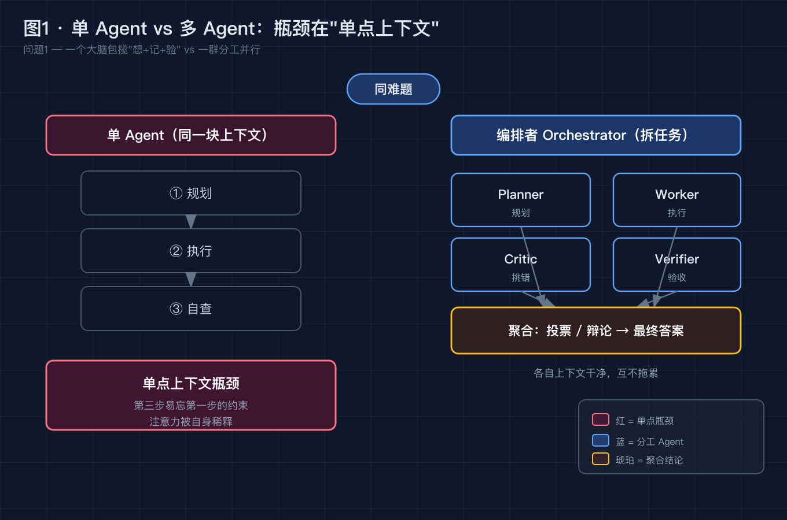
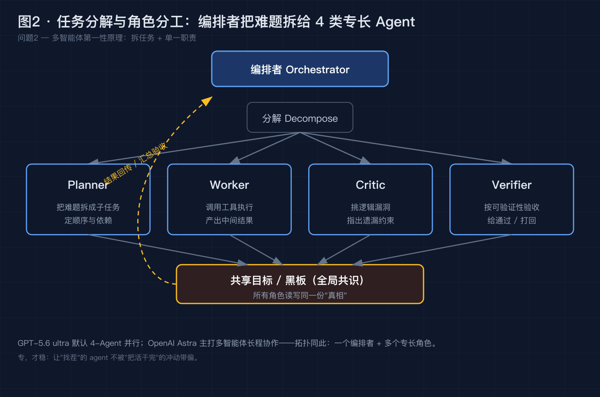
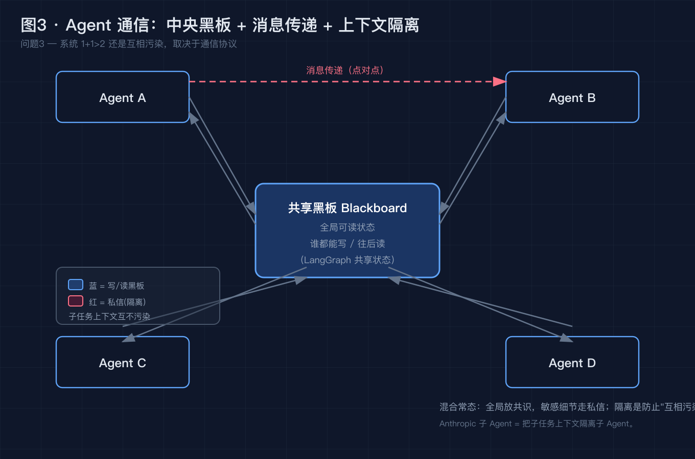
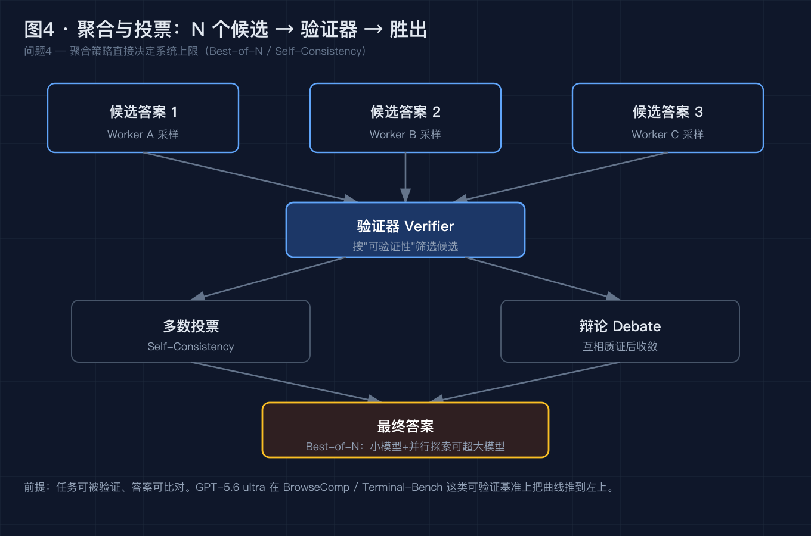
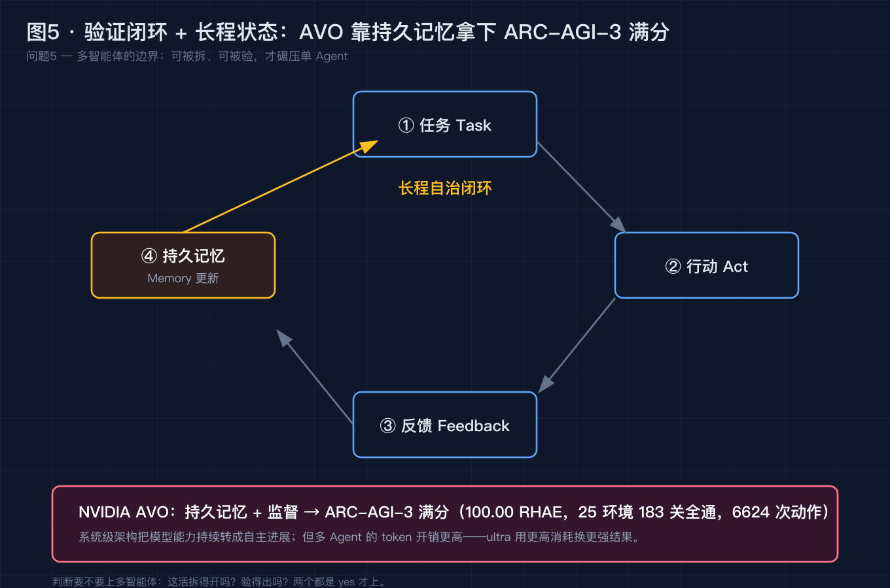

# GPT-5.6 的 ultra 模式凭什么开 4 个 Agent 并行跑？——多智能体协作，是把"一个聪明人"换成"一个团队"

> 本文不堆概念。我们从一个你大概率已经遇到的真实场景开始，把它拆成 5 个递进的小问题，逐个用事实和数据解决。最后你会发现：2026 年 8 月密集刷屏的 **GPT-5.6 ultra（4-Agent 并行）**、刚曝光的 **OpenAI Astra（多智能体长程协作）**、拿下 **ARC-AGI-3 满分** 的 **NVIDIA AVO**，踩中的是同一套被低估的原理——**单模型的上限，正在被"系统"接管**。

---

## 0. 先别急着看答案，看这个场景

你给 AI 派了个活：解一道需要反复试错、跨多步推理的高难度题（比如一份深度研报、一段跨文件的长程重构、一道竞赛级数学题）。

你分别用两种姿势跑：

- **单 Agent 模式**：它在一个上下文里又规划、又执行、又自查。跑到第 6 步，它悄悄改了前面定的方案，理由你自己都看不懂；最后给的答案"看起来很对"，但拿去一验，错在第三步一个它早该坚持的约束上。
- **GPT-5.6 的 ultra 模式**：官方默认**开 4 个 Agent 并行**跑。结果在 OpenAI 公布的基准上，BrowseComp / SEC-Bench Pro / Terminal-Bench 2.1 这组评测里，**分数更高、耗时反而更短**——直接把"分数-延迟"这条曲线，推到了"又高又左"的位置。

如果你现在的直觉是"模型越强就啥都能干""4 个 Agent 不就是 4 倍钱吗"——这篇文章就是来推翻这两个直觉的。我们拆开，一个一个解决。

---

## 问题 1：单个 LLM 为什么会"卡住"？——单点上下文与注意力的天花板

**【论点】** 一个 LLM 在复杂长任务上会"跑偏"，根因不是它不够聪明，而是**它得在同一块上下文里，又想、又记、又校验**——这三件事互相抢同一块"内存"，必然顾此失彼。

**【事实】** 多智能体不是拍脑袋的营销词，它针对的是单 Agent 的结构性短板：

- OpenAI 在 GPT-5.6 的官方说明里，把 **ultra** 定义为"协调多个 agent 跨并行工作流"，并明确写：**相比单 agent baseline，加并行 agent 让分数-延迟前沿"向上向左"移动**——也就是更强、更快，而不是更贵更慢；
- 同一页给出的对比图里，单 agent baseline 在同样的问题上，要么分数更低，要么耗时更长；
- 注意力机制本身有个老问题：**序列越长，模型对"开头那条关键约束"的注意力越被稀释**。上下文越长，越容易在第六步把第一步定的规矩忘掉——前面问题 0 的"静默改方案"，根因就在这。

**【论证】** 这推翻了一个朴素直觉：**"模型更强"≠"复杂长任务更强"。** 当一个模型被迫把规划、执行、自查全塞进同一块 RAM，它的"总算力"再大，也会被"单点上下文"这根水管卡住。4 个 Agent 并行的本质，是**把这根水管拆成了四根**——谁也不用一个人扛全部。

> 图 1 · 单 Agent vs 多 Agent：左边一个大脑包揽"想 + 记 + 验"，上下文是单点瓶颈；右边由编排者拆成 4 个专长 Agent 并行，各自上下文干净、互不拖累。

---

## 问题 2：多智能体怎么"分活"？——任务分解 + 角色分工

**【论点】** 多智能体的第一性原理，是**把一个问题拆成子问题，分给专长不同的角色**，而不是让一个模型从头包到尾。拆得对，系统就 1+1>2。

**【事实】** 这不是空想，是今年 8 月密集落地的范式：

- **GPT-5.6 ultra** 默认 **4 个 agent** 并行；OpenAI 同时在 Responses API 里推出了 **multi-agent beta**，让开发者自己搭"多 agent 编排"；
- **OpenAI Astra**（2026-8-29 曝光、筹备中）：定位就是"支持多个智能体**长程协作**，解决大型项目推进或复杂高等数学"——核心是让一群 agent 长期一起干活；
- 工业界跑出来的典型角色分工高度一致：**规划者（planner）** 拆任务、**执行者（worker）** 干活、**批评者（critic）** 挑错、**验证者（verifier）** 验收。

**【论证】** 角色分工这件事，软件工程叫"单一职责"，人脑叫"脑区分工"，多智能体只是把它搬到了 LLM 上。一个 agent 专管"找茬"，它就不会被"把活干完"的冲动带偏；一个 agent 专管"验收"，它就不必兼顾"刚才的方案长啥样"。**专，才稳。**

> 图 2 · 任务分解与角色分工：编排者（Orchestrator）把难题拆给 planner / worker / critic / verifier，每个角色只盯自己那一摊——这正是 GPT-5.6 ultra（4-Agent）、Astra（长程协作）背后的拓扑。

---

## 问题 3：Agent 之间怎么"说话"？——共享状态、黑板与上下文隔离

**【论点】** 多个 Agent 协作的难点，从来不是"各自聪不聪明"，而是**怎么交换信息而不串味**。通信协议选错，系统会从 1+1>2 退化成"互相污染"。

**【事实】** 主流做法就两条老路，Agent 系统把分布式系统的课重上了一遍：

- **共享黑板（Blackboard）**：一块全局可读的状态，谁都能往上写、往后读。LangGraph 的共享状态、很多 Agent 框架的"全局记忆"就是它；
- **消息传递（Message Passing）**：agent 之间点对点发消息，上下文彼此隔离。Anthropic 的"子 Agent"思路，就是把子任务上下文**隔离子 Agent**，互不干扰；
- 现实里往往是**混合**：全局放"共识结论"，敏感细节走私信。关键纪律是**隔离**——不让一个 agent 的中间噪音灌进另一个 agent 的上下文。

**【论证】** 这解释了为什么"简单把 4 个 ChatGPT 粘一起"会翻车：它们之间没有干净的通信边界，A 的胡思乱想直接污染 B 的决策。**多智能体的工程含量，大半在"怎么传话、怎么隔离"，不在"模型多大"。**

> 图 3 · 通信机制：中央"黑板"承载全局共识，agent 间用消息传递点对点协作，子任务上下文相互隔离——隔离是防止"互相污染"的护栏。

---

## 问题 4：怎么"汇总"不打架？——聚合与投票

**【论点】** 多个 Agent 给出多个答案，最终要合成一个。**聚合策略（投票 / 辩论 / 自一致性）直接决定系统的上限**——这一步做错，前面拆得再好也白搭。

**【事实】** 几种被反复验证的聚合手段：

- **自一致性（Self-Consistency / 多数投票）**：让模型对同一个问题采样多条推理路径，取多数答案。这是 2024 年起就被验证有效的推理增强手段——它背后的洞见是：**"多采几条、让答案自己投票"往往比"只走一条"更准**；
- **辩论（Debate）**：让 agent 互相质证，一方挑另一方的漏，几轮后收敛；
- **Best-of-N 采样**：生成 N 个候选，用一个验证器挑最好的。研究早已表明，**小模型 + 更多并行探索（test-time compute），能在不少任务上追上甚至超过更大的单模型**。

**【论证】** 这呼应一句老话"群体的智慧"——但有个前提：**任务可被验证、答案可比对**。能验的题（有标准答案、能跑测试），多 agent 投票稳赢；不能验的题，投票只是把噪音放大 N 倍。GPT-5.6 ultra 在 BrowseComp / Terminal-Bench 这类"可验证"基准上把曲线推到左上，正是踩中了这个前提。

> 图 4 · 聚合与投票：N 个 worker 各给出候选，验证器（verifier）按"可验证性"筛选，多数投票 / 辩论合成最终答案——Best-of-N 与 Self-Consistency 是这套的核心。

---

## 问题 5：一群 AI 会不会"一起变笨"？——验证闭环与长程状态

**【论点】** 多智能体不是银弹。**通信开销、错误传播、任务不可验证时会放大噪音**——它的边界很清晰：当任务"能被拆、能被验"，它碾压单 agent；否则它只是"更贵的单 agent"。兜底靠两样东西：**验证器 + 长程状态**。

**【事实】** 一个把这套做到极致的例子，是本周刷屏的 **NVIDIA AVO**：

- 在 **ARC-AGI-3**（交互式推理基准）上拿下 **100.00 分（RHAE）**，25 个环境、183 关全通，用了 **6624 次环境动作**；
- 它的关键不是"模型更大"，而是**持久记忆（persistent memory）+ 监督**，让 agent 在长程任务里"记得自己走到哪、为什么这么走"，把模型能力持续转成自主进展。

同期的 **xAI Grok Bot**（常驻 24/7 的 AI 队友）、**雷鸟 iO 眼镜的"全天记忆引擎"**（记录 24 小时上下文），踩的是同一根脉：**让 agent 拥有跨时间的状态，而不是每次都从零开始**。

但代价也要说清：多 agent 的 token 开销更高——OpenAI 自己写 ultra"用更高的 token 消耗，换更强的结果、更快的到达"。**你买的是"并行探索 + 互相纠错"的算力，不是 4 份重复劳动。**

**【论证】** 所以判断"要不要上多智能体"，就问两句：这活**拆得开吗？验得出吗？** 两个都是 yes，上；否则先别急着堆 agent，先把单 agent 的上下文管好（见我们上一篇《上下文窗口都卷到 100 万了，Agent 为什么还在生产里"失忆"》）。

> 图 5 · 验证闭环 + 长程状态：任务 → agent 行动 → 环境反馈 → 持久记忆更新 → 下一步。AVO 靠"持久记忆 + 监督"在 ARC-AGI-3 拿下满分，证明系统级架构能把模型能力转成持续自主进展。

---

## 升华：从"更大模型"到"更好系统"

写到这里，三条可以带走的东西：

1. **瓶颈正在转移。** 当基础模型都够强，限制产出的不再是"单个模型多聪明"，而是"你怎么把任务组织成系统"。车够快了，决定你能跑多远的，是车队怎么编排，不是某一辆引擎。
2. **多智能体 = Test-time Compute 的延伸。** 它本质上是给"系统"更多推理算力：更多并行探索、更多互相纠错、更长程的状态。这跟"推理模型想得更久"是同一件事，只是把"想"从一个人，扩成了一个团队。
3. **你本来就是多智能体。** 人脑分脑区、社会靠分工协作——"一群 agent 比一个 agent 强"，只是把人类几万年的组织智慧，复刻到了 LLM 上。区别在于：人靠制度兜底，agent 靠验证器 + 隔离 + 长程状态兜底。

Anthropic 那句关于上下文的话，放在多智能体上也成立：**agent 翻车，往往不是因为单个模型不行，而是因为系统没把"分活、传话、验收、记状态"这四件事设计好。**

---

## 互动时间

回到开头的场景：同一道难题，**单 Agent 跑偏、4-Agent 并行又快又准**——

**你现在的项目里，是卡在"模型不够强"，还是卡在"没把任务拆给对的角色、没把验证器接上"？**

欢迎在评论区**聊聊你用过的多智能体工具**（Cursor / Claude Code / AutoGen / CrewAI / 刚曝的 Astra 都行），以及**踩过的坑**：agent 互相打架？跑偏没人纠正？token 烧穿预算？我们可以一起用"拆得开吗、验得出吗"这两句，判断你那个场景到底该不该上多智能体。

如果这篇对你有用，点个赞或收藏，让更多还在"堆一个超强 prompt"的同事看到：**2026 年，拼的不再是单个模型有多大，而是你能把一群模型编排成多好的系统。**

---

### 参考来源（均可核实）

- OpenAI 官方《GPT-5.6: Frontier intelligence that scales with your ambition》（openai.com/index/gpt-5-6/）：GPT-5.6 家族 Sol/Terra/Luna；**ultra** = 协调多 agent 并行，默认 4 agent，BrowseComp/SEC-Bench Pro/Terminal-Bench 2.1 上"分数-延迟前沿向上向左"；Responses API 推出 multi-agent beta
- Cerebras 官方博客《Accelerating GPT-5.6 Sol Ultrafast》：GPT-5.6 Sol Ultrafast 750 token/s、较标准模式约 14×、较 Fable 5 约 11×、较 Opus 4.8 Fast 约 5×；HLE 2500 题 11h11m vs Claude Fable 5 78h27m（约 7×）
- 2026-08-29 AIGC 日报（微博 / AIBase / 财新）：OpenAI 筹备多智能体协作新系列 **Astra**，支持多智能体长程协作，用于大型项目推进与复杂高等数学
- HeadsUpAI《Trending AI News Past Week (Aug 21–28, 2026)》：NVIDIA **AVO** 在 ARC-AGI-3 拿 100.00 RHAE、183 关全通、6624 次环境动作，靠持久记忆 + 监督；xAI **Grok Bot** 常驻 24/7 AI 队友
- 今日头条《AI 产品动态日报 2026-08-23》：雷鸟 iO AI 眼镜"全天记忆引擎"记录 24 小时上下文；国产大模型 8 月集体涨价（API 均价 +48%~80%），DeepSeek 单日 token 处理量冲到 8 万亿
- OpenAI《Solving Math With Language Models Is Not Enough》（2024，Test-Time Compute）：self-consistency / best-of-N / 小模型 + 更多推理算力可超越大模型的原理性工作
- Anthropic《Effective context engineering for AI agents》（2025-09）：子 Agent 上下文隔离思路；"agent 成功/失败取决于有没有对的上下文"
- 前作《上下文窗口都卷到 100 万了，Agent 为什么还在生产里"失忆"？》（本号，2026-08-25）：单 agent 上下文污染机制，可作为本篇的上游阅读

---

### 【发布前删除】图片 CDN 替换清单

本文 5 张配图已生成为本地 PNG（位于 `diagram/multi-agent/`）。发布到掘金前，请按下面顺序把正文里的本地路径替换成掘金图床 CDN 链接：

| 顺序 | 正文里搜这个本地路径 | 替换成 |
| --- | --- | --- |
| 图 1 | `./diagram/multi-agent/01-single-vs-multi@2x.png` | 掘金上传后得到的 CDN 链接 |
| 图 2 | `./diagram/multi-agent/02-decomposition-roles@2x.png` | 掘金上传后得到的 CDN 链接 |
| 图 3 | `./diagram/multi-agent/03-communication@2x.png` | 掘金上传后得到的 CDN 链接 |
| 图 4 | `./diagram/multi-agent/04-aggregation-voting@2x.png` | 掘金上传后得到的 CDN 链接 |
| 图 5 | `./diagram/multi-agent/05-verification-loop@2x.png` | 掘金上传后得到的 CDN 链接 |

替换完成后，连同本"替换清单"小节一起删除即可。
