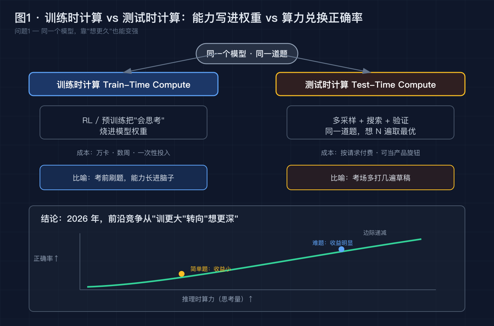
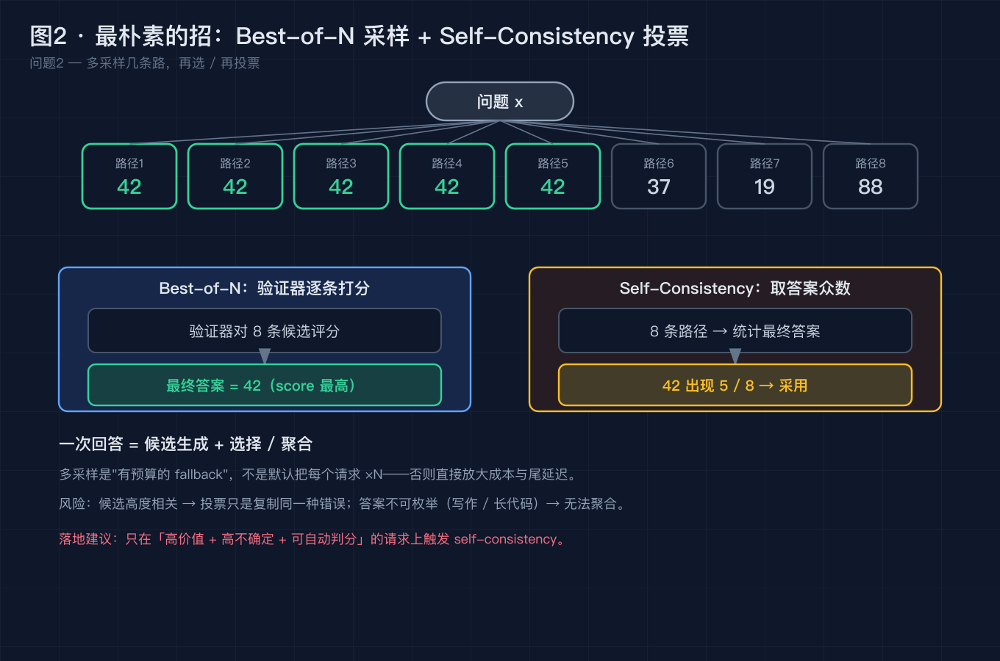
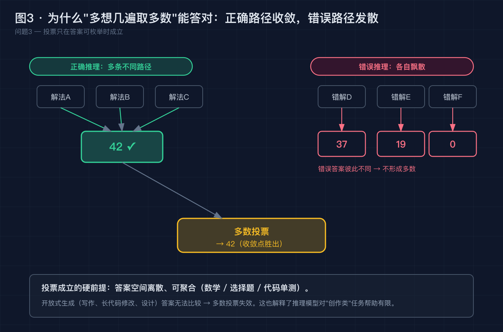
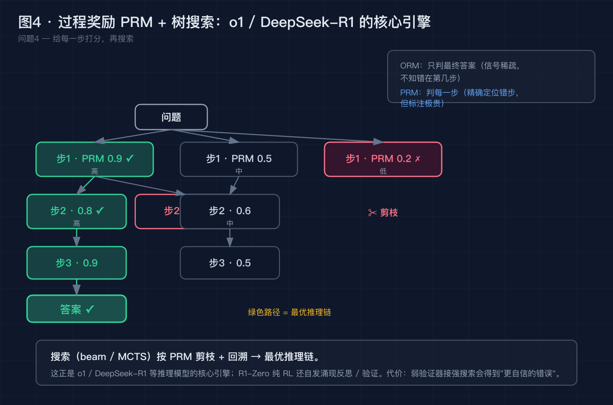
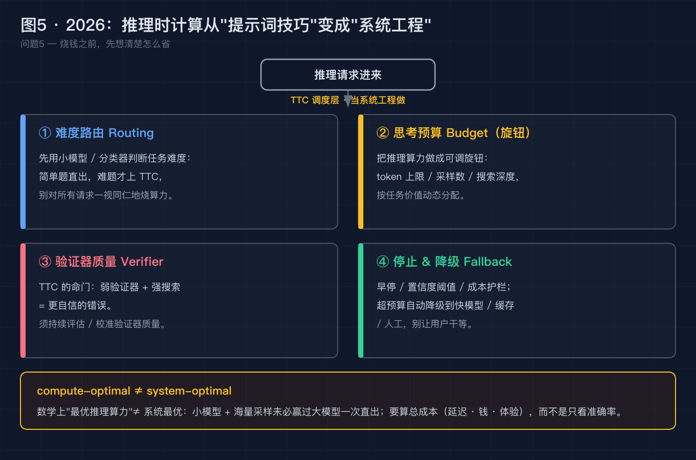

# 权重没动、模型没换，为什么大模型"多想一会儿"就突然变聪明了？

> 本文不堆概念。我们从一个反直觉的事实开始：同一个模型、同一道题，什么都不改，只是"让它多算一会儿"，它就可能从答错变成答对。我们把这件事拆成 5 个递进的小问题，逐个用真实论文和产品解决。最后你会发现：2025–2026 年最火的"推理模型"浪潮，底层就这一件事——**Test-Time Compute（推理时计算）**。

---

## 0. 先看这个反直觉的事实

你给大模型出一道有点绕的数学/逻辑题。第一次，它秒回，错了。你没换模型、没改权重、没换 prompt，只是换了个"让它把思考过程写出来再答"的姿势——它多想了十几秒，答对了。

如果你现在的解释是"模型本来就会，只是没发挥好""再调调 prompt 就行""换个大模型就稳了"——这篇文章就是来推翻这三个直觉的。

真正发生的是：**模型在"测试时"（你提问的那一刻）用的计算量变了。** 这股算力，和你训练它时烧的算力，是两条不同的路。我们把它拆开，一个一个解决。

---

## 问题 1：模型"变强"只有换更大一条路吗？——不，还有测试时计算

**【论点】** 一个模型"变强"有两条路：**训练时计算**（把能力烧进权重，模型更大），和**测试时计算**（提问那一刻让它多算一会儿）。两者在数学上可以互相替代——"更强"不一定等于"更大"。

**【事实】** Snell 等人 2024 年 8 月的论文《Scaling LLM Test-Time Compute Optimally Can be More Effective than Scaling Parameters》（arXiv 2408.03314）给出了最硬的证据：一个 **1B 参数**的小模型，只要给够"最优的推理时计算"，性能可以逼近 **8B** 模型；论文还量化了一个反直觉结论——**每把推理算力翻倍，大约能换来把训练参数翻倍 50%–80% 的收益**。同年起，OpenAI 的 o1 / o3、Anthropic 的 extended thinking，已经把"推理"做成可计数的 reasoning tokens。

**【论证】** 这推翻了一个朴素直觉：**"更强"≠"更大"。** 同一道题、同一个模型，你多给它一份"思考预算"，它就可能在你的现场答对。于是"变强"从"花钱换更大的模型"变成"调一调测试时的算力预算"——这恰恰是推理模型能火起来的底层原因。

> 图 1 · 训练时计算 vs 测试时计算：左侧把"会思考"烧进权重，右侧"多采样 + 搜索 + 验证，想 N 遍取最优"；同一模型、同一道题，正确率随推理算力上升——简单题收益小、难题收益明显、且边际递减。

---

## 问题 2：给模型"多想几遍"到底怎么操作？——Best-of-N 与 Self-Consistency

**【论点】** 推理时计算最朴素的形态，就是**同一个问题采样多条推理路径，再用一个"验证器"挑最好的，或干脆多数投票**。这就是 Best-of-N 与 Self-Consistency。

**【事实】** Wang 等人《Self-Consistency Improves Chain of Thought Reasoning in Language Models》（ICLR 2023）的做法是：对同一题生成多条推理链，取**答案的多数**作为最终输出，在数学推理基准（如 GSM8K）上比单条链的思维链显著提升。另一种叫 Best-of-N：用验证器（ORM，只看最终答案对不对）给每条候选打分，取最高分那一条。

**【论证】** 直觉上"一次答对"靠运气；"想 N 遍、取共识或取最优"把随机性摊平了。但它有个硬代价：**N 倍算力**。所以它本质是一个"有预算才划算"的 fallback，而且只在**答案可自动判分、任务价值高、模型本身不确定**时值得触发——否则就是纯烧钱。

> 图 2 · 问题 x 生成 8 条候选路径（绿色 = 答案 42 出现 5 次）；蓝色框 Best-of-N（验证器打分取最高），琥珀色框 Self-Consistency（取答案众数 42）；底部提示：多采样是有预算的 fallback，风险是候选相关会复制错误、答案不可枚举就无从聚合，只在高价值 + 高不确定 + 可自动判分时触发。

---

## 问题 3：为什么"多想几遍"在有些题上神效，有些题没用？——多数投票的硬前提

**【论点】** 多数投票之所以灵，不是魔法，而是依赖一个**硬前提：错误是"散布的"，正确是"收敛的"**。只要错的方向不约而同重合，投票就把收敛点顶上来。

**【事实】** Self-Consistency 论文的图示与后续分析都显示：正确的推理链往往会**收敛到同一个答案**，而错误的链则**飘散到不同答案**（比如 37、19、0）——所以"取众数"能压制偶发错误。但一旦到了**开放式生成**（没有唯一正确答案、答案无法离散聚合），多数投票就失效了，因为根本不存在可统计的"众数"。

**【论证】** 这正好解释了那句常被提起的话：**推理模型对创作类任务帮助有限。** 创作没有标准答案，既没法投票、也没法用验证器聚合。Test-Time Compute 的甜区，是"有标准答案、能自动判分"的推理任务（数学、代码、逻辑、可验证的规划）——这也是为什么 o1 这类模型最早在竞赛数学和编程上惊艳，而不是在写诗上。

> 图 3 · 左侧绿"正确推理：多路径收敛到 42 ✓"，右侧红"错误推理：各飘散到 37/19/0，不形成多数"；居中琥珀"多数投票 → 42 收敛点胜出"；底部面板：投票的硬前提是答案离散可聚合，开放式生成失效——这正是推理模型对创作类任务帮助有限的原因。

---

## 问题 4：怎么让"想"更聪明？——给每一步打分，再搜索（PRM + 树搜索）

**【论点】** 朴素投票只看"结果对不对"；要更聪明，得**"给每一步打分，再搜索"**。这就是过程奖励模型 PRM + 树搜索，也是 o1 / DeepSeek-R1 这类推理模型的核心引擎。

**【事实】** Lightman 等人《Let's Verify Step by Step》（OpenAI，arXiv 2305.20050，2023）提出 PRM800K 数据集，对推理的**每一步**判分，比只看最终答案的 ORM 更能**精确定位错在哪一步**；搜索（beam search / MCTS）按 PRM 剪枝、回溯，得到最优推理链。DeepSeek-R1（arXiv 2501.12948，2025-01）及其前身 R1-Zero 则走另一条路：用强化学习（含 RLVR 可验证奖励）训练，**让模型自发涌现"反思 / 验证"行为**，而不依赖人工标注每一步。

**【论证】** 但代价很显著：PRM 标注**极贵**（要人工判断每步对错）。更危险的是一句行内共识——**"弱验证器 + 强搜索 = 更自信的错误"**：当验证器把一个其实错的路径误判为对，搜索反而会坚定地把模型带向它，而且表现得很笃定。换句话说，TTC 的上限，很大程度上被你的**验证器质量**锁死了。

> 图 4 · 树状结构：根"问题" → 第一层三步 PRM 打分（0.9 ✓ / 0.5 / 0.2 ✗）→ 第二、三层 → 绿色"答案 ✓"；右侧 ORM/PRM 对比；红色"✂ 剪枝"；底部：搜索按 PRM 剪枝 + 回溯 = 最优推理链，这正是 o1 / DeepSeek-R1 的核心引擎；R1-Zero 纯 RL 还自发涌现反思 / 验证；弱验证器接强搜索 → 更自信的错误。

---

## 问题 5：2026 年要落地，光会"多想"够吗？——从提示词技巧变成系统工程

**【论点】** 当推理算力变成可计量、可调的"预算旋钮"，它就不是提示词技巧，而是一个**生产工程问题**：怎么路由、怎么设预算、怎么管验证器、怎么停。

**【事实】** 2025–2026 的业界共识很明确：s1 论文提出的 budget forcing（强行让模型"再等等"、追加 "Wait" 续想并截断）、RRM（Reward Reasoning Models，微软 + 清华，先显式推理再判分）、以及各家推理模型的"thinking token 预算"可调，都说明**思考预算已经可以做成一个显式旋钮**。但同一时期也被反复提醒一个关键区分：**compute-optimal（论文里数学上的"最优推理算力"）≠ system-optimal（真实系统还要算延迟、钱、用户体验）**。

**【论证】** 所以 2026 年的工程重点不是"无脑多想"，而是把 TTC 当系统来管：

- **难度路由（Routing）**：先用小模型 / 分类器判任务难度，简单题直出，难题才上 TTC，别一视同仁地烧算力；
- **思考预算旋钮（Budget）**：把推理算力做成可调旋钮——token 上限 / 采样数 / 搜索深度，按任务价值分配；
- **验证器质量管理（Verifier）**：验证器是 TTC 的命门，弱验证器 + 强搜索 = 更自信的错误，须持续评估与校准；
- **停止与降级策略（Fallback）**：设早停、置信度阈值、成本护栏，超预算自动降级到快模型 / 缓存 / 人工，别让用户干等。

> 图 5 · 2026：推理时计算从"提示词技巧"变成"系统工程"——难度路由、思考预算旋钮、验证器质量管理、停止 / 降级策略；底部 compute-optimal ≠ system-optimal：小模型 + 海量采样未必赢过大模型一次直出，要算总成本（延迟 · 钱 · 体验）。

---

## 升华：从"换大模型"到"会调度算力"

写到这里，四条可以带走的东西：

1. **两条变强之路。** "更强"不一定是"更大"——训练时计算（更大模型）与测试时计算（更多推理算力）在数学上可互相替代；1B + 最优 TTC ≈ 8B，这件事 Snell 等人已经量化过。
2. **投票有甜区。** Test-Time Compute 最灵的地方，是"有标准答案、能自动判分"的推理任务（数学 / 代码 / 逻辑）；创作类任务没有可聚合的众数，帮助有限——别指望推理模型替你写好文案。
3. **验证器是命门。** 弱验证器 + 强搜索 = 更自信的错误。TTC 的价值上限，被你的验证器质量锁死；这也是为什么"省着用验证器"比"猛堆采样数"更重要。
4. **工程化才是 2026 的题。** 路由 / 预算 / 验证器 / 降级，把"多想"变成可控、可成本化的生产能力，而不是一个烧钱的无底洞。

OpenAI 在 o1 的技术博客里写过一句点题的话：推理模型把"思考"变成了一种可以在测试时按需购买的资源。2026 年，真正分高下的，不是"谁模型大"，而是"谁把这份算力调度得更聪明"。

---

## 回到标题：用一个问题收束全文

把前面 5 个问题串成一条线，论点其实指向同一件事：**模型的"聪明"是可以被临时制造出来的**——训练时计算把它烧进权重，测试时计算在提问那一刻把它借出来；而多采样取共识、给步骤打分再搜索、可验证奖励的 RL，全都是"在测试时把这份算力用得更聪明"的不同姿势。它的甜区是有标准答案、能自动判分的推理任务，它的命门是你的验证器质量，而 2026 年真正要拼的，是把这套东西当系统来路由、定预算、做降级。

所以，回到文章开头那个题目——

> **为什么大模型"多想一会儿"就突然变聪明了？**
> 因为它"变聪明"，从来不是权重被悄悄改了，而是你在测试时临时借给它一条"多采样 + 验证 + 搜索取优"的算力通道，把"会不会"变成了"想没想够"。

而这，恰好合成了一个更值得你带走、也更该问自己的问题——

> **既然"变强"不一定是"更大"，那在自家系统里，你该为哪类任务打开这条算力通道、付多少"思考预算"，又怎么把路由 / 验证器 / 降级调度明白？**

把这个问题答好，比单纯"换个更大的模型"，更接近 2026 年这波推理模型浪潮的真相。

---

## 互动时间

回到开头那个事实：同一模型、同题，多想十几秒就从错变对。

**你现在的直觉是哪一种——"模型本来就会只是没发挥好"、"换个大模型就稳了"，还是已经开始在自家系统里做"思考预算"的旋钮了？**

欢迎在评论区**贴上你被推理模型惊艳（或翻车）的现场**（脱敏即可）：是数学竞赛题上它突然开窍，还是创作 / 开放问答里它想了半天还是一本正经地胡说？也欢迎聊聊：你现在是停留在"多采样取共识"，还是已经上到了 PRM + 树搜索，甚至开始做难度路由和降级策略了？

如果这篇对你有用，点个赞或收藏，让更多还在"无脑换大模型"的同事看到：**变强不一定靠更大，有时候只是让它多想一会儿——但怎么调度这份算力，才是真功夫。**

---

### 参考来源（均可核实）

- Snell, Charlie et al. 《Scaling LLM Test-Time Compute Optimally Can be More Effective than Scaling Parameters》（arXiv 2408.03314，2024-08）：1B + 最优推理时计算 ≈ 8B；推理时与训练时可替代；每翻倍推理算力 ≈ 翻倍训练参数 50%–80% 收益
- Wang, Xuezhi et al. 《Self-Consistency Improves Chain of Thought Reasoning in Language Models》（ICLR 2023）：多推理链 + 多数投票，数学推理显著优于单链 CoT
- Lightman, Hunter et al. (OpenAI) 《Let's Verify Step by Step》（arXiv 2305.20050，2023）：PRM800K，过程奖励模型，对每一步判分，优于只看最终答案的 ORM
- OpenAI o1 / o3 技术博客与公告（2024）：把推理做成可计数的 reasoning tokens，推理时计算产品化
- Anthropic extended thinking 官方文档（随 Claude 3.7 Sonnet，2025-02）：思考令牌可计量、可调
- DeepSeek-AI 《DeepSeek-R1: Incentivizing Reasoning Capability in LLMs via Reinforcement Learning》（arXiv 2501.12948，2025-01）：R1 与 R1-Zero，RL / RLVR 让反思、验证自发涌现
- Muennighoff et al. 《s1: Simple test-time scaling》（2025）：budget forcing，通过追加 "Wait" 强制续想 + 截断来控制思考预算
- Microsoft + 清华 RRM（Reward Reasoning Models，2025）：先显式推理再判分
- Best-of-N / Tree of Thoughts（Yao et al., 2023）/ MCTS / beam search：推理时搜索的经典方法
- GRPO / DAPO / PPO：推理模型的策略优化算法（DeepSeek、字节等公开技术报告）

---

### 【发布前删除】图片 CDN 替换清单

本文 5 张配图已生成为本地 PNG（位于 `diagram/test-time-compute/`）。发布到掘金前，请按下面顺序把正文里的本地路径替换成掘金图床 CDN 链接：

| 顺序 | 正文里搜这个本地路径 | 替换成 |
| --- | --- | --- |
| 图 1 | `./diagram/test-time-compute/01-train-vs-test-compute@2x.png` | 掘金上传后得到的 CDN 链接 |
| 图 2 | `./diagram/test-time-compute/02-best-of-n-self-consistency@2x.png` | 掘金上传后得到的 CDN 链接 |
| 图 3 | `./diagram/test-time-compute/03-why-voting-works@2x.png` | 掘金上传后得到的 CDN 链接 |
| 图 4 | `./diagram/test-time-compute/04-prm-tree-search@2x.png` | 掘金上传后得到的 CDN 链接 |
| 图 5 | `./diagram/test-time-compute/05-systematization-2026@2x.png` | 掘金上传后得到的 CDN 链接 |

替换完成后，连同本"替换清单"小节一起删除即可。
