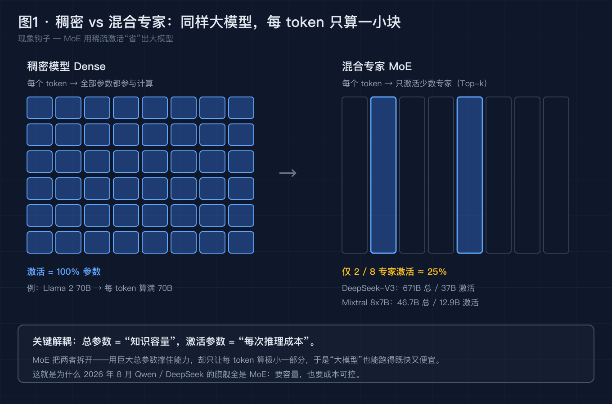
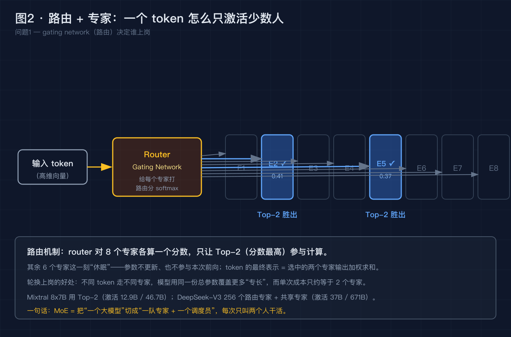
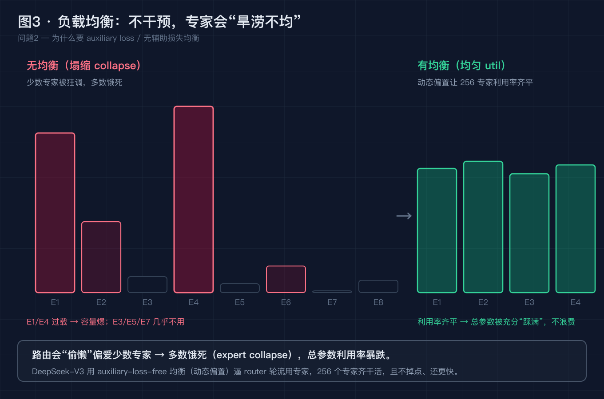
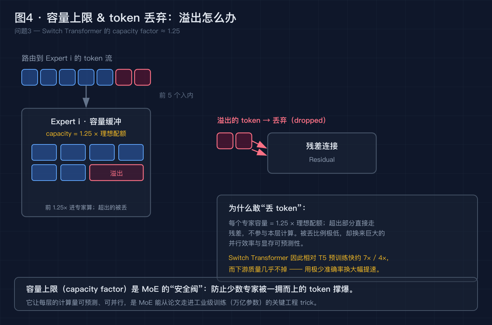
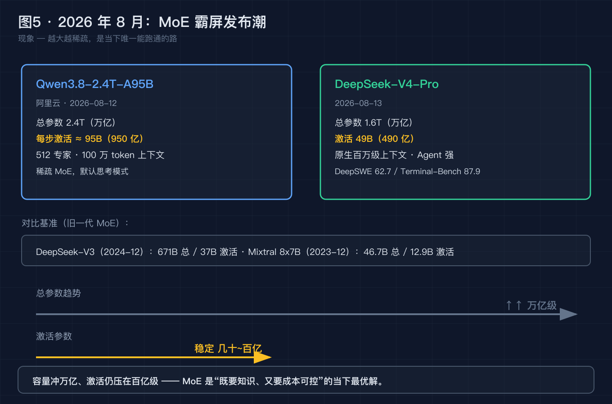

# 万亿参数模型，每 token 只算几十亿？揭秘混合专家 MoE 怎么"省钱"变聪明

> 本文不堆概念。我们从 2026 年 8 月最炸裂的两条新闻开始——一个 2.4 万亿参数、一个 1.6 万亿参数——把它们拆成 5 个递进的小问题，逐个用事实和数据解决。最后你会发现：**"大模型越来越贵"这个直觉，正在被一种叫混合专家（Mixture of Experts, MoE）的架构彻底推翻。**

---

## 0. 先别急着看答案，看这两条新闻

2026 年 8 月中旬，AI 圈连续被两颗"万亿级炸弹"刷屏：

**第一条（阿里云，8 月 12 日）：Qwen3.8-2.4T-A95B**

- 总参数 **2.4 万亿（2.4T）**
- 每步只激活约 **95B（950 亿）**
- **512 个专家**，稀疏 MoE 架构
- 默认思考模式，100 万 token 上下文

**第二条（DeepSeek，8 月 13 日）：DeepSeek-V4-Pro**

- 总参数 **1.6T（万亿）**
- 激活仅 **49B（490 亿）**
- 原生百万级上下文
- Agent 能力大幅跃升（DeepSWE 62.7、Terminal Bench 87.9）

如果你现在的直觉是"万亿参数 = 推理贵到天际"——这篇文章就是来推翻它的。

---

## 问题 1：MoE 到底在干什么？——把"总参数"和"激活参数"拆开

**【论点】** 传统稠密模型（Dense），每个 token 都要过全部参数；MoE 模型把参数切成多个"专家"，每个 token 只让少数专家干活——**总参数撑住知识容量，激活参数控制推理成本。**

**【事实】** 这不是新概念，但 2026 年把它推到了极致：

| 模型 | 总参数 | 每 token 激活 | 架构 |
|------|--------|-------------|------|
| Llama 2 70B | 70B | **70B（100%）** | Dense |
| Mixtral 8x7B（Mistral, 2023-12） | 46.7B | **12.9B（≈27%）** | MoE, Top-2, 8 专家 |
| DeepSeek-V3（2024-12） | 671B | **37B（≈5.5%）** | DeepSeekMoE, 256 路由专家 + 共享专家 |
| Qwen3.8-2.4T-A95B（2026-08） | 2.4T | **≈95B（≈4%）** | 稀疏 MoE, 512 专家 |
| DeepSeek-V4-Pro（2026-08） | 1.6T | **49B（≈3%）** | MoE |

**【论证】** Mixtral 的论文（arXiv:2401.04088）明确指出：相比 Llama 2 70B 这种全量稠密模型，Mixtral 46.7B 的 MoE 在同等质量下**快了约 6 倍**——因为每次推理只算 12.9B 而非 70B。而 DeepSeek-V3 更极端：671B 的巨无霸，每 token 只算 37B——相当于用一个"超大脑子"里极小的一块区域来回答问题。

> 图1 · 稠密 vs 混合专家：同样大模型，每 token 只算一小块 —— 左侧稠密模型 100% 参数参与计算；右侧 MoE 仅 2/8 专家激活（Top-2）。DeepSeek-V3 671B 总 / 37B 激活，Mixtral 46.7B 总 / 12.9B 激活。

核心直觉：**总参数 = "你读过多少书"；激活参数 = "你现在脑子里在想什么"。** MoE 让模型读了整个图书馆，但每次只调取其中几本书的智慧。

---

## 问题 2：路由怎么决定谁上岗？——一个 token 的"面试流程"

**【论点】** MoE 的核心不是"有很多专家"，而是那个**路由器（Router / Gating Network）**——它给每个专家打分，只让分数最高的 k 个（Top-k）参与本次计算。

**【事实】** 以 Mixtral 8x7B 为例：

- 8 个前馈网络（FFN）作为独立"专家"
- 每个 token 经过路由器 → 输出 8 个门控分数（softmax 归一化）
- 取 **Top-2**（分数最高的 2 个专家）做前向传播
- 最终输出 = 两个专家输出的加权求和

DeepSeek-V3 更复杂：**256 个路由专家 + 共享专家**，采用 DeepSeekMoE 架构（Wang et al., arXiv:2412.19437）。关键创新是 **auxiliary-loss-free 负载均衡**——不用传统辅助损失也能让专家利用率均匀（问题 3 会展开）。

> 图2 · 路由 + 专家：token 进来 → Router 打分 → Top-2 胜出 → 其余 6 个休眠。Mixtral 用 Top-2（激活 12.9B/46.7B）；DeepSeek-V3 有 256 个路由专家 + 共享专家（激活 37B/671B）。

**【论证】** 不同 token 走不同专家，意味着同一份总参数可以覆盖更多"专长"。一个 token 可能走"代码专家"+ "数学专家"，另一个走"中文专家"+ "逻辑专家"——轮换上岗，各司其职。

一句话总结：**MoE = 把一个大模型切成"一队专家 + 一个调度员"，每次只叫几个人干活。**

---

## 问题 3：不干预会怎样？——专家塌缩（Expert Collapse）

**【论点】** 如果不加约束，路由器会"偷懒"——反复偏爱少数几个专家，导致多数专家饿死、少数过载。这叫 **expert collapse（专家塌缩）**，是所有 MoE 训练的头号敌人。

**【事实】** 这个问题从 MoE 诞生第一天就存在：

- **Switch Transformer**（Fedus, Zoph, Shazeer, 2021, arXiv:2101.03961）：Google 的 1.6T 参数 MoE，每层 128 个专家，Top-1 routing。它引入了 **auxiliary load balancing loss**（辅助负载均衡损失）来强制 router 轮流使用所有专家。
- **GLaM**（Google, 2021, arXiv:2112.06905）：1.2T 参数，Top-2，同样依赖 auxiliary loss。
- **DeepSeek-V3（2024）**：抛弃了辅助损失，改用 **auxiliary-loss-free 均衡**（动态偏置 bias），让 256 个专家利用率均匀且不掉点。

> 图3 · 负载均衡对比：左侧无均衡时少数专家过载（红色高柱）、多数饿死（几乎看不见）；右侧有均衡时利用率齐平（绿色均匀柱）。DeepSeek-V3 用动态偏置实现后者。

**【论证】** 为什么不能让专家"自然分工"？因为路由器的优化目标是"最小化当前 loss"，最快的方式就是反复调用最强的那几个专家——就像一个团队里永远只派最能干的两个人干活，其他人越来越废。auxiliary loss 或动态偏置的本质就是**人为制造"公平竞争环境"**，逼 router 把活分出去。

---

## 问题 4：容量上限 & token 丢弃——MoE 的"安全阀"

**【论点】** 当大量 token 同时涌向同一个专家怎么办？MoE 引入了 **capacity factor（容量因子）**——给每个专家设一个缓冲上限，超出部分直接丢弃（dropped），走残差连接。

**【事实】** Switch Transformer 的工程设定：

- **Capacity factor ≈ 1.25**：每个专家的理想配额 × 1.25 = 实际缓冲大小
- 当某专家接收的 token 数超过缓冲容量 → **溢出 token 被 dropped**
- 被丢掉的 token 不经过本层专家计算，直接通过残差连接传到下一层
- 被丢比例极低（通常 < 1%），但换来的是：
  - **预训练加速约 7×**（相对同规模 T5）
  - **推理 FLOPs 减半**
  - 下游任务质量几乎不降

> 图4 · 容量上限与 token 丢弃：token 流入 Expert i → 前 1.25× 进入缓冲计算 → 溢出的 token 走残差连接（Residual）。Switch Transformer 因此相对 T5 预训练快约 7×/4×，下游质量几乎不掉。

**【论证】** 容量因子是 MoE 能从论文走进工业级训练的关键 **engineering trick**。它让每层的计算量可预测、可并行——训练框架可以提前分配好每个 expert 的显存和算力，不用动态扩容。代价是被丢弃的那极少量 token 本层"没学到东西"，但残差连接保证了信息不中断。

---

## 问题 5：为什么 2026 年 8 月全是 MoE？

**【论点】** 当总参数冲向万亿级别，稠密模型的成本已经不可承受；MoE 是目前唯一能同时满足"大容量 + 可控成本 + 高质量"三条线的架构选择。

**【事实一：8 月发布潮本身就是证据】**

Qwen3.8-2.4T-A95B 和 DeepSeek-V4-Pro 几乎同期发布，都是 MoE，都冲万亿参数——这不是巧合，而是行业共识。

**【事实二：历史脉络清晰可追溯】**

| 时间 | 里程碑 | 意义 |
|------|--------|------|
| 2017 | Shazeer et al., *Outrageously Large Neural Networks*（arXiv:1701.06538） | Sparsely-Gated MoE 奠基，Top-k gating + auxiliary loss |
| 2021 | Switch Transformer（arXiv:2101.03961） | 1.6T 参数，Top-1，capacity factor，bfloat16 稳定训练 |
| 2021 | GLaM（Google, arXiv:2112.06905） | 1.2T，比 GPT-3 省 1/3 能源 |
| 2023-12 | Mixtral 8x7B（Mistral AI） | Apache 2.0 开源，比 Llama 2 70B 快 ~6×，MoE 进入主流视野 |
| 2024-12 | DeepSeek-V3（arXiv:2412.19437） | 671B/37B，auxiliary-loss-free 均衡，FP8 训练，14.8T token 预训练 |
| 2026-08 | Qwen3.8-2.4T-A95B | 2.4T/95B，512 专家，百万上下文 |
| 2026-08 | DeepSeek-V4-Pro | 1.6T/49B，Agent 能力跃升 |

> 图5 · 2026 年 8 月 MoE 发布潮：Qwen 冲 2.4T 总参 / 95B 激活；DeepSeek V4-Pro 1.6T / 49B。趋势线：总参数 ↑↑ 万亿级，激活参数稳定在几十~百亿级。

**【论证】** 从 2017 到 2026，MoE 经历了三个阶段：**理论奠基（Shazeer）→ 工程可行（Switch/GLaM）→ 开源普及（Mixtral）→ 万亿级量产（DeepSeek/Qwen）**。每一代都在验证同一个结论：**当你要更大的模型，MoE 是唯一经济上跑得通的路。**

---

## 升华：MoE 不是"省钱的妥协"，是"更聪明的分工"

写到这里，三条可以带走的东西：

1. **解耦思维。** 总参数和激活参数的解耦，是理解现代大模型的关键钥匙。不要看到"万亿参数"就怕——问一句"激活多少"，才是真正的成本。
2. **路由即调度。** MoE 的本质不是"砍参数"，而是"动态调度"。一个好的 MoE 模型，其路由器学到的不是"谁最强"，而是"谁最适合处理这类输入"。
3. **工程约束塑造架构。** capacity factor、负载均衡、共享专家——这些不是锦上添花，而是没有它们 MoE 根本训不出来、跑不稳。**原理漂亮，工程更硬。**

Noam Shazeer（Switch Transformer 一作，后来 co-founded Character.AI / DeepMind）早在 2017 年就看到了这条路。2026 年的今天，这条路终于成了主干道。

---

## 回到标题：用一个问题收束全文

**问题：万亿参数模型，每 token 只算几十亿——这到底是"偷工减料"还是"更聪明的做法"？**

**一句话答案：是更聪明的做法。** 就像一个拥有 256 位顶级专家的公司，每次开会只叫最相关的 2~3 位发言——决策质量反而更高，因为每个人都在自己最擅长的领域贡献，而不是所有人都在说正确的废话。

**合成问题留给你：** 如果你来设计下一代 MoE 模型，你会选更多专家（如 DeepSeek 的 256 个）还是更少（如 Mixtral 的 8 个）？专家数量和单专家容量之间，你觉得最优平衡点在哪？

---

## 互动时间

读完这篇，你可能注意到：**你日常用的很多"大模型"其实已经是 MoE 了**——只是厂商宣传时很少主动提这个架构细节。

- 你用过 GPT-4 吗？它是 MoE。
- 你用过 Claude 3 吗？它也是 MoE。
- 你刚看到的 Qwen 2.4T、DeepSeek V4-Pro？更是明牌 MoE。

**你在实际使用中，有没有感觉某些模型"又快又强"得不太合理？回头查查架构，说不定就是 MoE 在背后起作用。**

欢迎在评论区聊聊：
1. 你之前知道 MoE 这个概念吗？
2. 如果让你给自己的项目选架构——Dense 还是 MoE？理由是什么？

如果这篇对你有用，点个赞或收藏，让更多还在"以为大模型=全量稠密"的同学看到：**2026 年的旗舰模型，早就不是你以为的那个样子了。**

---

### 参考来源（均可核实）

- Shazeer et al., *Outrageously Large Neural Networks: The Sparsely-Gated Mixture-of-Experts Layer*, arXiv:1701.06538, 2017 — Sparsely-Gated MoE 奠基，Top-k gating, auxiliary loss 防 expert collapse
- Fedus, Zoph, Shazeer, *Switch Transformers: Scaling to Trillion Parameter Models with Simple and Efficient Sparsity*, arXiv:2101.03961, JMLR 2022 — 1.6T 参数, Top-1, capacity factor ≈ 1.25, token dropping, bfloat16, 相对 T5 加速 7×/4×
- Du et al., GLaM: Generalist Language Model with Mixture of Experts, arXiv:2112.06905, Google 2021 — 1.2T, Top-2, ~37B 激活, 比 GPT-3 省 1/3 能源, FLOPs 减半
- Mistral AI, *Mixtral of Experts*, mistral.ai 官方博客 + arXiv:2401.04088, 2023-12-09 / 2024-01-08 — 46.7B 总 / 12.9B 激活, Top-2, 8 experts, Apache 2.0, 比 Llama 2 70B 快 ~6×
- DeepSeek-AI, *DeepSeek-V3: Technical Report*, arXiv:2412.19437, 2024-12-26 — 671B 总 / 37B 激活, DeepSeekMoE (256 routed + shared), auxiliary-loss-free 均衡, FP8 训练, 14.8T token 预训练, Multi-Token Prediction
- 阿里云 Qwen 团队, Qwen3.8-2.4T-A95B 发布说明, 2026-08-12 — 2.4T 总 / ~95B 激活, 512 专家, 稀疏 MoE, 百万 token 上下文, 默认思考模式
- DeepSeek-AI, DeepSeek-V4-Pro 发布说明, 2026-08-13 — 1.6T 总 / 49B 激活, Agent 能力跃升 (DeepSWE 62.7, Terminal Bench 87.9), 开源 DeepSeek Harness 框架

---

### 【发布前删除】图片 CDN 替换清单

本文 5 张配图已生成为本地 PNG（位于 `diagram/moe/`）。发布到掘金前，请按下面顺序把正文里的本地路径替换成掘金图床 CDN 链接：

| 顺序 | 正文里搜这个本地路径 | 替换成 |
| --- | --- | --- |
| 图 1 | `./diagram/moe/01-dense-vs-moe@2x.png` | 掘金上传后得到的 CDN 链接 |
| 图 2 | `./diagram/moe/02-router-experts@2x.png` | 掘金上传后得到的 CDN 链接 |
| 图 3 | `./diagram/moe/03-load-balancing@2x.png` | 掘金上传后得到的 CDN 链接 |
| 图 4 | `./diagram/moe/04-capacity-token-dropping@2x.png` | 掘金上传后得到的 CDN 链接 |
| 图 5 | `./diagram/moe/05-2026-moe-trend@2x.png` | 掘金上传后得到的 CDN 链接 |

替换完成后，连同本"替换清单"小节一起删除即可。
