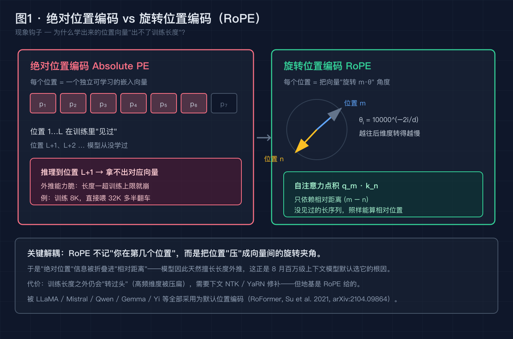
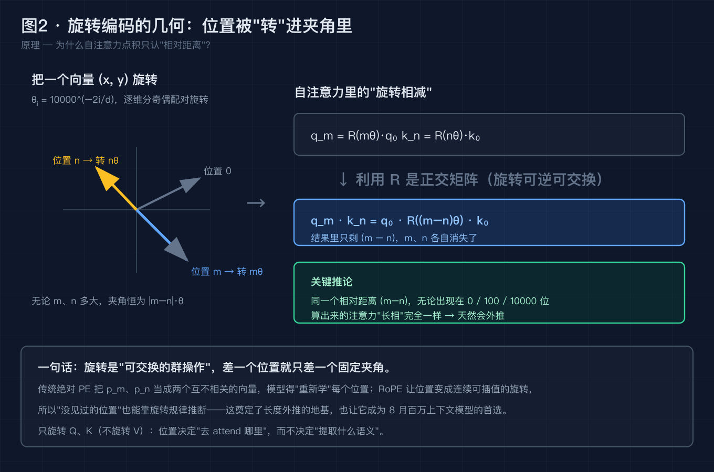
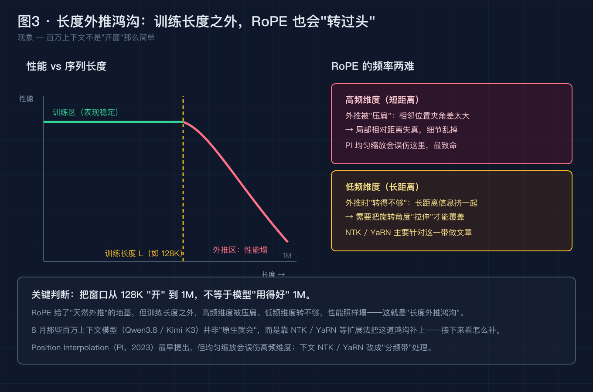
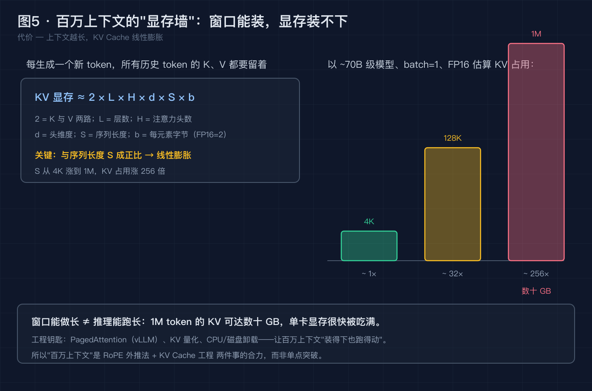

# 上下文窗口都卷到 100 万了，大模型为什么还在为"位置"发愁？

> 本文不堆概念。我们从一个 8 月真实刷屏的新闻开始，把它拆成 6 个递进的小问题，逐个用事实和数据解决。最后你会发现：2026 年 8 月最火的那个词——**百万上下文**，踩中的正是 2021 年一个被低估的老发明：**RoPE（旋转位置编码）**。

---

## 0. 先别急着喊"窗口真大"，看这个 8 月新闻

2026 年 8 月 12–13 日，阿里云开源 **Qwen3.8-2.4T-A95B**：总参数 2.4 万亿，每步激活约 950 亿，原生上下文 **262,144 tokens**，官方页写可一路扩展到 **1,010,000 tokens（约 100 万）**。

同一周，8 月 7 日，**Kimi K3** 发布：2.8 万亿参数、原生 **100 万 token** 上下文。

一个词在 8 月被彻底炒热：**长上下文**。

但有一个反直觉的事实，几乎没人提：这些"百万上下文"模型的**位置编码**，无一例外都建立在 2021 年的一篇论文 **RoPE（RoFormer, Su et al., arXiv:2104.09864）** 之上。

如果你现在的直觉是"窗口越大越厉害，就是个堆显存、堆工程的体力活"——这篇文章就是来推翻这个直觉的。我们把它拆开，一个一个解决。

---

## 问题 1：长上下文的真门槛，是"容量"还是"位置"？

**【论点】** 当你说"模型上下文不够长"时，第一嫌疑不该是显存或工程，**而是"位置编码"能否让模型在远超训练长度时，依然认得清"第几个字、谁在谁前面"。**

**【事实】** 自注意力机制本身是**置换不变（permutation-invariant）**的——你把输入句子的顺序打乱，它算出来的东西一模一样。也就是说，模型**天生不知道 token 的顺序**。顺序信息，完全是靠"位置编码"人为注进去的。

而 Qwen3.8、Kimi K3、LLaMA、Mistral、Gemma、Yi 这些长上下文模型，位置编码清一色选了 **RoPE**（LLaMA 2/3、Mistral、Mixtral、Qwen、Yi、Gemma、PaLM 等全部采用为默认 PE）。这不是巧合，是因为想在"远超训练长度"时还稳，RoPE 是当前最被验证的一条路。

**【论证】** 这说明一件反直觉的事：**窗口只是内存容量，位置编码才是"能不能用"的开关。** 你把窗口从 8K 开到 1M，模型能不能真的"看懂"那 1M 里的顺序和长程依赖，不取决于显存够不够，而取决于位置编码在训练长度之外还"转不转得动"。容量是肌肉，位置是神经——肌肉大没用，神经断了照样动不了。

> 图 1 · 绝对位置编码 vs RoPE：绝对 PE 把每个位置当独立向量"学"出来，位置 L+1 没见过就崩；RoPE 把位置压成向量间的旋转夹角，使注意力只认相对距离。



---

## 问题 2：位置编码到底是干嘛的？为什么"绝对位置"出不了训练长度？

**【论点】** 既然模型天生不认顺序，我们就得给它注入顺序。但**"绝对位置编码"的注入方式天生有缺陷**：它把每个位置当成一个独立可学习的向量，导致"没见过的位置"直接失效。

**【事实】** 最早的"绝对位置编码（Absolute PE）"思路很直白：位置 1 对应一个向量 p₁，位置 2 对应 p₂……位置 L 对应 p_L，跟着模型一起训练。听起来没问题，但它有一个硬伤——**训练时只见过 1…L 的位置，位置 L+1 从来没学过**。一旦推理时序列超过训练长度，模型拿不出对应的 p_{L+1}，结果就是外推能力极脆。

**【论证】** 这直接解释了无数人踩过的坑：**"训练 8K，直接喂 32K，多半翻车"。** 不是模型笨，是它从没见过第 8001 个字该对应哪个向量。绝对 PE 把位置当成了一张"背下来的名单"，名单之外一律不认——这跟"长上下文"的目标，从根上就矛盾。

> 图 2 · RoPE 的几何：把向量旋转。θᵢ = 10000^(−2i/d)，每个位置转 m·θ；关键在数学上，q_m · k_n 的点积只依赖 (m−n)。



---

## 问题 3：RoPE 凭什么"天然会外推"？——把位置压成旋转夹角

**【论点】** RoPE 的聪明之处，是不去记"你在第几个位置"，而是**把位置"压"成向量之间的旋转夹角**。于是"没见过的位置"也能靠旋转规律推断出来。

**【事实】** RoPE（Rotary Position Embedding，提出于 2021 年，arXiv:2104.09864）用的是一组**位置相关的旋转矩阵**：

- 频率公式 `θᵢ = 10000^(−2i/d)`，越靠后的维度转得越慢；
- 2D 旋转把一对维度 `(x, y)` 变成 `(x·cos(mθ) − y·sin(mθ), x·sin(mθ) + y·cos(mθ))`；
- 它**只旋转 Q（查询）和 K（键），不旋转 V（值）**——因为位置决定的是"去 attend 哪里"，而不是"提取什么语义"；
- 最关键的数学性质：**自注意力里的点积 q_m · k_n，结果只依赖相对距离 (m − n)**。

**【论证】** 这就解释了 RoPE 为什么"天然会外推"：**旋转是一个可交换的群操作，差一个位置就只差一个固定夹角。** 同一个相对距离 (m−n)，无论出现在第 0 位、第 100 位还是第 10000 位，算出来的注意力"长相"完全一样。传统绝对 PE 把 p_m、p_n 当成两个互不相关的向量，模型得"重新学"每个位置；RoPE 让位置变成连续可插值的旋转，所以没见过的位置也能推断。正是这个性质，成了 8 月百万上下文模型默认选它的地基。

---

## 问题 4：那 RoPE 为什么也救不了"直接上 1M"？——长度外推鸿沟

**【论点】** RoPE 给了"天然外推"的地基，但**训练长度之外，它照样会"转过头"**：高频维度被压扁、低频维度转不够，性能还是会塌。把窗口从 128K "开"到 1M，不等于模型"用得好" 1M。

**【事实】** RoPE 的频率是分层的，外推时两头发难：

- **高频维度（短距离）**：外推时被"压扁"，相邻位置的夹角差变得过大，导致**局部相对距离失真**、细节乱掉——这是 Position Interpolation（PI，2023）均匀缩放最容易误伤的地方；
- **低频维度（长距离）**：外推时"转得不够"，长距离信息全挤在一起，需要**把旋转角度"拉伸"**才能覆盖。

性能曲线也印证了这点：在训练长度 L（如 128K）之内，表现稳定；一旦越过 L 进入外推区，性能明显下塌——这道坎被叫做**"长度外推鸿沟"（Length Extrapolation Gap）**。

**【论证】** 所以 8 月那些百万上下文模型（Qwen3.8 / Kimi K3），**并非"原生就会"** 在 1M 上表现好，而是靠后文的 NTK / YaRN 等扩展法，把这道鸿沟补上。RoPE 是地基，但地基之上还得有"修补频率维度"的工法——否则开窗只会更早、更隐蔽地塌。

> 图 3 · 长度外推鸿沟：训练区内性能稳定，越过训练长度 L 后性能塌；RoPE 的频率两难——高频被压扁、低频转不够。



---

## 问题 5：8 月这些百万上下文，到底怎么补上这道鸿沟的？——NTK / YaRN 分频带

**【论点】** 解法不是"一刀切地缩放所有频率"，而是**按波长把频率维度分成三带，分别对待**。这正是 8 月百万上下文能成立的原理层原因。

**【事实】** 早期 **Position Interpolation（PI，2023）** 提出把频率均匀缩放 `θᵢ' = θᵢ / s`（s = L'/L），但会误伤高频。随后的两条主线改成了"分频带"：

- **NTK-aware / NTK-by-parts / 动态 NTK（bloc97，2023）**：通过改基 `b' = b·s^(|D|/(|D|−2))`，把缩放压力分散到不同波长；按波长 λ_d = 2π·b^(2d/|D|) 处理——高频不插值、低频插值、中间用斜坡过渡。Code Llama 用 NTK-aware 实现 100K，Qwen 系常用动态 NTK。
- **YaRN（Yet another RoPE extensioN，Peng et al., 2023, arXiv:2309.00071）**：三频带处理——
  - 低频（长波长）：线性插值，把旋转角度"拉伸"覆盖更长距离；
  - 中频：NTK 斜坡混合 γ(r)，在"动"与"不动"间平滑过渡；
  - 高频（短波长）：**原样不动**，保护局部相对距离（这正是 PI 误伤、而分频带能保住的地方）。
  - 额外加一道**注意力温度** `t = 0.1·ln(s) + 1`，把缩放后偏移的注意力分布拉回合理尺度。
  - 只需约 **400 步微调**就能把 4K 模型扩到 128K（比 PI 少 2.5× 步数、少 10× token），被 **Mistral 7B v0.2（8k→32k）、Qwen2 系列**采用。

**【论证】** 看明白这条链路，你就懂了"百万上下文"的真正分量：它**不是单点工程突破，而是"RoPE 地基 + NTK/YaRN 频率修补 + 少量微调"的合力结果**。8 月各家比的不是"谁窗口数字更大"，而是谁把这套 2021 年原理工程化得更稳——Qwen3.8 的百万上下文，底层就是动态 NTK 这类扩展法在兜底。

> 图 4 · NTK / YaRN：把频率维度分三带修补（低频插值 / 中频 NTK 斜坡 / 高频不动），YaRN 再加注意力温度 t=0.1·ln(s)+1。


---

## 问题 6：但还有一个"显存墙"——窗口能做长，不等于推理能跑长

**【论点】** 即便位置编码把"外推鸿沟"补上了，**还有一个工程代价绕不开：KV Cache 显存随上下文线性膨胀**。窗口能做长，不代表单卡显存装得下、跑得动。

**【事实】** 自回归生成时，每新出一个 token，所有历史 token 的 K（键）和 V（值）都要留着参与注意力计算。KV Cache 显存近似：

```
KV 显存 ≈ 2 × L × H × d × S × b
```

其中 2 = K、V 两路，L = 层数，H = 头数，d = 头维度，S = 序列长度，b = 每元素字节（如 FP16=2）。**关键：与序列长度 S 成正比，线性膨胀。** 以 ~70B 级模型、FP16、batch=1 估算，S 从 4K 涨到 1M，KV 占用涨约 256 倍，1M token 的 KV 可达**数十 GB**——单卡显存很快被吃满。

**【论证】** 所以"百万上下文"是**两件事的合力**：① 原理层，RoPE + NTK/YaRN 让模型"认得清"长序列；② 工程层，PagedAttention（vLLM）、KV 量化、CPU/磁盘卸载让长 KV "装得下、跑得动"。只谈窗口数字不谈显存墙，等于只看马力不看油箱——这也是为什么很多"支持 1M"的模型，真到 1M 时要么巨慢、要么巨贵、要么得靠批处理摊薄。

> 图 5 · 百万上下文的显存墙：KV Cache 与序列长度 S 成正比，1M token 可达数十 GB；窗口能做长 ≠ 推理能跑长。



---

## 升华：从"窗口多大"到"位置怎么编码"

写到这里，三条可以带走的东西：

1. **瓶颈转移定律（续集）。** 当窗口数字不再是稀缺资源，"长上下文"竞争的不再是容量，而是**位置编码的外推质量**——地基（RoPE）决定上限，扩展法（NTK/YaRN）决定你能把它用多远。
2. **位置是模型的"顺序神经"。** 自注意力天生不认顺序，所有顺序感都是位置编码硬注进去的。选错位置编码，再大的窗口也只是"装了一堆认不清先后的字"。
3. **长上下文 = 原理 + 工程的合力，不是单点突破。** RoPE 给地基，NTK/YaRN 补鸿沟，KV Cache 工程扛显存墙——三者缺一，"百万上下文"都只是发布会上的漂亮数字。

2021 年的 RoPE 论文，当年并不算最火。但当它成为 LLaMA、Qwen、Mistral 们默认的位置编码，又被 2026 年 8 月的百万上下文热潮反复"调用"，这个 5 年前的老发明，反而成了当下最被需要的原理之一。

---

## 回到标题：用一个问题收束全文

前面 6 个问题，其实只回答了一件事：**为什么窗口都卷到 100 万了，大模型还在为"位置"发愁？**

把论点结论收一下：

- **论点一**：窗口只是内存容量，"位置编码"才是模型认字、认顺序、认长程依赖的地基——卷长上下文，本质是卷位置编码。
- **论点二**：RoPE 用"旋转夹角"把绝对位置压成相对距离，是天然外推的地基；但训练长度之外仍有高频压扁、低频转不够的"外推鸿沟"。
- **论点三**：8 月百万上下文 = RoPE 地基 + NTK/YaRN 分频带补鸿沟 + KV Cache 工程扛显存墙，三者合力，而非单点突破。

一句话答案：

> **因为窗口只是容量，"位置"才是模型理解长文本的地基；而百万上下文真正的硬仗，是 2021 年的 RoPE 原理，被工程化成了今天你能用得起的 1M。**

那么，合成一个问题，回扣标题：

**既然"百万上下文"不是把窗口数字调大，而是"改位置编码 + 扛显存墙"的合力——你下次评估一个长上下文模型时，会先问它的窗口数字，还是先问它用的哪套 RoPE 扩展法、KV Cache 怎么省？**

---

## 互动时间

回到开头的 8 月新闻：Qwen3.8 把上下文开到约 100 万 token，Kimi K3 也原生 100 万。

**你现在再看到"支持 XXX 万 token 上下文"的宣传，第一反应会去查哪一层？是只看窗口数字、还是去翻它用的位置编码（RoPE 哪套扩展）、还是关心 KV Cache 到底怎么省显存？**

欢迎在评论区**贴上你被"长上下文"坑过的现场**（脱敏即可）：是长文本 summarizing 到最后突然胡言乱语？还是上下文一拉满，显存爆了、推理慢成PPT？我们可以一起用"RoPE 外推 + KV Cache 显存墙"这套框架拆——到底是哪一层先到的天花板。也欢迎聊聊：你现在用的是原生长上下文，还是靠 NTK/YaRN 把短上下文模型"撑"长的？

如果这篇对你有用，点个赞或收藏，让更多还在"只看窗口数字"的同事看到：**窗口大不等于用得好，真正的硬仗在位置编码和显存墙。**

---

### 参考来源（均可核实）

- Su, Lu, Pan, Murtadha, Wen, Liu，《RoFormer: Enhanced Transformer Rotation Position Embedding》，2021，arXiv:2104.09864（2021-04-20 提交，2023-11-08 v5）：RoPE 旋转位置编码，公式 θᵢ=10000^(−2i/d)、2D 旋转、点积仅依赖相对距离 (m−n)、仅旋转 Q/K；被 LLaMA/Mistral/Qwen/Gemma/Yi/PaLM 等采用为默认 PE
- Chen et al. / kaiokendev，Position Interpolation（PI），2023：提出均匀缩放 θᵢ' = θᵢ / s，需少量微调；缺点为高频信息丢失、局部相对距离被破坏
- bloc97，NTK-aware / NTK-by-parts / 动态 NTK，2023：改基 b' = b·s^(|D|/(|D|−2))，按波长分频带处理；Code Llama 用 NTK-aware 实现 100K，Qwen 系用动态 NTK
- Peng, Quesnelle, Fan, Shippole，《YaRN: Efficient Context Window Extension of Large Language Models》，2023，arXiv:2309.00071（2023-08-31 v3）：三频带处理 + 注意力温度 t = 0.1·ln(s) + 1；4K→128K 仅需约 400 步微调；被 Mistral 7B v0.2（8k→32k）、Qwen2 系列采用
- 阿里云 Qwen3.8-2.4T-A95B 官方发布（2026-08-12 国际 / 08-13 国内）：2.4T 总参 / ~95B 激活，原生 262,144 tokens 可扩至 1,010,000；GPQA Diamond 92.6 等基准
- Kimi K3 发布（2026-08-07）：2.8T 参数，KDA 混合线性注意力，原生 100 万 token 上下文
- vLLM 官方文档：PagedAttention 解决 KV Cache 显存碎片化；KV Cache 显存与序列长度正相关

---

### 【发布前删除】图片 CDN 替换清单

本文 5 张配图已生成为本地 PNG（位于 `diagram/rope/`）。发布到掘金前，请按下面顺序把正文里的本地路径替换成掘金图床 CDN 链接：

| 顺序 | 正文里搜这个本地路径 | 替换成 |
| --- | --- | --- |
| 图 1 | `./diagram/rope/01-absolute-vs-rope@2x.png` | 掘金上传后得到的 CDN 链接 |
| 图 2 | `./diagram/rope/02-rope-rotation-geometry@2x.png` | 掘金上传后得到的 CDN 链接 |
| 图 3 | `./diagram/rope/03-length-extrapolation-gap@2x.png` | 掘金上传后得到的 CDN 链接 |
| 图 4 | `./diagram/rope/04-ntk-yarn-extension@2x.png` | 掘金上传后得到的 CDN 链接 |
| 图 5 | `./diagram/rope/05-million-context-kvcache-wall@2x.png` | 掘金上传后得到的 CDN 链接 |

替换完成后，连同本"替换清单"小节一起删除即可。
