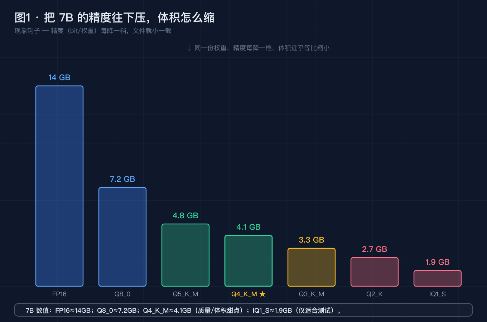
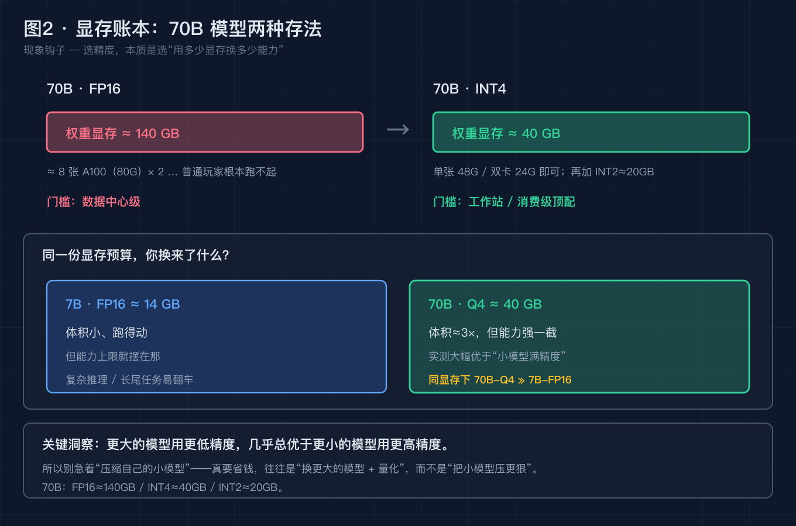
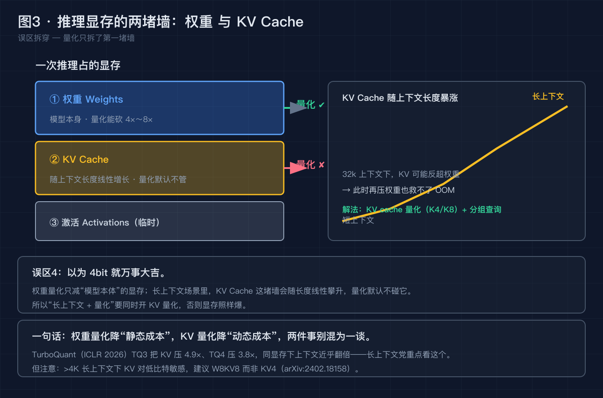
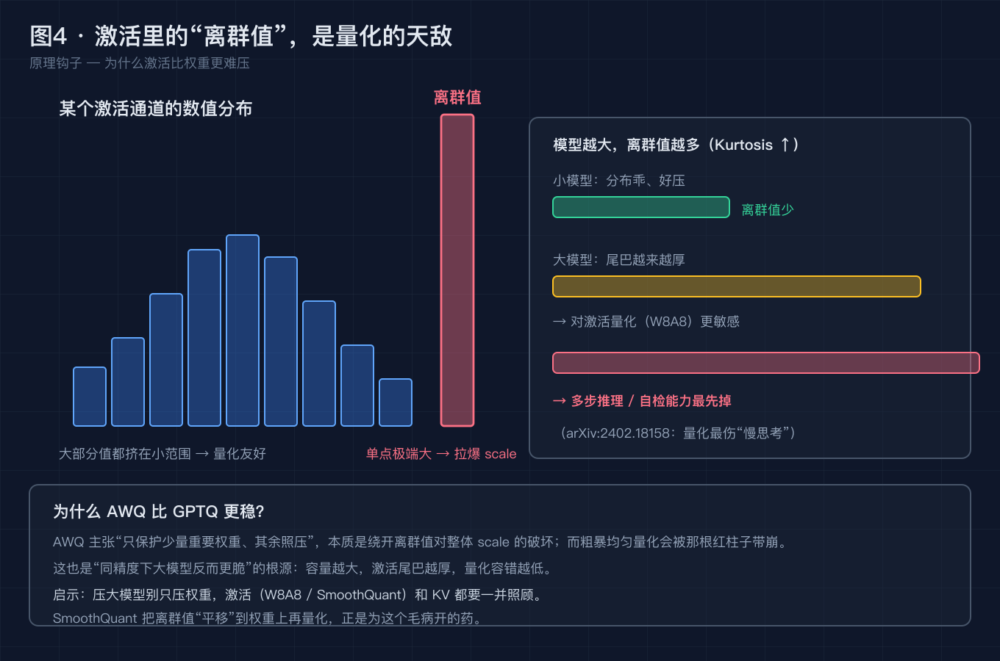
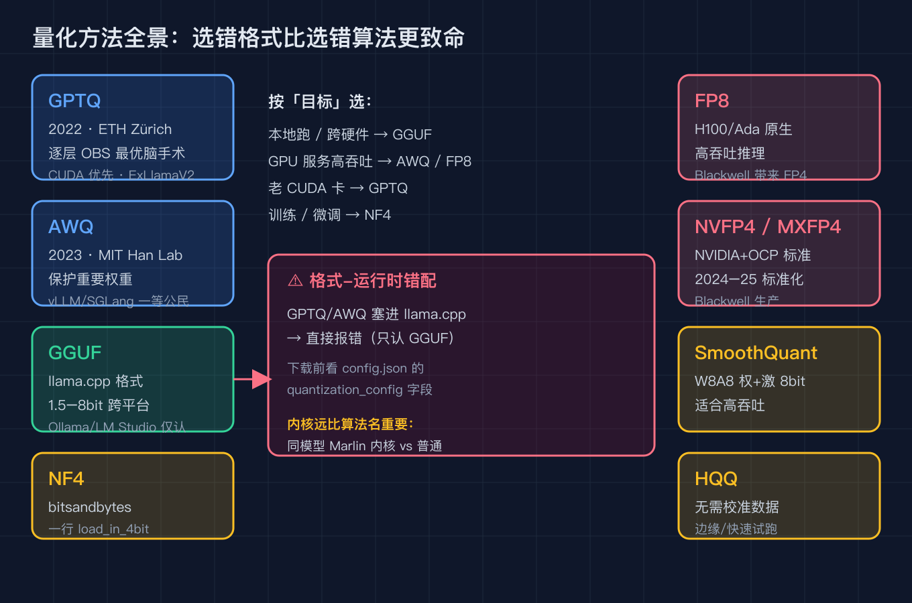

# 把 7B 压到 4bit 后，我踩的 5 个坑（附一张能照抄的显存账本）

> 本文不堆概念，也不吹"一键 4bit 部署"。我们从 8 月最现实的一个刚需开始——Qwen3.8、Kimi K3 这些大模型，究竟怎么塞进自己的显卡本地跑——把它拆成 5 个递进的小问题，逐个用事实和数据解决。最后你会发现：**量化省的是"权重的显存"，不是"麻烦"；它真正坑你的，恰恰是那几个被省略掉的细节。**

---

## 0. 先别急着下量化命令，看这个真实刚需

8 月以来，Qwen3.8 系列、Kimi K3 接连放大招，参数越堆越大、能力越卷越强。但普通人面对它们的第一反应不是"好强"，而是——

> "这玩意儿，我那张 24G 的卡跑得动吗？"

答案通常是：原版 FP16 跑不动。一个 7B 模型 FP16 就要约 **14GB**，更别提 70B 的 FP16 直接 **140GB**，单卡闻着都晕。于是"量化（Quantization）"从选修课变成了必答题：把权重从 16bit 砍到 4bit，体积能缩到四分之一。

但凡是点过一次 `量化` 按钮、或下载过一个 `Q4_K_M` 文件的人，大概率都遇到过这几类翻车：

- **下载完塞进 llama.cpp，直接报错**——格式不对；
- **显存是省了，可长上下文一拉，又 OOM 了**——KV cache 没动；
- **跑是跑起来了，速度也没快 4 倍，反而只快了两倍**——去量化有开销；
- **更隐蔽的：基准测着还行，一上你的业务就胡说**——校准数据不具代表性。

如果你现在的猜测是"量化就是无脑降精度、越小越快"——这篇文章就是来推翻这几个直觉的。我们把它拆开，一个一个解决。

---

## 问题 1：精度不是"比特数"，2bit 到底发生了什么？

**【论点】** "4bit"不是一个魔法开关，而是一次**有损压缩**。比特数每降一档，模型丢掉的信息就多一点；真正决定"丢得值不值"的，是算法怎么选"保谁、压谁"。

**【事实】** 量化本质是把权重从高精度浮点（如 FP16，每个数 16bit）映射到低位宽表示（如 INT4，每个数 4bit），通常还会配一个 `scale`（缩放因子）和 `zero-point`（零点偏移）来减小误差：

- 7B 模型各档实测体积（llama.cpp / GGUF 口径）：**FP16 ≈ 14GB、Q8_0 ≈ 7.2GB、Q5_K_M ≈ 4.8GB、Q4_K_M ≈ 4.1GB、Q3_K_M ≈ 3.3GB、Q2_K ≈ 2.7GB、IQ1_S ≈ 1.9GB**；
- 注意一个反直觉点：**Q2_0 这种"2bit"格式其实每权重 ≈ 2.25 bit**——因为要额外存"每 64 个权重一组的半精度 scale"，纯 2bit 没法用。

**【论证】** 这解释了为什么"压到 2bit"不是 8 倍压缩：**省出来的比特，有一部分被 scale 吃回去了。** 比特数只是上限，真实压缩比要看格式怎么存 scale/zero-point。也正因为如此，越低比特越依赖"聪明的压缩算法"——不是随便砍精度，而是让算法决定哪些权重值得用更多 bit 保住。

> 图 1 · 精度 vs 体积：从 FP16 的 14GB 一路压到 IQ1_S 的 1.9GB，每降一档都靠 scale/zero-point 兜底；Q2 并非纯 2bit，而是每权重约 2.25 bit。

---

## 问题 2：显存账本——FP16 到 Q4，到底省在了哪？

**【论点】** 量化的第一笔账很好算：**它只减"权重"那一笔显存，而且减得很干净。** 把账本摊开，你才知道 4bit 到底替你省了多少、又没省多少。

**【事实】** 一张清晰的显存账本（以常见口径估算）：

| 模型 | FP16 | INT4 / Q4 | INT2 / Q2 |
| --- | --- | --- | --- |
| 7B | ≈ 14GB | ≈ 4.1GB（Q4_K_M） | ≈ 2.7GB（Q2_K） |
| 70B | ≈ 140GB | ≈ 40GB | ≈ 20GB |

一个被反复验证的洞察：**"更大的模型用更低精度，几乎总优于更小的模型用更高精度。"** 70B 压到 INT4（≈40GB）质量大幅优于 7B 的 FP16（≈14GB），而文件体积更接近——你花差不多的磁盘，买到了高得多的天花板。

**【论证】** 所以量化的真正价值，不是"让小模型更省"，而是**"让大模型可部署"**。它把 140GB 的 70B 从"必须八卡集群"拉到了"一张 48G/80G 卡勉强能跑"。但账本也暴露了边界：上面这些数字**只算权重**，还没算推理时活着的激活和 KV cache——这正是下一题的坑。

> 图 2 · 显存账本：70B 从 FP16 的 140GB 砍到 INT4 的 40GB，可部署性质变；但注意这只是权重账，激活与 KV cache 另算。

---

## 问题 3：权重量化 ≠ 全部——KV cache 才是长上下文的隐形吞金兽

**【论点】** 这是最多人踩的坑：**4bit 只动了权重，没动 KV cache。** 你以为压完就稳了，结果一开长上下文，显存照崩。

**【事实】** 推理时显存 = 权重 + 激活 + **KV cache**。KV cache 是每个 token 的 Key/Value 缓存，随上下文长度线性增长：

- 最新研究 **TurboQuant（Zandieh et al., ICLR 2026）** 把 KV 压到 3bit（TQ3）实现 **4.9× 压缩**、4bit（TQ4）实现 **3.8× 压缩**，同显存下上下文直接翻倍；llama.cpp 已集成 KV 量化；
- 但长上下文（>4K）对 KV 量化更敏感。arXiv:2402.18158（Li et al., ICML 2024）的建议是：**长上下文用 W8KV8（KV 也 8bit），而不是一头压到 KV4**。

**【论证】** 这推翻了"量化包治百病"的幻觉：**权重压到 4bit，对长上下文的 KV 瓶颈毫无帮助。** 你的 7B 模型，Q4 权重只占 4GB，可一旦上下文拉到 32K，未量化的 FP16 KV cache 自己就能吃下好几个 GB——崩的不是权重，是 KV。修法是显式打开 KV 量化（如 `W8KV8`），而不是继续压权重。

> 图 3 · 权重 vs KV cache：4bit 只减了左边那块；右边 KV cache 随上下文线性膨胀，长上下文下才是 OOM 真凶，需单独量化。

---

## 问题 4：为什么"模型越大，反而越怕量化"？——激活离群值

**【论点】** 又一个反直觉：**模型越大，对量化（尤其是激活量化）越脆弱。** 不是大模型更扛压，恰恰相反。

**【事实】** 研究（arXiv:2402.18158）指出：模型越大，激活张量里的**离群值（outliers）越多**——峰度（Kurtosis）随模型规模显著上升。这些离群值幅度极大、数量稀少，却承载了关键的语义信息。

**【论证】** 离群值的存在让"激活量化"极难做：一小撮超大值会拉大整个张量的动态范围，把正常权重挤到低位宽里几乎分辨不出。这也解释了为什么**多步推理、自检这类能力对量化最脆弱**——它们高度依赖那些被离群值保护的通道。所以大模型的量化重点，往往不是压权重，而是"怎么保住激活里的离群通道"（AWQ 的"保护重要权重"正是这个思路）。

> 图 4 · 激活离群值：少数几个超大值撑起整个动态范围；模型越大离群值越多，激活量化越容易把正常信号压没。

---

## 问题 5：量化方法这么多，选错格式比选错算法更致命

**【论点】** 量化不是只有一个"4bit"。**选错格式，比在 GPTQ / AWQ 之间纠结重要十倍**——因为格式直接决定你能不能跑、跑在哪。

**【事实】** 主流方法各有所长（均已核实来源与年份）：

- **GPTQ**（2022，ETH Zürich）：逐层 OBS"最优脑手术"量化，需校准集；CUDA 优先，ExLlamaV2 / Marlin 内核快；生态成熟但逐步被 AWQ 赶超；
- **AWQ**（2023，MIT Han Lab）：Activation-aware，保护重要权重，4bit 精度常优于 GPTQ；vLLM / SGLang / TensorRT-LLM 一等公民；**GPU-only，无 CPU 回退**；
- **GGUF**（llama.cpp 格式）：1.5–8bit，**Q4_K_M 是质量/体积甜点**；跨平台 CPU/GPU/Apple Silicon；**Ollama、LM Studio 只认 GGUF**；
- **NF4**（bitsandbytes）：Transformers 里 `load_in_4bit` 一行搞定、无需单独量化步，但推理慢于 GPTQ/AWQ 内核，**偏训练**；
- **SmoothQuant / W8A8**（权+激 8bit，高吞吐）、**FP8**（H100/Ada 原生，Blackwell 带来 FP4）、**NVFP4 / MXFP4**（NVIDIA+OCP 2024–25 标准化，Blackwell 生产）。

**【论证】** 选型的第一原则看"目标"：**本地跨硬件跑 → GGUF；GPU 服务高吞吐 → AWQ / FP8；训练微调 → NF4；老 CUDA 卡 → GPTQ。** 但无论选哪个算法，**内核（kernel）远比算法名重要**：同一个 AWQ 模型，用 Marlin 内核跑和普通内核能差好几倍。别被"我用的是 AWQ"迷惑，真正决定快慢的是底层那层 CUDA 内核。

> 图 5 · 量化方法全景：左列推理内核派（GPTQ/AWQ/GGUF/NF4），右列硬件原生派（FP8/NVFP4/SmoothQuant/HQQ）；中间是按目标选型 + 格式错配红牌警告。

---

## 误区：我替你踩过的 5 个坑（建议收藏照抄）

上面五题里埋了坑，这里把它们单独拎出来，**当一份"别再踩"的清单**。每一条都有真实翻车现场。

**误区 1 · 格式-运行时错配（最高频）**
把 GPTQ / AWQ 文件直接丢进 llama.cpp，会当场报错——**llama.cpp 只认 GGUF**。下载前先看 `config.json` 里的 `quantization_config` 字段，确认格式匹配你的运行时（Ollama / LM Studio 一律 GGUF；vLLM 认 AWQ/GPTQ）。

**误区 2 · 校准数据不具代表性**
量化（GPTQ/AWQ）要靠一小批"校准集"估算 scale。如果你的生产是德语法务合同，却用英文网页文本校准，误差会精准落在你最不能错的地方。取 **128–512 条真实分布样本**做校准，别用公开 demo 集糊弄。

**误区 3 · bits/bytes 容量规划混淆**
"4bit 13B"不是 6.5GB。算上 scale / zero-point / 仍保留的 FP16 embedding，实际约 **8–9GB**；再加默认 FP16 的 KV cache，"10GB 显存能装"在 32K 上下文下会直接崩。容量规划请按"权重 + KV + 激活"三笔算，别只盯比特数。

**误区 4 · "量化包治百病"**
4bit 只减权重显存，对长上下文的**激活 / KV cache 瓶颈无能为力**。上下文一长又 OOM，先开 KV 量化（W8KV8），而不是继续压权重到 Q2。

**误区 5 · "4bit = 4× 快"陷阱**
去量化开销 + 硬件原生低精度算力限制 + 内存访问模式，消费级实际只快 **1.8×–2.4×**；而且 KV cache 默认不量化。别拿比特数当加速倍数，上线前自己掐表测端到端延迟。

（补充两条：**误区 6**，基准测平均、你的业务活在长尾，跳过评测等于盲飞；**误区 7**，极致压到 Q2/IQ2 语义损耗严重，只适合测试，别上生产。）

---

## 升华：从"怎么压"到"怎么分配显存"

写到这里，三条可以带走的东西：

1. **量化是重新分配显存，不是单纯减法。** 它干净地砍掉权重，却对 KV cache、激活视而不见。真正的工程，是"权重压一点、KV 量化一点、校准做对一点"的组合拳。
2. **大模型 + 低精度，常优于小模型 + 高精度。** 70B Q4 的质量天花板远高于 7B FP16，且文件体积相近。与其在 7B 上抠比特，不如上更大的模型配更聪明的量化。
3. **格式与内核，比算法名更决定成败。** 选错 GGUF/AWQ 直接跑不起来；同模型 Marlin 内核 vs 普通内核差数倍。在"用哪个算法"之前，先问"跑在哪、什么格式、什么内核"。

一句话：**模型已经够大了，问题不在"能不能压"，而在"压完之后，那块显存有没有被重新分配对"。**

---

## 回到标题：用一个问题收束全文

开头我问的是"把 7B 压到 4bit 后，我踩的 5 个坑"。

答案其实不是 5 个孤立的坑，而是一条线：**每一次翻车，都是因为把"量化"当成了"一键降精度"，却忽略了它只动了权重、没动 KV、还挑格式和校准。**

所以把全文收成一个问题抛给你——

**下次你再看到"4bit 一键部署"的标题时，会先去翻那张显存账本（权重 + KV + 激活三笔算清），还是先着急点下载？**

---

## 这篇我做了什么，又适合谁

**我做了什么（都是可核实的查证，不编造版本号）：**
- 核实了 5 类主流量化方法的来源、年份与定位：GPTQ（2022 ETH）、AWQ（2023 MIT）、GGUF（llama.cpp）、NF4（bitsandbytes）、FP8 / NVFP4 / MXFP4（NVIDIA+OCP 标准化）；
- 整理了 7B / 70B 从 FP16 到 Q4/Q2 的**显存账本**（含 Q2_0 实为每权重 ≈2.25 bit 的细节）；
- 核实了 KV cache 量化进展（TurboQuant ICLR 2026，4.9×/3.8× 压缩，llama.cpp 已集成）与激活离群值随模型增大的研究（arXiv:2402.18158）；
- 沉淀出 **5+ 条踩坑清单**，每条对应一个真实翻车现场。

**真正对哪些群体有用：**
- **本地部署开发者 / 端侧玩家**：想用 Ollama、LM Studio 把 Qwen3.8、Kimi K3 跑在自己的Mac/单卡上——误区 1（格式错配）和账本直接救你一次报错和一次 OOM；
- **消费级硬件（24G/48G 显卡）玩家**：纠结"上 7B 还是 70B"时，"大模型 + 低精度优于小模型 + 高精度"这条能帮你做对选择；
- **做推理降本的服务团队**：KV cache 量化、内核选型、校准集规范，是你们把长上下文服务压进成本线三件实事；
- **刚入坑的新人**：把"4bit ≠ 4× 快""量化非万能"这两个幻觉提前拆掉，少走半年弯路。

如果你不属于上面任何一类，这篇也许只是篇原理科普；但只要你碰过"能不能本地跑"，它大概率能替你省下几次凌晨的 OOM 排查。

---

## 互动时间

回到开头的刚需：你那张 24G 的卡，最后是把 Qwen3.8 压到 Q4 跑起来了，还是卡在了 KV cache？

**欢迎在评论区贴上你的翻车现场**（脱敏即可）——是格式报错、长上下文 OOM，还是"快了两倍不是四倍"的落差？我们可以一起对着显存账本算。也欢迎补充你自己的坑，我汇总进下一篇。

如果这篇对你有用，**点个赞或收藏**，让更多还在"一键 4bit"的同事看到真相；想直接拿去照抄的，文末 5 张图我都开源在 **GitHub**（见评论区置顶链接），顺手点个 Star 就是对我最大的鼓励。

---

### 参考来源（均可核实）

- GPTQ：Frantar et al., *GPTQ: Accurate Post-Training Quantization for Generative Pre-trained Transformers*, 2022（ETH Zürich）；逐层 OBS，需校准集，ExLlamaV2 / Marlin 内核
- AWQ：Lin et al., *AWQ: Activation-aware Weight Quantization*, 2023（MIT Han Lab）；保护重要权重，vLLM / SGLang / TensorRT-LLM 一等公民
- GGUF / llama.cpp：官方文档与格式说明；Q4_K_M 为甜点，Ollama / LM Studio 仅认 GGUF；Q2_0 每权重 ≈2.25 bit（2bit + 每 64 权重半精度 scale），CPU PR 2026-07-07、CUDA 2026-08-04 合并上游，PrismML-Eng 贡献
- Bitsandbytes NF4：Dettmers et al., *QLoRA*, 2023；`load_in_4bit` 一行量化，偏训练
- KV cache 量化：Zandieh et al., *TurboQuant*, ICLR 2026；TQ3 3bit 4.9×、TQ4 4bit 3.8×，llama.cpp 已集成
- 激活离群值 / 长上下文量化敏感性：Li et al., arXiv:2402.18158（ICML 2024）；W4 / W4A8 / KV4 近无损（<2%），长上下文建议 W8KV8
- FP8 / NVFP4 / MXFP4：NVIDIA 技术文档与 OCP 微缩放格式标准（2024–25 标准化，Blackwell 生产）；FP4 随 Blackwell 引入
- SmoothQuant：Xiao et al., *SmoothQuant*, 2022（W8A8 权+激 8bit，高吞吐）
- HQQ：无校准数据量化方法（边缘 / 快速试跑）
- Unsloth 动态量化：UD-Q4_K_XL / UD-Q2_K_XL / UD-Q6_K_XL（动态 per-layer 比特分配）
- 70B Q4 优于 7B FP16 的洞察：社区（如 Tim Dettmers 博客《LLM 量化真相》）与多项实测复盘广为引用

---

### 【发布前删除】图片 CDN 替换清单

本文 5 张配图已生成为本地 PNG（位于 `diagram/quant/`）。发布到掘金前，请按下面顺序把正文里的本地路径替换成掘金图床 CDN 链接：

| 顺序 | 正文里搜这个本地路径 | 替换成 |
| --- | --- | --- |
| 图 1 | `./diagram/quant/01-precision-vs-size@2x.png` | 掘金上传后得到的 CDN 链接 |
| 图 2 | `./diagram/quant/02-vram-ledger@2x.png` | 掘金上传后得到的 CDN 链接 |
| 图 3 | `./diagram/quant/03-weight-vs-kv@2x.png` | 掘金上传后得到的 CDN 链接 |
| 图 4 | `./diagram/quant/04-activation-outliers@2x.png` | 掘金上传后得到的 CDN 链接 |
| 图 5 | `./diagram/quant/05-methods-panorama@2x.png` | 掘金上传后得到的 CDN 链接 |

替换完成后，连同本"替换清单"小节一起删除即可。
