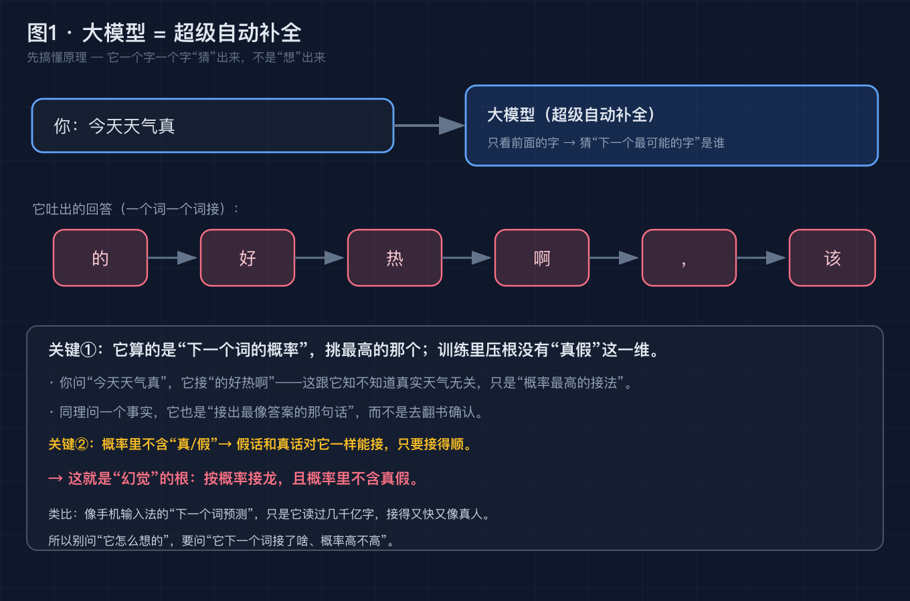
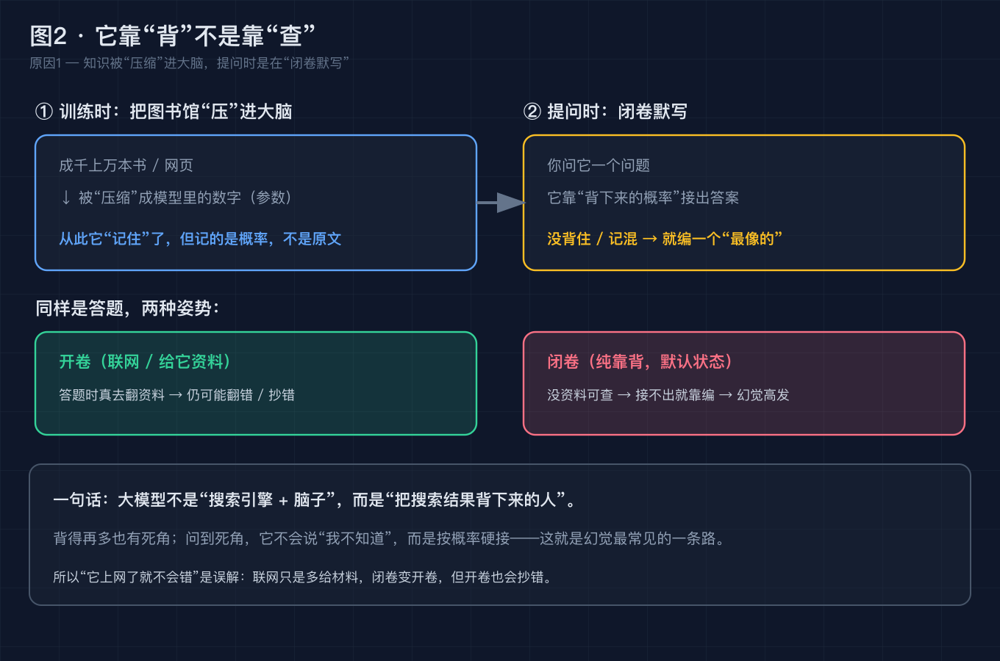
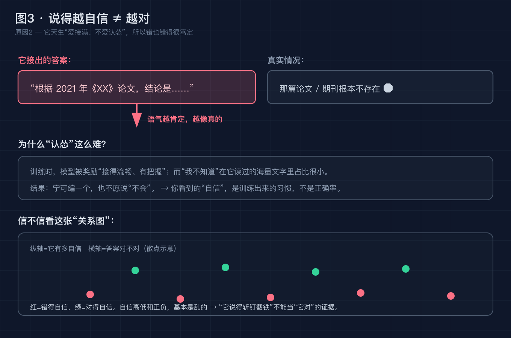
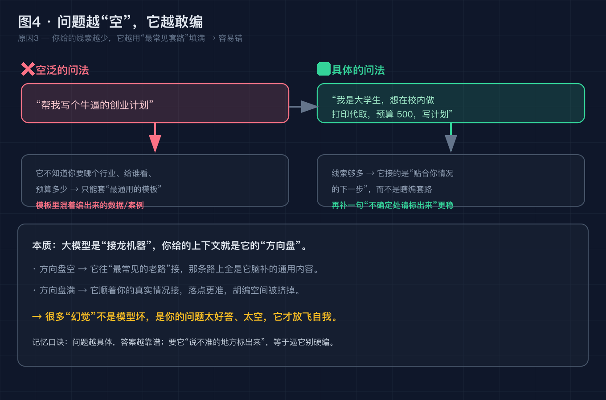
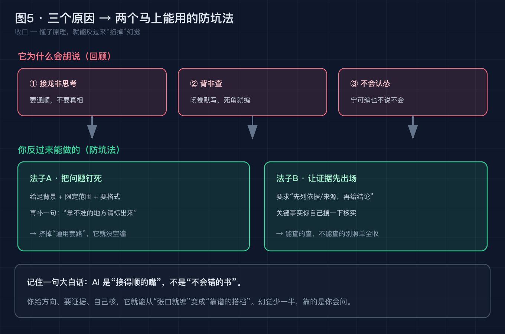

# AI 为什么一本正经地胡说八道？3 个底层原因 + 2 个马上能用的防坑法

> 结果型承诺：读完你能说清"AI 编假话"到底是 bug 还是天性，并且手上有两个今晚就能用的招，让它的胡说八道少一大半。不需要任何 AI 基础。

## 引言

你大概率遇到过这种事：

让 AI 写周报，它顺手编了个"上周和 XX 部门开了对齐会"；问它"某篇论文讲了啥"，它甩出一篇有模有样的文献，**期刊名、年份、结论全对，唯独——这篇论文根本不存在**；让它推荐书单，它列了五本，你一本都没搜到。

最气人的是：它说得**特别笃定**，像真见过一样。

很多人由此觉得"这 AI 好傻""是不是坏了"。其实不是。这一篇就把这件事讲透——而且我保证，**不假设你知道任何 AI 术语**，遇到陌生词我会先解释再往下说。

---

## 0. 现象：每个人都踩过，只是叫法不同

"AI 一本正经说假话"在行内有个名字，叫**幻觉（hallucination）**。

你不用记这个词，记住感觉就行：**它生成的内容，看起来有鼻子有眼，但事实是错的、或根本没发生过。**

为什么值得专门写一篇？因为 2026 年人人都在用 AI 写东西、查资料、做决策，而幻觉是它最普遍、也最容易被忽视的坑。你以为自己在用"不会累的百度"，其实你在对着一个**很会聊天的嘴**要真相。

在拆原因之前，先搞懂三个词，不然后面会卡。

---

## 先搞懂三个词（不然后面真的看不懂）

**① 大模型 / 聊天机器人背后那个程序**
就是你用的豆包、Kimi、ChatGPT 背后那套东西。别被"大"吓到，你就把它当成一个**读过几千亿字的"超级接话高手"**。它不会上网、不会思考，只会"接话"。

**② 自动补全**
你手机打字时，输入法是不是会猜"下一个词"？大模型就是这种东西的**超级放大版**：你发一句话，它根据前面所有字，猜"下一个最可能的字"是谁，吐出来；再拿这个新字当上下文，猜再下一个……一句话就这么一个字一个字接出来的。
它优化的是"**接得通顺、像人话**"，不是"**句句都是真相**"。这点后面会反复用到。

**③ 幻觉**
接龙接错了、接飞了，生成了假但像真的内容，就叫幻觉。所以幻觉不是"它坏掉了"，更像是"**接龙接顺了，但接偏了**"。

记住这三句，下面就好懂了。

---

## 底层原理：AI 到底是怎么"想"出一句话的

很多人以为 AI 回答 = 先理解你的问题，再去知识库里找答案。完全不是。

它干的事只有一件：**根据你刚说的所有字，算出"下一个字最可能是什么"，然后挑一个概率高的吐出来；再把这新字接到后面，算再下一个……** 一句话就这么一个字一个字"接"出来的。图 1 把这个流程画了出来。

这一步的关键是：**它算的是"概率"，不是"真假"。**

- 它从海量文字里只学了一件事：**在某种上下文里，哪个字接哪个字更常见。** 就像你读多了"今天天气真___"，下次看到这句自然接"好"。
- 它**从来没有一个开关叫"这是真的吗？"**——训练目标里压根没有"真 / 假"这个维度。对模型来说，"明天会下雨"和"明天会下猫"，只要都"接得顺"，就是平等的候选。
- 所以**只要接得通顺，假话和真话在它眼里没有区别**，都能一句句接出来。

打个比方：它像一台读过几千亿字的"输入法超级预测"，擅长猜下一个词，但**不负责保证猜的是事实**。

> 这就是整篇文章的"底层原理"——幻觉不是它坏了，而是"按概率接龙、且概率里不含真假"这个工作方式自带的副作用。下面三个原因，都是在解释：既然机制是这样，为什么它特别容易"接偏"。

---

## 原因一｜知识是"背"进脑子，不是"存"在档案里

**论点**：大模型不是"搜索引擎加脑子"，而是"把书背下来的人"。

**事实**：训练时，成千上万本书、网页被**压进**模型里的一堆数字（这堆数字叫"参数"，你就理解成"它脑子里的知识"）。提问时，它靠"背下来的概率"接答案，而不是实时去翻书确认。

**论证**：背得再多也有死角。问到没背牢的地方，它不会说"我不知道"，而是按概率硬接一个"最像的"。**没背住、记混了 → 就编**。这就是幻觉最常见的一条路。

很多人以为"它联网了就不会错"。错。联网只是多给它几页材料（相当于闭卷变开卷），但开卷也会**抄错、抄漏、把两篇混一起**。所以"联网 = 不会幻觉"是最大的误解之一。

---

## 原因二｜它天生"爱接满、不爱认怂"

**论点**：它说得越斩钉截铁，你越要警惕——自信和正确是两码事。

**事实**：训练时，模型被奖励"接得流畅、有把握"；而"我不知道"在它读过的海量文字里占比很小。结果就是：**宁可编一个，也不愿说不会**。

**论证**：所以你看到的"自信"，是训练出来的习惯，不是正确率的保证。图 3 右边的散点示意很说明问题：它答错的时候，语气照样满分。下次它甩出"根据 2021 年《XX》论文……"，先默认**这篇可能不存在**，再去查。

---

## 原因三｜你的问题越"空"，它越敢编

**论点**：很多幻觉不是模型坏，是你的问题太好答、太空，它才放飞自我。

**事实**：你问"帮我写个牛逼的创业计划"，它不知道行业、受众、预算，只能套"最通用的模板"——而通用模板里混着大量它脑补的数据和案例。你问得越具体（"我是大学生，校内打印代取，预算 500"），它接得越贴你的真实情况，胡编空间被挤掉。

**论证**：大模型是接龙机器，你给的上下文就是方向盘。方向盘空，它往"最常见的老路"接；方向盘满，它顺着你的情况接。这一步直接决定了能不能触发前面两个原因——问题越空，它越只能靠"背混的知识 + 硬接满"，三个原因同时被激活。

---

## 误区：4 个你会踩的具体坑

> 这部分建议直接收藏，下次被 AI 坑了回来翻。下面说的是"使用时的坑"，不是再解释原理——原理上面已经讲完了。

**误区 1：AI 联网了就不会错。**
联网只是多给材料，闭卷变开卷，开卷也会抄错。该核还是得核（见下文防坑法②）。

**误区 2：它说得越自信，越对。**
自信是训练习惯，不是正确率。语气越满，越要先查证。

**误区 3：让 AI 列"参考文献 / 代码库"就有。**
它会编出看似真实的期刊名、DOI、GitHub 库名。引用前自己搜一遍。

**误区 4：模型越大越不胡说。**
大模型也幻觉，只是更会"伪装得像真的"。规模降低频率，不消除幻觉。

---

## 2 个防坑法：上游堵源头，下游兜底查

讲清原理和原因，解法就很自然了——**既然它会"背混 + 硬接满 + 趁你问得空就编"，那你就反着来：把问题问死，再给关键事实加一道查证。**

### 防坑法①（上游）：把"空问题"钉成"任务书"

**原理**：上下文就是方向盘。你给得越具体，它靠"通用套路瞎编"的空间越小，也就不容易触发原因三→原因一→原因二的连锁。

**具体怎么做**（五件套，挑着用）：
1. **给背景**：我是谁、给谁用、什么场景。（"我是大学生"比"帮我写个方案"强十倍）
2. **给约束**：行业、预算、字数、风格、必须避开的雷区。
3. **给格式**：要分几点、要不要表格、先结论还是先展开。
4. **要它标注不确定**：加一句"**拿不准、是推断出来的地方，请用【不确定】标出来**"——等于逼它别硬编，把模糊地带摊开给你看。
5. **要它先列依据**："先说你这个结论基于什么，再给结论"，见法②。

**反例 vs 正例**：
- ❌ "帮我写个牛逼的创业计划" → 必出一堆编的数据。
- ✅ "我是大三学生，想在校内做打印代取，预算 500 元，写一个 300 字的可行性说明，分'成本/怎么获客/风险'三点；你没把握的数字请标【不确定】" → 它只能顺着你给的真情况接，编无可编。

### 防坑法②（下游）：给关键事实装一道"查证回路"

**原理**：它输出的是"概率接龙"，不是"已核实的事实"。所以任何你要拿去用、发出去、做决定的内容，**默认待核实**，别照单全收。

**具体怎么做**：
1. **让它先出证据再下结论**："请先列出每条结论的可验证来源（链接 / 文献名 / 官方文档），再给结论。" 它如果列不出，说明这条大概率在编（对应误区 3）。
2. **关键事实自己搜一遍**：涉及人名、论文、数据、代码库，花 30 秒用搜索引擎 / 官网核对。真有就留，没有就删。
3. **要它打标签区分事实与推断**："在回答里用【确定】标你确信有依据的内容，用【推断】标你猜的。" 你只信【确定】部分。
4. **重要决策做交叉验证**：让另一个模型或真人复核一遍；同一问题换种问法问两次，答案对不上就说明有水分。

> 这两招为什么"行之有效"：法① 是从**源头**减少它编的动机（没空子可钻），法② 是从**出口**兜底它万一编了的后果（你还能拦住）。一个堵前门，一个守后门，比"套一句咒语"实在得多——因为咒语改变不了"它按概率接龙、不含真假"这个底层机制，只能改善，不能根除。

---

## 升华：幻觉不是 bug，是天性

把前面串起来你会发现一件事：**幻觉不是 AI 出了故障，而是它的工作方式自带的副作用。** 它按概率接龙（不含真假）、知识靠背（会混）、被奖励接满（不认怂）。这三件叠在一起，只要喂得空、问得松，胡说八道就是默认行为。

所以对待 AI 最稳的心态是：**把它当"接得顺的嘴"，不是"不会错的书"。** 它擅长给你灵感、草稿、框架；它不擅长替你保证"这句话是真的"。分清楚这两件事，你反而能把它用得飞起。

---

## 回到标题：用一个问题收束全文

开头我问的是："AI 为什么一本正经地胡说八道？"

答案就一句话——**因为它从不是在复述真相，只是在接一条"最像人话"的龙；接龙接偏了，就是胡说八道，而它根本察觉不到自己偏了。**

所以留给你一个问题，也是这篇全部落点：

> **下次 AI 又信誓旦旦甩出一段你从没见过的"事实"，你会先追问"你的依据呢、我去查查"，还是先截图发出去？**

你的选择，决定了 AI 是帮你，还是坑你。

---

## 这篇文章做了什么 / 对谁有用

**我做了什么**：用"自动补全"一个类比，把大模型幻觉从零讲清。先讲了**底层原理**（它算的是"下一个词的概率"，概率里不含"真假"这一维，所以假话真话说接就接）；再给 **3 个底层原因**（知识是背的会混 / 训练奖励它接满不认怂 / 你问得越空它越敢编）、**4 个使用误区**、**2 个马上能用的防坑法**（上游把问题钉成任务书 + 下游给事实装查证回路），并配了 5 张全大白话图解。全文不假设任何 AI 基础，概念先解释再用。

**对这几类人有用**：
- **天天用 AI 写东西、查资料，但被假信息坑过的人**——以后能一眼识别"它在编"，并知道怎么问才不容易被编。
- **做自媒体 / 内容创作，怕 AI 编资料翻车的人**——知道哪些环节必须自己核、怎么问能少踩坑。
- **产品 / 运营，要在业务里接 AI 的人**——明白"幻觉"是要写进风控的，不是玄学，也知道靠提示词根治不了。
- **纯好奇的小白**——终于能跟朋友讲清楚"AI 为什么骗人"而不露怯。

---

## 互动时间

如果这篇让你"原来如此"了一下，**点个赞 + 收藏**——下次 AI 又胡说时，回来翻"2 个防坑法"就够了。

想看更多**零基础也能懂的 AI 原理**？关注我，或者去我的 GitHub 拿这 5 张高清原图（链接见评论区）。你最想搞懂 AI 的哪个"为什么"？**评论区告诉我，下一篇写它。**

---

### 参考来源

- OpenAI / Anthropic / Google 官方博客对"hallucination"的定义与说明（2023–2026 持续更新）
- 经典论文《Survey of Hallucination in Large Language Models》(2023) 对幻觉成因的归类
- 学界关于"校准（calibration）"的研究：模型置信度与正确率常不对齐（置信越高≠越对）
- RAG（检索增强生成）相关论文：联网/给资料能降低但未消除幻觉
- 上述均为公开可查的共识性结论；本文为科普重述，未引用任何未经证实的具体版本号或数据

### 【发布前删除】图片 CDN 替换清单

- `diagram/hallucination/01-autocomplete-engine@2x.png` → 替换为掘金 CDN 链接（图1 · 怎么接龙）
- `diagram/hallucination/02-memory-not-search@2x.png` → 替换为掘金 CDN 链接（图2 · 背非查）
- `diagram/hallucination/03-confidence-not-truth@2x.png` → 替换为掘金 CDN 链接（图3 · 自信≠正确）
- `diagram/hallucination/04-vague-breeds-fiction@2x.png` → 替换为掘金 CDN 链接（图4 · 空问题陷阱）
- `diagram/hallucination/05-how-to-reduce@2x.png` → 替换为掘金 CDN 链接（图5 · 2 个防坑法）
