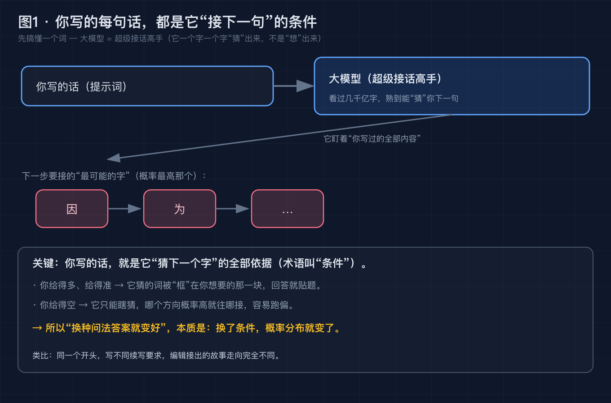
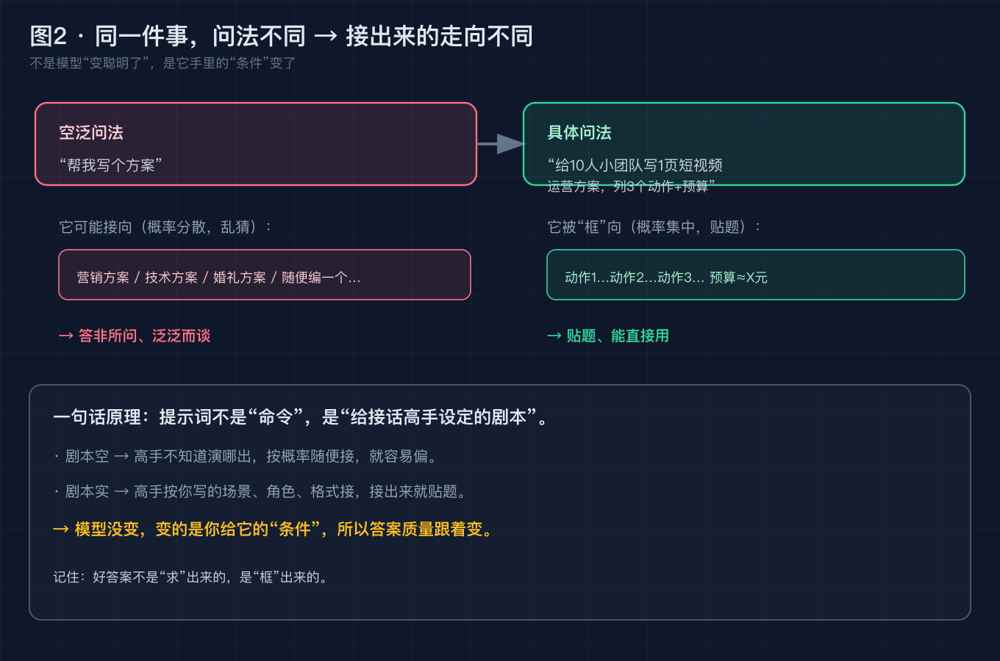
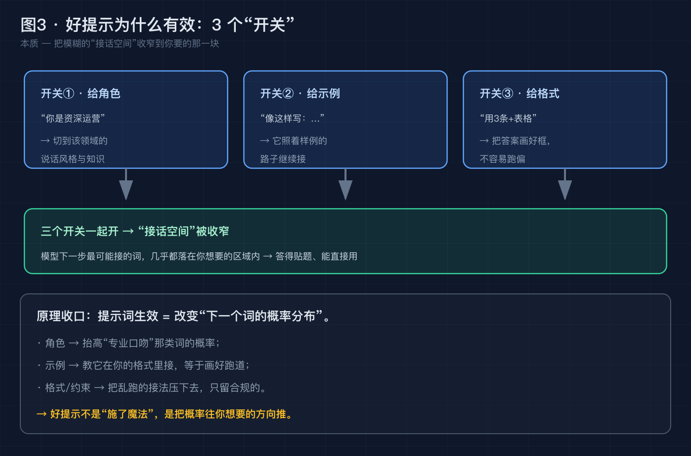
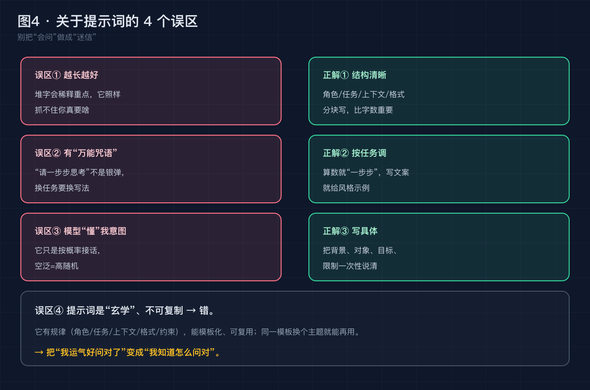
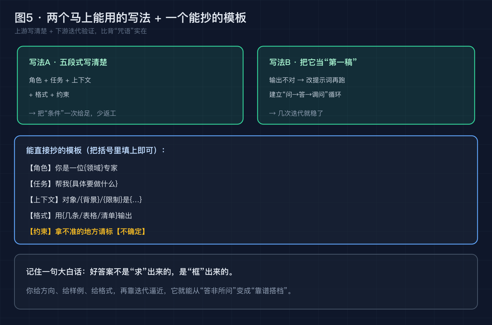

# 为什么换种问法 AI 就变聪明？3 个底层原理 + 一个能直接抄的提示词模板

> 本文不堆术语。你一定有过这种体验：同样一件事，随手一问 AI 答得稀烂，换个说法它突然就懂了。这不是模型抽风，背后是一套能讲清楚的原理。读完你能自己写出"框住答案"的提示词，而不是靠运气。

---

## 0. 先搞懂三个词（假设你不熟 AI，也看得懂）

在拆原理前，先把三个词讲人话，后文不再解释：

- **大模型 = 超级接话高手**。你给它前半句，它一个字一个字"猜"出后半句，像手机输入法的"下一个词预测"，只是它读过几千亿字，接得又快又像真人。它"猜"的依据，是"哪个字最可能接在后面"，不是"哪个字是真相"。
- **提示词 = 你写的那半句话**。也就是你敲给 AI 的所有字：问题、要求、背景、格式……合起来就是它的"全部已知条件"。
- **幻觉 = 接偏了**。它为了接得通顺，可能接出一句听着像真、其实没影的话（上篇写过，这里不展开）。

记住一句话：**提示词不是"命令"，是"给接话高手设定的剧本"**。下面全是这个道理的延伸。

> 图 1 · 大模型 = 超级接话高手：你写的每句话，都是它"猜下一个字"的全部条件。

---

## 问题 1：它为什么"换种问法就变好"？—— 底层原理

**【论点】** "换个问法答案就变好"，本质只有一个原因：**你改了它手里的"条件"，它下一步最该接的字的概率分布，就跟着变了。**

**【事实】** 大模型干活的方式，学术界早有定论——它就是"预测下一个 token（字/词）"。你输入的整段话，就是它做预测时看到的全部条件。同一个模型、同一份知识，**输入不同，预测出的下一个字就不同**。

**【论证】** 把"接话"想成编辑续写：同一个开头，你写"接着写个悲剧结局"和"接着写个搞笑结局"，编辑接出的故事走向完全不同——编辑没变聪明，是续写要求变了。AI 同理：它没变，变的是你给它的"已知条件"。所以**好答案不是"求"出来的，是"框"出来的**——你给的条件越贴题，它接出来的字就越落在你想要的那块。

> 图 2 · 同一件事，问法不同 → 接出来的走向不同：左边空泛，它乱猜；右边具体，它被"框"向贴题的回答。

---

## 问题 2：好提示到底"好"在哪？3 个不重复的原因

**（这三个原因各占一个层面，不绕回同一个意思。）**

### 原因一（机制层面）：它在"条件概率"上做文章

你给得多、给得准，模型算出的"下一个字概率"就被推高到你要的那类词上；你给得空，概率分散在无数方向，它哪个高接哪个，自然容易偏。好提示第一步，是**把条件一次给足**。

### 原因二（知识调用层面）：好提示像"激活开关"

模型脑子里的知识是分块的：法律的、代码的、写文案的……空泛一句"帮我写"，它不知道该切哪块，只能在通用口吻里乱接。一旦你写"你是资深运营"，就**把对应那块知识的概率整体抬高**——它说话的腔调、用的词、踩的点，都更贴行内。这就是"给角色"管用的真正原因。

### 原因三（格式约束层面）：好提示把"答案长相"画好了框

你只说"写个方案"，它能在脑子里跑出一百种方案的结构；你写"用 3 条 + 1 个表格输出"，等于**把接话空间收窄到合规的那一小块**，它没空跑偏。示例（"像这样写"）也一样——教它在你画的跑道里接，比让它自由发挥稳得多。

> 图 3 · 好提示为什么有效：3 个"开关"（给角色 / 给示例 / 给格式）一起开，把模糊的接话空间收窄到你要的那块。

---

## 问题 3：关于提示词，4 个最容易踩的坑

**（这些是"用的时候的坑"，不是重讲原理；记下来能少走弯路。）**

1. **误区①：提示词越长越好**。堆字会稀释重点，模型照样抓不住你真要啥。结构清晰（分块写）比字数重要。
2. **误区②：有"万能咒语"**。什么"请一步步思考""你是严谨专家"不是银弹，换任务要换写法——算数就逼它一步步，写文案就给风格示例。
3. **误区③：模型"懂"我的意图**。它只是按概率接话，空泛指令 = 高随机。别指望它"猜你想要啥"，要你写具体。
4. **误区④：提示词是玄学、不可复制**。错。它有规律（角色/任务/上下文/格式/约束），能模板化、可复用——同一模板换个主题就能再用。

> 图 4 · 关于提示词的 4 个误区：把"我运气好问对了"变成"我知道怎么问对"。

---

## 给你两个马上能用的写法（行之有效，附做法）

原理懂了，落到手上就是两招。每招都给**原理 + 具体做法 + 示例**，不是空话。

### 写法 A（上游）：用"五段式"把问题一次写清楚

**原理**：把"条件"一次性给足，省去来回返工——模型不用猜你要啥，直接在你画的框里接。

**做法**：任何提示词都按这五块写（缺哪块补哪块）：
- 【角色】你是一位{领域}专家
- 【任务】帮我{具体要做什么}
- 【上下文】对象 / 背景 / 限制是{…}
- 【格式】用{几条 / 表格 / 清单}输出
- 【约束】拿不准的地方请标【不确定】

**示例**：
- ❌ 反例："帮我写个活动方案"（空，它乱接）
- ✅ 正例："【角色】你是短视频运营专家。【任务】给 10 人小团队写 1 页涨粉活动方案。【上下文】预算 500 元、周期 1 周。【格式】列 3 个动作 + 每个的预算。【约束】拿不准处标【不确定】。"

### 写法 B（下游）：把它当"第一稿"，靠迭代逼近

**原理**：一次写不对很正常。把 AI 输出当草稿，不对就**改提示词再跑**，建立"问 → 答 → 调问"的循环，几次就稳。

**做法**：
- 第一步先拿个大致结果，别指望一步到位；
- 看哪不对：是太泛？补格式。是跑题？补角色/上下文。是细节错？补约束或给示例；
- 把改完的提示词存成自己的模板，下次换主题直接套。

**示例**：你让它"写周报"得到一堆空话 → 补"按'做了啥/卡在哪/下周计划'三段、每条不超过 20 字" → 再跑就贴题了。**这比背咒语实在**：你掌握的是"怎么调"，不是"哪句灵"。

> 图 5 · 两个马上能用的写法 + 一个能抄的模板：上游写清楚 + 下游迭代验证。

---

## 升华：会问，比会"咒语"重要

提示词火了很久，网上一堆"神级咒语"卖得飞起。但真相是：**没有一句咒语能通吃所有任务**。真正值钱的，是你理解了"它是接话高手、你给的是条件"之后，那种"我知道怎么把它框住"的能力。别人在试咒语，你在改条件——这才是稳的。

---

## 回到标题：用一个问题收束全文

我们回到开头那句话——**为什么换种问法 AI 就变聪明？**

答案不是它变聪明了，是你给的"已知条件"变了，它下一步该接的字的概率分布，就跟着变了。好提示 = 把模糊的接话空间，收窄到你要的那一块。

所以留给你一个问题：**下次 AI 答非所问，你会先怪模型不行，还是先改改自己的"剧本"？**

---

## 这篇文章做了什么 / 对谁有用

**做了什么**：从零讲清"提示词为什么有用"的底层原理（它是条件概率生成器、prompt 即条件），拆成 3 个不重复的层面（机制 / 知识调用 / 格式约束），列了 4 个常见误区，并给了 2 个能直接上手、附示例的写法 + 一个可抄的模板。

**对哪些群体有用**：
- **被 AI 答非所问气到的人**：照模板改一改，命中率立刻上来；
- **内容创作者 / 运营**：把"写文案、写方案"从碰运气变成可复用流程；
- **刚接触 AI 的小白**：不用懂任何技术，先搞懂三个词就能上手；
- **带团队用 AI 的人**：把模板发给同事，全员提示词水平拉齐。

---

## 互动时间

如果这篇帮你把"提示词"从玄学变成了能抄的方法，**点赞 + 收藏**，下次它又答偏时回来翻模板。

觉得有用想深入？**去 GitHub 拿这 5 张高清原图**（评论区置顶有链接），直接当配图用。

你被 AI "答非所问"坑过最离谱的一次是啥？评论区聊聊，点赞高的我下篇拆它的原理。

---

### 参考来源

- Karpathy, A. 等对 LLM "next-token prediction（预测下一个字）"机制的公开讲解（大模型生成方式的基础共识）。
- Brown, T. et al. (2020). *Language Models are Few-Shot Learners*（少样本/示例提示的理论根基）。
- Wei, J. et al. (2022). *Chain-of-Thought Prompting*（"一步步思考"类提示的来源）。
- 上述为公开、可检索的稳定结论；本文未引用任何未经验证的版本号或内部数据。

### 【发布前删除】图片 CDN 替换清单

- `./diagram/prompt/01-prompt-is-condition@2x.png` → 替换为掘金 CDN 链接
- `./diagram/prompt/02-rephrase-shifts-distribution@2x.png` → 替换为掘金 CDN 链接
- `./diagram/prompt/03-good-prompt-three-switches@2x.png` → 替换为掘金 CDN 链接
- `./diagram/prompt/04-prompt-myths@2x.png` → 替换为掘金 CDN 链接
- `./diagram/prompt/05-template-and-methods@2x.png` → 替换为掘金 CDN 链接
- 评论区置顶的"GitHub 链接"需替换为你的真实仓库地址。
