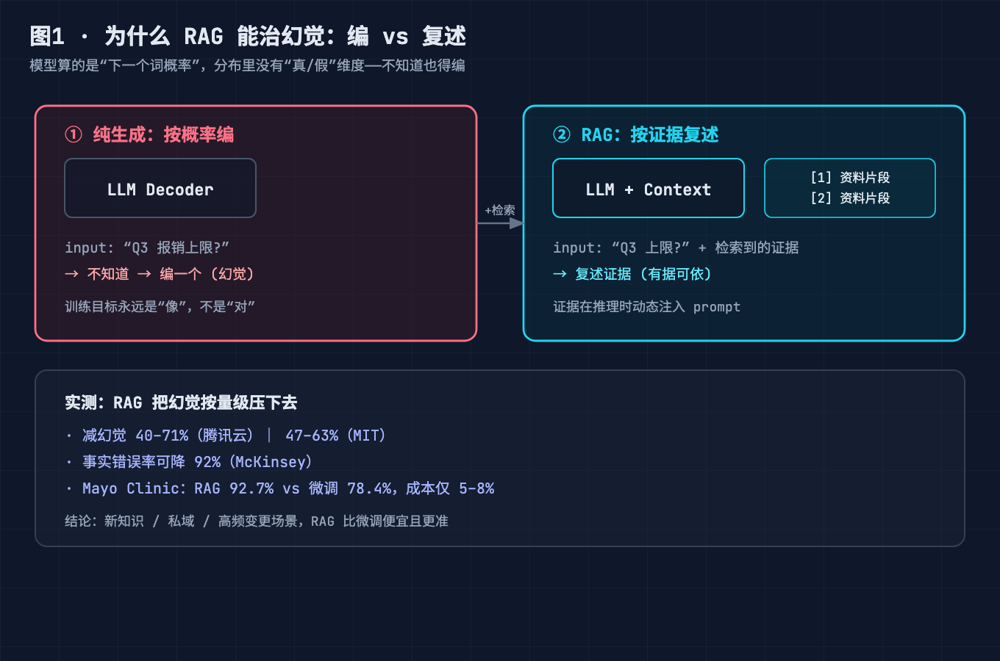
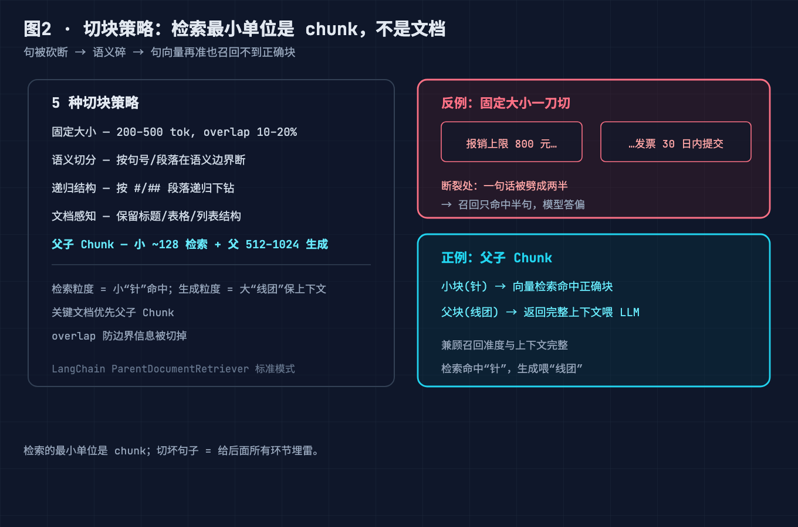
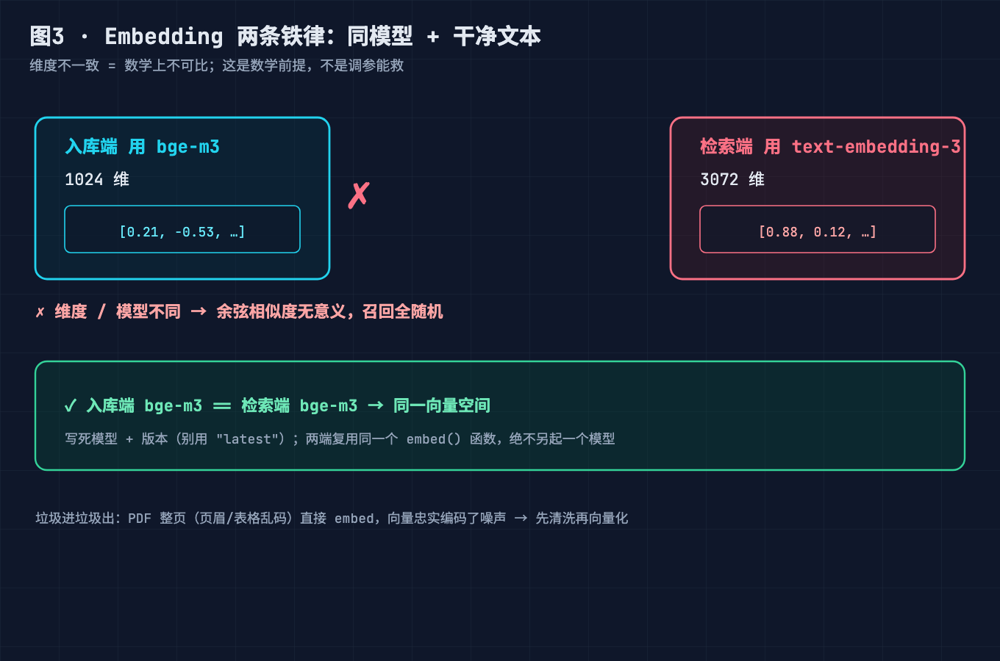
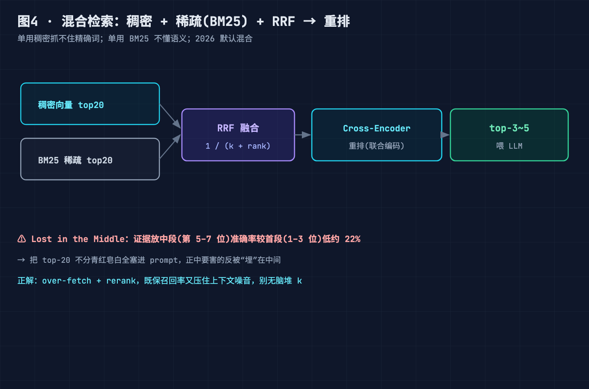
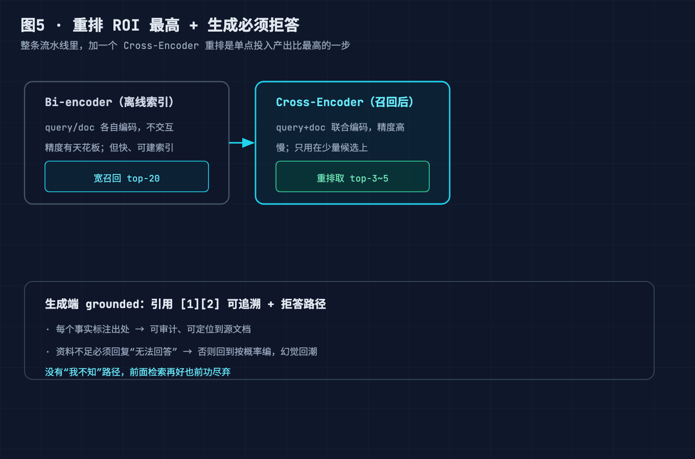
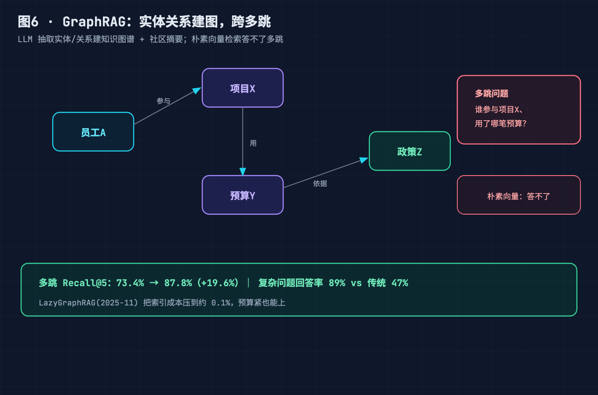
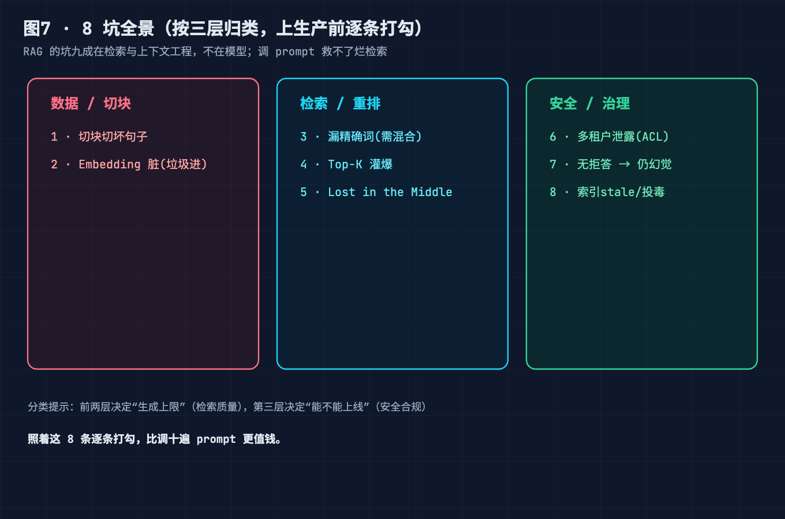

# RAG 接个向量库就完事？从切块到重排的 7 步流水线，我替你踩了 8 个深坑

> 这不是一篇"RAG 是什么"的科普。默认你写过 LLM 应用、调过 embedding、被"答非所问"和"一本正经胡说八道"折磨过。我们直接从一个**上线后老板拿着错误答案找上门的故障**拆起，把它归到几个机制性真凶，再给你一份**上线前能直接照着过的 8 坑清单**。最后你会发现：RAG 早就不是"数据库查询"，而是一门**把证据动态喂给模型的上下文管理学科**。

---

## 0. 先别急着加 GPU，看这个故障

你接了个内部知识库问答，FAISS 一建、OpenAI embedding 一调、`similarity_search(top_k=5)` 一查，本地 20 条样本答得有模有样。于是你信心满满上了生产。

一周后三件事同时爆了：

- **老板问"Q3 报销政策改了哪几条"，它背的还是去年的旧版**——索引从建好的那天起就 stale 了；
- **法务同事的名字出现在给销售的回答里**——多租户数据没隔离，A 公司的文档被召回给了 B 公司的人；
- **用户问一个精确编号"SR-2026-088"，它答得离谱**——纯向量检索根本抓不住这种精确字符串。

如果你的诊断直觉是"模型不行""换个大模型""embedding 不够强"——这篇文章就是来推翻这三个直觉的。RAG 的坑，**九成在检索与上下文工程，不在模型**。

---

## 问题 1：为什么大模型"必然"幻觉，而 RAG 凭什么能治？——底层概率机制

**【论点】** 模型算的是"下一个词的概率分布"，这个分布里**没有"真/假"这个维度**。它不知道自己不知道，不知道的也得按概率编一个。RAG 不变模型的参数，而是把证据**动态塞进上下文**，让它"有据可依"。

**【事实】** 自回归生成的每一步，都是在条件于前文的情况下，从词表上采一个概率最高的续写。训练目标永远是"像"，不是"对"。所以当问题超出预训练语料（新知识、私域文档、刚发生的变更），模型就只能用"最像正确答案的 token"去凑——这就是幻觉的来源，是机制性的，不是 bug。

RAG 的"为什么有效"在于：**把答案的证据在推理时注入 prompt**，模型被引导去"复述证据"而非"凭空生成"。实测里它确实把幻觉按量级压下去了：

- 腾讯云实测：RAG 相对纯生成**减幻觉 40–71%**；
- MIT 相关研究：特定任务区间 **47–63%**；
- McKinsey 报告：事实性错误率可降 **92%**；
- Mayo Clinic 案例：RAG（92.7%）显著优于微调（78.4%），而**成本仅为微调的 5–8%**（其财务规则每季度更新，微调不划算）。

**【论证】** 结论很工程化：**新知识 / 私域 / 高频变更的场景，RAG 比微调便宜且更准**。下面是"grounded prompt"的雏形——注意它强制模型只基于片段作答，并引用来源：

```text
你是一个严谨的问答助手。只能依据下面【资料】中的内容回答，
【资料】之外的信息一律视为未知。
若资料不足以回答，必须回复"根据现有资料无法回答"。
回答中每个事实后用 [1][2] 标注出处。

【资料】
[1] 2026 Q3 报销政策：差旅报销上限提升至 800 元/天……
[2] 2026 Q3 报销政策：发票须在发生后 30 日内提交……
```

> 图 1 · 幻觉的来源与 RAG 的治法是两回事：模型按概率"编"，RAG 按证据"复述"。这一节讲的是"为什么"，后面 6 节讲的是"怎么把证据可靠地喂进去"。



---

## 问题 2：为什么切块切坏了，检索就崩？——Chunking 是流水线命门

**【论点】** 检索的最小单位不是"文档"，是"chunk"。你把一句话从中间砍断，语义就碎了，句向量再怎么算也召回不到正确的块。

**【事实】** 切块有五种主流策略，各有取舍：

| 策略 | 做法 | 适用 |
| --- | --- | --- |
| 固定大小 | 每 200–500 token 一刀，overlap 10–20% | 通用、最快 |
| 语义切分 | 按句号/段落在语义边界断 | 长文、论述 |
| 递归结构 | 按 `#`/`##`/段落递归下钻 | Markdown / 代码文档 |
| 文档感知 | 保留标题层级、表格、列表结构 | 技术手册、API 文档 |
| 父子 Chunk | 小块（~128 token）用于检索，父大块（512–1024 token）喂 LLM | 既要准又要上下文全 |

最经典的反模式：**固定大小一刀切，把"报销上限 800 元"和"发票 30 日内提交"劈成两半**。召回时只命中半句，模型自然答偏。**父子 Chunk** 是正解——检索用小粒度的"针"，生成用大粒度的"线团"。

**【论证】** 下面是父子 chunk 的最小实现（LangChain 风格）：

```python
from langchain.text_splitter import RecursiveCharacterTextSplitter
from langchain.retrievers import ParentDocumentRetriever

# 父文档：大块，喂给 LLM
parent_splitter = RecursiveCharacterTextSplitter(chunk_size=1024, chunk_overlap=100)
# 子文档：小块，用于向量检索
child_splitter  = RecursiveCharacterTextSplitter(chunk_size=128,  chunk_overlap=16)

retriever = ParentDocumentRetriever(
    vectorstore=vs,            # 用 child 块建索引
    docstore=store,            # 用 parent 块存原文
    child_splitter=child_splitter,
    parent_splitter=parent_splitter,
)
hits = retriever.get_relevant_documents("Q3 报销上限是多少？")
# 召回的是 128-token 小子块，但返回的是它所属的 1024-token 父块
```

> 图 2 · 5 种切块策略对比：固定大小最快但易碎语义；父子 Chunk 用"小块检索 + 大块生成"兼顾召回准度与上下文完整。



---

## 问题 3：为什么 Embedding 不是魔法？——同模型硬约束 + 垃圾进垃圾出

**【论点】** 向量化不是"把文字变魔法数字"。两个硬约束卡死了一大批生产事故：**入库端和检索端必须用同一个 embedding 模型**；喂进去的要是干净文本，不是带噪表格。

**【事实】** 常见模型与维度：

- 中文向：`bge-large-zh`（1024）、`bge-m3`（1024，支持多语言/稀疏）、`m3e`（768）；
- OpenAI：`text-embedding-3-large`（3072）/ `text-embedding-3-small`（1536）；
- 维度不一致的向量**根本没法算余弦相似度**，这是数学前提，不是调参问题。

真实翻车：有人入库用 `bge-m3`、检索时用 `text-embedding-3`，相似度全无意义，召回一片随机。还有人直接把 PDF 整页（含页眉页脚、表格乱码）丢进去，**垃圾进，垃圾出**——embedding 忠实编码了噪声，检索自然准不了。

**【论证】** 把"同模型"钉成一条不可违反的不变式，最好写进构建脚本并固化版本：

```python
# 入库与检索必须共用同一个模型 + 同一个版本
EMBED_MODEL = "BAAI/bge-m3"   # 写死，别用 "latest"

def embed(texts: list[str]) -> list[list[float]]:
    # 入库 cleansing：去页眉页脚、抽表格为文字、按 chunk 切
    cleaned = [clean_for_embed(t) for t in texts]
    return client.encode(cleaned, model=EMBED_MODEL, normalize_embeddings=True)

# 检索端 reuse 同一函数，绝不另起一个模型
query_vec = embed(["Q3 报销上限是多少？"])[0]
```

> 图 3 · Embedding 的两条铁律：入库/检索同模型同版本；喂干净文本。维度不匹配=数学上不可比，这是前提不是 bug。



---

## 问题 4：为什么纯向量检索还不够？——混合检索 + RRF + Lost in the Middle

**【论点】** 稠密向量擅长"语义近"，但抓不住"精确词"。2026 年的默认答案是**混合检索**：稠密向量 + BM25 稀疏 + Reciprocal Rank Fusion（RRF）融合。而且——**召回得越多、塞得越满，反而越容易错**，因为 Lost in the Middle。

**【事实】** 三个点：

1. **混合检索**：精确编号（"SR-2026-088"）、专有名词、报错码，BM25 一抓一个准；语义近义靠向量。两者各召回 top-k，再用 RRF 融合：
   `RRF_score(d) = Σ 1 / (k + rank_i(d))`（k 通常取 60），不依赖各自分数尺度，纯按排名融合。
2. **Lost in the Middle**（Stanford / Harvard / OpenAI，2025 末实测）：给模型 10 段资料，关键信息放在**第 5–7 位时，准确率比放在第 1–3 位低约 22%**。也就是说，把 top-20 不分青红皂白全塞进 prompt，正中要害的反倒被"埋"在中间。
3. 衍生结论：**over-fetch + rerank 才是正解**——先宽召回 top-20，再重排取 top-3~5，既保召回率又压住上下文噪音。

**【论证】** 混合检索 + RRF 的最小实现：

```python
import math

def rrf(lists_of_ranks, k=60):
    """lists_of_ranks: [向量topk文档id, BM25topk文档id, ...]"""
    score = {}
    for ranks in lists_of_ranks:
        for i, doc_id in enumerate(ranks):
            score[doc_id] = score.get(doc_id, 0.0) + 1.0 / (k + i + 1)
    return sorted(score, key=score.get, reverse=True)   # 融合后重排

# 向量 top20 + BM25 top20 → RRF 融合 → 送 reranker 取 top5
fused = rrf([dense_topk(20), bm25_topk(20)])
top5 = cross_encoder_rerank(query, fused[:20])[:5]
```

> 图 4 · 稠密 + 稀疏( BM25) + RRF 融合；再经 Cross-Encoder 重排取 top-3~5。注意：召回越多≠越好，Lost in the Middle 会让中段证据失准。



---

## 问题 5：为什么重排是单点 ROI 最高的优化，而生成必须"拒绝回答"？——Re-ranking + Grounded Generation

**【论点】** 在整条流水线里，**加一个 Cross-Encoder 重排器，是投入产出比最高的一步**；而生成端如果没有"我不知"的退路，前面检索再好也会前功尽弃。

**【事实】** Bi-encoder（embedding）为了能离线建索引，把 query 和 doc 各自编码、**不交互**，精度有天花板；Cross-Encoder 把 query+doc **拼在一起过一遍模型**，能捕捉细微相关性，但慢、只能用在召回后的少量候选上。所以标准打法：embedding 宽召回 top-20 → Cross-Encoder 重排 → 取 top-3~5。这一步单独就能把答案质量抬一大截。

生成端要补两件事：**引用 [1][2]**（可追溯、可审计）+ **拒答路径**（资料不足就说不知道）。没有拒答，模型会在证据缺失时回到"按概率编"，幻觉回潮。

**【论证】** 重排器调用示意（以 `bge-reranker` 为例）：

```python
from sentence_transformers import CrossEncoder

reranker = CrossEncoder("BAAI/bge-reranker-v2-m3")

pairs = [(query, doc) for doc in retrieved_docs[:20]]
scores = reranker.predict(pairs)
ranked = [d for _, d in sorted(zip(scores, retrieved_docs[:20]), reverse=True)]
context = ranked[:5]   # 只取 top5 喂给 LLM
```

> 图 5（左）· Cross-Encoder 重排：query+doc 联合编码，精度高于离线 Bi-encoder，但只能用在少量候选上——所以放在"宽召回之后"。
> 图 5（右）· 生成端 grounded：引用 + 拒答，没有"我不知"路径，幻觉会回潮。



### 小结：5 个问题合起来，回答了标题那个大问题

回到标题那句"RAG 接个向量库就完事？"——答案是否定的，而且这 5 个问题恰好说明了"差在哪"：

- **问题 1** 说，向量库**治不了幻觉**：它只存向量，真正治幻觉的是"把证据动态塞进上下文"这个发生在向量库**之外**的动作；
- **问题 2** 说，切块在**入库之前**：切坏了，库里就是语义碎片，后面再怎么查都救不回来；
- **问题 3** 说，库**以内**的前提是"入库与检索同模型同维度"，否则库里全是数学上不可比的数；
- **问题 4** 说，向量库的**原生模式**抓不住"SR-2026-088"这种精确词，必须混合 BM25+RRF；
- **问题 5** 说，向量库吐出 top-k 只是**出库之后**的起点，重排决定精度上限、grounded 生成决定能否拒答。

合起来看：向量库其实只是整条 RAG 流水线里"**存储 + 初检**"那一小段，5 个问题分别落在它的"前、内、后、上、下"五个方位。"接个向量库就完事"把 7 步做成了 1 步，剩下 6 步——切块、Embedding、混合检索、重排、生成与拒答——才是它上线后不出错、不闹笑话的真正战场。

---

## 进阶：朴素 RAG "已死"，但 RAG 没死——三个新范式

朴素 RAG（检索→拼 prompt→生成）踩完上面这些坑，基本就到了天花板。2024 年起演化出几条清晰的新路，值得在选型时心里有数：

- **GraphRAG（微软，2024-07 开源）**：LLM 抽取实体/关系建知识图谱 + Leiden 社区检测 + 层级摘要。强在多跳推理——某实测多跳 QA 的 Recall@5 从 **73.4% 涨到 87.8%（+19.6%）**，复杂问题回答率 **89% vs 传统 47%**。代价是索引贵；**LazyGraphRAG（2025-11）把索引成本压到约 0.1%**，更适合预算紧的场景。
- **Adaptive RAG**：先用一个轻量分类器判断查询类型，再路由（直接答 / 单跳检索 / 多跳检索）。实测 **检索准确率 +40%、延迟 -40%、API 成本 -30~50%**。
- **Agentic RAG**：把检索本身做成 ReAct 行动循环——模型自己决定"再查一次""换关键词""查哪个数据源"。Gartner 2026 初估计仅约 **30% 进入生产**，仍 early。

> 图 6 · GraphRAG 多跳推理：实体关系建图 + 社区摘要，跨越"谁—参与—哪个项目—用了哪笔预算"这类多跳问题，朴素向量检索答不了。



一个重要判断：**"RAG 已死"是伪命题**。它和长上下文是互补而非替代——"RAG 负责找，长上下文负责读"。Karpathy 2026-04 提的"LLM Wiki"、Anthropic 2026-09 的"上下文工程"、微软 2025-11 的 LazyGraphRAG，指向的是同一件事：RAG 正在变成"上下文管理"这门更大学科的一个子集。

---

## 8 个生产踩坑清单（单独成节，便于收藏）

前面 5 个是机制，这一节是**照着过的清单**。每条给"症状 + 解法"，建议收藏后上线前逐条打勾。

**1 · 切块切坏句子**
症状：检索经常命中半句、答非所问。
解法：语义/递归/父子 chunk；关键文档用父子 Chunk（小块检索、父块生成）。

**2 · Embedding 非魔法（垃圾进垃圾出）**
症状：相似度算出来没意义、召回随机。
解法：入库/检索同模型同版本写死；PDF 先清洗页眉页脚、表格转文字再 embed。

**3 · 纯向量检索漏精确词**
症状："SR-2026-088""ERROR_XYZ"这类精确串答不上来。
解法：上混合检索（稠密 + BM25 + RRF），精确串交给稀疏。

**4 · Top-K 静态截断 / 上下文灌爆**
症状：top_k 从 5 调到 20，成本翻 3 倍、质量反而降。
解法：over-fetch top-20 → Cross-Encoder 重排 → 取 top-3~5；别无脑堆 k。

**5 · Lost in the Middle**
症状：证据在资料中段时，答案质量明显下降（约 -22%）。
解法：重排把关键证据顶到前几位；控制上下文长度，别一锅烩。

**6 · 多租户数据泄露**
症状：A 公司文档出现在 B 公司回答里。
解法：ACL 在 **chunk 级或库级**做隔离；检索前按租户过滤，绝不跨租户召回。

**7 · 无"我不知"路径 → 仍幻觉**
症状：资料不足时模型照样编。
解法：grounded prompt 强制"资料不足即拒答" + 引用 [1][2] 可追溯。

**8 · 索引 stale / 静默反馈循环退化**
症状：政策改了三个月，答案还是旧版；或检索越用越窄。
解法：CDC / 定时重建索引；Google DeepMind（Nature, 2026-05）指出检索系统会在 2000–5000 次查询内收敛到窄子集（"检索回音壁"），需主动注入多样性、监控召回分布。另有 CMU 实测**检索投毒成功率可达 63%**——外部语料要当不可信源、做内容校验。

> 图 7 · 8 坑全景：按"数据/切块 / 检索/重排 / 安全/治理"三层归类。上生产前逐条打勾，比调 prompt 重要得多。



---

## 升华：RAG 踩中的，全是检索与上下文工程的老题

写到这里，三条能带走的东西：

1. **RAG 的瓶颈在检索与上下文，不在模型。** 切块、embedding、混合检索、重排、上下文长度——这些全是信息检索和 IR 的老命题，被 LLM 重新激活。换更大的模型救不了烂检索。
2. **"接个向量库"是最危险的起点。** 向量库只是存储层；真正的功夫在它前后——切块怎么切、模型同不同、召回够不够、重排有没有、ACL 做没做、索引新不新。
3. **RAG 是一门上下文管理学科，不是数据库查询。** 它和长上下文、上下文工程同源；目标是"在正确的时刻，把正确的证据，以正确的密度，喂给模型"。

---

## 回到标题：用一个问题收束全文

回到开头的故障：老板拿着错误答案找上门，日志显示"向量库查了、top_k=5 也给了、模型没报错"，但答案就是错——

**你现在的第一排查直觉，会去查哪一层？是 chunk 把关键句切碎了、Embedding 两端模型不一致、纯向量漏了精确词、还是多租户的 ACL 根本没做？**

欢迎在评论区**贴你的 RAG 翻车现场**（脱敏即可），我们可以一起按这 8 坑逐条定位。也欢迎聊聊：你现在卡在哪一关——是还在 `similarity_search(top_k=5)` 爽跑，还是已经撞上了混合检索 / 重排 / 多租户隔离 / 索引陈旧的墙？

如果这篇帮你少踩了几个坑，点个赞或收藏，把这份 8 坑清单存下来；也欢迎去 GitHub 把文章里提到的 bge-reranker、微软 GraphRAG、LangChain ParentDocumentRetriever 翻出来对照看——**模型在变，但"检索质量决定生成上限、上下文密度决定答案下限"这条不会变。**

---

### 参考来源（均可核实）

- **机制 / 减幻觉**：大模型自回归按概率分布生成、分布无"真/假"维度（机制性幻觉）；RAG 减幻觉实测区间 40–71%（腾讯云）、47–63%（MIT 相关研究）、事实错误率降 92%（McKinsey）；Mayo Clinic RAG 92.7% vs 微调 78.4%、成本 5–8%（财务规则季度更新场景）。均可在各家技术博客 / 论文转述中核实。
- **Chunking**：固定大小 / 语义 / 递归 / 文档感知 / 父子 Chunk 五种策略；父子 Chunk（小 128 检索、父 512–1024 生成）为 LangChain `ParentDocumentRetriever` 标准模式。
- **Embedding**：`bge-large-zh`(1024) / `bge-m3`(1024，多语言+稀疏) / `m3e`(768) / `text-embedding-3-large`(3072) / `text-embedding-3-small`(1536)；入库与检索须同模型同维度为向量相似度计算的数学前提。
- **向量库 / 索引**：FAISS、Milvus、pgvector、Pinecone、Weaviate、Qdrant、Chroma；HNSW vs IVF 为两类主流 ANN 索引。
- **混合检索 / RRF / Lost in the Middle**：稠密 + BM25 稀疏 + Reciprocal Rank Fusion（`1/(k+rank)`）为 2026 默认推荐；Lost in the Middle 由 Stanford / Harvard / OpenAI 于 2025 末实测，10 段资料中段（5–7 位）准确率较首段（1–3 位）低约 22%。
- **重排**：Cross-Encoder（query+doc 联合编码）精度高于离线 Bi-encoder，但仅适用于召回后少量候选；`bge-reranker-v2-m3`、Cohere Rerank v3、Jina / Voyage / Mixedbread 为标准选型；over-fetch top-20 → 重排 → top-3~5 为单点 ROI 最高优化。
- **新范式**：GraphRAG 微软 2024-07 开源（实体/关系建图 + Leiden 社区 + 层级摘要），多跳 Recall@5 73.4%→87.8%（+19.6%）、复杂问题 89% vs 47%（VentureBeat / 相关实测转述）；LazyGraphRAG 2025-11 索引成本约 0.1%；Adaptive RAG 分类器路由 +40% 准确率 / -40% 延迟 / -30~50% 成本；Agentic RAG 检索即 ReAct 循环，Gartner 2026 初约 30% 进生产。
- **安全 / 治理**：多租户 ACL 须在 chunk/库级隔离；CMU 2025 检索投毒实测成功率 63%；Google DeepMind（Nature, 2026-05）"检索回音壁"——系统在 2000–5000 查询内收敛到窄子集；Gartner 预警 2026 年 80% 企业 RAG 失败、头号原因为数据治理差；有治理知识库检索准确率 85–92% vs 无治理 45–60%。
- **评测**：RAGAS（Faithfulness 目标 ≥0.8、Answer Relevancy、Context Precision/Recall）、TruLens 为业界标准。
- **"RAG 已死"证伪**：与长上下文互补（"RAG 找，长文本读"）；Karpathy 2026-04 "LLM Wiki"、Anthropic 2026-09 "上下文工程"、Microsoft 2025-11 LazyGraphRAG 均指向 RAG 成为"上下文管理"子集。

---

### 【发布前删除】图片 CDN 替换清单

本文 7 张配图待渲染为本地 PNG（位于 `diagram/rag/`）。发布到掘金前，请按下面顺序把正文里的本地路径替换成掘金图床 CDN 链接：

| 顺序 | 正文里搜这个本地路径 | 替换成 |
| --- | --- | --- |
| 图 1 | `./diagram/rag/01-why-rag-works@2x.png` | 掘金上传后得到的 CDN 链接 |
| 图 2 | `./diagram/rag/02-chunking-strategies@2x.png` | 掘金上传后得到的 CDN 链接 |
| 图 3 | `./diagram/rag/03-embedding-constraint@2x.png` | 掘金上传后得到的 CDN 链接 |
| 图 4 | `./diagram/rag/04-hybrid-retrieval-rerank@2x.png` | 掘金上传后得到的 CDN 链接 |
| 图 5 | `./diagram/rag/05-rerank-grounded@2x.png` | 掘金上传后得到的 CDN 链接 |
| 图 6 | `./diagram/rag/06-graphrag-multihop@2x.png` | 掘金上传后得到的 CDN 链接 |
| 图 7 | `./diagram/rag/07-production-pitfalls@2x.png` | 掘金上传后得到的 CDN 链接 |

替换完成后，连同本"替换清单"小节一起删除即可。
