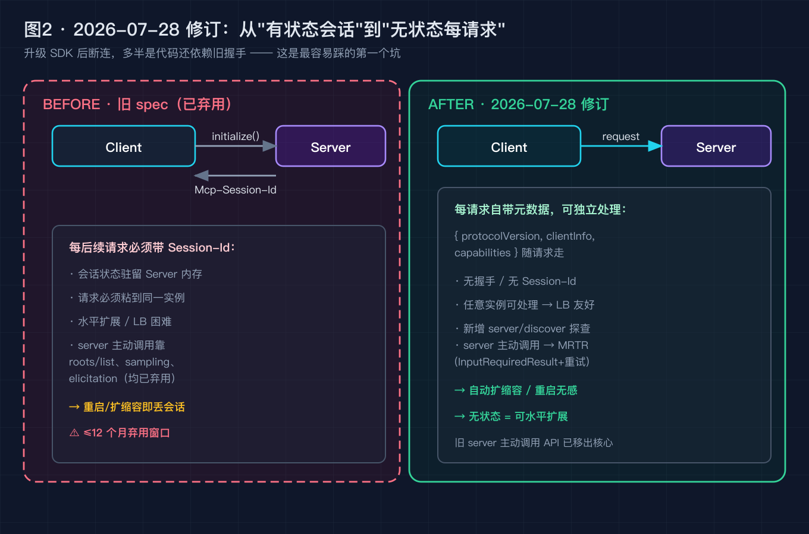
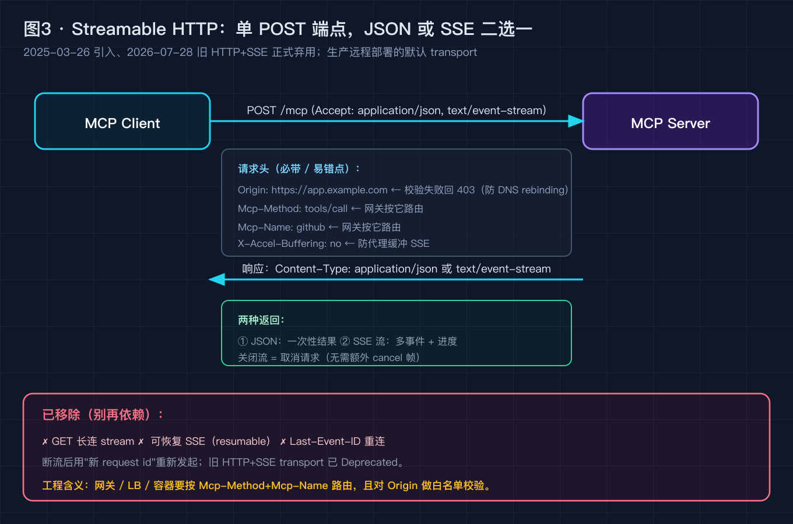
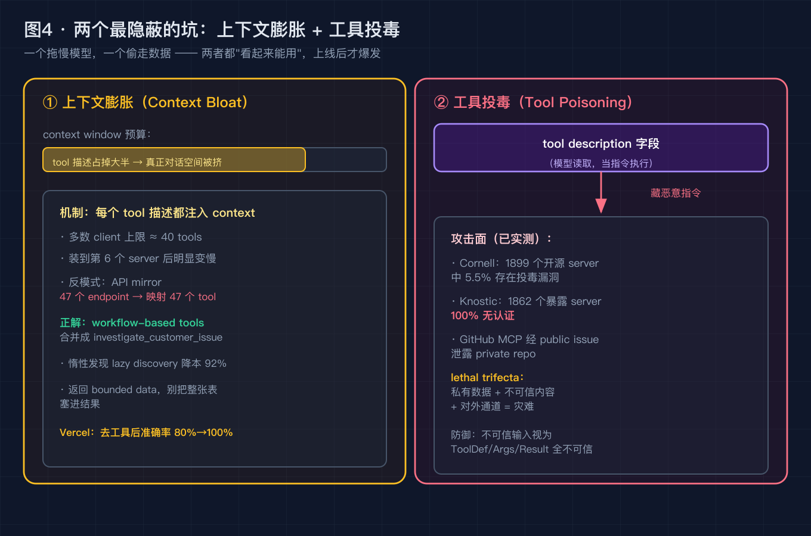
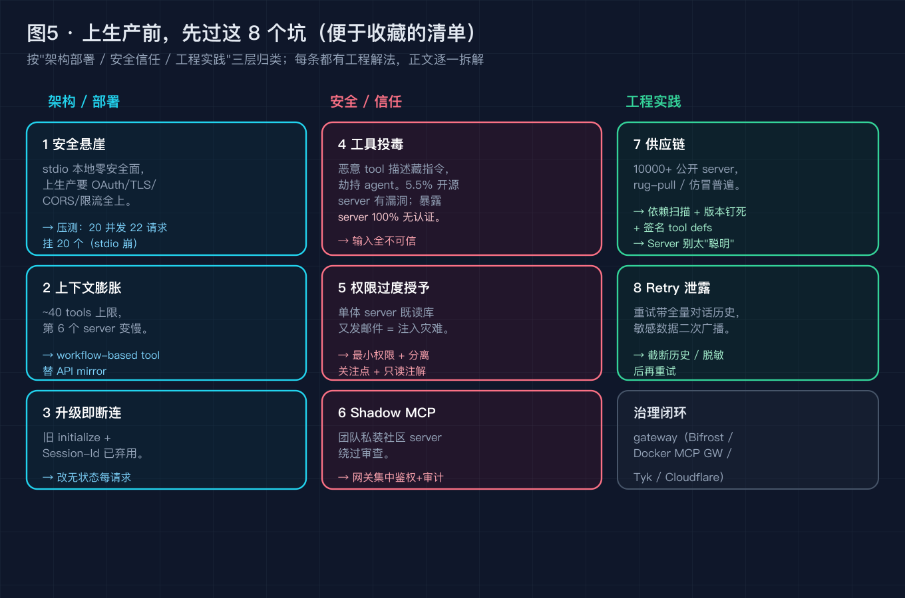

# MCP 上生产就崩？2026-07-28 修订后，这 8 个坑我替你踩了（附生产级避坑清单）

> 这不是一篇"MCP 是什么"的科普。默认你写过 Agent、调过 tool calling、被 stdio 和 HTTP 折腾过。我们直接从一个**半夜把人叫醒的生产故障**拆起，把它归到 4 个机制性真凶，再给你一份**上生产前能直接照着过的 8 坑清单**。最后你会发现：2026 年最热的那个协议，踩中的全是经典的后端/安全老问题。

---

## 0. 先别急着升级 SDK，看这个故障

你本地用 stdio 跑 MCP Server，Cursor / Claude Code 里调得飞起。然后按"生产化"教程，把它换成 Streamable HTTP 挂到网关后面——

上线当天，三件事同时炸了：

- **客户端升级 SDK 后，会话全断**：旧代码依赖 `initialize()` 握手和 `Mcp-Session-Id` 粘会话，新 spec 直接把这套删了；
- **请求被网关拦一半**：Origin 没在白名单，直接 403（DNS rebinding 防护）；
- **灰度流量一上来，20 个并发里挂了 20 个**：stdio 那套"每连接一个进程"的架构，在容器里被压垮。

如果你现在的诊断直觉是"协议不成熟""再等版本""模型不行"——这篇文章就是来推翻这三个直觉的。MCP 的坑，**九成在协议之外的工程老地方**。

---

## 问题 1：为什么你升级 SDK 就断连？——协议从"有状态"变"无状态"了

**【论点】** 2026-07-28 那次修订，把 MCP 从"有状态会话"改成了"无状态每请求"。你那段靠 `Mcp-Session-Id` 粘实例的代码，不是要修，是要删。

**【事实】** 修订前的会话模型是这样的：Client 先 `initialize()`，Server 回一个 `Mcp-Session-Id`，之后**每个请求都带着这个 Id**，状态驻留在 Server 内存。这带来两个硬约束——请求必须粘到同一实例、重启即丢会话。

2026-07-28 之后：

- 移除 `initialize` / `notifications/initialized` 握手，移除 `Mcp-Session-Id`；
- **每个请求自带** `{ protocolVersion, clientInfo, capabilities }`，Server 可独立处理，无需"会话"；
- 新增 `server/discover`，Client 主动探查能力；
- 旧的 server 主动调用（`roots/list`、`sampling/createMessage`、`elicitation/create`）被 **MRTR（Multi Round-Trip Requests, SEP-2322）** 取代：Server 不再主动回调，而是返回 `InputRequiredResult`（含 `inputRequests`），Client 带着 `inputResponses` 重试原请求。

**【论证】** 这一改的动机很工程化：**无状态 = 可水平扩展**。旧模型里 Server 是"有记忆的长连接"，LB 和自动扩缩容都很难做；新模型里每个 request 自包含，任意实例都能处理。代价是——所有依赖旧握手的代码，升级即断。先看一眼新请求的"自包含"长相：

```json
// 2026-07-28 之后：每个请求自带元数据，无需握手
{
  "jsonrpc": "2.0",
  "id": 1,
  "method": "tools/call",
  "params": {
    "protocolVersion": "2026-07-28",
    "clientInfo": { "name": "my-agent", "version": "2.3.0" },
    "capabilities": { "tools": { "listChanged": true } },
    "name": "github",
    "arguments": { "repo": "org/repo" }
  }
}
```

> 图 2 · 有状态 → 无状态：旧握手 + Session-Id 已进弃用窗口；新 spec 每请求自包含，可 LB、可自动扩缩容。升级 SDK 后断连，多半是代码还攥着 `Mcp-Session-Id` 不放。



---

## 问题 2：为什么本地 stdio 好好的，上生产就崩？——安全悬崖

**【论点】** stdio 在本地是"零安全面"（进程间管道，没人能从外面够到），一上生产这套假设全部失效。这不是 MCP 的 bug，是**部署拓扑换了，安全模型没跟着换**。

**【事实】** 生产远程部署的默认 transport，已从 2025-03-26 引入的 **Streamable HTTP** 接管，旧的 HTTP+SSE 在 2026-07-28 正式 Deprecated。单 POST 端点（如 `/mcp`），`Accept: application/json, text/event-stream`，Server 回 JSON 或 SSE 流。它强制你处理一堆本地没有的攻击面：

- **Origin 校验**：非法 Origin 直接 403，防 DNS rebinding 把请求拐到你内网；
- **`Mcp-Method` / `Mcp-Name` 头**：网关靠它把请求路由到对应 Server（不是靠 URL 路径）；
- **`X-Accel-Buffering: no`**：防反向代理把 SSE 缓冲住，导致流"假死"；
- 关闭流即取消请求；**已移除 GET stream、可恢复 SSE、Last-Event-ID**——断流要用新 request id 重新发起。

压测数据也很能说明问题：Stack Lock 把 stdio Server 直接怼到 20 并发 22 个请求，**20 个全挂**——因为 stdio 的"每连接一个进程"在容器里根本撑不住。

**【论证】** 所以"本地能跑"在生产里几乎不算证据。下面是上线前**必须**加的 Origin 白名单校验（Node 侧示意）：

```ts
// 网关 / Server 入口：Origin 白名单，否则 403
const ALLOWED = new Set(["https://app.example.com", "https://ide.example.com"]);
app.use((req, res, next) => {
  const origin = req.headers.origin;
  if (!origin || !ALLOWED.has(origin)) {
    return res.status(403).end(); // 防 DNS rebinding 拐进内网
  }
  res.setHeader("X-Accel-Buffering", "no"); // 别让代理缓冲 SSE
  next();
});
```

> 图 3 · Streamable HTTP：单 POST 端点，JSON 或 SSE 二选一；Origin / Mcp-Method / Mcp-Name / X-Accel-Buffering 是生产必选项，旧 HTTP+SSE 已弃用。



---

## 问题 3：为什么装到第 6 个 server，模型就变笨了？——上下文膨胀

**【论点】** MCP 的"能力"不是免费的：每个 tool / resource 的描述都会被注入上下文窗口，它是**按 token 计费的预算**，不是无限插槽。

**【事实】** 多数 client 对单个会话的 tool 数量有软上限（约 **40 个**），超过后模型开始"选择性遗忘"；实测里装到第 6 个 server 之后，调用准确率肉眼可见地掉。最典型的反模式是 **API mirror**——把 47 个 REST endpoint 原样映射成 47 个 tool。Vercel 给的建议是 **workflow-based tools**：

```python
# 反模式：API mirror —— 47 个 endpoint → 47 个 tool，描述撑爆上下文
@mcp.tool()
def get_customer_profile(id): ...
@mcp.tool()
def list_customer_orders(id): ...
@mcp.tool()
def get_order_items(order_id): ...

# 正解：workflow-based —— 合并成一个有业务语义的 tool
@mcp.tool()
def investigate_customer_issue(customer_id: str) -> str:
    """拉齐客户档案+近期订单+异常项，返回一页可读摘要。"""
    ...
```

再加上 **lazy discovery**（按需暴露工具，而非启动全量注册）实测降本 **92%**；结果返回 **bounded data**（别把整张表塞进 `result`）。Vercel 去掉部分工具后，Agent 准确率从 80% 飙到 100%、token 降 40%、速度 ×3.5——加法上瘾是上下文工程头号敌人，对 MCP 同样成立。

> 图 4（左）· 上下文膨胀：tool 描述占掉大半窗口预算，真正对话空间被挤；~40 tools 上限，第 6 个 server 后变慢。正解是 workflow-based + lazy discovery。



---

## 问题 4：为什么你信任的 server 会偷数据？——工具投毒

**【论点】** 在 MCP 里，`tool.description` 不是给人看的注释，是**模型读取并当指令执行的文本**。你以为你在"接一个工具"，模型读到的可能是"一段藏了指令的提示"。

**【事实】** 这不是假设，是已被实测的攻击面：

- Cornell 研究扫描 **1899 个**开源 MCP server，**5.5%** 存在工具投毒漏洞；
- Knostic 2025-07 扫描 **1862 个**公网暴露的 server，**100% 无认证**；
- 真实案例：GitHub MCP 经一个 **public issue** 泄露了 private repo 内容；WhatsApp 凭证经投毒 server 外泄；
- Simon Willison 总结的 **lethal trifecta（致命三要素）**：私有数据 + 不可信内容 + 对外通道，三者齐了就是数据外泄。

**【论证】** 防御的第一原则：**把不可信输入当代码看**——Tool Definition / Arguments / Resource Content / Result Content **全不可信**。输入用 Pydantic / Zod 做 schema 校验（防 command injection），最小权限运行，只读数据用 annotation / resource 而非可写 tool。一份最小校验示例：

```python
from pydantic import BaseModel, ValidationError

class QueryArgs(BaseModel):
    repo: str  # 只允许 "org/name" 形式，拒绝 "../"、绝对路径等注入
    limit: int = 10

def safe_tool(raw: dict):
    try:
        args = QueryArgs(**raw)        # 先校验，再执行
    except ValidationError as e:
        return f"invalid args: {e}"
    return run_query(args.repo, args.limit)
```

> 图 4（右）· 工具投毒：`tool.description` 字段被塞进恶意指令劫持 agent；5.5% 开源 server 有漏洞、暴露 server 100% 无认证。lethal trifecta = 私有数据+不可信内容+对外通道。

---

## 8 个生产踩坑清单（单独成节，便于收藏）

前面 4 个是机制，这一节是**照着过的清单**。每条都给"症状 + 解法"，建议收藏后上线前逐条打勾。

**1 · 安全悬崖（stdio → 生产）**
症状：本地丝滑，公网一挂就 403 / 被打挂。
解法：远程部署一律走 Streamable HTTP；加 Origin 白名单、TLS、CORS、`Mcp-Method`/`Mcp-Name` 路由、限流；stdio 上生产前想清楚"安全面从哪来"。

**2 · 上下文膨胀**
症状：server 越装越多，模型越调越傻、越来越慢、越来越贵。
解法：workflow-based tools 替 API mirror；lazy discovery；结果返回 bounded data；定期审计 tool 数量（控制在 ~40 内）。

**3 · 升级即断连（无状态化）**
症状：升级 SDK 后客户端会话全断、握手报错。
解法：删掉对 `initialize` / `Mcp-Session-Id` 的依赖；改成每请求带 `protocolVersion`/`clientInfo`/`capabilities`；server 主动调用改用 MRTR。

**4 · 工具投毒**
症状：模型突然执行了没让它做的事（读私库、发消息）。
解法：Tool/Resource/Result 全不可信；输入 schema 校验；最小权限；只读走 annotation。

**5 · 权限过度授予 / 单体 server 反模式**
症状：一个 server 既能读库又能发邮件，被注入一次就全崩。
解法：按关注点拆 server；最小权限；只读用 resource/annotation，写操作单独鉴权。PKCE（OAuth 2.1）per request 防 confused-deputy。

**6 · Shadow MCP / 无治理层**
症状：团队私自装社区 server，绕过安全审查，你根本不知道生产接了什么。
解法：所有接入走 gateway 统一鉴权 + 审计（Bifrost / Docker MCP Gateway / Tyk / Cloudflare Access）；禁止直连。

**7 · 供应链 + Server 别太"聪明"**
症状：装了个"流行 server"后行为异常；或 server 自己帮模型做了过多分析，反而引入偏差。
解法：依赖扫描 + 版本钉死 + 签名 tool definitions，防 rug-pull / typosquatting（10000+ 公开 server）；Server 是**信息倍增器不是 mini-LLM**——返回原始数据，别预分析摘要，模型更擅长分析。

**8 · Retry 泄露**
症状：agent 重试时把敏感数据二次广播给下游。
解法：重试前截断 / 脱敏历史；敏感凭证走独立通道，不进对话上下文。

> 图 5 · 8 坑全景：按"架构部署 / 安全信任 / 工程实践"三层归类。上生产前逐条打勾，比调 prompt 重要得多。



---

## 升华：MCP 踩中的，全是后端/安全的老题

写到这里，三条能带走的东西：

1. **协议解决的是"连接"，解决不了"信任与规模"。** M×N 的集成痛苦被 MCP 标准化了，但认证、限流、隔离、供应链这些老问题一个没少，只是从"每个团队自己糊"变成"协议层统一面对"。
2. **本地假设在生产里基本作废。** stdio 的零安全面、单进程的简单性，上了网关和容器就反转成攻击面和扩展瓶颈。部署拓扑变了，安全模型必须跟着变。
3. **Server 该是管道，不该是脑子。** 信息倍增器 + 最小权限 + 原始数据，比"聪明的 server"更稳、更安全、更易审计。

LangChain 的 Harrison Chase 说过一句很适合收束的话（大意）：agent 翻车，多半是因为它手里的上下文/工具不对；MCP 把"接工具"标准化了，但"接进来的是谁、它能干什么、信任边界在哪"，还是你自己的工程责任。

---

## 回到标题：用一个问题收束全文

回到开头的故障：你半夜被叫醒，日志显示"模型没报错、工具描述都注册了、窗口没爆"，但生产就是崩了——

**你现在的第一排查直觉，会去查哪一层？是 stdio→HTTP 的安全悬崖、上下文被 tool 描述撑爆、还是手上的 server 偷偷在 `description` 里塞了指令？**

欢迎在评论区**贴你的 MCP 翻车现场**（脱敏即可），我们可以一起按这 8 坑逐条定位。也欢迎聊聊：你现在卡在哪一关——是还在本地 stdio 爽跑，还是已经撞上了无状态化 / 网关 / 投毒的墙？

如果这篇帮你少踩了几个坑，点个赞或收藏，把这份 8 坑清单存下来；也欢迎去 GitHub 把文章里提到的 spec 修订（2026-07-28）和 MRTR/SEP-2322 翻出来对照看——**协议在变，但"无状态、最小权限、输入不可信"这三个原则不会变。**

---

### 参考来源（均可核实）

- Model Context Protocol 官方 spec 与博客：2024-11 Anthropic 发布；2025-03-26 引入 Streamable HTTP；**2026-07-28 重大修订**（移除 `initialize`/`Mcp-Session-Id` 握手、改为无状态每请求、新增 `server/discover`、MRTR/SEP-2322 取代 server 主动调用、旧 HTTP+SSE transport Deprecated、Roots/Sampling/Logging 进入弃用窗口、DCR→CIMD、Tasks 移出核心成扩展 `io.modelcontextprotocol/tasks`），均可在 modelcontextprotocol.io 与 GitHub anthropics/mcp 仓库核实
- MRTR / SEP-2322：`InputRequiredResult` + `inputRequests` / `inputResponses` 重试机制
- Streamable HTTP 传输规范：单 POST 端点、`Accept: application/json, text/event-stream`、`Origin` 校验（防 DNS rebinding）、`Mcp-Method`/`Mcp-Name` 路由头、`X-Accel-Buffering: no`、移除 GET stream / 可恢复 SSE / `Last-Event-ID`
- Vercel AI 团队：workflow-based tools 反模式（API mirror）、lazy discovery 降本 92%、去工具后准确率 80%→100% / token -40% / 速度 ×3.5（经其工程博客及社区转述）
- Cornell 大学研究：扫描 1899 个开源 MCP server，5.5% 存在工具投毒漏洞
- Knostic 2025-07 扫描：1862 个公网暴露 MCP server，100% 无认证
- Invariant Labs / 公开案例：GitHub MCP 经 public issue 泄露 private repo、WhatsApp 凭证经投毒 server 外泄
- Simon Willison「lethal trifecta」：私有数据 + 不可信内容 + 对外通道 = 数据外泄
- Stack Lock 压测：stdio Server 20 并发 22 请求挂 20 个（stdio 架构扩展瓶颈）
- SDK 支持状态（2026-07-28 spec）：TypeScript / Python / Go / C# 已支持，Rust 仍 beta；OAuth 2.1 + PKCE、Pydantic / Zod 输入校验为推荐实践

---

### 【发布前删除】图片 CDN 替换清单

本文 5 张配图已生成为本地 PNG（位于 `diagram/mcp/`）。发布到掘金前，请按下面顺序把正文里的本地路径替换成掘金图床 CDN 链接：

| 顺序 | 正文里搜这个本地路径 | 替换成 |
| --- | --- | --- |
| 图 2 | `./diagram/mcp/02-stateless-revision@2x.png` | 掘金上传后得到的 CDN 链接 |
| 图 3 | `./diagram/mcp/03-streamable-http@2x.png` | 掘金上传后得到的 CDN 链接 |
| 图 4 | `./diagram/mcp/04-context-bloat-poisoning@2x.png` | 掘金上传后得到的 CDN 链接 |
| 图 5 | `./diagram/mcp/05-production-pitfalls@2x.png` | 掘金上传后得到的 CDN 链接 |
| 图 1（架构，正文未直接嵌入，可放开头或文末） | `./diagram/mcp/01-mcp-architecture@2x.png` | 掘金上传后得到的 CDN 链接 |

替换完成后，连同本"替换清单"小节一起删除即可。
