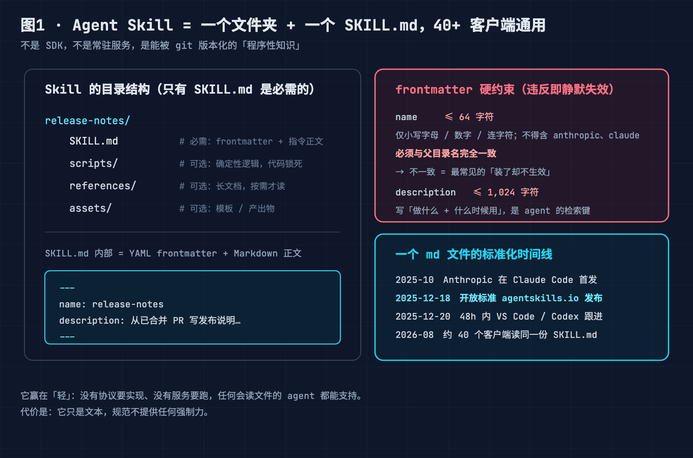
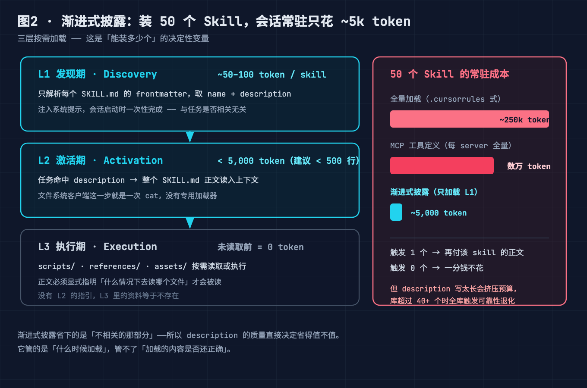
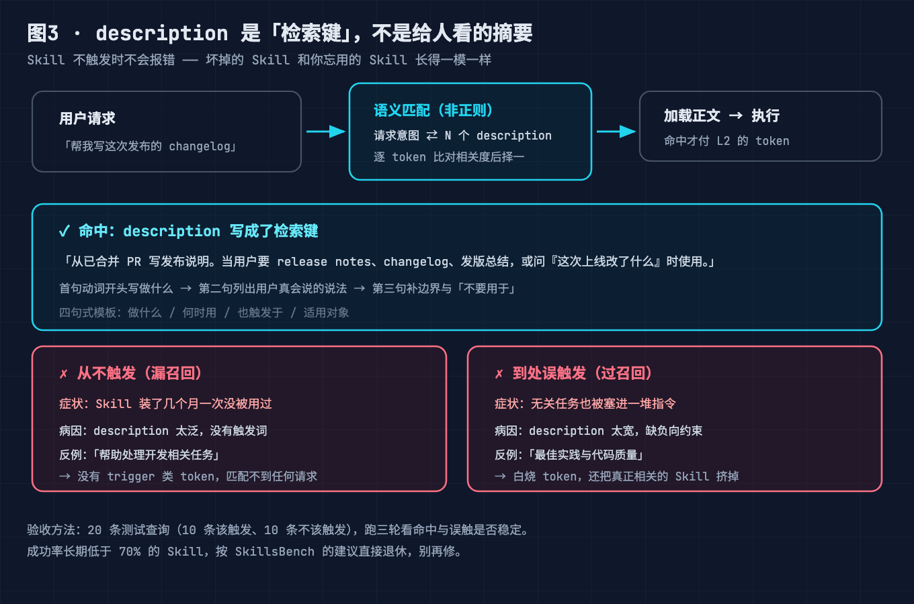
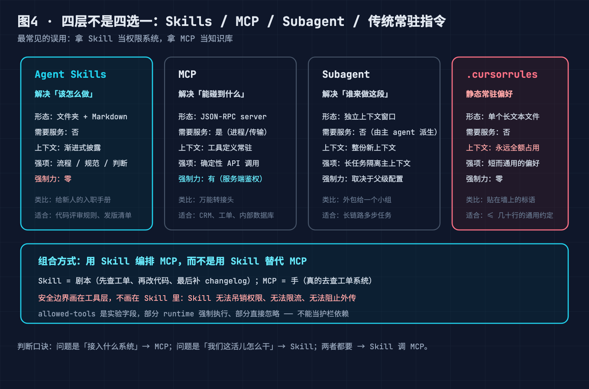
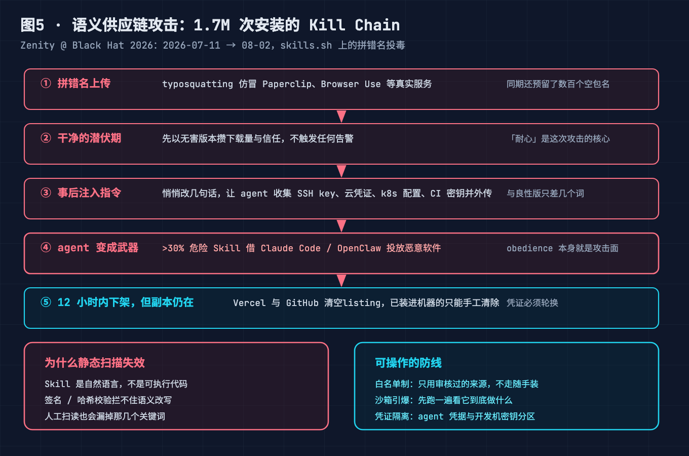

# 装一堆 Skill 却更慢更蠢？SKILL.md 规范 + 渐进式披露 + 9 个深坑，我替你踩了（附 1.7M 投毒 Skill 拆解）

> 8 月 GitHub 月榜新增 25 万+ Star，全是 Skill。mattpocock/skills 单月 +5 万、obra/superpowers 冲到 27.9 万——但同一波里 Black Hat 披露了 **1.7M 投毒 Skill**，Snyk 审计 **13.4%** 含恶意。本文把 SKILL.md 规范、渐进式披露、与 MCP 的边界、以及那条最危险的安全供应链，一次性拆透，并附 9 个生产级深坑。

---

## 0、故障引子：我给 Agent 装了 20 个 Skill，它反而更蠢了

上周我把团队常用的 20 个 Skill 一股脑装进 Claude Code，心想："经验固化，少废话多干活"。结果第二天 code review，它把一段明明该用 Linter 的活儿，套了三个不相关的 Skill 流程，token 烧了三倍，产出还退步了。

我以为是模型不行。直到逐个翻 SKILL.md 才明白——**问题不在模型，在我的装配方式**：有的 Skill `description` 写得太泛，每次都抢答；有的把 800 行正文全塞进 SKILL.md，每次加载都白占上下文；最离谱的一个，装上去之后 Agent 会偷偷 `curl` 一个外网地址。

这 20 个 Skill 就像 20 本塞进背包的说明书——你以为带着就变专家，其实只是背包更重、找东西更慢，还混进了一本带毒的。

**Agent Skills 的坑，九成在"怎么写、怎么装、怎么信"，不在"用不用"。**

### 本文怎么拆这个大问题

"装一堆 Skill 却更慢更蠢" 是一句**症状**，不是问题本身。把它拆开，其实是两个独立的失败模式，各自对应一组待解决的小问题：

- **"更慢" 的真相**：你以为装的是能力，实际每次对话都在把一堆 Skill 正文往上下文里灌——装得越多，Agent 越慢、越贵。
- **"更蠢" 的真相**：该用 Skill 时它装死不触发，或不该用时它抢答挤掉精准 Skill，甚至你压根用错了工具范式（把该接 API 的写成 Skill）。

但这两个症状共享一个**总根**：你并不真的懂 Skill 凭什么"装一堆还不崩"。不懂机制，治"更慢"和治"更蠢"都是瞎调。所以本文的拆解顺序是——**先立机制前提，再分治两个症状，最后封死一个所有人都会忽略的底线风险**：

1. **前提（总根）**：Skill 到底是什么？它凭什么能"装得多"还"跑得快"？
2. **治"更慢"**：一堆 Skill 怎么才能不拖慢 Agent？（→ 渐进式披露）
3. **治"更蠢"·触发**：怎么让 Agent 在该用的时候精准唤起、不该用时不抢答？（→ description 是检索键）
4. **治"更蠢"·范式**：怎么避免"用错工具范式"反而更蠢？（→ Skill vs MCP 边界）
5. **守底线**：Skill 会不会反噬？装错一个会怎样？（→ 供应链投毒）

这 5 个小问题逐一答完，"更慢更蠢"就从症状变成了一棵可复盘的故障树——根因和治法都对上了。

---

## 问题 1（前提）：Skill 到底是什么？凭什么"装一堆还不崩"

很多人第一反应是："不就是高级提示词吗？"——这是最大的误解。提示词是你写给模型的一段话，一次性塞进上下文；Skill 是一整套**可寻址、可调用、按需加载的能力包**，关键差异在三个硬约束：

1. **有标准文件名 `SKILL.md`**。不是随便一个 `.md`，而是 Agent 生态（Claude Code / Codex / Cursor / Gemini CLI / WorkBuddy）约定俗成会去扫描的文件。
2. **有 frontmatter 元数据**。`name` + `description` 不是装饰，是**检索键**——Agent 在"该不该加载这个 Skill"时，只拿用户意图去匹配这两行，正文此时还没进上下文。
3. **可带脚本与资源**。SKILL.md 里可以 `reference` 到同级目录的 `scripts/`、`references/`、`templates/`，这些是真正干活的代码和资料，按需才读。

换句话说，提示词是"你说一遍"，Skill 是"把老手的经验固化成一份带触发条件、带工具、带检查清单的岗位 SOP"。Anthropic 在 2025 年底把它定为**开放标准**，落到你身上就是：一家公司写的 Skill，大概率能在另一家 Agent 跑——不用重复造轮子。

---

## 问题 2（治"更慢"）：渐进式披露——为什么 SKILL.md 越小越好

Skill 最反直觉的设计叫 **Progressive Disclosure（渐进式披露）**：SKILL.md 本体只放"摘要级"内容（name、description、几行指引），真正的细节（长文档、脚本、模板）放在 references/ 里，**只有被需要时才读进来**。

这直接决定了 token 经济学：

- SKILL.md 本体通常控制在 **几百字节到几千字节**。业界最极端的例子是 Anthropic 工程师 Thariq 公开的 ELI5 Skill，整个 SKILL.md 只有 **321 字节**，正文就一句话。
- 完整内容（含 references）单 Skill 通常在 **5000 token 量级**封顶——这是规范层面的软约束，目的是"够用就好，别占上下文"。
- 对比反例：把 800 行规范全写进 SKILL.md，等于**每次**触发都把这 800 行塞进上下文，Agent 还没干活先被淹。

社区里 "caveman" 这类 Skill 靠"让 AI 说人话、砍掉 65% token"冲到近 10 万 Star，本质就是在挣 token 经济学的钱。**渐进式披露不是偷懒，是让正确的知识在正确的时机出现。**

---

## 问题 3（治"更蠢"·触发）：为什么你的 Skill "从不触发"——description 才是检索键

这是新手最高频的坑。你写了一个超棒的 Skill，结果 Agent 从来不调用它。原因几乎总是：**`description` 写得不像"用户会怎么问"。**

Agent 的触发路由是三态的：

- **没命中关键词**：description 写"内部工具调用助手"，用户说"帮我排个简历"，语义对不上，永不触发。
- **太泛导致抢答**：description 写"做任何与代码相关的任务"——结果所有代码任务都先加载它，挤掉更精准的 Skill，还浪费 token。
- **精准命中**：description 写"当用户需要把技术书籍 PDF 转成可引用知识库时使用"，用户一说"把这本 PDF 转成 Skill"，立刻精准唤起。

一句话：**frontmatter 里的 `description` 不是给人类看的注释，是给 Agent 做检索的索引词。** 写它时要站用户视角，用用户会说的词，而不是用你内部的概念名。

---

## 问题 4（治"更蠢"·范式）：Skill 和 MCP 到底什么关系——别再用错边界

"有了 MCP 还搞 Skill 干啥？"——这是第二个高频误解。它们解决的是**不同维度**的问题：

| 维度 | Agent Skills | MCP |
|---|---|---|
| 本质 | **程序性知识**（怎么把一件事做好） | **能力/连接**（能调用什么工具、接什么系统） |
| 形态 | 一个目录 + `SKILL.md` + 脚本 | 一个服务端 + 一组 tool/resource 定义 |
| 解决 | "该按什么流程、踩什么 checklist 干" | "能从哪拿数据、调哪个 API" |
| 类比 | 岗位 SOP | 扳手 + 电源插座 |

一个真实组合：**MCP 提供"连上 GitHub 的扳手"，Skill 提供"按 DEFINE→PLAN→BUILD→VERIFY→REVIEW→SHIP 六阶段写代码的 SOP"**。两者正交，互补不替代。把本该用 MCP 接的工具硬写成 Skill 脚本，或把本该用 Skill 固化的流程塞进 MCP，都是边界错配。

> 进阶一句：和 `.cursorrules` / `CLAUDE.md` 也不同——后者是**常驻上下文**，永远占着；Skill 是**按需加载**，不触发就不占。经验多了，该从"常驻规范"迁到"按需 Skill"。

---

## 问题 5（守底线）：最危险的坑在最后——Skill 是新的供应链攻击面

前面 4 个坑让你"效果差"，这一个坑能让你"被端了"。

因为 Skill 能带**可执行脚本**，且被 Agent 自动加载运行，它天然成了新的供应链攻击面。2026 年 8 月这波热度里，安全圈同步炸出三组数据：

- **Zenity（Black Hat 2026 披露）**：在主流市场里发现 **170 万（1.7M）个投毒 Skill**，通过伪装成热门工具（"PDF 处理""代码审查"）诱导安装，加载即执行恶意指令。
- **Snyk 审计**：抽样的 Skills 中 **13.4%** 含恶意或可疑成分。
- **UMD 语义供应链论文**：论证 Skill 的"描述—加载—执行"链路是新型供应链风险，传统 SBOM 管不到这一层。

典型 kill chain 长这样：攻击者发布一个名字像官方的 Skill（如 `anthropic-pdf-helper`）→ 你 `curl` 安装 → Agent 下次触发时加载它 → SKILL.md 里的指令让 Agent 把 `.env` / 私钥 `curl` 到攻击者服务器，或在这个会话里悄悄调 MCP 工具转账。

**关键认知：Skill 信任模型是"装即信任"。** 它不像 npm 有 lockfile + 签名，GitHub 上同名仓库一大把，下错一个轻则不干活、重则夹带私货。这就是为什么"星标高"不等于"适合我"，更不等于"安全"。

---

### 小结：5 个小问题答完，"更慢更蠢"从症状变成了故障树

回到标题"装一堆 Skill 却更慢更蠢"——它是一句症状，拆开是两个失败模式；上面 5 个问题，正是按"先立前提 → 分治症状 → 守底线"的顺序，把这两个模式逐一解决：

- **前提（问题 1）** 先立机制：Skill 是带 frontmatter 检索键 + 渐进式披露的可寻址能力包——回答了"凭什么装一堆还不崩"，是后面所有治法的地基。
- **治"更慢"（问题 2）** 渐进式披露让 SKILL.md 只当索引、细节按需加载，从根上掐掉"装越多越慢"——**"更慢"这个症状被解决**。
- **治"更蠢"·触发（问题 3）** description 是检索键，写"用户会怎么问"才精准唤起、不抢答——**"该用不用 / 不该用抢答"这部分"更蠢"被解决**。
- **治"更蠢"·范式（问题 4）** Skill 管"怎么做"、MCP 管"能调啥"，边界别错配——**"用错工具反而更蠢"这部分"更蠢"被解决**。
- **守底线（问题 5）** 供应链投毒，装即信任，1.7M 投毒就在榜——这条不是治"更蠢"，是防止"更蠢"升级成"被端"。

合起来：**问题 1 堵住总根，问题 2–4 分治"更慢 + 更蠢"两个症状，问题 5 守住安全底线**。5 个小问题逐一答完，"装一堆 Skill 却更慢更蠢"就不再是玄学，而是一棵根因清楚的故障树——你照着后面 9 坑清单逐条对齐，就能让它变快、变聪明、还不被端。

---

## 三、进阶：三种值得抄的 Skill 形态

看清原理后，三类形态最值得参考：

- **组合式（mattpocock/skills，24 万★）**：把 issue 处理、架构改进、需求澄清拆成独立小模块，"正确时机只加载正确规则"，上下文轻、边界清。适合独立开发者搭积木式工作流。
- **方法论型（obra/superpowers，27.9 万★）**：不是插件包，是一整套"先问清目标再动手"的软件开发纪律，用子 Agent 分工执行。适合复杂、长期代码库。
- **市场/治理型（anthropics/claude-plugins-community）**：官方审核的插件目录。意义不在星标，而在"Skill 竞争从谁会写，进入谁能被安全发现和安装"——治理比数量重要。

趋势很明确：从"提示词"到"能力包"，从"人人写几个"到"需要目录和分发体系"，未来比的是**可信、可维护、可审计**，不是谁囤得多。

---

## 四、9 个生产级深坑（症状 + 解法）

> 以下 9 条，前 5 条对应上面 5 个问题，后 4 条是装配与治理层面的额外深坑。建议收藏，装每一个 Skill 前对照一遍。

**1. SKILL.md 写成大杂烩（不渐进式披露）**
- 症状：每次触发都慢、token 暴涨、Agent 还没干活先被长文淹没。
- 解法：SKILL.md 本体只留 name/description/几行指引；长文档、脚本、模板挪到 `references/`、`scripts/`、`templates/`，按需 `reference`。单 Skill 正文控制在 5000 token 量级内。

**2. description 写成内部黑话（永不触发）**
- 症状：Skill 写好了但 Agent 从不调用。
- 解法：站在用户视角写 description，用"用户会怎么问"的词。如"把技术书 PDF 转成可引用知识库"而非"文档转换助手"。

**3. description 写太泛（抢答挤占）**
- 症状：所有相关任务都先加载它，精准 Skill 被挤掉，token 浪费。
- 解法：收窄触发边界，只描述这个 Skill 独有的场景，别贪"万能"。

**4. Skill 与 MCP 边界错配**
- 症状：本该接 API 的写成 Skill 脚本，或本该固化流程的塞进 MCP。
- 解法：流程/checklist → Skill；连接系统/工具 → MCP。两者正交，组合使用。

**5. 把常驻规范全塞 CLADUE.md，不迁 Skill（上下文常驻浪费）**
- 症状：CLAUDE.md 越写越长，每次对话都占上下文。
- 解法：经验多了，把"按需才用"的部分拆成 Skill，常驻只留全局铁律。

**6. 唯星标论（来源不认）**
- 症状：装了同名山寨仓库，轻则不干活、重则夹带私货。
- 解法：认准官方账号 / 组织仓库，看提交记录与 License，别贪整合包。GitHub 上同名仓库一大把。

**7. 装即信任，从不审脚本（供应链暴雷）**
- 症状：1.7M 投毒 Skill 里，很多"装上去就 curl 外网 / 读 .env"。
- 解法：安装前 `cat` 一遍 SKILL.md 和 scripts/，检查有无外网请求、有无读敏感文件的指令；只在隔离/只读环境先试跑一次。

**8. 一股脑装 20 个（选择困难 + 答非所问）**
- 症状：像我开头那样，装越多越蠢，Agent 在多个 Skill 间摇摆。
- 解法：先装 1 个跑通，再按需加；日常真正用到的往往就三五个，ECC 那类 181 个 Skill 的"全家桶"对多数人反是负担。

**9. 不区分生产/个人（治理缺失）**
- 症状：团队共用一套未审核 Skill，一个投毒全员中招。
- 解法：团队建私有 Skill 目录 + 审核流程（参考 claude-plugins-community 的审核形态）；生产环境锁死白名单，禁止随意装第三方。

---

## 五、升华：Skill 的本质是"把经验变成可审计的资产"

回看这波 25 万 Star 的热度，本质不是大家追新，是终于不想再跟 AI 废话了——与其每次重新教它，不如把经验打包好，一次教会、反复用。

但"经验资产化"带来一个被很多人忽略的命题：**可复用 ≠ 可信**。当 Skill 能自动执行脚本，它就从"提示词"升级成了"供应链节点"。未来的竞争，不在谁囤的 Skill 多，而在谁的 Skill **可信、可维护、可审计**。这恰恰是工程师最该补的一课。

---

## 六、收束：所以，你该怎么做？

回到标题——"装一堆 Skill 却更慢更蠢"，根因从来不是 Skill 本身，而是**你没按规范写、没按边界装、没按信任模型审**。

一句话收束：**Skill 是 2026 年最值得沉淀的 AI 工程资产，但"会装"和"装得对、装得安全"之间，差着上面这 9 条沟。**

---

> 如果这篇帮你少踩几个坑，**点赞 + 收藏** 一下，下次装 Skill 前翻出来对照。文中的投毒数据、规范细节都附了来源，想自己搭一套安全 Skill 流水线，可以点我 **GitHub**（评论区首评放链接），里面有一份"Skill 安全安装检查清单"可直接抄。

---

## 本篇做了什么 / 对哪些群体有用

**做了什么：**
- 拆解了 Agent Skills 的开放标准（SKILL.md 规范、frontmatter 检索键）
- 讲透渐进式披露的三层加载与 token 经济学
- 用三态路由说清"Skill 从不触发"的根因
- 厘清 Skill / MCP / Subagent / .cursorrules 四层边界
- 曝光最危险的供应链坑（1.7M 投毒、Snyk 13.4%），画出 kill chain
- 附 9 个生产级深坑（症状 + 解法）与三类可抄形态

**对哪些群体有用：**
- **用 AI 编程工具的开发者**（Claude Code / Codex / Cursor / Gemini / WorkBuddy）：直接对照 9 坑优化自己的装配
- **写 Skill 分享的人**：用渐进式披露 + description 检索键写出真能触发的 Skill
- **技术 Leader / 平台方**：建立团队 Skill 审核与白名单治理
- **安全工程师**：把 Skill 纳入供应链风险面，补 SBOM 管不到的一层

---

## 参考来源

1. GitHub 8 月 Agent Skills 热度榜（RepoRadar Trending Aug 31, 2026；mattpocock/skills 24万★、obra/superpowers 27.9万★、anthropics/skills 17.2万★）
2. Anthropic Agent Skills 开放标准规范（SKILL.md、Progressive Disclosure、frontmatter 作为检索键）
3. Zenity, Black Hat 2026：1.7M Poisoned AI Agent Skills 披露
4. Snyk：Agent Skills 安全审计，13.4% 含恶意/可疑成分
5. UMD 语义供应链论文：Skill "描述—加载—执行"链路作为新型供应链风险
6. Thariq（Anthropic）ELI5 Skill，SKILL.md 仅 321 字节（2026-09-01 公开）
7. "caveman" Skill：以砍掉 65% token 冲至近 10 万 Star
8. anthropics/claude-plugins-community：官方审核插件目录形态

---

## 【发布前删除】图片 CDN 替换清单

把以下本地路径替换为掘金图床 CDN 链接后，连同本小节一并删除：

- `./diagram/skills/01-what-is-a-skill@2x.png` → CDN
- `./diagram/skills/02-progressive-disclosure@2x.png` → CDN
- `./diagram/skills/03-trigger-routing@2x.png` → CDN
- `./diagram/skills/04-skills-vs-mcp@2x.png` → CDN
- `./diagram/skills/05-supply-chain-killchain@2x.png` → CDN
- `./diagram/skills/06-nine-pitfalls@2x.png` → CDN
