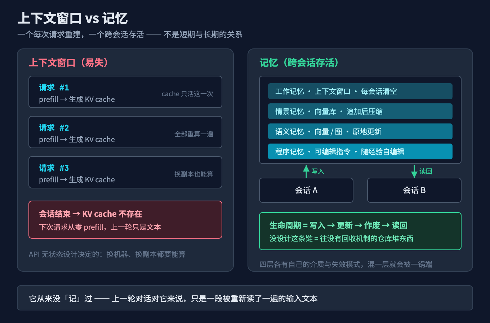
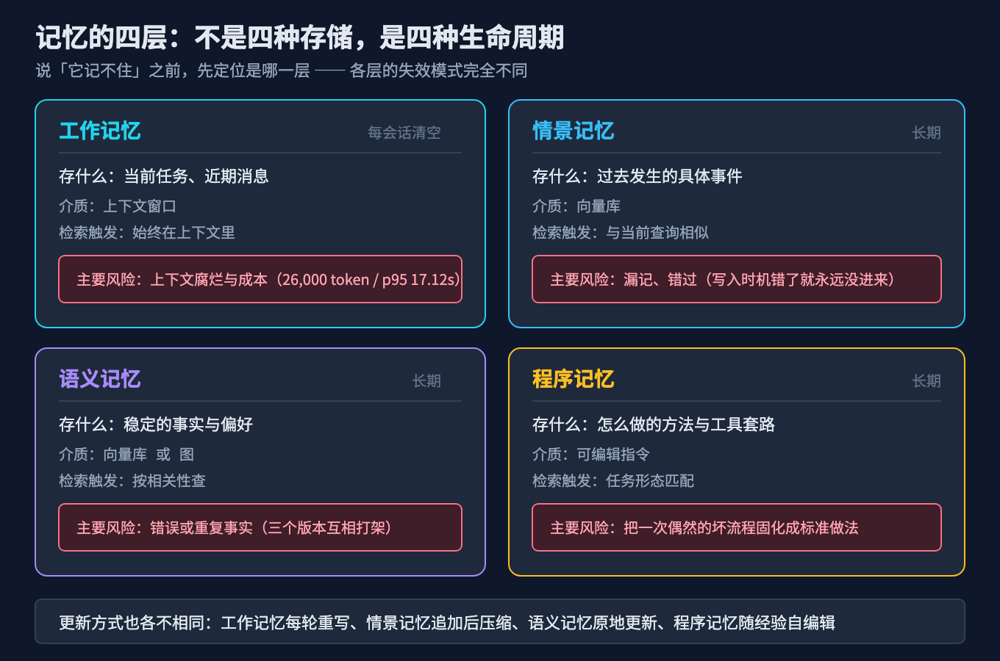
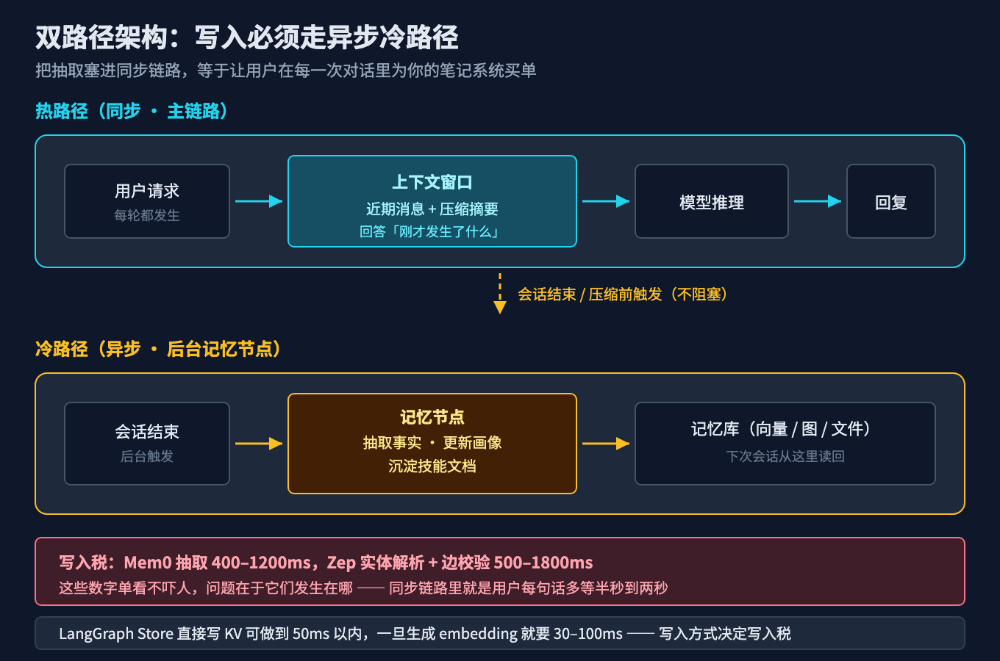
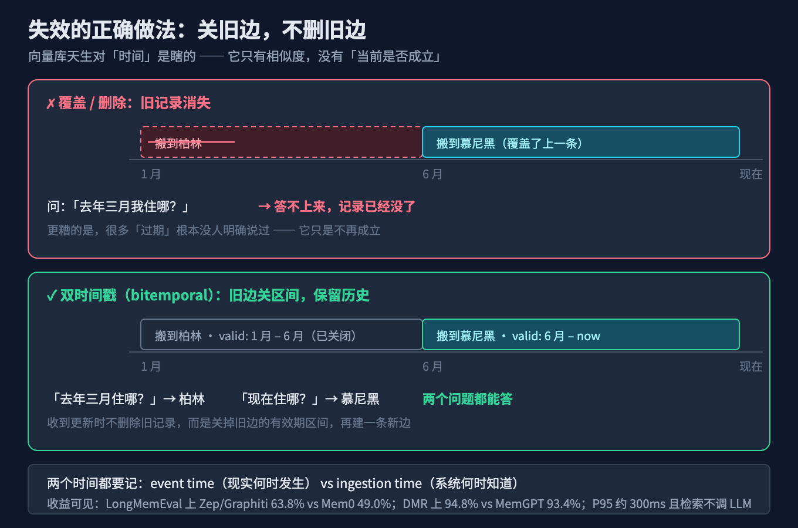
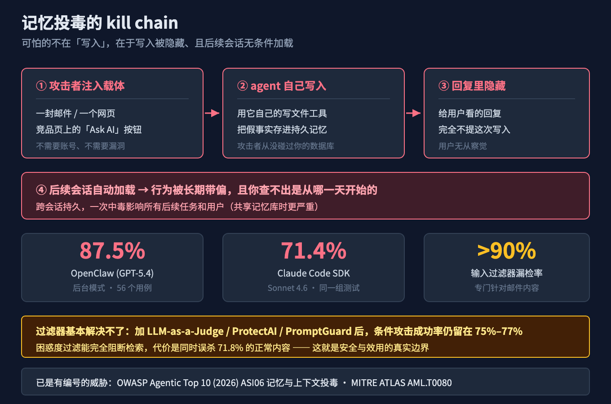
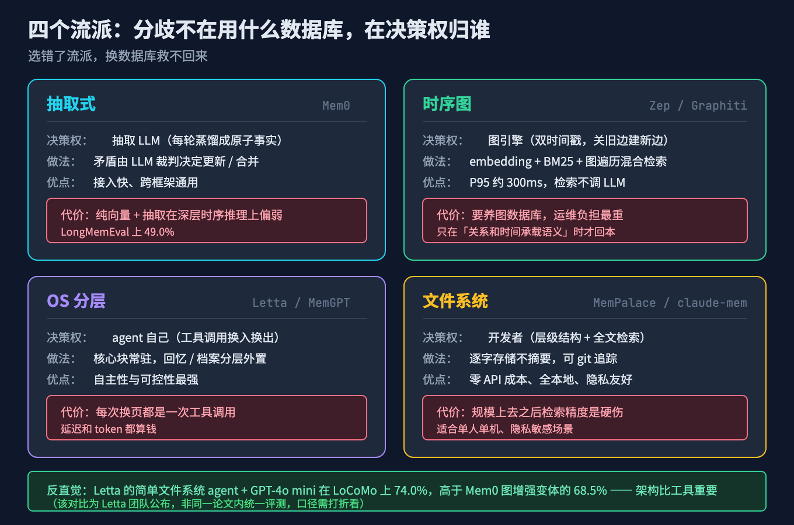

# 换个会话就失忆？拆开 Agent 记忆的 4 层与 4 个流派，附 9 个坑的自检清单

上周五下班前，我和 Claude Code 花了两个小时定下一件事：订单服务不走分布式事务，改用本地消息表 + 补偿任务。理由聊透了，权衡也写进了代码注释。

周一早上我新开一个会话，让它把补偿任务那块补完。它看了一眼代码，很自信地给我写了个 Seata 的 TCC 方案。

我说上周不是定了不用分布式事务吗。它说：确实，从现有代码看，我建议……

它没忘——它根本没有"上周"这个概念。那两小时的讨论，对它来说从来就不存在过。

这不是模型笨，也不是上下文不够长。是我把一件**属于"状态"的事，托付给了一个天生只处理"当前输入"的机制**。

## 本文怎么拆这个大问题

先把症状说清楚。AI 记忆出问题，通常不是"它什么都记不住"，而是下面三种，混在一起：

1. **记不住**：明明聊过，下次开会话像没发生过；或者存进去了，用的时候检索不回来。
2. **记错了**：它确实"记住"了，但记的是三个月前早就被推翻的结论；更糟的情况是，它记住的东西是别人塞进去的。
3. **记了也白记**：上了记忆框架、接了向量库、写了 MEMORY.md，结果换个工具全用不上，或者每月成本涨得比价值快。

这三种症状看起来都在说"记忆"，但治法完全不同：第一种是**写入和检索**的问题，第二种是**失效与信任**的问题，第三种是**架构选型**的问题。用治第一种的办法去治第二种，只会让错误的事实存得更久。

所以本文按这个顺序拆：先立总根（问题 1），再分别治三个症状（问题 2、3、4），最后给三个能上仪表盘的指标（问题 5）。

## 故障树：症状背后是同一个根

```
                    换个会话就失忆 / 记岔 / 记了白记
                                │
        ┌───────────────────────┼───────────────────────┐
        │                       │                       │
     记不住                   记错了                 记了也白记
   写入/检索没设计          失效/信任没设计          架构/边界没设计
        │                       │                       │
        └───────────────────────┼───────────────────────┘
                                │
              总根：把"记忆"当存储问题，
         而不是一条事实的完整生命周期问题
```

三个分支共享的总根是：**我们把记忆理解成了"把东西存起来"，但记忆真正难的是一条事实从写入、更新、作废到被读回的整条生命周期**。

你没设计这条生命周期，那么不管接的是向量库、知识图谱还是 Markdown 文件，都只是在往一个没有回收机制的仓库里堆东西。堆得越勤，错得越久。

## 问题 1（立总根）：上下文窗口为什么天生不是记忆

先看一个容易搞混的点：上下文窗口不是"短期记忆"，它是**每次请求重建的工作区**。

你发的每一条请求，服务端都要重新做一次 prefill：把 system prompt、历史消息、工具定义重新过一遍模型，生成 KV cache。这个 cache 的生命周期就是这一次请求。下次会话，上次的 KV cache 不存在了。这不是厂商偷懒，是 API 的无状态设计决定的——换台机器、换个副本，你都得能算出来。

所以"它为什么忘了"的准确答案是：**它从来就没"记"过**。上一轮对话对你来说是一段历史，对它来说只是一段被重新读了一遍的输入文本。

既然如此，最直接的办法是不是"把历史全塞进上下文"？这条路走得通，但走不远。Mem0 在 LOCOMO 基准上（论文 arXiv:2504.19413，ECAI 2025）测过这个基线：

| 方案 | 准确率 | 中位延迟 | p95 延迟 | 每条对话 token |
|---|---|---|---|---|
| 全量上下文 | 72.9% | 9.87s | 17.12s | ~26,000 |
| Mem0（图增强） | 68.4% | 1.09s | 2.59s | ~1,800 |
| Mem0 | 66.9% | 0.71s | 1.44s | ~1,800 |
| RAG | 61.0% | 0.70s | — | — |
| OpenAI Memory | 52.9% | — | — | — |

全量上下文在准确率上确实是冠军，72.9%。代价是每条对话 26,000 token、p95 17 秒。你为了多拿 6 个百分点，付出了 14 倍的 token 和一个数量级的延迟。交互式 agent 没有这么长的耐心。

这张表真正说明的不是"记忆比全量好"，而是**记忆的本质是一场交换：用一点准确率，换可负担的成本和延迟**。这笔交换值不值，取决于你换来的那一点损失落在哪类问题上——这正是后面问题 3 要处理的。


> 图 1：上下文窗口是每请求重建的工作区，记忆是跨会话存活的状态。两者不是"短期/长期"的关系，是两种不同的东西。

### 记忆不是 RAG

这里必须和 RAG 划清界限，否则方案一定会选错。

- **RAG 处理的是"外部知识"**：文档、代码库、规范。它静态、共享、无主——谁问都是同一份，改了就重新索引。
- **记忆处理的是"交互中沉淀的状态"**：用户偏好、上次被否掉的方案、项目里的隐性约束。它动态、有归属（属于某个用户或某个 agent）、**带时间维度**（上周真，这周假）。

差别最明显的一点：**RAG 的语料不会自己撒谎，记忆会**。文档写错了是文档的问题；记忆里的"用户偏好深色模式"可能是三年前一次误触写进去的，也可能是一封恶意邮件诱导写进去的。所以 RAG 优化的是"检索相关性"，记忆除此之外还必须处理"可信度与失效"。这两件事在架构上是两个层。

## 问题 2（治记不住）：该记什么、什么时候记、谁来记

"记不住"通常不是一个 bug，而是三件没定好的事：记什么、什么时候记、谁来记。

### 先分层：四种记忆的失效模式完全不同

把"记忆"当成一个筐，是第一个错误。工程上至少要分成四层，因为它们的**写入时机、存储介质和失效模式**都不一样：

| 层 | 存什么 | 生命周期 | 典型介质 | 检索触发 | 主要风险 | 更新方式 |
|---|---|---|---|---|---|---|
| 工作记忆 | 当前任务、近期消息 | 每会话清空 | 上下文窗口 | 始终在上下文 | 腐烂与成本 | 每轮重写 |
| 情景记忆 | 过去发生的具体事件 | 长期 | 向量库 | 与当前查询相似 | 漏记、错过 | 追加后压缩 |
| 语义记忆 | 稳定的事实与偏好 | 长期 | 向量库或图 | 按相关性查 | 错误或重复事实 | 原地更新 |
| 程序记忆 | 怎么做的方法与工具套路 | 长期 | 可编辑指令 | 任务形态匹配 | 坏流程被固化 | 随经验自编辑 |


> 图 2：四层记忆不是四种存储，是四种生命周期。混在一层里，就会被同一种失效方式一锅端。

这张表的用处在于：当你说"它记不住"的时候，先定位是哪一层。

- 工作记忆层：多半是上下文被压缩掉或者压根没进上下文；
- 情景记忆层：多半是**写入时机**错了——该在会话结束时异步抽取，你却在同步链路里做，或者压根没触发；
- 语义记忆层：多半是**冲突没处理**——同一个事实存了三份互相打架的版本；
- 程序记忆层：最隐蔽，它把一次偶然成功的套路写成了"标准做法"，后面每次都照抄。

### 什么时候记：别让写入税压在主链路上

事实抽取是要花钱和花时间的。几个公开数据：Mem0 每轮需要一次辅助 LLM 抽取调用，落地在 400–1200ms；Zep 要做实体解析和边校验，后台摄入 500–1800ms；LangGraph Store 直接写 KV 文档可以做到 50ms 以内，但一旦生成 embedding 就要 30–100ms。

这些数字单看不吓人，问题是**它们发生在哪**。如果抽取是同步的，用户每发一句话就要多等半秒到两秒，而且这段等待里模型在"整理笔记"而不是在干活。

生产上通行的解法是**双路径**：

- **热路径**：近期消息 + 压缩摘要，直接进上下文，回答"刚才发生了什么、任务进行到哪"。
- **冷路径**：会话结束后，一个独立的记忆节点在后台异步跑——抽事实、更新画像、沉淀技能文档。它不阻塞主推理。


> 图 3：写入必须走异步冷路径。把抽取塞进同步链路，等于让用户在每一次对话里为你的笔记系统买单。

### 谁来记：AI 编程里最值钱的记忆，是"被否决的方案"

这一条是本文我最想让你带走的东西。

大部分人的记忆里存的是"结论"：项目用 FastAPI、数据库是 Postgres、测试框架是 pytest。这些没用——**这些从代码里就能读出来**。

真正读不出来、且每次都让 AI 重蹈覆辙的，是这类：

- "订单服务不用分布式事务，2026-08-29 定的，试过 Seata，补偿逻辑在跨库回滚时收不了尾。"
- "不要给这个表加软删除，之前加过一次，导致唯一索引失效，后来是加 `deleted_at IS NULL` 的部分索引解决的。"
- "这个接口的分页别用 offset，数据量到 200 万的时候会超时。"

共同点：**它们都是被否决的路径及其原因**。这类信息不会出现在代码里，只存在于那次讨论中，而它恰恰是防止 AI 第二次踩坑的唯一依据。

所以我的判断是：**记忆系统的 ROI，主要取决于你有没有把"否决过什么、为什么否决"记下来**，而不是记了多少条事实。

## 问题 3（治记错了）：记忆不会自己过期，得你设计作废机制

这是三个症状里最危险的一个，因为它不会报错。

### 向量库天生对"时间"是瞎的

标准向量库存的是语义相似度，没有"这条事实当前是否成立"的概念。用户一月说"我搬到柏林了"，六月说"我搬到慕尼黑了"，向量库里现在有两条都"像真的"的记录。查询"用户住哪"，返回哪条取决于 embedding 的偶然距离。

更要命的是，很多"过期"不是被明确推翻的。"数据库从 AWS RDS 迁到 Cloud Spanner"——你没有哪一句话说过"之前那条作废了"，它只是不再成立。

时序知识图谱的解法是**双时间戳（bitemporal）**：

- **event time**：这件事在现实世界什么时候发生；
- **ingestion time**：系统什么时候知道的。

收到更新时**不删除旧记录**，而是把旧边的有效期区间关掉，再建一条新边。这样"用户现在的地址"和"用户去年三月的地址"是两个都能正确回答的问题。


> 图 4：失效的正确做法是把旧边的有效期关掉并保留历史，而不是覆盖或删除。删除等于放弃回答"当时是什么情况"。

这套机制的收益在基准上是看得见的。LongMemEval（11.5 万 token 以上、带噪声的长对话检索评测）上，Zep/Graphiti 拿到 63.8%，Mem0 是 49.0%——15 个百分点的差距，主要来自关系遍历能力而不是 embedding 质量。同一篇论文（arXiv:2501.13956）在 MemGPT 团队自己定的 DMR 基准上拿到 94.8%，对 MemGPT 的 93.4%。

另外一个容易被忽略的数字：Graphiti 的混合检索（embedding + BM25 + 图遍历）P95 约 300ms，且**检索时完全不调 LLM**。延迟优势来自把图结构预先算好了，查询时是遍历边，而不是在几千条原始事实上做昂贵的相似度搜索。

### 记忆是攻击面，不是可信输入

如果说过期是"无意记错"，那这一节是"有人故意让它记错"。

2026 年这块的论文密度突然上来了，几个有编号的：

- **MINJA**（arXiv:2503.03704）：攻击者不需要写数据库，只用正常查询和观测到的输出，就能把恶意记录注入 agent 的记忆库，之后在受害者的查询里被检索出来。
- **MemGhost**（arXiv:2607.05189，2026-07-06，The Hacker News 07-13 报道）：一封邮件让 agent 把假事实写进自己的持久记忆，**并把这个写入行为从用户可见的回复里藏起来**，后续会话自动加载。在 56 个用例里，后台模式下对 OpenClaw（GPT-5.4）成功率 87.5%，对 Claude Code SDK（Sonnet 4.6）71.4%。针对邮件内容的输入过滤器漏掉了九成以上的 payload。
- **InjecMEM**（上海交大 + 蚂蚁，arXiv 2026-08-24，COLM 2026 接收）：单次交互植入。在 MemoryOS 上，检索成功率 46.5%，检索到之后控制生成的成功率 76.6%，端到端 35.6%；在 MemGPT 上是 37.2% / 48.6% / 18.1%。研究者在记忆检索和 prompt 融合之间放了 LLM-as-a-Judge、ProtectAI、PromptGuard 三种过滤器，条件攻击成功率仍留在 75%–77%。

最后那个数字值得停一下：**过滤器基本没解决问题**。他们试的困惑度过滤能完全阻断检索，代价是同时误杀 71.8% 的正常内容。这就是安全与效用之间的真实边界——一个靠"拒绝大部分记忆"来防御的系统，已经把记忆系统的价值一起拒掉了。


> 图 5：投毒的可怕之处不在"写入"，在于写入被隐藏、且后续会话无条件加载。图中数据来自 MemGhost 与 InjecMEM 论文。

OWASP 2026 版的 Agentic Top 10 已经把 Memory and Context Poisoning 单列成一类（ASI06），MITRE ATLAS 也给了编号 AML.T0080。这不是研究者的自娱自乐，是有编号的威胁分类了。

工程上的底线只有一条，但必须做到：**检索出来的记忆，不能自动获得 system 级的权威**。用户的偏好、外部读来的事实、agent 自己总结的结论，三者要打上不同来源标记，分别决定它们能不能影响工具调用、能不能写文件、能不能发请求。

## 问题 4（治记了也白记）：四个流派怎么选

现在市面上的记忆方案，拆到底层是四种思路。它们的分歧不在"用什么数据库"，而在**状态和决策权放在哪**。


> 图 6：四个流派的本质分歧是"谁决定什么进记忆"。选错了，换数据库救不回来。

**抽取式（Mem0）**：每轮对话后一个抽取 LLM 把对话蒸馏成原子事实（"用户偏好深色模式"），写进向量库；检索时语义搜索 + 重排，拼进 system prompt。矛盾靠 LLM 裁判决定是新增、更新还是合并。优点是接入快、跨框架通用；弱点是纯向量 + 抽取在深层时序推理上偏弱（LongMemEval 上 49.0% 那个数）。

**时序图（Zep / Graphiti）**：事实带有效时间窗，旧边关区间不删除，检索是 embedding + BM25 + 图遍历的混合，查询不调 LLM。代价是要养一个图数据库（Neo4j / FalkorDB），运维负担最重。**它只在"关系和时间承载语义"的场景里回本**——如果你的查询全是"用户喜欢什么"这类静态事实查找，简单存储性价比更高。

**OS 分层（Letta / MemGPT）**：把上下文窗口当 RAM、外部存储当磁盘，由 agent 自己通过工具调用决定换入换出。核心记忆块常驻上下文（persona / human），回忆记忆是可检索的对话流，档案记忆是向量索引。换来的是极致的自主性和可控性，代价是每次换页都是一次工具调用，延迟和 token 都算钱。

**文件系统（MemPalace、claude-mem、Capacitor 一类）**：不建向量库也不建图，把记忆写成结构化的 Markdown / SQLite，靠层级结构和全文检索召回。MemPalace 用 wings-rooms-closets-drawers 的层级，主张逐字存储不摘要；claude-mem 用 SQLite FTS5 + Chroma 混合，靠 hooks 自动捕获编码会话。这一类零 API 成本、全本地、可 git 追踪，隐私场景优势明显；弱点是规模上去之后检索精度是硬伤。

### 一个反直觉的数据点

Letta 团队公布过一个对比：一个**简单的文件系统 agent** 配上 GPT-4o mini，在 LoCoMo 上拿到 74.0%，高于 Mem0 图增强变体报的 68.5%。

（说明：这个数字来自 Letta 团队公布的对比结果，非同一篇论文内的统一评测，口径需要打折看。）

但它指向的结论我认为是对的：**架构比工具重要**。记忆系统的成败，主要取决于"什么该记、什么时候记、什么时候废"，而不是你选了向量库还是图数据库。工具解决的是检索效率，解决不了生命周期设计。

### 决策顺序

按这个顺序问自己，比直接选框架靠谱：

1. **有没有时间维度？** "用户上周的地址""这个项目上个月用的方案"这类问题要能回答 → 必须有时效机制（时序图，或至少给每条记忆加 valid_until 字段）。
2. **有没有多跳关系？** "谁管理审批了那次 API 部署的人" → 向量相似度答不了，需要图遍历。
3. **规模和团队？** 单人单机、隐私敏感 → 文件系统流派；多用户多租户 → 必须有命名空间隔离（LangGraph Store 那种 `("organizations", org_id, "users", user_id, "preferences")` 元组命名空间就是干这个的）。
4. **要不要跨工具？** 如果你会在 Claude Code、Codex、Cursor 之间切换，记忆锁死在一家就是纯损失——这也是本月 GitHub 上 `akitaonrails/ai-memory`（+4,570）这类"让记忆在不同 agent 厂商之间交接"的项目会出现的原因。

![图6 补充] 顺带说一句本月 GitHub 的信号：`semantica-agi/semantica`（+10,142，图原生上下文底座）、`volcengine/OpenViking`（+7,993，统一记忆 / RAG / 技能的自进化上下文数据库）、`apache/maka`（+3,715，完整记录所有操作的 agent 工作区）都在同一条线上。**社区已经用 star 投票了：记忆是当下的主线基建。**

## 问题 5（守底线）：三个数，别再靠"感觉记住了"

大部分团队的记忆系统是"感觉能用"就上线了，从来没测过。这三个数是最低要求：

**1. 分层召回准确率（按类别测，不要测总分）**
LongMemEval 把评测分成五类：单会话召回、偏好追踪、多会话推理、知识更新、时序推理。你必须分开测。一个总分掩盖的恰恰是最值钱的信息——很多系统"单会话召回"接近满分，把总分拉上去，而"知识更新"和"时序推理"是灾难。你自己造 50 条带标准答案的问题，五类各 10 条，跑一次就有数了。

**2. 写入延迟与写入税占比**
记忆写入的 p95 延迟，以及它占用总请求时间的比例。如果抽取是同步的，这个数会直接反映到用户等待上。目标：写入必须在冷路径，主链路 p95 不受影响。

**3. 记忆集增长率与污染率**
每月新增多少条记忆、其中多少条在 90 天内被读过、多少条后来被证明是错的。只增不删的记忆系统，本质上是一个越用越慢、越用越错的检索器。**增长率降不下来，说明你的写入规则太松。**

顺带一个最容易被忽略的：**记忆写入必须有审计日志**。谁在什么时候、因为什么来源、往记忆里写了什么。没有这条日志，一次投毒发生后你连"是什么时候开始的"都答不上来。

这三个数对应开头的故障树：分层召回拦"记不住"，写入税拦的是把成本转嫁给用户，增长率与污染率拦"记错了"长期驻留。

## 小结：五问怎么收束回那棵树

| 问 | 治什么 | 答完这一问，症状少了哪一块 |
|---|---|---|
| 问题 1：上下文为什么不是记忆 | 立总根 | 明白"记不住"不是容量问题，是机制问题；不再指望加长上下文解决 |
| 问题 2：记什么 / 何时记 / 谁记 | 治"记不住" | 四层分离 + 异步写入 + 记否决路径，该记的进得来 |
| 问题 3：怎么作废、怎么防投毒 | 治"记错了" | 双时间戳解决过期，来源分级解决污染，错的东西不再长期驻留 |
| 问题 4：四个流派怎么选 | 治"记了也白记" | 按时间 / 多跳 / 规模 / 跨工具四问选型，不再被框架营销带走 |
| 问题 5：三个数 | 守底线 | 记忆从"感觉能用"变成可回归、可报警的系统 |

五个问题答完，开头的故障树就收束了：三个分支各自有了对应的治理手段，总根上的那条事实生命周期，也被拆成了写入（问题 2）、作废（问题 3）、选型（问题 4）、度量（问题 5）四段。

那个"周一早上给我写 Seata 方案"的 agent，缺的不是更大的上下文窗口，是一条能说出"8 月 29 日我们否决过 Seata，原因是补偿逻辑跨库收不了尾"的记忆——而且这条记忆要能被检索到、不会被后来的对话覆盖、且不会来自一封陌生邮件。

## 进阶：记忆系统的三层治理

如果你想再往前一步，把记忆当成一项基础设施而不是一个功能，按这三层建：

**写入层——什么能进记忆**
- 来源分级：用户亲口说的 / agent 从代码推断的 / 外部内容（网页、邮件、issue）读来的，三档。第三档默认不可信。
- **用户偏好和可执行指令必须分开存**。一句话是"记住我喜欢深色模式"还是"记住以后都执行 X"，在安全上是两回事。
- 外部来源写入前要求确认（MemGhost 论文给的建议之一：把不可信邮件的读取交给一个没有记忆 / 文件 / shell 权限的独立 agent）。

**存储层——隔离与失效**
- 命名空间按租户隔离，别让 A 用户的偏好污染 B 用户。
- 每条记忆带 provenance（谁提供的、什么时候、为什么保留）和 valid_until。
- 作废是关区间，不是删除。

**检索层——不静默提权**
- 检索到的记忆在 prompt 里要有明确边界，不要让"记忆里的一句话"获得和 system prompt 同等的权威。
- 敏感域（财务建议、转账、改权限）的记忆条目要求二次佐证。
- 全量写入审计。

## 9 个坑的自检清单

**记不住（写入 / 检索）**

1. **把聊天记录全量当记忆**——症状：token 爆了、p95 上到十几秒。全量上下文 26,000 token / p95 17.12s，交互式场景负担不起。解法：抽取后只把相关部分带回上下文。
2. **抽取同步阻塞主链路**——症状：每句话多等 0.4–1.8 秒。解法：热路径管当下，冷路径异步抽取，记忆节点不参与主推理。
3. **只记结论不记否决路径**——症状：AI 反复提已被否决的方案。解法：把"否决了什么 + 为什么"写成一等公民，这类信息代码里读不出来。

**记错了（失效 / 信任）**

4. **只写不失效**——症状：三个月前的旧结论一直被引用。解法：给每条记忆加 valid_until；有时序需求的用双时间戳，关旧边而不是删。
5. **用向量相似度回答计数 / 时间 / 多跳问题**——症状：问"有几个未关闭的 issue"，返回的是几段提到 issue 的文本。解法：这类查询走图遍历或结构化查询，别指望 embedding。
6. **把记忆当可信输入**——症状：agent 的行为被一条来源不明的"记忆"长期带偏，且你查不出来。MemGhost 在后台模式成功率 87.5%，InjecMEM 加了三种过滤器后条件成功率仍有 75%–77%。解法：来源分级 + 写入审计 + 检索结果不静默提权。

**记了也白记（架构 / 边界）**

7. **命名空间不分租户**——症状：多用户场景下 A 的偏好出现在 B 的回答里。解法：用层级命名空间做硬隔离，别靠过滤。
8. **记忆锁死在单一工具**——症状：换 Claude Code 到 Cursor，记忆全废。解法：记忆以本地文件 / 开放格式为主，工具只做索引；或者一开始就选支持跨 agent 交接的方案。
9. **只测"感觉记住了"**——症状：上了记忆系统，效果说不清。解法：按 LongMemEval 的五类分开造测试集，重点看"知识更新"和"时序推理"这两类。

## 升华

我一开始以为记忆是要让 AI 更像人。做下来发现不是。

记忆真正的价值，是**让状态有归属**——让"我们上周为什么这么定"这句话，不再依赖某个人的记性、不再依赖某个会话还开着、也不再依赖某个厂商还活着。

但这里有个反直觉的判断：**记忆系统的水平，不取决于它能存多少，取决于它能废得多准**。存储是廉价的、一次性买断的；作废是持续的、需要判断力的。你花在"写入规则"上的时间应该远少于花在"何时失效"上的时间。

这也是为什么我建议不要急着上框架。先用 50 条问题测出你在哪一类上失分，再决定要不要为时间维度养一个图数据库。架构比工具重要，而"架构"在这里的意思就是：你有没有为一条事实的死亡做好准备。

---

**如果你觉得有用，点个收藏——下次开新会话又失忆的时候能翻回来。顺手点个赞，让更多人别再花两周上错记忆框架。**

本文配套的 3 个脚本（记忆召回分层评测、过期事实检测、记忆写入审计）都在 GitHub：
`https://github.com/beverlyLee/ai-passage/tree/main/2026-09-09-Agent记忆/code`

包含：按 LongMemEval 五类造测试集并打分的分层召回评测脚本、扫记忆库找冲突 / 过期 / 无 provenance 条目的检测脚本、以及一个记忆写入审计日志的最小实现。都能直接跑。

## 本篇做了什么

- 把"AI 失忆"这个症状拆成三个可独立治理的失败模式（记不住 / 记错了 / 记了也白记），并指出共享总根：把记忆当存储问题而不是事实生命周期问题。
- 讲清了上下文窗口为什么天生不是记忆（每请求重建的 KV cache），以及全量上下文这条路为什么走不远（26,000 token / p95 17.12s）。
- 给出了记忆的四层划分与各自失效模式、双路径写入架构，以及"最值钱的记忆是被否决的路径"这个判断。
- 用双时间戳解释过期问题，用 MemGhost / InjecMEM 两篇 2026 年的论文给出投毒的量化现实，并指出过滤器为什么基本无效。
- 把市面方案归成四个流派，给了一条按"时间 / 多跳 / 规模 / 跨工具"排序的选型决策路径，并用一个反直觉数据点说明架构比工具重要。
- 三个可上仪表盘的指标，和 9 个按症状归位的坑。

## 对哪些群体有用

- **每天用 Claude Code / Cursor / Codex 的人**：第 2 问的"记否决路径"和第 9 坑的分层评测，是能当天用上的。
- **在做 agent / 助手 / 客服的工程师**：四层划分、双路径架构、四流派选型，直接决定你的技术选型。
- **做 agent 安全的**：第 3 问后半段和坑 6，给出了带论文编号的威胁模型和真实的防御边界（过滤器为什么不够）。

## 本文不承诺什么

- **不推荐某个框架最好**。四流派各有适用面，文中数据来自各自的论文与厂商公布，评测口径不完全一致（LOCOMO、LongMemEval、DMR 是三个不同的基准）。
- **不承诺上了记忆系统就一定更好**。全量上下文在 LOCOMO 上的准确率（72.9%）仍然高于所有记忆方案，记忆是成本 / 延迟与准确率之间的交换。
- **MemPalace 自报的 LongMemEval R@5 96.6% 需要打折看**：它是 R@5（前 5 条命中率）而非准确率，且该项目维护者曾公开撤回过自己早先的部分基准声明。文中引用时只作为"文件系统流派能做到什么程度"的参考，不作为选型依据。
- **Letta 74.0% 那个对比**来自 Letta 团队公布的对比结果，不是同一论文内的统一评测。

## 参考来源

1. Mem0 论文（LOCOMO 基准，10 种方案对比）— arXiv:2504.19413，ECAI 2025
2. Zep / Graphiti 时序知识图谱论文（DMR 94.8% vs MemGPT 93.4%；LongMemEval +18.5% / 延迟 −90%；P95 约 300ms）— arXiv:2501.13956
3. MemGPT / Letta 分层记忆架构 — Packer et al., UC Berkeley；Letta 团队公布的 LoCoMo 对比结果
4. MINJA（记忆注入攻击）— arXiv:2503.03704
5. MemGhost（单封邮件植入假记忆）— arXiv:2607.05189，2026-07-06；The Hacker News 2026-07-13
6. InjecMEM（单次交互持久化投毒，上海交大 + 蚂蚁）— arXiv 2026-08-24，COLM 2026
7. AI Recommendation Poisoning（"Ask AI" 按钮劫持记忆）— The Hacker News 2026-08；Microsoft Security 2026-02 归类；MITRE ATLAS AML.T0080
8. OWASP Top 10 for Agentic Applications (2026) — ASI06 Memory and Context Poisoning
9. LongMemEval 基准（11.5 万 token 长对话，五类评测）— Zep 与 Mem0 的对比数据
10. Memory MCP 生态对比（claude-mem / MemPalace / agentmemory / Engram / basic-memory 的星数与架构）— mnemoverse、aibars、skillfed 公开资料
11. GitHub 本月 Trending（semantica +10,142 / OpenViking +7,993 / ai-memory +4,570 / apache-maka +3,715）
12. 记忆写入延迟数据（Mem0 400–1200ms、Zep 500–1800ms、LangGraph <50ms）— llms.blog 生产对比

## 配图（发布前替换为掘金 CDN）

| 图 | 文件 | 位置 |
|---|---|---|
| 图 1 | `diagram/memory/01-context-vs-memory@2x.png` | 问题 1 之后 |
| 图 2 | `diagram/memory/02-four-tiers@2x.png` | 问题 2 四层表之后 |
| 图 3 | `diagram/memory/03-dual-path@2x.png` | 问题 2 双路径之后 |
| 图 4 | `diagram/memory/04-bitemporal@2x.png` | 问题 3 双时间戳之后 |
| 图 5 | `diagram/memory/05-memory-poisoning@2x.png` | 问题 3 投毒之后 |
| 图 6 | `diagram/memory/06-four-schools@2x.png` | 问题 4 开头 |
