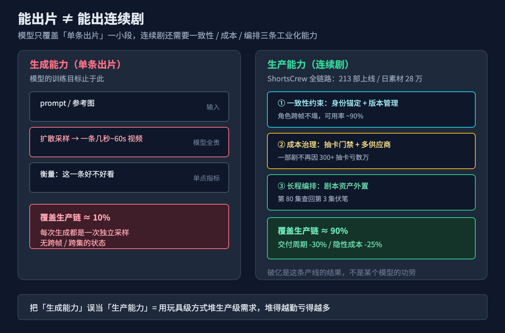
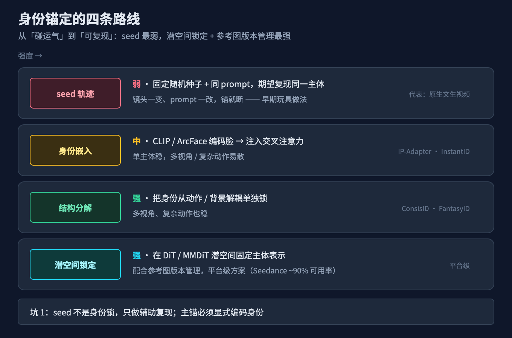
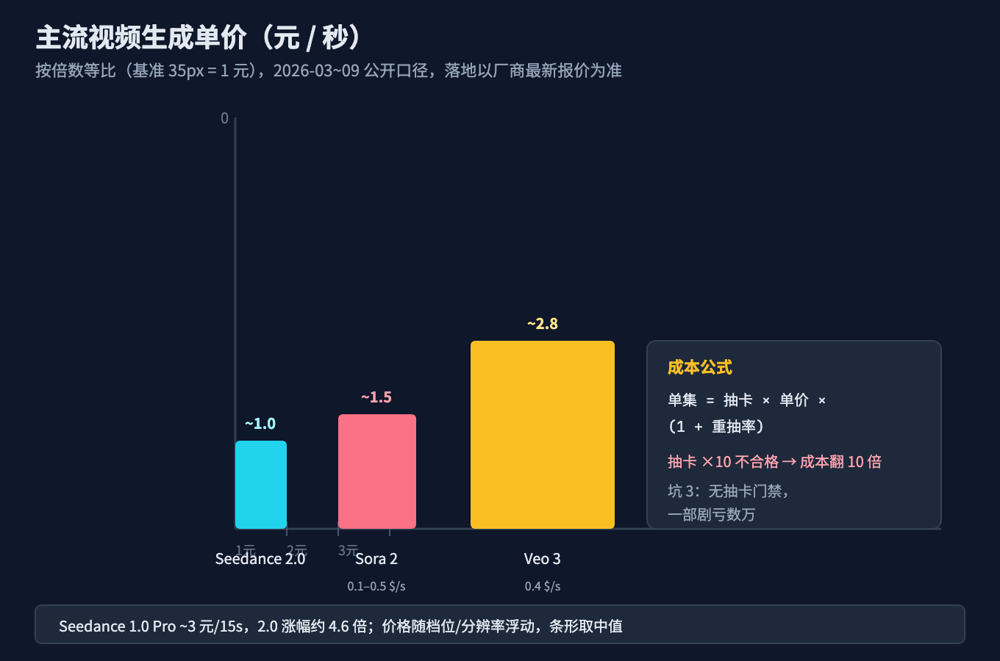
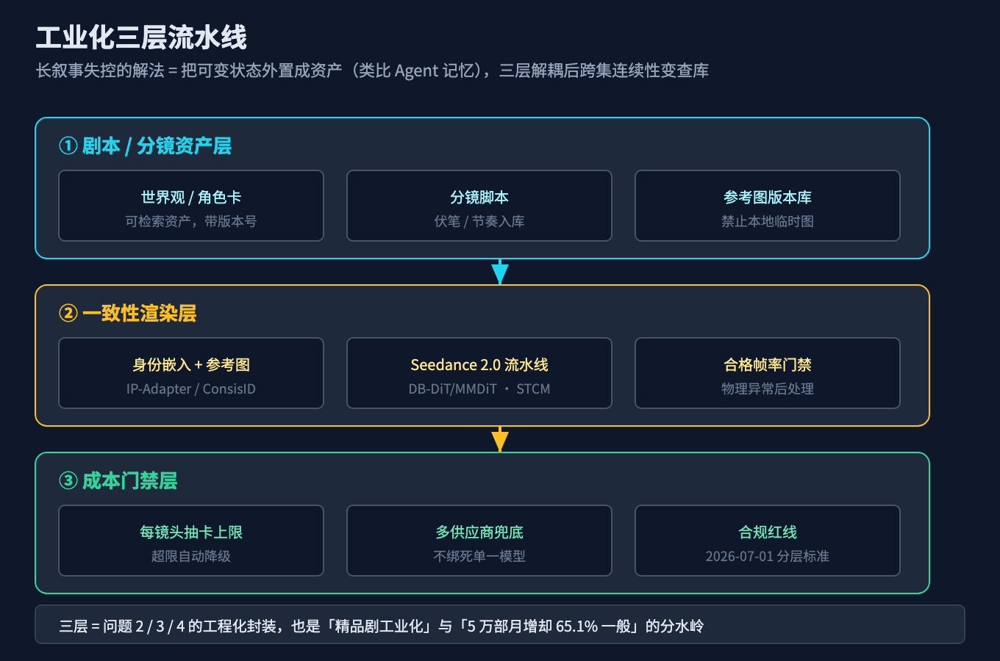
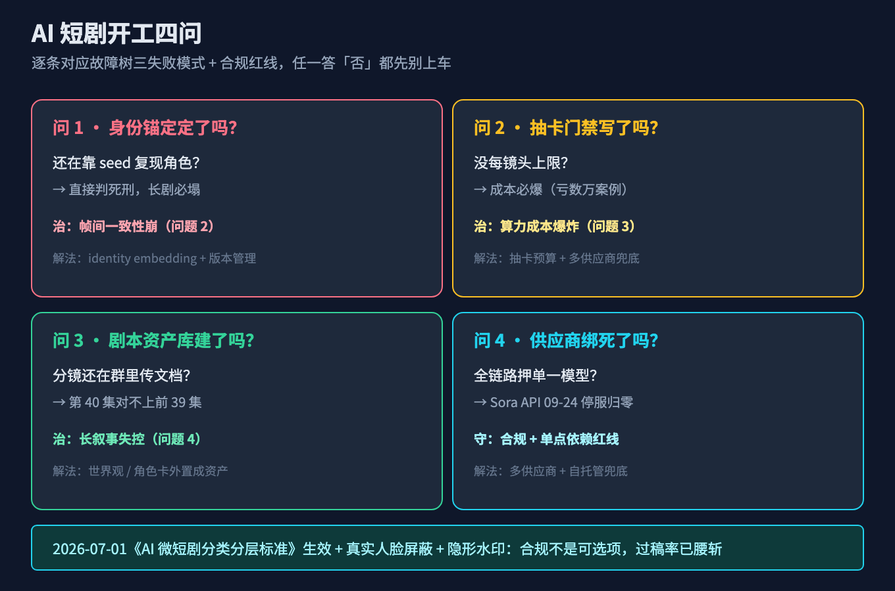
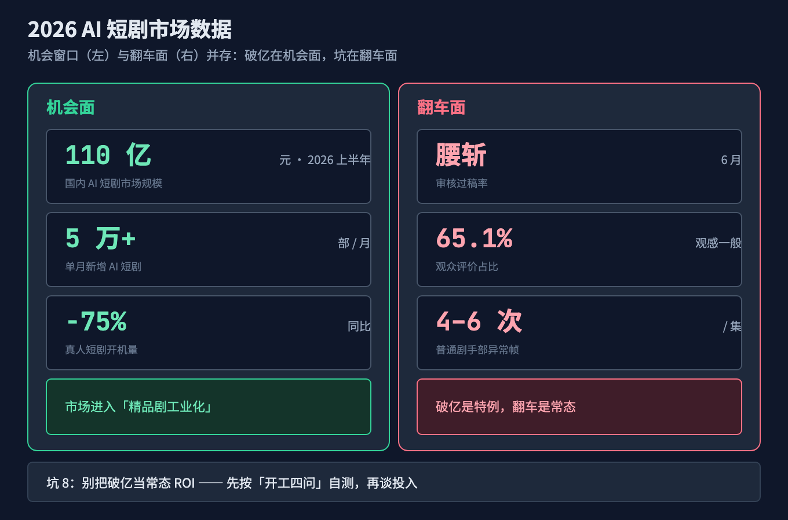

# AI 短剧破亿的真相：89 集《大灌篮之矮子球神》怎么炼成的，我拆了 8 个工业级深坑

上周刷抖音，一条《大灌篮之矮子球神》的 AI 仿真人短剧冲上体育板块热播榜 TOP1，89 集、上线几天播放破亿、红果热搜总榜 NO.20。我第一反应是：这不就是"文生视频成熟了"的铁证吗？

然后我翻到制作方 ShortsCrew 的复盘：50 人团队、一部剧差点因为"某成员多抽了 300 多张卡"亏掉数万元、进度一度失控到差点崩盘。

所以真相不是"AI 能拍连续剧了"，而是——**有一个团队，把"生成一条好看的视频"这件单点的事，硬生生搭成了一条能连续产出 89 集的工业产线**。破亿是这条产线的结果，不是某个模型的功劳。

这篇文章想说清楚一件事：为什么"出片"和"出连续剧"是两种完全不同的工程能力，以及中间那 8 个最容易把项目拖垮的坑。

## 本文怎么拆这个大问题

先把现象拆开。《大灌篮》破亿是新闻，但同期的行业数据是另一面：2026 上半年国内 AI 短剧市场规模破 110 亿元、单月新增超 5 万部、6 月审核过稿率腰斩、65.1% 的观众觉得观感"一般"、普通 AI 短剧每集有 4–6 次手部异常帧。

破亿是特例，翻车是常态。问题出在三个各自独立的失败模式：

1. **帧间一致性崩**：单条视频很惊艳，但镜头一切、集数一翻，角色的脸、衣服、场景就对不上，观众立刻出戏。
2. **算力成本爆炸**：一条 15 秒要反复抽卡，抽多少次、用哪个模型、合不合格，没人管，成本就失控了。
3. **长叙事失控**：89 集的世界观、分镜、节奏跨会话不连续，前 40 集埋的伏笔第 80 集接不上。

这三件事看起来都叫"AI 短剧做不好"，但解法完全不同：第一种是**一致性约束**问题，第二种是**成本治理**问题，第三种是**长程编排**问题。用治第一种的办法去治第三种，只会让剧情更乱。

所以本文按这个顺序拆：先立总根（问题 1），再分别治三个症状（问题 2、3、4），最后给你一张能不能上车的判断清单（问题 5）。

## 故障树：症状背后是同一个根

```
              能出爆款单条，但出不了连续剧（破亿是特例，翻车是常态）
                                │
        ┌───────────────────────┼───────────────────────┐
        │                       │                       │
   帧间一致性崩              算力成本爆炸             长叙事失控
  角色/场景跨帧对不上       抽卡无预算、模型绑定      89集伏笔接不上
  每集4-6次手部异常          一部剧亏数万             进度失控
        │                       │                       │
        └───────────────────────┼───────────────────────┘
                                │
         总根：把"生成能力"（单条视频质量）
         误当成了"生产能力"（连续剧工业化）
         忽视了 一致性约束 + 成本治理 + 长程编排
```

三个分支共享的总根是：**我们把"模型能生成一条好视频"理解成了"我们能生产一部连续剧"，但工业化真正的难点是三条单点生成不具备的东西——跨帧的一致性约束、可控的成本账本、跨会话的叙事编排**。

你没设计这三条，不管接的是 Seedance、Sora 还是 Veo，都只是在用玩具级的方式堆生产级的需求。堆得越勤，亏得越多。

## 问题 1（立总根）：为什么"能出片" ≠ "能出连续剧"

要讲清这个，得先区分两个词：

- **生成能力（generation）**：给一个 prompt / 几张参考图，模型吐出一条几秒到几十秒的视频。衡量它的是"这一条好不好看"。
- **生产能力（production）**：把成百上千条片段，按剧本、按角色、按预算，拼成一部能被观众追更的连续剧。衡量它的是"整部剧是否一致、是否按时、是否不亏"。

视频生成模型的训练目标，从头到尾都是前者。它优化的是"给定输入，输出一条物理合理、画面好看的短片"，而不是"让第 80 集主角的球衣和第一集一模一样"。

这就是为什么《大灌篮》背后的 ShortsCrew 要专门做"全链路生产平台"——它服务 85–108 个团队、213 部剧上线、日素材生成超 28 万，把交付周期缩短 30%、隐性成本砍 25%。注意，这些数字说的是"生产链路"，不是"模型变强了"。模型只负责其中"出片"那一小段，剩下的 90% 是工程。


> 图 1：视频生成模型只解决"单条出片"，连续剧还需要一致性约束、成本治理、长程编排三条工业化能力，这正是破亿短剧和翻车短剧的分水岭。

一个常被忽略的事实：**真人短剧开机量同比暴跌 75%**，腾出的不是"AI 自动填位"，而是制作方在赌一条新的、还没跑通的成本曲线。这也是为什么 6 月审核过稿率腰斩后，行业集体从"拼数量"转向"精品剧工业化"——能活下来的，都是先把产线搭好的。

## 问题 2（治一致性崩）：视频生成怎么让角色"跨帧不塌"

一致性崩，本质是"模型每次生成都是一次独立采样，没有跨帧的身份锚点"。一个角色第一集穿红衣、第三集变蓝衣，不是模型记性差，是它每次都当新任务做。

工程上有几条主流的"身份锚定"路线，深浅不一：

| 路线 | 机制 | 代表 | 强度 |
|---|---|---|---|
| seed trajectory（种子轨迹） | 固定随机种子 + 同 prompt，期望复现同一主体 | 早期玩具做法 | 弱，换个镜头就散 |
| identity embedding（身份嵌入） | 用 CLIP / ArcFace 把参考脸编码成向量，注入交叉注意力 | IP-Adapter、InstantID | 中，单主体稳 |
| 频域/结构分解 | 把身份从动作、背景里解耦出来单独锁 | ConsisID（频域分解）、FantasyID（3D 先验 + 多视角 + layer-aware） | 强，多视角、复杂动作 |
| latent space locking（潜空间锁定） | 在 DiT / MMDiT 的潜空间里固定主体的表示 | 平台级方案 | 强，配合参考图版本管理 |

关键认知：**seed 不是身份锁**。很多人以为"固定 seed 角色就不塌"，但 seed 只保证同输入同输出，镜头一变、prompt 一改，锚就断了。真正稳的是把"身份"显式编码成条件，再喂给模型的交叉注意力。

这也是 Seedance 2.0 把"可用性"拉到约 90%（行业普遍约 20%）的核心原因之一。它用双分支扩散 Transformer（DB-DiT / MMDiT）+ 时空因果建模（STCM），配合 9 张图 + 3 段视频 + 3 段音频的参考（@mention 系统），让"给定参考，稳定复现同一主体"成为可工程化的能力，而不是抽卡运气。


> 图 2：一致性不是"多抽几次碰运气"，而是选对身份锚定路线。seed 最弱，潜空间锁定 + 参考图版本管理最强。

可用率这个口径要单独拎出来讲（详见坑 6）：行业说的 20% 是"能播出的帧占比"还是"合格帧占比"，定义混乱。Seedance 的 ~90% 指的是"无需大幅重抽即可达标的帧占比"——它和 Sora 2、Veo 3 在 Artificial Analysis 的 Elo 上（Seedance 1269 居首）拉开差距，靠的不是单帧更美，而是**稳定达标率**。

## 问题 3（治成本爆炸）：算力账本怎么算，为什么会爆

一条 15 秒的 AI 视频，不是"调用一次 API"就完事。它背后的经济模型是：

```
单集成本 = 抽卡次数 × 单次生成成本 × (1 + 不合格重抽率)
单次生成成本 ≈ 时长(秒) × 单价(元/秒)
```

按已核实的 2026-03 火山引擎定价，Seedance 含视频输入 28 元/百万 tokens、不含 46 元/百万 tokens，生成 15 秒约 15 元，折合 **0.95–1 元/秒**。横向看：


> 图 3：Seedance 约 0.95–1 元/秒，Sora 2 约 0.7–3.5 元/秒（0.1–0.5 美元），Veo 3 约 2.8 元/秒（0.4 美元）。抽卡 10 次不合格就翻倍。

成本爆炸的根源不是"模型贵"，是**重抽没有上限**。ShortsCrew 那个"某成员多抽 300+ 次卡致一部剧亏数万"的案例，本质就是抽卡次数没有预算门禁——一个人为了一条满意镜头疯狂抽，成本就偷偷滚上去了。

更隐蔽的风险是**单模型平台绑定**。Sora 网页版/App 已于 2026-04-26 停服，API 将于 **2026-09-24 停服且无替代模型**（OpenAI 2026-03-24 通知开发者）。截至本文写作（2026-09-06）只剩约 18 天 API 寿命。sora-2 约 0.10 美元/秒、sora-2-pro 约 0.70 美元/秒——如果一部剧的生产链路绑死在 Sora 上，18 天后整条产线就断了。这跟第 16 篇（AI 账单构成）讲的"额度怎么就没了"是同一类坑：成本失控往往来自**没有边界的单点依赖**。

## 问题 4（治长叙事失控）：89 集怎么让伏笔跨会话连续

一致性解决"同一角色跨帧不塌"，长叙事解决"整部剧跨集不散"。这是两个层面：前者是视觉身份，后者是**剧情状态**。

把问题翻译成程序员熟悉的语言——它和第 17 篇（Agent 记忆）讲的"换个会话就失忆"是同一类病：

- Agent 把"属于状态的事"托付给"只处理当前输入"的机制 → 失忆；
- 短剧把"属于连续叙事的事"托付给"每次独立采样"的生成模型 → 剧情断裂。

治法和记忆篇也同构：**把可变状态外置成资产，而不是指望模型自带**。

具体落法是三层流水线（这也是 ShortsCrew 这类平台"全链路"的真义）：

```
剧本/分镜资产层  →  一致性渲染层  →  成本门禁层
（世界观/角色卡/   （参考图版本管理 +    （每镜头抽卡预算 +
 分镜脚本入库）      identity embedding）   合格帧率门禁）
```

剧本层把"第 3 集埋的伏笔"写成可检索的资产，渲染层每集都从资产里拉角色参考图（带版本号），成本层给每集每镜头一个抽卡上限。三层解耦后，第 80 集要找回第 3 集的设定，是"查库"而不是"求模型记得"。


> 图 4：长叙事失控的解法不是"模型更聪明"，而是把可变状态外置成资产（类比 Agent 记忆），三层解耦后跨集连续性变成查库问题。

Seedance 2.0 本身的架构也支撑这种流水线：Flow Matching 框架 + VAE 把视频压到 latent 空间的 8 倍压缩、双分支 DB-DiT/MMDiT、三模型 RLHF 奖励体系、原生音画同步、最长 60 秒 2K，5 秒 1080p 在 NVIDIA L20 上 41.4 秒。这些不是噱头——latent 压缩和音画同步直接决定了"能不能把片段无缝接成连续剧"，而不是一堆漂亮但接不起来的碎片。

## 问题 5（守底线）：怎么判断一个 AI 短剧项目能不能做

把前四个问题收成一个上手指引。开工前问自己四件事：

1. **身份锚定方案定了吗？** 还在靠 seed 复现角色 → 直接判死刑，长剧必塌。
2. **抽卡预算门禁写了吗？** 没有每镜头上限 → 成本必爆（参考那部亏数万的剧）。
3. **剧本资产库建了吗？** 分镜/角色卡还在群里用文档传 → 第 40 集必对不上前 39 集。
4. **供应商绑死了吗？** 全链路押单一模型（尤其临近停服的）→ 18 天后产线归零。

还有一个 2026 年新增的硬约束：**2026-07-01 起施行《AI 微短剧分类分层标准》**，加上平台真实人脸屏蔽 + 隐形水印的强制要求（Seedance 已内置）。合规不是可选项，6 月过稿率腰斩已经证明：不分层、不标识的剧，连上线门槛都过不去。


> 图 5：四个开工前问题，逐条对应故障树的三个失败模式 + 合规红线。任一答"否"都先别上车。

## 小结：小问题如何收束大故障树

| 小问题 | 治的是哪个失败模式 | 答完 → 症状是否收敛 |
|---|---|---|
| 问题 1：生成能力 ≠ 生产能力 | 总根 | 立住"破亿是产线结果，不是模型功劳" |
| 问题 2：身份锚定四路线 | 帧间一致性崩 | 角色跨帧不塌，观感脱离"一般" |
| 问题 3：算力账本 + 抽卡门禁 | 算力成本爆炸 | 一部剧不再因 300+ 抽卡亏数万 |
| 问题 4：三层外置资产流水线 | 长叙事失控 | 第 80 集能查回第 3 集伏笔 |
| 问题 5：开工四问 + 合规红线 | 守底线 | 能不能做，开工前就有判断 |

五个问题答完，《大灌篮》"破亿"不再神秘：它不过是把一致性、成本、编排三条工业能力都搭通了，模型只负责其中"出片"那一小段。

## 进阶：AI 短剧的三种形态与三层治理

**三种形态（按工业化程度）**：

1. **单模型直出（玩具级）**：给 prompt 抽一条，发朋友圈可以，做连续剧必死。对应坑 1、坑 4。
2. **参考图 + 身份锁定（工具级）**：IP-Adapter / ConsisID 保证单主体稳，能做几集短片。对应坑 2、坑 7。
3. **全链路协作平台（工业化）**：剧本资产 + 一致性渲染 + 成本门禁三层，ShortsCrew 类，服务 85–108 团队、213 部上线。破亿剧长这样。

**三层治理（对应三个失败模式）**：

- **一致性层**：身份嵌入 + 参考图版本管理，把"碰运气"变成"可复现"。
- **成本层**：抽卡预算门禁 + 多供应商兜底，把"滚雪球"变成"有上限"。
- **编排层**：剧本资产外置，把"求模型记得"变成"查库"。

这三层就是问题 2/3/4 的工程化封装，也是 110 亿市场里"精品剧工业化"和"5 万部月增但 65.1% 观感一般"的分水岭。


> 图 6：110 亿市场、月增 5 万部、真人开机 -75% 是机会面；过稿率腰斩、65.1% 观感一般、每集 4–6 次手部异常是翻车面。破亿在机会面，坑在翻车面。

## 8 个工业级深坑（按失败模式归位）

**一致性崩（问题 2 相关）**

**坑 1：把 seed 当身份锁。** 症状：固定 seed 一条很稳，镜头一换角色就变。解法：用 identity embedding / IP-Adapter / ConsisID 显式编码身份，seed 只做辅助复现，别当主锚。

**坑 2：参考图不版本管理。** 症状：第 40 集用的角色图和前 39 集不是同一版，细节悄悄漂移。解法：参考图入库带版本号，渲染层每集从资产库拉指定版本，禁止本地临时图。

**坑 7：手部/物理异常不修。** 症状：普通 AI 短剧每集 4–6 次手部异常帧，观众一眼出戏。解法：开启物理惩罚训练（Seedance 已做）+ 后处理检测，合格帧率不达标不许进剪辑。

**成本爆炸（问题 3 相关）**

**坑 3：抽卡无预算门禁。** 症状：某人为了一条满意镜头抽 300+ 次，一部剧亏数万。解法：每镜头抽卡次数上限 + 合格帧率门禁，超限自动降级参考方案而非无限重抽。

**坑 4：单模型平台绑定。** 症状：Sora API 2026-09-24 停服，绑死的产线 18 天后归零。解法：多供应商接入 + 自托管兜底，关键链路不依赖单一临近停服的模型。

**坑 6：用成品帧率当可用率。** 症状：看演示片惊艳就下单，量产全翻车。解法：统一口径看"合格帧占比"，行业 ~20% vs Seedance ~90% 的差异才是真实成本信号。

**长叙事失控（问题 4 相关）**

**坑 5：剧本不资产化。** 症状：伏笔埋了 40 集，第 80 集接不上，只能硬编。解法：世界观/角色卡/分镜脚本外置成可检索资产，跨集连续性靠查库不靠记忆。

**守底线（问题 5 相关）**

**坑 8：把破亿当常态 ROI。** 症状：以为 AI 短剧都赚钱，盲目all-in。解法：65.1% 观感一般、过稿率腰斩，市场已进入精品剧工业化；先按"开工四问"自测，再谈投入。

## 升华

AI 短剧的破亿，不是"文生视频成熟了"的勋章，而是"把单点生成搭成工业产线"的勋章。模型负责出片，人负责的是一致性、成本和编排——这三件事，恰恰是工程师最熟悉、也最容易被忽略的系统设计。

下次再看到"AI 拍了一部剧"，别问模型是哪个，先问它的产线搭没搭通。

> 觉得有用？点赞 + 收藏，GitHub 上我放了两段能直接跑的脚本（一致性评测 + 算力成本估算器）：
> `github.com/beverlyLee/ai-passage/tree/main/2026-09-10-AI短剧破亿真相/code`
> 踩坑或补充，评论区见，我会更新清单。

## 本篇做了什么 / 对哪些群体有用

- **做了什么**：用故障树拆了"AI 能出片但出不了连续剧"这个现象，落到帧间一致性、算力成本、长叙事失控三个失败模式，给出身份锚定四路线、算力账本、三层外置资产流水线，以及 8 个工业级深坑。
- **对谁有用**：① 想用视频生成做内容/短剧的开发者；② 评估 AI 视频供应商成本与稳定性的技术负责人；③ 做 AIGC 平台/工具的产品与工程同学（一致性、成本门禁、编排三层都可直接复用）。

## 本文不承诺什么

- 不承诺"用 AI 短剧能赚钱"——65.1% 观感一般，市场已进入精品剧工业化，破亿是特例。
- 不承诺"某个模型包打天下"——单模型绑定是坑 4，多供应商兜底才是解法。
- 文中价格为 2026-03 至 2026-09 公开口径，视频生成定价变动快，落地前请以厂商最新报价为准。

## 参考来源

1. 《大灌篮之矮子球神》抖音热播榜 TOP1 / 红果热搜 NO.20、ShortsCrew 50 人团队复盘（算力超支、进度失控、300+ 抽卡亏数万）—— ShortsCrew 公开复盘与媒体报道，2026。
2. 2026 上半年国内 AI 短剧市场规模破 110 亿元、单月新增超 5 万部、6 月过稿率腰斩、真人开机量同比 -75%、65.1% 观感一般、每集 4–6 次手部异常帧 —— 行业报告与平台数据，2026。
3. 《AI 微短剧分类分层标准》2026-07-01 施行 —— 广电/平台合规文件，2026。
4. Seedance 2.0（字节 SEED）：2026-02-10 beta / 02-24 正式，DB-DiT/MMDiT 双分支、STCM、VAE 8× 压缩、Flow Matching、三模型 RLHF、原生音画同步、60s 2K、9 图+3 视频+3 音频 @mention、可用率 ~90%、Elo 1269 #1、L20 上 5s1080p 41.4s、真实人脸屏蔽 + 隐形水印、迪士尼/派拉蒙 2026-02-13/14 cease-and-desist —— 字节 SEED 官方与技术评测，2026。
5. 火山引擎 Seedance API 定价（2026-03）：含视频输入 28 元/百万 tokens、不含 46 元/百万 tokens，15 秒约 15 元（~0.95–1 元/秒）；Seedance 1.0 Pro ~3 元/15 秒 —— 火山引擎官方，2026。
6. Sora 网页版/App 2026-04-26 停服、API 2026-09-24 停服无替代、OpenAI 2026-03-24 通知、Sora 2 于 2025-09-30 发布、sora-2 $0.10/s、sora-2-pro $0.70/s —— OpenAI 官方与开发者通知，2026。
7. 身份一致性技术：identity embedding（CLIP/ArcFace）、IP-Adapter、InstantID、ConsisID（频域分解）、FantasyID（3D 先验+多视角+layer-aware）、latent space locking、DiT/MMDiT、Vbench —— 对应论文与开源实现，2024–2026。
8. 第三方定价：ofox.io（480p $0.04/s、720p $0.13/s、1080p $0.34/s）、apimodels.app（480p $0.092/s、720p $0.197/s、1080p $0.492/s）、Veo 3 ~0.4 美元/秒、Sora 2 ~0.1–0.5 美元/秒 —— 各平台公开定价页，2026。

## 配图 CDN 清单（均随文渲染，路径同仓库 diagram/AI短剧破亿真相/）

- 图1 `01-generation-vs-production@2x.png`：能出片 ≠ 能出连续剧
- 图2 `02-identity-locking@2x.png`：身份锚定四路线
- 图3 `03-cost-compare@2x.png`：主流视频生成单价对比
- 图4 `04-pipeline@2x.png`：工业化三层流水线
- 图5 `05-launch-checklist@2x.png`：开工四问
- 图6 `06-market-data@2x.png`：2026 AI 短剧市场数据
