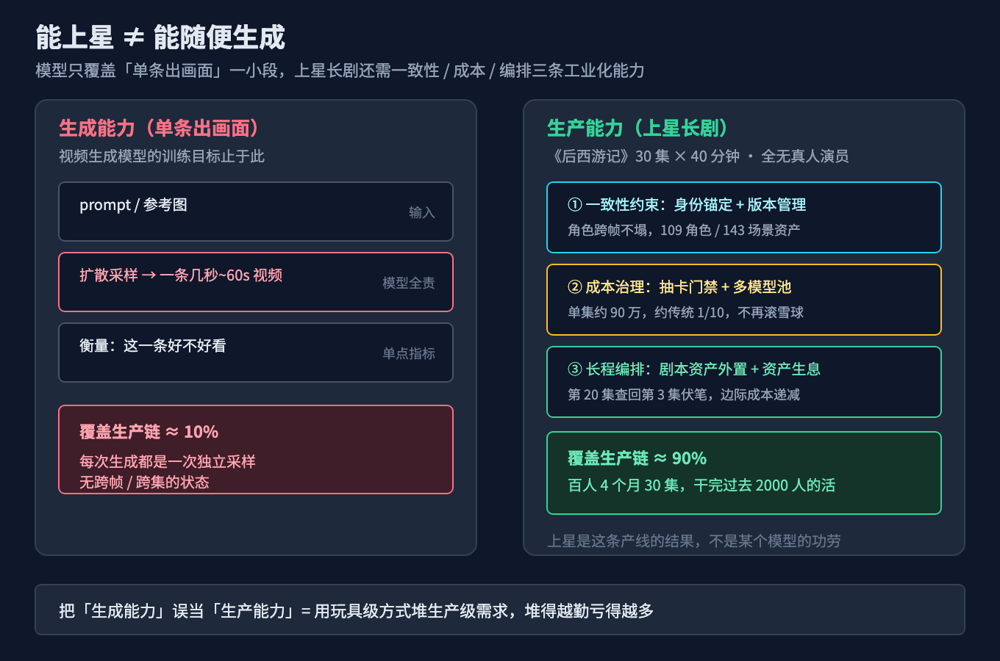
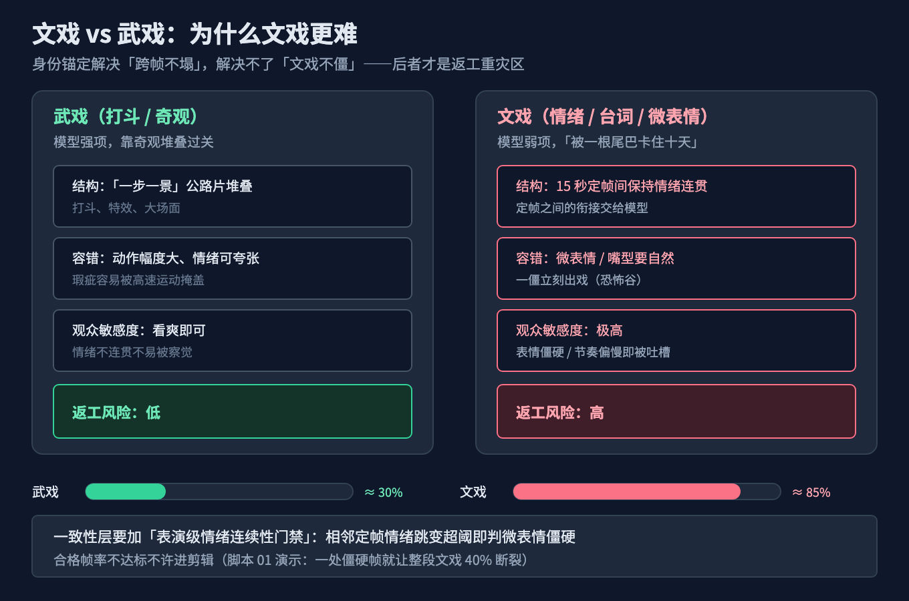
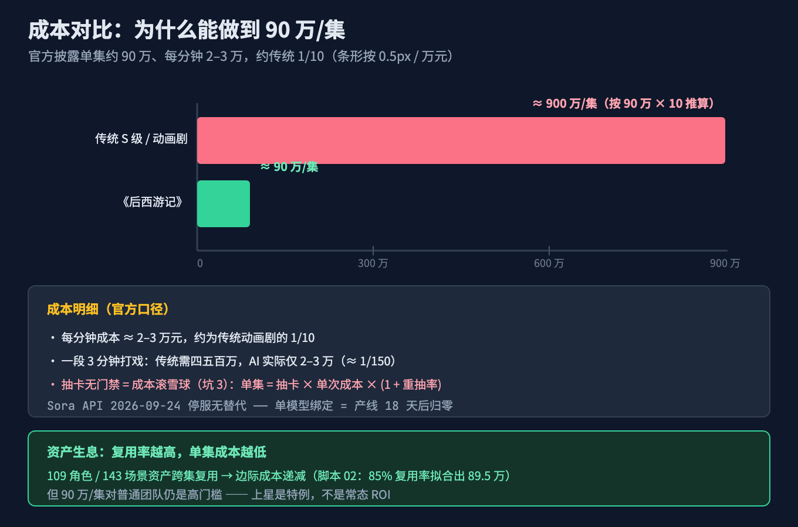
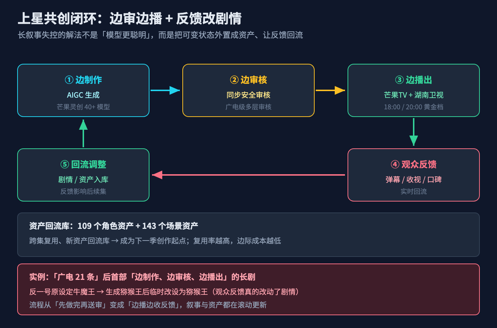
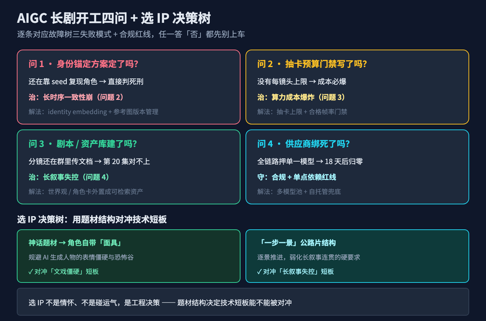
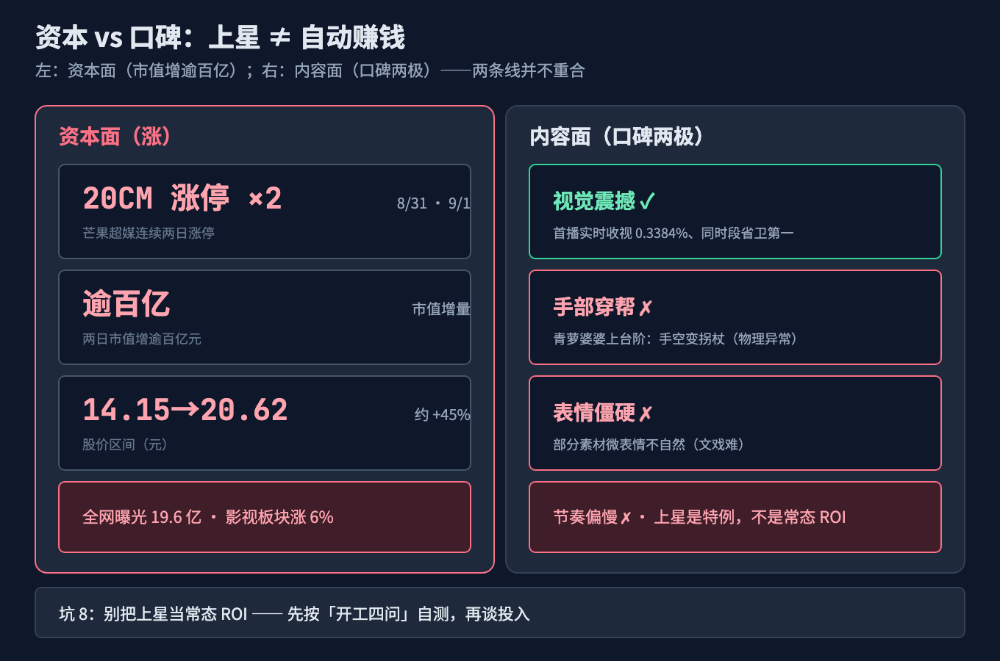

# 《后西游记》上星破局：国内首部 AIGC 长剧怎么搭出来的，我拆了 8 个工业级深坑

8 月 31 日 20:00，湖南卫视黄金档播出了一部"没有真人演员"的剧——《后西游记》，国内首部上星播出的 AIGC 长剧。首播实时收视 0.3384%、市占 1.79%、同时段省级卫视第一；芒果超媒连续两日 20CM 涨停、市值增逾百亿。

然后我看了总导演李东珅的复盘，最扎心一句是："被一根尾巴卡住十天"，难的是情绪表达、是文戏。

所以真相不是"AI 能拍长剧了"，而是——**有一个团队，把"生成一条好看的画面"这件单点的事，硬生生搭成了一条能连续产出 30 集 × 40 分钟、还能上星的长剧产线**。上星是这条产线的结果，不是某个模型的功劳。

这篇文章想说清楚一件事：为什么"出单条好画面"和"出能上星的长剧"是两种完全不同的工程能力，以及中间那 8 个最容易把项目拖垮的坑。

## 本文怎么拆这个大问题

先把现象拆开。《后西游记》上星是里程碑，但同期的行业数据是另一面：2026 年 1–5 月国内 AI 剧漫剧市场规模突破 220 亿元、全年有望冲击 400 亿元；抖音上半年新增 AI 短剧 22.19 万部、播放量破亿仅 1055 部、破亿率 0.48%；用户规模突破 6 亿，但"产能过剩、爆款稀缺"。

上星是里程碑，翻车是常态。问题出在三个各自独立的失败模式：

1. **长时序一致性崩**：单条画面很惊艳，但镜头一切、集数一翻，角色的脸、衣服、情绪就对不上，观众立刻出戏。更隐蔽的是**文戏比武戏难**——台词、情绪在 15 秒定帧之间的连贯性，是返工重灾区（李东珅说被一根尾巴卡了十天）。
2. **算力成本爆炸**：一条 40 分钟的长剧，不是"调用一次 API"就完事。抽多少次、用哪个模型、合不合格，没人管，成本就失控了。
3. **长叙事失控**：30 集的世界观、伏笔跨会话不连续，前几集埋的设定第 20 集接不上。

这三件事看起来都叫"AIGC 长剧做不好"，但解法完全不同：第一种是**一致性约束 + 表演连续性**问题，第二种是**成本治理**问题，第三种是**长程编排 + 资产生息**问题。用治第一种的办法去治第三种，只会让剧情更乱。

所以本文按这个顺序拆：先立总根（问题 1），再分别治三个症状（问题 2、3、4），最后给你一张能不能上车的判断清单（问题 5）。

## 故障树：症状背后是同一个根

```
          能生成惊艳单条，但出不了能上星的长剧（上星是里程碑，翻车是常态）
                                │
        ┌───────────────────────┼───────────────────────┐
        │                       │                       │
   长时序一致性崩            算力成本爆炸             长叙事失控
  角色/场景/情绪跨帧对不上    抽卡无预算、模型绑定      30集伏笔接不上
  文戏比武戏难(被尾巴卡10天)  单集成本失控            剧本"面目全非"
        │                       │                       │
        └───────────────────────┼───────────────────────┘
                                │
         总根：把"生成能力"（单条画面质量）
         误当成了"生产能力"（长剧工业化）
         忽视了 一致性约束 + 成本治理 + 长程编排/资产生息
```

三个分支共享的总根是：**我们把"模型能生成一条好画面"理解成了"我们能生产一部能上星的长剧"，但工业化真正的难点是三条单点生成不具备的东西——跨帧/跨集的一致性约束、可控的成本账本、跨会话的叙事编排与资产沉淀**。

你没设计这三条，不管接的是 Seedance、Sora 还是自研平台，都只是在用玩具级的方式堆生产级的需求。堆得越勤，亏得越多。《后西游记》之所以能上星，恰恰是因为它把这三件都搭通了——不是模型突然变神，是产线搭通了。

## 问题 1（立总根）：为什么"能出好画面" ≠ "能出能上星的长剧"

要讲清这个，得先区分两个词：

- **生成能力（generation）**：给一个 prompt / 几张参考图，模型吐出几秒到几十秒的视频。衡量它的是"这一条好不好看"。
- **生产能力（production）**：把成百上千条片段，按剧本、按角色、按预算，拼成一部能被观众追更、还能上星的长剧。衡量它的是"整部剧是否一致、是否按时、是否不亏"。

视频生成模型的训练目标，从头到尾都是前者。它优化的是"给定输入，输出一条物理合理、画面好看的短片"，而不是"让第 20 集主角的服装和第一集一模一样、情绪连贯"。

这就是为什么《后西游记》要专门做"芒果灵创"平台——它聚合 40 余个全模态模型、80 多项能力（嘴型匹配、擦除编辑、超分辨率等），把"随机抽卡"变成"有目的、有方法的拍摄"。注意，这些说的是"生产链路"，不是"模型变强了"。模型只负责其中"出画面"那一小段，剩下的 90% 是工程。


> 图 1：视频生成模型只解决"单条出画面"，长剧还需要一致性约束、成本治理、长程编排三条工业化能力，这正是《后西游记》能上星、而大多数 AI 剧翻车的分水岭。

一个常被忽略的事实：**传统 30 集大剧制作周期通常需要 1–2 年**，而《后西游记》从立项到播出仅 4 个月，百人团队干了过去 2000 人的活。这省下的不是"模型更聪明"，是生产链路被重构了——把可变状态（角色、场景、剧本）外置成资产，而不是指望模型自带。

## 问题 2（治一致性崩 + 文戏难）：视频生成怎么让角色"跨帧不塌"，又让文戏不僵

一致性崩，本质是"模型每次生成都是一次独立采样，没有跨帧的身份锚点"。一个角色第一集穿红衣、第三集变蓝衣，不是模型记性差，是它每次都当新任务做。

工程上有几条主流的"身份锚定"路线，深浅不一：

| 路线 | 机制 | 代表 | 强度 |
|---|---|---|---|
| seed trajectory（种子轨迹） | 固定随机种子 + 同 prompt，期望复现同一主体 | 早期玩具做法 | 弱，换个镜头就散 |
| identity embedding（身份嵌入） | 用 CLIP / ArcFace 把参考脸编码成向量，注入交叉注意力 | IP-Adapter、InstantID | 中，单主体稳 |
| 频域/结构分解 | 把身份从动作、背景里解耦出来单独锁 | ConsisID（频域分解）、FantasyID（3D 先验 + 多视角 + layer-aware） | 强，多视角、复杂动作 |
| latent space locking（潜空间锁定） | 在 DiT / MMDiT 的潜空间里固定主体的表示 | 平台级方案 | 强，配合参考图版本管理 |

关键认知：**seed 不是身份锁**。很多人以为"固定 seed 角色就不塌"，但 seed 只保证同输入同输出，镜头一变、prompt 一改，锚就断了。真正稳的是把"身份"显式编码成条件，再喂给模型的交叉注意力——《后西游记》在芒果灵创上沉淀了 109 个角色资产、143 个场景资产，正是这条路线的平台级落地。


> 图 2：武戏（打斗、奇观）靠"一步一景"堆叠即可，文戏（情绪、台词、微表情）要在 15 秒定帧之间保持连贯，是返工重灾区。光有身份锚定不够，还要管"情绪连续性"。

但身份锚定解决的是"同一角色跨帧不塌"，**文戏比武戏难**是更高一层的坑。李东珅的原话是：被一根尾巴卡住十天，难的是情绪表达。AIGC 视频的底层逻辑是"定帧"——每一帧是谁、在哪、光从哪来、情绪走到哪一步，定帧之间的衔接交给模型。武戏可以"一步一景"靠奇观堆叠，文戏却要求 15 秒内的情绪连贯、微表情不僵，这正是《后西游记》被观众吐槽"部分素材表情僵硬、节奏偏慢"的根。

可用率这个口径也要单独拎出来（详见坑 6）：行业说的 20% 是"能播出的帧占比"还是"合格帧占比"，定义混乱。Seedance 的 ~90% 指的是"无需大幅重抽即可达标的帧占比"——它和 Sora 2、Veo 3 在 Artificial Analysis 的 Elo 上（Seedance 1269 居首）拉开差距，靠的不是单帧更美，而是**稳定达标率**。但稳定达标解决的是"画面不崩"，解决不了"文戏不僵"——后者要靠表演级情绪连续性门禁（见正文脚本 01）。

## 问题 3（治成本爆炸）：算力账本怎么算，为什么会爆

一条长剧的 AI 视频，不是"调用一次 API"就完事。它背后的经济模型是：

```
单集成本 = 抽卡次数 × 单次生成成本 × (1 + 不合格重抽率)
单次生成成本 ≈ 时长(秒) × 单价(元/秒)
```

《后西游记》官方披露：单集约 90 万元、每分钟成本约 2–3 万元，约为传统动画剧集的 1/10；剧中一段 3 分钟打戏，传统方式需四五百万，AI 方式实际仅 2–3 万。横向看：


> 图 3：《后西游记》单集 90 万、每分钟 2–3 万，约为传统 S 级剧 1/10；但 90 万/集对普通团队仍是高门槛，抽卡无门禁则成本雪崩。

成本爆炸的根源不是"模型贵"，是**重抽没有上限**。一个成员为了一条满意镜头疯狂抽卡，成本就偷偷滚上去了。更隐蔽的风险是**单模型平台绑定**：Sora 网页版/App 已于 2026-04-26 停服，API 将于 **2026-09-24 停服且无替代模型**。如果一部剧的生产链路绑死在 Sora 上，18 天后整条产线就断了。《后西游记》的解法是聚合 40+ 模型 + 字节 Seedance 2.0/2.5 + 自研平台，把"单一模型能力"变成"可编排的能力池"，关键链路不依赖任何一个临近停服的模型（详见坑 4）。

## 问题 4（治长叙事失控 + 资产生息）：30 集怎么让伏笔跨会话连续

一致性解决"同一角色跨帧不塌"，长叙事解决"整部剧跨集不散"。这是两个层面：前者是视觉身份，后者是**剧情状态 + 资产沉淀**。

把问题翻译成程序员熟悉的语言——它和第 17 篇（Agent 记忆）讲的"换个会话就失忆"是同一类病：

- Agent 把"属于状态的事"托付给"只处理当前输入"的机制 → 失忆；
- 长剧把"属于连续叙事的事"托付给"每次独立采样"的生成模型 → 剧情断裂。

治法和记忆篇也同构：**把可变状态外置成资产，而不是指望模型自带**。

《后西游记》的资产化做得最彻底：在芒果灵创沉淀了 109 个角色资产、143 个场景资产，新角色/场景会回流资产库，成为下一季的创作起点。**资产复用率越高，边际成本越低**——这是长剧独有的"资产生息"曲线，短剧没有集数规模，享受不到。


> 图 4：长叙事失控的解法不是"模型更聪明"，而是把可变状态外置成资产（类比 Agent 记忆）。《后西游记》更进一步：边审边播 + 观众反馈可改剧情（反一号牛魔王 → 猕猴王即临时调整的结果）。

具体落法是三层流水线：

```
剧本/资产层  →  一致性渲染层  →  成本门禁层
（世界观/角色卡/   （参考图版本管理 +    （每镜头抽卡预算 +
 分镜脚本入库）      identity embedding）   合格帧率门禁）
```

剧本层把"第 3 集埋的伏笔"写成可检索的资产，渲染层每集从资产库拉角色参考图（带版本号），成本层给每集每镜头一个抽卡上限。三层解耦后，第 20 集要找回第 3 集的设定，是"查库"而不是"求模型记得"。

## 问题 5（守底线）：怎么判断一个 AIGC 长剧项目能不能做

把前四个问题收成一个上手指引。开工前问自己四件事：

1. **身份锚定方案定了吗？** 还在靠 seed 复现角色 → 直接判死刑，长剧必塌。
2. **抽卡预算门禁写了吗？** 没有每镜头上限 → 成本必爆（单集 90 万就是被账本压出来的）。
3. **剧本/资产库建了吗？** 分镜/角色卡还在群里用文档传 → 第 20 集必对不上前 19 集。
4. **供应商绑死了吗？** 全链路押单一模型（尤其临近停服的）→ 18 天后产线归零。

还有一个 2026 年新增的硬约束（也是《后西游记》能上星的前提）：**"广电 21 条"后首部"边制作、边审核、边播出"**，加上 AI 生成内容标识 + 安全审核的强制要求（芒果灵创内置广电级多层安全审核）。合规不是可选项——不分层、不标识的剧，连上线门槛都过不去。


> 图 5：四个开工前问题，逐条对应故障树的三个失败模式 + 合规红线。附"选 IP 决策树"：神话角色自带"面具"规避表情僵硬、"一步一景"公路片结构补长叙事短板。

选 IP 也是工程决策。《后西游记》选《西游记》这个神话题材，不是情怀，是务实的技术选择：神话角色天然带"面具"属性，能规避 AI 生成人物的表情僵硬与恐怖谷；"一步一景"的公路片结构，又弥补了当前 AI 在长叙事连贯性上的短板。这是用题材结构去对冲技术短板，不是碰运气。

## 小结：小问题如何收束大故障树

| 小问题 | 治的是哪个失败模式 | 答完 → 症状是否收敛 |
|---|---|---|
| 问题 1：生成能力 ≠ 生产能力 | 总根 | 立住"上星是产线结果，不是模型功劳" |
| 问题 2：身份锚定四路线 + 文戏连续性 | 长时序一致性崩 | 角色跨帧不塌，文戏不再被尾巴卡十天 |
| 问题 3：算力账本 + 抽卡门禁 + 多模型 | 算力成本爆炸 | 单集成本被压到 90 万、约传统 1/10 |
| 问题 4：三层外置资产流水线 + 资产生息 | 长叙事失控 | 第 20 集能查回第 3 集伏笔，边际成本递减 |
| 问题 5：开工四问 + 合规红线 + 选 IP | 守底线 | 能不能做，开工前就有判断 |

五个问题答完，《后西游记》"上星"不再神秘：它不过是把一致性、成本、编排三条工业能力都搭通了，模型只负责其中"出画面"那一小段。

## 进阶：AIGC 长剧的三种形态与三层治理

**三种形态（按工业化程度）**：

1. **单模型直出（玩具级）**：给 prompt 抽一条，发朋友圈可以，做长剧必死。对应坑 1、坑 4。
2. **参考图 + 身份锁定（工具级）**：IP-Adapter / ConsisID 保证单主体稳，能做几集短片。对应坑 2、坑 7。
3. **全链路协作平台（工业化）**：剧本资产 + 一致性渲染 + 成本门禁三层，芒果灵创类，沉淀 109 角色 / 143 场景资产。上星长剧长这样。

**三层治理（对应三个失败模式）**：

- **一致性层**：身份嵌入 + 参考图版本管理 + 表演级情绪连续性门禁，把"碰运气"变成"可复现"。
- **成本层**：抽卡预算门禁 + 多供应商/多模型兜底，把"滚雪球"变成"有上限"。
- **编排层**：剧本资产外置 + 资产生息，把"求模型记得"变成"查库"，把"一次性烧钱"变成"边际成本递减"。

这三层就是问题 2/3/4 的工程化封装，也是"220 亿市场、破亿率 0.48%"里，上星剧和翻车剧的分水岭。


> 图 6：芒果超媒两日 20CM 涨停、市值增逾百亿是资本面；观众口碑两极（视觉震撼 vs 表情僵硬/节奏偏慢）是内容面。上星 ≠ 自动赚钱，ROI 仍要回到三条工业能力。

## 8 个工业级深坑（按失败模式归位）

**一致性崩 / 文戏难（问题 2 相关）**

**坑 1：把 seed 当身份锁。** 症状：固定 seed 一条很稳，镜头一换角色就变。解法：用 identity embedding / IP-Adapter / ConsisID 显式编码身份，seed 只做辅助复现，别当主锚。

**坑 2：参考图/资产不版本管理。** 症状：第 20 集用的角色图和前 19 集不是同一版，细节悄悄漂移。解法：参考图/资产入库带版本号（如《后西游记》109 角色/143 场景资产），渲染层每集从资产库拉指定版本，禁止本地临时图。

**坑 7：物理/情绪异常不修。** 症状：普通 AI 剧有穿帮帧（如《后西游记》青萝婆婆上台阶手空变拐杖）、文戏微表情僵硬。解法：开启物理惩罚 + 嘴型匹配/骨骼控制/超分修复 + 表演级情绪连续性门禁（脚本 01），合格帧率不达标不许进剪辑。

**成本爆炸（问题 3 相关）**

**坑 3：抽卡无预算门禁。** 症状：某人为了一条满意镜头疯狂抽卡，成本雪崩。解法：每镜头抽卡次数上限 + 合格帧率门禁，超限自动降级参考方案而非无限重抽（脚本 02 用资产生息模型说明：复用率越高，单集成本越低）。

**坑 4：单模型平台绑定。** 症状：Sora API 2026-09-24 停服，绑死的产线 18 天后归零。解法：多模型接入 + 自托管兜底（如《后西游记》聚合 40+ 模型 + Seedance 2.0/2.5 + 自研平台），关键链路不依赖单一临近停服的模型。

**坑 6：用成品帧率当可用率。** 症状：看演示片惊艳就下单，量产全翻车。解法：统一口径看"合格帧占比"，行业 ~20% vs Seedance ~90% 的差异才是真实成本信号。

**长叙事失控（问题 4 相关）**

**坑 5：剧本/资产不资产化。** 症状：伏笔埋了前几集，后面接不上，只能硬编。解法：世界观/角色卡/分镜脚本外置成可检索资产（如《后西游记》资产回流库、边播边改牛魔王→猕猴王），跨集连续性靠查库不靠记忆。

**守底线（问题 5 相关）**

**坑 8：把上星当常态 ROI。** 症状：以为 AIGC 长剧都赚钱，盲目 all-in。解法：破亿率 0.48%、口碑两极、单集 90 万仍高，市场已进入精品剧工业化；先按"开工四问"自测，再谈投入。

## 升华

《后西游记》的上星，不是"文生视频成熟了"的勋章，而是"把单点生成搭成工业产线"的勋章。模型负责出画面，人负责的是一致性、成本和编排——这三件事，恰恰是工程师最熟悉、也最容易被忽略的系统设计。导演李东珅说"AIGC 不是工具，是合作伙伴"，但合作伙伴也得有产线管着：身份锚定管一致、成本账本管钱、资产库管记忆。

下次再看到"AI 拍了一部长剧"，别问模型是哪个，先问它的产线搭没搭通。

> 觉得有用？点赞 + 收藏，GitHub 上我放了两段能直接跑的脚本（表演级情绪连续性门禁 + 资产复用率边际成本模型）：
> `github.com/beverlyLee/ai-passage/tree/main/2026-09-10-后西游记AIGC长剧/code/后西游记AIGC长剧`
> 踩坑或补充，评论区见，我会更新清单。

## 本篇做了什么 / 对哪些群体有用

- **做了什么**：用故障树拆了"AIGC 能出好画面但出不了能上星的长剧"这个现象，落到长时序一致性（含文戏更难）、算力成本、长叙事失控三个失败模式，给出身份锚定四路线、算力账本、三层外置资产流水线 + 资产生息，以及 8 个工业级深坑。
- **对谁有用**：① 想用视频生成做内容/长剧的开发者；② 评估 AI 视频供应商成本与稳定性的技术负责人；③ 做 AIGC 平台/工具的产品与工程同学（一致性、成本门禁、编排三层都可直接复用）；④ 关注 AI 内容产业投融资的从业者。

## 本文不承诺什么

- 不承诺"用 AIGC 长剧能赚钱"——破亿率 0.48%、口碑两极、单集 90 万仍高，市场已进入精品剧工业化，上星是特例。
- 不承诺"某个模型包打天下"——单模型绑定是坑 4，多模型/自研平台兜底才是解法。
- 文中价格为 2026 年公开口径（《后西游记》官方披露单集 90 万、每分钟 2–3 万；Seedance 单价取公开中值），视频生成定价与成本变动快，落地前请以厂商最新报价为准。

## 参考来源

1. 《后西游记》上星：2026-08-31 18:00 芒果TV 上线「花果山篇」5 集、20:00 登陆湖南卫视黄金档，"剧好看"大屏点播专区同步首发；国内首部上星 AIGC 长剧、全剧无真人演员、第一季 30 集 × 40 分钟；改编自明末清初同名神魔小说（孙悟空成佛 1080 年后，孙小圣二次西行）—— 芒果TV/湖南卫视官方与媒体报道，2026-08/09。
2. 首播数据：实时收视 0.3384%、市占 1.79%（1.7862%）、同时段省级卫视第一、酷云同时段省卫五连冠；芒果超媒 8/31 20CM 涨停、9/1 再涨停、市值增逾百亿（股价 14.15→20.62 元，涨约 45%）—— 湖南卫视/证券时报/上海证券报，2026。
3. 制作与成本：芒果TV 出品、AIGC 创新内容中心制作、伯璟文化承制，导演李东珅；芒果灵创平台（40+ 模型/80+ 能力）+ 字节 Seedance 2.0/2.5；百人团队（美术组 30+、视觉生成组 60+ "AIGC 导演"、70% 美术/<30% 电影）、4 个月 30 集（干完过去 2000 人活）；单集约 90 万、每分钟 2–3 万、约传统 1/10；3 分钟打戏传统四五百万 vs AI 2–3 万；沉淀 109 角色/143 场景资产 —— 新京报/中国青年网/证券时报专访，2026。
4. 模式与合规："广电 21 条"后首部"边制作、边审核、边播出"；观众反馈/弹幕可影响后续剧情（反一号牛魔王→猕猴王临时调整）；内置广电级多层安全审核、AI 生成内容标识 —— 媒体报道，2026。
5. 行业数据：2026 年 1–5 月国内 AI 剧漫剧市场破 220 亿、全年有望 400 亿；抖音上半年新增 AI 短剧 22.19 万部、破亿仅 1055 部（破亿率 0.48%）、用户破 6 亿；"产能过剩、爆款稀缺"—— 行业报告与平台数据，2026。
6. Seedance 2.0/2.5（字节 SEED）：双分支 DB-DiT/MMDiT、STCM、VAE 8× 压缩、Flow Matching、三模型 RLHF、原生音画同步、60s 2K、9 图+3 视频+3 音频 @mention、可用率 ~90%、Elo 1269 #1、真实人脸屏蔽 + 隐形水印 —— 字节 SEED 官方与技术评测，2026。
7. 身份一致性技术：identity embedding（CLIP/ArcFace）、IP-Adapter、InstantID、ConsisID（频域分解）、FantasyID（3D 先验+多视角+layer-aware）、latent space locking、DiT/MMDiT、Vbench —— 对应论文与开源实现，2024–2026。
8. Sora 网页版/App 2026-04-26 停服、API 2026-09-24 停服无替代、OpenAI 2026-03-24 通知；第三方定价 Veo 3 ~0.4 美元/秒、Sora 2 ~0.1–0.5 美元/秒 —— OpenAI 官方与开发者通知，2026。

## 配图 CDN 清单（均随文渲染，路径同仓库 diagram/后西游记AIGC长剧/）

- 图1 `01-generation-vs-production@2x.png`：能上星 ≠ 能随便生成（生成能力只覆盖生产链一小段）
- 图2 `02-identity-locking@2x.png`：文戏 vs 武戏难度对比（为什么文戏更难）
- 图3 `03-cost-compare@2x.png`：成本对比（传统 S 级 vs 后西游记单集 90 万 vs 每分钟 2–3 万）
- 图4 `04-pipeline@2x.png`：上星共创闭环（边审边播 + 弹幕反馈 → 剧情调整）
- 图5 `05-launch-checklist@2x.png`：开工四问 + 选 IP 工程决策树
- 图6 `06-market-data@2x.png`：资本 vs 口碑背离（市值增百亿 vs 两极分化）
