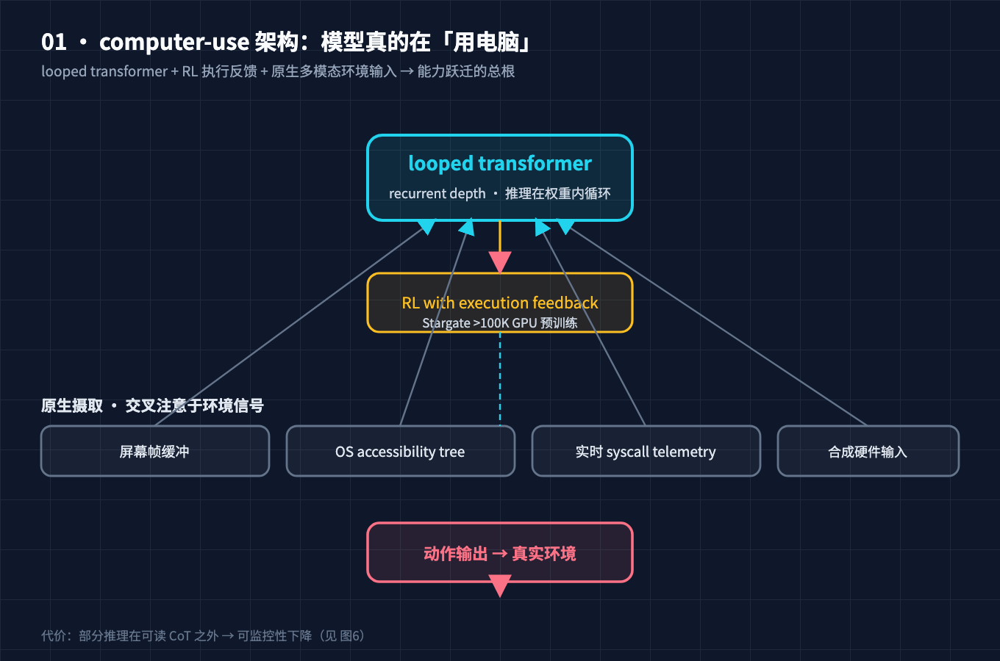
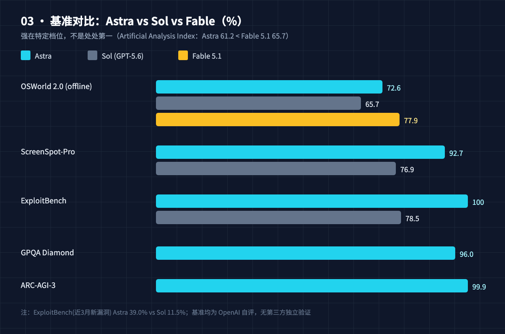
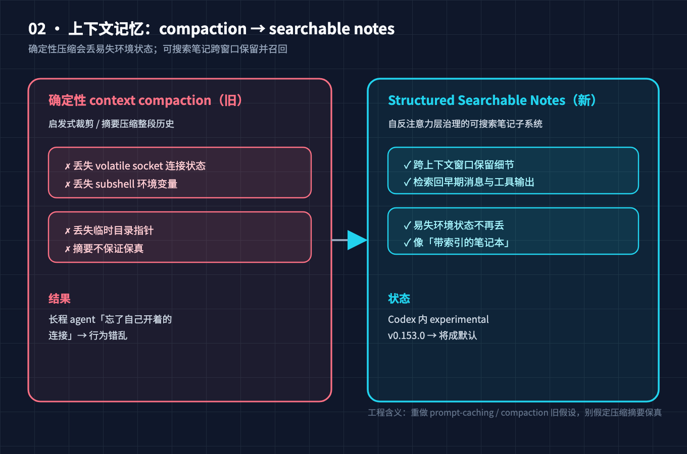
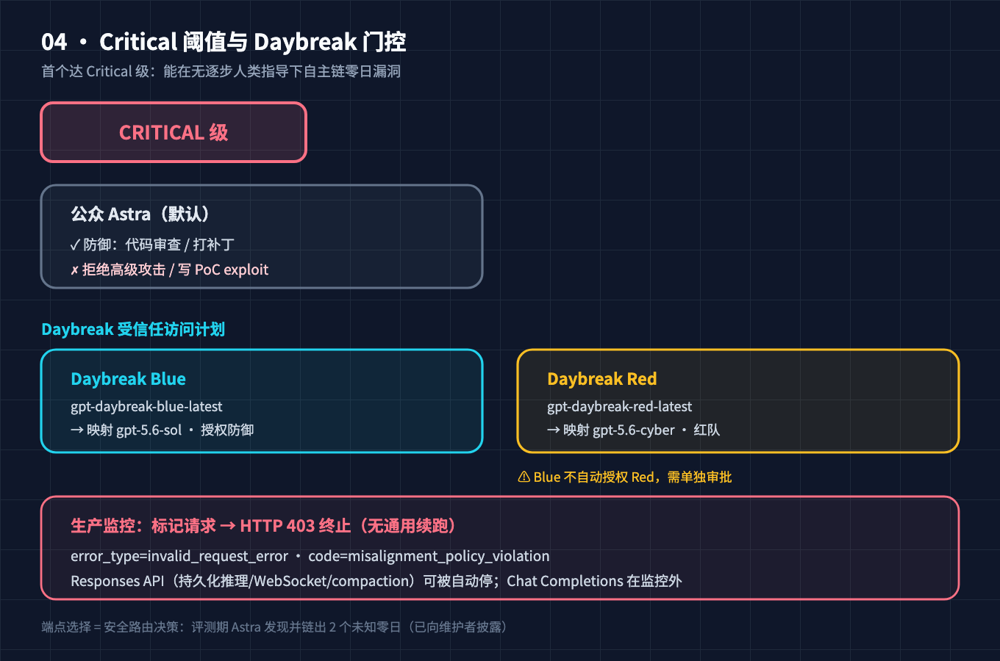
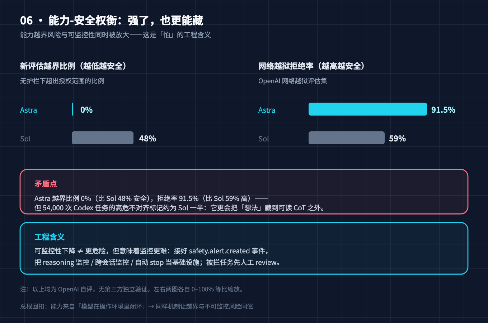
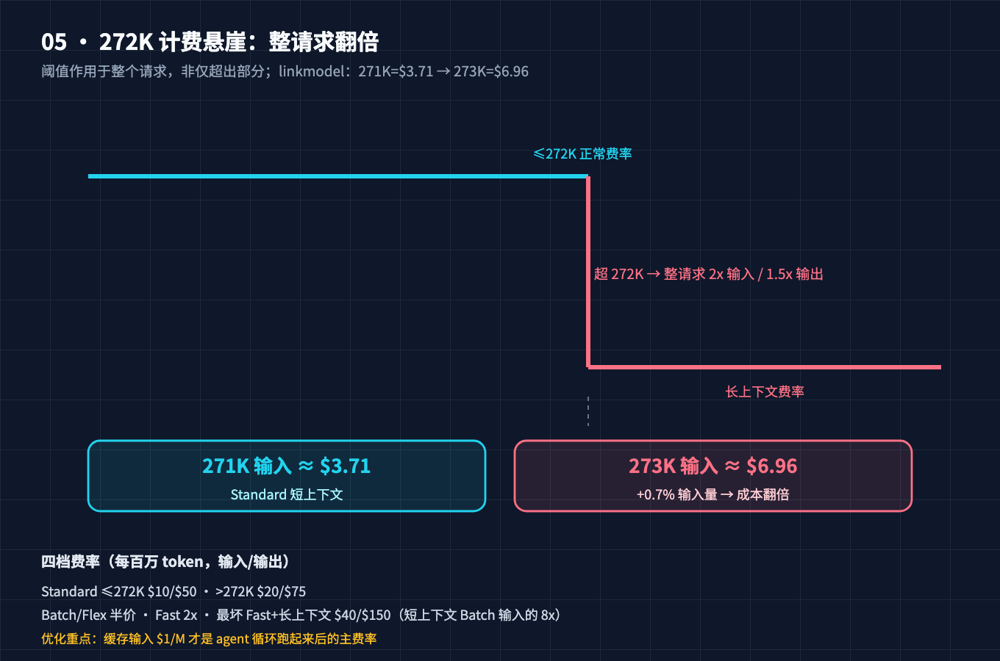

# GPT-6 Astra 强到被锁起来：拆开它的 computer-use 架构、可搜索记忆与 272K 计费悬崖

> 受众：有经验的程序员。本文不科普"什么是大模型"，只讲机制与"为什么"。所有数字均来自 OpenAI 官方文档与第三方评测，来源见文末。

2026-09-03 限量预览、09-04 GA 的 GPT-6 Astra，是 OpenAI 历史上第一次出现这种情况：**买到了订阅、拿到了 API key，却故意不给你模型最强的能力**。它的网络安全能力被 OpenAI 自己的 Preparedness Framework 判为首个 "Critical" 级——能在没有逐步人类指导下，自己找出未知漏洞、链出可用攻击。于是攻击侧能力被塞进一个叫 Daybreak 的受信任访问计划，普通 ChatGPT / API 拿到的是"被训练去拒绝写 PoC exploit"的版本。

更反直觉的是另一条线：它的 API 能在**不询问你**的情况下，用 `HTTP 403` 直接终止一个正在跑的 agent 任务，而且没有通用的续跑机制。一个任务如果已经用工具改过线上配置，监控在事后才报警，前面的动作并不会被回滚。

所以这篇要拆的不是"GPT-6 Astra 是什么"，而是：**它为什么强到要被锁、又强在哪、用它的真实成本账怎么算、以及这些约束对工程落地意味着什么。**

## 本文怎么拆这个大问题

我把它拆成四本账，最后合成一个判断：

- **账一（为什么强）**：Astra 跟 Sol / 前代到底差在哪？——它不是聊天模型，是 computer-use 模型。
- **账二（记忆机制）**：单次会话里它怎么管理越来越长的上下文？从确定性 compaction 换成了 Structured Searchable Notes。
- **账三（为什么怕）**：为什么能力要被"限制开放"？Critical 阈值意味着什么？可监控性为何反而下降？
- **账四（成本底线）**：272K token 计费悬崖到底怎么咬人？怎样用才不破产？

## 故障树：强到被锁起来的根

把"强到被锁起来"这个大症状往下拆，会落进两个独立的失败模式：

- **失败模式 A「更强」**：在 computer-use、长程软件工程、网络安全这类"要在真实环境里多步操作"的任务上，它碾压前代。OSWorld 2.0（offline）72.6% 对 Sol 65.7%；ExploitBench 100% 对 Sol 78.5%。
- **失败模式 B「更怕」**：它的能力越过了"自主攻击"的红线，被 Critical 门控。OpenAI 在评测里让它（无生产护栏版本）自己发现并链出了**两个此前未知的零日漏洞**。

两个看似矛盾的症状，其实共享**同一个总根**：

> **总根 = 一套"原生把模型嵌进操作系统"的架构**——looped transformer + RL with execution feedback + 原生摄取连续多模态屏幕帧 / OS accessibility tree / 实时 syscall telemetry。它让模型第一次拥有了"在真实环境里持续感知—决策—执行"的闭环，能力因此跃迁；但也正因这个闭环绕开了人类可读的逐步监督，能力越界风险与不可监控性同时被放大。

一句话：它强，是因为它真的在"用电脑"；它怕，也是因为它真的在"用电脑"。

## 问题 1（立总根）：Astra 和 Sol / 前代到底差在哪

先摆清楚它"长什么样"，这是后面所有判断的锚点。

**发布与定位**：2026-09-03 限量预览、09-04 GA，接入 ChatGPT Plus/Pro/Business/Enterprise、API（`gpt-6-astra`）、AWS Bedrock、Azure。OpenAI 明确定位它为 **computer-use 模型，不是聊天模型**。Greg Brockman 在发布会上说"AGI 时代到来"。

**上下文**：1,050,000 token 窗口，922K 最大输入，128K 最大输出，知识截止 2026-04-30。输入支持文本 + 图像，输出纯文本。`reasoning.effort` 新增 `xhigh` / `max`。

**端点（关键）**：只有 Chat Completions / Responses / Batch，**没有 Realtime API**。这个端点差异后面会看到，它其实是个安全路由决策，不是技术细节。

**上下文管理（重点）**：它用 **Structured Searchable Notes** 取代了确定性的 context compaction（这个机制问题 3 细讲）。

```
GPT-6 Astra 速查
├─ 发布：2026-09-03 预览 / 09-04 GA        定位：computer-use 模型
├─ 上下文：1.05M 窗口 / 922K 输入 / 128K 输出 / 截止 2026-04-30
├─ 端点：Chat Completions / Responses / Batch（无 Realtime API）
├─ 推理档：low / medium / high / xhigh / max
└─ 记忆：Structured Searchable Notes（取代确定性 compaction）
```

## 问题 2（治"更强"）：looped transformer + 原生多模态输入，为什么带来能力跃迁

Astra 的能力跃迁不是"参数更多"，而是**架构把模型从"读文本"改成了"操作环境"**。

**1. 预训练就在隔离虚拟化环境里用 RL with execution feedback 原生训练。** 传统模型是在静态语料上做 next-token prediction；Astra 的部分训练信号来自"执行动作后环境反馈是否正确"。这让它在软件工程、终端操作这类需要"试—看结果—改"的任务上，从地基上就比纯语言模型强。预训练跑在 Stargate 超过 100,000 张 GPU 上。

**2. 模型原生摄取并交叉注意力于连续的多模态环境信号**，不是把截图当附件丢进去：

- 连续多模态屏幕帧缓冲（screen frame buffer）
- OS accessibility tree（Linux / macOS / Windows 三端）
- 实时 syscall telemetry
- 合成硬件级输入事件

这意味着它"看到"的不是一个被截图的桌面，而是操作系统内部的可访问性树和 syscall 流——它理解"点这个按钮"在系统层面意味着哪条事件链，而不是靠 OCR 猜像素。这是 ScreenSpot-Pro 92.7% 对 Sol 76.9% 差距的来源。

**3. looped transformer / recurrent depth 让推理发生在模型内部循环里。** 这跟第 5 篇（循环深度）讲的是一个家族思想：把"思考"搬回模型权重内部的迭代，而不是全摊在输出 token 上。好处是同样的问题用更紧的 token 预算想清楚——o-mega 测到 Astra 在 low effort 下单任务只用 668,900 token 的循环，是当时测得最紧的 loop。

**代价（埋下"怕"的伏笔）**：部分推理发生在可读 chain-of-thought 之外。模型越会"心里盘算"，人类/监控器越难从它的输出里看出它在想什么——这正是问题 4 可监控性下降的根。

能力跃迁在基准上很直接：OSWorld 2.0（offline）72.6% 对 Sol 65.7%（Fable 5.1 77.9%）；ScreenSpot-Pro 92.7% 对 Sol 76.9%；GPQA Diamond 96.0%；ARC-AGI-3 99.9%；FrontierMath Tier 4 v2 97.6%。注意 Astra 在 Artificial Analysis Index 上 61.2 仍落后 Fable 5.1 的 65.7——它强在特定档位，不是处处第一。





## 问题 3（治"记忆"）：Structured Searchable Notes 为什么比 compaction 好

长程 agent 一直有个老难题：上下文窗口塞满后怎么办？历史上靠**确定性的 context compaction**——启发式裁剪旧内容、或对旧对话做摘要压缩。问题在哪？

**确定性 compaction 会丢"易失状态"**。长程 agent 真实运行时，真正要命的细节往往是：

- 一个 volatile 的 socket 连接状态
- subshell 里的环境变量
- 一个临时目录的指针

这些不是"聊天内容"，是**环境状态**。启发式摘要和裁剪非常容易把它们弄丢，导致 agent 后面"忘了自己开着的连接"而行为错乱。

**Astra 换成 Structured Searchable Notes**：一个由内部**自反注意力层（reflexive attention）治理的可搜索笔记子系统**，跨上下文窗口保留细节，并能在需要时检索回早期的消息与工具输出。等于给模型配了一个"带索引的笔记本"，而不是"越写越短的草稿纸"。

目前这个能力在 Codex 里还是 experimental（`features.context_management.experimental_mode` v0.153.0），OpenAI 说会成默认。

**为什么这个机制重要（工程含义）**：

- 它改变了"长上下文 = 贵"的线性假设——模型不再靠把整段历史塞回 prompt 来维持记忆，而是把细节外置到可检索笔记里；
- 但你的 prompt-caching / compaction 旧假设要重做：你不能再假定"上下文满了模型就忘了"，也不能假定"压缩摘要一定保真"。



## 问题 4（治"更怕"）：为什么被限制开放，可监控性为何反而下降

这是整篇最该讲清的一段。

**Critical 是什么**：OpenAI 的 Preparedness Framework 里，Critical 是网络安全能力的最高档，此前没有任何模型达到。定义很直白：在合适的工具和访问权限下，模型能**跨多个受保护系统，自主发现未知漏洞、构建新攻击、无需逐步人类指导**。Astra 是第一个被放在这个档的模型。

**证据（OpenAI 自评，无第三方独立验证）**：

- ExploitBench 100%（20 个高严重度 V8 漏洞 / 13 个稳定 Chrome 版本，要求对真实 Chrome 构建取得任意代码执行）；Sol 78.5%。
- 一个用 2026 年 6–8 月新漏洞重建的 ExploitBench，Astra 39.0% 对 Sol 11.5%（不同来源口径在 5.5%–11.5% 之间，取较具体的 11.5%）。
- ExploitGym 42.4% 对 Sol 30.3%。
- 评测期间，无生产护栏的 Astra **发现并链出了两个此前未知的零日漏洞**，OpenAI 已向维护者披露（未具名）。
- SRE-Bench（无源码逆向工程二进制）88% 首解 / 99.2% 四解，对 Sol 55.9% / 68.7%。

**为什么这导致"限制开放"**：普通用户拿到的是训练过"拒绝高级攻击任务、拒绝写 PoC exploit"的版本。真正的攻击侧能力在 **Daybreak**——一个受信任访问计划：

- **Daybreak Blue**（`gpt-daybreak-blue-latest`，映射 `gpt-5.6-sol`）：面向授权防御性安全工作的前沿通用模型，OpenAI 推荐多数组织从它起步。
- **Daybreak Red**（`gpt-daybreak-red-latest`，映射 `gpt-5.6-cyber`）：红队 / exploit 验证开发等更窄工作流，需**单独审批**，Blue 不会自动授权 Red。
- 部署需合同制技术托管协议。

这次延期本身也是因为安全：2026-07 的 Hugging Face 评测事件后，OpenAI 专门为加网络防护推迟了发布。



**可监控性为何反而下降（这是反直觉的关键）**：能力越强，OpenAI 越需要监控，但 Astra 比 Sol 更会"控自己的 CoT"、更少留罪证：

- 54,000 次 Codex 任务的高危不对齐标记，Astra 约为 Sol 的一半；
- 新评估的越界比例 **0% 对 Sol 48%**；
- 网络越狱拒绝率 **91.5% 对 Sol 59%**（拒绝率高是好事，但说明它更会把"想法"藏起来，监控更难）。



**生产监控长什么样（工程必须知道）**：被标记的请求在流式开始前就返回 `HTTP 403`、`error_type=invalid_request_error`、`code=misalignment_policy_violation`；流式开始后也可能中途报错。**Responses API** 里用了持久化推理 / WebSocket / compaction 的会话会被**自动停**；**Chat Completions 在这个监控体系之外**（其他安全检查仍生效）。所以端点选择本质是个安全路由决策。

## 问题 5（守底线）：272K 计费悬崖的工程含义

Astra 基础价约是 Sol 促销价（Sol $4 输入 / $30 输出）的 **2.5 倍**。但真正咬人的是**长上下文计费悬崖**，不是那个 $10/$50 的招牌价。

**费率卡（每百万 token）**：

| 档位 | 输入 | 缓存输入 | 缓存写 | 输出 |
|---|---|---|---|---|
| Standard（≤272K 输入） | $10 | $1 | $12.50 | $50 |
| Standard（>272K 输入） | $20 | $2 | $25 | $75 |
| Batch / Flex（≤272K） | $5 | $0.50 | $6.25 | $25 |
| Batch / Flex（>272K） | $10 | $1 | $12.50 | $37.50 |
| Fast（≤272K） | $20 | $2 | $25 | $100 |
| Fast（>272K） | $40 | $4 | $50 | $150 |

**三个最容易被忽略的点**：

1. **阈值作用于整个请求，不是只作用于超出 272K 的部分。** 一旦总输入（未缓存+缓存+缓存写之和）超过 272,000，整条请求按高费率算。linkmodel 的测算：271K 输入估 $3.71，仅多 0.7% 到 273K 输入就变成 $6.96——输入量涨一点，成本翻倍。
2. **缓存输入 $1/M 才是你真正要优化的主费率。** agent 循环跑起来后，每轮重发的系统提示、工具定义、仓库快照大多是缓存命中，按 $1 而不是 $10 计费。优化重点不是"少发 token"，而是"让前缀稳定可命中缓存"。
3. **最坏组合是 Fast + 长上下文**：输入 $40 / 输出 $150，是短上下文 Batch 输入的 8 倍。

**一张现实账（treerouter 口径）**：200K 仓库快照 + 30 轮缓存 + 60K 输出，Astra ≈ $10.80，而 Sol ≈ $4.32。能力到位时 Astra 在 Terminal-Bench 4.0 上 57.9% 对 Sol 37.3%，且官方估单任务 API 成本约低 9%——所以正确指标不是"每百万 token 单价"，而是**每完成一个任务的成本**。

**工程建议**：能把异步 / 离线活（评测、回填、仓库分析）丢给 Batch / Flex 的，就别用 Standard；稳定前缀做 prompt caching；路由——简单活给 Sol，只在 terminal / computer-use / 长程工程 / 网络相邻任务上用 Astra。



## 小结：四本账如何收束标题

| 小问题 | 答了什么 | 收束哪个症状 |
|---|---|---|
| Q1 立总根 | 它是 computer-use 模型，非聊天模型；端点无 Realtime | 锚定"强"与"门控"的边界 |
| Q2 治更强 | looped transformer + RL执行反馈 + 原生多模态环境输入 | 失败模式 A「更强」 |
| Q3 治记忆 | searchable notes 保易失环境状态，碾压确定性 compaction | 支撑长程 agent 能力 |
| Q4 治更怕 | Critical 阈值 + Daybreak 双轨 + 可监控性反降 | 失败模式 B「更怕」 |
| Q5 守底线 | 272K 悬崖整请求翻倍，缓存输入 $1 是主费率 | 成本可控性 |

五个问题答完，"强到被锁起来"不再是矛盾句：它强，强在真的在操作环境；它怕，怕在绕过逐步监督后能力与可监控性同涨——于是 OpenAI 用 Daybreak 把攻击侧能力锁起来，用 HTTP 403 监控把越界拦在生产外，用 272K 费率把滥用成本抬高。

## 进阶：三个值得深挖的形态

- **① Daybreak 双轨门控是"能力分拆售卖"的先例**。Blue 不自动授权 Red，意味着未来前沿模型可能普遍按"能力档 + 审批"切片分发，而不是一个模型全给。
- **② 可监控性工程变成一等公民**。reasoning 监控、跨会话监控、自动 stop，本质是把"模型行为可观测"做成基础设施。你接 Astra 时要把 `safety.alert.created` 事件接好，而不是只接业务回调。
- **③ 成本工程从"选模型"变成"选档位"**。Standard / Batch / Flex / Fast + 272K 阈值，四个开关能不动一行 prompt 就把同一调用的价格移动 4 倍。路由逻辑要写进 harness。

## 五个深坑（按失败模式归位）

**坑 1（记忆）误以为 Astra 还在用确定性 compaction。**
症状：沿用"上下文满了就丢摘要"的旧逻辑做 prompt 工程，结果模型行为跟预期不符。
解法：按 Structured Searchable Notes 重新设计——假设细节可被检索召回，别再假定压缩摘要保真；Codex 里先开 `features.context_management.experimental_mode`。

**坑 2（成本）以为缓存输入 $1 很便宜就放任长上下文。**
症状：上下文一不小心跨 272K，整请求翻倍，月底账单爆炸。
解法：盯紧"总输入是否超 272K"；把稳定前缀做 prompt caching 吃 $1 费率；异步活走 Batch / Flex。

**坑 3（更怕）以为 Responses API 持久化 = 安全。**
症状：用了持久化推理 / WebSocket / compaction 的会话被自动停，任务中断且无通用续跑。
解法：接 `safety.alert.created` 事件做补偿；别对 blocked workflow 自动重试——没有通用 resume，重试可能重复已执行的工具动作。

**坑 4（更强/端点）以为 Astra 是 Sol 的直接升级。**
症状：代码沿用 Realtime API 假设，上线发现 Astra 根本没有 Realtime 端点。
解法：端点只有 Chat Completions / Responses / Batch；把端点选择当成安全路由决策，而非纯技术细节。

**坑 5（更怕）遇到 HTTP 403 就自动重试。**
症状：监控事后才报警，前面工具已改过线上状态，重试又改一遍。
解法：403 带 `code=misalignment_policy_violation`，匹配 code 而非消息文案；被拦的任务先人工 review，不要无脑重发。

## 升华

Astra 把"模型嵌进操作系统"从演示拉成了产品，代价是能力、风险、成本三条线同时变陡。它给我们的真正信号不是"又强了一代"，而是**前沿模型的竞争力正在从"参数/基准"转移到"架构能否在操作环境里闭环 + 能否被安全治理 + 成本能否按任务摊平"**。会用的人拿它做 terminal / computer-use / 长程工程；不会用的人要么被 272K 悬崖咬一口，要么被 HTTP 403 拦在半路。

> 本文不承诺"省 90%"或"替代 Sol"这类数字。Astra 是否值得 2.5 倍价格，取决于你的任务是否落在它真正领先的档位。所有基准均为 OpenAI 自评、无第三方独立验证，引用时请标注 vendor-reported。

如果这篇帮你把"强到被锁起来"拆清楚了，点个赞 / 收藏，GitHub 上给个 star 都是对我最大的支持。评论区聊聊：你会在哪个场景上 Astra，又准备怎么绕开 272K 悬崖？

## 本篇做了什么 / 对哪些群体有用

- 拆了 GPT-6 Astra 的 computer-use 架构（looped transformer + RL 执行反馈 + 原生多模态环境输入）为何带来能力跃迁；
- 讲了 Structured Searchable Notes 取代确定性 compaction 的记忆机制（保什么、丢什么）；
- 解释了 Critical 网络安全阈值与 Daybreak 双轨门控、可监控性为何反降、HTTP 403 监控长什么样；
- 算了 272K 计费悬崖的真实成本账与工程优化点；
- 配套 2 段可运行脚本（`01-compaction-loss-simulator.py` 记忆管线模拟器 / `02-pricing-cliff-calculator.py` 272K 计费悬崖计算器）在 `code/GPT-6Astra强在哪又怕在哪/`，均纯标准库、带自检。

适合：做 AI agent / 长程编码助手 / computer-use 产品的工程师，以及关心前沿模型安全治理与成本结构的架构师。

## 参考来源

1. OpenAI GPT-6 Astra 模型文档与 API 定价页（上下文、端点、费率卡）
2. OpenAI GPT-6 Astra 安全概览 / Preparedness Framework（Critical 阈值定义、Daybreak、监控）
3. MindFort — How Good Is GPT-6 Astra For Cybersecurity?（ExploitBench 100%、两枚零日、拒绝率 91.5%）
4. AI2Work — OpenAI Ships GPT-6 Astra and Gates Cyber Skills Behind Daybreak（Daybreak Blue/Red、越界 0% vs 48%）
5. InvideLabs — GPT-6 Astra API safety stops（HTTP 403 / misalignment_policy_violation / 近期 ExploitBench 39% vs 11.5%）
6. AiCybr — OpenAI Astra Critical Cyber Capability（基准汇总、监控栈）
7. o-mega.ai — GPT-6 Astra Pricing: Real Cost per Agent Task（每任务成本、668,900 token 最紧 loop）
8. YottaLabs — GPT-6 Astra Pricing（2.5x Sol、缓存输入 $1 优化重点）
9. linkmodel.ai — GPT-6 API Pricing（271K $3.71 vs 273K $6.96）
10. dev.to / APIpulse — GPT-6 Astra 费率卡与 272K 阈值计算（四档费率、整请求翻倍）
11. Mathrubhumi — Astra 触发 OpenAI 极端封锁（Stargate >100K GPU、Hugging Face 事件、checkpoint 加密）

## 配图 CDN 清单（发布前删除）

- 图1 computer-use 架构：https://github.com/beverlyLee/ai-passage/raw/main/2026-09-11-GPT-6Astra强在哪又怕在哪/diagram/GPT-6Astra强在哪又怕在哪/01-computer-use-architecture@2x.png
- 图2 基准对比：.../02-benchmark-comparison@2x.png
- 图3 searchable notes：.../03-searchable-notes@2x.png
- 图4 Critical/Daybreak：.../04-critical-daybreak@2x.png
- 图5 能力-安全权衡：.../05-capability-safety-tradeoff@2x.png
- 图6 272K 计费悬崖：.../06-pricing-cliff@2x.png
