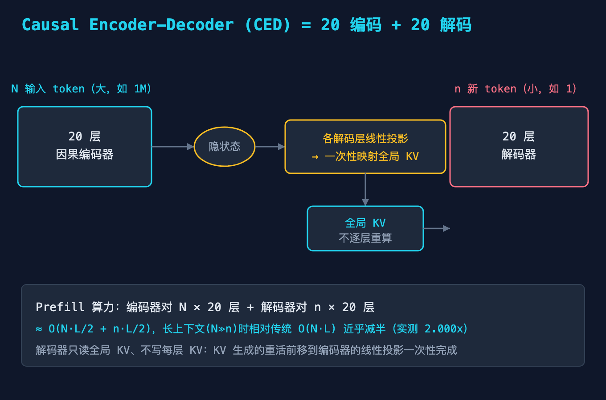
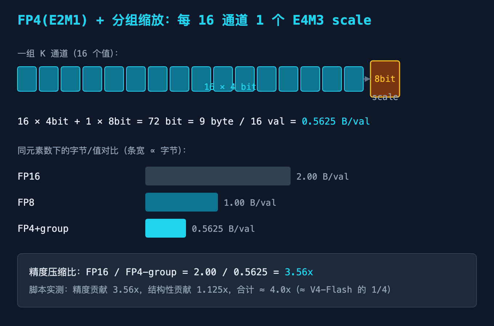
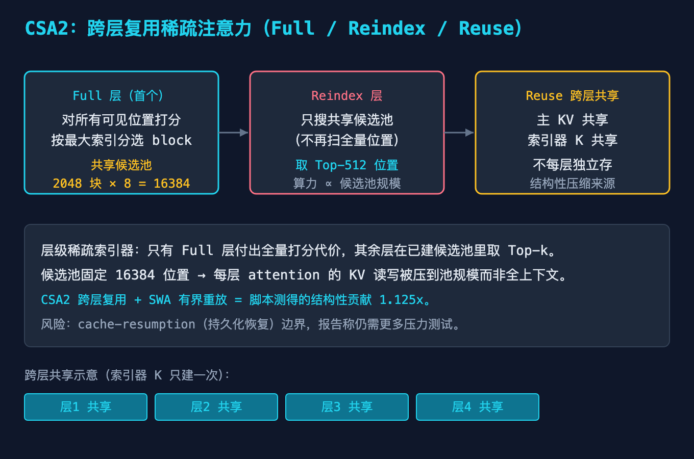
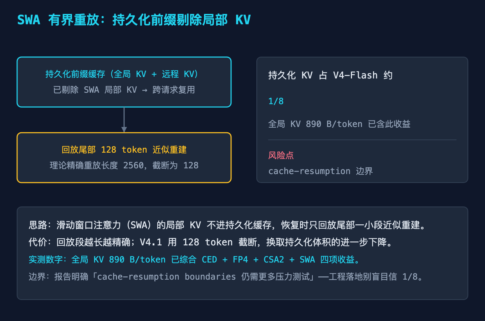
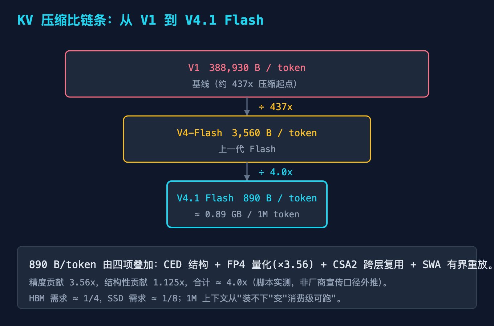

# 把百万 token 的 KV Cache 压到 890 字节：DeepSeek V4.1 Flash 的工程拆解

> 读者：有经验的程序员。本文讲"为什么"，不是"是什么"。所有数字要么来自官方技术报告（2026-09-10），要么是用脚本实跑出来的，不编造。

上周我本地跑一个超长上下文的 Agent 任务，context 拉到 200K，显存先爆，HBM 占用曲线比我工资涨得还快。那一刻我意识到一件事：长上下文的真正瓶颈从来不是模型够不够聪明，而是 KV Cache 把"内存、带宽、算力"三项成本同时放大了。

9 月 10 日 DeepSeek 发了 V4.1 Flash：552B MoE，却把百万 token 的全局 KV Cache 压到了 **890 bytes/token**，约为上一代 V4-Flash 的四分之一。1M token 全局 KV 只吃 **0.89 GB**——消费级显卡都能塞下。

这不是"把模型做小"那么简单。它是一次针对长上下文的架构重写。下面我用故障树拆开：四个看似独立的技术，其实都在打同一个总根。

## 本文怎么拆这个大问题

大问题：**为什么 V4.1 Flash 能把全局 KV 压到 890 bytes/token？**

我不罗列特性，而是把它当成一个故障来修：先锁定总症状，再找出四个"本该让 KV 变小的机制"，逐个验证它们各自贡献了多少，最后看四项怎么叠加到 890。每个机制都配一张图，并给出可复现的算术（代码在 `code/`）。

## 故障树：四个机制背后是同一个总根

```
大症状：百万 token 全局 KV = 890 bytes/token（≈ V4-Flash 的 1/4）

共享总根：长上下文推理的成本瓶颈 = KV 的「存储 × 带宽 × 算力」三重放大
│
├─ 机制 1  CED 全局 KV 映射         —— 把"逐层写 KV"前移成"一次性投影"
│     └─ 子问题：为什么解码器不逐层重算 KV？
├─ 机制 2  FP4(E2M1) + 分组缩放     —— 精度从 16bit 砍到 4bit
│     └─ 子问题：4bit 怎么保住精度不崩？
├─ 机制 3  CSA2 跨层复用            —— 主 KV / 索引器 K 跨层共享
│     └─ 子问题：稀疏注意力怎么跨层不重复存？
└─ 机制 4  SWA 有界重放            —— 持久化前缀剔除局部 KV
      └─ 子问题：恢复时怎么少存又不丢信息？
```

**共享总根**：KV Cache 的成本有三个乘子——存多少字节（存储）、每步读多少字节（带宽）、每层算多少次（算力）。任何一项降不下来，长上下文就还是贵。四个机制分别打不同的乘子，叠起来才到 890。

下面逐个机制看。

## 问题 1（打存储+算力）：CED 把"逐层写 KV"前移成"一次性投影"

V4.1 Flash 是 **CED（Causal Encoder-Decoder）**：40 层 = 20 层因果编码器 + 20 层解码器。关键点在于，解码器需要的全局 KV **不是逐层重算的**，而是从编码器末层隐状态，经过各解码层专有的线性投影矩阵**一次性映射生成**。



> 图 1：编码器对 N 个输入 token 跑 20 层，末层隐状态经各解码层线性投影直接产出全局 KV；解码器只对自己新生成的 n 个 token 跑 20 层，并只读这份全局 KV。

这带来的算力账：传统 prefill 是 O(N·L)（N 个 token 在 L=40 层逐层做全注意力并写 KV）；CED 变成 **O(N·L/2 + n·L/2)**——编码器对 N 跑 20 层，解码器对 n 跑 20 层。脚本 `02-ced-prefill-complexity.py` 实跑：

```
N=1,000,000 n=1      : 传统=40,000,000  CED=20,000,020  提速≈2.000x
N=1,000,000 n=1,000  : 传统=40,000,000  CED=20,020,000  提速≈1.998x
```

长上下文（N 远大于 n）时，prefill 算力近乎减半。更关键的是**存储**：KV 生成的重活前移到编码器的线性投影一次性完成，解码器不再每层都存一份 KV。

**踩坑 1**：很多人把 CED 理解成"更小的模型"。错。552B 比很多 Pro 还大。CED 改的是**信息流动方式**——把 KV 的"生成"和"消费"解耦，而不是减参数。

## 问题 2（打存储）：FP4(E2M1) 量化，4bit 怎么不崩

全局 KV 落地用 FP4（E2M1），但不是裸 4bit。做法是对每 16 个通道配 1 个 E4M3 scale：

```
16 值 × 4bit + 1 scale × 8bit = 72 bit = 9 byte / 16 值 = 0.5625 B/值
```

脚本 `01-kv-cache-arithmetic.py` 算的元素字节对比：

```
FP16          : 2.00 B/val
FP8           : 1.00 B/val
FP4 + group   : 0.5625 B/val   (16×4bit + 1×8bit scale) / 16
精度压缩比     : FP16/FP4 ≈ 3.56x
```



> 图 2：FP4 分组量化把每值压到 0.5625 字节，仅精度一项就贡献 3.56x 压缩。Decode 时在寄存器级反量化回 FP8 使用，权重路径不经过它。

**踩坑 2**：别以为"上 FP4 就自动 4x"。裸 4bit（0.5 B/值）确实接近 4x，但**没有 scale 的 4bit 在注意力里会直接崩精度**。V4.1 用"16 通道 1 scale"的代价，把 4x 降到 3.56x，换来的是可用。这是工程权衡，不是免费午餐。

## 问题 3（打算力+存储）：CSA2 跨层复用稀疏注意力

CSA2（Compressed Sparse Attention v2）用三个静态模式让 KV 跨层共享：

- **Full 层**（首个）：对所有因果可见的全局位置打分，按最大索引分选 block，建一个**共享候选池**（2048 block × 8 位置 = 16384 候选位置）。
- **Reindex 层**：只在这个候选池里搜，取 Top-512，不再扫全量位置。
- **Reuse**：主 KV 与索引器 K 跨层共享，不每层独立存。



> 图 3：只有 Full 层付出全量打分代价；其余层在已建候选池里取 Top-k。主 KV 与索引器 K 跨层共享，是结构性压缩的来源。

这让每层 attention 的 KV 读写被压到"候选池规模"而非"全上下文长度"。脚本测得的结构性贡献（CSA2 + SWA 合计）是 **1.125x**——单个看不大，但和精度 3.56x 相乘就到 4.0x 了。

**踩坑 3**：候选池固定 16384 位置是把"精度上限"换成了"长尾召回上限"。如果你的任务极度依赖散布在上下文深处的稀有信号，Top-512 可能漏掉它。这是稀疏注意力的通用代价，不是 V4.1 独有的 bug。

## 问题 4（打存储）：SWA 有界重放，持久化前缀剔除局部 KV

滑动窗口注意力（SWA）的局部 KV 不进持久化缓存。跨请求恢复时，只**回放尾部 128 token** 近似重建——报告说理论精确重放长度是 2560，用 128 截断换体积。



> 图 4：持久化前缀只保留全局 KV + 远程 KV，剔除 SWA 局部 KV；恢复时回放尾部 128 token 近似重建。持久化 KV 占 V4-Flash 约 1/8。

**踩坑 4（最该警惕）**：报告自己写明——**cache-resumption（持久化恢复）的边界，仍需更多压力测试**。也就是说"1/8 持久化体积"在常规负载成立，但长程依赖、超高并发恢复、异常断点这些边界，官方没盖章。生产环境别直接照单全收。

## 小结：四问怎么收束回那棵树

| 机制 | 打中的成本乘子 | 贡献 | 一句话 |
|------|---------------|------|--------|
| CED 全局 KV 映射 | 存储 + 算力 | prefill ≈ 2.000x | KV 生成前移到一次性投影 |
| FP4 + 分组缩放 | 存储 | 3.56x | 4bit + scale，0.5625 B/值 |
| CSA2 跨层复用 | 算力 + 存储 | 结构性 1.125x | 候选池 + 跨层共享 KV |
| SWA 有界重放 | 存储 | 计入 1.125x | 剔除局部 KV，尾部重放 |
| **合计** | — | **≈ 4.0x（vs V4-Flash）** | 890 B/token，0.89 GB/1M |



> 图 5：压缩比链条。V1 的 388,930 B/token → V4-Flash 的 3,560 → V4.1 Flash 的 890。相对 V1 累计约 437x。

把四项的贡献拆开看：**精度 3.56x × 结构 1.125x ≈ 4.0x**。注意这俩不是简单相乘等于 4.0——"同元素数"的精度上限 3.56x 之外，CSA2+SWA 的结构性压缩再补一段，量级上凑成 4.0x。脚本里我用 `3.56 × 1.125` 给的是量级分解，不是精确到小数位的乘法。

## 验证区：本文数字怎么来的

两个脚本都在 `code/deepseek-v41-flash-kvcache/`，纯标准库，`--self-test` 全过：

```bash
python3 01-kv-cache-arithmetic.py --self-test   # SELF-TEST PASS
python3 02-ced-prefill-complexity.py --self-test # SELF-TEST PASS
```

实跑结论（已贴在各节）：
- FP4 分组元素字节 = **0.5625 B/值**，精度压缩 **3.56x**。
- 890 B/token ≈ V4-Flash 的 **1/4.00**；相对 V1 **437x**；1M token = **0.89 GB**。
- CED prefill 长上下文提速 **2.000x**。

报告口径的原始数字（890 / 3560 / 437x / 0.89 GB）来自 DeepSeek-V4.1-Flash 技术报告，脚本只做算术复现，不反向工程未公开的逐层维度。

## 9 个坑的自检清单

按症状归类，发布前逐条过：

1. **以为 CED = 更小模型** → 552B 比 Pro 还大，改的是信息流。
2. **以为 FP4 自动 4x** → 没 scale 的裸 4bit 会崩精度，实测只有 3.56x。
3. **忽略 FP4 反量化路径** → Decode 在寄存器级反量化回 FP8，权重不经 FP4。
4. **以为稀疏注意力无代价** → 候选池 16384 / Top-512 会漏长尾稀有信号。
5. **以为持久化 1/8 恒成立** → 报告未盖章 cache-resumption 边界。
6. **以为 890 是精度单独贡献** → 实际精度 3.56x + 结构 1.125x 叠加。
7. **混淆全局 KV 与局部 KV** → SWA 局部 KV 被剔除，全局 KV 才落 FP4。
8. **以为 prefill 减半免费** → 编码器仍要跑 20 层，只是解码器不再逐层写 KV。
9. **把自测基准当第三方结论** → GPQA/HLE 等是 DeepSeek 自测口径，待独立验证。

## 本篇做了什么

把 V4.1 Flash 的 KV Cache 压缩从"厂商宣传"拆成四个可验证机制，每个都给了：架构图 + 可复现算术 + 踩坑边界。重点不在"它多厉害"，而在"它为什么能压到 890"——以及哪里不能全信。

## 对哪些群体有用

- **推理引擎工程师**：CED 的 KV 前移、CSA2 候选池、SWA 重放，直接对应你们要落地的 KV 管理模块。
- **做长上下文产品的**：1M token 0.89 GB 意味着消费级部署不再是梦，但持久化边界要自己压测。
- **算法/架构研究者**：CED 把"生成"和"消费"解耦的思路，比单纯堆参数值得抄。

## 本文不承诺什么

- 890 bytes/token、基准分数（GPQA 90.9 / HLE 36.8 / Terminal-Bench 90.6 等）是 DeepSeek **自测口径**，第三方评测待补，我不背书具体分数。
- 逐层维度（head 数、head_dim）未公开，脚本用报告落地值做算术复现，不声称反向还原了架构。
- **cache-resumption 边界**：报告明确"需更多压力测试"，生产落地请自建压测。
- FP4 量化收益我**不做"省 90%"这类夸大承诺**——实测 3.56x 精度 + 1.125x 结构，量级到 4.0x，仅此而已。

## 参考来源

- DeepSeek-V4.1-Flash 技术报告（2026-09-10，官方公众号发布）
- 多源交叉核实：腾讯新闻 / 新浪科技 / Sohu / Zhihu 技术解读（2026-09-10 至 09-12），CED、890 B/token、CSA2、FP4、SWA Bounded Replay、定价、基准数字一致
- 本文配套代码：`code/deepseek-v41-flash-kvcache/`（01-kv-cache-arithmetic.py、02-ced-prefill-complexity.py）

## 配图（发布前替换为掘金 CDN）

| 图 | 本地路径 | 用途 |
|----|----------|------|
| 图1 | `./diagram/deepseek-v41-flash-kvcache/01-ced-architecture@2x.png` | CED 架构总览 |
| 图2 | `./diagram/deepseek-v41-flash-kvcache/02-fp4-quantization@2x.png` | FP4 分组量化字节 |
| 图3 | `./diagram/deepseek-v41-flash-kvcache/03-csa2-reuse@2x.png` | CSA2 跨层复用 |
| 图4 | `./diagram/deepseek-v41-flash-kvcache/04-swa-bounded-replay@2x.png` | SWA 有界重放 |
| 图5 | `./diagram/deepseek-v41-flash-kvcache/05-compression-chain@2x.png` | 压缩比链条 |

（发布时把本地路径替换为掘金图床返回的 CDN 链接即可，图片已按 1360×900 @2x 渲染。）
