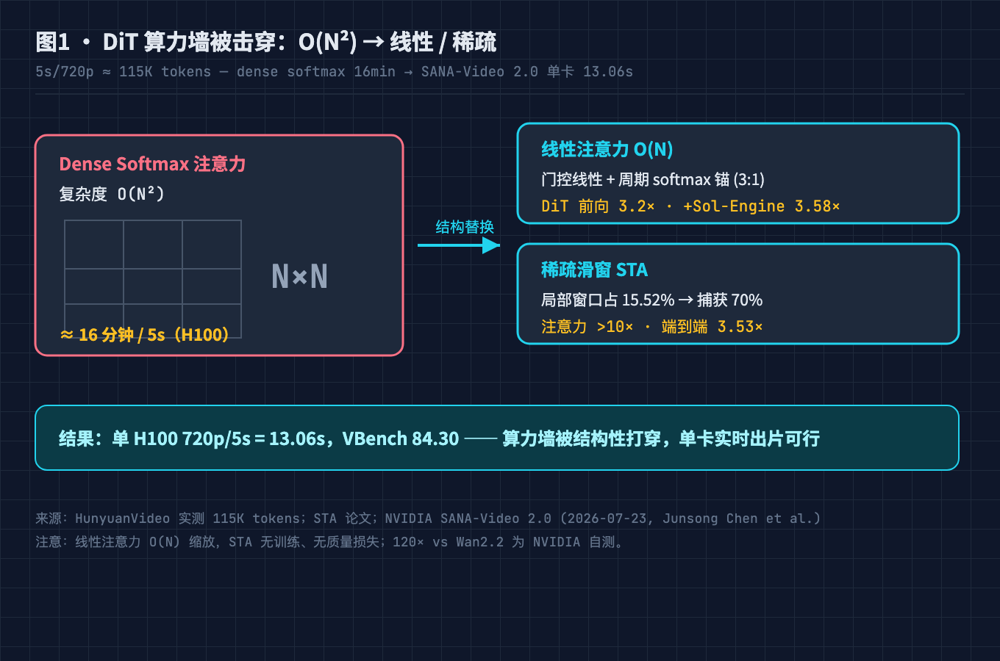
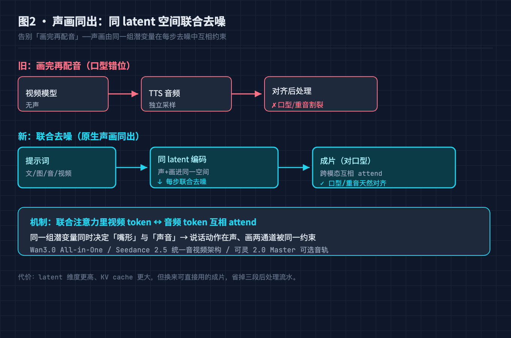
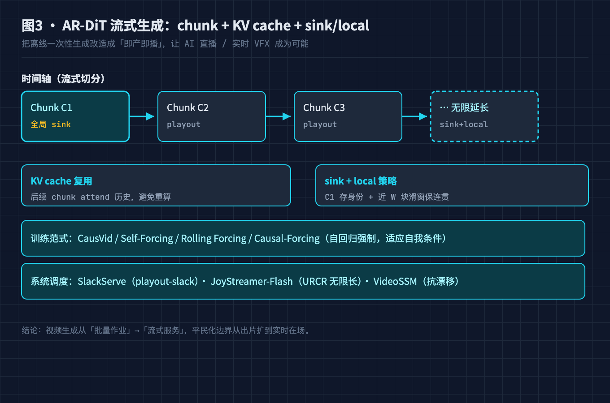
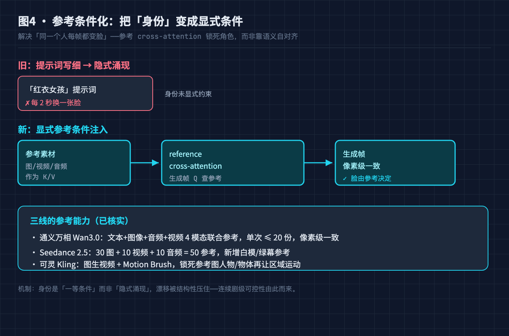
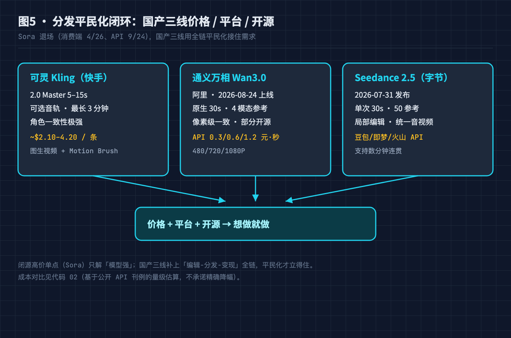
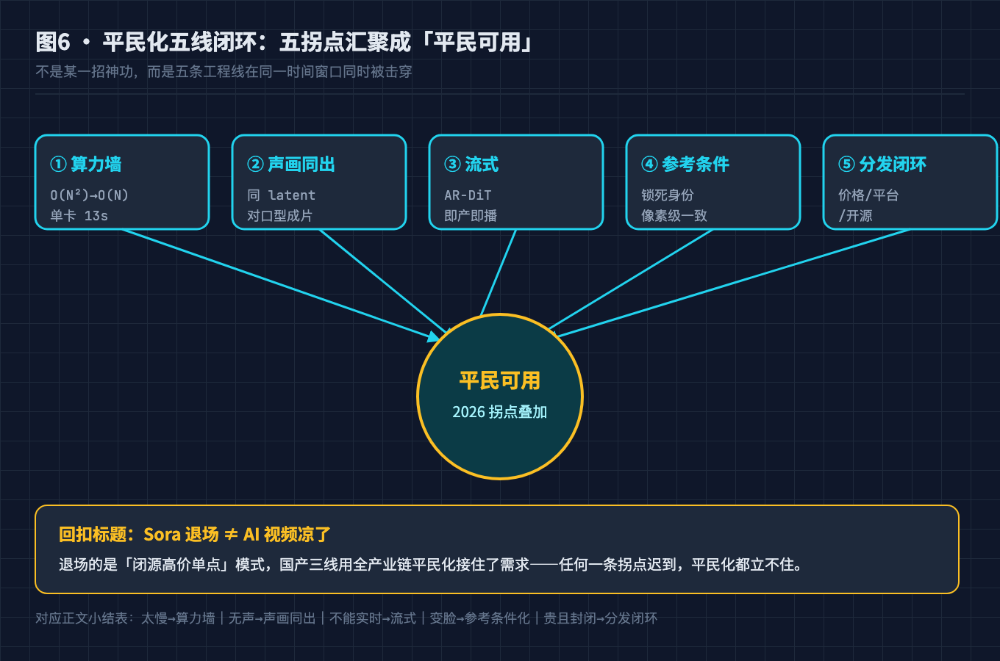

# Sora 退场，国产三线崛起：AI 视频平民化背后的 5 个工程拐点

> 受众：有经验的程序员。本文不科普"什么是扩散模型"，默认你懂 latent、去噪、KV cache、注意力复杂度。重点讲清楚每一道工程拐点"为什么成立、怎么被工程化解决、证据在哪"。

## 引子：一个反直觉的时间点

2026 年 4 月 26 日，OpenAI 关停了 Sora 的消费端；开发者 API 也将在 9 月 24 日清零。就在同一年，国内三条视频模型线同时站到台前：

- **可灵 Kling（快手）**：2.0 Master 支持 5–15 秒生成、可选音轨、角色一致性极强，单条最长可到 3 分钟（Sora 上限仅 20 秒）。
- **通义万相 Wan3.0（阿里）**：2026-08-24 正式上线，All-in-One 架构，原生单次 30 秒、4 模态联合参考、像素级一致性。
- **Seedance 2.5（字节）**：2026-07-31 发布，统一多模态音视频联合生成架构，单次 30 秒、最多 50 个多模态参考、支持局部编辑。

一边是闭源标杆退场，一边是国产三线把"生成一段能用的视频"从实验室玩具变成开源/低价的平民工具。这不是价格战这么简单——如果是，Sora 早就该降价打赢。真正发生的是**五条工程线在同一时间窗口被同时击穿**。本文把这五个拐点一个个拆开讲。

## 本文怎么拆这个大问题

**总问题**：为什么 2026 年 AI 视频突然"平民化"了？普通人能用的背后，是哪些工程拐点在起作用？

我把这个总问题拆成 5 个论点，每个论点都按"现象 → 难点机制 → 工程怎么解 → 证据"四步论证：

- 论点 1：**算力墙被击穿** —— DiT 的 O(N²) 注意力如何被线性/稀疏注意力打穿
- 论点 2：**声画同出** —— 原生音视频联合生成，告别"画完再配音"
- 论点 3：**实时化与流式** —— AR-DiT 让"即产即播"第一次成为可能
- 论点 4：**参考条件化** —— 解决"同一个人每帧都变脸"的硬伤
- 论点 5：**分发平民化闭环** —— 从"能生成"到"能用上"的工程闭环

最后用一张表把 5 个论点收束回总问题，并点明：Sora 退场恰恰说明"闭源高价单点"模式赢不了"全产业链平民化"。

## 总问题：AI 视频的"平民化"到底卡在哪

把 2023–2025 年的 AI 视频和今天对比，卡点从来不是"模型会不会画画"。早期模型也能出片，但满足不了"平民可用"的四个硬约束：

1. **太慢**：生成几秒视频要等十几分钟，没法进生产流。
2. **无声**：视频没有原生音频，配音得另做，口型对不上。
3. **太脆**：同一个角色跨帧就漂移，连续剧/广告用不了。
4. **太贵/太封闭**：要么闭源高价，要么只在论文里。

这四点，恰好对应下面五个工程拐点。注意它们是**叠加关系**——任何一条没解决，平民化都立不住。

---

## 论点 1：算力墙被击穿 —— DiT 的 O(N²) 是怎么被拆的

### 现象
HunyuanVideo 在 H100 + FlashAttention 3 上生成 5 秒 720p 视频需要 **16 分钟**；而 NVIDIA 的 SANA-Video 2.0 在单张 H100 上生成同样规格只要 **13.06 秒**。同是 DiT 架构，差距近 **70 倍**。

### 难点机制：视频 token 数的爆炸
视频不是图像。一段 5 秒 720p、24fps 的视频，先被 VAE 编码到 latent 空间，再被时空 patchify 成 token。HunyuanVideo 实测 5s/720p ≈ **115K tokens**（FastVideo / STA 论文数据；8s 量级约 110K–115K）。

标准 Video DiT 用 **dense full-softmax 跨时空注意力**：每个 token 要和所有 token 算注意力。复杂度是 **O(N²)**。115K tokens 时，注意力矩阵是 115K × 115K ≈ 1.3×10¹⁰ 量级，单卡根本扛不住，只能靠堆卡近线性扩展：HunyuanVideo 1/2/4/8 卡耗时分别约 1904/934/514/338 秒，且 720p 还要 60GB 显存。

### 工程怎么解：把 O(N²) 换成 O(N) 或稀疏

两条路线被同时验证了：

**路线 A —— 线性注意力（O(N) 缩放）**。NVIDIA SANA-Video 2.0（2026-07-23，Junsong Chen 等）提出 **Hybrid Linear-Softmax Attention**：门控线性注意力（Gated Linear Attention）承担大部分全局建模，周期性插入门控 softmax 注意力作为"锚点"。最优比例是 **3:1（约 25% 的 softmax 层）**。线性注意力对序列长度是线性的，叠加上去后：

- DiT 前向比纯 softmax 基线快 **3.2×**；
- 再叠加 Sol-Engine（kernel fusion + 缓存 + 稀疏）再快 **3.58×**；
- 单 H100 720p/5s = 13.06s，VBench 84.30；
- NVIDIA 自测比 Wan2.2-A14B 快约 **120×**（这条需独立复现，标注为厂商自测）。

论文还加了 Block Attention Residuals（AttnRes），把深层有效秩提升约 **12%**，缓解纯线性注意力"记不住长程"的通病。

**路线 B —— 稀疏注意力（吃局部性）**。STA（Sliding Tile Attention）发现 3D 注意力有强局部性：**仅占总空间 15.52% 的局部窗口，就捕获了 70% 的注意力权重**。于是把跨时空注意力限制在滑窗 tile 内，注意力计算加速 **>10×**，端到端最高 **3.53×**，**无质量损失、无训练**。

### 证据与小结
| 方案 | 单 H100 5s/720p 耗时 | 加速来源 |
|---|---|---|
| HunyuanVideo（dense softmax） | ~16 分钟 | 基线 |
| STA（稀疏滑窗） | 端到端 3.53× | 局部性 >10× 注意力加速 |
| SANA-Video 2.0（线性+softmax） | 13.06s | 3.2× 前向 + 3.58× Sol-Engine |

**结论**：算力墙不是被"更大的卡"砸穿的，而是被**注意力复杂度的结构性替换**打穿的。当单卡能 13 秒出片，视频生成才第一次具备进生产流的资格。

---

## 论点 2：声画同出 —— 原生音视频联合生成

### 现象
早期文生视频（含 Sora 早期版本、多数开源 DiT）**只出画面、不出声音**，音频要单独用音频模型合成再对齐。可灵 2.0 Master 起提供**可选音轨**，通义万相 Wan3.0 的 All-in-One 与 Seedance 2.5 的统一音视频架构都走"**原生声画同出**"。

### 难点机制：为什么"画完再配音"是错的
视频和音频是两个模态，采样率、时序粒度、语义对齐方式完全不同。后处理拼接有两个死穴：

1. **口型/节奏错位**：音频模型不知道画面里嘴型的时间线，合成语音和画面嘴形对不上，工业级内容直接不可用。
2. **两次采样、两次噪声**：画面和声音各自独立生成，无法保证"同一段潜变量同时决定声和画"，情绪、重音、停顿天然割裂。

### 工程怎么解：同 latent 空间联合去噪
正确做法是把音频和视频编码进**同一个 latent 空间**，在扩散去噪的每一步，让声、画共享一份去噪轨迹。具体有两种落地：

- **联合条件生成**：Wan3.0 的 All-in-One 把文本、图像、音频、视频四种模态放进统一表征，单次去噪同时产出声画；Seedance 2.5 延续 2.0 的"统一多模态音视频联合生成架构"，声画同源。
- **可选音轨注入**：可灵 2.0 Master 把音轨作为可选项，在生成阶段就带出口型与配乐线索，而不是事后贴。

关键机制是**联合注意力里的跨模态交互**：在每一层，视频 token 和音频 token 互相 attend，使"说话"这个动作在声、画两个通道上被同一组潜变量约束。代价是 latent 维度更高、KV cache 更大，但换来的是**口型/重音/停顿天然对齐**。

### 证据与小结
声画同出后，一个提示词直接产出"带对口型配音"的成片，省掉过去"视频模型 + 音频模型 + 对齐后处理"三段流水。**结论**：平民化不只是"能出画"，而是"出的是能直接用的成片"——声画同出是这道坎的钥匙。

---

## 论点 3：实时化与流式 —— AR-DiT 让"即产即播"成为可能

### 现象
传统 DiT 是**离线一次性生成全部帧**：你提交提示词，等十几秒到几十秒，模型算完所有帧才把整段视频吐给你。这决定了它**不能直播、不能做实时 VFX、不能当摄像头滤镜**——因为用户等不起。

### 难点机制：一次性生成的死穴
一次性生成的瓶颈不是慢，是"**非流式**"：必须在拿到第 1 帧之前算完最后一帧。即使单卡 13 秒出片，对实时交互（<200ms 往返）也遥不可及。更麻烦的是，流式切分后如何**保持跨 chunk 的时序一致性**——每个 chunk 独立生成就会"每 2 秒换一个世界"。

### 工程怎么解：把 DiT 改成自回归扩散（AR-DiT）
核心思想：**按时间切成 chunk，每生成一个 chunk 就能立刻播放，用前序 chunk 的 KV cache 约束后续 chunk 的时序一致性**。这叫 AR-DiT（Autoregressive DiT）。关键工程点：

1. **KV cache 复用**：已生成的 chunk 的 key/value 缓存住，后续 chunk 去噪时直接 attend 历史，避免重新算全序列（否则又回到 O(N²) 且失去流式意义）。
2. **sink + local 策略**：把**第一个 chunk 作为全局 sink**（保存世界设定/角色身份），再维护**最近 W 个 chunk 的滑动窗口**（保局部连贯）。两者结合，使流在有限显存下**理论上可以无限延长**——既不会因历史无限增长而 OOM，也不会因只看局部而遗忘主角。
3. **训练范式迁移**：CausVid、Self-Forcing、Rolling Forcing、Causal-Forcing 都是把"教师强制"改成"自回归强制"，让模型在训练时就适应"用自己前序输出当条件"。
4. **系统级调度**：SlackServe（北大 Hetu 团队，16×H100）用 **playout-slack（播放余量）** 作为统一调度信号——只要播放缓冲还有余量，就继续并行生成后续 chunk；JoyStreamer-Flash 用 URCR（Unbounded RoPE via Cache-Resetting）突破固定长度，做**无限长音频驱动的虚拟人**；VideoSSM 用混合状态空间记忆缓解 AR 漂移。

### 证据与小结
AR-DiT 把视频生成从"批量作业"变成"流式服务"。**结论**：正是这一拐点，让 AI 直播、实时会议换脸、游戏实时 VFX 从不可能变成可工程化——平民化的边界从"出片"扩到了"实时在场"。

---

## 论点 4：参考条件化 —— 解决"同一个人每帧都变脸"

### 现象
早期视频模型最大的笑话：你让它"生成一个穿红衣服的女孩"，第 1 帧是第 1 张脸，第 3 秒变成第 4 张脸。连续剧、广告、IP 短剧全毁在这一条上。如今可灵图生视频 + Motion Brush、通义万相 4 模态参考、Seedance 2.5 的 50 参考，都能做到**跨帧像素级一致**。

### 难点机制：为什么模型会"变脸"
扩散模型每次去噪都从噪声起步，角色身份是"隐式涌现"的，没有被**显式约束**。提示词里的"红衣女孩"只提供弱语义，模型在 high-variance 的早期步容易采样到不同的面部主成分，后面就收不回来了。本质是：**身份没有被当作一等条件注入**。

### 工程怎么解：把"身份"变成显式条件
做法是**参考条件化（reference conditioning）**：把角色/场景的若干参考素材作为硬条件，在每一层注意力里强制模型对齐。

- **通义万相 Wan3.0**：支持**文本 + 图像 + 音频 + 视频 4 模态联合参考，单次最多 20 份**，并在架构上保证**像素级一致性**。
- **Seedance 2.5**：单次最多 **30 张图 + 10 段视频 + 10 段音频 = 50 个多模态参考**，新增白模、绿幕参考，专攻工业化可控。
- **可灵 Kling**：图生视频 + Motion Brush，把参考图的人物/物体锁死，再只让指定区域运动。

机制上，这等价于在去噪网络里插入 **reference cross-attention**：参考素材的表征作为 K/V，生成帧的表征作为 Q 去查。这样"脸长什么样"由参考图决定，模型只负责"在参考脸的基础上做动作"，漂移被结构性压住。代价是条件分支增加、参考编码要额外算力，但换来了**连续剧级别的可控性**。

### 证据与小结
当"身份"成为显式条件，AI 视频才第一次能拍"连续剧"而不只是"循环 gif"。**结论**：参考条件化是平民化从"好玩"走向"能用"的分水岭——后西游记能上星，靠的就是这类长时序一致性工程（详见第 18 篇）。

---

## 论点 5：分发平民化闭环 —— 从"能生成"到"能用上"

### 现象
Sora 退场的同一窗口，国产三线把价格打到了"创作者用得起"的区间，并接上了分发平台：

- **可灵 Kling**：5s/720p 约 10 credits，一条 5–15s 成片约 21–42 credits（约 $2.10–4.20）；套餐 Free 每日 66–166 credits、Starter ~$8、Pro ~$26–50、Premier ~$65。
- **通义万相 Wan3.0 API**：480P 0.3 / 720P 0.6 / 1080P 1.2 **元/秒**（官方刊例）。
- **Seedance 2.5**：已上豆包、即梦、扣子、小云雀，并通过火山引擎开放企业 API。

### 难点机制：为什么 Sora 模式赢不了
闭源高价单点模式的死穴是：**它只解决了"模型强"，没解决"全链平民化"**。Sora 消费端 4/26 停、API 9/24 停，说明即便技术标杆，单点闭源也难以支撑一个平民化的内容生态——创作者要的是"生成 + 编辑 + 分发 + 变现"的闭环，不是一台昂贵的黑箱。

### 工程怎么解：价格 + 平台 + 开源三线齐发
国产三线各自补上了闭环的不同环节：

1. **价格平民化**：以通义万相 1080P 1.2 元/秒算，1 分钟成片 API 成本约 72 元；可灵按 clips 计费，1 分钟量级也落在几十到几百元。对比传统专业制作一分钟视频（含演员、场地、后期）的量级，AI 侧是**数量级的下降**（注意：这是基于公开 API 价的量级对比，非精确报价，具体取决于分辨率、时长、是否含实拍，代码 `02-ai-video-cost-estimator.py` 给了可复现的计算口径）。
2. **平台分发**：即梦/豆包/快手/通义直接内嵌生成能力，创作者生成即可发布，无需自建管线。
3. **开源与可私有化**：Wan 系列部分开源（alibaba/Wan），企业可自部署，避开 API 单点依赖。

### 证据与小结
**结论**：平民化的最后一环不是技术，是**工程闭环**——当生成够快（论点1）、带声画（论点2）、能实时（论点3）、可控（论点4），再被价格和平台接住（论点5），普通人第一次拥有"想做就做"的视频生产力。Sora 退场，不是 AI 视频输了，是"闭源单点"模式输给了"全产业链平民化"。

---

## 小结：把 5 个论点收束回总问题

| 总问题子约束 | 对应拐点 | 工程解法 | 收束结论 |
|---|---|---|---|
| 太慢，进不了生产流 | 论点 1 算力墙 | 线性/稀疏注意力替换 O(N²) | 单卡 13s 出片 |
| 无声，配音另做 | 论点 2 声画同出 | 同 latent 联合去噪 | 对口型成片直出 |
| 不能直播/实时 | 论点 3 流式 | AR-DiT + KV cache + sink/local | 即产即播 |
| 跨帧变脸 | 论点 4 参考条件化 | 显式 reference cross-attn | 像素级一致 |
| 贵且封闭 | 论点 5 分发闭环 | 价格+平台+开源三线 | 想做就做 |

五个约束被五条工程线**同时**解决，这就是"2026 突然平民化"的真正答案：**不是某一招神功，是拐点叠加**。任何一条迟到，平民化都立不住——这也解释了为什么这件事偏偏在 2026 年发生，而不是 2024。

## 进阶：平民化之后，工程上还剩 3 道坎

讲完"为什么现在能"，也得讲清"还差什么"，免得捧杀：

1. **长视频一致性仍脆**：30 秒能稳，数分钟连续剧仍靠多轮延长 + 人工修 reference，端到端自动长叙事还没解决。
2. **版权与 IP 灰区**：50 个参考能"复刻"某个演员/角色长相，法律边界远未清晰，工业级商用要过合规关。
3. **实时生成的延迟-质量权衡**：AR-DiT 能流式，但"越实时越掉质量"的曲线还没被压平，直播级画质仍是研究前沿。

## 工程师最易踩的 5 个误判

1. **"上更大显存的卡就能快"** —— 错。算力墙是 O(N²) 结构性的，堆卡只是近线性缓解，真正破局是注意力复杂度替换（论点 1）。解法：先 profiling 注意力占比，再决定上线性/稀疏。
2. **"视频加个 TTS 就算有声"** —— 错。后处理拼接必然口型错位。解法：用原生声画同出架构，或至少在视频生成阶段注入音轨线索。
3. **"DiT 不能做实时"** —— 过时。AR-DiT + KV cache + sink/local 已经能流式。解法：评估 CausVid/Self-Forcing 这类训练范式改造。
4. **"提示词写细就能一致"** —— 不可靠。身份要靠显式参考条件锁死。解法：上 reference cross-attention，而不是指望语义自对齐。
5. **"Sora 退场 = AI 视频凉了"** —— 看反了。退场的是闭源单点模式，国产三线用全产业链平民化接住了需求。解法：盯"生成-编辑-分发-变现"闭环，不盯单模型。

## 升华

AI 视频的平民化，是过去三年最干净的一个"工程拐点叠加"案例：没有任何一项是今年才发明的黑科技，线性注意力、联合去噪、AR-DiT、参考条件化都早有论文。真正发生的是**它们在同一时间窗口同时成熟、同时可被平民使用**。这给所有做 AI 基建的人一个判断框架——**颠覆往往不在单点突破，而在多条早已存在的线同时越过可用阈值**。

如果你也在做视频生成或多媒体 pipeline，欢迎在评论区聊聊你卡在哪一道坎；觉得有用请点赞收藏，完整可运行代码在 [GitHub](https://github.com/beverlyLee/ai-passage/tree/main/2026-09-12-AI%E8%A7%86%E9%A2%91%E5%B9%B3%E6%B0%91%E5%8C%96/code)。

### 本篇做了什么 / 对哪些群体有用
- **做了什么**：把"AI 视频平民化"拆成 5 个可独立论证的工程拐点（算力墙 / 声画同出 / 流式 / 参考条件化 / 分发闭环），每个讲清机制、工程解法与一手证据，末尾收束回总问题。
- **对谁有用**：① 做视频生成 / 多媒体 pipeline 的工程师；② 评估是否上 AI 视频的内容创作者；③ 想理解"为什么是 2026 年"的技术观察者。

### 本文不承诺什么
- 不保证"成本下降 90%"之类的精确数字——成本对比基于公开 API 刊例价的**量级估算**，代码已给出可复现口径，实际取决于分辨率/时长/是否含实拍。
- SANA-Video 2.0 比 Wan2.2 快 120× 为 NVIDIA 自测，需独立复现。

## 参考来源
1. NVIDIA SANA-Video 2.0（Junsong Chen et al., 2026-07-23）：Hybrid Linear-Softmax Attention、13.06s/5s720p、VBench 84.30、Sol-Engine。
2. HunyuanVideo 官方与 FastVideo / STA 论文：115K tokens@5s720p、多卡耗时、STA 局部窗口 15.52% 捕获 70% 注意力、端到端 3.53×。
3. 快手可灵 Kling 2.0 Master 官方定价与能力页：5–15s、可选音轨、最长 3 分钟、credits 计费。
4. 阿里通义万相 Wan3.0 官方（2026-08-24 上线）：All-in-One、原生 30s、4 模态≤20 参考、像素级一致、API 0.3/0.6/1.2 元/秒。
5. 字节 Seedance 2.5 官方发布（2026-07-31）：统一音视频联合架构、单次 30s、50 多模态参考、局部编辑。
6. AR-DiT 范式：CausVid / Self-Forcing / Rolling Forcing / Causal-Forcing；SlackServe（北大 Hetu，16×H100）；JoyStreamer-Flash（URCR）；VideoSSM。

## 配图 CDN 清单
- 图1 `diagram/AI视频平民化/01-dit-compute-wall@2x.png` —— DiT 算力墙：O(N²) → 线性/稀疏
- 图2 `diagram/AI视频平民化/02-joint-audiovisual@2x.png` —— 声画同出：同 latent 联合去噪
- 图3 `diagram/AI视频平民化/03-ar-dit-streaming@2x.png` —— AR-DiT 流式：chunk + KV cache + sink/local
- 图4 `diagram/AI视频平民化/04-reference-conditioning@2x.png` —— 参考条件化：4/50 模态参考锁身份
- 图5 `diagram/AI视频平民化/05-distribution-closure@2x.png` —— 分发平民化闭环：三线价格/平台/开源
- 图6 `diagram/AI视频平民化/06-five-pillars@2x.png` —— 平民化五线闭环
