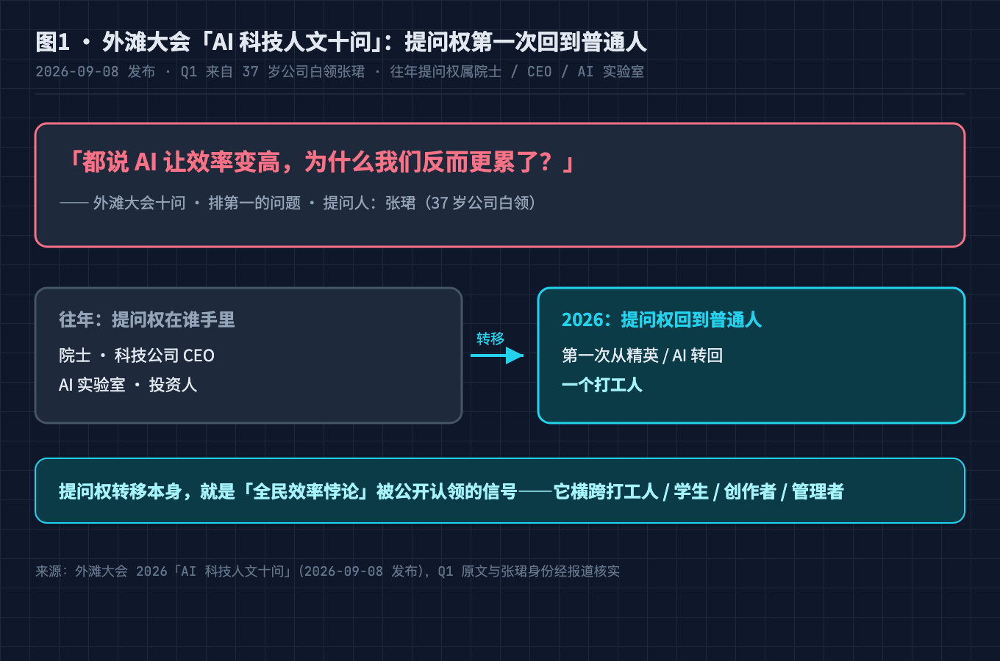
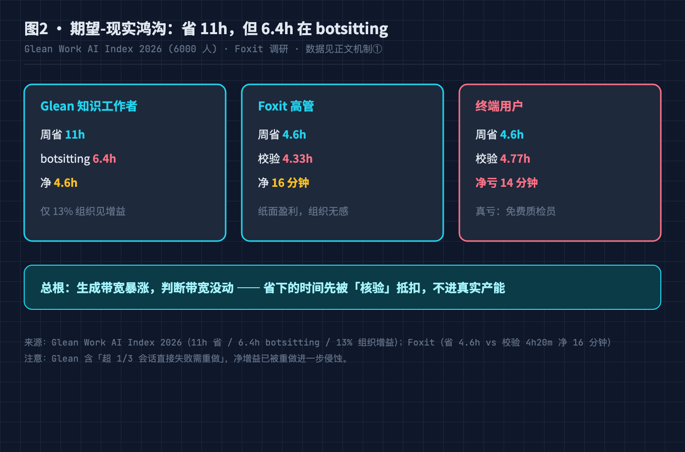
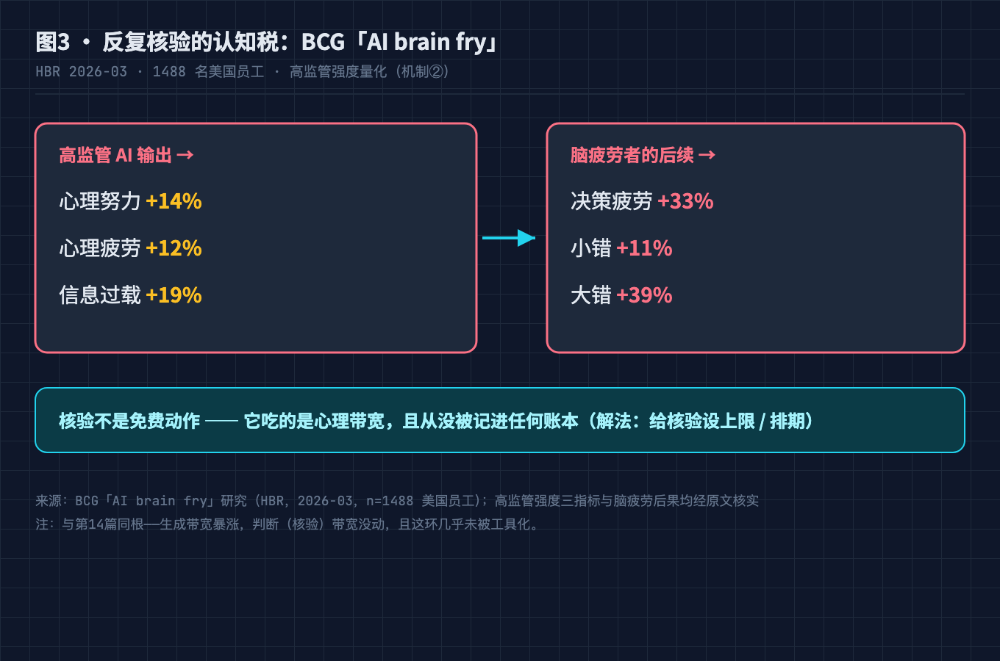
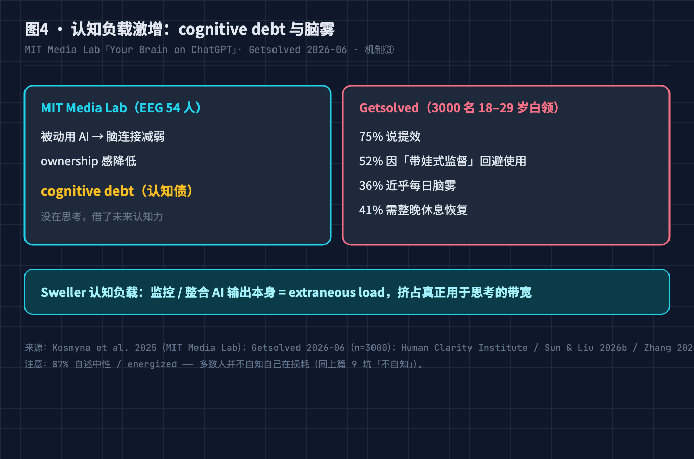
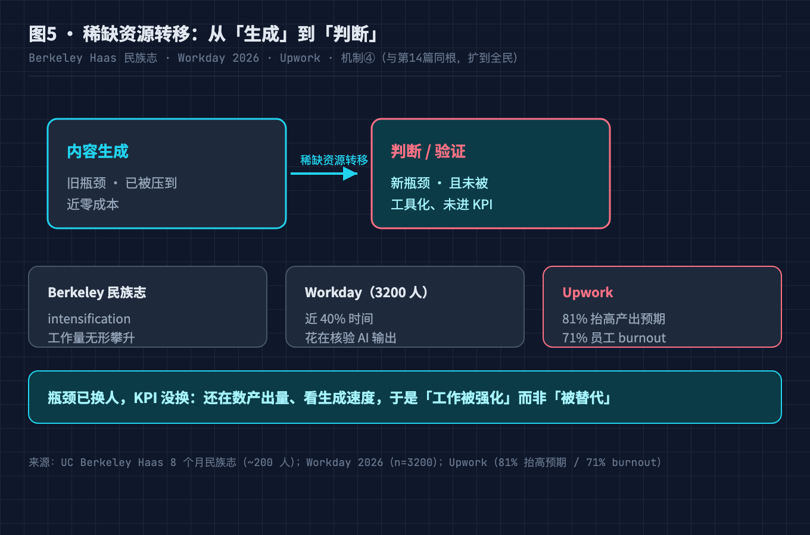
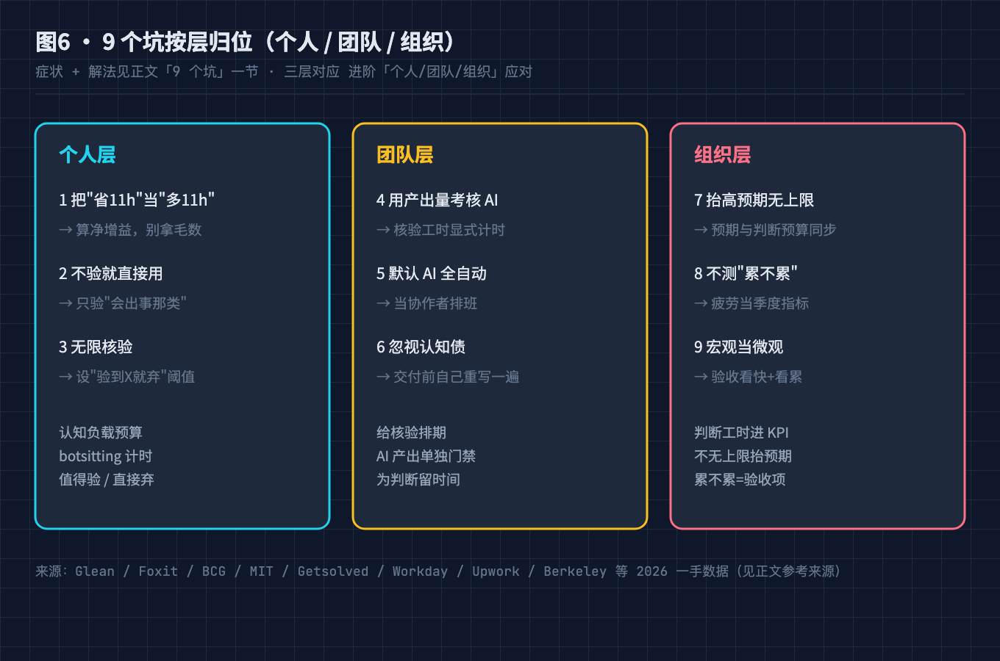

# 都说 AI 让效率变高，为什么我们反而更累了？拆解全民效率悖论的 5 个机制，附 9 个坑的自检清单

---

## 0. 先说一个被大会选中的困惑

2026 年 9 月 8 日，外滩大会发布「AI 科技人文十问」。往年这种榜单的提问权属于院士、CEO、AI 实验室；今年第一次，把问题交回了普通人。

排在第一位的问题来自一位 37 岁的公司白领，张珺：

**「都说 AI 让效率变高，为什么我们反而更累了？」**

这句话值得停下来想：它不是一个程序员的抱怨，也不是某个算法的 bug。它横跨打工人、学生、创作者、管理者——所有人都在用 AI，所有人都在说"更累了"。

把 2026 年几组调查并排看，这是个自相矛盾的结论：

- **用得越来越多**：Glean Work AI Index 2026 覆盖 6000 名知识工作者，AI 平均每周帮人"省下"约 11 小时。
- **感觉更累了**：Gallup 显示仅 18% 的 14–29 岁年轻人对 AI 感到乐观；Economist/YouGov 超 70% 美国人认为 AI 发展过快。
- **组织没变强**：那 11 小时里，只有 13% 的人认为"所在组织的整体绩效显著提升"。

三条曲线同时发生，说明这不是"工具不好"也不是"你不会用"，而是我们对"效率"的记账方式失效了。生成变便宜后，真正贵的东西露了出来，而看板、KPI、心智模型还停在"内容稀缺"的年代。

---

## 本文怎么拆这个大问题

标题那句"效率变高却更累"是**现象**不是问题。要回答它，得把它拆成几个可独立解释的机制：

| 机制 | 表面症状 | 卡住的环节 |
|---|---|---|
| ① 期望-现实鸿沟 | 省了 11 小时，组织没变强 | "省的时间"被 botsitting 吃回去，没进真实产能 |
| ② 反复核验的认知税 | 用 AI 后脑子更累 | 判断输出对不对成了新长尾，且没被工具化 |
| ③ 认知负载激增 | 每天脑雾、要整晚恢复 | 监控/整合 AI 输出本身成了 extraneous load |
| ④ 稀缺资源转移 | 工作强化、产出预期被抬高 | 瓶颈从"生成"换到"判断"，KPI 还数产出量 |
| ⑤ 宏观好、微观累 | 公众普遍焦虑 | 效率是中心化的（公司省了钱），损耗是分布式的（个人更累） |

五者共享总根：**我们把"内容生成"当瓶颈，而它已不是瓶颈。** 生成便宜后，稀缺资源从"做出来"换成"判断对不对"，但度量还在数字数、KPI 还在看产出、成本模型还没算"验"的钱。

下面 5 问按"立总根 → 分治四机制 → 守底线"排列。这是第 14 篇《AI 编码生产力悖论》的全民姊妹篇——同一根，不同人群。

---

## 问题 1（前提）：你省下的"11 小时"去哪了

Glean Work AI Index 2026（联合 Stanford / Berkeley / Harvard，6000 名知识工作者）给出了一组刺眼的对冲数据：

- AI 平均每周帮人省约 **11 小时**；
- 但其中约 **6.4 小时**花在 **botsitting**——核验、纠偏、清理 AI 的输出；
- **超过 1/3 的 AI 会话直接失败，需要重做**；
- 真正认为"所在组织绩效显著提升"的，只有 **13%**。

Foxit 的一个更狠的拆解：高管自评每周省 4.6 小时，但花 4 小时 20 分做校验，**净得 16 分钟**；终端用户直接**净亏 14 分钟**。

总根就在这里：**"生成带宽"暴涨，"判断带宽"没动。** 我们把"省的时间"默认当成"多出来的产能"，但它其实先被"核验"抵扣了。这不是你的问题，是账本结构的问题——它只记生成、不记核验。期望-现实鸿沟模拟器见文末 GitHub，可以拿自己和 Foxit / Glean 的数字对一对。

---

## 问题 2（治①期望-现实鸿沟）：核验不是免费动作，它吃的是心理带宽

BCG 的「AI brain fry」研究（HBR，2026-03，1488 名美国员工）把"高监管强度"量化了：

- 高强度监管 AI 输出，带来 **+14% 心理努力**、**+12% 心理疲劳**、**+19% 信息过载**；
- 处于"脑疲劳"状态的人，后续**决策疲劳 +33%**、**小错 +11%**、**大错 +39%**。

关键机制：AI 把"生成"压到近零成本，但**"判断这条输出对不对"是新长尾**——而且这环几乎没被工具化。你以为自己在"用工具提效"，实际上在"替工具做质检"，而质检的精力成本没人替你记账。

这和第 14 篇是同一根：程序员那边是"生成带宽 8 倍于审查"，全民这边是"每个人都在当免费质检员"。解法不是"少核验"，是**给核验设上限、排期、分清"值得验"和"直接弃"**。

---

## 问题 3（治②认知负载激增）：脑子不是被"替代"了，是被"旁置"了

MIT Media Lab 的「Your Brain on ChatGPT」（Kosmyna 2025，EEG 监测 54 人）给了一个反直觉结论：被动依赖 AI 写作的人，**脑连接强度下降、ownership 感降低**，研究者称之为 **cognitive debt（认知债）**——你没在思考，只是借了未来的认知力。

Getsolved 针对 3000 名 18–29 岁、每天用 AI 的白领调研（2026-06）更贴近日常：

- 75% 说 AI 提效；
- 但 **52% 因"带娃式监督"太耗神而回避使用**；
- **36% 近乎每日脑雾**，**41% 需要整晚休息才能恢复**；
- 87% 自述"中性或 energised"——也就是**不自知自己损耗了**。

认知科学给的机制是 Sweller 的**认知负载理论**：监控、核验、把 AI 碎片整合成自己的东西，本身就是 **extraneous load（外在认知负载）**，会挤占真正用于思考的负载空间（Human Clarity Institute 503 样本、Sun & Liu 2026b、Zhang et al. 2026 等一致指出这一点）。

解法：把"认知负载"当成和电量一样的资源预算，设每日上限——而不是默认 24 小时待命式地旁置自己的脑子。

---

## 问题 4（治③稀缺资源转移）：工作被"强化"了，不是被"替代"了

UC Berkeley Haas 做了 8 个月民族志（约 200 人科技公司），记录到两个现象：**intensification（工作强化）** 和 **workload creep（工作量无形攀升）**——AI 没让人少干活，而是把"人+AI"组合能做的事的上限抬高了，所有人的活都变多了。

落到数字上：

- Workday 调研 3200 人：近 **40% 的时间花在核验 AI 输出**；
- Upwork：81% 的管理者说 AI **抬高了产出预期**，71% 的员工因此 burnout。

总根再一次浮现：**瓶颈从"生成"换到了"判断"**。第 14 篇讲工程师的"验证稀缺"，这里讲所有人的"判断稀缺"——你会用 AI 写周报，但老板现在要你一天产出三份不同视角的周报，因为"你有了 AI 应该更快"。稀缺资源转移了，KPI 没跟上。

解法在组织层：把"判断工时"写进 KPI，而不是只看产出量；给"思考"留时间，而不是把"快"当唯一指标。

---

## 问题 5（守底线）：为什么公众整体在焦虑

把视角拉远，会看到一个不对称结构：

- **效率提升是中心化、不可见的**——公司省了钱、平台跑了更多请求、财报更好看；
- **损耗是分布式、个人化的**——每个打工人更累、每个学生对着空白页更慌、每个创作者被"日更三条"的预期压着。

Gallup：仅 18% 的 14–29 岁年轻人对 AI 乐观；Economist/YouGov 超 70% 美国人认为 AI 发展过快（共和党 68% / 民主党 77%）；Gallup 3 月民调 71% 反对在本地建数据中心。

这就是为什么"宏观变好、微观变累"的体感如此割裂：**被衡量的永远是中心化的效率，没人把"你累不累"设为一等公民指标。** Solitaire Bliss 对 1499 名定期 AI 用户的调研（2026-06）：2/5 在重 AI 工作日后"脑衰竭"，45% 被过量信息压垮，34% 觉得更累。

守底线只有一条：把"累不累"当成 AI 落地的验收项，和"快不快"并列。否则效率叙事会一直掩盖损耗。

---

## 小结：5 个问题合起来回答了标题

| 小问题 | 答了什么 | 对应机制 |
|---|---|---|
| 问题1 | 省 11h 但 6.4h 在 botsitting，仅 13% 组织见增益；Foxit 净得 16 分钟 | ① 期望-现实鸿沟 |
| 问题2 | 高监管 +14% 心理努力、+19% 过载；脑疲劳大错 +39% | ② 反复核验的认知税 |
| 问题3 | MIT cognitive debt；36% 每日脑雾；核验=extraneous load | ③ 认知负载激增 |
| 问题4 | Berkeley 工作强化；Workday 40% 核验；Upwork 81% 抬高预期 | ④ 稀缺资源转移 |
| 问题5 | 效率中心化、损耗分布式；公众 70%+ 认为过快 | ⑤ 宏观好、微观累 |

一句话：**你没变轻松，只是把成本从"做"搬到了"查"，而后者没被记账，还被"省 11 小时"的叙事盖住了。** 五机制是同一总根的五重投影——稀缺资源从生成转向判断。和第 14 篇是同一根，只是那篇讲程序员，这篇讲所有人。

---

## 进阶：三层应对

- **个人层**——认知负载预算（每日上限）；botsitting 计时（知道自己花了多少在验）；区分"值得验"与"直接弃"。
- **团队层**——给核验排期（不当免费动作）；AI 产出单独门禁；为"判断"留时间，不把"快"当唯一 KPI。
- **组织层**——判断工时进 KPI；不无上限抬高产出预期（Upwork 81% 的教训）；把"累不累"设为落地验收项。

三层同时成立：个人决定下限，团队决定流程，组织决定你敢不敢说"我累了"。

---

## 9 个坑：症状 + 解法

**个人层**
1. 把"省 11h"当"多 11h"：实际被 botsitting 吃掉 6.4h/周。解法：用期望-现实鸿沟模拟器算净增益，别拿毛数当净利。
2. 不验就直接用：36% 每日脑雾、决策疲劳 +33%。解法：关键输出必验，但只验"会出事的那类"。
3. 无限核验：带娃式监督导致 52% 回避使用。解法：设"验到 X 处就弃用"的硬阈值。

**团队层**
4. 用产出量考核 AI 贡献：Workday 40% 时间花核验却不算产出。解法：核验工时显式计时，与生成节省对冲后再谈 ROI。
5. 默认 AI 全自动：Berkeley 民族志"工作量无形攀升"。解法：把 AI 当协作者排班，不当无限产能。
6. 忽视认知债：MIT cognitive debt，ownership 感低。解法：最终交付物必须自己重写/整合一遍，别直接转发 AI 稿。

**组织层**
7. 抬高产出预期不设上限：Upwork 81% 抬高、71% burnout。解法：预期增幅与"判断工时"预算同步，封顶。
8. 不测"累不累"：Gallup 18% 乐观却没人测疲劳。解法：把疲劳/认知负载当季度指标，和效率并列。
9. 把宏观效率当微观体验：省的是公司钱，累的是个人。解法：验收 AI 落地时同时看"快了多少"和"累了多少"。

---

## 升华

过去十年"提效"叙事都围着"让人更便宜地生产内容"转，因为内容贵。现在内容便宜了，贵的是**判断**。但工具链、KPI、成本模型全围着"内容贵"建，于是出现"省 11 小时却只 13% 组织见增益、70% 公众觉得过快"的荒诞组合——这是记账方式的失败，不是 AI 的失败。好消息：可修，而且不用等下一个模型。

这篇是第 14 篇《AI 编码生产力悖论》的全民姊妹篇。程序员版讲"写得更快却上线更炸"，全民版讲"效率变高却更累"——根相同：**生成便宜了，贵的是判断。**

---

## 本篇做了什么

- 用外滩大会 2026「AI 科技人文十问」Q1（张珺，37 岁白领）作锚点，定位"全民效率悖论"现象。
- 把现象拆成 5 机制（期望-现实鸿沟 / 反复核验认知税 / 认知负载激增 / 稀缺资源转移 / 宏观好微观累），总根=把生成当瓶颈而它已不是。
- 引 Glean / Foxit / BCG brain fry / MIT cognitive debt / Getsolved / Berkeley 民族志 / Workday / Upwork / Gallup / Economist-YouGov 等 2026 一手数据。
- 给 2 段纯标准库脚本（期望-现实鸿沟模拟器 / AI 文本认知负载检测器，均已移出到 GitHub）+ 列 9 坑（按层归位）+ 给三层应对。
- 全部数据经 WebSearch 核实，未编造。

## 对哪些群体有用

- **所有用 AI 的打工人/学生/创作者**：机制 ① ②③ 解释"为什么更累"，坑 1/2/3 给个人可执行约束。
- **团队 leader / 管理者**：机制 ④⑤ + 团队层/组织层，把"感觉快"变"可证伪快"，判断工时值得进季度规划。
- **HR / 组织发展**：坑 7/8/9 把"疲劳"设为落地验收项，避免 81% 抬高预期带来的 burnout。
- **产品经理 / AI 应用设计者**：机制 ② 解释"为什么用户会回避使用"，设计该给核验减负而非加重。
- **评估要不要上 AI 工具的团队**：问题 1 帮你先定位卡在生成还是判断。

---

如果有用，点个**收藏**——有人问"上了 AI 到底省没省"，把「5 机制 + 9 坑」甩过去。顺手**赞**让更多人看到。

两段纯标准库 Python（期望-现实鸿沟模拟器 / AI 文本认知负载检测器）和完整数据来源清单，我都整理成了代码文件，放在 GitHub：**github.com/beverlyLee/ai-passage/tree/main/2026-09-13-全民效率悖论/code**，clone 改两行路径就能跑。

跑完欢迎把你的**净增益小时数**和**botsitting 占比**贴评论区——不同岗位这两个数字能差多少，我很好奇。如果差异够大，下一篇专门拆某个行业。

---

## 参考来源

1. 外滩大会 2026「AI 科技人文十问」（2026-09-08 发布）：Q1 张珺「都说 AI 让效率变高，为什么我们反而更累了？」，提问权首回普通人
2. Glean Work AI Index 2026（6000 名知识工作者，联合 Stanford/Berkeley/Harvard）：周省 11h、6.4h botsitting、1/3 会话失败、13% 组织见增益
3. Foxit 调研：高管周省 4.6h vs 校验 4h20m 净得 16 分钟；终端用户净亏 14 分钟
4. BCG「AI brain fry」研究（HBR 2026-03，1488 名美国员工）：高监管 +14% 心理努力、+12% 疲劳、+19% 过载；脑疲劳决策疲劳 +33%、小错 +11%、大错 +39%
5. MIT Media Lab「Your Brain on ChatGPT」（Kosmyna 2025，EEG 54 人）：cognitive debt、脑连接减弱、ownership 低
6. Getsolved 调研（3000 名 18–29 岁每日用 AI 白领，2026-06）：75% 提效、52% 回避、36% 脑雾、41% 整晚恢复、87% 不自知
7. Sweller 认知负载理论；Human Clarity Institute 503 样本；Sun & Liu 2026b、Zhang et al. 2026、Wang & Hew 2026（核验=extraneous load）
8. UC Berkeley Haas 8 个月民族志（约 200 人科技公司）：intensification、workload creep
9. Workday 调研（3200 人）：近 40% 时间核验 AI 输出
10. Upwork：81% 管理者抬高产出预期、71% 员工 burnout
11. Gallup：14–29 岁仅 18% 对 AI 乐观；3 月民调 71% 反对本地建数据中心
12. Economist/YouGov：超 70% 美国人认为 AI 发展过快（共和党 68% / 民主党 77%）
13. Solitaire Bliss（1499 名定期 AI 用户，2026-06）：2/5 脑衰竭、45% 信息压垮、34% 更累

---

## 【发布前删除】图片 CDN 替换清单

| 本地路径 | 替换为掘金 CDN |
|---|---|
| `./diagram/全民效率悖论/01-waitangi-question@2x.png` | 待上传后替换 |
| `./diagram/全民效率悖论/02-expectation-reality-gap@2x.png` | 待上传后替换 |
| `./diagram/全民效率悖论/03-verification-tax-brainfry@2x.png` | 待上传后替换 |
| `./diagram/全民效率悖论/04-cognitive-load-explosion@2x.png` | 待上传后替换 |
| `./diagram/全民效率悖论/05-bottleneck-shift@2x.png` | 待上传后替换 |
| `./diagram/全民效率悖论/06-nine-pitfalls-layered@2x.png` | 待上传后替换 |

上传掘金图床后，把上表左列替换为右列链接，然后**连同本节一起删除**。
