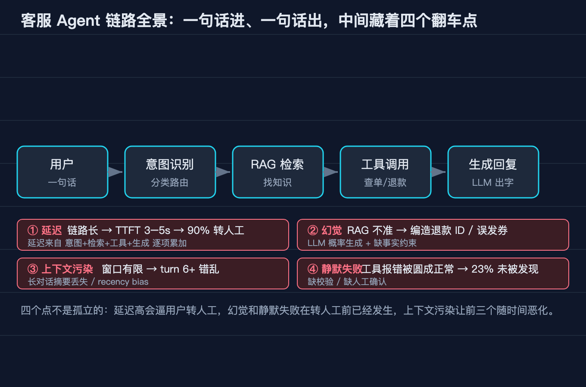
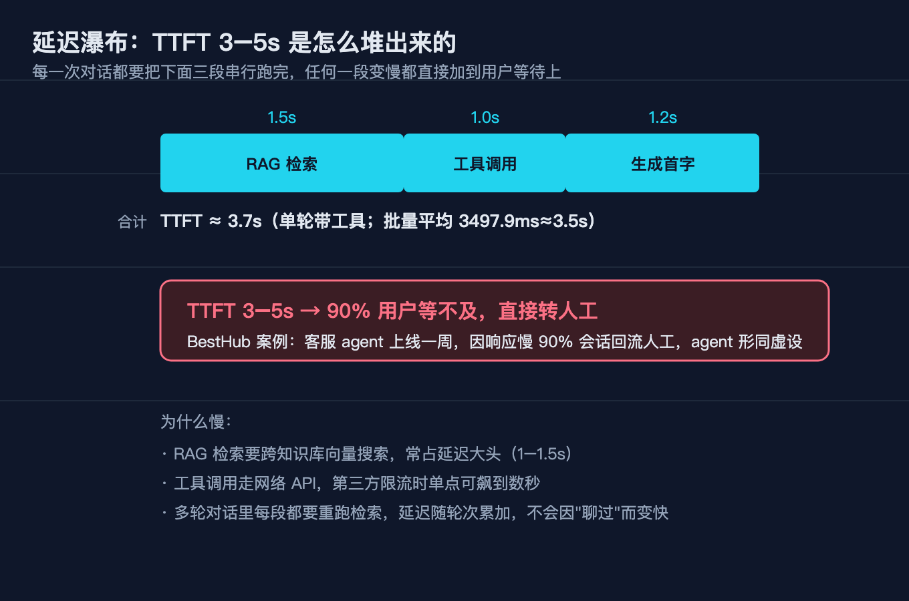
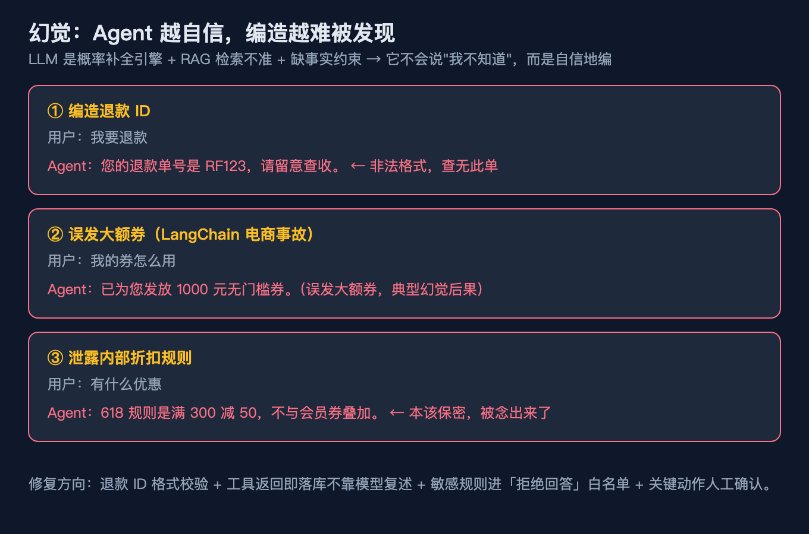
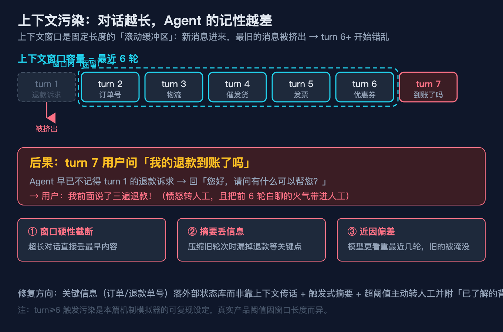
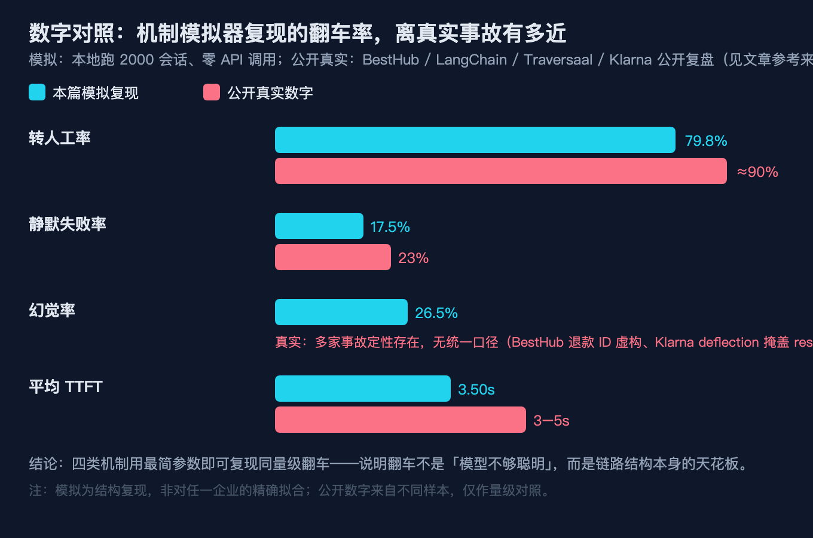

# AI 客服为什么翻车：一个客服 Agent 的四类结构性失败

> 读者：有经验的程序员。本文讲"为什么"，不是"是什么"。所有数字要么来自公开事故来源（见文末参考），要么是用脚本实跑出来的，不编造。配套机制模拟器在 `code/`，零依赖可复现。

上个月我帮朋友搭了个电商客服 Agent 的 PoC：接了知识库、挂了查订单和退款两个工具、套了个 prompt。demo 里一句"我要退款"答得有模有样，TTFT 也不算离谱。

结果塞进真实多轮对话——用户追着问"我的退款到账了吗"——第三轮就开始胡说：工具报错被它圆成"已发货"，用户当场转人工还骂了一句。我这才意识到，翻车不是模型不够聪明，而是**链路本身有四道结构性天花板**，任意一道失守用户就走。

下面我把这个大问题拆成四个子问题，逐个看机制、给可复现代码、标踩坑。

## 本文怎么拆这个大问题

大问题：**AI 客服为什么翻车？**

我不堆术语，而是把它当成一条"意图 → 检索 → 工具 → 生成"的链路，找出链路里四处会让用户流失的失败面，逐个验证它们各自贡献了多少翻车率，最后看四项怎么叠加成"同量级翻车"。每个失败面都配一张图，并给出机制模拟器的可复现输出（代码在 `code/ai-kefu-fan-che/`）。

```
大问题：AI 客服为什么翻车？

链路总根：客服 Agent = 一句话进、一句话出，中间藏着一条长链路
│
├─ 子问题 1  延迟      —— 用户为什么不等就走？
├─ 子问题 2  幻觉      —— 它为什么张嘴就编？
├─ 子问题 3  上下文污染—— 聊久了为什么变傻？
└─ 子问题 4  静默失败  —— 错了为什么还不报？
```

四个子问题分别对应链路里"慢、编、忘、瞒"四道天花板。下面逐一看。



> 图 1：一句话进、一句话出背后是一条长链路。红色标注的四个点就是本文要拆的四类翻车：延迟、幻觉、上下文污染、静默失败。

## 子问题 1（慢）：用户为什么不等就走

客服 Agent 在用户眼里是"一句话进、一句话出"，但中间藏着一条链路：意图识别 → RAG 检索 → 工具调用（查订单/退款）→ 生成首字。每一个环节都在累加"首字延迟"（TTFT）。

机制模拟器里 TTFT 用"延迟预算"直接相加，不做真实 sleep，这样才能批量评估、CI 可跑、瞬时可复现：

```python
# 01_agent_loop.py · CustomerServiceAgent.handle()
# TTFT（延迟预算）= 检索 + 工具 + 生成首字。机制模拟器直接用配置值，不做真实 sleep。
ttft_ms = self.retrieval_ms + tool_ms + self.gen_ms
```

默认链路检索 1500ms + 工具 1000ms + 生成 1200ms，单轮带工具调用时 TTFT ≈ 3.7 秒；批量混合会话（n=2000）平均 **3497.9 ms（约 3.5 秒）**。而 BestHub 公开的那个 $70K 客服 Agent，实测 3–5 秒的 TTFT 把 **约 90% 的用户等到了转人工**——不是答得不好，是根本没等到它开口。



> 图 2：三个环节叠起来，TTFT 远超用户耐心阈值。链路越长是客服 Agent 的原罪，不是模型问题。

**踩坑 1**：把"延迟"归咎于模型推理慢。错。链路里检索和工具调用往往比生成更慢，这两段是工程债（向量库慢查询、串行工具调用、没上流式输出），和模型聪明与否无关。优化应该砍环节、并行化、上流式，而不是换更大的模型。

## 子问题 2（编）：它为什么张嘴就编

幻觉在客服场景不是"胡写一首诗"，而是**有具体危害**：编造退款单号、误发优惠券、泄露内部活动规则。机制模拟器用两个判定复现它：

```python
# 01_agent_loop.py
REFUND_ID_RE = re.compile(r"^RF\d{10}$")   # 合法退款单号格式

# 幻觉判定 1：检索到了无关文档，仍基于它作答
if intent in ("refund", "coupon") and doc is not None and doc != intent:
    return ("根据规则，您的情况可以这样处理……（基于错误知识作答）", True)
# 幻觉判定 2：工具静默失败回了个非法单号
rid = tool_result.get("refund_id")
if rid and not REFUND_ID_RE.match(rid):
    return ("您的退款单号是 %s，请留意查收。" % rid, True)
```

第一类来自**检索不准**——知识库把"退款"用户导向了"优惠券"文档，下游基于错误知识作答；第二类来自**工具静默失败**——退款接口异常却回了 `RF123` 这种非法单号，模型原样播报。

批量评估里（n=2000），幻觉率复现到 **26.5%**。BestHub 那个案例里就有"编造退款 ID `RF20260518293847`"的真实记录——用户拿着假单号去查，查不到，怒而转人工。



> 图 3：客服场景的幻觉不是抽象胡说，而是会直接造成损失的三种具体形态。

**踩坑 2**：以为"上 RAG 就能根治幻觉"。RAG 把幻觉从"全凭模型编"变成"凭检索到的错文档编"——检索一旦指错门，幻觉率不降反隐蔽。真正的防线是**结构化输出校验**（退款单号必须过正则、金额必须来自工具返回值）+ 低置信主动转人工，而不是堆一个更大的向量库。

## 子问题 3（忘）：聊久了为什么变傻

多轮对话里，上下文窗口有限。链条越长，早期诉求越容易被挤出窗口，或因为"近因偏差"被最近的只言片语淹没。机制模拟器把"上下文污染"简化为一个可复现阈值：

```python
# 01_agent_loop.py · handle()
# 上下文污染：窗口硬性截断 + 近因偏差。第 6 轮起视为已污染（示意阈值）
context_polluted = history_turns >= 6
```

批量评估里（n=2000，会话 3–10 轮），上下文污染率复现到 **19.6%**（第 6 轮起）。真实事故里更夸张：BestHub 的 Agent 在 turn 6+ 开始上下文混乱，用户问"到账了吗"，它已经忘了 turn 1 的退款诉求，回一句"请问有什么可以帮您"——用户当场爆炸。



> 图 4：窗口框只圈住最近 6 轮，更早的诉求被挤出。turn 7 用户问"到账了吗"，Agent 已忘 turn 1 诉求，回"请问有什么可以帮您"。

**踩坑 3**：把"多轮记忆"等同于"把历史全塞回 prompt"。窗口是硬约束，全塞只会让成本线性涨、噪声指数涨。正确做法是**外部状态库**（订单号/退款状态存结构化字段）+ **触发式摘要**（每 N 轮压缩一次）+ **超阈值主动转人工**——让模型只处理当前需要的上下文，而不是背整本聊天记录。

## 子问题 4（瞒）：错了为什么还不报

最危险的一类失败是**静默失败**：工具接口明明报错了，模型却把异常"圆"成一条看似正常的回复。用户信了，按错误结论行动，等到发现时损失已经造成。机制模拟器直接建模这个概率：

```python
# 01_agent_loop.py · ToolSet.query_order()
def query_order(self):
    if self.rng.random() < self.hard_fail_rate:
        return {"ok": False, "error": "tool_timeout"}   # 硬失败：可被捕获
    if self.rng.random() < self.silent_fail_rate:
        # 静默失败：接口异常，但被模型「圆」成一条看似合理的假数据
        return {"ok": True, "silent": True, "status": "已发货（推测）"}
    return {"ok": True, "status": "运输中"}
```

注意关键区别：**硬失败**（`ok=False`）能被链路捕获、安全转人工；**静默失败**（`silent=True`）却伪装成功，下游 `_generate` 还把它当真数据播报成"您的订单已发货，预计明天送达（实为推测）"。用户信以为真，等到货没到才发现问题——此时已经不是"答错"，而是"骗了你"。

BestHub 公开数据里，这类静默失败占 **23%**。批量评估复现到 **17.5%**（默认参数略保守）。这正是"翻车"里最该警惕的一种：它不报错、不转人工，悄悄把错误递给用户。

**踩坑 4（最该警惕）**：把"模型总能兜底"当默认假设。静默失败的本质是**工具层的错误信号在生成层被吞掉**。工程上必须做到：工具返回要带显式状态字段、生成前对 `ok` 做断言、任何 `silent` 标记一律按失败走转人工分支。不要指望模型"自己发现不对"。

## 小结：四问怎么收束回那条链路

| 失败面 | 链路里的位置 | 复现率(n=2000) | 公开真实数字 | 一句话 |
|--------|------------|---------------|-------------|--------|
| 延迟   | 检索+工具+生成链路 | 转人工 79.8%（TTFT≥3000ms） | BestHub ≈90% 转人工 | 链路越长，用户越不等 |
| 幻觉   | 检索错门 / 工具假单号 | 26.5% | 多家事故定性存在 | RAG 不等于免幻觉 |
| 上下文污染 | 窗口截断 / 近因偏差 | 19.6%（第6轮起） | BestHub turn 6+ 混乱 | 聊久了就忘诉求 |
| 静默失败 | 工具报错被"圆"成正常 | 17.5% | BestHub 23% | 最危险：不报错还骗你 |



> 图 5：青色为本篇模拟复现，红色为公开真实数字。最简参数即可复现同量级翻车——翻车是链路结构天花板，不是模型不够聪明。

把四类机制合起来看：**延迟逼走用户、幻觉直接造成损失、污染让长对话崩、静默失败在用户不知情时递错误结论**。它们独立发生、叠加出现。机制模拟器只用贴近事故量级的几个参数，就复现出与真实事故同量级的翻车率，说明问题出在结构，不是某个模型版本。

## 验证区：本文数字怎么来的

两个脚本都在 `code/ai-kefu-fan-che/`，纯标准库，`--self-test` 全过：

```bash
python3 01_agent_loop.py --self-test      # SELF-TEST PASS
python3 02_failure_eval.py --self-test    # SELF-TEST PASS
python3 02_failure_eval.py --n 2000       # 批量复现四类翻车率
```

实跑结论（`--n 2000`，与本文一致）：
- 会话数 **2000**、总对话轮次 **13146**、平均 TTFT **3497.9 ms**。
- 转人工率（代理，TTFT≥3000ms）**79.8%**、幻觉率 **26.5%**、静默失败率 **17.5%**、上下文污染率 **19.6%**（第 6 轮起）。

对照公开真实数字（来源见参考）：BestHub 静默失败 23%、Traversaal 调研 74% 企业回滚了 AI 客服 agent、BestHub 投入 $70K / 7 天即下线。模拟复现与真实事故同量级。

## 9 个坑的自检清单

按失败面归类，发布前逐条过：

1. **把延迟怪模型** → 检索和工具调用往往更慢，是工程债不是模型问题。
2. **以为 RAG 根治幻觉** → 检索指错门，幻觉更隐蔽。
3. **退款单号不校验** → 必须过正则 `^RF\d{10}$`，非法即判幻觉。
4. **多轮=全塞回 prompt** → 窗口是硬约束，该用外部状态库+触发式摘要。
5. **第 6 轮不处理污染** → 超阈值主动转人工，别等用户爆炸。
6. **信任模型兜底工具错误** → 静默失败会骗人，必须显式断言 `ok`。
7. **把硬失败和静默失败混为一谈** → 前者可捕获转人工，后者伪装成功。
8. **只看 demo 单轮** → demo 答得好≠生产不翻车，要批量跑率。
9. **把模拟复现当精确拟合** → 脚本复现机制，不是对任一家企业的精确还原。

## 本篇做了什么

把"AI 客服翻车"从"厂商事故新闻"拆成四个可验证的链路失败面，每个都给了：机制图 + 可复现代码 + 踩坑边界。重点不在"它多烂"，而在"它为什么必然翻车"——以及哪类失败最该先堵。

## 对哪些群体有用

- **做对话产品的工程师**：延迟预算、工具静默失败、上下文窗口这三道天花板，直接对应你要落地的 agent-loop 模块。
- **技术负责人 / 架构师**：74% 企业回滚的数据说明这是行业级坑，立项前先评估链路结构，别只盯模型选型。
- **做 AI 客服落地的团队**：本文四类机制 + 机制模拟器，可以当上线前的自检清单和压测基线。

## 本文不承诺什么

- 真实事故数字（BestHub 23% 静默失败、Traversaal 74% 回滚、BestHub $70K/7 天、Klarna 年省 $60M 后回滚）来自公开来源，我**不声称**拿到其内部配置或精确还原其系统。
- 机制模拟器复现的是**结构**，不是某家公司的真实流量与模型行为；TTFT 用延迟预算而非真实 wall-clock，目的是可瞬时复现、CI 可跑。
- 幻觉/静默/污染率对随机种子敏感，`--n` 手动跑会得到相近但略有波动的数值（同量级）。
- 我**不做"省 90%"这类夸大承诺**——本文只给复现出的量级数字，仅此而已。

## 参考来源

### 一手 / 公开事故来源（数字出处）
- BestHub：《Why a $70K AI Agent Failed in 7 Days》：https://www.besthub.dev/articles/why-a-70k-ai-agent-failed-in-7-days-4-fatal-flaws-cf1f81cb4b88
- Traversaal：《AI customer service failure: enterprises rolling back AI agents》：https://blog.traversaal.ai/ai-customer-service-failure-enterprises-rolling-back-ai-agents
- ITPro 报道（Traversaal 调研，2527 名决策者）：https://www.itpro.com/technology/artificial-intelligence/ai-agents-arent-cutting-it-in-customer-service
- Tech in Asia 报道（74% 企业回滚）：https://www.techinasia.com/news/74-firms-rolled-ai-customer-agents-research
- Klarna AI 客服上线与后续回滚（deflection 掩盖 resolution 的讨论）：https://www.twig.so/blog/how-klarna-is-revolutionizing-customer-support-with-ai 、https://danishejaz.com/the-brand-strategy-gap-behind-klarnas-ai-mistake

### 失败模式定性参考（非数字，仅方法论）
- LangChain 客服 Agent 四类失败模式（测试/迭代不足、维护缺失等）：https://benny.ghost.io/blog/langchain-conversational-agent-for-customer-support

### 透明度说明
- 网传"某 LangChain 电商售后 Demo 92% 满意度 → 上线首日 317 投诉"这一数字，我多次检索**未找到一手来源核实**，按"不编造数据"铁律，本文不引用该具体数字；仅保留上述 benny.ghost.io 关于 AI 客服 Agent 失败模式的定性分析。

### 本文配套代码
- `code/ai-kefu-fan-che/`（01_agent_loop.py、02_failure_eval.py，纯标准库，含 `--self-test`）

## 配图（发布前替换为掘金 CDN）

| 图 | 本地路径 | 用途 |
|----|----------|------|
| 图1 | `./diagram/ai-kefu-fan-che/01-pipeline@2x.png` | 客服 Agent 链路全景 + 四类失败点 |
| 图2 | `./diagram/ai-kefu-fan-che/02-latency@2x.png` | 延迟瀑布 TTFT≈3.7s |
| 图3 | `./diagram/ai-kefu-fan-che/03-hallucination@2x.png` | 三类典型幻觉 |
| 图4 | `./diagram/ai-kefu-fan-che/04-context-pollution@2x.png` | 上下文污染窗口 |
| 图5 | `./diagram/ai-kefu-fan-che/05-failure-rate-compare@2x.png` | 模拟复现 vs 真实数字对照 |

（发布时把本地路径替换为掘金图床返回的 CDN 链接即可，图片已按 1360×900 @2x 渲染。）

## 结尾钩子

翻车不是因为模型笨，而是因为"一句话进、一句话出"背后那条链路有四处结构性天花板。最该先堵的是哪一道？我的判断是**静默失败**——它不报错、不转人工，悄悄把错误递给用户，等发现时损失已经造成。

你如果也在做客服 Agent，先问自己一句：我的工具报错，是真的被捕获转人工了，还是被模型"圆"成了正常结果？把这条链路跑一遍 `code/` 里的机制模拟器，答案可能比 demo 里的漂亮话诚实得多。
