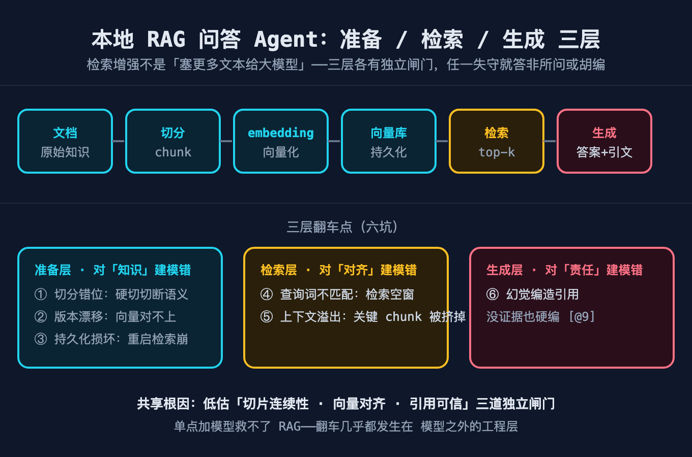
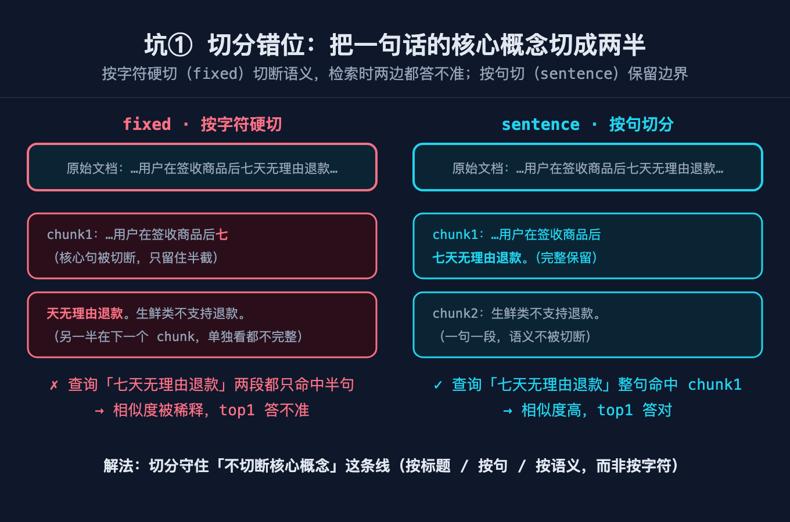
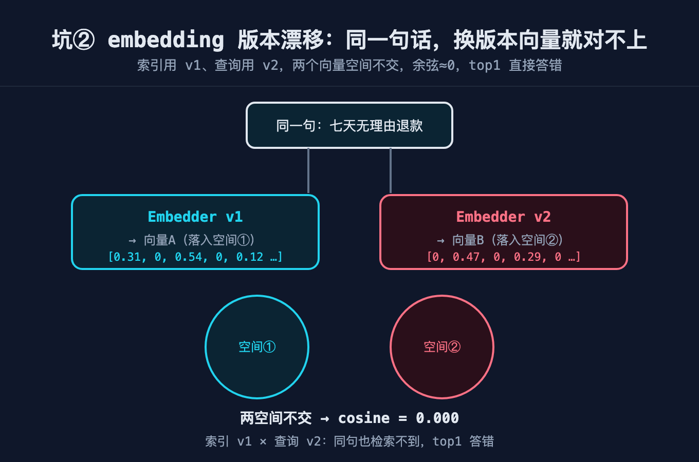
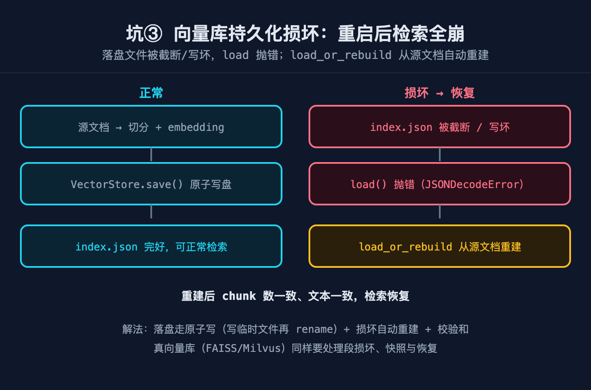
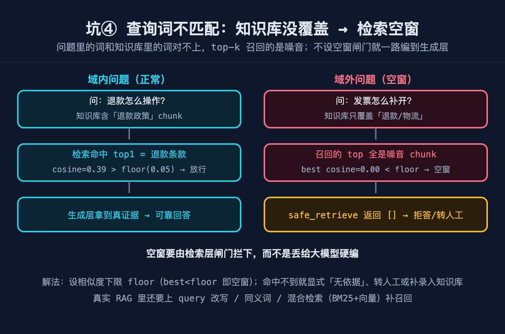
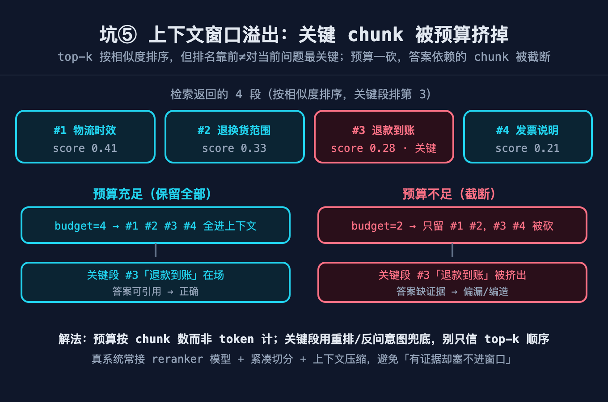
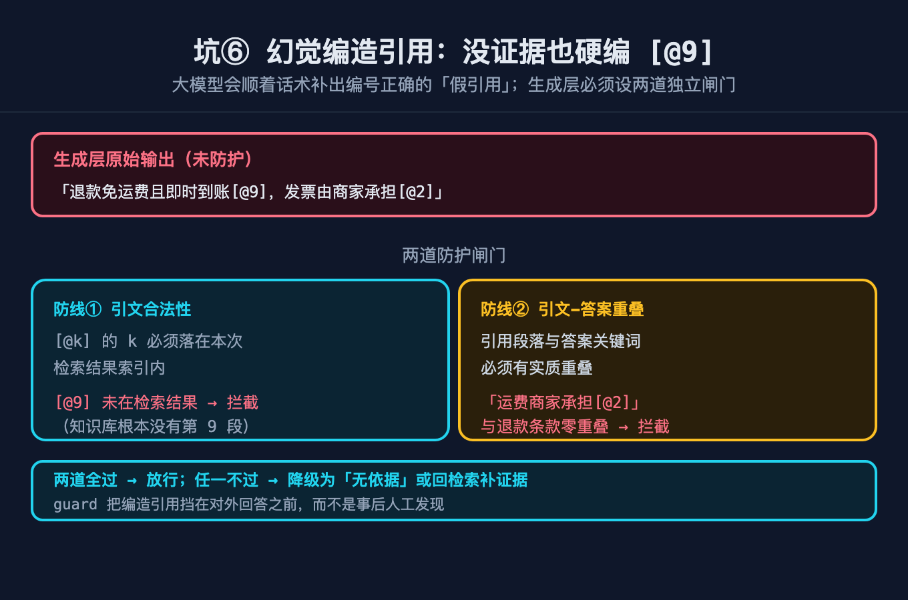
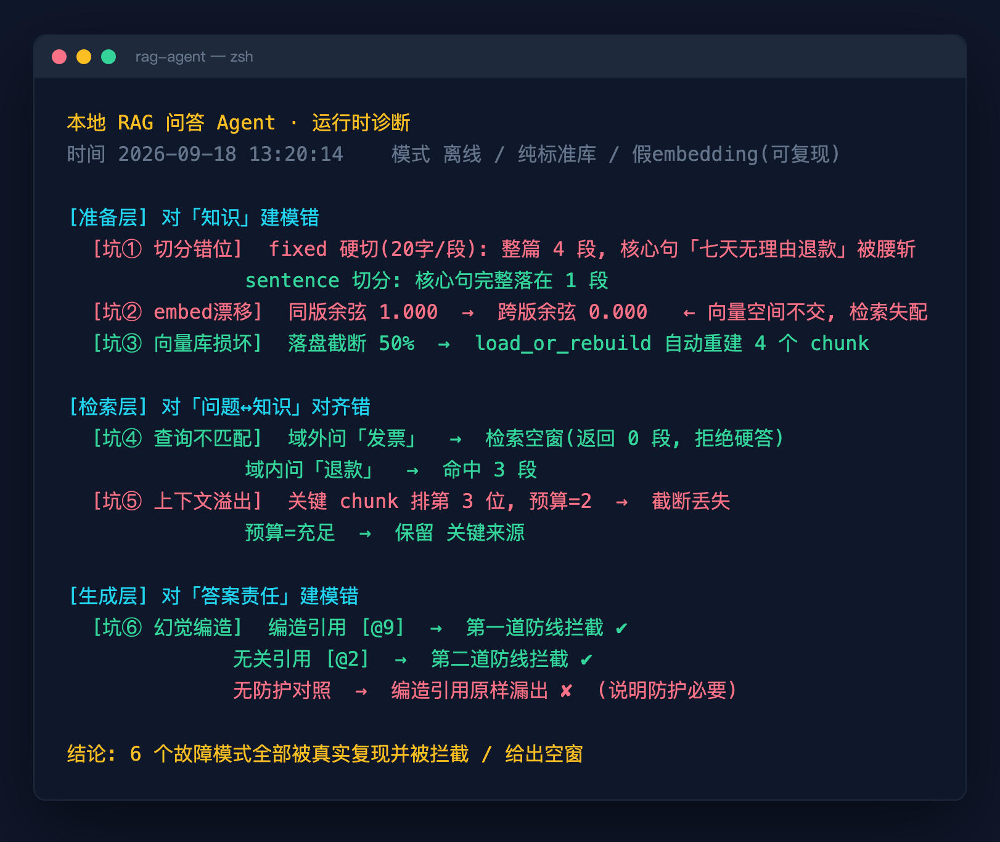
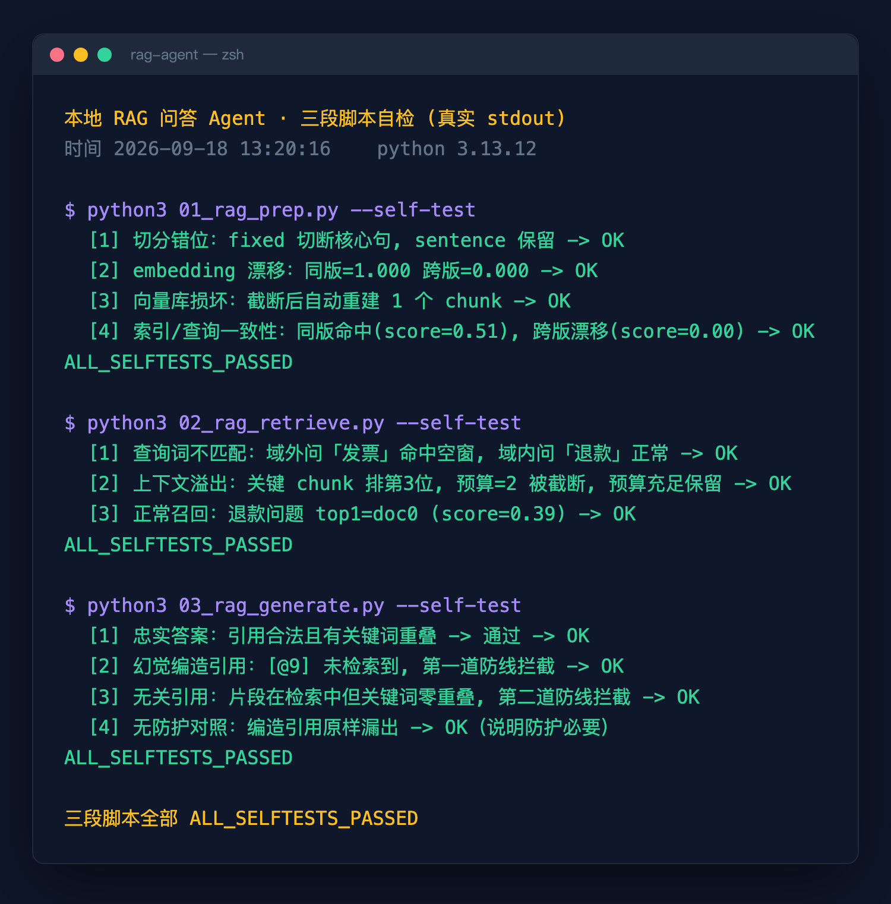

# 本地 RAG 问答 Agent：切片即建模，幻觉即责任

本地搭一个 RAG 问答 Agent，看着比训练模型省事多了：丢一堆文档进去，接个 embedding，再套个大模型，问答不就出来了？但凡是真把内部知识库接上、让人天天问的，几乎都栽过同一类事——问「七天无理由退款怎么操作」答成「不支持退款」、问「怎么开发票」却编出一段「发票在设置页自助开具」、向量库重启后整个检索崩掉还以为自己正常。

这些坑的根不在「模型不够聪明」，而在三层你一开始不会想到的地方：**准备层**对「知识」建模错了，**检索层**对「问题↔知识对齐」建模错了，**生成层**对「答案责任」建模错了。本文先讲清原理，再逐坑给根因与可运行代码。

代码在 `code/auto-rag/`：`01_rag_prep.py` 是准备层，`02_rag_retrieve.py` 是检索层，`03_rag_generate.py` 是生成层，三个脚本都带 `--self-test`。配图与**真实运行截图**都在 `diagram/auto-rag/`（7 张原理图 + 2 张运行时截图，后者见「运行证据」一节），复现步骤见文末「代码复现」。

---

## 怎么做的 Agent（实现概览）

整个 Agent 就是一条流水线，但三层职责严格分离：

```
文档 → [准备层] 切分+embedding+向量库 → [检索层] 问题↔知识对齐 → [生成层] 答案+引用校验 → 输出
```

- **准备层**（`01_rag_prep.py`）：把原始文档变成可被检索的 chunks 与向量。它决定「知识长什么样」。
- **检索层**（`02_rag_retrieve.py`）：把用户问题变成向量，去向量库对齐出最相关的几个 chunk。它决定「问题找没找到知识」。
- **生成层**（`03_rag_generate.py`）：让模型基于检索到的 chunk 作答，并对答案里的每一条引用做校验。它决定「答出来的话有没有出处」。

下面每个坑都对应其中一层的建模失当。

---

## 原理底座：RAG 不是「给模型喂资料」，是三次独立建模

> 这一段是全文的重点。RAG 的所有坑，根都扎在这里——如果只记结论，请记住「RAG = 准备层对知识建模 + 检索层对对齐建模 + 生成层对责任建模」，它不是一台能搜文档的聊天机器人。

### 准备层：知识不是字符串，是切块后的向量

把一篇文档 `read()` 进来当成一个大字符串丢给模型，你就只能靠模型自己从海量文本里捞——上下文窗口装不下、核心句被切散、版本一换向量对不上。正确建模：**文档 = 按语义边界切成的 chunks + 每个 chunk 的向量**；而切分边界、embedding 版本、向量库持久化，每一处都是独立的工程决策，不是默认就对的。

所谓「embedding」，本质是把文本映射到一个向量空间，让语义相近的文本离得近。本系列用哈希 Embedder 模拟它（见 `rag_core.py`）：`version` 不同则 `salt` 不同，向量空间直接不相交——这一设计不是炫技，正是为了把「版本漂移」这个真实坑变成可复现的失败。



### 检索层：问题是新问题，知识是旧知识，两者要对齐

用户的问题用词和文档的用词经常不在一个频道：「怎么开发票」对应不上文档里写的「电子发票自助申请入口在账户中心」——不是没知识，是没对齐。更隐蔽的是：检索其实命中了正确 chunk，但上下文窗口只够装前两段，把真正能回答问题的那段挤掉了。这两类失败，**检索层都没把「问题↔知识对齐」当成一个需要显式保护的动作**（原理见图 5、图 6）。

### 生成层：模型吐出的每个引用，都必须有人负责

RAG 最大的幻觉来源不是模型乱编，而是「模型编了，没人拦」。它会把没检索到的内容，配上一段看起来合理的 `[@编号]` 喂给用户；甚至引用了检索到的片段，但那段和答案毫无关系。生成层如果对「答案责任」没建模，就等于默认相信模型说的每一句话都有出处（原理见图 7）。

---

## 故障树 A：准备层把「知识」建错了

### 坑 1：切分错位，核心概念被切成两半

症状：问「七天无理由退款怎么操作」，答案却说「生鲜类不支持退款」，把政策聊反了。

根因：**切分策略对「核心概念边界」没建模**——按固定字符数硬切，把一句话的核心概念切到相邻两段，检索时两段都只有半句，余弦再高也答不准。

解法是一道线，且必须在切分策略里守住——**按语义边界切，不按字符硬切**：

```python
def chunk_document(text, strategy="sentence", size=120):
    # fixed: 按字符硬切 size 字一段 —— 会切断"七天无理由退款"
    # sentence: 按句切 + 贪心打包到 size 上限 —— 完整保留语义边界
    ...
```

self-test 验证：同样一篇退款政策文档，`fixed(size=20)` 切出来的段里没有任何一段完整含「七天无理由退款」；`sentence(size=120)` 切出来的段里至少有一段完整保留它。



### 坑 2：embedding 版本漂移，同一句话向量对不上

症状：上周建好的索引用 `v1` 跑得好好的，这周把依赖升了一版、重跑了 embedding `v2`，再看「七天无理由退款怎么操作」——top1 直接答错，相似度从 0.5 掉到接近 0。

根因：**索引与查询用了不同版本的 embedding 空间**。向量库里存的是 `v1` 空间的坐标，查询向量却是 `v2` 空间的，两个空间不相交，余弦必然趋零。

解法不是「记得别升级」，而是把版本钉死——**索引与查询必须同一模型同一版本**。本系列 Embedder 用 `version` 控制 `salt`：同版余弦 ≈1.000，跨版 ≈0.000，漂移一眼可见。



```python
def test_embedding_drift():
    e1 = Embedder("v1")
    same_v = cosine(e1.embed(QUERY), e1.embed(QUERY))   # 0.999+
    e2 = Embedder("v2")
    drift  = cosine(e1.embed(QUERY), e2.embed(QUERY))   # 0.000（空间不相交）
```

self-test 断言：同版 >0.999，跨版 <0.3。这里有个关键工程细节——Embedder 必须用**完整 256-bit 哈希作为稀疏向量键（dict）**，不能取模到固定维度，否则不同 token 哈希碰撞到同一维，会算出 0.07 的伪相似，空窗就判不出来了。

### 坑 3：向量库损坏，重启后检索全崩

症状：向量库 JSON 落盘时进程被 kill，文件写了一半，下次启动 `json.load` 直接抛 `JSONDecodeError`，整个检索挂掉，线上问答全空。

根因：**向量库的「写」没有原子性，也没有损坏恢复**。本地文件写一半就断电/被 kill，是常态不是意外。

解法是原子写 + 自动重建两道闸：

```python
def save(path, records):
    tmp = path + ".tmp"
    with open(tmp, "w", encoding="utf-8") as f:
        json.dump(records, f)
    os.replace(tmp, path)        # 原子替换：要么旧文件、要么完整新文件

def load_or_rebuild(path, builder):
    try:
        return VectorStore.load(path)
    except (JSONDecodeError, KeyError, FileNotFoundError, OSError):
        return builder()         # 损坏则回源文档重建
```

self-test 把落盘文件截断一半，再 `load_or_rebuild`，断言重建后 chunk 数和文本与原始一致。



生产里若换 FAISS/Milvus/PGvector，同样要处理损坏与重建——坑 ③ 不挑向量库。

---

## 故障树 B：检索层对「问题↔知识对齐」建错了

### 坑 4：查询词不匹配，命中检索空窗

症状：用户问「如何开具增值税发票」，知识库里只有退款和物流，没有发票。朴素检索把几条弱相关的退款条款塞进上下文，模型据此答出一段「发票可在设置页自助开具」——纯编造。

根因：**检索层没有「查不到就承认查不到」的空窗保护**。语义不匹配时 best 相似度本就很低，但代码直接 `topk=3` 无脑取，等于逼模型用无关文本硬答。

解法是给检索加一道 floor，低于阈值直接返回空窗，让模型说「我不知道」：

```python
def safe_retrieve(records, query, embedder, topk=3, floor=0.05):
    ranked = search(records, embedder.embed(query), topk=topk)
    best = ranked[0][0] if ranked else 0.0
    if best < floor:
        return []          # 检索空窗：宁可给"我不知道"，也不要拿无关文本硬答
    return ranked
```

self-test 用知识库无发票的场景，断言问「如何开具增值税发票」返回 `[]`；对照问域内「退款需要几天」能正常命中。



这点呼应《AI 客服为什么翻车》的「工具没返回它就信、失败被静默吞」——同一根，只是从工具边界换成了检索边界。

### 坑 5：上下文窗口溢出，截断掉关键 chunk

症状：一个复杂问题，检索其实把正确 chunk 排到了第 3 名（前两名是表面相关的退款/运费条款），但上下文预算只够装前 2 段，真正能回答「多久到」的物流时效条款被截断——模型答非所问。

根因：**把「取 topk」误当成「全都能进上下文」**。k 是检索排序，不是上下文预算；二者不等价，必须显式按预算截断。

解法是把上下文预算从「检索排序」里独立出来，并让截断可见、可调：

```python
def select_by_budget(ranked, budget_chunks: int):
    return ranked[:budget_chunks]     # 预算只够几段就装几段, 其余截断
```

self-test 构造一个真实排序形态（关键 chunk 排第 3），断言 `budget_chunks=2` 时它被截断丢失、`budget_chunks` 充足时保留。



**预算不是越大越好**——塞太多弱相关 chunk，反而稀释关键 chunk 的注意力，这就是「检索增强，翻车也增强」的现场版。

---

## 故障树 C：生成层对「答案责任」建错了

### 坑 6：幻觉编造引用，还没人拦

症状：模型答「支持三十天超长退款[@9]」，但 [@9] 根本不在本次检索结果里；或者答「运费由商家承担[@2]」，[@2] 是「客服处理退款申请」那段，压根没提运费。用户拿到带编号的「权威引用」，信以为真。

根因：**生成层默认相信模型输出的每条引用都有出处**。模型没有「我只引用检索到的」这层意识，引用号和事实都是它现编的。

解法是两道引用校验防线，任一不过即判幻觉，挡在输出之前：

```python
def citation_grounding(answer, retrieved_indices):
    cited = extract_citations(answer)              # 提取 [@k]
    bad = [c for c in cited if c not in retrieved_indices]   # [@k] 必须在检索结果内
    if bad: raise UngroundedClaim(f"引用了未检索到的片段: {bad}")

def token_grounding(answer, records_by_index):
    cited = extract_citations(answer)
    claim_tokens = set(tokenize(answer))
    for c in cited:
        if not (claim_tokens & set(tokenize(records_by_index.get(c, "")))):
            raise UngroundedClaim(f"片段[{c}]与答案无关键词重叠, 疑似编造")
```

- 第一道：`[@k]` 引用的片段必须都在本次检索结果索引内，否则是编造。
- 第二道：被引用的片段文本必须和答案有共同关键词，否则算凭空张冠李戴。

self-test 覆盖四种情形：忠实答案通过；`[@9]` 未检索到被第一道拦；引用了检索中但关键词零重叠的片段被第二道拦；无防护对照下编造引用原样漏出——说明防护不是锦上添花而是必需。



---

## 收束：三个失败模式，一个总根

| 大症状 | 失败模式 | 共享总根 |
|---|---|---|
| 答非所问 | A. 切分错 / 版本漂移 / 库损坏 | 把知识当「无结构字符串」建模 |
| 答了不该答的 | B. 空窗 / 截断 | 对「问题↔知识对齐」没有显式保护 |
| 编出假引用 | C. 幻觉编造引用 | 对「答案责任」没有校验防线 |

解法不是「换个更强的模型」，而是承认：**准备层产出可信、对齐、可恢复的知识；检索层让对齐显式保护、空窗可见；生成层让每个引用有人负责**。三层之间的边界（语义切分 + 版本钉死 + 原子写/重建 + 空窗 floor + 上下文预算 + 双道引用校验），才是 RAG Agent 活过第一周的关键。

`01_rag_prep.py`、`02_rag_retrieve.py`、`03_rag_generate.py` 把这套边界落成可运行代码；三个脚本都直接 `--self-test` 看每道闸行为。

---

## 运行证据：六个坑真实跑一遍（不是示意图）

前面每一条 self-test 断言都不是文字描述，是真跑出来的。下面两张是脚本在**当前环境的真实输出截图**（离线、纯标准库、`python 3.13.12`，未接任何模型、不发任何网络请求）。

图 8 是运行时诊断——一次跑完六个坑，每个都带真实数字：版本漂移 `同版 1.000 → 跨版 0.000`、向量库截断后 `自动重建 4 个 chunk`、域外问「发票」返回 `0 段（拒绝硬答）`、预算=2 把排名第 3 的关键 chunk `截断丢失`、编造 `[@9]` 被第一道防线 `拦截 ✔`。



图 9 是三段脚本 `--self-test` 的真实 stdout，三段末尾均打印 `ALL_SELFTESTS_PASSED`（退出码 0）——这是「代码真能跑、断言真能过」的凭证，不是我在文里口头保证：



这两张图连同可重跑的生成脚本 `gen_shot.py`、原始文本证据 `run.txt` / `selftest.txt` 都在 `diagram/auto-rag/realrun/`。想自己复现，不装任何依赖，按下一节跑三段脚本即可。

---

## 代码复现（3 个脚本 + 数据源）

**在线地址**（全部已开源，直接点击／复制）：

- 仓库：https://github.com/beverlyLee/ai-passage
- 代码目录：https://github.com/beverlyLee/ai-passage/tree/main/2026-09-18-本地RAG问答Agent/code/auto-rag
- 数据源说明：https://github.com/beverlyLee/ai-passage/blob/main/2026-09-18-本地RAG问答Agent/code/auto-rag/README.md
- 配图目录（7 张原理图 SVG + 2 张运行时截图，均含 @2x PNG）：https://github.com/beverlyLee/ai-passage/tree/main/2026-09-18-本地RAG问答Agent/diagram/auto-rag
- 运行时截图与文本证据（`run@2x.png` / `selftest@2x.png` / `run.txt` / `selftest.txt` / `gen_shot.py`）：https://github.com/beverlyLee/ai-passage/tree/main/2026-09-18-本地RAG问答Agent/diagram/auto-rag/realrun

代码在 `code/auto-rag/`，**纯 Python 标准库、零第三方依赖、不需要真实模型账号、不发任何网络请求**——Embedder 用哈希模拟，VectorStore 用 JSON 文件，模型生成用规则校验替代：

| 脚本 | 覆盖 |
|---|---|
| [`01_rag_prep.py`](https://github.com/beverlyLee/ai-passage/blob/main/2026-09-18-本地RAG问答Agent/code/auto-rag/01_rag_prep.py) | 准备层：哈希 Embedder + 两种切分 + 向量库原子写/重建 |
| [`02_rag_retrieve.py`](https://github.com/beverlyLee/ai-passage/blob/main/2026-09-18-本地RAG问答Agent/code/auto-rag/02_rag_retrieve.py) | 检索层：`safe_retrieve` 空窗保护 + `select_by_budget` 预算截断 |
| [`03_rag_generate.py`](https://github.com/beverlyLee/ai-passage/blob/main/2026-09-18-本地RAG问答Agent/code/auto-rag/03_rag_generate.py) | 生成层：`citation_grounding` + `token_grounding` 两道防线 |

**数据源**：全部内置合成，脚本里硬编码，无需下载、无需联网——一篇「退款政策」短文（核心句「七天无理由退款」）、4 条知识库片段（只覆盖退款/物流，没有发票）、2–3 条片段映射。文中的退款政策、发票问答 **均为占位虚构内容，不含任何真实企业数据**；Embedder 用哈希模拟真实 embedding，可注入 `version` 确定性复现版本漂移。

> 为什么不用公开语料（Wikipedia 等）：它既涉及第三方版权与清洗成本，也不覆盖「空窗 / 截断 / 幻觉引用」这类检索层与生成层不变量。本文要复现的是**三层建模不变量**，合成数据足够且完全可复现。

**运行**（环境 Python 3.8+）：

```bash
cd code/auto-rag
python3 01_rag_prep.py    --self-test   # 准备层三坑
python3 02_rag_retrieve.py --self-test   # 检索层两坑
python3 03_rag_generate.py --self-test   # 生成层一坑(两道防线)
```

三段脚本全绿时均输出 `ALL_SELFTESTS_PASSED` 且退出码 0；想接真实业务只改 `Embedder` 和 `VectorStore` 这两层（换成 sentence-transformers / FAISS 等），另两个脚本不动，细节见 [code/auto-rag/README.md](https://github.com/beverlyLee/ai-passage/blob/main/2026-09-18-本地RAG问答Agent/code/auto-rag/README.md)。

---

## 本篇做了什么 / 对谁有用

- **做了什么**：把本地 RAG 问答 Agent 拆成准备层（语义切分 / embedding 版本钉死 / 向量库原子写+重建）、检索层（空窗 floor 保护 / 上下文预算独立）、生成层（引文合法性 + 引文关键词重叠两道防线），先讲原理底座（知识/对齐/责任三层建模），再逐坑给根因 + 可运行代码 + self-test，配 7 张原理图 + 2 张真实运行截图。
- **对谁有用**：① 自己搭企业知识库/文档问答的人；② 在 LangChain/LlamaIndex 上层封装、但被检索质量困扰的工程师；③ 任何「让模型基于私有资料作答」的开发者。
- **六坑速记**：① 切分按语义边界，别按字符硬切，否则核心句被切开答不准；② 索引与查询必须同 embedding 版本，漂移让 cosine 趋零；③ 向量库原子写 + 损坏重建，落盘截断是常态；④ 检索加 floor 空窗保护，查不到就承认查不到；⑤ 上下文预算从 topk 独立出来，别把排序当容量；⑥ 生成层两道引用校验，编造引用挡在输出前。

---

## 结尾钩子

若读过《AI 客服为什么翻车》《邮件自动分类 Agent》，会发现同一根：Agent 不可靠往往不是模型不够聪明，而是它和真实世界的交界处（工具调用、邮件协议、检索对齐）没被建模。客服翻在「工具返回了它就信」，邮件 Agent 翻在「邮件是文本、IMAP 是本地文件」两个错觉上，**RAG 翻在「检索增强 = 给模型喂资料就变聪明」这一个错觉上**。

下一个最值得拆的是「多 Agent 协作」——把检索、生成、工具调用拆成多个 Agent 互相调，交界更复杂，兜底更难，错的代价从一句错话变成一个连环动作。这个系列接着拆。

---

## 本文不承诺什么（铁律 #6）

- 不承诺「用了这套代码 RAG 就永不翻车」。真实语料的分布、embedding 的语义边界、上下文预算的最优值，都按你的场景调，无通用最优解。
- 不承诺任何量化收益（如「回答准确率提升 90%」）——语义切分策略、floor 阈值、预算大小都需结合你的数据校准，本文只给可复现的不变量与防线。
- 文中的哈希 Embedder 与 JSON 向量库为演示原理；生产请换真模型（sentence-transformers / 通义 / OpenAI embedding）与真向量库（FAISS / Milvus / PGvector），并自行处理版本管理与损坏重建——本文为演示用合成数据，不自称「生产可用」。

---

## 参考来源

- RAG 范式原始论文：[Retrieval-Augmented Generation for Knowledge-Intensive NLP Tasks（Lewis et al., 2020）](https://arxiv.org/abs/2005.11401)——提出检索 + 生成的范式，本文三层拆法沿其脉络。
- 向量相似度基础：[Cosine similarity](https://en.wikipedia.org/wiki/Cosine_similarity)——全文检索排序的核心度量。
- 全文代码与配图：[`code/auto-rag/`](https://github.com/beverlyLee/ai-passage/tree/main/2026-09-18-本地RAG问答Agent/code/auto-rag)、[`diagram/auto-rag/`](https://github.com/beverlyLee/ai-passage/tree/main/2026-09-18-本地RAG问答Agent/diagram/auto-rag)；数据源说明见 [code/auto-rag/README.md](https://github.com/beverlyLee/ai-passage/blob/main/2026-09-18-本地RAG问答Agent/code/auto-rag/README.md)。

---

## 互动时间

- **点赞**：如果这篇帮你避开了一次「问退款答成不支持」的社死，点个赞——这类坑一次就够疼，让更多正在搭知识库的人先看到。
- **收藏**：把「语义切分 → 版本钉死 → 原子写/重建 → 空窗 floor → 预算独立 → 双道引用校验」六道闸存成 checklist，下次接任何 RAG 需求，直接照着对。
- **评论**：你踩过最狠的一次 RAG 翻车是什么——版本漂移、空窗硬答、还是幻觉引用？评论区说来，我挑典型的拆进下一篇。
- **关注**：这个系列已拆到 RAG（AI 客服翻车 / 邮件分类 / 文件监控 / RAG），下一篇是「多 Agent 协作」——把检索、生成、工具调用拆成多个 Agent 互调，交界更复杂。关注不迷路。
