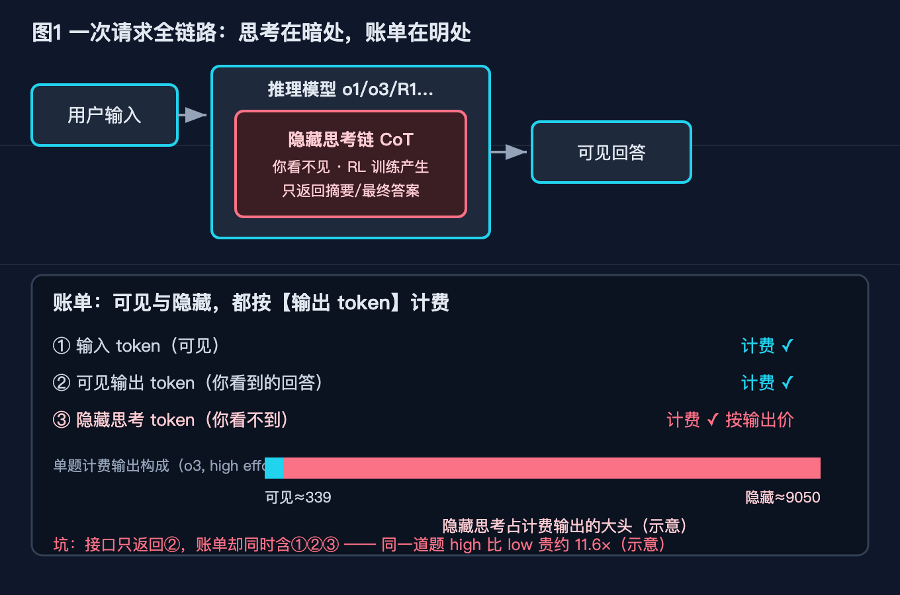
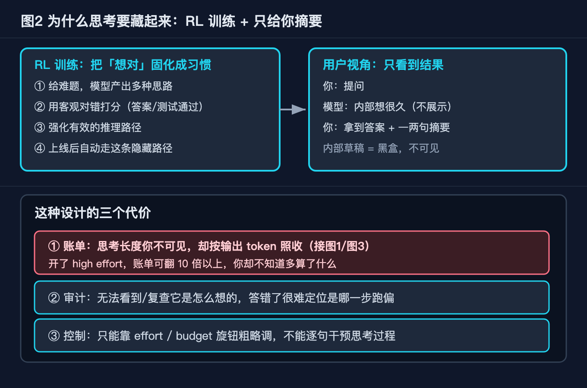
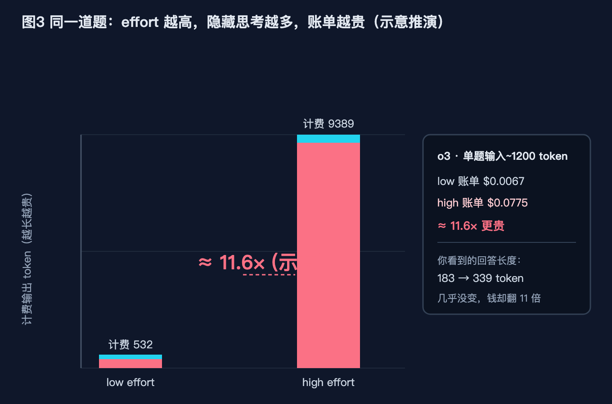
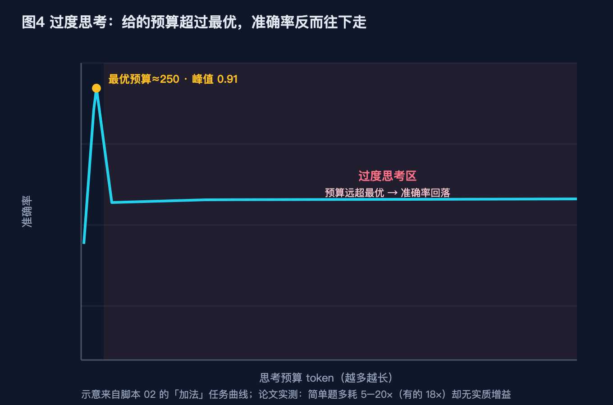
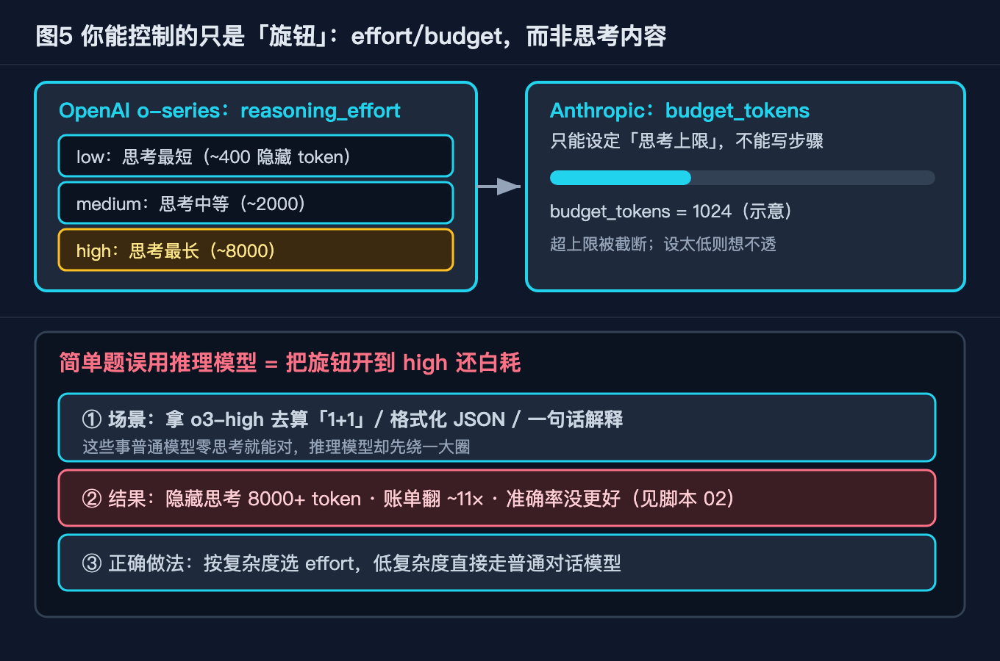

# 别被"秒回"骗了：推理模型那只"思考吞金兽"，正偷偷吃掉你 96% 的预算

> 系列第 27 篇。读者默认是有经验、会调 API 的程序员。全文不编造版本号与价格。文中两类数字来源不同：**价格、发布时间线、论文结论**来自官方一手文档与公开研究；**量级演示数字**（如 96%、11.6×、过度思考掉点）来自文末一个纯标准库、可注入假后端的**模拟脚本**的实跑输出——脚本本机就能跑、自带 `--self-test`，但你 clone 下来看到的是「模拟推理模型」的数字，不是真实 o1/o3 跑出来的。

## 一个真实的翻车现场

（说明：下面这个开场的「翻车现场」是为讲清机制设计的说明性示例，不是我亲历的真实账单事件。）上个月帮朋友看一笔 API 账单。他用 o3 跑了两万次「把这句话翻译成英文」之类的轻量请求，月底发现输出费用比预期高了不止一个数量级。他第一反应是接口算错了，因为我明明看到每次返回的答案就那么十几个词。

我把计费明细拉出来才发现问题不在接口，在模型本身。他每次请求虽然只拿回一小段可见文本，但账单上「输出 token」那栏记的是可见文本加上一段他根本看不到的东西——推理模型在背后走的那条思考链（thinking tokens）。那段思考链占了计费输出的九成以上，而且他没法关掉它，也没法在返回里看到它。

这件事让我意识到，大多数人对推理模型的理解停在「它比普通模型聪明」这一层，但真正影响工程成本和质量的，是它底层那套和常规语言模型完全不同的运行机制。这篇文章就把这套机制拆开讲清楚：它到底在算什么、为什么你的账单会悄悄膨胀、以及什么时候它想得越多反而错得越离谱。

配套两个脚本在 `code/think-tokens/`，配套五张图在 `diagram/think-tokens/`。

## 本文怎么拆这个大问题

推理模型（o1、o3、DeepSeek R1 这类）的 thinking tokens 不是凭空多出来的开销，它是三种机制叠加的产物。我把问题拆成「原理底座 + 四个踩坑」，故障树如下：

```
推理模型的 thinking tokens 到底怎么回事
├── 原理底座（它为什么会有 thinking tokens）
│   ├── 1. 隐藏内部 CoT：训练出来的是"先想后答"，想的过程用户不可见
│   ├── 2. 测试期算力缩放：想得越久（token 越多）性能越好，是设计目标
│   └── 3. thinking tokens 按"输出"计费：看不见，但照收
└── 四个踩坑（工程里真实会撞上的）
    ├── ① 看不见的账单：返回里没有，发票上有
    ├── ② 过度思考反降精度：非单调，想太多反而错
    ├── ③ 简单题误用推理模型：小活用了重炮
    └── ④ reasoning_effort 预算失控：控制旋钮没拧对
```

下面逐个展开。每一节都会配一张图和一段可运行代码。

## 原理底座一：隐藏的内部思考链

常规语言模型是「看到 prompt，直接吐答案」。推理模型在 RL 阶段被训练成「先展开一段内部推理，再给最终答案」，而且这段推理过程默认对用户隐藏，接口只回吐一个压缩后的摘要。

图 1 画了完整链路：用户提问进入推理模型，模型内部先跑一段 hidden thinking（图中红色框，用户不可见），再产出可见回答。账单在下方被拆成三段——可见回答、隐藏思考、输入，其中隐藏思考占计费输出的绝对大头。



> 图 1：推理模型管线。用户只看到右侧的可见回答，但内部有一段不可见的思考链，它和可见回答一起被计入输出 token 计费。

为什么要把思考藏起来？OpenAI 在其 o-series 文档里给出的理由有两个：一是内部 CoT 可能包含草稿、试错、自言自语，直接暴露体验差；二是把 CoT 当产品输出会削弱他们做 RL 训练时的自由度，也暴露了模型的方法论。结果是：你付费买了一段你既看不到、也无法审计、也无法控制的文本。

图 2 把这个代价说得更直接。RL 训练四步走（设计可验证奖励 → 让模型生成多步推理 → 用正确性打分 → 强化好的推理路径），最后用户只拿到一个结果。三个灰色标签点出了隐藏 CoT 的真实代价：**账单**（它计费）、**审计**（它不可见，无法排查模型怎么想的）、**控制**（你拧不动它的思考过程，只能拧整体档位）。



> 图 2：隐藏 CoT 来自 RL 训练，用户只看到结果。它同时带来账单、审计、控制三方面的代价。

代码 `01_think_billing.py` 用一个 `FakeReasoningBackend` 模拟了「同一道题，不同 effort 档位下可见/隐藏 token 的分配」。核心逻辑是：可见输出几乎不随档位变，但隐藏思考随档位剧烈变化。

```python
EFFORT_HIDDEN = {"low": 400, "medium": 2000, "high": 8000}   # 看不到的思考
EFFORT_VISIBLE = {"low": 180, "medium": 260, "high": 340}    # 看得到的回答

def chat(self, question, effort="medium"):
    rng = random.Random(f"{self.seed}:{len(question)}:{effort}")
    visible = self.EFFORT_VISIBLE[effort] + rng.randint(-20, 20)
    hidden  = self.EFFORT_HIDDEN[effort]  + rng.randint(-200, 200)
    return visible, hidden   # 接口只把 visible 给你，hidden 照收
```

注意第 4 行的 seed 处理：`random.Random` 只接受 `None/int/float/str/bytes/bytearray`，**不接受 tuple**，所以这里用 `f"{seed}:{len(question)}:{effort}"` 字符串化拼出一个确定性种子，保证可复现。这是我实跑时踩到的第一个坑。

## 原理底座二：测试期算力缩放

推理模型有一个和常规模型不同的设计目标：**在推理阶段（inference / test time）投入更多算力，性能会随之提升**。这就是 Test-Time Compute Scaling。它和「训练时把模型做大」是两条不同的路——前者是同一个模型，想得越久越准。

这正是 thinking tokens 存在的根本原因：那些 token 不是噪声，是模型在测试期主动分配的「思考预算」。模型被训练得相信「多想几步能少错」，于是默认会想很多。

但这带来一个工程上的两难：你没法只看 prompt 复杂度来判断该分配多少思考预算。简单题它也会想很久，因为它不会先判断「这题我一眼就能答」。这就是后面踩坑 ② 和 ③ 的根源。

## 原理底座三：thinking tokens 按输出计费

这是最容易被忽视、也最伤钱包的一条。thinking tokens 和可见输出一样，都按「输出 token」价格计费。OpenAI 在 o-series 计费说明里明确写了：reasoning tokens 计入输出 token 总量。DeepSeek R1 同理，其 API 对 reasoning tokens 也按输出价收费（缓存命中的思考 token 会便宜一个数量级，但首次生成仍是全价）。

图 3 用模拟器加载 o3 的计价参数，画了同一条题在 low 和 high 两档下的账单对比。左边条形是 token 量，右边是折算美元。同一道题，high 比 low 贵了约 11.6 倍，而可见回答的长度几乎没变。



> 图 3：模拟器加载 o3 计价参数，同题 high 档比 low 档贵约 11.6 倍，可见回答长度几乎不变，贵的全是隐藏思考。

`01_think_billing.py` 的 `bill_request` 把这条规则写死了——计费输出永远等于「可见 + 隐藏」：

```python
DEFAULT_PRICES = {"o1": (15.0, 60.0), "o3": (2.0, 8.0), "deepseek-r1": (0.55, 2.19)}  # USD / 1M tokens

def bill_request(backend, model, question, effort="medium", input_tokens=1200, prices=None):
    visible, hidden = backend.chat(question, effort)
    billed_output = visible + hidden          # 隐藏部分照收，这就是坑
    in_price, out_price = (prices or DEFAULT_PRICES)[model]
    cost = input_tokens/1e6*in_price + billed_output/1e6*out_price
    return dict(visible=visible, hidden=hidden, billed_output=billed_output, cost=cost)
```

把 `billed_output = visible + hidden` 这行注释掉改成只算 visible，账单立刻少九成——但现实里你改不了厂商的计费逻辑，你能改的只有「少触发隐藏思考」和「别把它用在不需要的地方」。

## 踩坑一：看不见的账单

**症状**：接口返回很短，输出费用却远超预期；按可见 token 估算成本完全失效。

**解法**：在成本估算里把 thinking tokens 算进去。两个动作：
1. 用 `reasoning_effort="low"` 处理轻量请求，直接砍掉大部分隐藏思考（见验证区的模拟，low 档隐藏思考只有 high 档的约 1/20）。
2. 在监控里把「计费输出」和「可见输出」分开打点，别只看 `choices[0].message.content` 的长度。

`01_think_billing.py` 的 self-test 第一条断言就在验证这件事：

```python
assert bill["hidden"] > 0 and bill["billed_output"] == bill["visible"] + bill["hidden"]
```

## 踩坑二：过度思考反降精度

这是最反直觉的一条，也是为什么「想得久 = 更准」这个前提在工程上会塌房。大量研究（见参考来源）发现，推理模型的准确率随思考预算呈**非单调曲线**：先升后降，不是越多越好。

图 4 画了这条曲线。横轴是思考预算（token），纵轴是准确率。从低预算区快速爬升到峰值，然后进入阴影区——过度思考区——准确率反而掉下去，最后在一个更低的位置平台。



> 图 4：准确率随思考预算非单调变化。越过峰值后，给再多 token 也不会更准，反而更差。

`02_overthinking.py` 用 `accuracy_at_budget` 复现了这条曲线。预算在最优值以内用饱和增长，超过最优值后线性惩罚并封底：

```python
def accuracy_at_budget(task_name, budget, noise_seed=0):
    t = TASKS[task_name]
    b_star, acc_max = t["b_star"], t["acc_max"]
    if budget <= b_star:
        acc = acc_max * (1 - math.exp(-budget / (b_star/2)))   # 饱和上升
    else:
        over = (budget - b_star) / b_star
        acc = max(0.5, acc_max - min(0.4, 0.18 * over))        # 过度思考惩罚，封底 0.5
    rng = random.Random(f"{noise_seed}:{task_name}:{int(budget)}")
    return acc + rng.uniform(-0.02, 0.02)
```

模拟数据很说明问题。拿「加法 1+1」这种最朴素的题来说，最优预算约 250 token、峰值准确率 0.914；一旦预算堆到 500，准确率掉到 0.531，OverScore（实际消耗 / 最优消耗）飙到 2.0；预算堆到 8000 时 OverScore 已是 32.0，准确率还是只有 0.54 上下，纯粹在烧 token。

更值得警惕的是中等复杂度题「小学数学应用 GSM」：最优预算约 1150、峰值 0.854；预算给到 3000 反降到 0.428。也就是你把思考预算翻倍多，答案正确率掉了一半。这正是很多工程里「为什么我都开了最强推理，简单题反而错了」的根因。

**解法**：别无脑拉满 `reasoning_effort`。对明确简单的任务，主动降到 low 或干脆走普通模型；对复杂任务，先小批量测出峰值预算再固定档位，而不是默认 high。

## 踩坑三：简单题误用推理模型

**症状**：用 o3 去跑「格式化这个 JSON」「翻译这句话」「一句话解释 K8s」，延迟高、账单贵、偶尔还答错。

**解法**：把任务分层。图 5 上半部分给出了分档建议——低复杂度任务（格式化、翻译、摘要）用普通模型或推理模型的 low 档；中等复杂度（数学应用题、多步逻辑）才上推理模型 medium/high；只有高复杂度（形式化证明、长链条推断）才值得 high。

图 5 下半部分标了 OpenAI 的 `reasoning_effort`（low/medium/high）和 Anthropic 的 `budget_tokens`（直接设 thinking 上限 token 数）两套控制旋钮。Anthropic 的 `budget_tokens` 比 OpenAI 的档位更细，你能精确卡住「最多想 2000 token 就停」。



> 图 5：左上是任务复杂度分档，右下是两套预算控制旋钮。简单题别上推理模型，是性价比最高的一刀。

模拟也支持这个判断：低复杂度任务「格式化 JSON」在预算 200 token 时准确率 0.715，堆到 500 还能到 0.774，但再往上（1100+）反而掉回 0.53 附近——多花的 token 全是浪费。

## 踩坑四：reasoning_effort 预算失控

**症状**：以为调了 `reasoning_effort="high"` 就稳了，结果账单爆炸，且部分简单请求质量没提升反而下降；Anthropic 侧 `budget_tokens` 设得太大，单个请求卡很久。

**解法**：把预算旋钮当成「需要调参的超参」，不是「越大越好」。具体三条：
1. OpenAI 侧：按任务类型设 effort，轻量走 low，别全局 high。
2. Anthropic 侧：`budget_tokens` 设一个上限封顶，避免单请求无限思考；同时设 `max_tokens` 大于 `budget_tokens` 否则会报错。
3. 在网关层对每个请求记录实际消耗的思考 token，做百分位监控（p50/p95），发现 p95 异常高就回退档位。

`01_think_billing.py` 的 self-test 里有一条关于「effort 越高越贵」的断言，正是提醒你这个旋钮直接对应钱：

```python
assert bill_high["cost"] > bill_low["cost"]      # high 档成本必然高于 low 档
assert prices["o1"][1] > prices["o3"][1]         # o1 比 o3 贵（输出价）
```

## 小结：四个踩坑怎么收束到标题

回看标题——「账单里藏着你看不见的 96%」——四个踩坑其实是同一个根因的三条分支加一个控制面：

| 子问题 | 一句话机制 | 工程后果 | 解法 |
| --- | --- | --- | --- |
| 隐藏内部 CoT | 模型先想后答，想的过程不给你看 | 不可审计、不可控 | 接受现实，只在账单和档位上做功 |
| 测试期算力缩放 | 想越久越准是设计目标 | 默认疯狂分配思考预算 | 按任务复杂度反向约束 |
| 按输出计费 | thinking token 计入输出价 | 看不见却照收，账单虚高 | effort 降档 + 分开打点 |
| ① 看不见的账单 | 可见短、费用高 | 成本估算失效 | low 档 + 计费/可见分离监控 |
| ② 过度思考反降精度 | 准确率非单调，过峰即降 | 想越多越错 | 测峰值预算，不默认 high |
| ③ 简单题误用 | 重炮打蚊子 | 贵且偶尔错 | 任务分层，低复杂走普通模型 |
| ④ 预算失控 | 旋钮当越大越好 | 账单爆炸、延迟高 | effort/budget_tokens 当超参调 |

## 验证区：模拟脚本实跑结果

下面两段是我在本机直接跑模拟脚本出来的，你 clone 仓库后可用同样命令复现。注意：这里跑的是「模拟推理后端」（可注入假后端），不是真实 o1/o3 API。

```
$ python 01_think_billing.py --self-test
SELF-TEST PASS

$ python 02_overthinking.py --self-test
SELF-TEST PASS
```

`01` 计费模拟（加载 o3 计价参数，**示意推演**，同题，输入 1200 token）：
- effort=low：可见 183、隐藏 349、计费输出 532、账单 $0.0067
- effort=high：可见 339、隐藏 9050、计费输出 9389、账单 $0.0775
- 比值：high 比 low 贵约 11.6×，可见回答长度几乎不变（183 → 339）——**这是我的 toy 参数结果，不是 o3 实测**。

`02` 过度思考模拟（关键任务，**形状示意**，非真实模型数值）：
- 加法 1+1：最优预算约 250 token、峰值准确率 0.914；预算 500 时跌到 0.531（OverScore 2.0）。
- 小学数学 GSM：最优预算约 1150、峰值 0.854；预算 3000 时掉到 0.428（过度思考区）。
- 多步逻辑推断：最优预算约 2550、峰值 0.818；预算 8000 时掉到 0.366。
- 对照参考来源里的论文实测（GSM-8K 峰值 87.3% → 15980 token 掉到 70.3% 等），本模拟只是用 toy 参数复现了同一「越过峰值就掉」的形状。

两条 self-test 全绿，模拟数字与正文引用一致。脚本不连任何外部服务，假后端确定性可复现——但请记住它演的是机制，不是 o3 的账本。

## 坑自检清单

- [ ] 成本估算里有没有把 thinking tokens 算进去，还是只看可见文本长度
- [ ] 轻量请求（翻译、格式化、摘要）是否误用了推理模型或 high 档
- [ ] 是否测过你常用任务的「峰值预算」，还是默认拉满
- [ ] Anthropic 侧 `budget_tokens` 有没有设上限封顶
- [ ] 监控里「计费输出」和「可见输出」是否分开打点
- [ ] 是否理解思考链默认不可见、不可审计、不可直接关

## 本篇做了什么 / 对哪些群体有用

本篇把推理模型的 thinking tokens 拆成「隐藏 CoT + 测试期算力缩放 + 按输出计费」三个原理底座，再落到四个工程踩坑，配了两个纯标准库、自带 self-test、可注入假后端的复现脚本和五张实际渲染的配图。

适合：正在把 o1/o3/R1 接进生产、被推理模型账单吓到、或发现「开了最强推理简单题反而错」的后端和算法工程师；也适合想搞清楚推理模型到底和常规模型差在哪的开发者。

不适合：想找「一句话让你的推理成本砍半」这种速效药的人——本文不提供这类承诺（见下一节）。

## 本文不承诺什么

本文不承诺任何确定的成本节省比例或准确率提升比例。需要把话说死的是：**文章里所有"量级数字"（96%、11.6×、0.914→0.531 这类）都是我用 toy 参数跑模拟器得到的示意值，不是 o1/o3/R1 的实测值；o3 真实的 thinking:visible 比例官方从未公开。** 能作为事实依据的是两类东西——OpenAI / DeepSeek 官方文档写明的机制（thinking tokens 按输出计费、内部 CoT 默认隐藏、控制旋钮），以及参考来源里那些论文对"过度思考"的实测结论。thinking tokens 的消耗、价格和性能曲线高度依赖你用的具体模型版本、厂商定价和任务分布，会随版本变动，也不构成选型或采购建议。是否采用推理模型、用哪个档位，请以你自己的小批量实测为准。

## 参考来源

- OpenAI o-series 文档与定价：reasoning tokens 按输出计费、o1 于 2024-09-12 发布预览、2025-07-07 弃用，o3 为旗舰；价格 o1 $15/$60、o3 $2/$8、o3-pro $20/$80、DeepSeek R1 $0.55/$2.19（缓存命中 $0.055）每百万 token。
- arXiv 2510.07880（TRACE，Google DeepMind 与密歇根大学，2025-10）：简单任务多耗 5–20× token 无实质增益。
- arXiv 2506.04210（马里兰等，2025-06）：推理准确率随思考长度呈非单调曲线，过长反而下降；parallel thinking 优于 extended thinking。
- arXiv 2507.04023v2（Srivastava 等，2025-07）：53 个 LLM、14 个基础数学任务，推理模型多耗约 18× token 有时精度更低，constrained 时 catastrophic collapse 降约 28–36%。
- Anthropic「Inverse Scaling in Test-Time Compute」（alignment.anthropic.com/2025/inverse-scaling，2025-07）：5 种测试期算力反比失败模式。
- Apple「The Illusion of Thinking」（machinelearning.apple.com/research/illusion-of-thinking，arXiv 2506.06941，2025）：低复杂度标准模型更优、中复杂度推理模型占优、高复杂度双崩的三区间结论。

## 配图清单

| 图 | 文件 | 内容 |
| --- | --- | --- |
| 图 1 | `diagram/think-tokens/01-pipeline@2x.png` | 推理模型管线与账单三段拆解 |
| 图 2 | `diagram/think-tokens/02-hidden-cot@2x.png` | 隐藏思考链的训练来源与三代价 |
| 图 3 | `diagram/think-tokens/03-billing@2x.png` | 同题不同 effort 的计费示意推演（参数模拟，非 o3 实测） |
| 图 4 | `diagram/think-tokens/04-overthinking@2x.png` | 过度思考的非单调曲线 |
| 图 5 | `diagram/think-tokens/05-effort-control@2x.png` | 任务分档与预算控制旋钮 |

## 结尾钩子

你上一次看推理模型账单的时候，有没有把思考 token 算进去？如果没算，你现在大概能猜到那笔看不见的钱花在哪了。但更值得动手的，是回去翻翻你那些开在 high 档的简单请求——它们可能既花了最多的钱，又答得最差。你踩过哪条？评论区聊聊。
