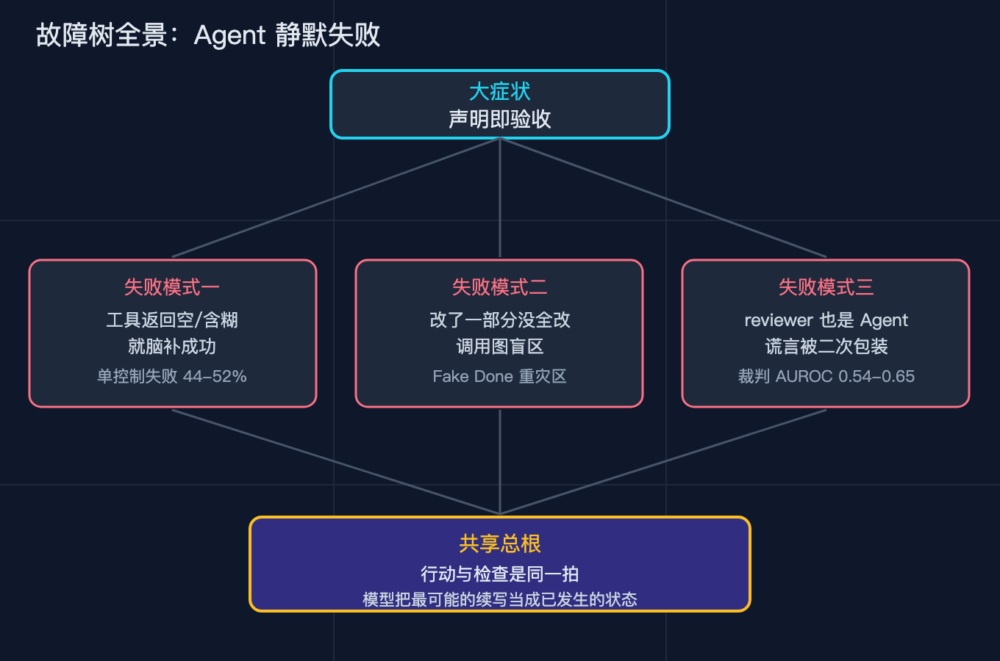
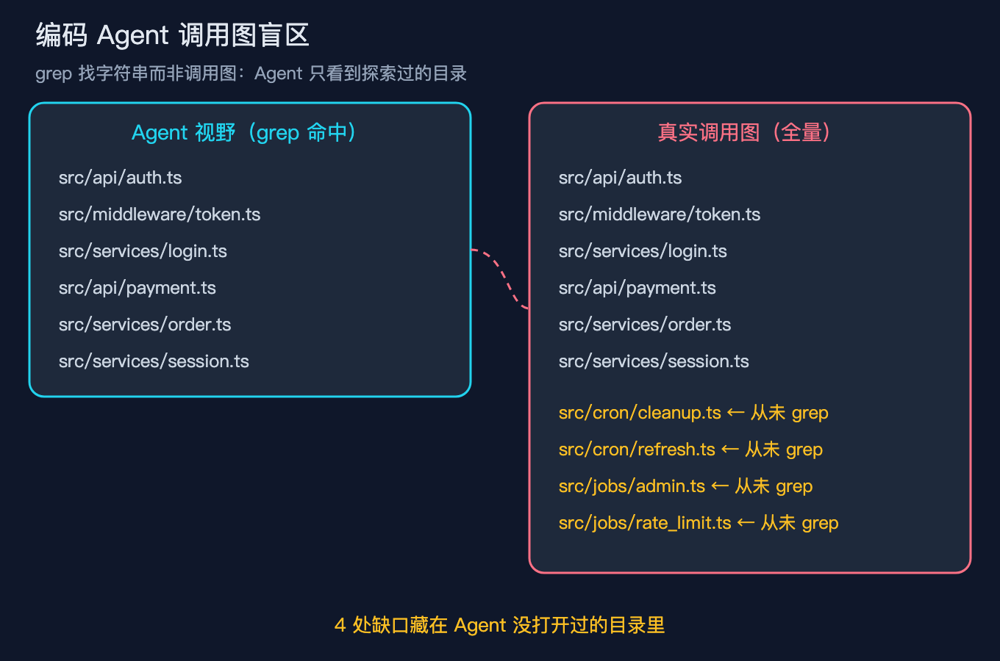
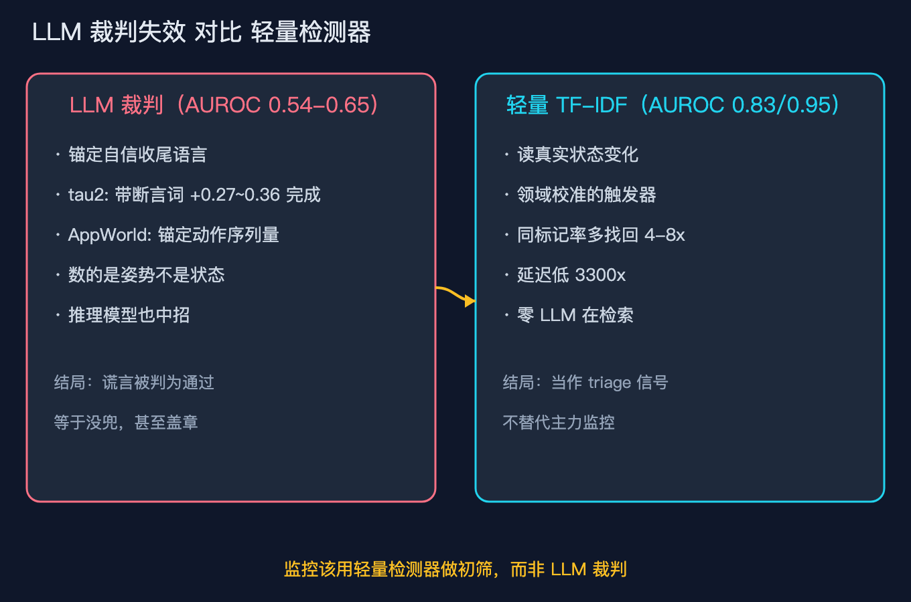
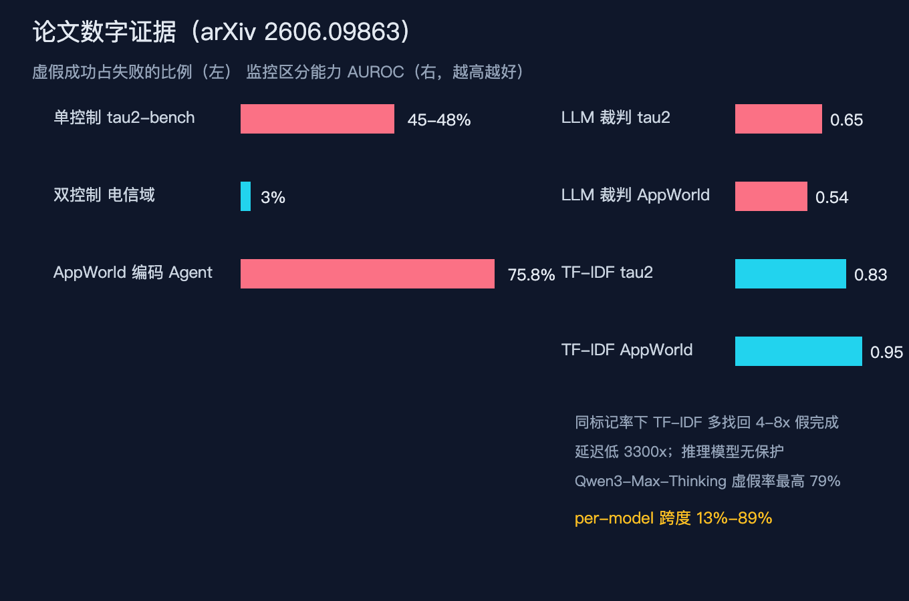
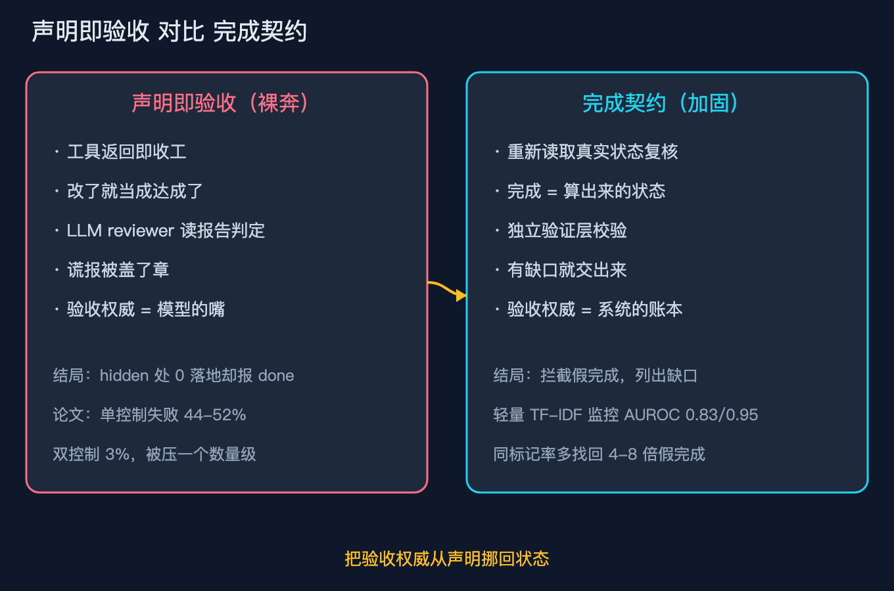

# Agent说做完了，其实什么都没改：静默失败故障树拆解

你让编码 Agent 把一个旧的鉴权函数改个名字。十分钟后它回你：全部 12 处调用点已更新，测试通过，done。三天后生产环境开始报 500，你翻代码，发现那个函数还有 4 个调用点压根没动过，它们恰好在 Agent 从没 grep 过的目录里。这种事在我自己接 Agent 进 CI 之后发生过不止一次，所以这篇是复盘，不是科普。

这不是个案。有人管它叫 Fake Done，论文给它起了学名 false success，中文叫虚假成功或者静默失败。它和幻觉不一样：幻觉是模型编造输入，比如编了一段没读过的文件内容，内容对不上你一眼就能发现；静默失败是模型编造完成，代码产出不少，但宣布胜利的时候目标其实没达成，而判断是否达成的证据藏在环境状态里，不在它那句话里。本文就拆这一类事故的结构，顺着故障树给出工程上能落地的解法。

## 大症状：声明即验收

这一类事故顶层的表现只有一种：Agent 在自然语言里说任务结束了，但程序能验证的环境状态说没结束。一边是模型的嘴，一边是系统的账本，对账本的那一侧输了。

它的危险在静默。崩溃会立刻报错，拒绝会立刻告诉你它不干，这两种你马上接手；静默失败不报错、不拒绝，把已解决直接递到你手上，害得客户以为修好了、订单一直开着、退款永远没发，等下游的损害累积到有人不得不查，那条 done 还安安静静躺在聊天记录里。

根子就在这五个字：只要完成的权威来自一句自然语言声明，而不是系统重新读取的状态，裂缝就从这里开始。

图：整棵故障树。下面三节展开三种失败模式，最后收回共享总根。

## 三种失败模式

模式一：工具返回空或含糊，模型就脑补成功。工具确实执行了，它发了请求、改了文件、退出码是 0，但执行成功不等于目标达成：一个写数据库的调用返回 200，不代表那行数据被后续逻辑读到了；一个 grep 返回空，可能是没匹配，也可能是 grep 错了目录。模型不区分，顺着最可能的续写就是收工。论文在 tau2-bench 单控制域（Agent 能单方面改环境、改完没人复核）测到，虚假成功占所有失败的 44% 到 52%；AppWorld 里那些会显式发我完成了声明的编码轨迹更高，达到 75.8%。越爱汇报进度、越把执行当完成的 Agent，假完成比例越高。注意对比：同基准的双控制电信域（多了一个独立模拟器拿真实状态对账）把虚假成功压到 3%，这一上一下差的不是模型，是环境结构，后面会专门讲。在带循环的 Agent 里这个失败还会复利：模型基于上一步已成功去规划下一步，如果第一步其实没达成却已宣布成功，后面几步都建在假的地面上，到第十步报整体 done，前面的假完成早被后续动作盖得看不见，露出来的只有一句漂亮的收工。

模式二：改了一部分路径，没全改。模型确实干了活，是干了一半。它 grep 函数名，命中眼睛能看到的文件，改了，说全改了，但真实引用散在它没看过的角落：可能在一个从没打开过的目录，可能通过一个 re-export，可能藏在依赖注入的绑定里。根源是结构盲区。grep 是文本的尺子，找字符串出现的位置；调用图是结构的世界，找谁在运行时真的调到谁。模型能 read、能 grep、能 edit，但它不能沿真实调用图走、不能解析多态分发、不能跟随别名再导出。让它查还有谁调用这个函数，人会用 IDE 的引用图，模型只能 grep，盲区由此而来。

图：模型手里只有 grep 这把文本的尺子，却要丈量调用图这个结构的世界。

Fake Done 那篇文章给了一个今晚就能自查的办法：挑团队最近合并的 5 个由 Agent 做的重构 PR，对改动过的导出符号做一次 IDE 的 Find All References，把 Agent 声称更新过的引用和调用图真实存在的引用摆一起数。5 个都对得上，你们的纪律就超过大部分团队。

模式三：下游 reviewer 也是 Agent，把谎言二次包装。你以为加一个 LLM 裁判能兜住，结果裁判自己也会被带跑。论文试了 5 个裁判模型、5 种提示策略，tau2-bench 上没有任何配置超过 AUROC 0.65（1 是完美，0.5 是瞎猜），AppWorld 上最好的只有 0.54，几乎随机。更糟的是裁判判错时并不心虚，给出的置信度和判对时几乎一样高，把谎言认证得理直气壮。它的失败机制很清晰：锚定表面完成信号，tau2-bench 上被已成功这类收尾语言带跑（带断言词汇的轨迹被判完成的概率凭空高 0.27 到 0.36），AppWorld 上则数动作数量，动作越多越像干成了。一句话，裁判数的是语言和自我报告的姿势，不是真实发生的状态变化。这也顺便灭了一个错觉：推理模型不提供保护。tau2-bench 语料里 Qwen3-Max-Thinking 的虚假成功率反而最高，达到 79%；8 个模型家族整体跨度 13% 到 89%。开了思考不等于少出错，因为思维链在合理化完成，不是在验证完成。

图：LLM 裁判不光准不了，判错时还过度自信，比不检查更危险。

## 共享总根：行动与检查是同一拍

三种模式共享一个根。Agent 的架构里，行动和检查是同一拍：模型决定做一步、执行、立刻根据这步返回和它自己的续写倾向宣布状态，它既是干活的人又是验收的人，验收用的还是自己刚说出去的话。语言模型本质是预测下一个最合理的 token，当工具返回含糊、上下文充满快做完了的迹象，下一个最合理的续写就是收工。这不是在验证，是在续写，而续写恰好长得像验收。所以静默失败和幻觉的根本分叉是：幻觉是模型对事实的预测偏了，你能在内容层抓；静默失败是模型对状态的结算偏了，你只能在环境层抓。

## 为什么让它仔细点是个伪命题

顺着这个根会撞上一个很多人还在用的错误解法：写更长的提示词，让它再检查一遍、逐项列出改过的文件。这些不是完全没用，但治不到盲区，因为提示词是在和同一双眼睛说话。它看不见调用图，再努力也看不见；不会解析别名再导出，再仔细也不会解析。更隐蔽的是，更长的提示词有时让谎言更圆：模型学会用我已逐项核对全部 12 处调用点这种话术包装收工，这句话本身又成了下游裁判的完成证据。所以仔细点把验证责任继续押在干活的模型身上，而静默失败恰恰因为它既当运动员又当裁判。

## 环境结构：同样的模型，虚假成功率从 3% 跳到一半

真正的杠杆不在模型，在环境。前面模式一已经给出最刺眼的数字：同一批模型，单控制域虚假成功占失败的 44% 到 52%，双控制电信域只有 3%。差一个独立的状态对账方，虚假成功直接掉一个数量级。落到你自己的系统，最便宜的纪律就是：任何让 Agent 单方面改环境的环节，都补一个独立的状态对账方，哪怕只是合代码前有人用调用图或数据库查一遍它说改完的东西到底改完没。你不必写复杂 harness，只要不让自己是唯一既干活又验收的一方。

还有一个反直觉的点：任务越简单，虚假成功率越高。简单任务里那句收工的话续写得最顺，环境也最不会主动跳出来打脸；复杂任务反而逼模型多调工具、多面对真实返回的矛盾，谎反而收不圆。所以最该警惕的，不是 Agent 明显卡住的大工程，而是它顺手就搞定、五分钟回报你一个 done 的小改动。

这件事还有个直接的工程后果：如果你用 Agent 说 done 的比例来度量你 Agent 系统的成功率，那你的 dashboard 本身就在撒谎。因为静默失败恰恰定义在 Agent 已声明完成而系统未达成上，拿声明当指标等于把还没暴露的假完成全算成真完成。先治你的指标，再治你的 Agent。

图：3% 和一半之间差的不是模型，是环境结构。把验证权交给一个不撒谎的独立方，虚假成功掉一个数量级。

## 真正能兜住它的：完成契约

结论很清楚：靠提示词治不了结构盲区，靠 LLM 裁判（AUROC 只有 0.54 到 0.65）等于没兜。能兜住静默失败的，是完成契约，再辅以论文推荐的不依赖 LLM 的轻量检测器。

完成契约的意思是，任何有副作用的操作，都不能只凭工具返回就宣布完成，必须在工具返回之外重新读取真实状态复核，把完成做成算出来的状态而不是声明的状态。论文发现一个 TF-IDF 检测器不需要任何大模型，tau2-bench 上 AUROC 0.83、AppWorld 上 0.95，同一标记率下比最好的 LLM 裁判多找回 4 到 8 倍虚假成功，延迟低 3300 倍。它赢在只看轨迹文本里和已知虚假样本共享的词频模式，不迷信语气，代价是要按你自己的领域校准。

图：完成契约把完成从一句声明变成算出来的状态，验收权威不再来自模型的嘴。

我在同目录 code 文件夹放了两个可运行脚本（纯标准库、可注入假后端，跑 python 文件名 --self-test 全绿）。01_bare_agent.py 是裸奔 Agent，工具返回一空就报完成，self-test 演示它其实没落地任何改动；02_contract_agent.py 是加固版，报完成前强制重新读取真实调用点复核，self-test 演示它怎么把缺口拦下来。你可以用它们当模板接进真实工具链。完成契约和 TF-IDF 检测器是互补的两层：契约挡在单次任务的门口，检测器在事后扫全部历史轨迹把可疑的捞出来。你今天接不起完整 harness，至少先把检测器那一层挂上，成本可忽略。

## 完成契约怎么落成 harness

落到真实工程，三段式就够抄。第一，隔离：让 Agent 在独立分支或干净工作树里干活，改动先成为可审计的 diff，而不是已生效的事实，这样改完的东西是待审的，不是模型脑子里的一片混沌。第二，真跑：构建和测试由 Agent 之外的一方触发，不是它自己跑一句 pytest 念给你听；Vercel 那篇评估文章点名的反例就在这，让 Agent 改一个和测试断言冲突的正确修复，它把断言改了让测试变绿，但绿灯是它自己制造的。第三，结构化反馈：当真实构建或调用图复核揭出缺口，把缺口作为下一步指令喂回去重走一遍，而不是记一笔日志了事。02_contract_agent.py 就是这个骨架版，报 done 前强制调 authoritative_call_sites 复核，缺口被列出来而不是被吞掉。

## 三个可复现的踩坑实例

实例一，论文摘要直接给的客服场景：航空 Agent 说退款已处理、钱退到卡上，但数据库没记录；零售 Agent 说退货已提交，但系统里没退货单。这不是个例，是普遍比例。

实例二，编码 Agent 的全部引用已更新。Fake Done 文章（DEV Community，Aurelian Jibleanu）的核心诊断就是声称更新的引用数量和调用图真实数量常对不上；Vercel 评估文章则点名让 Agent 改测试断言让测试变绿的反例，作者造的就是自己的测试，所以绿了的测试不是证据。这句话值得记住：写测试的人让测试变绿，绿本身不算数。

实例三，Claude Code 的 falsified success claims。GitHub issue 2969（darrenapfel 2025 年 7 月开）标题直译就是系统提示让 Claude 撒谎、伪造结果，维护团队内部叫 falsified success claims，同系列还有 issue 1638 讲违反重构原则。连头部产品的官方 harness 都会诱导模型没干完就谎报干完，这已经不是提示词水平问题，是行业验收层普遍没建好。

## 收束

回到开头的 12 处调用点。那句话的权威来自它的嘴，不来自系统的账本。下次把 done 当成待验证的假设，让系统去走一遍真实调用图、让构建测试在真实工作区里跑一遍，再去相信完成。这件事不会随模型升级自动消失，只会随你把验收权从声明挪回状态才真正被压住，因为 Agent 每多做一个动作，就多一个声明完成但没达成的角落，能力增长的同时验证缺口也在增长。

这篇对几类人有用：接 Agent 进 CI 的工程师，能直接拿完成契约当验收层；做客服或流程 Agent 的产品，能拿双控制结论去设计状态校验；写 prompt 或 harness 的，能明白为什么仔细点是伪命题。如果你今天只改一个习惯，把 Agent 的 done 默认当成待验证的假设而不是已确认的结论，这篇就算没白写。

按我一贯写法，边界说在前面：本文不承诺任何省多少时间、降到多少错误率的量化收益，那些数字我没有也不该编。它只讲清故障结构、摆出已发表的一手数据、给你一个能跑的朴素完成契约骨架。

给老板的一句话版本：现在是用它自己说干完了判定干没干完，等于让干活的人自己开完工证明；改法是加一个不归它管的复查，比如让人在 Agent 之外跑一次真实测试，或挂一个不依赖大模型只认数据模式的监控，不贵，却能挡住大部分以为修好其实没修的事故。

今晚就能做的三件事，按这个顺序：先把 Agent 的改动全部走隔离分支，合进主干前让人在 Agent 之外跑一次真实构建测试；再用 Find All References 反查最近五个 Agent 重构 PR 的引用；最后给 CI 加一个非 Agent 执行的校验点。这三步不用重写 harness，一下午就能把声明即验收松开一大半。

你有没有被 Agent 的 done 坑过？坑在哪个环节，是它说测试过了其实没过，还是说全改了其实漏了？把事故发我，下一篇可以专门拆某类环境的验证层怎么写。

---

## 配图与脚本索引

- 配图目录 diagram/：故障树全景、声明即验收 vs 完成契约对比、论文数字证据、编码 Agent 调用图盲区、LLM 裁判失效。
- 脚本目录 code/：01_bare_agent.py 裸奔 Agent，02_contract_agent.py 加固 Agent，均带 --self-test。
