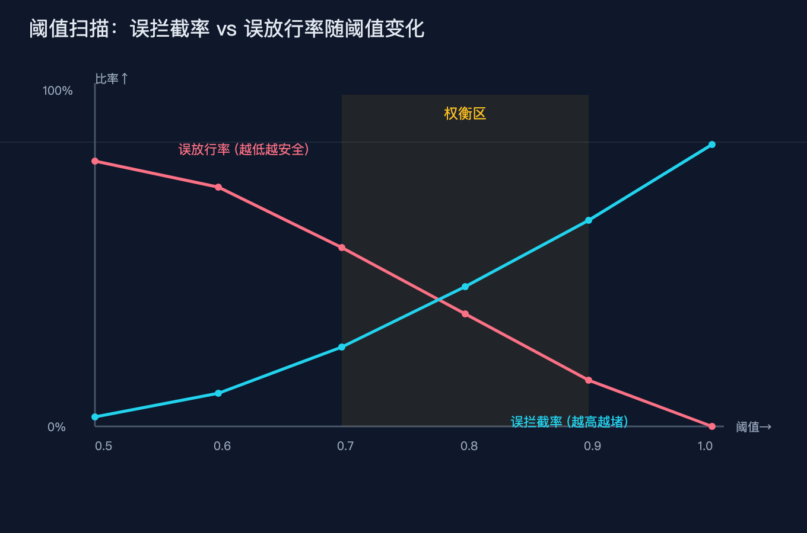

# 你给 AI 画的那条安全线，高了拦好人，低了放坏人

> 系列：AI 基础设施原理 第 29 篇。视角：有经验的 Java 后端 / 工程实现。
> 一句话：Jev 这类类型安全的概率决策模型刚发布就成了 Agent 栈里的新零件，它确实便宜又快，但把它接进 Agent 循环给危险工具调用当闸刀时，真正会搞死系统的事只有一件，就是把校准概率误当成布尔、阈值定错。这篇文章只讲这一件事，讲透。

## 先说清楚：Jev 到底是个什么

2026 年 9 月 15 日，前 OpenAI 研究员 Diogo Almeida 结束两年隐身，带着他的公司 TypeSafe AI 和第一个产品 Jev 正式亮相。Almeida 不是无名之辈，他是 RLHF（人类反馈强化学习）的共同发明人之一，也是 2022 年 InstructGPT 论文的作者之一，深度参与了 GPT-4 的早期工作。TypeSafe 这轮拿了 DCVC 领投的 4000 万美元种子轮，估值约 2 亿美元。

Jev 的卖点很反直觉：它不生成任何文本。

你给它一段程序状态，加上一个类型化问题，它并行采样、一次查询，返回带校准概率的结构化决策。它的输出只有三种固定形状：

1. Noul，回答一个是非问题，返回 0 到 1 之间的「是」概率。这个名字挺有意思，是 boolean 反过来拼的，官方 FAQ 自己承认了。
2. Choice，从一组预定义选项里选一个，每个选项带概率和整体置信度，最多 255 个选项。
3. Score，在一个你定义的有序刻度上打一个概率加权分。

它用一套叫 RLCD（Reinforcement Learning for Calibrated Decisions，校准决策强化学习）的训练方法，定位是继 RLHF、RLVR 之后的第三条强化学习路线。核心目标是校准：模型说某件事概率是 0.9，那它在真实世界里就大约 90% 的时候是对的（群体层面）。

因为根本不解码文本 token，它物理上只能给预定义选项分配概率，所以数学上不可能输出选项之外的东西，也不可能吐出坏 JSON 或者幻觉。TypeSafe 把这点叫零类型错误、零幻觉，本质是 schema 保证，不是它变聪明了。

性能数字方面，官方给出的端到端延迟是 70 到 500 毫秒，比前沿 LLM 快 40 到 200 倍；定价是输入每百万 token 0.042 美元，输出免费（因为根本没有逐字生成过程，没什么可计费的）。主页那个 193.6 倍更快、444.6 倍更便宜的对比，是厂商自报的、明确承认代表实际上限的数字，这些数字我后面会专讲哪些不能当真。

集成方面，LangChain 官方博客演示了三种接法：TypeSafeClassifier 做基础分类器，ModelRouterMiddleware 做模型路由，AutoModeMiddleware 做工具风险门控，后面那个会拦截 shell 这类危险工具调用。Vercel 的工程师报告替换部分 OpenAI 调用后快了 5 到 18 倍，Bryo AI 说比 Gemini 便宜 10 到 20 倍，并且能拿到真正校准的概率。

讲到这里你应该已经看出它最适合干什么了：Agent 循环里那些「该走哪条分支」「这个工具调用安不安全」的判断，本来就要烧一次 LLM 调用再加一段 JSON 解析重试，而 Jev 把这类任务抽出来，几十毫秒、几分钱就解决了。

（配图 1：Jev 能力边界，生成文本 vs 只吐类型概率）

## 切入点：让 Jev 给 Agent 的危险工具调用当门卫

一个 Agent 一旦能调用真实工具，删文件、发邮件、跑 shell、动数据库，它就不是聊天机器人了，它是一个能改变外部世界的程序。给这类调用加一道闸，是工程上必然要做的事。

传统做法是用 LLM 自己判断：「这个请求要不要放行？」但这等于每次工具调用前再烧一次 LLM，既慢又贵，而且 LLM 的判断是自由文本，你还得解析它说的一大段话，解析本身又是一层不可靠。

Jev 这类模型正好补这个洞。你构造一个 state（可以是字符串、JSON，或者 LangChain 消息），定义一个 Noul 问题：「这次工具调用安不安全？」它返回一个 0 到 1 的概率，软件拿这个概率去比对阈值，决定放行还是转人工。LangChain 的 AutoModeMiddleware 做的就是这件事，它可以按工具风险等级给不同工具设不同的放行阈值，必要时直接拦掉 shell 这种高危调用。

听起来很美。门卫装好了，便宜、快、还能给概率。但这里就是今天要讲透的坑。

（配图 2：Agent 工具门，慢闸 vs 廉价门卫）

## 故障树：门卫装上了，为什么还是会出事

我们把「Jev 当工具门卫」这件事拆成故障树，方法和这个系列前面几篇一致。

大症状只有一个：门卫装上了，结果要么误拦截了正常调用（用户体验崩、业务卡住、成本反而上来），要么误放行了危险调用（安全事故）。

往下拆，有三个失败模式，但其中一个才是真正的杀手。

失败模式一，误把 Jev 当 LLM 用。有人拿它去硬扛需要深度推理的任务，或者把一堆无关上下文塞进 state。Jev 的 32K 上下文是所有问题共享的请求预算，state 塞错东西精度会掉。这不是今天的主角，记住一条就行：它只适合答案空间事先已知的窄决策，需要开放推理的活儿必须回退给 LLM。

失败模式二，概率阈值定错。这是今天的主角，下面单独讲。

失败模式三，把校准概率当成准确率。模型说 0.9，你就当它有 90% 把握，结果放行的那一单偏偏错了。Jev 自报的基准是四个内部工作流约 67.8% 准确率，TypeSafe 说它和 GPT-5.6 Terra 的 67.9% 差不多。但这里的「正确答案」是 GPT-6 Astra 和 Claude Fable 5.1 两个大模型答案的平均值，不是独立 ground truth。换句话说，它是在和另外两个模型对答案，不是和现实对答案，基准本身就带着选择偏差。

三个失败模式的共享总根是同一句话：你把带校准概率的决策误读成了可靠的布尔判断。概率天生带着置信区间，它不是 True 也不是 False，是一个 0 到 1 之间的数。只要你忘了这一点，下面那个坑就一定会踩。

（配图 3：阈值坑，过高误拦截、过低误放行、校准不等于准确）

## 讲透唯一会搞死的那件事：阈值定错

现在聚焦失败模式二。这是我自己认为最值得讲透的一点，因为它藏得最深，而且和「校准」这个卖点直接对着干。

Jev 给你的是一个校准概率，比如「这次 shell 调用安全的概率是 0.87」。你软件里必然要写一个阈值，比如 `if 安全概率 >= 0.9: 放行 else: 转人工`。这个 0.9 怎么来，决定了系统的生死。

阈值定太高，误拦截。正常、安全的调用因为概率没到 0.9 被挡掉了，用户明明能自助解决的事被转去人工，排队、投诉、成本反而上来。阈值定太低，误放行。真正危险的调用因为概率到了 0.6 就放出去了，删库跑路。

更阴险的是第三层：校准不等于准确。校准说的是「模型说 0.9 的那一批，真实命中率大约 0.9」，它描述的是群体层面的诚实度，不是某一个具体判断的对错。单个 0.9 的判断照样可能错。而你定的阈值，本质上是在用群体统计去赌单个样本。

这里还有个被厂商叙事掩盖的事实。Jev 标榜校准概率、放心自动执行。但独立测试给的结论是谨慎的。开发者 Emil Lindfors 用 192 个是非判断做了粗略校准检查，发现 Jev 给出的概率区间和真实命中率方向一致，但两端略保守。而 DeepSeek 开了推理时，声称 0.7 到 0.9 的答案里真实命中率只有 48%，也就是会说话的模型普遍过度自信。Jev 在方向上是更老实的那个，但更老实不等于可闭眼信任。TypeSafe 自己的四个工作流基准，参考答案是两个外部模型的平均值，没有独立真值，所以那个 67.8% 你不能直接当成「它在这类任务上有 67.8% 准确率」来理解。

还有一个工程上极容易忽略的点：阈值要按工具风险分级，不能一刀切。放一封邮件和跑一条 shell 命令，放行的代价差一万倍。LangChain 的 AutoModeMiddleware 之所以要按工具风险设不同阈值，就是因为一个统一阈值要么在高危工具上太松、要么在低危工具上太紧。你用一个 0.9 去管所有工具，结果一定是高危的漏、低危的堵。

所以这件事讲透就是：门卫的核心不是接上 Jev，而是把校准概率接进一个分工具、分场景的阈值决策。阈值定错，校准再好也救不了你。共享总根那句话在这里落地为一条可执行的原则：概率永远不是放行令，它只是把「该不该信」这件事量化了，最终拍板的还是你写的阈值和分级策略。



## 实战小例子：写一个会算账的工具门卫

光讲不练是空话。下面给一个最小可运行的工具风险门卫，用纯标准库实现，不依赖任何 Jev SDK，方便你本地跑、改、注入自己的假后端。完整代码在 `code/gate.py`。

它的核心逻辑是：给一批工具调用请求，每个请求带上「真实是否危险」的标签和「门卫给出的安全概率」，然后用一个（分级的）阈值做放行决策，统计误拦截率和误放行率。假后端是一个返回可复现概率的函数，你不接真实 API 也能复现问题。`gate.py` 的 self-test 会构造一组已知答案的样本，断言门卫在阈值 0.5 下的误拦截和误放行计数与手算一致，证明统计逻辑本身没写错。

```python
# code/gate.py 核心片段（节选）
def decide(safety_prob, threshold):
    # 概率 >= 阈值 才放行；返回 True 表示放行
    return safety_prob >= threshold

def evaluate(requests, backend, policy):
    false_block = 0  # 误拦截：真实安全却被挡
    false_pass = 0   # 误放行：真实危险却放行
    for r in requests:
        p = backend.safety_probability(r)
        threshold = policy.get(r["tool"], policy["__default__"])
        allow = decide(p, threshold)        # 这一行把连续概率切成了布尔
        if not r["is_dangerous"] and not allow:
            false_block += 1
        if r["is_dangerous"] and allow:
            false_pass += 1
    return false_block, false_pass
```

注意 `safety_prob >= threshold` 这一行，就是整篇文章要你盯紧的地方。它把连续概率一刀切成了布尔，切的位置就是阈值，而 `policy` 允许你给不同工具设不同阈值，这就是分级门控。

配套还有一个 `code/threshold_sweep.py`，它扫一遍 0.50 到 0.99 的阈值，把每个阈值下的误拦截率和误放行率都打出来。你会直观看到：阈值往上走，误放行在降、误拦截在升；阈值往下走，反过来。这条曲线不存在两全的那个点，只有你愿意用多少误拦截换多少误放行的权衡。这正是阈值坑真实存在的证据，也是为什么分级阈值比统一阈值更合理。两个脚本都不联网、不装包，直接 `python3 code/gate.py --self-test` 和 `python3 code/threshold_sweep.py` 就能跑。

## 本文不承诺什么

按我自己的写作纪律，这一段必须写，因为 Jev 的叙事里夹了不少需要你打折听的数字：

1. 「快 40 到 200 倍、便宜 40 到 400 倍」是厂商自报的峰值口径，主页那个 193.6 倍更快、444.6 倍更便宜明确承认是实际上限，不是平均。独立测试（Every 的单任务提取）是 25 倍更快、580 倍更便宜，量级方向一致但场景单一。
2. 「零幻觉、零类型错误」是 schema 数学保证，指的是它物理上吐不出选项之外的结构，不等于它判断得对。它照样可以把危险调用判成安全。
3. 自报的 67.8% 工作流准确率，参考答案是 GPT-6 Astra 和 Claude Fable 5.1 的平均值，不是独立真值，不能直接读成「这类任务上它有 67.8% 准确率」。
4. 校准是群体诚实度，不是单个判断的保证。Lindfors 的独立检查显示方向正确但两端略保守，不能据此闭眼自动执行。
5. RLCD 截至 2026 年 9 月没有公开技术论文，方法细节只来自官方博客和文档，外部不可独立验证。

我在这篇文章里没有承诺任何收益百分比，只讲了一个会被踩的坑，以及怎么把它踩实。

## 收束

Jev 这类类型安全概率模型，给 Agent 工具门控提供了一个便宜、快、还能给概率的零件。但它不是免死金牌。真正决定系统安全的，是你在概率和布尔之间切下的那道阈值，以及你有没有按工具风险给它分级。把校准概率当成布尔开关、阈值一刀切，是这件事里唯一会搞死你的操作。

如果你正在搭 Agent 的工具层，回去翻一下你的门卫代码，看看那个 `>= threshold` 写在了哪里、是不是所有工具共用一个值。改一行，可能就避开了一次事故。

## 本篇做了什么

用 Jev 这个刚发布的热点作切入点，只讲透一件事：把它接进 Agent 循环给危险工具调用当门卫时，最致命的不是「没接上」，而是把校准概率误当成布尔、阈值定错（误拦截 / 误放行 / 校准不等于准确）。给了两张可运行脚本（门卫 + 阈值扫描，含 self-test）和四张手写配图，所有数字均来自一手或独立可核查来源，并在文末列了「本文不承诺什么」。
