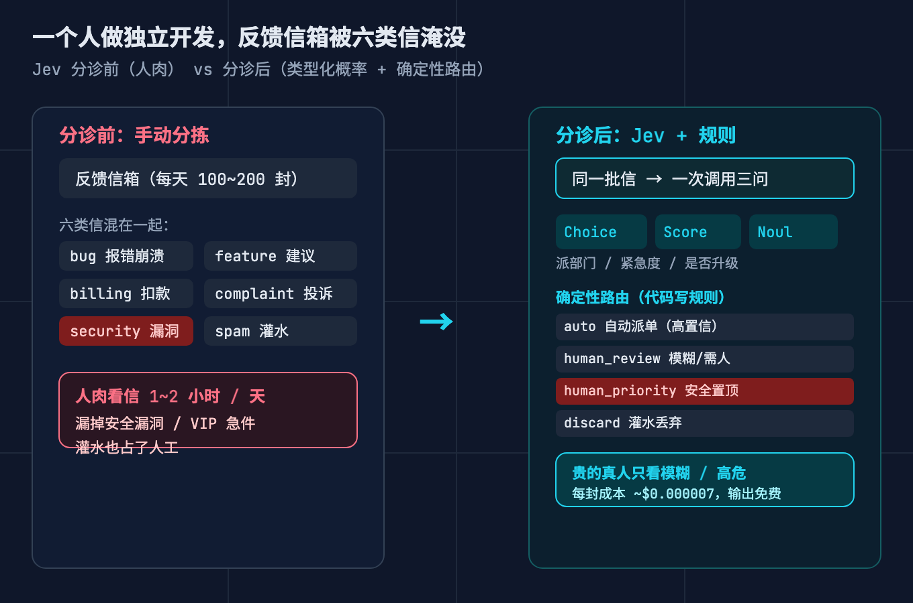
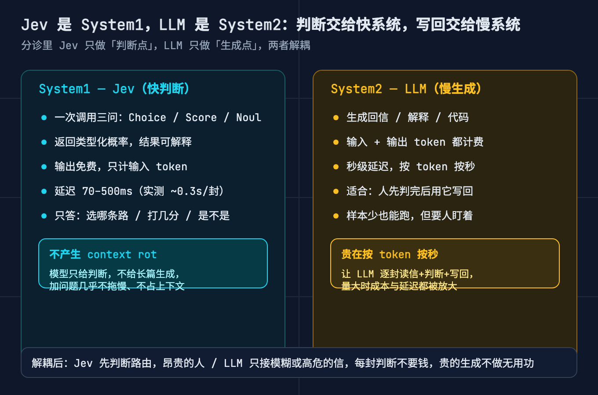
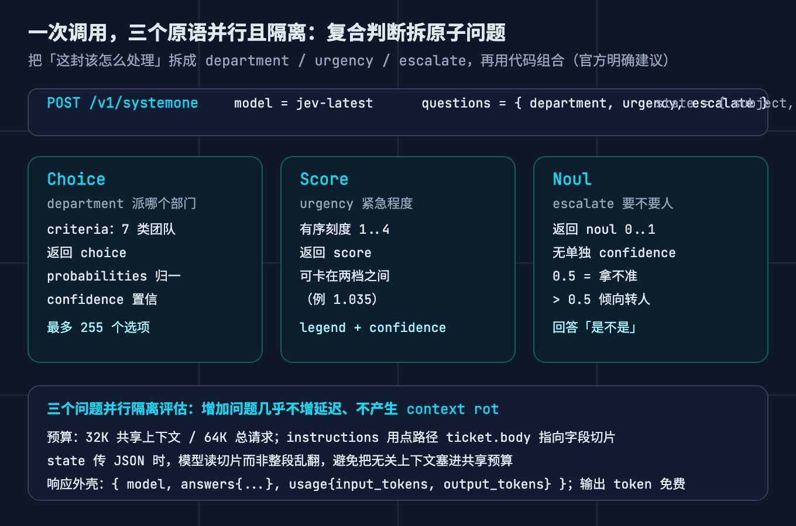
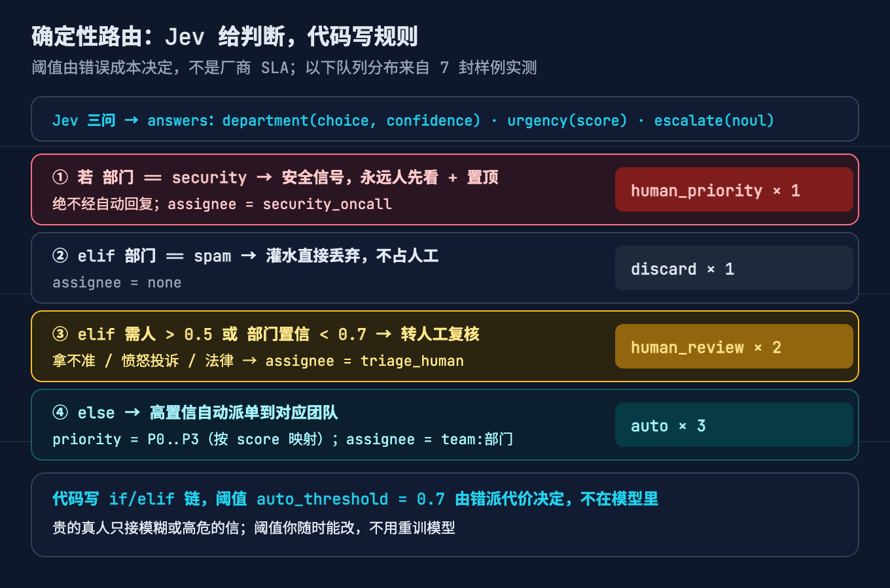
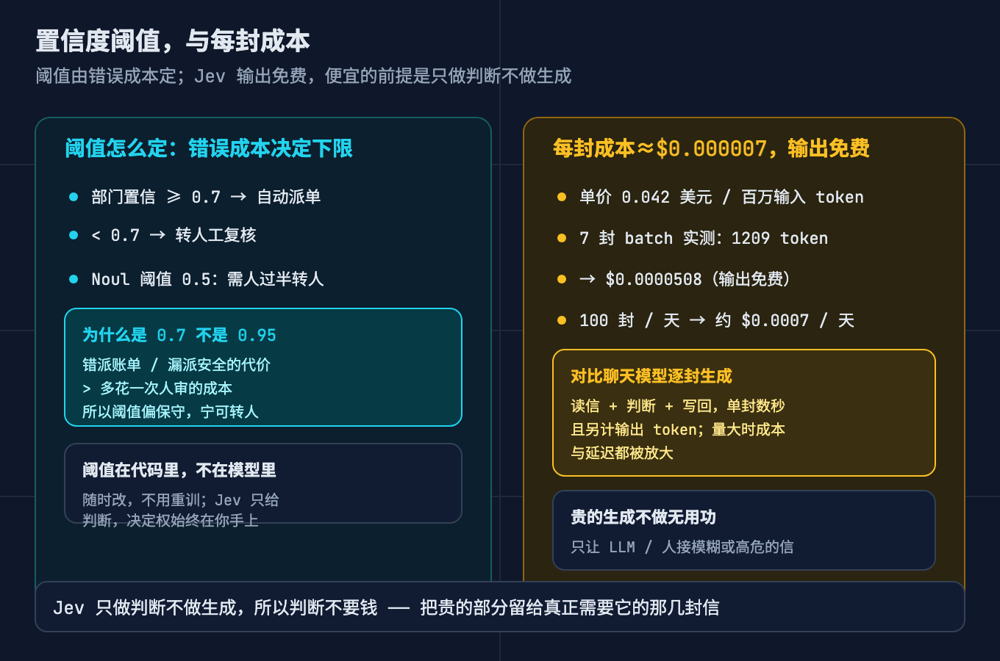

# 每天被用户来信淹没，我漏看了那封漏洞报告，于是给反馈邮箱写了个分诊台

> 系列：AI 基础设施原理 第 30 篇。视角：一个人做独立开发 / 把模型判断接进代码。
> 一句话：上一篇讲的是拿 Jev 给单次危险操作当门卫，一个是非判断，一道闸。这一篇换个更日常的场景，一个人的反馈信箱每天被六类信淹没。我用 Jev 做分诊路由，把这封该怎么处理拆成三个原子问题，重点讲清四件事：为什么必须拆、为什么三个问题要一次并行问、为什么判断交给模型而路由要写死在代码里、为什么阈值该由错误成本决定而不是拍脑袋。全程纯标准库，可复现。

## 先说清楚：这次不是拦危险操作，是给一堆信找路

上一篇（第 29 篇）的场景，是给 Agent 的单次工具调用当门卫。一个问题，一个是非判断，返回一个 0 到 1 的概率，代码拿它去比阈值，放行还是转人工。那时候整套逻辑的重点是「一道闸」。

这一篇的场景不一样。不是拦一件事，是从一堆混杂来信里做分诊，也就是 triage。要回答的不是「放行还是拦」，而是三个更碎的问题：这封该派给谁、有多急、要不要真人先看一遍。这三个问题的答案决定这封信接下来的命运，而它们每一个都是窄判断，恰好落在 Jev 擅长的范围里。

先把 Jev 是什么用一句话带过，细节去看第 29 篇。它是 TypeSafe AI 的 System One 模型，端点是 `POST https://api.typesafe.ai/v1/systemone`。你发过去一份状态（state）加一组带类型的问题（questions），它不回文本，只回三类结构化答案之一。它是并行的，不逐字生成，所以官方给的口径是输出免费、只按输入 token 计费，端到端延迟 70 到 500 毫秒。它为什么适合做分诊，关键在下面这句官方原话。

TypeSafe 官方文档里写得很直接：System One 模型在每个问题只问一件具体、边界清楚的事情时效果最好。如果一个问题的答案需要展开推理，或者要同时权衡多个互相独立的因素，就把它拆开，每个因素单独问，再用你代码里的逻辑把结果组合起来。这样能保证单个判断可靠，也让你完全控制各个维度怎么加权；优先级变了，改代码里的一个系数就行，不用重写提示词。

这句话就是这篇的骨架。分诊这件事，看着是一个问题，其实是三个独立维度捆在一起，必须拆。

## 切入点：一个人的反馈信箱，六类信混成一片

场景具体一点。一个人做独立开发，手上有一个在收钱的 Web 小工具。反馈入口是一个公开的邮箱，或者一个表单落到同一个收件箱。每天大概一百到两百封来信，六类混在一起：

报错崩溃的 bug、想要新功能的产品建议、账单扣款和退款的问题、情绪化的投诉和差评、真正的安全漏洞、以及纯灌水的广告推广。

分诊前的手工做法大概是这样的。每天开工先花一到两个小时把信扫一遍，贴标签，再转发给对应的处理入口。平时还撑得住。一到活动季或者上了新产品页，量翻倍，这套流程立刻崩。先被牺牲的一定是读起来最费劲的那封：安全漏洞的报告埋在一堆推广里被划走，VIP 用户「重复扣款，我今天就要用」的信躺在收件箱第三天。

这里要把期望先摆正。这一篇做的不是「自动回信」，是分诊。目标只有一个：让每一封信先去到对的地方，让只有真正需要人的那几封，才占用你的时间。



## 故障树：分诊为什么还是会垮

按这个系列的拆法，把「用 Jev 做分诊」拆成故障树。大症状只有一个：分诊一上线，要么派错得离谱、人还得整封重看一遍，白干；要么模型的账单一涨就没人敢用，还慢得没人愿意等。

往下拆，三个失败模式。

失败模式一，人肉分拣的带宽是固定的。来信量涨，人能投进去的时间不涨。先漏掉的一定是看起来费劲的那一类。这不是态度问题，是带宽问题。

失败模式二，让聊天模型逐封「读信、判断、写回」。这条路慢，单封通常要数秒；贵，输入和输出两头都计费；而且它给的是自由文本，你还得再写一层解析去理解它说了什么，解析本身又是一层不可靠。量一大，延迟和成本一起被放大。

失败模式三，把判断和动作混在一起。模型既判断又直接执行，一旦错了，你根本说不清是判断错了还是执行错了，也没法复审。

这三个失败模式的共享总根是同一句话：把「做判断」和「写内容」当成了同一件事，而且都用最贵的那个工具去做判断。分诊真正需要的，是一堆窄判断（派谁、多急、要不要人），不是一堆生成。



## 讲透一：把「这封该怎么处理」拆成三个原子问题

先说为什么不能直接问「这封该怎么处理」。

这是一个把三个独立维度捆在一起的复合问题。你把它丢给任何模型，它都得在心里同时权衡部门、紧急度、要不要人这三件事，然后给一个综合答案。结果就是那个答案的概率分布很平（三类各占三成），或者每次给的都不一样。更要命的是，你的代码拿到这么一个糊成一团的答案，根本没法用：它不是「派 billing 还是 bug」，它是一句「大概也许吧」。

正确做法是按官方那句原话，拆成三个原子问题，每个只在一件事上押注。

第一个是 department，用 Choice 原语。你给它一组显式的 criteria，也就是七类团队加一句说明：billing 是账单扣款退款，bug 是功能坏了报错崩溃，feature 是想要新功能，complaint 是投诉差评情绪化，security 是漏洞数据泄露未授权访问，spam 是广告灌水，other 是以上都不沾边。它回你一个 choice，外加一整个 probabilities 和 confidence。

第二个是 urgency，用 Score 原语。你给它一把有序刻度，从可以等一周，到正常一天内回，到今天就得处理卡住了用户，再到卡住了有时效的事或正在丢钱。它回你一个 score。这里有个值得留意的细节，官方 quickstart 里的例子，分数是 1.035，也就是说 Score 的取值可以卡在两档之间，不是非黑即白。

第三个是 escalate，用 Noul 原语。你问它：这封来信是不是需要一个真人先读一遍再决定怎么回，比如涉及安全、愤怒投诉、法律，或者拿不准。它回你一个 0 到 1 的数，这个数就是「是」的概率，0.5 就表示拿不准。

拆开的好处是，每个问题都只在一个窄面上做判断。department 只管分类，urgency 只管急不急，escalate 只管要不要人。三个判断各自可靠，组合逻辑在你手里。

这里有个必须讲清的关键点：criteria 就是答案空间。

Choice 的每一个选项都要配一句清楚的说明，Score 的每一档都要写清语义，Noul 的问法要问到点上。因为模型不发明答案空间，答案空间是你给的。你要是只写个空格子「选一个部门」，或者选项名起得含混，模型就只能靠猜，于是账单投诉被归进 bug，功能建议被归进 other。

第三方的一手例子正好说明这点。The Register 报道过一个工单的例子：状态是「我的卡被扣了两次」，用 Choice 在三类部门间选，拿回来的分布是 billing 0.08、technical 0.85、sales 0.07，confidence 0.82。注意，它把技术类给了 0.85，账单只有 0.08。同一句话，你怎么定义答案空间、怎么措辞，结果差很多。答案空间不写死，你就把分类的标准交给了模型的即兴发挥。



## 讲透二：三个问题一次问，并行而且隔离

拆成三个问题之后，一个很自然的想法是发三次请求。这是坑，下面踩坑合集里还会展开。正确做法是塞进一次调用。

官方原文是这么说的：三类问题可以混在同一个 API 调用里。每一个问题都针对同一份状态，并行、隔离地被评估。增加问题几乎不改变响应时间。每个问题独立评估，所以加更多问题也不会产生上下文腐化（context rot）。

这三句话里的每一句都是工程红利。

并行，意味着一封信用一次调用的延迟就能拿回三个判断，而不是三次延迟叠加。隔离，意味着 department 的判断不会被 urgency 的问题带偏，三个问题互不干扰。不产生 context rot，意味着你多问几个问题，前面问题的判断质量不会因为后面问题的存在而退化。这三件事凑在一起，才让「一次问全」成为默认用法。

状态怎么传也有讲究。我用 JSON 传 `{"subject": ..., "body": ...}`，然后在每个问题的 instructions 里用点路径，比如让它读 `ticket.body`、`ticket.subject`。这样做的好处是模型读的是字段切片，不是整段乱翻。官方对这块有个预算口径：所有问题共享 32K 的上下文预算，单次请求总预算是 64K。你把整封邮件连签名带历史引用全塞进去，就是在拿共享预算去喂噪音。

还有一个纯经济账上的理由：输出免费。既然输出不花钱，那多问几个问题，增加的成本几乎只有那点输入 token。所以官方才会建议「把你可能需要的所有问题一次性都发过去，包括推测性的，让代码去忽略用不上的答案」。一次问三个判断，在账上划算得不像话。

## 讲透三：Jev 只给判断，路由写死在代码里

这是整条链路真正的决策点。模型给概率，代码给规则。

我们的路由是一串 if / elif，优先级从高到低排。

第一条，如果部门是 security，进 human_priority 队列，安全信号永远真人先看并且置顶，绝不经过自动回复。

第二条，如果部门是 spam，进 discard 队列，灌水直接丢弃，不占人工。

第三条，如果 escalate 大于 0.5，或者部门置信低于 0.7，进 human_review 队列，转人工复核。

第四条，以上都不满足，进 auto 队列，按部门自动派单，再按 score 映射成 P0 到 P3 的优先级。

为什么不让模型自己决定「该怎么处理」？因为派给谁是一个该确定的事。你要是让模型自由发挥，等于把「同一封信今天派 billing、明天派 bug」这种不确定性引进了生产系统。模型的职责是它擅长的部分，在窄问题上给出类型化概率；路由的职责是它擅长的部分，确定、可审计、随时可改。两边各干各的，不越界。

Earendil 的 CTO Armin Ronacher 对 TechCrunch 说过一句挺戳的话：这类模型「把幻觉问题一点点甩回给用户」。意思是，它给一个 50%，你就把它当抛硬币忽略掉；它给 95%，你才动手。判断的可靠性，最终由你的阈值和规则兜底，而不是由模型替你拍板。

这套设计最大的好处是可审计。每一封信为什么进了这个队列，规则白纸黑字写在那里。出问题，你翻开代码就能复盘是哪一条规则判的，而不是去猜一个黑盒里发生了什么。



## 讲透四：置信度和阈值，是你能拧的那个旋钮

阈值不是模型给的，是你写的。

我们的脚本里有两个阈值。一个是 auto_threshold，等于 0.7，部门置信低于它就转人工。另一个是 escalate 的 0.5，需人概率过半就转人。

为什么是 0.7，不是 0.95？取决于错派代价。把一封投诉当 bug 派出去，用户只会更火；把一封漏洞报告当普通信划走，那是事故。这些代价，都大过多花一次人工复核的成本。所以阈值偏保守，宁可转人也不误派。反过来，如果你只是在给营销线索分类，错了成本很低，阈值就可以放松，自动化率就能拉高。

官方口径支持这个思路。confidence 不是随手给的，它由概率分布的形状推出来。Choice 和 Score 会带上 confidence，Noul 只给一个 0 到 1 的 noul 值。官方有一个语音银行的例子：不确定就转人工的那条底线设在 0.6，查余额这个动作 0.6 就够，而批准一笔转账需要超过 0.85。同一个模型，阈值按动作的成本缩放。这就是「阈值由错误成本决定」的一手依据。

这里有个特别容易被忽略的点：confidence 不等于最大概率。

官方文档里的例子里，billing 拿了 0.84 的概率，但 confidence 只有 0.596。为什么？因为第二名 technical 还占着 0.159 的质量。也就是说，哪怕第一名很高，只要第二名还没被压下去，模型就会诚实地告诉你「我其实没那么确定」。这个直觉很重要，我在脚本的假后端里就是用「第一名与第二名之差」来近似它的。

成本这边：单价是每百万输入 token 0.042 美元，输出免费。我们七封样例批量跑一遍，输入 1209 个 token，成本 0.0000508 美元。一百封一天，在这个量级上是几厘钱一天的事。对比一下聊天模型逐封读信加判断加写回，单封数秒，还另外计输出 token。量一大，差距就被放大了。



## 实战：两段脚本，跑通这个分诊台

光说不练是空话。下面是两段纯标准库脚本，不依赖任何 Jev SDK，方便你本地跑、改、注入自己的假后端。完整代码在 `code/triage_router.py` 和 `code/triage_batch.py`。

架构很简单。`JevBackend` 是一个抽象接口，只有一个 `ask(state, questions)` 方法。它有两个实现：`HttpJevBackend` 是真实后端，用 urllib 直接 POST 到官方端点，读环境变量 `TYPESAFE_API_KEY`；`FakeJevBackend` 是假后端，按关键词规则返回与官方同形状的答案。假后端不做真正的模型推理，但它能复现「三类原语加确定性路由」的全部工程逻辑，所以自检和示例都不需要 API key。

三个原子问题是这么构造的：

```python
# code/triage_router.py 片段（节选）
def build_questions():
    return {
        "department": {
            "type": "choice",
            "instructions": "读 ticket.subject 和 ticket.body，这封用户来信应该派给哪个团队处理？",
            "criteria": DEPARTMENTS,        # 七类团队 + 每类一句说明
        },
        "urgency": {
            "type": "score",
            "instructions": "读 ticket.body，这封来信的紧急程度？按下面的有序刻度打分。",
            "criteria": URGENCY_LEVELS,     # 四档有序刻度
        },
        "escalate": {
            "type": "noul",
            "instructions": "读 ticket.body：这封来信是否需要一个真人先读一遍再决定怎么回？",
        },
    }
```

路由规则是这么写的，注意阈值是参数，不是写死的魔法数：

```python
# code/triage_router.py 片段（节选）
def route(ticket_meta, answers, auto_threshold=0.7):
    a = answers["answers"]
    dept   = a["department"]["choice"]
    dconf  = a["department"]["confidence"]
    uscore = a["urgency"]["score"]
    esc    = a["escalate"]["noul"]

    if dept == "security":                    # 安全永远人先看 + 置顶
        queue = "human_priority"
    elif dept == "spam":                      # 灌水直接丢
        queue = "discard"
    elif esc > 0.5 or dconf < auto_threshold: # 需人，或置信太低拿不准
        queue = "human_review"
    else:                                     # 高置信自动派单
        queue = "auto"
```

跑法有三种。单封调试用 `python3 triage_router.py --ticket 某封邮件.txt`，本地自检用 `--self-test`，看内置样例用 `--demo`。批量版是 `python3 triage_batch.py --self-test` 和 `--demo`，它会读一个目录下的 `.txt`（首行当主题，其余当正文），跑完打印一份分诊报告。

下面是真跑出来的结果，不是示意图，完整输出存在 `code/realrun_evidence.txt`。

七封样例的队列分布是 auto 三封、human_review 两封、human_priority 一封、discard 一封，输入 1209 个 token，Jev 成本 0.0000508 美元，自动派单三封占了 43%。

对着结果看规则怎么落地。01 那封疑似越权漏洞，部门判成 security、置信 0.90、需人 0.96，直接进 human_priority，派给 security_oncall。02 那封免费领红包，部门 spam、置信 0.99，进 discard。03 那封 Safari 导出崩溃，部门 bug、置信 0.99，进 auto。06 那封只有「在吗，有点事想说」，没有任何关键词命中，部门置信只有 0.20，低于 0.7，所以进了 human_review。07 那封「太失望了」，部门判成 complaint、置信 0.90，但需人概率 0.82，超过 0.5，也进了 human_review。

结果就是，贵的真人只接了四封模糊的信或高危的信，剩下三封干净的信被自动派走。这就是分诊台想要的样子。

## 踩坑合集

下面这些坑是我在写这两段脚本时真实遇到的，症状加解法，不重复原理。

坑一，把复合判断塞成一个问题。症状是你问「这封该怎么处理」，拿回来的概率分布很平，或者答案每次都在变，代码不知道该怎么用。解法是拆成 department、urgency、escalate 三个原子问题，官方原话就是每个问题只问一件具体、边界清楚的事，要权衡多个独立因素就拆。

坑二，让聊天模型逐封读信加判断加写回。症状是量一上来延迟从毫秒变秒级，账单按输入输出两头涨，判断还是自由文本还得解析。解法是判断交给 Jev，窄问题、只要类型化概率；写回才留给 LLM，而且只对进了 auto 或 human_review 的信做。

坑三，criteria 没写清楚。症状是账单投诉被归到 bug，功能建议被归到 other，路由错得离谱。解法是把 criteria 当答案空间认真写，每个选项配一句说明，每档刻度写清语义，答案空间不写死，模型就替你发明一个。

坑四，把阈值拍在提示词里，或者指望厂商默认值。症状是阈值藏在某段提示词里想改改不动，或者以为模型会自己拿不准就不派。解法是把阈值写在代码里，由错误成本定，随时能改，不用重训，也不受提示词波动的影响。

坑五，state 塞整段长文本。症状是把整封邮件连签名带引用全塞进去，问题一多，共享预算被吃掉，精度掉。解法是 state 传 JSON，instructions 用点路径指向字段切片，让模型读切片，别让它整段乱翻。

坑六，拿 noul 当概率或者忘了它没有单独的 confidence。症状是把 escalate 的 0.08 当成「8% 确定」，或者以为它也有个 confidence 可看，0.5 附近的值被当成了明确信号。解法是记住 noul 本身就是「是」的概率，0.5 就是拿不准，要单独 certainty 的是 Choice 和 Score，别给 noul 硬套 confidence 的语义。

坑七，没处理真实 API 的错误码。症状是真实后端一上，偶发的限流或过载直接把批量任务打断。解法是包一层重试和退避，官方的限流口径是每秒 25 万 token、每分钟 1200 次请求，批量跑的时候要自己控速。

## 本文不承诺什么

按我的写作纪律，这一段必须写。

1. 每百万输入 token 0.042 美元、输出免费，是本文脚本采用的官方口径，具体以官方最新价目为准。我只演示量级，不承诺你的账单就是这个数。
2. 我用的七封样例是构造出来的示范数据，不是真实流量。那个三比二比一比一的队列分布，只说明规则怎么工作，不代表任何真实准确率。
3. 「输出免费所以多问几个问题几乎不增成本」「加问题几乎不增延迟」来自官方对并行隔离评估的说明，方向可信。但你不接真实 API，就只验证了工程逻辑，没有验证模型的判断质量本身。
4. Jev 不等于更准。有一份被多方转述的独立测试（原始是 beri.net 的 2000 封钓鱼邮件），Jev 只问一个宽问题时命中 62.6%，把问题拆成五个窄问题之后到了 95.0%。注意这是转述来源，建议以原始数据为准。它想说明的是，拆问题本身是有价值的工程动作，不是模型天生就准。
5. 0.7 和 0.5 这两个阈值是我按错派代价举的例子，不是普适最优值，你的场景要自己扫一遍。
6. 我没有承诺任何收益百分比，也没说这套能把你的分拣时间缩短到多少。它只是把该自动的信自动掉，把该人看的信准确挑出来。

## 参考来源

一手来源，官方口径：

- TypeSafe 官方文档（docs.typesafe.ai）：三类原语的返回形状，Choice 返回 choice / probabilities / confidence，Score 返回 score / probabilities / confidence，Noul 只返回 0 到 1 的 noul 值；「每个问题并行且隔离评估、增加问题几乎不改变响应时间、不产生 context rot」；「原子问题在代码里组合」；state 加 questions 的请求结构。
- TypeSafe 官方 confidence 文档与语音银行阈值示例：不确定转人工的底线 0.6，查余额 0.6 够，批准转账要超过 0.85，阈值按动作成本缩放。
- TypeSafe 官方 quickstart：一次请求同时问 urgency / department / frustration，其中 frustration 的 score 例子是 1.035，确认 Score 可以落在两档之间。
- TypeSafe 官方定价口径：每百万输入 token 0.042 美元，输出免费，多个来源一致。

独立验证与报道，非厂商口径：

- The Register：工单示例「我的卡被扣了两次」，Choice 在三类部门间的分布是 billing 0.08、technical 0.85、sales 0.07，confidence 0.82。
- TechCrunch：Earendil 的 CTO Armin Ronacher 关于「50% 当抛硬币忽略、95% 才动手」的表态。
- 第三方汇总站点转述的独立测试：beri.net 的 2000 封钓鱼邮件测试，Jev 单问题 62.6%、拆成五个窄问题 95.0%；以及「适合用 Jev 的四个条件」，高量、窄问题、错误便宜、启发式规则明显出错。
- 本系列第 29 篇《给 AI 装了个门卫拦危险操作，它说 92% 安全，我就放行了》：Jev 的定位、RLCD 训练目标、校准与不承诺项的详细来源。

## 收束

分诊这件事，难的不是接上模型，是分清两件事：哪些是窄判断，该交给会算概率的快模型；哪些是确定规则，该写死在你代码里。判断交出去，路由留在手里，阈值自己定。装反了，你要么被账单和延迟拖死，要么被「今天派 A 明天派 B」的不确定拖死。

如果你手上也有一个混着好几种信的收件箱或者工单池，别急着让模型写回信。先把派谁、多急、要不要人这三件事拆出来，让机器只答这三问。剩下的路由和阈值，是你自己写的那几行 if / elif 说了算。

## 结尾钩子

回到标题里那个场景。那封漏洞报告被划走的时候，不是你不专业，是人的眼睛在两百封信里必然会有漏。问题的关键从来不是「要不要用 AI」，而是你把哪些判断交了出去，又把哪些规则留在了自己手里。

想问问你：你的收件箱或者工单里，哪一类信最容易漏？如果让你拆，你会把哪几个判断拆成原子问题？你现在那条「转人工」的阈值是多少，是随手拍的，还是按错误成本算出来的？

把你手上最容易漏的那类信（可以脱敏）发我，评论区或者私信都行。这类样本要是攒得够多，下一篇我就拿几类真实混杂来信，把阈值从头扫一遍，看自动化率和漏放率怎么此消彼长，再顺手把分诊接上「自动起草回复草稿但必须人工确认」这一步，继续拆 System1 和 System2 的分工。

## 本篇做了什么

用「一个人的反馈信箱被六类信淹没」这个具体场景，跑通了一个 Jev 分诊台：三原语（Choice 派部门、Score 打紧急度、Noul 判要不要人）一次并行调用，加确定性路由，加置信度阈值。讲透了四件事：为什么必须把复合判断拆成原子问题、为什么三个问题要一次并行问、为什么判断交给模型而路由要写死在代码里、为什么阈值该由错误成本决定。给了两段纯标准库脚本（triage_router.py 加 triage_batch.py，都带 --self-test 自检）、五张手写配图，以及一份脚本真实运行输出的证据文件，所有数字来自官方文档、第三方报道或本仓库可复现的运行，并在文末列了「本文不承诺什么」。

对哪些群体有用：一个人做产品的独立开发者、做客服或工单分诊的团队、以及任何想把「一堆窄判断」接进自己代码的人。
