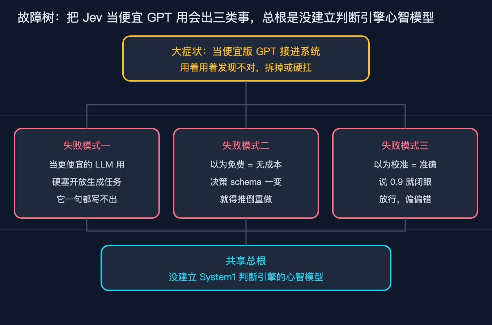

# 跟风把 Jev 当成便宜版 GPT 接进系统，三天后我默默拆了重做

> 系列：AI 基础设施原理 第 31 篇（Jev 原理分析 之一）。视角：有经验的工程师，想把新模型落地的实现者。
> 一句话：Jev 最近很火，但它在架构上和 GPT 这类大模型根本不是一类东西。它是 System1 判断引擎，不是 System2 生成引擎。这篇文章只做一件事，从整体架构出发，把它到底是个什么东西讲清楚，并诚实标注哪些是我能拿到的源码级事实、哪些是外部转述。

## 先说清楚：Jev 到底是个什么

2026 年 9 月 15 日，前 OpenAI 研究员 Diogo Almeida 结束两年隐身，带着他的公司 TypeSafe AI 和第一个产品 Jev 正式亮相。Almeida 不是无名之辈，他是 RLHF（人类反馈强化学习）的共同发明人之一，也是 2022 年 InstructGPT 论文的作者之一，早期深度参与了 GPT-4 的工作。TypeSafe 这轮拿了 DCVC 领投的 4000 万美元种子轮，估值约 2 亿美元。

这件事之所以值得一个做工程的人认真看，不是因为融了多少钱，而是 Jev 的架构反直觉。它不生成任何文本。

你给它一段程序状态 state，加上一个类型化问题，它并行采样、一次查询，返回带校准概率的结构化决策。它的输出只有三种固定形状，叫三个原语：

1. Noul，回答一个是非问题，返回 0 到 1 之间的「是」概率。这个名字是 boolean 反过来拼的，官方 FAQ 自己承认了。
2. Choice，从一组预定义选项里选一个，每个选项带概率和整体置信度，最多 255 个选项。
3. Score，在一个你定义的有序刻度上打一个概率加权分。

这三个原语的细节我放到本系列第二篇逐字段拆，今天这篇先建立整体心智模型，所以只点到名字。

因为根本不解码文本 token，Jev 物理上只能给预定义选项分配概率，所以数学上不可能输出选项之外的东西，也不可能吐出坏 JSON 或者幻觉。TypeSafe 把这点叫零类型错误、零幻觉，本质是 schema 保证，不是它变聪明了。

性能数字方面，官方给出的端到端延迟是 70 到 500 毫秒，输入定价每百万 token 0.042 美元，输出免费。输出免费的原因很硬：它没有逐字生成过程，没什么可计费的。

## 一个必须先讲清的边界：这篇能讲多深

你点进来看标题说「源码级」，我必须先挡一句，免得你被带偏。

Jev 模型本身没有开源。没有架构论文，没有权重，没有自托管入口。所以我不能假装去读它的训练代码或者前向传播源码，那样写出来的东西是编的。

那「源码级」在这个系列里到底落在哪三层，我全部标清楚：

第一层是协议层，这是一手、最硬的。官方 HTTP API 的请求和响应 schema 是 Jev 事实上的接口契约，逐字段讲它，等于读它的公开协议源码。

第二层是 SDK 层，这也是一手。typesafe-sdk 客户端怎么把三个原语封装成代码，这部分有真代码。

第三层是概念架构层，这层不是一手，必须标注。parallel sampler、RLCD 训练目标、typed output graph，来自 TypeSafe 自己的叙述加上 HN 和第三方工程师的重建。我会明确写「这是外部转述、是设计意图，不是 Jev 内部源码」。

所以这一篇讲的是概念架构层和心智模型。这一层是外部转述和设计意图，不等于 Jev 的内部源码。第二篇才落到协议契约和 SDK 真代码。这个边界我写进开头，你读的时候心里有数，不会被「源码级」三个字误导。

## 整体架构：从 System1 和 System2 出发

要理解 Jev 为什么长这样，得从它名字里的 System One 说起。

心理学家 Kahneman 把人的思考分成两套系统。System 1 是快直觉，看一眼就知道这张脸是生气还是开心，不费力、并行、毫秒级。System 2 是慢推理，算一道数学题、规划一条路线，费力、串行、要时间。

Jev 自定位为 System 1，也就是那个快直觉的判断点。LLM 才是 System 2，是那个慢吞吞生成文字、做多步推理的点。

这个定位不是修辞，它直接决定了架构。Jev 干的是「选哪条路、打几分、是不是」这类窄判断，毫秒级、免费、输出只有几个数。LLM 干的是「写一段话、做开放推理」这类生成，秒级、按 token 计费、输出一大篇。

两者是互补关系，不是替代关系。一个 Agent 系统里，真正该让 Jev 干的，是把那些本来要烧一次 LLM 再加一段 JSON 解析重试的判断，抽出来几十毫秒几分钱解决。真正该让 LLM 干的，是那些答案空间事先打不开、必须边想边写的东西。

我举个具体例子。一个反馈信箱分诊系统，每天收到几百封来信，有 bug 报告、有合作询价、有单纯吐槽。你要做的判断是「这封信派给哪个部门、紧急不紧急」。这个判断的答案空间是已知的：部门是工程、商务、运营三选一，紧急是个是非题。这种活 Jev 一次并行就能把三个原语都答了。但如果你要的是「给这封投诉写一封得体的回信」，那答案空间是无限的，必须 LLM 来生成。

把生成和判断混为一谈，是后面所有误用的总根。

## 为什么又快又免费：非自回归加 parallel sampler 是根因

这一段是概念架构层，来源是 TypeSafe 自述加第三方重建，不是一手模型内部，我标在这里。

普通 LLM 是 transformer，但它走的是自回归。自回归的意思是一个字一个字往外蹦，每蹦一个字都要把前面所有字再过一遍前向，而且因为要生成几十上百个 token，这个循环要跑几十上百次。慢和贵都来自这个 decode 循环。更关键的是，这个循环里每一个被生成的 token，在商业上都是一次可计费的产出。

Jev 据公开叙述是 transformer，但放弃了自回归，换成了一个叫 parallel sampler 的东西。它一次前向就把所有原语的答案并行算出来，没有逐字生成的循环。这就是为什么它快：没有循环要跑。也是为什么输出免费：没有逐字生成，就没有可以按 token 计费的东西。

注意这两件事是同一个根因的两面。不是它「便宜所以免费」，而是它的架构里压根没有那个会被计费的生成循环。这一点很重要，因为它决定了 Jev 的能力边界：它只能做那些一次前向就能给出概率分布的判断，做不了需要逐步生成和探索的开放任务。

官方给的数字摆在这里当锚点。延迟 70 到 500 毫秒，输入 0.042 美元每百万 token，输出免费，上下文 32K。这些是一手口径。至于「比前沿 LLM 快 40 到 200 倍、便宜 40 到 400 倍」，那是厂商自报的峰值口径，主页那个 193.6 倍更快、444.6 倍更便宜明确承认是实际上限，不是平均，后面我会再提醒你打折听。

## 命名不是花活：Kahneman 和 Jevons 两层含义

Jev 这个名字和 System One 这个定位，藏着两层含义，理解了能帮你记住它到底新在哪。

第一层是 Kahneman 的双系统。前面讲了，Jev 自认 System 1，是快直觉判断。这是它和 System 2 大模型划清界限的旗号。

第二层是 Jevons。这个名字致敬的是 19 世纪经济学家 William Stanley Jevons。Jevons 当年观察蒸汽机效率提升后，没有让煤耗下降，反而因为变便宜让用途暴涨，这个现象后来被叫 Jevons 悖论。TypeSafe 用 Jev 这个名字，是在暗示同一件事：当「判断」这种智能变得极便宜，它的需求会爆炸式增长，嵌入到一切需要决策的地方。

这两层含义都来自厂商叙事和设计意图，不是独立验证的事实，我标在这里。但它确实是一个有用的记忆钩子：Jev 赌的不是「比 GPT 更聪明」，而是「比 GPT 便宜一百倍地做判断」。

## 故障树：为什么大家会把它用错

我们把「误用 Jev」拆成故障树，方法和这个系列前面几篇一致。

大症状只有一个：把 Jev 当成便宜版 GPT 接进系统，用着用着发现不对，要么像我一样干脆拆掉重做，要么在错误场景里硬扛，白白烧钱或者出事故。

往下拆，有三个失败模式，但其中一个是真正的杀手。

失败模式一，当更便宜的 LLM 用。这是最常见的。有人看它便宜，就把需要开放生成、长文本、多步推理的活硬塞给 Jev，比如让它写文档摘要、生成回复、做开放问答。症状很直接：它一句完整的话都写不出来，因为架构上它就没有生成 token 的能力，它只会往预定义选项上分配概率。解法只有一条：只在答案空间事先已知的窄决策上用它，需要开放推理的活老老实实回退给 LLM。

失败模式二，以为免费输出等于无成本。这个坑藏得深一点。因为输出免费，有人就把所有「判断」任务都泛化到 Jev 上，今天加一个选项、明天改一个 rubric。症状是，一旦你的决策 schema 频繁变化，Jev 的预定义选项和刻度就得跟着重做，而它的 32K 上下文是所有问题共享的请求预算，state 塞太多无关东西精度还会掉。免费的是那几个输出数字，不等于整个决策系统的维护成本免费。解法是把判断任务收敛成固定 schema，把变化的部分留给 LLM 或者代码去处理。

失败模式三，以为校准等于准确。模型说某件事概率是 0.9，你就当它有 90% 把握，结果偏偏放行的那一单错了。校准说的是「模型说 0.9 的那一批，真实命中率大约 0.9」，它描述的是群体层面的诚实度，不是某一个具体判断的对错。单个 0.9 照样可能错。解法是把校准概率接进阈值加分级加人工兜底，而不是当布尔开关闭眼执行。

三个失败模式的共享总根就一句话：没建立「Jev 是 System1 判断引擎、不是 System2 生成引擎」的心智模型。只要你还把它当成「更便宜的会说话的模型」，上面三个坑迟早踩中。我开头说的三天后拆了重做，踩的就是失败模式一，一开始把它当省钱 GPT，接进去发现它根本不说话，才看懂它的真面目。

## 源码级边界：这一篇我到底讲了哪一层

回到开头那个边界声明，这一篇落地的是第三层，也就是概念架构层和心智模型。这一层是外部转述和设计意图，不等于 Jev 内部源码，我必须再强调一次。我没有、也不能编造 Jev 的前向传播或者训练代码。

但你手里已经能拿到两样真东西，可以作为这一篇的源码级佐证，而且都不需要 API key：

一个是协议契约。官方 API 的请求响应 schema 是公开的、确定的，逐字段读它等于读 Jev 的公开协议源码。我在 `code/systemone_contract.py` 里写了一个本地模拟器，严格按官方文档的字段约束实现，能验证一次合法请求长什么样、Noul 响应为什么没有 confidence、Choice 的概率为什么加总为 1。这层是一手事实。

另一个是 SDK 封装。typesafe-sdk 怎么把三个原语包成 `client.system_one(...)` 的调用，有真代码可查。我在第二篇会把它逐行展开。

所以这一篇给你的，是建心智模型加诚实边界。下一篇才把协议契约和三原语逐字段拆开，并用模拟器把协议跑起来。

## 本文不承诺什么

按我自己的写作纪律，这一段必须写，因为 Jev 的叙事里夹了不少需要你打折听的数字：

1. 「快 40 到 200 倍、便宜 40 到 400 倍」是厂商自报的峰值口径，主页那个 193.6 倍更快、444.6 倍更便宜明确承认是实际上限，不是平均。独立测试（Every 的单任务提取）是 25 倍更快、580 倍更便宜，量级方向一致但场景单一。
2. 「零幻觉、零类型错误」是 schema 数学保证，指的是它物理上吐不出选项之外的结构，不等于它判断得对。它照样可以把危险调用判成安全。
3. 自报的 67.8% 工作流准确率，参考答案是 GPT-6 Astra 和 Claude Fable 5.1 的平均值，不是独立真值，不能直接读成「这类任务上它有 67.8% 准确率」。
4. 校准是群体诚实度，不是单个判断的保证。独立开发者 Lindfors 的检查显示方向正确但两端略保守，不能据此闭眼自动执行。
5. 非自回归加 parallel sampler 加 RLCD 训练目标，截至 2026 年 9 月没有公开技术论文，来自官方博客和文档加第三方重建，外部不可独立验证。
6. 命名里 Kahneman 双系统和 Jevons 悖论两层含义，来自厂商叙事，不是独立验证的事实。

我在这篇文章里没有承诺任何收益百分比，只建立了心智模型，并把能讲和不能讲的边界讲清。

## 参考来源

一手来源，厂商官方口径：

- TypeSafe AI 官方发布博文（2026-09-15，typesafe.ai）：发布 System One Models 与 Jev，含定价 0.042 美元每百万输入 token、输出免费、端到端 70 到 500 毫秒、并行采样与 RLCD 训练目标。
- TypeSafe 官方文档与控制台（docs.typesafe.ai、console.typesafe.ai）：Choice、Score、Noul 三类原语、状态与问题共享的上下文预算、以及「阈值取决于你的领域、高置信才直接执行」的官方建议。
- Vercel AI Gateway 上架页 typesafe-ai/jev（2026-09-16）：Vercel 自报用它替换原模型做命令安全分类后 p95 快 5 到 18 倍。
- OpenRouter 的 TypeSafe 页：Jev Latest 与 Jev 1.13 于 2026-09-18 上架，走独立的 decisions 端点而不是 chat completions。

独立验证，非厂商口径：

- Every（2026-09-15）：用 Jev 跑了 777 次判断，不到 0.7 秒、约四分之一美分；单次中位 0.35 秒，对照前沿 LLM 是 8.83 秒；7 个植入缺陷检出 6 个，对照模型 7 个全中。
- lindfors.no（独立开发者 Emil Lindfors）：24 篇挪威咨询文档、192 个是非判断按 Jev 给出的概率分箱，0.7 到 0.9 这一档与参考 97% 一致，而真正校准的模型在这一档应该落在 80% 附近，两端略欠自信；同一个区间里 DeepSeek 开推理时只有 48% 一致。
- Bryo AI：邮件分类场景精度略低于 Gemini，成本低 10 到 20 倍。
- 开发者 AlexKim 的 16 模型校准横评（2026-09 中旬）：Jev 准确率只排第 10，但 455 毫秒是 16 个里最快，落在模糊区间 0.35 到 0.65 的占比 34.7%。
- NearHere（英国活动站点）的 listing 审核对比：Jev 96% 对 Gemini Flash-Lite 86%，单次决策便宜 58 倍。

概念架构与命名，明确标注非一手模型内部：

- 非自回归加 parallel sampler、RLCD 作为继 RLHF 和 RLVR 之后的第三条强化学习路线、typed output graph 的 schema 安全设计，来自 TypeSafe 官方自述加 Hacker News 和第三方工程师的重建，截至 2026 年 9 月无公开架构论文，不能当作 Jev 内部实现来读。
- System One 命名致敬 Kahneman 双系统、Jev 命名致敬 Jevons 悖论，来自厂商叙事，非独立验证。

背景报道：

- TechCrunch、The Register、InfoWorld 对 2026-09-15 发布及 DCVC 领投 4000 万美元种子轮的报道，创始人 Diogo Almeida 的前 OpenAI 研究员身份与 InstructGPT 论文署名同源可核。
- 新浪财经 2026-09-21：Jev 全面开放注册，新用户获 5 美元额度，无需候补名单。
- Hacker News 首日 256 条评论，主流看法是「很强的零样本分类与路由引擎，叫前沿模型属于过誉」。

## 收束

Jev 这类模型，火的点不在于它比 GPT 更聪明，而在于它把「判断」这件事从 LLM 的慢生成循环里抽了出来，做成了一个毫秒级、几乎不要钱、还带校准概率的零件。它是 System1 判断引擎，不是 System2 生成引擎。

我开头说跟风把它当便宜 GPT 接进系统、三天后拆了重做，根子就在没建立这个心智模型。一旦你把它放回「窄决策」的位置，它立刻好用：路由、门控、分类、打分，这些答案空间已知的活，本来就要烧一次 LLM 再加一段解析重试，现在几十毫秒几分钱就解决了。

记住一句话就好：Jev 干窄决策，LLM 干生成和开放推理，两者互补，不是替代。

## 结尾钩子

回到标题里那个场景。你有没有也把 Jev 当成便宜版 GPT 接过？是接进去发现它压根不说话，还是在某个场景里硬扛了很久才看懂它的真面目？把你的事故或者反转发我，评论区或者私信都行。

这类例子攒得够多，下一篇我就直接把官方 API 契约和三原语逐字段拆开，并用 `code/systemone_contract.py` 这个本地模拟器把协议跑起来，不用 API key 也能看到一次合法请求和响应到底长什么样。

## 本篇做了什么，对哪些人有用

用 Jev 这个热点作切入点，只做一件事：从整体架构出发，把它到底是 System1 判断引擎还是 System2 生成引擎讲清楚。拆了命名的两层含义（Kahneman 双系统加 Jevons 悖论）、快与免费的根因（非自回归加 parallel sampler）、以及误用的三类故障树（当便宜 LLM 用、以为免费等于无成本、以为校准等于准确），共享总根是没建立 System1 判断引擎的心智模型。通篇标注了源码级边界：模型未开源，能讲透的只有协议契约、SDK 封装、概念架构三层，并已区分一手和转述。给了四张手写配图、两个可运行脚本（协议契约模拟器加心智模型路由，都含 self-test、都不需要 API key）、以及分一手、独立、厂商自报、背景四类列清的参考来源，并在文末写了「本文不承诺什么」。

这篇对这几类人有用：想接 Jev 落地的工程师，正在搭 Agent 工具层、需要给判断任务选模型的实现者，被「便宜 GPT」叙事吸引、想看懂它到底新在哪的读者，以及做技术选型、需要分清「判断」和「生成」边界的技术负责人。
