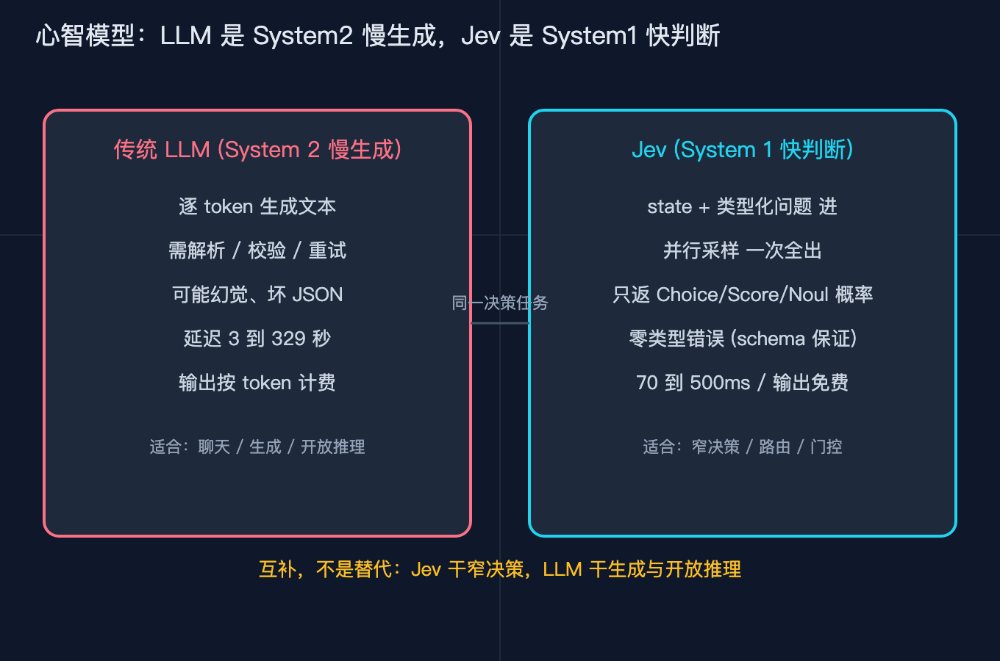
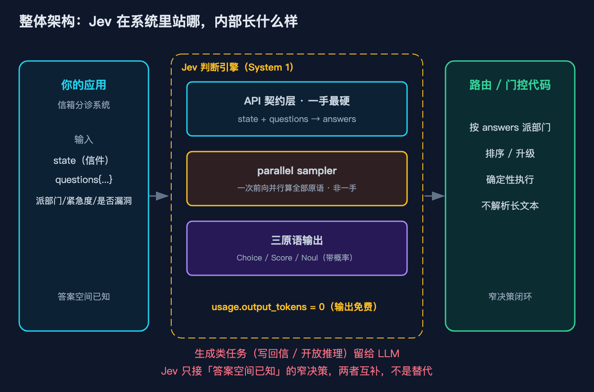
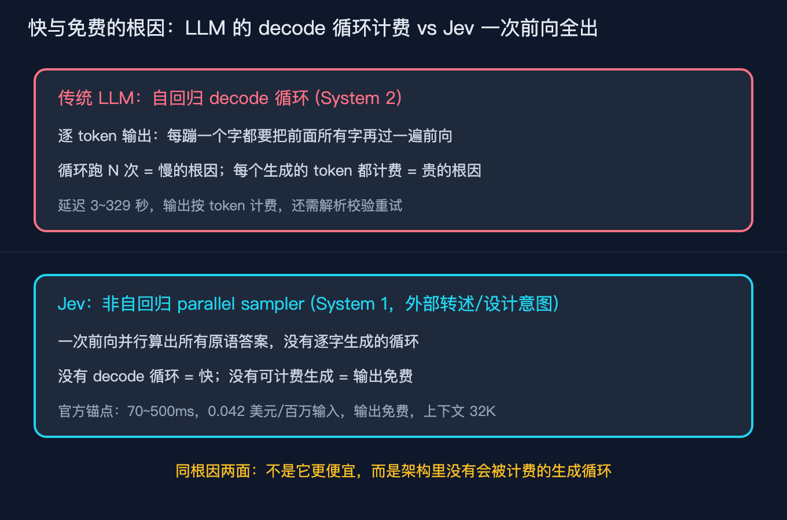
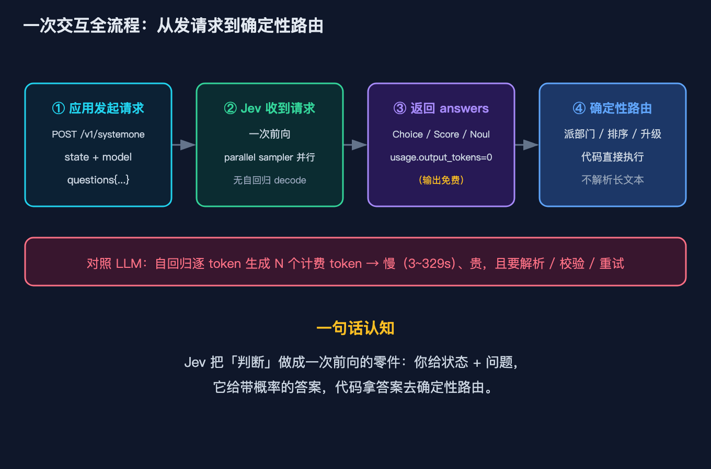
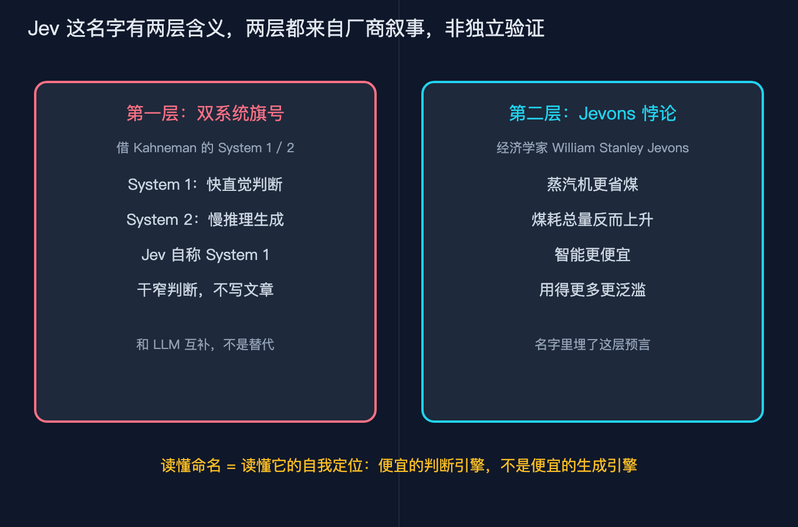

# 跟风把 Jev 当成便宜版 GPT 接进系统，三天后我默默拆了重做

> 系列：AI 基础设施原理 第 31 篇（Jev 原理分析 之一）。视角：有经验的工程师，想把新模型落地的实现者。
> 一句话：Jev 最近很火，但它在架构上和 GPT 这类大模型根本不是一类东西。我用它踩了三天坑才看懂：它是 System1 判断引擎，不是 System2 生成引擎。这篇文章不堆术语，就从我那次翻车讲起，把整体架构和一次交互到底发生了什么拆开，目标是让一个没听过 Jev 的人读完，能原样讲给另一个人听。

## 先把我那次翻车讲清楚

2026 年 9 月 15 日，前 OpenAI 研究员 Diogo Almeida 结束两年隐身，带着公司 TypeSafe AI 和第一个产品 Jev 正式亮相。Almeida 不是无名之辈，他是 RLHF 的共同发明人之一，也是 2022 年 InstructGPT 论文的作者之一，早期深度参与了 GPT-4 的工作。TypeSafe 这轮拿了 DCVC 领投的 4000 万美元种子轮，估值约 2 亿美元。

我看到这个新闻的第一个反应和你一样：又来一个便宜大模型，先接进来试试。当时我手头正好有个反馈信箱分诊的活，每天几百封来信要分到工程、商务、运营几个部门，还要标一下紧急程度。我想都没想，直接把 Jev 当成便宜版 GPT 塞了进去，让它在收到每封信时跑一遍，给出分诊结果。

第三天我把它拆了重做。

因为我发现它根本不说话。我期待的是一段可分诊的回复，或者至少一段 JSON，结果它返回给我的，是一组带概率的数字：这封信属于 tech 的概率是 0.47，属于 billing 是 0.21，属于 sales 是 0.32；紧急程度在一个 0 到 2 的刻度上打了 0.58 分；至于「这算不算漏洞报告」，它给了一个 0.013 的是概率，没有任何多余的解释。

那一刻我才真正看懂 Jev 是什么。它不是会写字的模型，它是一个判断引擎。

这个故事就是整篇文章的线索。下面每一个原理，我都不从定义讲起，而是从「我那天到底看到了什么」讲起。



## 先把地图铺开：Jev 在系统里站哪

讲原理之前，先给你一张整体架构图，免得后面钻进细节就出不来。这张图是整篇文章的索引。



从图里看，一次分诊或者说一次判断，流过四个角色：

最左边是你的应用，比如我那个信箱分诊系统。它手里是状态（state，也就是那封来信的全文），和一组问题（questions，比如派哪个部门、急不急、是不是漏洞）。注意一个前提：这些问题答案空间必须是已知的，派部门就是三选一，急不急就是 0 到 2 的刻度，是不是漏洞就是个是或否。

中间是 Jev 判断引擎，也就是 System 1。它内部我拆成三层，这张图把后面要讲的内容都预告了：最上面是 API 契约层，一手、最硬，就是 state 加 questions 进、answers 出；中间是 parallel sampler，概念架构层、非一手，负责一次前向并行算出全部原语；最下面是三原语输出，Choice、Score、Noul，全都带概率。底下那行黄字是重点：它的输出 output_tokens 是 0，也就是免费。

最右边是路由和门控代码。它不做任何判断，只是拿着 Jev 给的答案去执行：派到工程队列、按紧急度排序、要不要升级。它不解析长文本，因为根本就没有长文本可解析。

图底部那行红字是整篇的题眼：生成类的活（写回信、做开放推理）留给 LLM，Jev 只接答案空间已知的窄决策，两者互补，不是替代。我那次翻车，就是把右边 LLM 的活硬塞进了中间的 Jev。

## 原理一：Jev 不说话，因为它只做判断

我那天看到的三种返回形状，官方叫三个原语：

1. Choice，从一组预定义选项里选一个，每个选项带概率，最多 255 个选项。我看到的部门分诊就是它。
2. Score，在一个你定义的有序刻度上打一个概率加权分。我看到的紧急程度就是它，而且那个 0.58 是落在刻度之间的，不是非 0 即 1。
3. Noul，回答一个是非问题，返回 0 到 1 之间的「是」概率。这个名字是 boolean 反过来拼的，官方 FAQ 自己承认了。我看到的「是不是漏洞报告」就是它，而且注意，它只返回一个数字，没有 confidence 字段。

关键点在这里：因为它物理上只往预定义选项上分配概率，所以它数学上不可能输出选项之外的东西，也不可能吐出坏 JSON 或者幻觉。TypeSafe 把这点叫零类型错误、零幻觉，本质是 schema 保证，不是它变聪明了。

这就回到 Kahneman 的双系统。Jev 自定位为 System 1，也就是那个快直觉的判断点：看一眼就知道这张脸是生气还是开心，不费力、并行、毫秒级。LLM 才是 System 2，是那个慢吞吞生成文字、做多步推理的点。

我那次翻车，根子就是没建立这个心智模型，把 System 2 的活（生成分诊说明、写回复）硬塞给了一个 System 1 引擎。它干的是「选哪条路、打几分、是不是」这类窄判断，毫秒级、免费、输出只有几个数。LLM 干的是「写一段话、做开放推理」这类生成，秒级、按 token 计费、输出一大篇。两者互补，不是替代。

所以我后来把架构改成了这样：Jev 只负责那几个答案空间已知的窄判断（派哪个部门、急不急、是不是漏洞），需要写回复的部分老老实实回退给 LLM。一段本来要烧一次 LLM 再加一段 JSON 解析重试的判断，现在几十毫秒几分钱解决。

## 原理二：账单上 output_tokens 是 0，这就是它免费又快的真相

翻车的第三天，我去翻调用账单，想看看这次重做到底省了多少。结果看到一个让我愣住的数字：Jev 每一次返回，usage 里的 output_tokens 都是 0。

普通 LLM 是 transformer，但它走的是自回归。自回归就是一个字一个字往外蹦，每蹦一个字都要把前面所有字再过一遍前向，要生成几十上百个 token，这个循环就跑几十上百次。慢和贵都来自这个 decode 循环，而且循环里每一个被生成的 token，在商业上都是一次可计费的产出。

Jev 据公开叙述也是 transformer，但放弃了自回归，换成了一个叫 parallel sampler 的东西。它一次前向就把所有原语的答案并行算出来，没有逐字生成的循环。这就是为什么它快：没有循环要跑。也是为什么输出免费：没有逐字生成，就没有可以按 token 计费的东西。

这一段我必须标清楚来源：非自回归加 parallel sampler 是概念架构层，来自 TypeSafe 自述加第三方重建，不是一手模型内部，不能当作 Jev 的内部源码来读。

注意这两件事是同一个根因的两面。不是它「便宜所以免费」，而是它的架构里压根没有那个会被计费的生成循环。这一点决定了能力边界：它只能做那些一次前向就能给出概率分布的判断，做不了需要逐步生成和探索的开放任务。我手里那段「不会说话」的经历，本质是同一个边界的两种说法。

官方给的锚点数字：延迟 70 到 500 毫秒，输入 0.042 美元每百万 token，输出免费，上下文 32K。这些是厂商一手口径。至于「比前沿 LLM 快 40 到 200 倍、便宜 40 到 400 倍」，那是峰值口径，主页那个 193.6 倍更快、444.6 倍更便宜明确承认是实际上限，不是平均，后面复现模块我会再提醒你打折听。



## 一次交互全流程：从发请求到确定性路由

原理讲完了，我把一次真实的信箱分诊请求从头到尾走一遍。你要给别人讲 Jev，把这一节讲清楚就够了。



第一步，应用发起请求。我用的是官方那个端点，POST 到 /v1/systemone，请求体里三样东西：state 是那封来信的全文，model 填 jev-latest，questions 是我定义的那三个问题。department 是个 Choice，选项是 tech、billing、sales；urgency 是个 Score，刻度 0 是平静、1 是着急但克制、2 是非常愤怒；is_vuln 是个 Noul，问这封是不是漏洞报告。

第二步，Jev 收到请求。注意这里没有「等它一个字一个字吐」。它做一次前向，parallel sampler 把三个原语的答案并行算出来，全程没有自回归的 decode 循环。这就是它快的根。

第三步，返回 answers。我实际拿到的是：department 选了 tech，三个概率加总正好为 1；urgency 落在 0.58，在刻度之间；is_vuln 是 0.013 这一个数字，没有 confidence。usage 里 input_tokens 是那封信的 token 数，output_tokens 是 0。零输出费就是这一步的硬证据。

第四步，确定性路由。我的代码不解析任何长文本，而是直接按 answers 执行：department 是 tech，把这封丢进工程队列；urgency 0.58，按中等紧急度排序；is_vuln 0.013，远低于我设的升级阈值（比如 0.5），所以不升级、不惊动安全团队。整个判断从发请求到路由完成，几十毫秒、几分钱。

对照一下你熟悉的 LLM 流程：同样这个分诊，用 LLM 你会让它生成一段 JSON，它自回归地吐出 N 个 token，每个 token 都计费，然后你还要解析、校验、在格式崩了时重试。慢，3 到 329 秒都有可能；贵，而且脆。图里那条红底的字就是对照：Jev 把判断做成一次前向的零件，你给状态加问题，它给带概率的答案，代码拿答案去路由。

## 顺带说一句：Jev 这个名字的两层含义

讲完架构和一次交互，插一句命名，因为它帮你记住 Jev 到底新在哪。

第一层是 Kahneman 的双系统。前面讲了，Jev 自认 System 1，是快直觉判断，这是它和 System 2 大模型划清界限的旗号。

第二层是 Jevons。这个名字致敬 19 世纪经济学家 William Stanley Jevons。Jevons 当年观察蒸汽机效率提升后煤耗不降反升，因为变便宜让用途暴涨，这个现象后来叫 Jevons 悖论。TypeSafe 用 Jev 这个名字，是在暗示同一件事：当「判断」这种智能变得极便宜，它的需求会爆炸式增长，嵌入到一切需要决策的地方。

这两层含义都来自厂商叙事和设计意图，不是独立验证的事实。但它确实是个有用的记忆钩子：Jev 赌的不是「比 GPT 更聪明」，而是「比 GPT 便宜一百倍地做判断」。



## 一个必须先讲清的边界：这篇能讲多深

你在标题里看到「源码级」，我得挡一句，免得你被带偏。

Jev 模型本身没有开源。没有架构论文，没有权重，没有自托管入口。所以我不能假装去读它的训练代码或者前向传播源码，那样写出来的东西是编的。

那「源码级」在这个系列里落在哪三层，我全部标清楚：

第一层是协议层，一手、最硬。官方 HTTP API 的请求和响应 schema 是 Jev 事实上的接口契约，逐字段讲它等于读它的公开协议源码。

第二层是 SDK 层，一手。typesafe-sdk 客户端怎么把三个原语封装成代码，这部分有真代码。

第三层是概念架构层，非一手，必须标注。parallel sampler、RLCD 训练目标、typed output graph，来自 TypeSafe 自述加 HN 和第三方工程师的重建。

所以这一篇落地的是第三层加心智模型。这一层是外部转述和设计意图，不等于 Jev 内部源码。下一篇才落到协议契约和 SDK 真代码。这个边界写进开头，你读的时候心里有数。

## 复现模块：不用 API key，把协议和路由跑起来

讲完原理，给你能直接上手的东西。我把这篇用到的两个脚本都放进了代码仓库，纯标准库、不需要 API key、都带 self-test，你拉下来就能跑。

代码地址：
https://github.com/beverlyLee/ai-passage/tree/main/2026-09-23-Jev原理分析-架构总览

数据源地址（一手协议契约，所有字段约束都来自这里）：
https://docs.typesafe.ai

怎么跑：

```
cd 2026-09-23-Jev原理分析-架构总览/code
python3 systemone_contract.py   # 协议契约模拟器，会先跑 self-test 再给 demo
python3 mental_model.py         # System1/System2 路由与成本延迟对比
```

systemone_contract.py 是一个严格按官方文档字段约束写的本地模拟器，它不调真接口，但能验证一次合法请求长什么样。你跑起来会看到：

```
self-test PASS: 协议契约的形状与错误码均符合官方文档
------------------------------------------------
model=jev-1.13.0  usage={'input_tokens': 46, 'output_tokens': 0}
department.choice        = tech
department.probabilities = {'billing': 0.2065, 'tech': 0.4724, 'sales': 0.3211}
urgency.score            = 0.584  legend={'0': '平静陈述', '1': '着急但克制', '2': '非常愤怒'}
is_vuln.noul             = 0.0132  (无 confidence)
```

注意三个我在这篇文章里反复强调的点，在输出里都能直接验证：Noul 只有 noul 一个数字，没有 confidence；Choice 的三个概率加总正好等于 1；usage 里的 output_tokens 是 0，这就是它免费的硬证据。

mental_model.py 把 System1 和 System2 的路由逻辑和成本延迟对比跑出来。你会看到：

```
self-test PASS: System1/System2 路由与成本/延迟方向均成立
------------------------------------------------
任务路由示例：
  写一封投诉回信                -> LLM
  信派给哪个部门(3选1)           -> JEV
  紧急程度打分(0~2)            -> JEV
  判断这封是不是漏洞报告            -> JEV

同一窄决策：Jev vs LLM（1 个原语）
  JEV  : 成本 $0.000008  延迟 285ms
  LLM  : 成本 $0.002000  延迟 8830ms

parallel sampler：3 个原语合并为一次 Jev 调用 vs 3 次 LLM 生成
  JEV x3 原语: 成本 $0.000008  延迟 285ms  (≈1次调用)
  LLM x3 决策: 成本 $0.006000  延迟 26490ms
```

这个对比把两个原理钉死了：Jev 又快又便宜，而且因为 parallel sampler，三个原语合并成一次调用，成本几乎不随原语数量增加，而 LLM 每多一次决策就多一次生成成本。上面这些数字是我脚本里的一组示意参数（输入 200 token、LLM 单次决策 8.83 秒、单次决策输出成本约 0.002 美元），方向真实、量级和独立测试一致，但别拿去当精确基准，厂商峰值口径更要打折听。

## 参考来源

一手来源，厂商官方口径：

- TypeSafe AI 官方发布博文（2026-09-15，typesafe.ai）：发布 System One Models 与 Jev，含定价 0.042 美元每百万输入 token、输出免费、端到端 70 到 500 毫秒、并行采样与 RLCD 训练目标。
- TypeSafe 官方文档与控制台（docs.typesafe.ai）：Choice、Score、Noul 三类原语、状态与问题共享的上下文预算、以及「阈值取决于你的领域、高置信才直接执行」的官方建议。
- Vercel AI Gateway 上架页（2026-09-16）：自报用它替换原模型做命令安全分类后 p95 快 5 到 18 倍。
- OpenRouter 的 TypeSafe 页：Jev Latest 与 Jev 1.13 于 2026-09-18 上架，走独立的 decisions 端点而不是 chat completions。

独立验证，非厂商口径：

- Every（2026-09-15）：跑 777 次判断，不到 0.7 秒、约四分之一美分；单次中位 0.35 秒，对照前沿 LLM 是 8.83 秒；7 个植入缺陷检出 6 个。
- lindfors.no（独立开发者 Emil Lindfors）：192 个是非判断按概率分箱，0.7 到 0.9 一档与参考 97% 一致，而真正校准的模型这一档应落在 80% 附近，两端略欠自信。
- Bryo AI：邮件分类场景精度略低于 Gemini，成本低 10 到 20 倍。
- 开发者 AlexKim 的 16 模型校准横评（2026-09 中旬）：Jev 准确率排第 10，但 455 毫秒是 16 个里最快。

概念架构与命名，明确标注非一手模型内部：

- 非自回归加 parallel sampler、RLCD、typed output graph 的 schema 安全设计，来自 TypeSafe 官方自述加 Hacker News 和第三方重建，截至 2026 年 9 月无公开架构论文，不能当作 Jev 内部实现来读。
- System One 命名致敬 Kahneman 双系统、Jev 命名致敬 Jevons 悖论，来自厂商叙事，非独立验证。

背景报道：

- TechCrunch、The Register、InfoWorld 对 2026-09-15 发布及 DCVC 领投 4000 万美元种子轮的报道，创始人 Diogo Almeida 的前 OpenAI 研究员身份与 InstructGPT 论文署名同源可核。
- Hacker News 首日 256 条评论，主流看法是「很强的零样本分类与路由引擎，叫前沿模型属于过誉」。

## 收束

回到我那次翻车。Jev 这类模型火的点，不在于它比 GPT 更聪明，而在于它把「判断」这件事从 LLM 的慢生成循环里抽了出来，做成了一个毫秒级、几乎不要钱、还带校准概率的零件。它是 System1 判断引擎，不是 System2 生成引擎。

我三天后拆了重做，根子就在没建立这个心智模型。一旦你把它放回「窄决策」的位置，它立刻好用：路由、门控、分类、打分，这些答案空间已知的活，本来就要烧一次 LLM 再加一段解析重试，现在几十毫秒几分钱就解决了。

记住一句话就好：Jev 干窄决策，LLM 干生成和开放推理，两者互补，不是替代。

## 如果你要把它讲给别人听

如果你读完要给同事或者朋友讲清楚，照这三句背就行，不用记参数：

第一句，Jev 不是会写字的 GPT，它是一个只做判断的引擎。你给它一段状态（比如一封信）和几个答案空间已知的问题（派哪个部门、急不急、是不是漏洞），它回你几个带概率的数字，不吐一个字。

第二句，它又快又免费的根因是同一个：它不做逐字生成，一次前向就把所有答案并行算出来，所以没有可计费的输出，也就没有那个慢的 decode 循环。

第三句，它和 LLM 是互补不是替代。LLM 负责写和推理，Jev 负责选、打分、判断是不是，把 Jev 当便宜 GPT 用必翻车，把它放回窄决策的位置就立刻好用。

把这三句加上开篇那个「不说话」的故事，对方基本就能原样讲给下一个人了。

## 结尾钩子

回到标题里那个场景。你有没有也把 Jev 当成便宜版 GPT 接过？是接进去发现它压根不说话，还是在某个场景里硬扛了很久才看懂它的真面目？把你的事故或者反转发我，评论区或者私信都行。

这类例子攒得够多，下一篇我就直接把官方 API 契约和三原语逐字段拆开，并用 code/systemone_contract.py 这个本地模拟器把协议跑起来，不用 API key 也能看到一次合法请求和响应到底长什么样。
