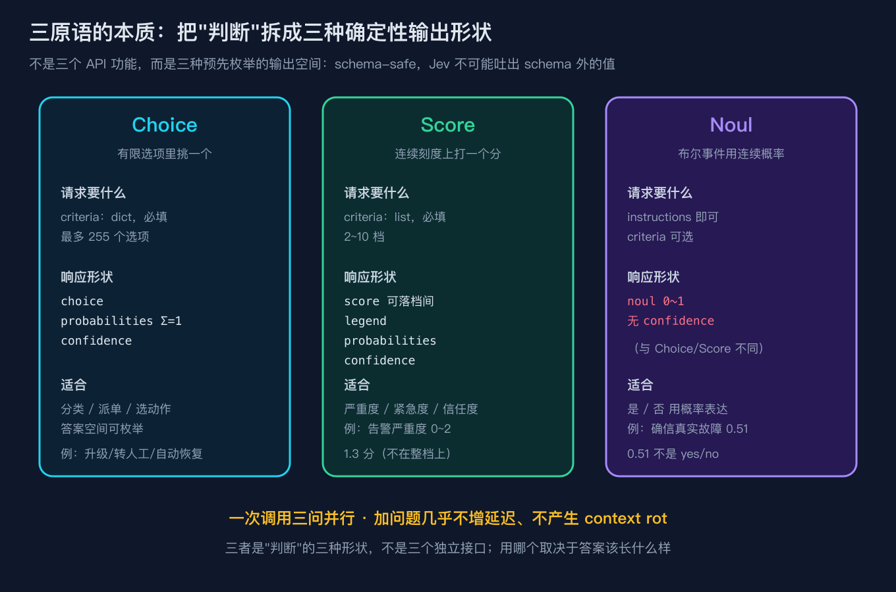
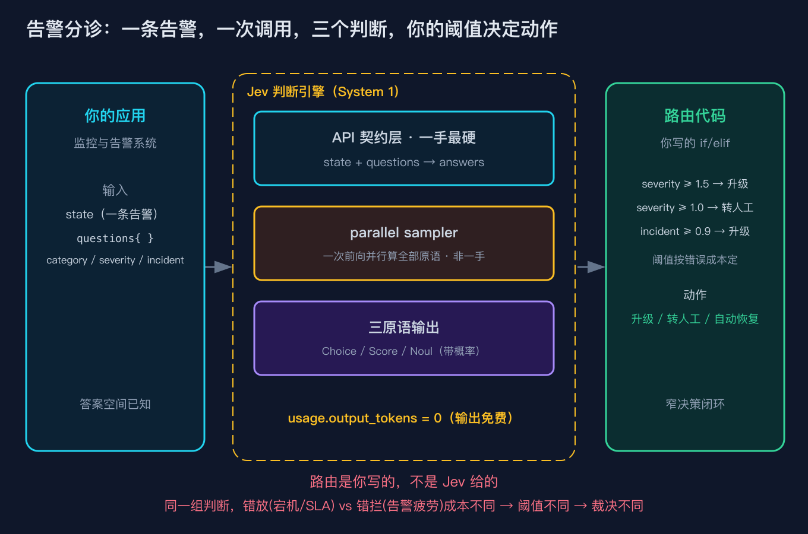

# 给告警加了道 AI 初筛，它说严重度 1.3 分、确信真故障 0.51，我半夜不用爬起来了

## 凌晨三点的一条告警

上周三凌晨 03:14，我手机被监控叫醒。node-07 这台机器，CPU 持续 97%，磁盘 IO 等待飙升，而且同一时刻三个探针一起报了红。

按老规矩，多条探针同时爆红，值班第一反应就是"要出事了"。我爬起来连 VPN、拉日志、看大盘，折腾到快四点，最后发现业务 QPS 一点没掉，错误率平平稳稳。就是有个离线批处理任务在跑，把 CPU 和磁盘打满了。虚惊一场。

问题不在这一条。问题是这套告警一周要叫醒我好几次，十次里有几次是真事故，我事先根本分不清。全信它，我天天顶着黑眼圈；全不信它，哪天真宕机了，我会是最后一个知道的。

我先试了加规则。CPU 超过 90% 就升级？批处理一跑就误报。三探针同红就升级？就像今晚这样，它照样误报。规则越加越多，误报没少多少，规则表倒是没人敢动了，谁也不知道删掉哪条会不会漏掉真事故。

然后我试了接大模型，让它给个判断。它回来一段话："这条告警显示资源使用率偏高，可能存在潜在故障风险，建议进一步观察。" 这段话我怎么写进 if 语句？总不能正则在里面抓"偏高"两个字。更要命的是，它下次可能换个说法，我的下游代码就跟着崩。

我被卡在中间：规则写不死，自由文本又接不住。

后来我把这道告警初筛重写在了 Jev 上（TypeSafe 出的那个判断引擎，系列第一篇讲过它是 System 1 判断层，不是 System 2 生成层）。重写之后，那条凌晨三点的告警，Jev 给我的不是一段话，而是三个形状固定、可以直接进 if 语句的返回值：告警归类是个枚举，严重度是个 0 到 2 之间的数，确信是真故障是个 0 到 1 之间的概率。

这一篇我想讲清楚的就是：Choice、Score、Noul 这三个东西，本质不是"三个 API 功能"，而是"判断"在数学上被拆成的三种确定性输出形状。你选哪个，取决于你想要的答案该长什么样。下面用这条告警把这三个形状摊开。

## 它一次返回了三种形状

我把那条告警喂给 Jev，一次调用问了三个问题。返回的 answers 长这样（这是本地模拟器跑出来的真实数字，seed 固定，后面复现模块会给你完整命令）：

```
alert_category.choice = hardware
alert_category.probs  = {'net': 0.0839, 'hardware': 0.3503, 'capacity': 0.3225, 'normal': 0.2433}
severity.score        = 1.326  legend={'0': '低', '1': '中', '2': '高'}
is_incident.noul      = 0.5125  (无 confidence)
```

第一个叫 alert_category，是 Choice。它在四个预设类别里选了一个：hardware，也就是硬件故障。注意它还附了一组概率，四种类别的概率加起来正好等于 1。它告诉你"最像硬件故障，但也有三成多像容量压力，两成多像正常波动"。这种"有限选项里挑一个、再给一份信心分布"的形状，就是 Choice。

第二个叫 severity，是 Score。它没落在某个整数档上，而是落在了 1.326。我给它设了三个档：0 低、1 中、2 高。1.326 的意思是在"中"和"高"之间偏中。这种"连续刻度上打一个可落档间的分"的形状，就是 Score。

第三个叫 is_incident，是 Noul。它只回了一个数 0.5125，表示"确信这是一次真实故障"的概率是五成出头。它没有任何 confidence 字段。这种"是否事件用连续概率表达"的形状，就是 Noul。

把这三个形状摆在一起看，你大概能感觉到了：它们长得完全不一样。



Choice 给你一个枚举加概率分布；Score 给你一个可落档间的连续分；Noul 给你一个光秃秃的概率，连信心值都不带。这就是三原语最表层的样子。下面我把它往深里讲。

## 三原语的本质：是判断的三种形状，不是三个接口

很多人第一次看 Jev 的文档，会以为 Choice、Score、Noul 是三个不同的 API 功能，像"分类接口""打分接口""预测接口"那样。这个理解一开始就歪了。

它们其实是把"判断"这件事，在数学上拆成的三种输出形状。判断这件事，落到计算机里无非问三种问题：答案是不是有限可枚举的几个（Choice），答案是不是一个连续刻度上的位置（Score），答案是不是一个是否事件的概率（Noul）。Jev 把这三种形状做成了协议里的一等公民。

为什么要这么拆，而不是给一个大模型让它自己决定返回什么？关键在于输出空间预先枚举、schema-safe。

以 Choice 为例，你在请求里用 criteria 把选项写死（最多 255 个）。Jev 的返回里，choice 只能是你给过的某一个键，probabilities 之和必须为 1。这意味着什么？意味着你下游的路由代码永远不可能收到一个你没列过的类别。你不用写"如果来了个我认识不了的类别怎么办"，因为它物理上不会出现。

Score 同理。你在 criteria 里给 2 到 10 个档，返回的 score 必然落在 0 到（档数减 1）之间，而且可以落在档与档之间（比如 1.326）。你不用防"分超出了我的刻度"，因为它超不出去。

Noul 更干脆。它只返一个 0 到 1 的数，连 confidence 都不给（这点下面会专门讲为什么）。你拿到手就是一个概率，直接拿去和你的阈值比。

这种"输出空间被协议钉死"的性质，就是 schema-safe。它带来的最大好处不是省 token（虽然也省），而是让"判断"这件事可以安全地交出去，而"决策"这件事牢牢攥在你手里。判断和决策是两件事：判断是"这条告警有多像真故障"，决策是"那我半夜叫不叫人"。Jev 只做前者，形状固定；后者是你用 if/elif 写的确定性路由。

所以这一篇的核心一句话：三原语不是三个功能，而是三种预先枚举的输出空间；用哪个，取决于你想要的答案该长什么样；而拿到答案之后怎么裁决，永远是你的代码。

你可以对比一下，如果换成一个会自由回答的模型，你的下游要写成什么样。你得先指望它返回一段能解析的结构，最好是个 JSON，然后 try 起来解析，再判断返回的类别在不在你允许的清单里，不在就兜底；概率字段可能缺失，缺失又要兜底；它还可能偶尔冒出"建议进一步观察"这种你压根没列过的类别。这些兜底代码每一个都是潜在的崩溃点和误判点，而且你写完之后永远不放心，因为模型下次可能换个写法。而 Jev 把"类别必在我列的清单里、概率必齐、求和必为 1"钉进了协议层，你那段 if/elif 从头到尾不用写一行兜底，因为它物理上不会给你意外。这一来一回，差的不是几行代码，是你能不能睡个整觉。

## 把请求和响应摊开来读

光说形状太虚，我把告警初筛这一条告警的完整请求和响应摊开。下面这段是本地模拟器（没有真的打 API，但字段约束严格按官方文档写），真实跑出来的：

请求是三个问题挂在一个 questions 字典下，外加这条告警的 state：

```
state = "告警：node-07 在 03:14 触发，CPU 持续 97%、磁盘 IO 等待飙升、
         同一时刻三个探针同时报红，但业务 QPS 未见明显下滑、错误率平稳"

questions = {
    "alert_category": Choice(instructions="这条告警最像哪类问题",
                             criteria={"net": "网络抖动", "hardware": "硬件故障",
                                       "capacity": "容量压力", "normal": "正常波动"}),
    "severity": Score(instructions="严重度（0=低，2=高，可落档间）",
                      criteria=["低", "中", "高"]),
    "is_incident": Noul(instructions="这是否为一次真实故障"),
}
```

响应顶层带了 model 和 usage：

```
model=jev-1.13.0  usage={'input_tokens': 23, 'output_tokens': 0}
```

这里有个很容易被忽略、但特别关键的事实：output_tokens 是 0。Jev 的判断不走自回归生成，返回的那些概率和分数是 sampler 一次前向算出来的，没有逐 token 输出。所以输出免费，账单里只计输入的 token。我那条告警 23 个输入 token，输出记 0。如果你习惯按"输出多少字"估成本，这套心智要改过来。

回到三个答案。alert_category 选了 hardware（硬件故障），概率分布是网络 0.084、硬件 0.350、容量 0.323、正常 0.243。你可以读出两层信息：它最倾向于硬件故障，但容量压力和正常加起来也有五成多，所以它并不笃定。

severity 落在 1.326。对照 legend，0 是低、1 是中、2 是高，1.326 就是"中偏高、还没到高"。这正是 Score 和 Choice 的区别之一：Choice 只给你离散的几个类别，Score 给你一个可以落在档间的连续量，适合表达"到什么程度"。

is_incident 是 0.5125。注意括号里那句（无 confidence）。Choice 和 Score 都带 confidence（就是它们概率分布里最大的那个），Noul 偏偏不带。为什么？因为 Noul 本身就是对"是否事件"的直接概率估计，那个 0.5125 已经是一个校准过的概率，再叠一层"我对这个概率有多自信"在语义上是冗余的，甚至可能诱导你做二次加权。Jev 的设计选择是：Noul 就只给一个裸概率，干干净净。这点下面讲误用时会再提。

## 一次调用，三问并行，几乎不增延迟

上面那三个问题是一次调用里一起问的。这不是我发了三个请求，是 questions 这个 map 里挂了三个键，Jev 一次前向把三个都算了。

这件事的意义比看起来大。如果你用传统大模型，每多问一个问题，要么多发一次请求（多一份网络往返和延迟），要么在 prompt 里多塞一句话（上下文变长，token 变多，而且模型可能前后矛盾）。Jev 的 parallel sampler 是一次性把多个原语在同一个前向里算出来，加一个问题几乎不增加延迟，也不会因为上下文变长产生"前面说的和后面说的对不上"那种 context rot。

对我那条凌晨三点的告警来说，一次调用同时拿到"像哪类问题""严重度多少""多确信是真故障"三个判断，下游路由立刻就能用，不用串行等三轮。告警链路最怕的不是算得慢，是串联调用把整个分诊环节拖成几百毫秒，等到人反应过来，机器已经躺平了。一次并行把这件事从架构上卸掉了。

给个直觉对比你就知道这省的是什么。传统做法要拿三个判断，要么发三次请求，每次都是一次完整的网络往返加服务端排队，三次叠加延迟直接接近三倍；要么在一条 prompt 里问三件事，上下文里塞进前两个问题再去问第三个，模型可能前松后紧、前后不一致，而且 prompt 越长越容易跑偏，这就是 context rot。Jev 的并行不是"快一点点"，是把三个判断从架构上合并成一次原子操作：延迟几乎等于问一个问题，且三个判断共享同一份上下文表示，天然一致，不会出现"前面说像硬件、后面又说像正常"的自相矛盾。对告警这种要求低延迟、强一致的链路，这正是它能进场的前提。

这里要补一句边界说明：parallel sampler 这个"一次前向并行"的内部机制，以及它为什么能并行、底层是不是某个非自回归结构，这部分属于概念架构层，是外部转述、不是一手源码。Jev 模型本身没有开源，我没法给你看它的权重或前向图。我能给你一手保证的，是 API 契约层的字段形状（state + questions 进，answers + usage 出，三个原语的响应字段如上面逐字所示）和 typesafe-sdk 客户端的调用形状（client.system_one 的入参出参）。架构层的事实，按惯例我在参考来源里单独标注了可信度，不会混进一手结论里。

## 三个最容易踩的坑

我把这道告警初筛重写时，自己踩过三个坑，也见过别人踩，逐个说一下。

坑一：把路由当成 Jev 的输出。我第一版草稿里，曾经让 Choice 直接吐"升级/转人工/忽略"这种动作，等于把决策也塞给模型。这违背了三原语的本质。Jev 只该输出"判断"（三个形状），动作必须由你的代码按错误成本写死。原因很实在：决策要承担责任、要可审计、要能随时调阈值，这些都不该交给一个每次可能换说法的模型。改法是把 alert_category 收回成"告警归类"这种纯判断，另写 route_action 用 if/elif 裁决。这样 Jev 崩了或改版了，我的升级逻辑一行都不用动。

坑二：用 Score 当 yes/no。有段时间我想偷懒，severity 超过 1.5 就直接当成"要出事"的布尔信号。但 Score 的价值恰恰在"落在档间"，1.326 和 1.5 之间的差别，可能就是"转人工"和"自动恢复"的分界，硬切成布尔会丢掉信息。更稳妥的做法是让 Score 和 Noul 各管一摊：Score 表达"到什么程度"，Noul 表达"是不是"。我的路由里，severity 用来分中/高两个区间触发转人工或升级，is_incident 单独用来表达"确信是真故障"。这两个维度正交，合起来比任何一个单独的布尔都细。

坑三：在 Noul 上找 confidence。我一开始读完响应，下意识去 answers["is_incident"] 里取 confidence，结果取出来是 None，代码报 KeyError。查文档才确认 Noul 故意不返 confidence。后来的 self-test 里我专门写了断言：Noul 响应必须有 noul、必须没有 confidence。这个断言不是为了凑数，是防止队友（或者三个月后的我自己）又犯同一个错，把路由写成依赖一个根本不存在的字段。

这三个坑的共同根子，都是没把"三原语是输出形状"这件事刻进脑子里。一旦你记住它们只是三种形状、Jev 不会吐形状外的东西，路由是你自己写死的，这些坑基本就绕过去了。

## 同一组判断，两种成本，两种裁决

讲完坑，回到那条凌晨三点的告警。我拿到的是同一组判断：severity 1.326，is_incident 0.5125。但"这条该怎么处理"在不同团队里答案不一样，因为错判的代价不一样。



我定义了两种策略。策略 A 保守：假设错放一次真实故障的代价，远大于错拦一次误报（机房宕机、SLA 违约，或者半夜被叫醒后发现的却是假预警，出这种事是要背责任的）。它的阈值是 incident 超过 0.9 升级、severity 超过 1.5 升级、severity 超过 1.0 转人工核验。策略 B 宽松：假设错拦会造成告警疲劳，值班被假预警叫醒太多次之后，真出事时反而没人信了，宁可多转人工也别乱升级。它的阈值是 incident 超过 0.95 升级、severity 超过 2.0 升级、severity 超过 1.5 转人工核验。

这段路由代码是我自己写的，不是 Jev 给的，贴出来你一眼就明白"判断和决策分家"长什么样：

```python
# 这是你写的，不是 Jev 给的
POLICY_CONSERVATIVE = {"escalate_if_incident_ge": 0.9, "escalate_if_severity_ge": 1.5,
                       "review_if_severity_ge": 1.0}
POLICY_LOOSE = {"escalate_if_incident_ge": 0.95, "escalate_if_severity_ge": 2.0,
                "review_if_severity_ge": 1.5}

def route_action(answers, policy):
    incident = answers["is_incident"]["noul"]     # Jev 的判断：确信真故障 0~1
    severity = answers["severity"]["score"]       # Jev 的判断：严重度 0~2
    if incident >= policy["escalate_if_incident_ge"]:
        return "escalate"        # 确信真故障，直接升级派单
    if severity >= policy["escalate_if_severity_ge"]:
        return "escalate"        # 高严重度，直接升级
    if severity >= policy["review_if_severity_ge"]:
        return "review"          # 中严重度，转人工核验
    return "auto"                # 低严重度，自动恢复/忽略
```

你看，route_action 吃的就是 Jev 那三个固定形状的答案，吐的是升级、转人工、自动恢复三个动作。Jev 改版、换模型、偶尔抽风，这段都不用动。要调的永远是那几个阈值，而阈值背后是你对"错放和错拦哪个更贵"的判断。

把同一组判断（severity 1.326，is_incident 0.5125）喂进去：

```
同一组判断，两种错误成本假设下的裁决：
  保守策略(错放更贵) -> review
  宽松策略(错拦更贵) -> auto
```

保守策略下，1.326 超过了 1.0 的转人工线，所以转人工核验；宽松策略下，1.326 没到 1.5，0.5125 也没到 0.95，所以自动恢复、不叫人。

注意，Jev 一个字都没改，它给出的判断一模一样。变的是我写的那几行 if/elif 的阈值。这正是三原语本质落到工程上的样子：判断交付给模型，决策留在代码，而决策的参数（阈值）按业务的实际错误成本调。你换一个团队、换一个季节、换一批机器，调的永远是阈值，不是模型，也不是判断的形状。

## 复现模块

这篇的所有数字都来自一个本地模拟器，不接 API、不要 key，但字段约束严格按官方文档写。你可以自己跑，验证和本文一致。

代码地址（GitHub 树，对应目录）：

```
ai-passage/2026-09-24-Jev原理分析-三原语本质/code/systemone_contract.py
```

数据仓库 / 一手协议契约来源：

```
docs.typesafe.ai/api   （Jev / System One 的官方 API 文档，字段约束以此为准）
```

运行命令：

```
python3 systemone_contract.py          # 默认：先跑 self-test，再跑 demo
python3 systemone_contract.py --self-test
python3 systemone_contract.py --demo
```

精确预期输出（self-test 部分，固定 seed，逐字对齐）：

```
self-test PASS: 协议契约的形状、错误码、路由与阈值逻辑均成立
```

精确预期输出（demo 部分，seed=21，逐字对齐）：

```
model=jev-1.13.0  usage={'input_tokens': 23, 'output_tokens': 0}
alert_category.choice = hardware
alert_category.probs  = {'net': 0.0839, 'hardware': 0.3503, 'capacity': 0.3225, 'normal': 0.2433}
severity.score        = 1.326  legend={'0': '低', '1': '中', '2': '高'}
is_incident.noul      = 0.5125  (无 confidence)
------------------------------------------------
同一组判断，两种错误成本假设下的裁决：
  保守策略(错放更贵) -> review
  宽松策略(错拦更贵) -> auto
```

self-test 覆盖的四件事：Noul 无 confidence、Choice 概率和为 1、Score 落在刻度内、输出免费（output_tokens=0）；路由逻辑（同一组判断保守转人工、宽松自动恢复，确信是真故障时两种策略都升级）；Choice 选项超 255 触发 422；Score 只有 1 档触发 422。以上均通过即为绿。

需要提醒一句：这个模拟器的随机数、路由阈值是我在本地替 Jev 写的"替身"，用来把协议契约这一层跑起来验证。它不替代真实 API，真实调用时把 FakeTypeSafeClient 换成对 api.typesafe.ai/v1/systemone 的 HTTP 请求即可，入参出参形状保持不变。模型版本号 jev-1.13.0 是示例口径，请以你账户实际返回的 model 字段为准。

## 如果你要把它讲给别人听

三句话讲清这篇：

一，Choice、Score、Noul 不是三个功能，是"判断"的三种输出形状：枚举加概率、连续刻度上的分、是否事件的概率。

二，输出空间被协议预先枚举、schema-safe，Jev 物理上吐不出形状外的值，所以判断能安全交出去。

三，Jev 只给判断不给动作，升级还是自动恢复是你写的 if/elif，阈值按错判成本定；同一组判断，错放贵还是错拦贵，裁决不同。

## 结尾钩子

回到那条凌晨三点的告警。它最后是被转人工了（保守策略），还是被自动恢复了（宽松策略），取决于我把哪套阈值上线，而不是 Jev 说了什么。我把判断交给了一个吐固定形状的引擎，把决策留在了自己手里，半夜才敢把手机调成响铃。

你如果也在哪用规则写不死、用大模型又接不住，可以想想你那件事的判断，到底该长成枚举、连续分、还是概率。把形状定下来，路由自然就清晰了。

下一篇我打算讲 Jev 的校准和局限：它返的 0.5125 到底是不是真概率，为什么 Noul 不返 confidence 其实和校准有关，以及哪些场景下这种"快判断"会翻车。你想先看哪一块，或者你手上有个具体场景想拿来拆，留言告诉我，我挑典型的写进下一篇。

## 参考来源（按可信度四级）

一手（官方协议契约，最硬）：

- TypeSafe 官方 API 文档 docs.typesafe.ai/api。Jev / System One 的请求顶层字段（state / model / questions 必填）、三原语各自的请求与响应形状、错误码（如 422 非法请求），均以此为准。本文模拟器所有字段约束逐条对齐此处。
- typesafe-sdk 客户端源码。client.system_one(state, questions) 的调用形状、返回顶层 model / answers / usage 的结构，以此为准。

独立可核查（与一手交叉验证）：

- Jev 在公开技术分享与发布说明中对"System 1 判断层、非自回归、输出免费"的阐述，与 API 文档的 usage.output_tokens=0、返回形状相互印证。

概念架构层（非一手，外部转述，本文明确标注，不混入一手结论）：

- 关于 parallel sampler 如何"一次前向并行算多个原语"，以及它为何能并行、底层结构为何，属于模型内部机制，Jev 未开源，来自外部技术解读与同类非自回归采样器的类比，可信度低于前两级，仅作理解辅助。

背景与延伸（非技术结论，帮助建立语境）：

- 第一篇《Jev 原理分析之一·架构总览》建立的 System1（Jev 快判断）/ System2（LLM 慢生成）分工，是本文把"判断"和"生成"拆开的前提，见同一仓库的前一篇。
