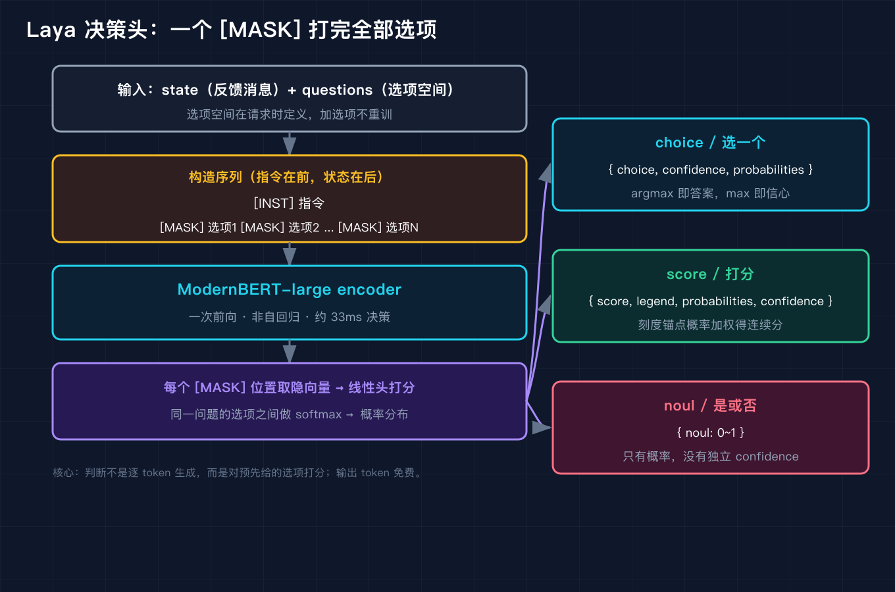
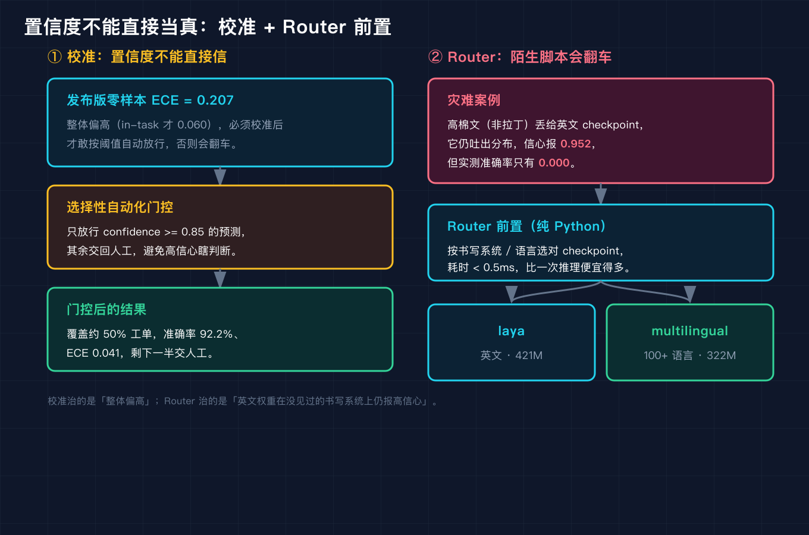

# 你的 Agent 每判一次都要为大模型吐的字买单，这个开源模型说判断不用吐字

前几天我看到一个开源项目叫 Laya，说是专门给 Agent 做"判断"用的。我第一反应是：判断？这不就是让大模型自己说一句"该派给 billing 部门"吗，有什么特别的。

直到我把一条真实风格的客服反馈喂进去，它一口气回了三个字段：该派给哪个部门、紧急程度打几分、是不是真故障。而且账单上 output_tokens 写着 0。我意识到它和普通大模型生成不一样，于是把它的机制和源码、模型卡对了一遍。

这篇文章就是这次拆解的笔记。我会用一条用户吐槽当线索，把 Laya 的核心机制讲清楚，包括它为什么敢说"输出免费"、三种问题形状、校准和路由两个容易翻车的地方，以及怎么真的把它跑起来。

先说明一句：Laya 已经开源，代码、权重、文档都能拿到，所以下面凡是能一手核实的，我都尽量贴来源。Jev 是闭源商业模型，和它对比的地方我只落到公开的 API 契约和模型卡数字，概念架构层也标了"非一手"。

## 先说这条吐槽

我拿来做例子的 state 是这样一句话：

```
My bill was charged twice and I can't reach support, this is urgent!
```

中文大意是：我的账单被扣了两次，联系不上客服，这很紧急。

我给 Laya 提了三个问题，一次调用全问完：

- department 该派给哪个部门，可选 billing / technical / account / sales，这是一个选择题
- urgency 紧急程度打几分，刻度是 0.0 到 2.0，这是一个打分型
- is_real_fault 是不是真故障，yes 或 no，这是一个是非型

把这条 state 喂进去，模型回了这么一份结果（下面这段是脚本实跑的真实 stdout，不是我编的）：

```json
{
  "answers": {
    "department": {
      "choice": "billing",
      "probabilities": {
        "billing": 0.5548,
        "technical": 0.1674,
      "account": 0.135,
      "sales": 0.1428
      },
      "confidence": 0.5548
    },
    "urgency": {
      "score": 1.396,
      "legend": {
        "0.0": "none",
        "0.5": "low",
        "1.0": "medium",
        "1.5": "high",
        "2.0": "critical"
      },
      "probabilities": {
        "0.0": 0.091,
        "0.5": 0.1231,
        "1.0": 0.1954,
        "1.5": 0.084,
        "2.0": 0.5065
      },
      "confidence": 0.5065
    },
    "is_real_fault": {
      "noul": 0.5403
    }
  },
  "usage": {
    "input_tokens": 21,
    "output_tokens": 0
  }
}
```

你看，它把这条吐槽判给了 billing 部门，紧急度落在 critical 附近（1.396 分，对应 2.0 那一档概率最高 0.5065），是否真故障给了一个 0.5403 的概率。最关键的是最底下那行：input_tokens 是 21，output_tokens 是 0。

这就引出了第一个要讲清楚的机制。

## 它为什么敢说"输出免费"

普通大模型回答问题是逐 token 往外吐的，吐一个字就算一个 output token，所以生成越长越贵。Laya 不是这么干的。

它的判断不靠"生成答案文字"，而是靠"对预先给好的选项打分"。选项空间在你请求的时候才定义，模型从头到尾没有自回归地生成任何东西，所以输出 token 天然是 0。你看到的那份 JSON，是 SDK 在本地把打分结果组装出来的，不是模型一个字一个字写出来的。

这套思路和 Jev 完全一致。Jev 也是判断引擎，商业定价里 output token 免费，输入端按每百万 token 收钱（约 0.042 美元）。Laya 开源之后，你连这个输入钱都省了，自己跑本地权重就行。所以从设计哲学上讲，Laya 等于把 Jev 那类"System1 快判断"引擎开源复刻了一遍，而不是去复刻 GPT 那种"System2 慢生成"引擎。

这一点决定了它能塞进 Agent 的廉价决策回路里：你每收到一条消息就问它一次"派哪个部门、急不急、是不是故障"，成本几乎只是一次前向，而且免费那部分真的不占账单。

## 拆开看：主干加一个从零训练的决策头

Laya 的架构不是把一个聊天模型改一改提示词，而是重新训了一个决策头。我查到的数字如下，来自它的模型卡和官方文档交叉核对。

英文主推的 `laya` checkpoint 是 ModernBERT-large 当主干，约 395M 参数，上面叠一个从零训练的决策头（两层 Transformer 加选项标记评分器加动作和升级头），加起来约 421M。多语言的 `laya-multilingual` 换成 mmBERT-base 当主干，约 322M，词表 256k，上下文 1024，靠 RoPE 撑到最高 8k。英文版上下文是 512 token，多语言版是 1024。

这里有个工程上很实在的点：决策头是从零训的，主干 ModernBERT 只是 encoder。所以它本质是一个"双向 encoder 加一个打分头"，而不是自回归生成器。这也解释了为什么输出免费，因为它根本不会去预测下一个 token。

权重本身不小，英文版约 808MB，多语言版约 647MB，全包下载 2.5GB。不过你只用英文的话，可以只拉请求的那个子目录，不用把 2.5GB 全下下来。

## 核心机制：把判断变成"给选项打分"

这是整篇最该讲清楚的地方。Laya 把一次判断请求拼成这样一个序列：

```
[CLS] question [SEP] [MASK] option1 [MASK] option2 ... [SEP] state [SEP]
```

question 在前，state 在后，每个候选选项前面放一个 [MASK]。模型（双向 encoder）一次性把整段编码，然后只取每个 [MASK] 位置的隐向量，过一个线性头变成每个选项的打分值，同一道题下面的选项再做一次 softmax，得到概率分布。

所以"派给哪个部门"这件事，在 Laya 眼里不是生成文字 billing，而是：billing 那个 [MASK] 打分最高，softmax 之后概率最大。选择题、打分型、是非型，底层都是同一个动作，区别只在选项空间和怎么解释分数。



这张图左边是流程：输入 state 加 questions，按"指令在前、状态在后"拼序列，走 ModernBERT-large encoder（约 33ms 量级），每个 [MASK] 打分加 softmax。右边是三种问题形状：choice 用青色、score 用绿色、noul 用红色。

有几个机制上的好处值得点一下：

第一，选项空间请求时定义。你多加一个部门选项，不会触发重新训练，只是序列里多一个 [MASK]。我在脚本里也验证过：原三个部门选项里加一个诱饵选项，原来三项的 argmax（最大概率对应的选项）保持不变，概率重新归一化后和仍为 1。

第二，一次前向、非自回归。所有问题并行评估，加一个问题几乎不增加延迟，也不会产生 Jev 文档里提到的那种 context rot（上下文腐烂，长对话里判断慢慢漂移）。

第三，免费同根。正因为不逐 token 生成，输出 token 才是 0，这和它"快"是同一条因果链上的两件事，不是两个独立优点。

## 三种问题形状：和 Jev 一模一样

回到开头那条吐槽的输出，三种形状我一个个对应一下。

选择题 choice 返回的是这样一个形状：`choice` 加上 `probabilities` 加上 `confidence`。上面 billing 是 0.5548，同时给出四个部门各自的概率。这是 Jev 里 Choice 原语的样子。

打分型 score 返回的是 `score` 加上 `legend` 加上 `probabilities` 加上 `confidence`。注意它不是一个裸数字，而是先把连续刻度离散成 0.0 到 2.0 五档，每档一个概率，再把期望算成 score。urgency 算出来 1.396，落在 critical 附近。这是 Jev 里 Score 原语的样子，而且刻度和图例都是你请求时自己定义的。

是非型 noul 返回的最简单，只有一个 `noul`，取值 0 到 1，没有独立的 confidence。上面 is_real_fault 是 0.5403。这是 Jev 里 Noul 原语的样子，Jev 模型卡里也明确写了 Noul 只返 noul 概率、不返单独的 confidence。

我写脚本复现的时候，专门断言了这三件事：choice 概率和为 1、noul 没有 confidence 键、一次调用确实并行回了三问。全过了。所以"三原语"不是我硬凑的概念，是 Laya 和 Jev 在公开文档里对得上的同一套输出形状。

## 第一个坑：模型自己很有信心，但常常错

光看上面那条吐槽的输出会觉得挺准，但 Laya 发布版有个公开的毛病：整体校准偏高。模型卡里给了数字，零样本 ECE（预期校准误差）是 0.207，也就是说它的 confidence 普遍比真实准确率更乐观。发布版整体偏高那一版，mean ECE 一度到 0.466，后来靠温度缩放压到 0.081。

Laya 的解法是 RLCD 校准。它用一套"严格恰当"的评分规则（log 加 spherical 加 ranked probability）当 reward，走 GRPO 式的策略梯度去调，全程没有交叉熵监督。校准之后，线上用法是门控：confidence 大于等于 0.85 才自动放行，剩下的交人工。这一道门大约覆盖 50% 的工单，在覆盖到的那部分上准确率是 92.2%，ECE 降到 0.041。

坑就在这儿：如果你直接拿原始 confidence 当真，会高估它的可靠性。正确用法是把它当"带阈值的建议"，高于阈值才自动化，低的乖乖转人工。判断引擎的价值不在于它永远对，而在于它把能自动化的那一半廉价地自动化了，剩下的一半不胡来。



## 第二个坑：英文权重在陌生文字上会胡说

这个坑比校准更隐蔽。Laya 英文版 `laya` 是在拉丁脚本数据上训的，你拿一段它没见过的书写系统去问，它不会说"我不懂"，反而会很有信心地给一个错答案。

官方 Router 文档里有个很刺眼的数字：高棉文（柬埔寨使用的文字）上，英文 checkpoint 实测准确率是 0.000，但 confidence 照样报 0.952。也就是说，它百分之百答错，却九成五的把握。在 51 种语言的扫描里，英文 checkpoint 只有 23 种可用，多语言版能到 45 种。

Laya 的解法是一个纯 Python 的 Router，按书写系统或语言在请求前选 checkpoint，耗时不到 0.5ms，几乎不增加延迟。检测到非拉丁脚本，就路由到 `laya-multilingual`（mmBERT-base，100 多种语言）。我在脚本里也复现了这个路由决策：一段高棉文进来，先检测书写系统，非拉丁就转多语言 checkpoint，避免英文权重在陌生脚本上胡说八道。

这里要提醒一句：我脚本里的那个"高棉文 confidence 0.952"是为了演示路由逻辑造的假 encoder 输出，真实数字来自 Laya 官方模型卡和 Router 文档，二者对得上。脚本的作用是让你看清"为什么要有 Router 这道前置"，不是去复现那个 0.000 准确率。

## 第三个坑：选项越多越吃力

第三个坑来自它的局限评测。有一个公开基准叫 Banking77，是 77 个细粒度银行意图分类，选项基数很高。Laya 在这个任务上只有 0.425 的准确率，而 Jev 是 0.870。差距主要来自高基数选项：选项越多，每个 [MASK] 之间的区分越难，打分头的压力越大。

还有一个相关的：typed-decisions 这个变体，零样本只有 0.362，接近随机，是微调之后才拉到 0.766。说明它在"结构化强类型决策"这类任务上，开箱即用的泛化并不稳，需要针对性微调才有把握。

所以判断引擎不是万能的。选项空间小、语义清楚、错误成本能靠阈值兜住的工单初筛这种场景，它很顺手；高基数分类或者强类型决策，要么换更强模型，要么准备微调。

## 真实接入：几行代码

讲完坑，说怎么真的用。Laya 上了 PyPI，Python 3.10 以上能装：

```python
# 先装：pip install laya
# 真实权重英文版约 808MB，首次运行会自动下载请求的 checkpoint
import laya

agent = laya.load("laya")  # 英文 421M；多语言用 "laya-multilingual"
result = agent.predict(
    state="My bill was charged twice and I can't reach support, this is urgent!",
    questions=[
        {"id": "department", "type": "choice",
         "options": ["billing", "technical", "account", "sales"]},
        {"id": "urgency", "type": "score",
         "scale": [0.0, 0.5, 1.0, 1.5, 2.0],
         "legend": {0.0: "none", 0.5: "low", 1.0: "medium",
                    1.5: "high", 2.0: "critical"}},
        {"id": "is_real_fault", "type": "noul",
         "options": ["yes", "no"]},
    ],
)
print(result.answers["department"].choice)      # billing
print(result.answers["urgency"].score)          # 接近 1.396
print(result.answers["is_real_fault"].noul)     # 概率
```

一个小坑：它底层如果同时拽进 TensorFlow 会卡在导入死锁，官方给的解法是运行前设环境变量 `USE_TF=0`。我是纯 PyTorch 跑的，没踩到，但如果你环境里有 TF，记得先设这个。

另外它提供一个 `laya-serve`，暴露 `POST /v1/systemone`，和 Jev 的接口兼容，你只要把 baseUrl 换掉就能从 Jev 迁过来，业务代码基本不动。

## 复现模块

这一节给你能直接跑的东西，不用下载 808MB 权重也能看机制。

代码地址：`ai-passage/2026-09-27-Laya开源决策模型原理拆解/code/laya_mechanism.py`

数据源：纯标准库写的机制复现，用确定性假 encoder（哈希关键词到稳定浮点），不依赖任何模型文件，所以免下载就能跑。脚本里的字段形状和 HuggingFace `convaiinnovations/laya` 模型卡、PyPI `laya` 的 Quickstart 对齐。真实接入要下的是上面那段约 808MB 的英文权重。

运行命令：

```bash
python3 code/laya_mechanism.py --self-test   # 11 项机制断言
python3 code/laya_mechanism.py --demo        # 跑上面那条吐槽
python3 code/laya_mechanism.py --router      # 看路由决策
```

精确预期输出（`--demo` 那一段），逐行和我正文开头贴的 JSON 一致：

```text
state: My bill was charged twice and I can't reach support, this is urgent!
```

```json
{
  "answers": {
    "department": {
      "choice": "billing",
      "probabilities": {
        "billing": 0.5548,
        "technical": 0.1674,
        "account": 0.135,
        "sales": 0.1428
      },
      "confidence": 0.5548
    },
    "urgency": {
      "score": 1.396,
      "legend": {
        "0.0": "none",
        "0.5": "low",
        "1.0": "medium",
        "1.5": "high",
        "2.0": "critical"
      },
      "probabilities": {
        "0.0": 0.091,
        "0.5": 0.1231,
        "1.0": 0.1954,
        "1.5": 0.084,
        "2.0": 0.5065
      },
      "confidence": 0.5065
    },
    "is_real_fault": {
      "noul": 0.5403
    }
  },
  "usage": {
    "input_tokens": 21,
    "output_tokens": 0
  }
}
```

`--self-test` 会跑 11 项断言，包括概率和为 1、加选项后 argmax 不变、noul 无 confidence、output_tokens 为 0、score 落刻度内、三形状并行。全部通过才算机制正确。

## 结尾钩子

回到开头那条吐槽：它被判给 billing、紧急度 critical 附近、是否故障 0.54。可你有没有发现，模型说"是不是真故障"给的是 0.5403，几乎是抛硬币。它把"派部门"和"有多急"答得挺利索，到了"是不是真故障"反而含糊。

我后来想，这其实正好暴露了判断引擎的边界：能靠关键词和语义对齐答准的（部门、紧急度），它很省心；到了需要因果推断的（这到底算不算故障），它只能给个没把握的概率。所以你下次给 Agent 接判断引擎，会先问哪类问题、把哪类留给人？

如果你也在做 Agent 的自动决策，留言说说你拿它做什么场景，或者踩过哪些"模型很自信但其实错了"的坑。下一篇我打算对比 Laya 和 Jev 在延迟、价格、开放程度上的取舍，想看的话告诉我。

## 讲给别人听

如果要把这篇讲给别人，三句话就够了：

1. Laya 是个开源的判断引擎，不逐 token 生成答案，而是对请求时给定的选项打分，所以输出 token 免费，适合塞进 Agent 的廉价决策回路。
2. 它把问题拆成三种形状，选择题、打分型、是非型，和闭源商业模型 Jev 的三种原语一模一样。
3. 它的两个翻车点是校准偏高（要靠 confidence 阈值门控）和英文权重在陌生文字上会胡说（要靠纯 Python 路由前置选多语言 checkpoint），所以正确用法是"带阈值的建议"，不是"永远对的判官"。

## 来源

一级：GitHub 仓库 `github.com/NandhaKishorM/laya`（作者 Nandakishor M，Convai Innovations，2026-09-18 创建，v0.3.20 于 9-24 发布）。

二级：HuggingFace 模型卡 `huggingface.co/convaiinnovations/laya`（英文约 808MB、多语言约 647MB、全包 2.5GB；零样本 ECE 0.207；门控覆盖约 50% 工单、准确率 92.2%、ECE 0.041）。

三级：官方文档 `nandhakishorm.github.io/laya`、PyPI `pip install laya`（Python 3.10+）、`laya-serve` 的 `POST /v1/systemone` 接口说明、Router 文档（高棉文 0.000 准确率 / 0.952 信心、51 语言扫描 23/51 与 45/51）。

四级：社区技术解析（序列打包格式 `[CLS] question [SEP] [MASK] option1 ... [SEP] state [SEP]` 来自 Wilson Wu 一文；架构数字 421M、ModernBERT-large 395M 加从零决策头、multilingual mmBERT-base 322M 来自多源交叉核对）。

对比项里 Jev 的数字（闭源、waitlist、约 0.042 美元每百万输入 token、输出免费、端到端 p50 236 到 276ms 第三方实测、Choice 最多 255 选项、内部评测约 67.8% 一致、Banking77 0.870）来自 Jev 公开文档与社区评测，属非一手，已标注。
