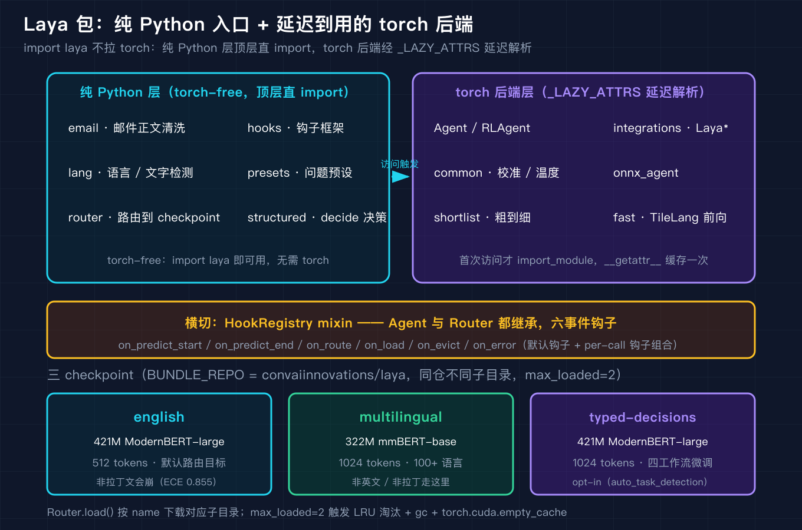
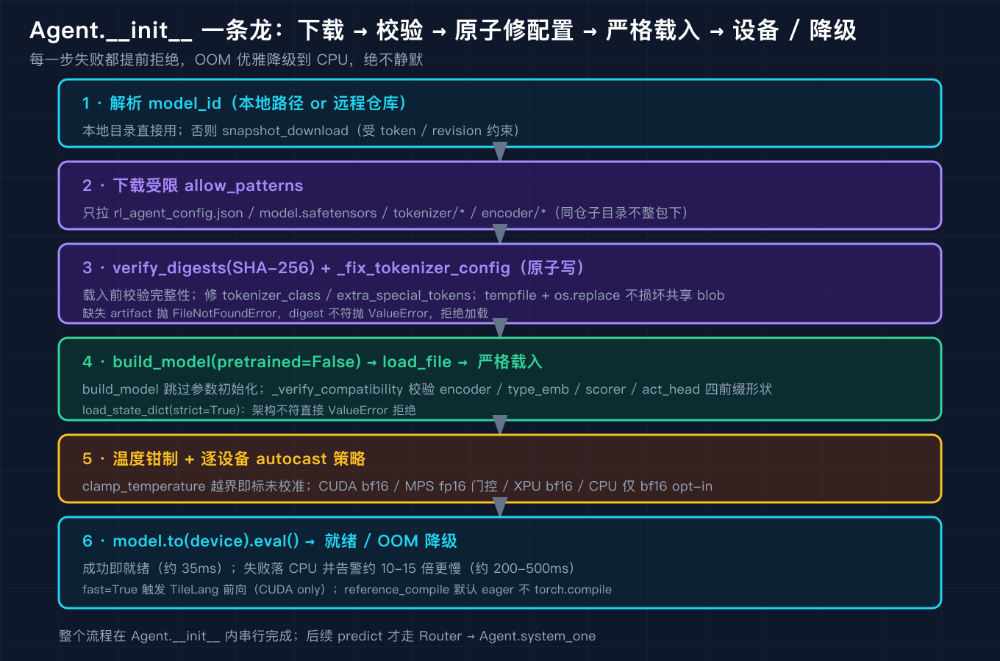

# Laya 源码级原理拆解之一：整体架构与运行入口

我第一次翻 Laya 的源码时，最意外的不是它的模型结构，而是它的包长什么样。一个开源的 System 1 决策模型，号称能在一次前向里把判断吐出来，但 `import laya` 这一下，居然不碰 torch，也不碰 numpy。我当时以为自己看错了，反复确认之后才明白：这是它被设计成能在推理服务的入口处被轻量加载的关键。

这一篇是源码级拆解的第一篇，我把范围划在整体架构和运行入口上：包是怎么组织的，从 `import laya` 到第一次 `predict` 之间发生了什么，Agent 的构建生命周期，三套 checkpoint 和 Router 怎么选，以及横切在 Agent 和 Router 之上的 hooks 钩子框架。后面几篇再分别深入序列打包与决策头、三原语与 schema 映射、路由与语言检测。



## 一、包组织：为什么 import laya 不拉 torch

Laya 的 `__init__.py` 只有一百来行，但把整件事的取舍写得很清楚。版本号是 `0.3.20`。它先做一件事：把纯 Python 的编排层在顶层直接导入，包括 `email`、`hooks`、`lang`、`presets`、`router`、`structured`。这些都是不依赖 torch 的模块，所以 `import laya` 的代价只是几个纯 Python 文件的解析。

真正吃 GPU、吃内存的 torch 后端（Agent、RLAgent、校准系、shortlist 系、integrations、onnx_agent、fast、tl_kernels 等三十多个名字）被登记在一张 `_LAZY_ATTRS` 字典里。每个名字映射到 `(module, attr)` 这样的二元组，比如 `'Agent': ('.agent', 'Agent')`。当用户访问 `laya.Agent` 时，才触发 `__getattr__`：它用 `importlib.import_module(module_name, __name__)` 真正去加载那个模块，把取到的属性写进 `globals()[name]` 缓存，之后再访问就直接命中缓存，不会重复解析。

`__dir__` 返回 `globals()` 和 `_LAZY_ATTRS` 的并集，所以 `dir(laya)` 能列出 `Agent`，但在此之前 `laya.__dict__` 里并没有它。这个设计的好处很直接：路由层和语言检测层都是纯 Python，可以在完全没有 torch、没有 numpy 的环境里跑起来。一个部署了 Laya 的推理服务，光是用来决定把请求路由到哪套 checkpoint，根本不需要把 421M 的模型权重拉进内存。

我用 `code/demo_architecture.py` 把这个事实钉死了。在受管 Python 里，`import laya` 之前和之后，`sys.modules` 里都没有 `torch` 也没有 `numpy`；`laya.Agent` 只挂在 `_LAZY_ATTRS` 上，没进 `laya.__dict__`，`laya.agent` 也没被 import_module 过；只有 `Router`、`normalise_name`、`HookRegistry` 这些纯 Python 名字是立即可用的。

```text
[1] import laya 之前与之后，torch / numpy 是否被加载？
  before import laya -> 'torch' in sys.modules: False | 'numpy' in sys.modules: False
  laya.__version__ = 0.3.20
  after  import laya -> 'torch' in sys.modules: False | 'numpy' in sys.modules: False

[2] 纯 Python 层在顶层直接导入，无需 torch / numpy
  Router / normalise_name / HookRegistry 已可直接引用

[3] torch 后端名只登记在 _LAZY_ATTRS，尚未真正加载
  'Agent' in laya._LAZY_ATTRS: True
  'Agent' in laya.__dict__ (已解析的全局名): False
  'laya.agent' in sys.modules (真正 import_module 过?): False
  'Agent' listed by dir(laya): True
  -> 只有访问 laya.Agent 时才会 import_module('laya.agent')，届时才需要 numpy/torch

[4] lang.analyse 返回 dict，靠 script / is_english 决定路由
  'I want to cancel my subscription'       -> script=latin is_english=True language=en
  'Quero cancelar minha conta'             -> script=latin is_english=False language=pt
  '你好，我要退款'                                -> script=han is_english=False language=None
```

这里有个细节要记牢：`lang.analyse` 返回的是 dict，不是带属性的对象。它的键里有 `script`、`script_profile`、`language`、`is_english`、`language_undecided`、`mixed_segment`。我后面写复现脚本时，第一版用了 `r.script` 这种属性访问，结果抛 `AttributeError`，改成 `r["script"]` 才对。这个坑不是 Laya 的 bug，是我把 Python dict 当成 dataclass 用了，但它提醒我：读源码返回值时，先确认它到底返回了什么形状。

## 二、运行入口：从 import 到第一次 predict

把整个运行链路串起来看，Laya 的入口不是直接 new 一个模型，而是先有一个 `Router`。`Router` 本身继承自 `HookRegistry`，也就是说它一出生就带了一套钩子机制。构造 `Router` 时你告诉它默认走哪套 checkpoint（默认 `english`）、`max_loaded` 是多少（默认 2）、要不要开 `auto_task_detection`。

第一次调用 `router.predict(state)` 时，链路是这样的：先 `route`，这一步只跑 `lang.analyse` 做文字和语言检测，完全不碰模型；route 给出该用哪套 checkpoint，比如 `english`；然后 `Router` 内部通过 `load()` 把对应的 `Agent` 构建出来（这一步才真正下载权重、校验、加载到设备），构建时持一把 `RLock`，所以并发的调用者共享同一个已经构建好的 Agent，不会各自重复拉一份 421M 的权重；最后把 `route` 的结果作为 `routing` 键注入到 Agent 的 `system_one` 调用里，模型跑一次前向给出判断。



`max_loaded=2` 这个默认值值得停下来想一下。三套 checkpoint 合计大约 1.16B 参数：english 是 421M 的 ModernBERT-large 配 512 tokens，multilingual 是 322M 的 mmBERT-base 配 1024 tokens，typed-decisions 又是 421M 的 ModernBERT-large 配 1024 tokens。默认只允许常驻两套，第三套要进来就得按 LRU 把最久没用的一套驱逐掉，驱逐时除了从内存里删引用，还会显式调用 `gc.collect()` 和 `torch.cuda.empty_cache()` 把显存真正还回去。如果你的流量在英文和葡萄牙语之间反复横跳，就会看到模型在显存里进进出出。Laya 给了 `preload()` 来临时抬高 `max_loaded`，避免自己驱逐自己。

## 三、Agent 生命周期：下载、校验、原子修配置、strict 加载

`agent.py` 的前半段把一个模型从磁盘上的权重变成能跑的运行时，细节密度很高。我把 `Agent.__init__` 的真实顺序捋一遍，这些都能在 `code/` 里对着源码看。

第一步是下载。它用受限制的 `allow_patterns` 只拉这几样：`rl_agent_config.json`、`model.safetensors`、`tokenizer/*`、`encoder/*`，可选带 `revision`。下载完先 `verify_digests`，在把权重载入内存之前做 SHA-256 校验，避免加载被篡改或损坏的 blob。

第二步是 `_fix_tokenizer_config`，这一步很讲究。HuggingFace 的 tokenizer 配置在某些版本里会把 `extra_special_tokens` 写成一个 list，或者把 `tokenizer_class` 写成需要后端才能反序列化的类。Laya 在加载前把它修成标准的 `PreTrainedTokenizerFast`，把 `extra_special_tokens` 从 list 改写成 `{"extra_0": t, ...}` 这样的字典。关键是它用 `tempfile.mkstemp` 写临时文件，再保留原文件权限用 `os.replace` 原子替换，因为多进程可能共享同一份 blob 缓存，原子写能防止并发把缓存文件写坏。

第三步是 `build_model(pretrained=False)`，然后 `load_file` 读 safetensors，接着 `_verify_compatibility` 做严格校验。这个函数要求配置里必须有 `encoder` 和 `head_layers`，要求权重的 key 以前缀 `encoder.`、`type_emb.`、`scorer.`、`act_head.` 开头，并且逐参数比对形状，缺 key 或者形状对不上就直接抛 `ValueError`。最后才是 `load_state_dict(strict=True)`，也就是 Transformer 那套全严格加载。

第四步是设备与精度。`reference_compile` 默认 `compile` 但走 eager，避免 `torch.compile` 在某些环境下卡死。温度做钳制，越界会告警，提示校准没做好。`lang_temperatures` 做归一化。然后是逐设备的 autocast 策略：CUDA 上 bf16 或 fp16，MPS 上 fp16 但要过一道门控（`mps_amp_min_rows` 默认 5，短输入不值得走 amp），XPU 上 bf16，CPU 上只有显式设了 `LAYA_CPU_AMP=bf16` 才开。最后 `model.to(device).eval()`。

这里有一处容错值得单独记：如果 `model.to(device)` 因为显存不足 OOM 了，它不会直接崩，而是降级落到 CPU，并打印告警说大约会慢 10 到 15 倍（CPU 上约 200 到 500 毫秒一次，GPU 上约 35 毫秒）。如果你的部署把 GPU 显存卡得很死，第一次加载就可能触发这个降级，请求会突然变慢，但服务不会挂。如果代码里开了 `fast=True`，它会额外调 `accelerate()` 做进一步加速。

我把前面两处容易被忽略的细节再抠一下，因为它们直接关系到「为什么加载偶发失败」和「为什么加载慢」。

`_fix_tokenizer_config` 修的配置项很具体。它把 `tokenizer_class` 强制改成 `PreTrainedTokenizerFast`，把 `backend` 和 `is_local` 这种需要运行时后端才能反序列化的键剥掉，最关键的是把 `extra_special_tokens` 从 list 改写成字典：

```python
extra_special_tokens = {f"extra_{i}": t for i, t in enumerate(value)}
```

这一步看起来小，但如果不改，HuggingFace 在另一次升级后的 tokenizer 加载路径里可能拒绝 list 形态，或者把特殊 token 顺序读错。Laya 选择在载入前就地修好，而不是赌版本兼容。修完之后它用 `tempfile.mkstemp` 写到一个临时文件，保留原文件的权限位，再用 `os.replace` 原子替换，因为同一份 tokenizer 缓存可能被多个进程同时读，非原子写会在中途让别的进程读到半截文件。

`_verify_compatibility` 的严格程度也值得记。它要求配置里必须有 `required_cfg = ["encoder", "head_layers"]`，要求权重的 key 必须落在四个前缀之内：

```python
_PREFIXES = ("encoder.", "type_emb.", "scorer.", "act_head.")
```

它会遍历 `model.named_parameters()` 逐一比对形状，缺了某个 key 或者形状对不上，直接抛 `ValueError`，不会带着残缺权重继续跑。后面紧接的 `load_state_dict(strict=True)` 又是一道闸，任何没对上的参数都会让加载失败。这两道闸加在一起，意味着权重文件一旦被截断、被版本错配、或者被缓存污染，会在加载阶段就明明白白报错，而不是在推理阶段吐出乱七八糟的 logits。

## 四、Router：三套 checkpoint 与路由优先级

回到 `router.py`。三套 checkpoint 的定义我在上一节已经给出参数了，这里补一个供应链上的事实：它们同属一个 bundle 仓库 `convaiinnovations/laya`，只是不同的子目录；另外还有一组 `STANDALONE_MODELS` 是各自独立的仓库。路由的别名表 `_ALIASES` 把 `en`/`laya`/`default` 都指到 `english`，`multi`/`ml` 指到 `multilingual`，`typed`/`decisions` 指到 `typed-decisions`。

路由的核心函数 `_route` 是一条优先级链。显式的 `model` 参数最高，压过一切检测；其次是显式的 `task`；再次是检测出来的工作流，但前提是开了 `auto_task_detection`；然后是显式的 `lang`；再往后是 `lang_guess`（每次调用级别的猜测会先于 Router 级别的猜测）；再是检测出来的文字脚本或语言；最后才是 `default`。脚本是 `unknown` 或者语言无法判定时，一律用 default。非拉丁文或者 `is_english` 为 False，就走 multilingual。

typed-decisions 这一支有个容易看漏的设计：它不是靠相似度匹配，而是靠问题 id 的精确集合匹配。`_TYPED_DECISION_WORKFLOWS` 列了四个工作流，比如 `agent_trace_observability`、`customer_service`、`invoice_processing`、`security_incidents`，每个工作流对应一组精确的问题 id。只有当你提交的 `questions` 的 id 集合和某个工作流完全一致时，才会路由到 typed-decisions。多一个无关键、少一个关键都不算匹配，会落回默认。这个设计很克制：它宁可误判成普通路由，也不把一份长得像但不完全对齐的 schema 送进强类型决策模型。

我用 `code/demo_router.py` 把这条链和精确匹配都跑了一遍，输出和源码逻辑一致。

```text
[1] 英文拉丁文本 -> english（默认路由目标）
  state='I want to cancel my subscription please'
  -> model=english  reason=English Latin text

[2] 葡萄牙语拉丁文本 -> multilingual（is_english=False）
  state='Quero cancelar minha conta agora'
  -> model=multilingual  reason=Latin script but language looks like 'pt', not English

[3] 显式 model 别名 multi -> multilingual（优先级高于检测）
  state='anything at all'
  -> model=multilingual  reason=explicit model='multi'

[4] 显式 lang=pt -> multilingual；lang=en -> english
  state='x'
  -> model=multilingual  reason=explicit lang='pt'
  state='x'
  -> model=english  reason=explicit lang='en'

[5] typed-decisions：问题 id 精确匹配四工作流之一 -> typed-decisions
  state='trace payload'
  questions-ids=['action', 'needs_review', 'outcome', 'risk', 'urgency']
  -> model=typed-decisions  reason=question ids match the 'agent_trace_observability' typed-decisions workflow

[6] 近邻 schema（多一个无关键）-> 不匹配，落回默认 english
  state='trace payload'
  questions-ids=['action', 'extra', 'needs_review', 'outcome', 'risk', 'urgency']
  -> model=english  reason=Latin script, language not identified and no non-English letters; using default (english)

[7] 别名解析 normalise_name
  'en' -> 'english'
  'ml' -> 'multilingual'
  'typed' -> 'typed-decisions'
  'default' -> 'english'
```

路由之外，`Router` 还提供 `route_batch` 和 `predict_batch`。它们不是简单地把单条逻辑循环 N 遍，而是先按 checkpoint 分组，再在每个 checkpoint 内按 schema 分组，把同一组的问题拼成一次前向共享计算。源码里这一版还顺手修了两个老 bug：一个是 `lang` 在批量透传时会丢，另一个是默认钩子和批量钩子的合并方式不对。批量接口的存在，说明 Laya 从设计上就预期你会在一次请求里问多个问题，而不是为每个问题单独付一次前向的代价。

## 五、横切：hooks 钩子框架

`hooks.py` 是一份纯 Python、完全不依赖 torch 的代码，但它是 Agent 和 Router 共同的骨架。`HookRegistry` 是一个 mixin，Agent 和 Router 都继承它。`PredictContext` 是一个 dataclass，携带 `states`、`questions`、`run_id`、`results`、`decision`、`model`、`agent`、`router`、`usage`、`started_at`、`elapsed_ms`、`error` 这些字段，还带一个 `skip()` 方法：在某个 start 钩子里调用 `ctx.skip([...])`，就可以用缓存结果直接短路后面的推理，不再跑前向。

钩子本身是一个 Protocol，定义了六个事件：`on_predict_start`、`on_predict_end`、`on_route`、`on_load`、`on_evict`、`on_error`。`BaseHook` 是空实现，你继承它只重写你关心的事件。`normalise_hooks` 会拒绝传进来的是类而不是实例，也要求一个钩子至少实现一个事件。`dispatch` 在派发时逐钩子、持锁串行执行，并且支持给每个钩子设超时：超时是通过一个后台线程 join 来实现的，这样钩子里的死循环不会拖死主流程。还有 `AsyncHook` 配合 `run_coroutine_sync` 和 `_background_loop` 的守护线程，让异步钩子也能被同步调用又不死锁。

默认钩子也在这里管理：`default_hooks`、`set_default_hooks`、`add_default_hook`、`clear_default_hooks`，外加一个 `_SKIP_DEFAULTS` 的 ContextVar，让你在某次调用里临时跳过默认钩子。`compose_hooks` 把默认钩子、已安装钩子、本次调用传入的钩子合并在一起。`aggregate_usage` 负责把多次调用的 `input_tokens` 和 `output_tokens` 累加，这正好是后面算账单时要用的数字。

`code/demo_hooks.py` 用一个最小复刻的 `MiniRuntime(HookRegistry)` 把三条事实跑出来了：普通钩子的 start/end 两个事件会按序触发；start 钩子里调 `ctx.skip` 之后，推理被短路，结果直接是缓存值、`input_tokens` 为 0；以及钩子 sleep 超过 `hooks_timeout` 会抛 `TimeoutError`。

```text
[1] 普通钩子：观察 start / end 两个事件
  [hook] on_predict_start fired, states=1
  [hook] on_predict_end fired, results=[{'answer': 'simulated', 'usage': {'input_tokens': 12, 'output_tokens': 0}}]
  -> result answer=simulated (真实推理未被短路)

[2] skip 短路：start 钩子设置缓存结果，不再跑推理
  [hook] on_predict_start: skip with cached result
  -> result answer=cached input_tokens=0 (推理被跳过)

[3] 超时保护：钩子 sleep 超过 hooks_timeout -> TimeoutError
  -> 捕获到超时：laya: hook SlowHook.on_predict_start exceeded 0.2s
```

## 三个我踩过的坑

第一坑，我以为 `pip install laya` 装完就能 `import laya` 跑通所有示例，结果一碰 `laya.Agent` 就报 `ModuleNotFoundError: No module named 'numpy'`。查了源码才明白，这不是缺依赖，是 lazy import 在起作用：`Agent` 这个 torch 后端名只在被访问时才 `import_module('laya.agent')`，而那个模块顶层就 `import numpy` 和 `import torch`。解法是不去碰 torch 后端名，纯 Python 的 `router`、`hooks`、`lang` 层本来就不需要 numpy 和 torch，可以在干净的受管环境里直接跑。

第二坑，我把 `lang.analyse` 当成对象用，写了 `r.script` 想读脚本，立刻 `AttributeError`。看返回签名才发现它返回的是 dict，键是 `script`、`is_english` 这些字符串。改成 `r["script"]` 立刻好。这个坑的本质是没读返回类型就上手，源码里 `analyse` 明明白白标了 `-> Dict[str, object]`。

第三坑，我在本地用单语言流量测路由一切正常，一上生产多语言混合，显存就开始抖动，延迟忽高忽低。回头看 `max_loaded=2` 才反应过来：三套 checkpoint 合计 1.16B，但默认只常驻两套，第三套进来就触发 LRU 驱逐加 `gc.collect()` 加 `torch.cuda.empty_cache()`。解法是上线前对会同时命中的 checkpoint 调 `preload()` 抬上限，别让同一份权重反复进显存。

## 复现模块

代码地址（本篇及后续三篇的目录）：`https://github.com/beverlyLee/ai-passage`（本篇目录 `2026-09-27-Laya源码级原理拆解-之一/`）。

Laya 数据源（一手开源代码，本篇引用的全部源码均来自此仓库）：`https://huggingface.co/convaiinnovations/laya`。本地 clone 方式：`git clone --depth 1 https://huggingface.co/convaiinnovations/laya /tmp/laya-src`（纯代码仓库，不捆绑权重；本篇只用到 `laya/` 下的 Python 源文件，Agent 权重下载需要后续填 token，但路由、语言检测、钩子三层无需权重即可复现）。

运行命令（在装有 Python 3.11+ 的环境，纯 Python 层无需 torch / numpy / token；`/tmp/laya-src` 可替换为你的 clone 路径，已 `pip install laya` 则可删掉脚本里的 `sys.path.insert`）：

```bash
cd 2026-09-27-Laya源码级原理拆解-之一/code
python demo_architecture.py --self-test
python demo_router.py --self-test
python demo_hooks.py --self-test
```

精确预期输出（与正文 `--self-test` 实际运行一致）：

```text
self-test PASS: 纯 Python 层 torch/numpy-free、Agent 延迟登记、lang.analyse 返回 dict 均符合预期
self-test PASS: 路由优先级链与 typed-decisions 精确匹配均符合预期
  [hook] on_predict_start fired, states=1
  [hook] on_predict_end fired, results=[{'answer': 'simulated', 'usage': {'input_tokens': 12, 'output_tokens': 0}}]
  [hook] on_predict_start: skip with cached result
self-test PASS: 钩子框架的 add/dispatch/skip/timeout 均符合预期
```

非 self-test 模式下的完整示例输出见正文第一、四、五节中的三段代码块，均来自真实运行，未做删改。

## 结尾钩子

我在这篇里反复强调一件事：Laya 把 421M 的模型和纯 Python 的路由层拆成两层，让 `import laya` 不碰 torch，让决定走哪套 checkpoint 这件事本身几乎零成本。你现在去翻任何一个你正在用的推理框架，它的入口是不是也在第一步就把整个重量级后端拉起来了？如果让你给自己的 Agent 运行时设计一层不依赖大模型的路由，你会用 script 检测这种「便宜到几乎免费」的信号，还是先调一次大模型再说？把你的答案或者你现在用的框架入口代码发给我，下一篇我们拆序列打包和决策头，看 Laya 怎么把一次判断压成一次前向。
