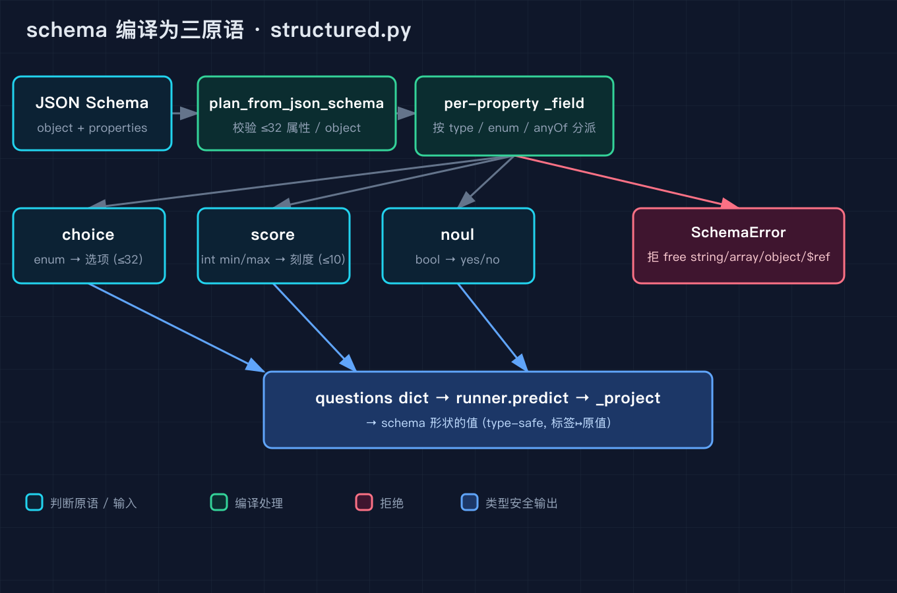
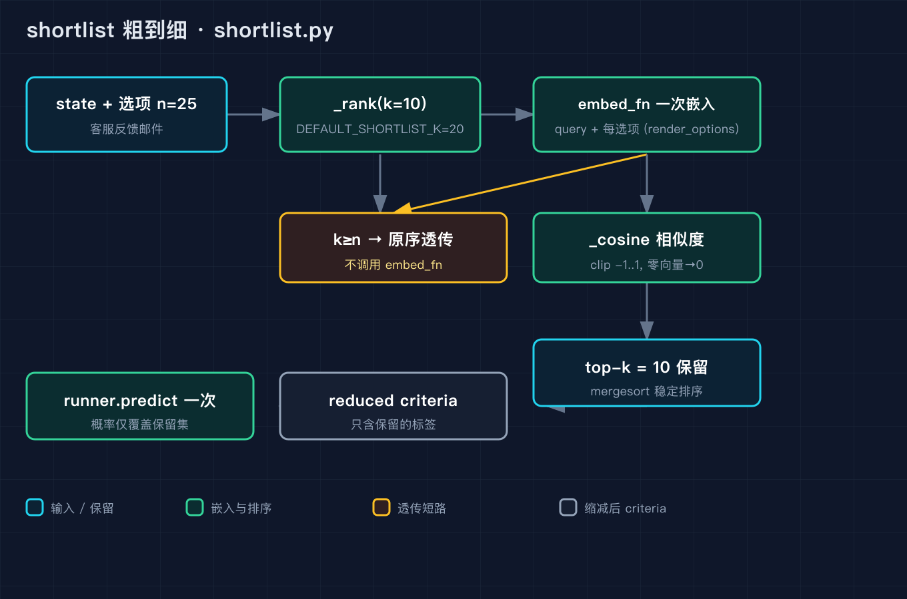
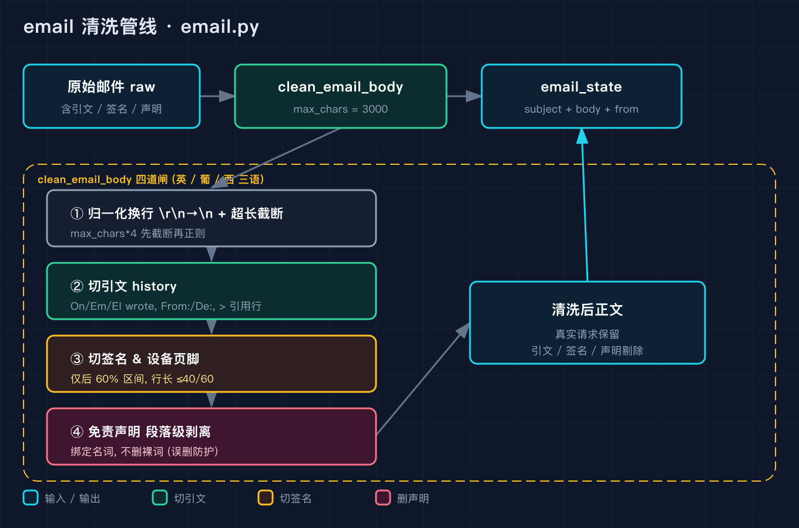

# 我把客服工单的字段定义交给开源判断模型，它没让我写一行路由就给出了结构化答案

前两周我一直在拆 Laya 这个开源判断引擎。之一讲了整体架构和运行入口，之二讲了序列打包和决策头，也就是它怎么在不逐 token 生成的前提下，给请求时给定的每个选项打分。这一篇我接着往下拆三个模块，它们是真正把模型接进业务的那层胶水：你定义一个 JSON Schema，它替你把字段编译成 choice、score、noul 三种判断形状；选项太多时它帮你做粗到细的预筛；邮件进来时它先把引文、签名、免责声明切掉再送进模型。

我用一个真实需求串起这三个模块：给客服反馈邮件做自动分诊，一封邮件要回答五个问题，分到哪个团队、是不是垃圾邮件、是不是钓鱼、紧急程度几分、要不要回。传统做法是我自己写字段校验、自己写路由 if/elif、自己接大模型再解析 JSON。Laya 的 structured 模块把这整件事吃进一张 JSON Schema 里，我现在要做的，只是把那张 Schema 写对。

## 第一节：一张 JSON Schema 怎么被编译成三种判断

structured.py 的模块开头就写明了它的边界，它只支持一个固定的子集：一个带 properties 的 object，每个属性要么是枚举 choice，要么是布尔 noul，要么是有上下界整数刻度的 score。任何没法用固定选项集回答的东西，比如自由文本、数组、嵌套对象，它会在编译期就报错，而且报错信息会点名出错的路径。这个设计很务实，它把 schema 的合法性检查提前到了运行之前，而不是让模型去猜。

三个上限常量我先记一下，因为它们直接决定了你能写多复杂的结构。MAX_PROPERTIES = 32 是顶层属性个数上限，MAX_OPTIONS = 32 是单个 choice 的选项上限，MAX_SCORE_LEVELS = 10 是 score 的刻度上限。这些数字不是拍脑袋，它们和之二讲的 head_max_len=192 那个预算是同一套约束。

编译的入口是 plan_from_json_schema，它先做顶层校验，要求 schema 的类型是 object 且必须有 properties，properties 自身必须是非空 dict，超过 32 个属性直接抛 SchemaError。之后它给每个属性调 _field，把属性名拼成 properties.xxx 的路径传进去。

_field 是真正的分派函数。我把它理解成一个漏斗。第一步它看属性里有没有 const、enum、type 这几个标记，如果没有，它才去看 anyOf 或 oneOf，这是为 pydantic 的 Optional[X] 准备的。pydantic v2 会把 Optional[Literal[free,pro,team]] 渲染成 {"anyOf": [{type: string, enum: [...]}, {type: null}]}，顶层既没有 const 也没有 enum 也没有 type，_field 就会把那个非 null 的分支取出来，把外层的 description 带上去，递归再走一遍自己，于是 Optional[Literal[...]] 也能正确地变成 choice，而不是被拒。但如果是两个真实类型的 union，比如 Optional[Literal[...]] 之外再加一个真实分支，就会因为不止一个非 null 分支而被拒，源码的注释里把这种真正歧义的 union 留作显式报错，这个取舍很干净。

漏斗往下走，const 和 enum 都进 _enum_field。_enum_field 里有一个我一开始没注意到的细节：如果枚举值全是布尔，它不直接做 choice，而是退化成 noul。因为 [true, false] 这个枚举和 yes/no 判断在语义上是一回事，没必要占一个 choice 的名额。真正进 choice 的分支会把每个值转成字符串标签，要求标签不重复，超过 32 个选项或者空枚举都会抛错。

type 为 boolean 走 _noul_field，type 为 integer 或 number 走 _score_field。_score_field 的要求很硬，minimum 和 maximum 必须都是整数，否则它拒绝把数字字段变成 score，因为 score 的刻度必须是整数。它算 span = hi - lo + 1，跨度过 10 就被拒，要求你收窄范围或者改用枚举。criteria 直接就是 [str(v) for v in range(lo, hi + 1)]，也就是说刻度标签就是整数本身。

最关键的拒绝逻辑在 _field 的 type 分支底部。free string 被拒，因为自由文本没法变成固定选项集；array 被拒，因为它要求你一个元素一个字段地问；nested object 被拒，要求你把结构拍平；$ref 被拒，因为递归在编译期解不开。这些拒绝不是偷懒，而是守住一个前提，Laya 的输出形状必须是 schema-safe 的，模型不可能吐出 schema 之外的值。

编译完拿到的是一串 _Field，每个 _Field 记着 name、kind、question 和选项映射。questions_from_json_schema 把这一串拍平成 {name: question} 的字典，这一步产物就可以直接喂给 runner.predict 了。

但 schema 的真正价值在投影。decide 接受 schema 或 questions 二选一，如果传 schema，它内部先编译出 fields，再拿模型的原始 answers 去 _project。_project 是反向映射：noul 把 0.5 当阈值转成布尔；score 在 probabilities 里取 argmax 还原成整数刻度；choice 把模型给的标签映射回你原始的枚举值，比如枚举值本来是 "billing" 这个字符串，模型只认识标签，"billing" 这个标签要被换回 "billing" 这个原始值。这一来一回之后，你拿到的就是一张完完全全符合你 Schema 形状的结果，而不是一堆要你自己解析的中间结构。

我写了 demo_structured.py 复刻这一节的全部逻辑，跑出来的样子是这样的：

```
=== schema -> 三原语 编译 ===
  category     choice  (6 options)  Which team should handle the email in `body`?
               criteria = ['billing', 'technical', 'sales', 'security', 'hr', 'other']
  is_spam      noul     Is `is_spam` true?
  is_phishing  noul     Is `is_phishing` true?
  urgency      score   (levels ['0', '1', '2'])  Score `urgency` from 0 to 2
  needs_reply  noul     Is `needs_reply` true?

=== decide() 投影回 schema 值 ===
  category     = 'technical'
  is_spam      = False
  is_phishing  = True
  urgency      = 1
  needs_reply  = True

=== Optional[Literal[...]] 解包（源码 _field 的 anyOf 分支）===
  tier: Optional[Literal[free,pro,team]] -> choice

=== 被拒的 schema（free string / array / object / $ref）===
  free string    -> 拒: properties.note
  array          -> 拒: properties.tags
  nested object  -> 拒: properties.addr
  $ref           -> 拒: properties.x
```

这张图把整条编译链路画出来了，从一张 object 落到三个 primitive，再投影回原值。



## 第二节：选项太多时，粗到细把预算省下来

第一节那个邮件分诊只有 6 个团队选项，head_max_len=192 的预算还够分。但如果选项是 77 个银行意图（BANKING77 那个经典 benchmark），每个意图分到的 token 就只剩几个，模型根本看不清选项在说什么。shortlist.py 就是为这个场景存在的，它把决策拆成两阶段，先用一个 caller 提供的 embed_fn 把 state 和每个选项都嵌入向量，算余弦相似度，只保留最相关的 top-k 个选项，再对这缩减后的选项集调一次 predict。

DEFAULT_SHORTLIST_K = 20 是默认的 k。短名单函数有两个入口，shortlist_choice 只返回 top-k 标签，predict_shortlist 则对一整组 questions 里的每个 choice 都做短名单，然后调一次 predict 或 system_one，非 choice 的问题原样透传。

_rank 是这个模块的核心。它先算 checked = k，然后取出 criteria 的所有选项。这里有一处很聪明的优化：如果 checked >= n，也就是 k 比选项数还大，它直接返回选项原序，passthrough 标记设为 True，根本不调用 embed_fn。因为选项都进决赛了，没必要再嵌一遍。我那个 demo 里 n=25 时如果 k=10 就会真正走嵌入排序，但如果 k>=25 就原序透传。

真正走嵌入时，它把 query 文本放在最前面，后面跟每个选项的渲染文本，一次性喂给 embed_fn。选项文本不是裸标签，而是复用 common.py 的 render_options 渲染出来的，和模型实际看到的格式一致。_cosine 做向量归一和裁剪，零向量直接得 0 分，不会反超排在它前面的选项。排序用 np.argsort 取前 k 个。

cached_embed_fn 是给重复短名单用的。README 里 BANKING77 的例子，选项集在每次请求里都是同一批，但原始实现每次都重嵌全部选项。把 embed_fn 包一层 LRU 缓存之后，第一次调用不变，之后每次只嵌新的 query，选项行直接从缓存取。缓存用 OrderedDict 实现，maxsize 默认 4096，锁只护缓存读写的临界区，绝不护嵌入调用本身，所以多线程安全又不串行化真正的计算。它对外暴露 cache_info 和 cache_clear，cache_info 返回 size、maxsize、hits、misses。

我跑 demo_shortlist.py 时用了 25 个部门选项，k=10，结果是 refund_requests 排第一，billing_invoices 第二，product_feedback 第三，一路排到第 10 个 data_export。然后我测了 k>=n 的透传，返回原序且 embed_fn 调用次数是 0。最后测缓存，第一次 misses=26，第二次 hits=26，证明选项行确实被复用了。

```
=== 粗到细 shortlist（25 个部门，k=10）===
  输入选项数 n = 25，取 top-k = 10
  #1  refund_requests
  #2  billing_invoices
  #3  product_feedback
  #4  general_question
  #5  payment_issue
  #6  account_security
  #7  technical_bugs
  #8  api_docs
  #9  feature_request
  #10 data_export

=== k >= n 时原序透传，不调用 embed_fn ===
  返回顺序: ['a', 'b', 'c']  embed_fn 调用次数: 0

=== LRU 缓存：重复 shortlist 只重嵌新 query ===
  第一次: {'size': 26, 'maxsize': 4096, 'hits': 0, 'misses': 26}
  第二次: {'size': 26, 'maxsize': 4096, 'hits': 26, 'misses': 26}  (hits 增长 = 选项行被复用)
```

这张图画的是粗到细的两阶段，以及 k>=n 那条透传短路。



有一点要特别说清楚，短名单之后模型给出的 probabilities 只覆盖保留下来的那几个标签。如果你以为概率覆盖了全量选项，去做跨选项归一化，就会出错。源码的 docstring 也明说了，Probabilities on a shortlisted choice are over the kept labels only。

## 第三节：邮件正文进来之前，先把噪音切掉

邮件分诊有一个容易被忽略的前置步骤，你直接把一封带着引文历史、签名档、法律免责声明的邮件塞给模型，那些东西会和新内容一样占 token，而且引文里往往是一段完全不同的请求，会干扰判断。email.py 的 clean_email_body 干的就是这个清洗活。

它的处理顺序是先归一化换行，把 \r\n 和 \r 都换成 \n，还顺手把字面量 "\\n" 也换掉。然后它有个很实用的防护，如果文本长度超过 max_chars 的 4 倍就先截断，因为后面的正则里有 [^.]{0,60/80/100} 这种变长匹配，输入越长正则成本越高，而最终最多只返回 max_chars 个字符，截掉不亏。

接着它逐行扫。_QUOTE_HEADERS 是一组覆盖英葡西三语的正则，On ... wrote:、Em ... escreveu:、El ... escribió:，还有 -- Original Message -- 和 -- Mensagem original -- 这种分隔线，以及 From: 后跟地址、De: 后跟地址这种回复头。一旦命中且前面已有内容，就在这里断掉，后面的引文全不要。大于号开头的引用行直接跳。这一步切掉的是历史对话。

断掉引文之后，它在后 60% 的区间里找签名和设备页脚。签名用 _SIGNATURE_MARKERS，英文的 Thanks、Regards、Cheers，葡西语的 Atenciosamente、Obrigado、Um abraço 都在内，而且签名行有长度限制，英文不超过 40 字符，设备页脚不超过 60 字符，因为三星那种默认页脚比普通落款长。device footer 用 _DEVICE_FOOTER，匹配 Sent from my iPhone 这类。

最后一步是段落级的免责声明剥离，_strip_disclaimer。这里有个我特别想讲的坑，免责声明正则不是裸词匹配。源码注释里写得很清楚，如果只匹配 "confidential" 这个裸词，"Is this confidential?" 和 "Confidential: I need a refund." 这种真实请求会被整段删掉。所以它把 confidential 绑定到 "information is confidential and intended solely for the addressee" 这种名词加尾巴的结构上，葡西语也绑定到 "esta mensagem confidencial" 而不是裸词 "confidencial"，因为一个发件人的真实请求里也会写 "preciso do contrato confidencial"。剥离策略是段落里每一句都命中免责声明才整段删，否则只删命中的那几句，这样宁可留一行噪音，也不误删用户真正的诉求。

email_state 是这一节的收口，它把 subject、清洗后的 body 和可选的 sender 装成一个 state 字典。我在 demo_email.py 里放了一封带引文、签名、免责声明的样例邮件，清洗后正文只剩下用户真正的那句请求，引文、Thanks Alice 的签名、confidential 那段免责声明全被切掉了，但 "blocking my renewal" 这句紧急请求一个字没丢。

```
=== 原始邮件（节选，含引文/签名/免责声明）===
Hi team,

I paid for my subscription last week but the refund never arrived on my card.
Please process it, this is blocking my renewal.

The information in this email is confidential and intended solely for the addressee.
If you have received this email in error please notify us immediately.

Thanks,
Alice
alice@acme.com

On Mon, Sep 22, 2025 at 10:00 AM, Bob <bob@acme.com> wrote:
> any update on billing?

=== email_state（清洗后）===
'Hi team,\n\nI paid for my subscription last week but the refund never arrived on my card.\nPlease process it, this is blocking my renewal.'
```

这张图画的是整条清洗管线，引文、签名、免责声明三道闸分别在哪一步落下。



## 第四节：三个我踩过的坑，以及你怎么复现

坑一，别把字段写成 free string。我第一次写 schema 时，把团队分类写成 type: string，结果 _field 直接拒了 properties.note，报错说自由文本不能变成固定选项集。要分类就老老实实写 enum，Laya 的输出形状必须是 schema-safe 的，它不会替你去猜字符串。

坑二，短名单之后的概率只覆盖保留的那几个标签。我在调试时曾经把短名单后模型给的 probabilities 当成全量选项的概率去做归一化，结果数字对不上。源码 docstring 写明了，被 shortlist 砍掉的选项根本不在 probabilities 里，你要么只在保留集里比较，要么关掉 shortlist 用全量。

坑三，清洗的正则一定要绑定名词不要匹配裸词。源码里那段关于 confidential 的注释是我最认同的设计，裸词匹配会把用户一句带 confidential 的真实请求整段删掉，绑定名词之后才安全。如果你要加新的免责声明规则，先拿一封真实邮件测，确认没误删诉求再上线。

### 复现模块

这一篇的三个可运行脚本都在仓库里，纯标准库，不需要 torch、不需要 numpy、不需要任何 API key，clone 下来就能跑。

代码地址：https://github.com/beverlyLee/ai-passage/tree/main/2026-09-27-Laya%E6%BA%90%E7%A0%81%E7%BA%A7%E5%8E%9F%E7%90%86%E6%8B%86%E8%A7%A3-%E4%B9%8B%E4%B8%89/code

数据源地址（被拆解的真实开源代码）：https://github.com/convaiinnovations/laya ，具体文件是 laya/structured.py、laya/shortlist.py、laya/email.py、laya/presets.py、laya/common.py。

运行命令：

```
python3 code/demo_structured.py --self-test
python3 code/demo_shortlist.py --self-test
python3 code/demo_email.py --self-test
```

三个脚本的 self-test 都会打印一行 `self-test PASS`。不带 --self-test 跑则打印上面三节里贴出的 demo 输出，schema 编译五字段、25 部门 top-10 短名单、邮件清洗前后对照，全部可逐行核对。

## 结尾钩子

回到开头那个场景，我当初想偷懒，结果 Laya 真的让我把五个字段的定义写成一张 JSON Schema 就完事了，路由和解析它全包了。但你有没有想过，如果连 schema 都让模型来定呢，比如先让一个生成模型吐出字段，再喂给判断模型，那个中间环节一旦错了，structured 这个编译漏斗立刻就会把脏 schema 拒在门外，而 rejection 本身也是要有人接住的。你在实际项目里是愿意手写 schema 守住边界，还是想把 schema 也外包出去。如果这篇对你接判断模型有启发，把你正在做的那个分诊场景评论区发我，我下一篇（之四）会拆 Laya 的路由、语言检测和 onnx 推理那条链路，看它怎么在 english、multilingual、typed-decisions 三套 checkpoint 之间选，以及那条链为什么会在高棉文上翻车。
