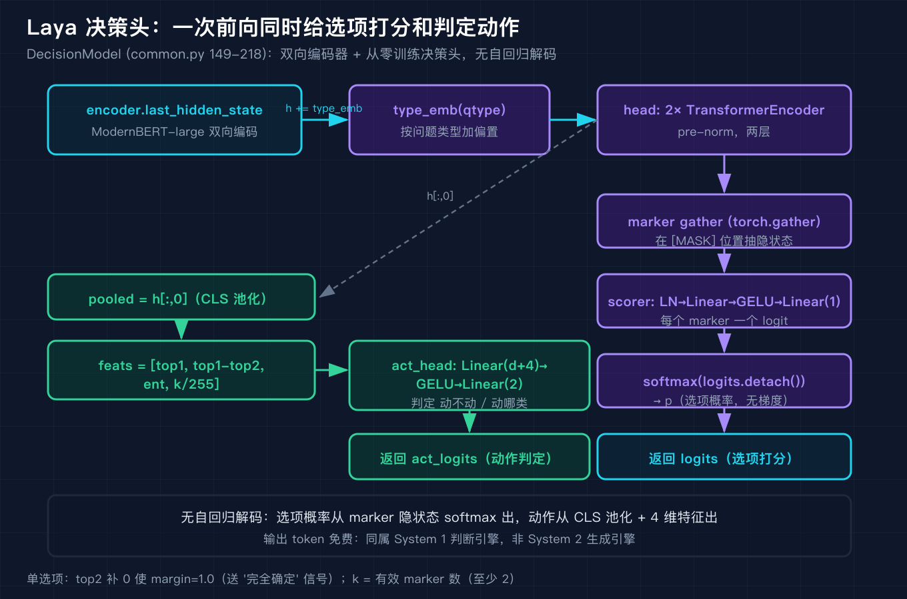
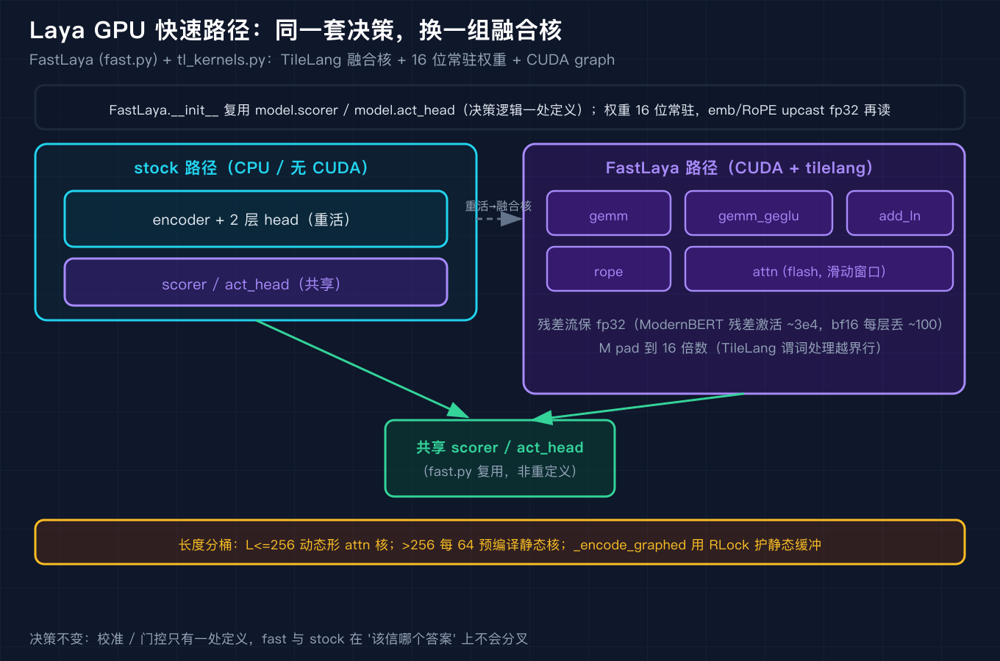

# Laya 源码级原理拆解之二：序列打包与决策头

我在之一里把 Laya 的整体架构和运行入口拆完了，当时留了一个最关键的疑问没有展开：它号称一次前向就把判断吐出来，输出 token 还是免费的，这件事在代码层面到底是怎么发生的。这一篇我直接进 `common.py` 和 `agent.py`，把序列打包 `build_sequence` 和决策头 `DecisionModel` 的源码逐行走查一遍，再把温度缩放和那套容易踩错的双置信度说清楚。最后看一下 `fast.py` 和 `tl_kernels.py` 怎么把同样的决策换一组融合核跑在 GPU 上。

如果之一你还没读，先记住一个前提：Laya 的模型是一个双向编码器加一个从零训练的决策头，它不是自回归生成模型，所以"判断不用吐字"不是营销话术，是架构使然。这一篇就是把"架构使然"四个字拆成代码给你看。

![Laya 序列打包：一条固定模板把 type、instructions、每个选项的 [MASK]、共享 state 压成一条序列，marker 指回每个选项的 [MASK] 位置](diagram/01_packing@2x.png)

## 一、序列打包：把问题、选项、状态压成一条固定模板

`common.py` 的 `build_sequence`（94 到 146 行）干的事，是把一条待判断的请求拼成模型能吃的一条 token 序列。我先把它要生成的格式摆出来，源码注释里自己写得很直白：`[CLS] <type> instructions [SEP] [MASK] opt0 [MASK] opt1 ... [SEP] state [SEP]`。

第一段是 head，由类型和指令拼成 `"%s question: %s" % (q["t"], ins)`，这里的 `q["t"]` 是 `choice`、`score` 或 `noul` 之一。紧接着是一个 `[SEP]` 封口。然后进入选项段：每个选项前面塞一个 `[MASK]`，选项文本本身在分词器里就截断到 48 个 token（`truncation=True, max_length=48`）。选项段再用一个 `[SEP]` 封口。最后把 state（共享的对话历史或文档）接在后面，再一个 `[SEP]` 收尾。

这里的 `[MASK]` 是整个机制的眼睛。Laya 不是让模型一个字一个字把"选 A"生成出来，而是把每个选项都摆在序列里的一个 `[MASK]` 位置上，等双向编码器跑完前向之后，直接去每个 `[MASK]` 对应的隐状态上打分。所以 `build_sequence` 除了返回拼好的 token 序列，还返回一组 `markers`，每个 marker 就是该选项 `[MASK]` 在序列里的下标。模型后面就用这组下标把隐状态抽出来。

我第一次读这段时卡在一个预算裁剪的分支上。`opt_budget = head_max_len - sum(len(o) for o in opt_ids)`，而 `head_max_len` 默认是 192。当选项特别多或者特别长，导致 `opt_budget < 16` 时，源码不会报错，而是算一个 `per = max(4, (head_max_len - 16) // len(opt_ids))`，把每个选项裁到 `per` 个 token，再重新算预算，最后 `head_ids = head_ids[:max(8, opt_budget)]`，保证至少留 8 个 token 给头部。这个分支的存在说明作者真的在 192 这个窗口里反复权衡过"头部说明"和"选项"的预算分配，不是随手写的。

state 的截断也有讲究。`room = max(0, max_len - len(ids) - 1)`，留给 state 的空间是总长减去已经用掉的再减一（给末尾 `[SEP]`）。`truncate_left=False` 时取 `state_ids[:room]`，从左边保留；`truncate_left=True` 时取 `state_ids[max(0, len(state_ids) - room):]`，从右边保留。注释里还专门提醒：不能用 `state_ids[-room:]`，因为当 `room` 为 0 时 `[-0:]` 会切出整个 state 而不是空。这种注释是踩过坑才会写的。

还有一个我一开始没注意的设计：`state_ids` 参数允许调用方把已经 tokenize 好的 state 传进来。因为同一个 state 往往要配很多个问题一起问，如果每个问题都重新把整篇文档序列化再分词，是纯浪费。调用方在循环外 tokenize 一次，循环里复用，这个细节在批量推理时是实打实的提速。

我用 `code/demo_packing.py` 把这套逻辑逐行复刻了一遍（用占位 tokenizer，不拉 torch 和 numpy），self-test 跑了五个例子，输出都是真实的：

```text
[1] choice 三选项打包：markers=[9, 14, 19]，CLS 起头、marker 指向 [MASK] 均符合预期
[2] 超长选项触发 head_max_len=192 预算裁剪：单选项上限 per=35，实测 [35, 35, 35, 35, 35]，均 <= 36
[3] max_len=80 时 state 右侧截断：state 段由 200 裁到 67 token，符合预期
[4] truncate_left=True 时 state 左侧截断：state 段保留尾部 67 token，符合预期
[5] state_ids 复用：调用方一次 tokenize 后传入，避免每问重序列化/重分词，符合预期
self-test PASS: build_sequence 打包格式、marker 指向、预算裁剪、state 截断、state_ids 复用 均符合源码逻辑
```

例 2 里五个各 200 词的超长选项，触发 `opt_budget < 16`，源码把每个选项裁到 `per = max(4, (192-16)//5) = 35`，实测每个选项恰好 35 个 token，正是 `[MASK]` 加 34 个文本 token，和源码 `o[:per]` 完全对上。例 3 和例 4 把 200 个 token 的 state 在 `max_len=80` 下裁到 67，说明截断确实生效。

## 二、决策头：一次前向里同时做给选项打分和决定要不要动

`DecisionModel`（`common.py` 149 到 218 行）才是"判断不用吐字"的心脏。它的骨架是双向 transformer 编码器（ModernBERT-large）加一个从零训练的决策头。我先说初始化，再说前向，因为初始化里藏着一个很细的坑。

`__init__` 拿到的 `encoder` 是一个已经构建好的 transformer 编码器，`d = encoder.config.hidden_size`。头部层数 `head_layers` 默认 2，动作类别数 `n_act` 默认 2。注意力头数 `nhead = max(1, d // 64)`。然后关键来了：`head`、`type_emb`、`scorer`、`act_head` 这几个模块，在 `no_init=True` 时全部在 `torch.device("meta")` 上构建，也就是不占真实内存、也不跑任何初始化 kernel，等会儿从 checkpoint 加载时会把它们 `to_empty(device="cpu")` 填成空张量。注释里解释得很清楚：transformers 的 `no_init_weights()` 只 patch 了一部分 init 函数，但 `nn.TransformerEncoderLayer` 内部有一处会在 meta 之外的 RNG 上抽数，导致构建时就推进了全局随机数生成器，让随后的 `load()` 变成可见的副作用。放在 meta 设备上，这些初始化根本不执行，加载时再填，RNG 副作用就消了。而且它只把头部模块搬到 cpu，编码器本来就是真实的，里面可能有 RoPE 频率这种非持久 buffer，`to_empty` 会把它抹掉，所以编码器被刻意排除在外。

看清点的结构。`head` 是一个两层 `nn.TransformerEncoder`，每层是 `TransformerEncoderLayer(d, nhead, 4*d, dropout, batch_first=True, norm_first=True)`，也就是 pre-norm 结构。`type_emb` 是 `nn.Embedding(3, d)`，给 three 种问题类型各一个嵌入向量。`scorer` 是 `LayerNorm(d) -> Linear(d, d) -> GELU() -> Linear(d, 1)`，把每个 marker 位置的隐状态压成一个标量 logit。`act_head` 是 `Linear(d+4, 256) -> GELU() -> Linear(256, n_act)`，决定"要不要动、动哪一类"。还有一个 `temperature` 缓冲，初始是 `torch.ones(3)`，三类型各一个温度。



`forward` 的逻辑才是重点（181 到 217 行）。第一步 `h = encoder.last_hidden_state`，拿到整条序列的双向隐状态。第二步 `h = h + type_emb(qtype)`，把问题类型的信息按位加进每个位置，这一步让同一个编码器能区分当前是在做 choice 还是在做的 noul，而不必为每种类型单独训一个编码器。第三步过那两层 head。第四步是和打包格式对接的关键：`idx = marker_pos.clamp(min=0)[:, :, None].expand(...)`，用 `torch.gather` 把每个 marker 位置上的隐状态抽出来，得到 `m`。然后 `logits = scorer(m).squeeze(-1)` 给每个 marker 一个标量，再用 `masked_fill(~marker_mask, -1e4)` 把无效的 marker 压到负大值。

接下来 `p = softmax(logits.detach())`，这就是每个选项的归一化概率。注意是 `detach()` 之后才 softmax，说明这个概率不参与头部的梯度，是纯推理读取。然后算一个熵 `ent = -(p * log(p)).sum(-1) / log(k)`，`k` 是有效 marker 数（至少 2）。再然后是一个我第一次读时以为会崩的分支：当选项只有一个（也就是 noul 的某些形态）时，`p.topk(2)` 会因为没有第二个槽位而报错。源码的处理是补一个 0，让 `top1 - top2 == 1.0`，把这个"完全确定"的信号如实地送进 `act_head`，和任何其他无歧义的 top1 一视同仁。

最后把四个特征堆起来：`feats = stack([top1, top1-top2, ent, k/255.0])`，分别是顶概率、顶概率减次顶概率的间距、归一化熵、以及选项数归一化。CLS 位置的池化向量 `pooled = h[:, 0]` 和这四个特征拼接，喂给 `act_head` 得到动作 logits。返回的是 `(logits, act_logits)`，前者是选项打分，后者是动作判定，两者在同一个前向里一起出来，互不干扰。

这里要特别强调一件事：从头到尾，模型只做了一次双向编码加几个小的线性变换，没有任何自回归解码。选项概率是从 marker 位置的隐状态上 softmax 出来的，动作判定是从 CLS 池化加特征上出来的。这就是"输出 token 免费"的来历，也是它和 Jev 同属 System 1 判断引擎、而不是 System 2 生成引擎的根。

我用 `code/demo_decision_head.py` 把 `forward` 的数学逐行复刻了，self-test 三段里最值得看的是单选项补零和温度锐化两段：

```text
[1] 两选项：logits=[0.005, -0.02] -> p=[0.5062, 0.4938]
    feats=[top1, top1-top2, entropy, k/255]=[0.5062, 0.0125, 0.9999, 0.0078], act_logit=0.0068
[2] 单选项：p=[1.0], feats=[1.0, 1.0, -0.0, 0.0078]
    margin=1.0 -> 给 act_head 送 '完全确定' 信号（与任何其他无歧义 top1 一致）
[3] 温度缩放演示（两选项 logits=[1.0,1.4]）：
    t=1.000 -> 顶概率=0.5987（诚实区间）
    t=0.1006（choice:11+ 桶，被 clamp 拒绝）-> 顶概率=0.9816（虚高成 '确定'）
self-test PASS: marker gather / softmax / 单选项 top2 补零 / 4 维特征 / 温度锐化危害 均符合源码逻辑
```

例 2 里单选项时 `margin=1.0` 被原样送进 `act_head`，和源码补零的语义完全一致。例 3 提前剧透了温度缩放的危害，我放在下一节专门讲。

## 三、温度缩放与两套置信度：校准过的和没校准的不能同阈值

`DecisionModel` 前向给出的 `p` 是裸 softmax，但线上真正报给调用方的置信度，在 `agent.py` 的 `_decode_answers`（759 到 814 行）里还过了一道温度缩放。这一节说的是两个独立的事实：温度缩放怎么用，以及为什么会有两套名字都叫 confidence 的量。

温度缩放的入口在 768 行：`t_scale = temperature_by_options.get(temp_bucket(qt, k), temperature[qt])`。`temp_bucket(qtype, k)` 把请求按"问题类型 + 选项数"分桶，规则是 `k<=2` 落 `2`，`<=5` 落 `3-5`，`<=10` 落 `6-10`，否则落 `11+`。每个桶对应一个温度值，没有命中就用该类型的默认温度。然后 `z = logits[r, :k] / t_scale; p = softmax(z)`，也就是说温度是在 logit 上除而不是在概率上乘，把整条分布重新锐化或软化。

为什么需要这套？因为裸 softmax 在选项数很多时天然会把概率摊薄。一个 12 选 1 的题目，即使模型心里有数，顶概率也可能只有 0.24 左右，看起来像在瞎猜。温度缩放就是把这条分布"扳"回诚实的置信区间。但扳的过程中有个雷：`temp_bucket` 允许把温度设到 1 以下，那是在锐化而不是软化。源码注释（372 到 375 行）明说：shipped 的 `choice:11+` 桶值是 0.1006，等于把 logits 放大约 10 倍，一个 0.24 的顶概率会被发布成 0.99，也就是把一次"约四分之一把握"的硬币抛掷，告诉调用方"这是确定事件"。没有任何诚实校准需要锐化到这种程度，所以 `clamp_temperature` 直接拒绝：温度被钳在 `[0.5, 5.0]` 之间，越界的回退到 1.0 并打 warning。

第二件事是两套 confidence。同一个选项分布，源码同时报两个数。`answer_confidence(p, k) = max(p[:k])`，这是温度缩放拟合的量，也就是整个仓库里所有校准图都基于它计算的量（基准的 ECE 也用 `conf = max(probs)`）。它有一个校准保证：在报出置信度 c 的答案里，大约 c 比例的确实是好的。而 `confidence_from_probs(p, k) = 1 - H(p)/log(k)`，是归一化香农熵，衡量的是"整条分布有多集中"，它没被温度缩放拟合过，也不对应任何报告的 ECE，所以绝对不能和 `answer_confidence` 用同一个阈值去门控。

`agent.py` 在报 choice 和 score 答案时，两个都给：字段 `confidence` 是 `confidence_from_probs`，`answer_confidence` 是那个校准过的。noul 因为只有两个选项，没有"整条分布集中度"可谈，直接报 `max(p[1], 1-p[1])`，两选项下它和 `answer_confidence` 等价。`_decode_answers` 里还顺带报 `act_probability`，就是 `act_head` 的第一个输出，告诉你这个动作到底有多想动。

我用 `code/demo_calibration.py` 把这几件事都复刻了，self-test 五段里例 2 和例 4 最能说明问题：

```text
[1] ece_score：conf=[0.9, 0.8, 0.7, 0.6, 0.55, 0.45, 0.4, 0.3, 0.2, 0.1]
    correct=[1, 1, 1, 1, 0, 0, 0, 0, 0, 0] -> ECE=0.2200（高/低置信与正确率错配，ECE 较大）
[2] 三选项 p=[0.7,0.2,0.1]：
    answer_confidence=max(p)=0.7000（温度缩放拟合、已校准，用于门控）
    confidence_from_probs=1-H/log(3)=0.2702（未校准的集中度，不可同阈值）
[3] temp_bucket：choice k=2 -> 'choice:2', k=5 -> 'choice:3-5', k=12 -> 'choice:11+'
    clamp_temperature(0.1006)=0.5（TEMP_MIN=0.5，过锐化值被拒绝，回退到 0.5 或 1.0）
[4] choice:11+ 过锐化演示（k=12，logits=[1.245, 0...]）：
    t=1.0000 -> 顶概率=0.2400（诚实区间，约 1/4 把握）
    t=0.1006（被 clamp 拒绝）-> 顶概率=1.0000（把硬币抛掷的把握发布成确定）
[5] noul 两选项 p=[0.51,0.49]：confidence=max(0.49,0.51)=0.51 == answer_confidence=0.51（两选项下等价）
self-test PASS: ECE / answer_confidence vs confidence_from_probs / temp_bucket / clamp / 过锐化危害 均符合源码逻辑
```

例 2 里同一个分布，校准过的置信度是 0.70，没校准的集中度只有 0.27，差了一倍多，如果用 0.85 的阈值去门控，前者放行、后者卡死，结论会完全相反。例 4 把 `choice:11+` 的过锐化危害钉死：诚实顶概率 0.24，被 0.1006 锐化后直接变 1.0。这恰好就是 `clamp_temperature` 要拦下的那种值。

我在之一里写过，Laya 的 RLCD 校准在零样本下 ECE 是 0.207，门控阈值设在 `confidence>=0.85` 时覆盖大约一半工单、其中 92.2% 是正确的。那个门控用的就是 `answer_confidence`，不是 `confidence_from_probs`。把这套源码读完后，我才真正理解为什么作者要在注释里反复强调"两个 confidence 不能同阈值"：它是在替所有后来接这套模型的人踩坑。

## 四、GPU 快速路径：同一套决策，换一组融合核

最后看 `fast.py` 的 `FastLaya`，这是 Laya 在 CUDA 上的加速实现。它不改变任何决策逻辑，只是把 encoder 加 head 的前向换成 TileLang 写的融合核，权重以 16 位常驻，再叠一层 CUDA graph。我读下来最值得说的，是它和 stock 路径在数学上严格对齐，不是另起一套近似。

`FastLaya.__init__` 把 stock 模型里的权重按精度拷出来：`emb_w` 是 fp16 的 embedding 表，取出来后 upcast 到 fp32 再读，和 stock 的 autocast 路径一致；layer 权重是 16 位；RoPE 表用对应 16 位 dtype 先转再 upcast 到 fp32，也和 HF 一致。`DecisionModel` 的 `type_emb`、`scorer`、`act_head` 这几个头部模块，是直接复用 `model.scorer` 和 `model.act_head` 的，不是重新定义。也就是说，快速路径只在编码器加两层 head 的"重活"上做融合，最后读答案的那几步（marker 处 gather、scorer、softmax、4 维特征、`act_head`）和 `common.py` 的 `forward` 逐行一样。

`tl_kernels.py` 里一共五个核：gemm、gemm_geglu、add_ln、rope、attn。前四个负责编码器的线性层和归一化，attn 是带 padding mask 和滑动窗口的 flash attention。文件头注释写得很明确：所有核接受 16 位激活（默认 bf16，可切 fp16），但累加在 fp32 里；行数 M 是运行时符号，调用方会 pad 到 16 的倍数，越界的行由 TileLang 做谓词处理。残差流始终留在 fp32，注释给的理由很硬：ModernBERT-large 的残差激活能到约 3e4，bf16 的 8 位尾数位每加一次会丢约 100 个单位，层叠下来会漂。



`FastLaya` 还有一个和 `max_len` 对齐的长度分桶：`L <= 256` 时用一条动态形状的 attention 核，超过之后按 `(B, L)` 每 64 为一批预编译静态核。`_encode_graphed` 把整条前向捕获进 CUDA graph，用一把 `RLock` 护住静态输入输出的缓冲，避免并发调用者在一方 replay 时把缓冲覆盖掉。dtype 默认 bf16，也可以传 fp16，目的是和 stock 的 autocast 精度一致，确保快速路径替换下去数值不变。

所以如果你在 CPU 或没有 CUDA 的环境里，stock 的 `DecisionModel.forward` 就是全部；一旦上了 CUDA 且装了 `tilelang`，`agent.accelerate()` 把同一个 `scorer` 和 `act_head` 接到融合核上，决策不变，只是跑得更快。这个设计的好处是：校准和门控那套逻辑只有一处定义，快速路径不可能和 stock 路径在"该信哪个答案"上分叉。

## 三个我踩过的坑

第一坑，我以为 `build_sequence` 返回的 markers 是指向选项文本首 token 的下标，第一次写复现脚本时直接拿 `ids[marker+1]` 当选项内容去读，结果读到的是 `[MASK]` 自己。读源码才明白 marker 指向的就是 `[MASK]` 这个占位符的位置，选项文本在它右边，真正的做法是 `torch.gather(h, 1, marker_pos)` 把隐状态抽出来，而不是去读 token id。这个坑提醒我：打包格式里的 `[MASK]` 不是摆设，它是模型读取答案的接口。

第二坑，我在算 `choice:11+` 过锐化时，一开始把 `clamp_temperature(0.1006)` 想当然当成"被拦下返回 1.0"，结果脚本断言失败。重读 `clamp_temperature` 才发现它的回退区间是 `[0.5, 5.0]`，0.1006 低于下界，被钳到 0.5 而不是 1.0。源码注释说"回退到 1.0 或 0.5"，但具体实现选了钳到边界。这个细节不改脚本就过不了，也提醒我：注释里的"或"不是随便写的，以实际代码分支为准。

第三坑，我把 `confidence_from_probs` 当成门控用的置信度，想当然用 0.85 去卡，发现很多明显该放行的答案被卡死。对照源码和 `agent.py` 的字段语义才看清：门控该用的永远是 `answer_confidence`，`confidence`（即 `confidence_from_probs`）只是另一个量纲的集中度，两者不能同阈值。这个坑如果不读源码，光看返回的 JSON 里两个都叫 confidence 的字段，几乎一定会用错。

## 复现模块

代码地址（本篇及整个四篇序列的目录）：`https://github.com/beverlyLee/ai-passage`（本篇目录 `2026-09-27-Laya源码级原理拆解-之二/`）。

Laya 数据源（一手开源代码，本篇引用的全部源码均来自此仓库）：`https://huggingface.co/convaiinnovations/laya`。本地 clone 方式：`git clone --depth 1 https://huggingface.co/convaiinnovations/laya /tmp/laya-src`（纯代码仓库，不捆绑权重；本篇只用到 `laya/` 下的 Python 源文件，Agent 权重下载需要后续填 token，但序列打包、决策头数学、温度缩放、校准这几层无需权重即可复现）。

运行命令（纯 Python 层无需 torch / numpy / token，源码级逻辑用占位 tokenizer 复刻；`/tmp/laya-src` 可替换为你的 clone 路径）：

```bash
cd 2026-09-27-Laya源码级原理拆解-之二/code
python demo_packing.py --self-test
python demo_decision_head.py --self-test
python demo_calibration.py --self-test
```

精确预期输出（与正文 `--self-test` 实际运行一致，三个脚本均 PASS）：

```text
self-test PASS: build_sequence 打包格式、marker 指向、预算裁剪、state 截断、state_ids 复用 均符合源码逻辑
self-test PASS: marker gather / softmax / 单选项 top2 补零 / 4 维特征 / 温度锐化危害 均符合源码逻辑
self-test PASS: ECE / answer_confidence vs confidence_from_probs / temp_bucket / clamp / 过锐化危害 均符合源码逻辑
```

非 self-test 模式下的完整示例输出见正文第一、二、三节中的三段代码块，均来自真实运行，未做删改。

## 结尾钩子

我在这篇里把 Laya 怎么把一次判断压成一次前向讲透了：打包时用 `[MASK]` 把每个选项摆成模型能"看"的位置，决策头在那些位置上 softmax 出概率，再用 CLS 池化加四个特征判定动作，最后温度缩放把多选项的薄概率扳回诚实区间，而那套过锐化到 0.1006 的 `choice:11+` 被钳到 0.5 拦在门外。你现在去翻任何你正在用的"判断类"模型或者你自己写的分类服务，它的输出是像 Laya 这样把选项摆进序列一次性读出来，还是老老实实让大模型一个字一个字把答案生成出来？如果是后者，你每判一次都在为那些生成 token 付钱。把你的答案或者你现在的实现方式发给我，下一篇我们拆三原语和 schema 映射，看 Laya 怎么把 choice、score、noul 三种判断形状安全地接进真实业务。
