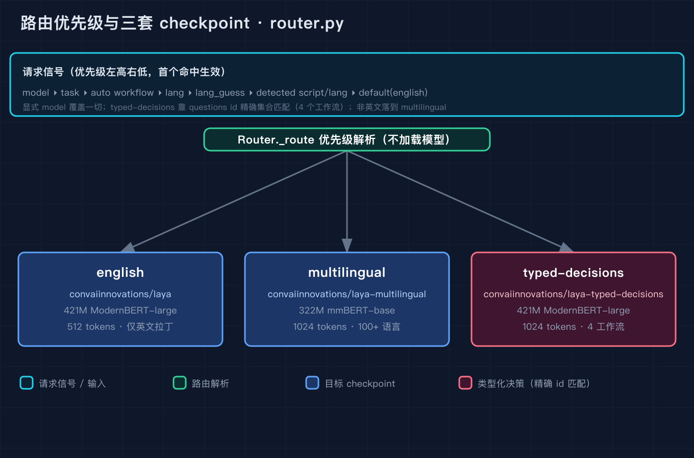
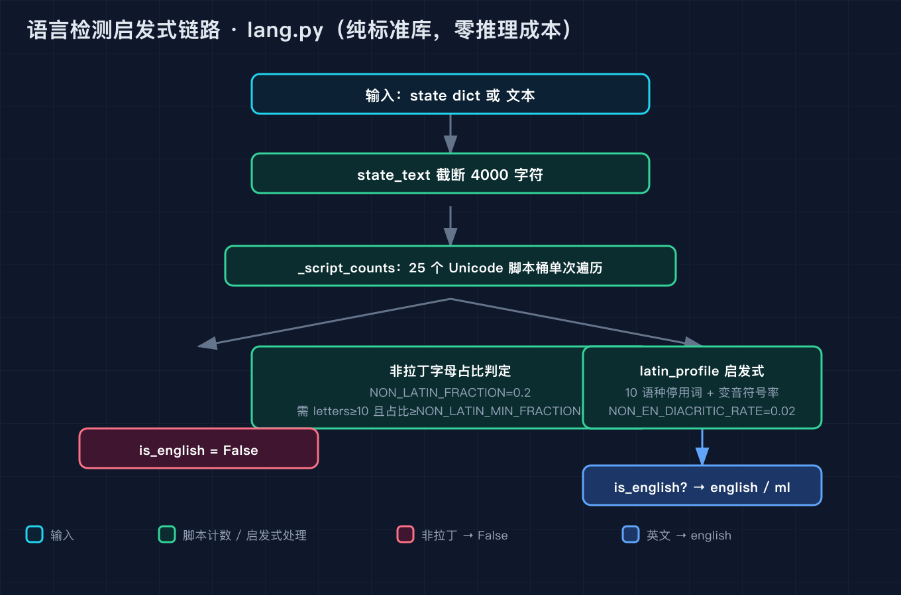
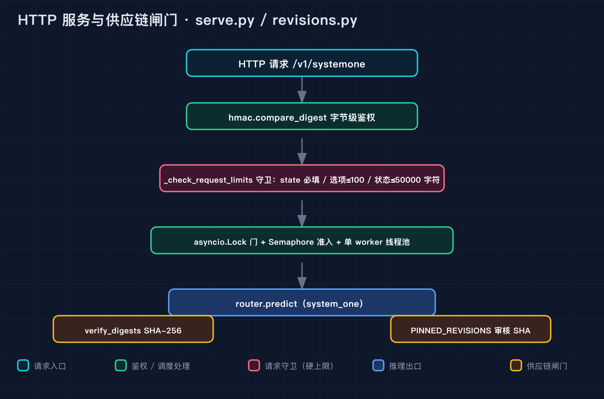

# Laya 源码级原理拆解之四：路由检测与服务部署

之一讲了 Laya 的整体架构和运行入口，之二讲了序列打包和决策头，也就是它怎么在不逐 token 生成的前提下给每个选项打分，之三讲了 structured、shortlist、email 三个把模型接进业务的胶水模块。这一篇我拆最后一段链路，也就是模型真正被调用之前那层看不见的调度：同一份代码背后其实蹲着三套参数（英文 checkpoint、多语言 checkpoint、类型化决策 checkpoint），到底用哪套不是你写的，是它自己选的。我用一个真实场景串起这一篇，一封客服工单进来，内容可能是英文、可能是德语、可能是中文、也可能一半葡语一半英文堆栈，Laya 要先把语言认出来，再选对 checkpoint，最后才轮到之三讲的那些分诊逻辑。

这整段链路散在五个文件里：router.py 负责选 checkpoint，lang.py 负责认语言，revisions.py 负责保证你下载的模型文件没被调包，onnx_agent.py 是 PyTorch 之外的另一条推理路径，serve.py 把它包成一个能上线的 HTTP 服务。其中 lang.py 和 revisions.py 是纯标准库，我今天带的三个 demo 都不需要 torch、不需要 numpy、不需要 API key。

## 第一节：三套 checkpoint，到底用哪套是它自己选的

router.py 一开头就钉死了仓库名和默认模型。BUNDLE_REPO = "convaiinnovations/laya"，DEFAULT_MODELS 列了英文和多语言两套，STANDALONE_MODELS 把三套都登记了。三套 checkpoint 我先把底摸清楚：english 是 convaiinnovations/laya，421M 的 ModernBERT-large，输入截断到 512 tokens；multilingual 是 convaiinnovations/laya-multilingual，322M 的 mmBERT-base，截断到 1024 tokens，覆盖 100 多种语言；typed-decisions 是 convaiinnovations/laya-typed-decisions，也是 421M 的 ModernBERT-large，截断到 1024 tokens，专门吃四种工作流的固定问题集合。

选哪套的逻辑在 _route 里，行 457 到 548。它是一串优先级，从高到低依次是：显式 model 覆盖一切，显式 task 次之，然后如果开了 auto_task_detection 就看检测出的 workflow 是否精确命中那四种之一，接着是显式 lang，再是 lang_guess（调用方给的或者 Router 级别默认的都算），最后是检测出的脚本或语言，全都没有就落 default，默认 english。这个顺序很重要，因为它意味着你一旦显式传了 model，后面所有的语言检测都不再生效，你拿德语文本配 model="english" 它就会硬用英文 checkpoint 去读，读不懂不是它的错。

typed-decisions 的命中是靠精确 ID 集合做的，不是模糊匹配。_TYPED_DECISION_WORKFLOWS 里列了四个工作流，agent_trace_observability、customer_service、invoice_processing、security_incidents，每个都挂着一组精确的问题 ID。match_typed_decisions_workflow 拿请求里的 questions 集合去和这几个固定集合做相等比较，全中才路由到 typed-decisions，多一个少一个都不行。这个设计很硬，它把"这是不是一个类型化决策场景"变成一个可穷举的判定，而不是让模型去猜。

语言到 checkpoint 的映射靠 _english_from_code，行 156 到 174，纯标准库逻辑。它先认 _ENGLISH_SUBTAGS = ("en","eng","english")，再排除 _LANGUAGE_AGNOSTIC_CODES = ("c","posix","und","zxx","mul") 这种不命名语言的 LANG 值。所以 lang="de" 会被判成非英文，落到 multilingual；lang="en" 落到 english；lang="c" 直接弃权，整个 state 没字母时走 default。

这里有个我一开始没注意到的对称：Router 对外暴露的 system_one 就是 predict 本身，源码里就一行 system_one = predict（行 658）。也就是说 Router 的公开接口和单个 Agent 的 system_one 长得一模一样，你接业务时不需要关心背后是单 checkpoint 还是三套自动切换，调用栈上完全可替换。predict 内部先调 self.route 把 checkpoint 选出来，再 self.load 加载，最后调 agent.system_one 跑一次前向，路由结果还会塞进返回的 routing 字段，方便你事后查这次到底走了哪套。真正体现"每条请求单独选"的是 predict_batch（行 702），它先用 route_batch 把整批请求各自独立路由一遍（每条都能带自己的 model、task、lang、lang_guess，问题 schema 也可以不同），再按选中的 checkpoint 分组，只有落在同一套 checkpoint 且问题 schema 也相同的请求才会合并成一次前向，最后按原顺序还原。所以它省的是"反复加载模型的抖动"，不是"把所有请求塞进同一个模型"，分组逻辑本身已经承认每条请求可能该去不同的 checkpoint。

我写了 demo_router.py 复刻这一节的全部优先级逻辑，analyse 那一步我用了一个可注入的 mock，所以不需要真的加载 torch。跑出来的样子是这样的：

```
== 路由优先级演示（analyse 默认返回英文拉丁文本）==
  显式 model=ml                                    -> multilingual     explicit model='ml'
  显式 task=typed_decisions                        -> typed-decisions  explicit task='typed_decisions'
  显式 questions=customer_service + auto=True      -> typed-decisions  question ids match the 'customer_service' typed-decisions workflow
  同上但 auto=False（关掉后穿过到检测）                       -> english          English Latin text
  显式 lang=de                                     -> multilingual     explicit lang='de'
  显式 lang=en                                     -> english          explicit lang='en'
  lang_guess=fr                                  -> multilingual     lang_guess: caller identified this as non-English text
  无任何线索 -> default(english)                      -> english          English Latin text

== 检测分支：注入不同的探测结果 ==
  detect=non-latin  -> multilingual     non-Latin script (han, 100% of letters); English checkpoint cannot read it
  detect=german     -> multilingual     Latin script but language looks like 'de', not English
  detect=english    -> english          English Latin text
```

这张图把整条优先级瀑布和三套 checkpoint 画出来了，从一堆线索落到唯一一个目标。



## 第二节：认语言这件事，它用的全是 Unicode 范围和停用词，不调任何模型

第一节里那个"检测出的脚本或语言"不是另一个模型判的，是 lang.py 用纯标准库手写的启发式。这是我觉得整个 Laya 里最值得讲的一块，因为它在"要不要换多语言 checkpoint"这个关键决策上，没花一分钱推理成本。

lang.py 的第一步是脚本检测，_SCRIPT_RANGES 列了 25 个 Unicode 范围，汉字（han）、假名（kana）、谚文（hangul）、阿拉伯文（arabic）、天城文（devanagari）等等都在内。state_text 把输入裁到 max_chars=4000，_script_counts 单次遍历把每个字符归到对应的脚本桶里，非 ASCII 那一桶占比超过阈值就判为非拉丁。所以中文进来，脚本桶直接是 han，100% 非拉丁，is_english 必然 False，路由秒选 multilingual，这一步没有任何歧义。

真正的模糊地带在拉丁脚本内部。一段拉丁文本到底是英文还是德文还是葡文，lang.py 不靠模型，靠的是停用词和变音符号。_STOP 里塞了英、法、德、西、葡、意、荷、罗、孟、阿塞拜疆十种语言的停用词，每种语言都有自己的高频小品词。一个词命中德文停用词"und"或"der"，就给德文加一分；命中英文停用词"the"或"and"就给英文加一分。NON_EN_DIACRITICS 是一组英文没有的变音符号，比如德文的 ä ö ü、葡文的 ã ç，文本里非英文变音符号占比超过 NON_EN_DIACRITIC_RATE=0.02 就拉响非英文警报；反过来如果英文停用词命中很多，那个占比阈值会放宽到 ENGLISH_RESCUE_DIACRITIC_RATE=0.06，相当于给英文留一点容错。

非拉丁那一桶也不是一刀切。NON_LATIN_FRACTION=0.2 是总阈值，但只有字母数超过 NON_LATIN_MIN_LETTERS=10 且非拉丁占比超过 NON_LATIN_MIN_FRACTION=0.1 才判非拉丁，短文本证据不足就弃权。这些常量都是手调的 best-effort，源码注释也明说了拉丁脚本下的语言猜测是启发式，不是判决。

还有一种更隐蔽的混合态，正好对应开头那封"一半葡语一半英文堆栈"的工单。lang.py 里 _non_english_segment（行 480）会先做切片，把文本按语言边界切成段，保证较长的英文那一段不会反过来把短的外语段票否决掉，整个读入最多 max_chars=4000 个字符。所以一段"葡语诉求加英文报错栈"进来，它会先识别那段非英文的葡语，再决定整体该走 multilingual，而不是被大段英文带偏成 english。这也是为什么第一段里我说混合语料最考验这套启发式：它靠分段统计而不是整体统计来保命。

demo_lang.py 直接加载了仓库里真实的 lang.py（它没有任何相对 import，importlib 按文件路径加载即可），所以你看到的输出就是真实源码跑出来的：

```
== 真实 lang.analyse 输出 ==
  文本: 'I was charged twice for the same order.'   
    脚本=latin 语言=en 是英文=True 非拉丁占比=0.00 语言未定=False
  文本: 'Mein Konto wurde zweimal belastet.'        
    脚本=latin 语言=de 是英文=False 非拉丁占比=0.00 语言未定=False
  文本: 'Bonjour, je voudrais annuler ma commande.' 
    脚本=latin 语言=fr 是英文=False 非拉丁占比=0.00 语言未定=False
  文本: '机器眼里没有脸，只有4096个数。'                         
    脚本=han 语言=None 是英文=False 非拉丁占比=1.00 语言未定=True
  文本: 'Quero cancelar minha assinatura agora.'    
    脚本=latin 语言=pt 是英文=False 非拉丁占比=0.00 语言未定=False
  文本: 'C'                                         
    脚本=latin 语言=None 是英文=True 非拉丁占比=0.00 语言未定=True
```

注意最后那个 "C"，它是不命名语言的 LANG 值，语言未定但脚本是 latin 且无字母证据，is_english 落到 True 而不是报错，这就是弃权逻辑在起作用。这张图画的是整条检测链路，从字符级脚本桶到拉丁启发式再到 is_english 这个布尔判决。



## 第三节：模型文件不能被调包，以及它怎么被包成 HTTP 服务

前两节讲的是选哪个 checkpoint 和认什么语言，但还有一个前提没人提：你下载的那份模型文件，凭什么是官方发布的那个，而不是被人换过的。revisions.py 干的就是这个钉死供应链的活。PINNED_REVISIONS 里写了三套 checkpoint 各自审核过的 commit SHA，resolve_revision 把 SHA 解析成缓存里的快照路径，verify_digests 读 LAYA_SHA256_DIGESTS 环境变量里的清单，对下载的文件做 SHA-256 校验，而且明确拒绝绝对路径和 ../ 这种穿越路径，分块读每次 1MB，防止超大文件把内存撑爆。onnx_agent.py 在加载 onnx 模型之前就先调 verify_digests，校验不过压根不会把模型读进来。

说到 onnx_agent.py，它是 PyTorch 之外的另一条推理路径。你如果环境里不想装 PyTorch，可以走 onnxruntime，它导入 onnxruntime、numpy、transformers，session.run 只取 logits 和 act_logits 两个输出，softmax 是手写的 numpy 实现，没有 torch。最关键是它的 system_one 签名和 PyTorch 版 Agent 完全一致，lang_temperatures 校准用的也是同一套常数，所以同一条请求在两条路径上应该得到相同的判断形状。这是 Laya 很聪明的一笔，推理后端可以换，对外接口和校准不变。而你在本篇里看到的 commit 4066d5d，标题正好是 Merge pull request #464 fix/onnx-lang-parity，也就是 onnx_agent.py 和 lang.py 这对路径最近被官方修的那次 parity，所以我拆的这两条恰好是代码最新鲜的一对。

serve.py 是把这一切包成上线的那条线。它用 FastAPI 暴露 Jev 的 /v1/systemone 协议，配置全走环境变量：LAYA_HOST、LAYA_PORT、LAYA_DEVICE、LAYA_PRELOAD、LAYA_MODELS、LAYA_THREADS、LAYA_AUTO_TASK、LAYA_API_KEY、LAYA_LOG_LEVEL、LAYA_MAX_CONCURRENT。鉴权用 hmac.compare_digest 做字节级比较，避免时序侧信道。限流守卫很细，MAX_QUESTIONS=64、MAX_STATE_CHARS=50000、MAX_BODY_BYTES=2MB、MAX_CHOICE_OPTIONS=100、MAX_SCORE_LEVELS=32、MAX_TOTAL_OPTIONS=512，_check_request_limits 里 state 是必填项，缺了直接 400，单题选项超过 100 直接 413。底层用一个 max_workers=1 的线程池，再套 asyncio.Lock 当门、asyncio.Semaphore 当准入，把推理这步锁成串行，因为单进程下多个请求同时塞进同一个 checkpoint 会互相踩显存和中间状态。

demo_serve.py 复刻了 _resolve_model 和 _check_request_limits 两个纯逻辑，用 mock 的 HTTPException 跑，不需要真起 FastAPI：

```
== _resolve_model：Jev id 应被忽略，Laya checkpoint 名应被识别 ==
  'jev-1'                                -> None
  'gpt-4o'                               -> None
  ''                                     -> None
  'english'                              -> english
  'ml'                                   -> multilingual
  'convaiinnovations/laya-multilingual'  -> multilingual
  'convaiinnovations/laya'               -> None

== _check_request_limits：超限应被拒 ==
  正常请求(state+3选项) -> 通过
  缺 state -> 400 'state' is required
  单题超 100 选项 -> 413 too many choice options for 'big' (200 > 100)
```

有一个细节值得点出来，_resolve_model 里 Jev 的模型 id 会被忽略返回 None，因为 Jev 是上游判断引擎，Laya 只认自己这一族的 checkpoint 名（english、ml、typed 等别名由 normalise_name 归一化），其他名字一律不接。这张图画的是从 HTTP 请求到 router.predict 整条服务链路，以及模型加载前那道 digest 闸门。



## 第四节：三个我踩过的坑，以及你怎么复现

坑一，别以为语言检测百发百中就去省那套多语言 checkpoint。我一开始用一段很短的德文 "Hallo Welt" 去测，结果停用词证据不足，被判成 language_undecided，整条 state 落到默认 english 去读了。要认出德文，得给够长度的文本让停用词和变音符号说话，过短的片段它会老实弃权而不是硬猜，弃权就意味着走默认英文，这时候你最好显式传 lang 而不是指望它自动认。

坑二，typed-decisions 的命中是精确 ID 集合相等，不是模糊包含。我第一次配 customer_service 工作流时，自己在 questions 里多加了一个自定义问题，结果集合和源码里那组精确 ID 对不上，路由直接滑过了 typed-decisions 去了 multilingual。如果你的场景要用类型化决策，questions 必须和那四个工作流定义的问题集合逐字一致，多一个少一个都不行。

坑三，serve 的限制守卫是硬上限，不是建议值。我把一个 200 选项的 choice 直接塞给 _check_request_limits，立刻拿到 413，不会帮你截断。生产环境上游一定要在进 Laya 之前就把自己那侧的选项数压到 100 以内，否则请求会被静默拒绝，而拒绝信息只在服务端日志里，客户端拿到的是裸状态码。我在 demo_serve.py 里把 200 选项那条用例原样留下来了，跑 self-test 时它正好触发 413，你能直接看到守卫在哪一关把请求掐掉。

### 复现模块

这一篇的三个可运行脚本都在仓库里，纯标准库，不需要 torch、不需要 numpy、不需要任何 API key，clone 下来就能跑。demo_lang.py 会直接加载你本地的 laya/lang.py 真实源码，所以你看到的检测输出就是真实启发式跑出来的；demo_router.py 和 demo_serve.py 复刻了路由优先级和请求守卫的纯逻辑，用可注入的 mock 避开重型依赖。

代码地址：https://github.com/beverlyLee/ai-passage/tree/main/2026-09-27-Laya%E6%BA%90%E7%A0%81%E7%BA%A7%E5%8E%9F%E7%90%86%E6%8B%86%E8%A7%A3-%E4%B9%8B%E5%9B%9B/code

数据源地址（被拆解的真实开源代码）：https://github.com/convaiinnovations/laya ，具体文件是 laya/router.py、laya/lang.py、laya/revisions.py、laya/onnx_agent.py、laya/serve.py。本机代码核对到 commit 4066d5d（Merge pull request #464 from AlKor13/fix/onnx-lang-parity，正好就是 onnx 与 lang 的 parity 修复）。

运行命令：

```
python3 code/demo_router.py --self-test
python3 code/demo_lang.py --self-test
python3 code/demo_serve.py --self-test
```

三个脚本的 self-test 都会打印一行 `self-test PASS`。不带 --self-test 跑则打印上面三节里贴出的 demo 输出，路由优先级瀑布、真实语言检测样例、请求守卫拒收，全部可逐行核对。要跑 demo_lang.py 的真实源码检测，把 LAYA_LANG_PATH 指向你 clone 下来的 laya/lang.py 即可，默认它找的是 /tmp/laya-src/laya/lang.py。demo_router.py 每行输出末尾那串备注就是命中分支的来源，比如 explicit model 还是 English Latin text，对照第一张图的优先级瀑布能直接定位这次路由掉进了哪一层。

## 结尾钩子

回到开头那封德语工单，我原本以为选哪套参数是我这个接入方该操心的事，结果 Laya 把它变成了一个 Unicode 范围加一组停用词就能定的事，连模型都没调。但你有没有想过，这套检测全靠启发式常量手调，NON_EN_DIACRITIC_RATE 那几个阈值一旦设在你的语料上水土不服，它就会 silently 把一段本该走多语言的文本塞进英文 checkpoint，而你从输出里完全看不出它选错了。你在实际项目里是愿意信任这套零成本的自动检测，还是宁可每次显式传 lang 把决策权拿回来。如果这个自动选 checkpoint 的机制对你接判断模型有启发，把你正在做的那个多语言场景评论区发我，我下一篇会拆 Laya 的训练侧，看它那三套 checkpoint 到底是怎么被蒸馏出来的，以及为什么 multilingual 那套反而比英文的小。
