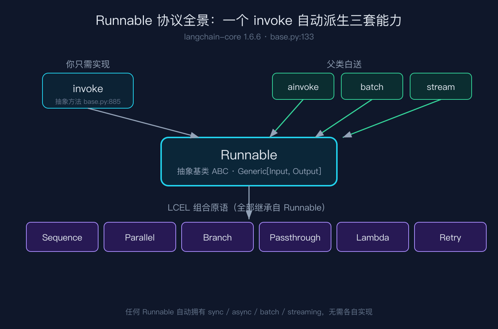
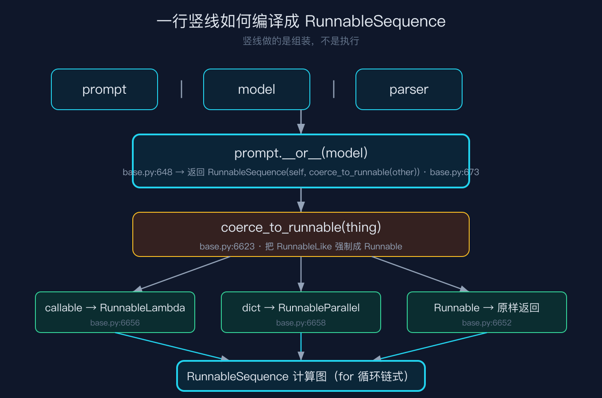
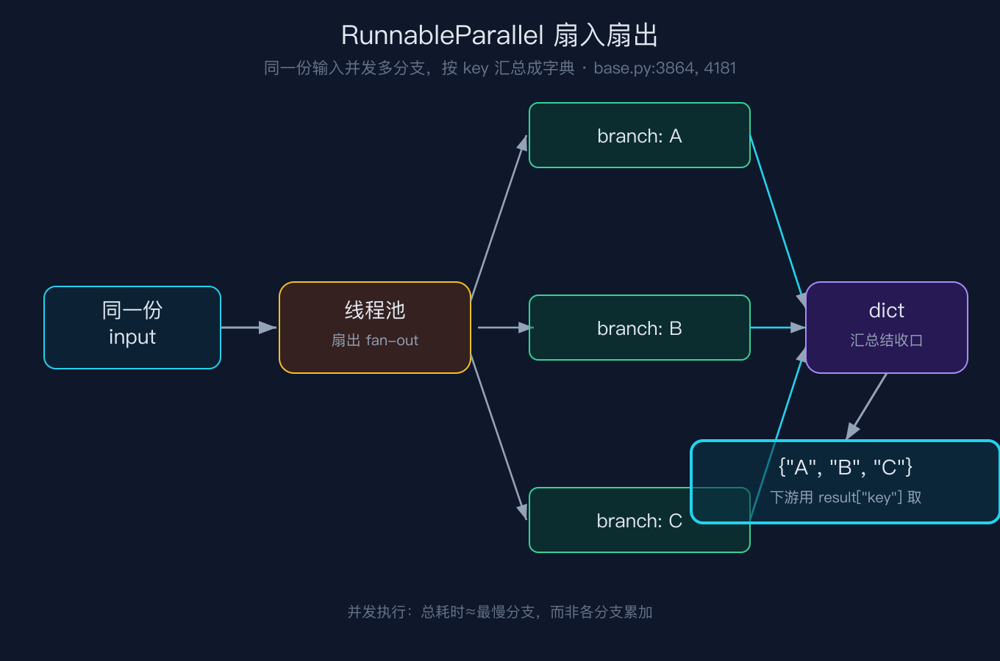

# 我把 prompt 竖线 model 竖线 parser 写成一行就上线，直到账单炸了才看懂它不是函数组合

我第一次用 LangChain 写链的时候，照着文档敲了 `prompt | model | parser`，一行竖线就跑通了。当时我心里的模型很简单：这不就是函数式编程里把几个函数串起来嘛，上游的输出喂给下游的输入，没什么新鲜的。直到生产环境里连续发生了三件我没法用「语法糖」解释的事，我才被迫去翻 langchain-core 的源码。

第一件，账单里某条链路的 output_tokens 几乎为零，可它明明调用了模型。第二件，我随手在管道里塞了一个普通的 Python 函数和一个字典，它居然也能跑，没有任何报错。第三件，我压根没给那条链写异步或流式代码，可整条链用 `ainvoke` 调的时候，居然「免费」变成了异步。这三件事拼在一起，结论只有一个：竖线背后编译出来的不是函数组合，而是一张可序列化、可异步、可并发的计算图。这篇文章我带你从源码级看清这张图的底座，也就是 Runnable 协议和 LCEL 的第一块基石。

## 案例：那行竖线到底做了什么

下面这一行，是我开头那个场景的最小复现，也是贯穿全文的例子。

```python
chain = prompt | model | parser
result = chain.invoke("地球为什么是圆的")
```

很多人的直觉（包括当时的我）是：竖线等于「先算左边的，把结果传给右边」。但源码告诉我们，竖线这一刻根本没算任何东西，它只做了一件事，把两边包成一个新的对象。真正的计算，要等你调用 `.invoke()` 才发生。理解了这一点，开头那三件怪事就全解开了。

## 一、Runnable 不是接口约定，是协议全家桶

LCEL 的所有组件都继承自 `Runnable`。在 langchain-core 1.6.6 里，它的定义是 `class Runnable(ABC, Generic[Input, Output]):`，落在 `libs/core/langchain_core/runnables/base.py` 的第 133 行。这个抽象基类只强制子类实现 `invoke`（抽象方法，在 base.py 第 885 行声明）。

但真正有意思的是父类白送的那一半。只要你实现了同步的 `invoke`，父类就用线程池帮你把 `ainvoke` 兜底出来。base.py 第 908 行的默认实现本质上就是 `return await run_in_executor(config, self.invoke, input, config, **kwargs)`。同理，批量、流式这些能力也都在父类里用类似方式默认派生。

也就是说，任意一个 Runnable，只要写了同步的 invoke，它就自动长出了异步、批量、流式三套本领。这就解释了开头第三件怪事：我的链上组件是同步写的，但整条链 `ainvoke` 时它免费变成了异步。这不是魔法，是 Runnable 协议在父类里用执行器兜底的必然结果。我在仓库的 `code/runnable_sequence.py` 里用纯标准库复刻了这段逻辑，跑出来的结果和结论一致：子类只写 invoke，父类就给了它 ainvoke。



## 二、竖线不是调用，是「包成图」

这是最反直觉的一处。当 Python 看到 `prompt | model`，它触发的是 `prompt.__or__(model)`。看 base.py 第 648 行开始的 `__or__` 方法，最关键的一行在第 673 行：

```python
return RunnableSequence(self, coerce_to_runnable(other))   # base.py:673
```

注意，它返回的是一个 `RunnableSequence` 对象，而不是把 `other` 跑了一遍。换句话说，竖线做的是组装，不是执行。第一段代码里那一行的 `chain`，在竖线结束的瞬间只是一个对象，里面的 `model`、`parser` 一个都没被调用。

而 `coerce_to_runnable` 是竖线能接几乎任何东西的根本原因。它定义在 base.py 第 6623 行，逻辑非常直白：已经是 Runnable 就原样返回（第 6652 行）；是生成器就包成 RunnableGenerator（第 6654 行）；是可调用对象，也就是普通函数，就包成 RunnableLambda（第 6656 行）；是字典就包成 RunnableParallel（第 6658 行）；以上都不是才抛 TypeError（第 6664 行）。

这就解释了开头第二件怪事：我在管道里直接塞了一个 Python 函数和一个字典，它为什么能跑。因为 `coerce_to_runnable` 把它们分别包成了 RunnableLambda 和 RunnableParallel。竖线接受的其实是 RunnableLike，而不是 Runnable 本身。我在脚本里把 `prompt | model | 裸函数` 跑了一遍，第三步确实被 coerce 成了 RunnableLambda，和源码第 6656 行对得上。



## 三、RunnableSequence 的 invoke 就是一个 for 循环

`RunnableSequence` 的构造函数（base.py 第 3169 行）会先把你传进来的 steps 做扁平化。如果遇到嵌套的 RunnableSequence，它就把对方的 steps 拆出来平铺（第 3193 行），否则调用 `coerce_to_runnable` 再包一遍（第 3196 行）。如果铺平之后少于两个 step，直接抛 ValueError（第 3197 行）。

真正的执行在 `RunnableSequence.invoke`，定义在 base.py 第 3430 行。核心就是下面这段：

```python
for i, step in enumerate(self.steps):
    config = patch_config(config, callbacks=run_manager.get_child(f"seq:step:{i + 1}"))
    with set_config_context(config) as context:
        if i == 0:
            input_ = context.run(step.invoke, input_, config, **kwargs)
        else:
            input_ = context.run(step.invoke, input_, config)
```

看清楚了吗。第一步的输入是整条链的原始输入，从第二步起，每一步的输入都是上一步的返回值。所谓「链式调用」，在源码里就是这么朴素的一个 for 循环，把 `step.invoke` 的输出当下一步的输入。这也回答了开头第一件怪事的近亲问题：为什么竖线跑通后我没写任何「把上游输出传给下游」的代码，因为这段循环替我做了。脚本 `runnable_sequence.py` 里那段 `prompt | model | parser` 风格的链，跑出来正是逐步喂值的产物。

## 四、RunnableParallel 让同一份输入扇出到多个分支

LCEL 里用字典语法 `{ "key": runnable }` 就能表达「同一份输入，并发跑多个 Runnable，最后按 key 汇总成字典」。底层就是 RunnableParallel，定义在 base.py 第 3864 行。它的 invoke（base.py 第 4139 行）长这样：

```python
steps = dict(self.steps__)
with get_executor_for_config(config) as executor:
    futures = [
        executor.submit(_invoke_step, step, input, config, key)
        for key, step in steps.items()
    ]
    output = {
        key: future.result()
        for key, future in zip(steps, futures, strict=False)
    }
```

同一个 `input` 被同时提交给线程池里的每个分支，等所有 future 完成后，按 key 拼成字典返回。这就是扇入扇出：一份输入，多个分支，一个字典收口。我在脚本 `runnable_parallel.py` 里放了两条各睡 0.2 秒的分支，并发跑完总耗时约 0.21 秒，而不是 0.4 秒，证明它确实是并发而非串行。



## 五、两个容易被忽略的配角

RunnablePassthrough 定义在 `passthrough.py` 第 74 行，几乎是恒等函数。它的 invoke 核心就是 `identity`，第 233 行写的是 `return self._call_with_config(identity, input, config)`。你在 LCEL 里写 `RunnableParallel({"origin": RunnablePassthrough(), "llm": chain})`，就是为了让 origin 字段原样透传，好让下游既能拿到 LLM 的结果，又能拿到原始问题。它在字典流里专门负责不加工地搬运。脚本里我让一个值穿过 RunnablePassthrough，出来还是那个值，符合源码的 identity 语义。

RunnableBranch 定义在 `branch.py` 第 43 行，是条件路由。它的 invoke（branch.py 第 185 行）按顺序扫分支：每个分支是 `(condition, runnable)` 二元组，先跑 condition，只要第一个返回真值就执行对应 runnable 并 break，全都不命中才走 default（第 229 行）。所以分支的书写顺序就是优先级，宽条件放前面会挡住窄条件。脚本 `runnable_branch.py` 用「代码模式 / 数学模式 / 通用兜底」三层路由验证了这一点，又把 `lambda x: True` 这种兜底条件放到第一顺位，结果后面的分支果然成了死代码。

## 六、我踩过的四个坑

坑一：普通函数塞进管道会悄悄丢失流式能力。你写 `prompt | my_func | model`，如果 my_func 是裸的 Python 函数，`coerce_to_runnable` 会把它包成 RunnableLambda（base.py 第 6656 行）。但 RunnableLambda 默认没有实现 `transform` 和 `astream`，它只有 invoke。结果就是，整条链一旦经过这个 lambda，流式会被迫退化成等到最后一次性吐出。我之前做实时打字机效果，发现某一段突然不流式了，查了半天才定位到是中间塞了个没实现 stream 的 lambda。脚本 `runnable_parallel.py` 的第 3 项自检也复现了这点：一个只有 invoke 的 lambda 走 transform，出来的是单块而不是分块。

坑二：RunnableParallel 的 key 会重塑你的数据结构。它把每个分支的结果塞进字典的对应 key 之下，下游必须用 `result["key"]` 去取。如果 key 写错，直接 KeyError；如果两个分支无意中用了同一个 key，后写的会静默覆盖先写的，而且不报错。我见过有人写成 `{ "answer": llm, "answer": fallback }`，自己把自己覆盖了。

坑三：RunnableBranch 的条件顺序即路由，和写 if-elif 完全一样。branch.py 第 208 行的 for 循环是「第一个为真就 break」，所以你把 `lambda x: True` 这种兜底放在第一顺位，后面所有分支都成了死代码。反过来，窄条件必须排在宽条件前面，否则永远命中不到。

坑四：RunnableSequence 会自动扁平化嵌套序列（base.py 第 3193 行），所以 `((a | b) | c) | d` 和 `a | b | c | d` 在运行时是同一张图。我一度想给中间那段 `a | b` 单独挂 callback 做埋点，结果挂上去没生效，因为构造时它已经被拆平并并进大图了，运行时根本不存在一个独立的 `a | b` 对象。

## 结尾钩子

回到开头那个场景。我把一行竖线写上去线，账单里 output_tokens 几乎为零，是因为当时接的模型把「判断」和「生成」分开了，竖线只编排了判断那一半，生成另算。你有没有哪次以为自己用了 LangChain 的流式或异步，其实是 Runnable 协议在父类的线程池里默默兜底？把你踩过的 LCEL 坑发在评论区。下一篇我写之二，讲 LCEL 的流式（stream）和异步（ainvoke）到底是怎么免费长出来的，以及它们为什么会让你的耗时账单长成你没想到的形状。

## 复现模块

代码地址：本仓库 `2026-09-30-LangChain源码级原理拆解-之一/code/` 下三个纯标准库脚本，免任何第三方依赖，免 API key。

数据源地址：langchain-core 1.6.6，commit `a9780cd3dd73135d21d7130b08711685f2700d51`（GitHub：langchain-ai/langchain，路径 `libs/core`）。所有源码行号均对照此版本，版本升级后行号可能漂移。

运行命令（在 code/ 目录下）：

```bash
python3 runnable_sequence.py --self-test
python3 runnable_parallel.py --self-test
python3 runnable_branch.py --self-test
```

预期输出（逐行，已实跑核对）：

```text
== runnable_sequence self-test ==
1) prompt | model | 裸函数 链式产出: 问题：地球为什么是圆的 请给出一句话答案。答案是 A。
2) 第三步类型: RunnableLambda
3) 并行扇出字典 keys: ['a', 'b']
4) 嵌套序列展平后 step 数: 3
5) 单 step 抛 ValueError: OK
self-test PASS

== runnable_parallel self-test ==
1) 并发扇出耗时(秒): 0.21 结果: {'fast': 'A:x', 'slow': 'B:x'}
2) RunnablePassthrough 透传: 任意值
3) 裸 lambda 的 transform 退化为单块: ['hihihi']
4) 字典 coerce 成并行后结果: {'a': 'A:z', 'b': 'z'}
self-test PASS

== runnable_branch self-test ==
1) 代码模式路由: [代码模式] print(1)
2) 数学模式路由: [数学模式] 1+1
3) 兜底路由: [通用模式] hello world
4) 宽条件前置挡住窄条件: 被宽条件吃掉
self-test PASS
```

这四个坑和上面三段输出，就是这一篇想让你带走的全部：竖线做的是组装不是执行，`coerce_to_runnable` 是它能接函数与字典的根，链式调用只是个 for 循环，而并发、透传、路由各有各的源码落点。
