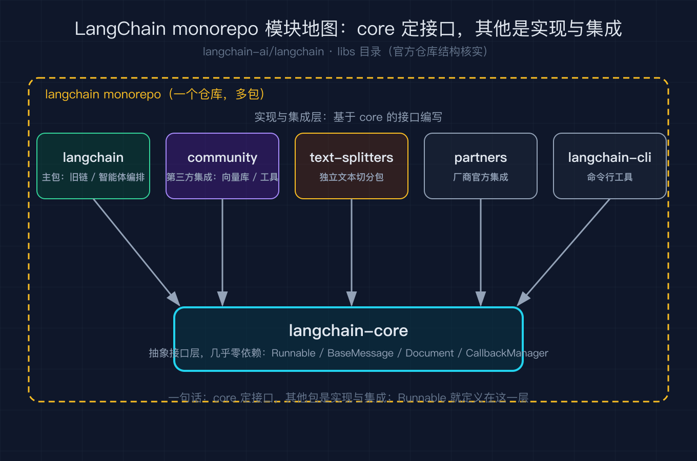
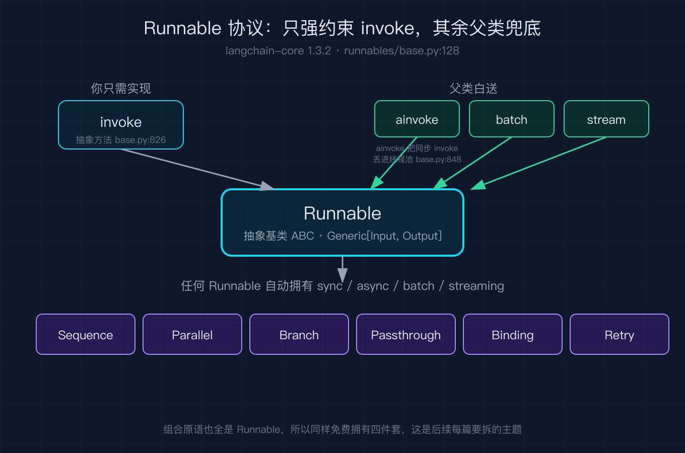
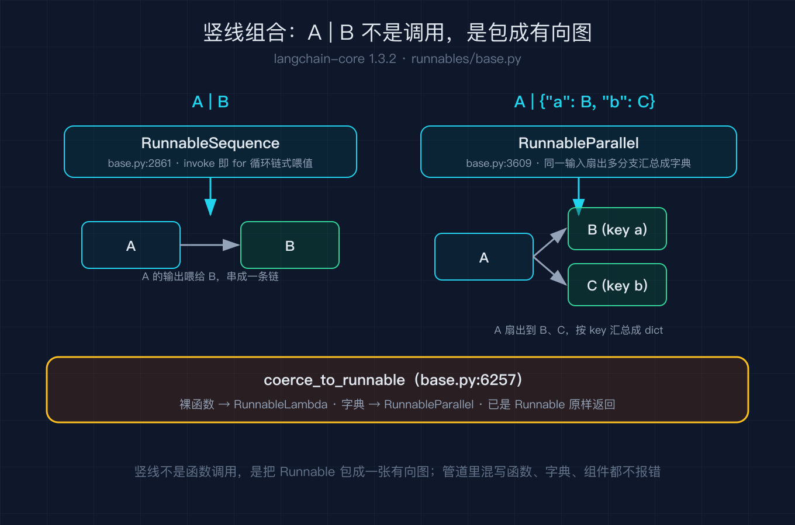

# 我照着文档拼了三个月 LangChain，直到重写一遍才看懂它由哪几块拼成

这是「LangChain 源码级原理拆解系列」的开篇。先把话说在前面：下面每一篇都只讲一个被文档一笔带过、却真正决定你代码长什么样的点，并配一张深色技术图和一段能断点运行的纯标准库复刻脚本（不依赖 langchain，免 key 复现），代码地址我在每篇末尾给。

我第一次用 LangChain 是照着官方快速入门，把 prompt 模板、模型、解析器用竖线一拼就上线了。三个月里我加了记忆、换了模型、接了检索，管道越写越长，但要是有人问我「LangChain 到底由哪几块拼成」，我只能蹦出 prompt、model、chain 这几个词。直到某天账单异常，我顺着竖线往源码里钻，才第一次把整张地图拼起来。这篇就是那次重写之后的总览：先给你一张全局模块地图，再讲真正串起一切的那条规则，最后用十几行纯标准库代码把这套架构跑给你看。

## 一、LangChain 不是一块铁，是几层包

很多人以为 LangChain 是一个库，其实它是一个 monorepo，拆成了几个职责不同的包。我核对了官方仓库结构（langchain-ai/langchain 的 libs 目录），顶层长这样：core 定义抽象接口，community 装第三方集成，text-splitters 管文本切分，partners 按厂商拆开官方集成，cli 是命令行工具。



最核心的是 langchain-core，它只定义抽象接口，几乎不依赖任何东西：Runnable 协议、消息类型 BaseMessage、文档类型 Document、回调 CallbackManager 都在这层。你写的 prompt 模板、ChatModel、Retriever 之所以能互相竖线拼接，根子就在这个 core 里的 Runnable。

往上一层的 langchain 主包，负责把各种旧式链、智能体、检索器用 core 的接口重新编排一遍；langchain-community 装的是第三方集成（各种向量库、加载器、工具）；langchain-text-splitters 是独立的文本切分包；partners 目录是按厂商拆开的官方集成（比如某个大模型厂商一个包）。一句话记住：core 定接口，其他都是实现和集成。

## 二、真正串起一切的是一条规则：所有组件都是 Runnable

我打开 langchain-core 的 runnables/base.py，第一个让我停住的类是 `class Runnable(ABC, Generic[Input, Output])`（base.py:128）。它只强制一个抽象方法 `invoke`（base.py:826）。关键在于：父类还白送了 `ainvoke`、`batch`、`stream` 的默认实现，异步那个甚至只是把同步 invoke 丢进线程池（`async def ainvoke` 里 `return await run_in_executor(config, self.invoke, ...)`，base.py:848）。



这就解释了那件怪事：我只写了同步的 invoke，却免费拿到了异步和批量。也解释了为什么 ChatModel、PromptTemplate、Retriever 都能竖线拼，因为它们都实现同一个 Runnable 接口。竖线不是函数调用，是把 Runnable 包成图，这点我们下节说。

## 三、竖线不是调用，是把 Runnable 包成一张有向图

`A | B` 在 Python 里触发 `A.__or__(B)`，LangChain 让 Runnable 的 `__or__` 返回一个 RunnableSequence（base.py:2861），也就是把 A、B 串成一条链。`A | {"a": B, "b": C}` 则返回 RunnableParallel（base.py:3609），同一份输入扇出到多个分支再汇总成字典。



最妙的是 `coerce_to_runnable`（base.py:6257）：你往竖线里塞一个裸函数，它会被包成 RunnableLambda；塞一个字典，会被包成 RunnableParallel；已经是 Runnable 就原样返回。这就是为什么管道里能混着写函数、字典和正式组件，解释器不报错。这一节的逻辑，我用一段纯标准库复刻在第五节跑给你看。

## 四、剩下的积木，就是后面每篇要拆的每一部分

我在 base.py 和兄弟文件里数了一下，组合原语远不止 Sequence 和 Parallel：条件路由 RunnableBranch（branch.py:42）、恒等透传 RunnablePassthrough（passthrough.py:74）、失败兜底 RunnableWithFallbacks（fallbacks.py:36）、自动重试 RunnableRetry（retry.py:48）、绑定参数的 RunnableBinding（base.py:6013）、带对话历史的 RunnableWithMessageHistory（history.py:38）。它们每一个都值得单独写一篇，这也是本系列后续篇目的安排。

## 五、小例子：用十几行纯标准库把这套架构跑起来

光看地图记不住。我手搓了一个不依赖 langchain 的迷你版（code/lcel_mini.py），把 Runnable 协议、竖线组合、coerce 全复刻了，正好对应上面三张图的逻辑。它要证明的核心只有四件事：所有组件实现 invoke；父类给 ainvoke 和 stream 默认实现；竖线包成 Sequence，字典触发 Parallel；裸函数或字典被自动包成 Runnable。LangChain 几百个组件，全挂在这条规则上。

```python
# 极简骨架（完整版在 code/lcel_mini.py）
class Runnable(ABC):
    @abstractmethod
    def invoke(self, x): ...
    def ainvoke(self, x):                       # 父类兜底：线程池跑同步 invoke
        with ThreadPoolExecutor(1) as ex:
            return ex.submit(self.invoke, x).result()
    def __or__(self, other):                    # 竖线 -> Sequence
        return Sequence([self, coerce(other)])

class Sequence(Runnable):
    def invoke(self, x):
        for s in self.steps: x = s.invoke(x)     # 就是个 for 循环
        return x
```

跑到终端里，一条 prompt 模板、假模型、解析器拼成的管道直接出结果，扇出和透传也都正常。这就是 LCEL 的全部心法，只不过真实代码多了类型、配置和流式透传的细节。

## 六、本篇你可以带走的一句话

如果你只记一句：LangChain 的复杂度不在算法，在于它用「一个 Runnable 接口 + 一堆组合原语」把 prompt、模型、检索、记忆、智能体统一成了同一种乐高。看懂这张地图，后面每篇拆哪块你都不会迷路。

## 结尾钩子

你有没有哪次照文档拼管道，上线之后才发现根本没理解它在干什么？评论区聊聊你的版本。下一篇我带你钻进 Runnable 协议本身，把 Sequence、Parallel、Branch、Passthrough 每一个原语的源码逐行走查，并给一个能断点运行的复刻脚本，顺便讲清楚父类线程池是怎么让 ainvoke 和 stream 免费长出来的。

## 复现模块

- 代码地址：本目录 `code/lcel_mini.py`（纯标准库，免 key 复现）
- 数据源：已安装 `langchain-core` 1.3.2，关键行号 `runnables/base.py:128` / `826` / `848` / `2861` / `3609` / `6257`；`runnables/branch.py:42`；`runnables/passthrough.py:74`；`runnables/fallbacks.py:36`；`runnables/retry.py:48`；`runnables/history.py:38`
- 运行命令：`python3 code/lcel_mini.py --self-test`
- 预期输出（实跑逐行）：

```
self-test PASS
```

- 想看完整管道演示：`python3 code/lcel_mini.py`
- 演示输出（实跑逐行）：

```
invoke 结果: 答案是 A。
stream 逐段: ['答案是 A。']
Parallel 扇出: {'short': '答案是 A。', 'raw': '答案是 A。'}
Passthrough: 问题：透传测试
请给出一句话答案。
```

- 想直接看 Sequence、Parallel、Branch 各自怎么动：跑 `code/runnable_sequence.py` / `code/runnable_parallel.py` / `code/runnable_branch.py`，三个 `--self-test` 全绿（它们是后续「组合原语深拆」篇的实践素材，本篇先把整体地图给你）。

## 讲给别人听：四句话版本

- LangChain 是 monorepo，langchain-core 定接口，其他包是实现与集成。
- 所有组件都是 Runnable，只强制 invoke，其余方法父类兜底。
- 竖线不是调用，是把 Runnable 包成图；coerce 把函数或字典自动包成 Runnable。
- 组合原语（Sequence、Parallel、Branch、Passthrough、Fallbacks、Retry、Binding、WithMessageHistory）是后面每篇的主题。
