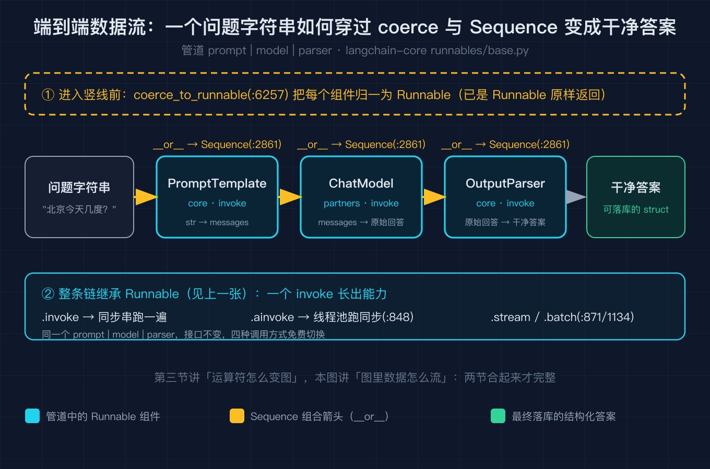
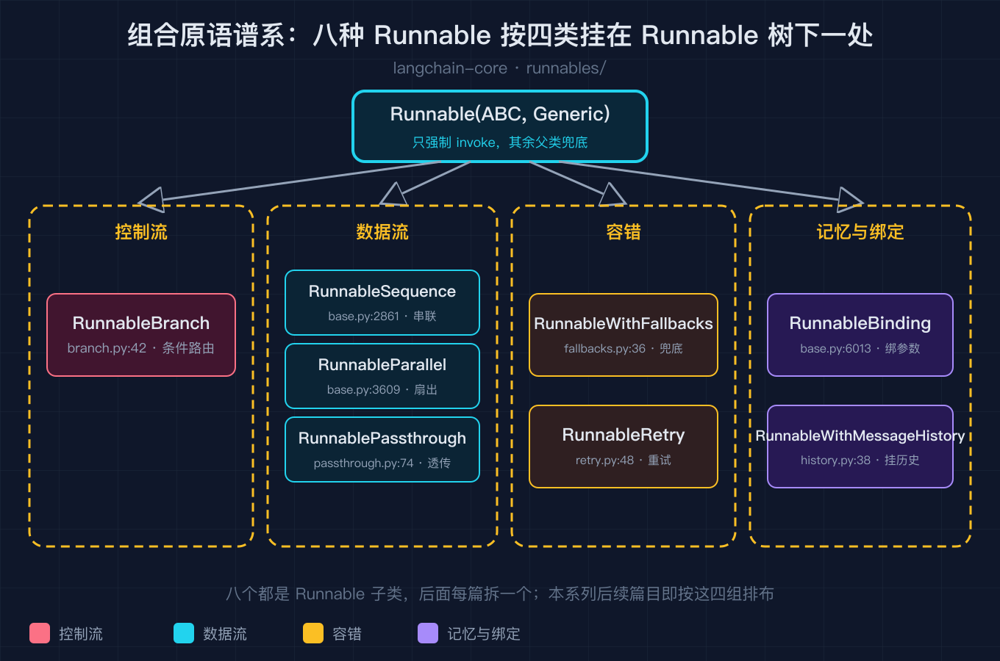

# 我照着文档拼了三个月 LangChain，直到顺着一条竖线钻进源码才看清它由哪几块拼成

这是「LangChain 源码级原理拆解系列」的开篇。先把话说在前面：下面每篇都只讲一个被文档一笔带过、却真正决定你代码长什么样的点，并配一张深色技术图和一段能断点运行的纯标准库复刻脚本（不依赖 langchain，免 key 复现），代码地址我在每篇末尾给。

我第一次用 LangChain 是照着官方快速入门，把 prompt 模板、模型、解析器用竖线一拼就上线了。三个月里我加了记忆、换了模型、接了检索，管道越写越长，但要是有人问我「LangChain 到底由哪几块拼成」，我只能蹦出 prompt、model、chain 这几个词。直到某天账单异常，我顺着那条竖线往源码里钻，才第一次把整张地图拼起来。这篇就是那次重写之后的总览：先给你一张全局模块地图，再讲真正串起一切的那条接口规则，然后用一张端到端图把抽象落到一个能跑的管道上，最后把剩下要拆的积木摆成谱系。图不是装饰，每一张都对应下面一节说理，建议你边读边对照。

## 一、LangChain 不是一个库，是一张分层包地图

很多人以为 LangChain 是一个库，其实它是一个 monorepo，拆成了几个职责不同的包。我核对了官方仓库结构（langchain-ai/langchain 的 libs 目录），顶层长这样：core 定义抽象接口，langchain 主包负责旧链与智能体的编排，community 装第三方集成，text-splitters 管文本切分，partners 按厂商拆开官方集成，cli 是命令行工具。这张图把分层画出来了：上面五个包全部指向最底下的 core。


最核心的是 langchain-core，它只定义抽象接口，几乎不依赖任何东西。看图中 core 那块内部的小格子：Runnable 协议、消息类型 BaseMessage、文档类型 Document、回调 CallbackManager 都在这层。你写的 prompt 模板、ChatModel、Retriever 之所以能互相竖线拼接，根子就在这个 core 里的 Runnable。

一个容易踩的坑是搞错组件归属。图中右下角那条「组件归谁」的标注说清楚了：PromptTemplate 在 core，ChatModel 在 partners 里的某个厂商包（比如 langchain-openai），Retriever 在 community（比如某个向量库）。所以当你 import 路径五花八门时别慌，它们底层全认 core 这个接口。一句话记住：core 定接口，其他都是实现和集成。

## 二、真正串起一切的是一条接口规则：所有组件都是 Runnable

我打开 langchain-core 的 runnables/base.py，第一个让我停住的类是 `class Runnable(ABC, Generic[Input, Output])`（base.py:128）。它只强制一个抽象方法 `invoke`（@abstractmethod 在 base.py:825，方法定义在 base.py:826）。关键在于：父类还白送了 `ainvoke`、`batch`、`stream` 的默认实现，异步那个甚至只是把同步 invoke 丢进线程池（`async def ainvoke` 里 `return await run_in_executor(config, self.invoke, ...)`，base.py:848，真正丢线程池那行在 base.py:869；`batch` 在 base.py:871，`stream` 在 base.py:1134）。这张图把基类画成了带分区的类框：标成玫红的是唯一抽象方法 invoke，标成翠绿的三个是父类白送的默认实现。


这就解释了那件怪事：我只写了同步的 invoke，却免费拿到了异步和批量。也解释了为什么 ChatModel、PromptTemplate、Retriever 都能竖线拼，因为它们都画在图下方的同一棵继承树里，是 Runnable 的子类。竖线不是函数调用，是把 Runnable 包成图，这点我们下节说。

## 三、竖线不是调用，是把 Runnable 包成一张有向图

`A | B` 在 Python 里触发 `A.__or__(B)`，LangChain 让 Runnable 的 `__or__` 返回一个 RunnableSequence（base.py:2861），也就是把 A、B 串成一条链。`A | {"a": B, "b": C}` 则触发 `__ror__`，字典被包成 RunnableParallel（base.py:3609），同一份输入扇出到多个分支再汇总成字典。这张图的左半边画的就是运算符重载到类名的映射。


最妙的是 `coerce_to_runnable`（base.py:6257），图右半边的漏斗就是它：你往竖线里塞一个裸函数，它被包成 RunnableLambda；塞一个字典，被包成 RunnableParallel；已经是 Runnable 就原样返回。这就是为什么管道里能混着写函数、字典和正式组件，解释器不报错。这一节的逻辑，我用一段纯标准库复刻在第六节跑给你看。

## 四、把前面三节串成一次真实调用：一个竖线管道端到端怎么跑

光看规则还是虚。我把一个最常见的管道 `PromptTemplate | ChatModel | OutputParser` 端到端画成数据流，让你看清一次调用在前面三张图里的位置。输入是一个问题字符串，先过 PromptTemplate 包成提示词，再过 ChatModel 出原始回答，最后过 OutputParser 收口成干净答案。图里每一步都标了它在第三节的对应关系：箭头是 `__or__` 拼出的 Sequence，每个节点在进入管道前都先被 coerce 成 Runnable，而任何一步你都可以直接调 `ainvoke` 因为它继承了第二节那棵继承树。



注意这张图和第三节的区别：第三节讲的是「运算符怎么变成图」，这张讲的是「图里数据怎么流」。把两节合起来看，你就明白为什么文档里一行 `prompt | model | parser` 既能同步 invoke，也能 `ainvoke` 异步、还能 `stream` 流式：图的结构由第三节决定，能力由第二节的继承树免费提供。

## 五、剩下的积木，就是后面每篇要拆的每一部分

我在 base.py 和兄弟文件里数了一下，组合原语远不止 Sequence 和 Parallel。这张谱系图按角色把它们分了四组：控制流只有 RunnableBranch（branch.py:42），负责条件路由；数据流是 RunnableParallel（base.py:3609）和 RunnablePassthrough（passthrough.py:74），一个扇出一个透传；容错是 RunnableWithFallbacks（fallbacks.py:36）和 RunnableRetry（retry.py:48），一个兜底一个重试；记忆与绑定是 RunnableBinding（base.py:6013）和 RunnableWithMessageHistory（history.py:38），一个绑参数一个挂历史。它们每一个都值得单独写一篇，这也是本系列后续篇目的安排。



## 六、小例子：用纯标准库把这套架构跑起来

光看地图记不住。我手搓了一个不依赖 langchain 的迷你版（code/lcel_mini.py），把 Runnable 协议、竖线组合、coerce 全复刻了，正好对应上面五张图的逻辑。它要证明的核心只有四件事：所有组件实现 invoke；父类给 ainvoke 和 stream 默认实现；竖线包成 Sequence，字典触发 Parallel；裸函数或字典被自动包成 Runnable。LangChain 几百个组件，全挂在这条规则上。

```python
# 极简骨架（完整版在 code/lcel_mini.py，对应图 02/03/04 的逻辑）
class Runnable(ABC):
    @abstractmethod
    def invoke(self, x): ...
    def ainvoke(self, x):                       # 父类兜底：线程池跑同步 invoke
        with ThreadPoolExecutor(1) as ex:
            return ex.submit(self.invoke, x).result()
    def __or__(self, other):                    # 竖线 -> Sequence（对应图 03）
        return Sequence([self, _coerce(other)])

class Sequence(Runnable):
    def invoke(self, x):
        for s in self.steps: x = s.invoke(x)     # 就是个 for 循环
        return x
```

跑到终端里，一条 prompt 模板、假模型、解析器拼成的管道直接出结果，扇出和透传也都正常。这就是 LCEL 的全部心法，只不过真实代码多了类型、配置和流式透传的细节。

## 七、本篇你可以带走的一句话

如果你只记一句：LangChain 的复杂度不在算法，在于它用「一个 Runnable 接口 + 一堆组合原语」把 prompt、模型、检索、记忆、智能体统一成了同一种乐高。看懂这张地图，后面每篇拆哪块你都不会迷路。

## 结尾钩子

你有没有哪次照文档拼管道，上线之后才发现根本没理解它在干什么？评论区聊聊你的版本。下一篇我带你钻进 Runnable 协议本身，把 Sequence、Parallel、Branch、Passthrough 每一个原语的源码逐行走查，并给一个能断点运行的复刻脚本，顺便讲清楚父类线程池是怎么让 ainvoke 和 stream 免费长出来的。

## 复现模块

- 代码地址：本目录 `code/lcel_mini.py`（纯标准库，免 key 复现）
- 数据源：已安装 `langchain-core` 1.3.2，关键行号 `runnables/base.py:128` / `825` / `826` / `848` / `869` / `871` / `1134` / `2861` / `3609` / `6013` / `6257`；`runnables/branch.py:42`；`runnables/passthrough.py:74`；`runnables/fallbacks.py:36`；`runnables/retry.py:48`；`runnables/history.py:38`
- 运行命令：`python3 code/lcel_mini.py --self-test`
- 预期输出（实跑逐行）：

```
self-test PASS
```

- 想看完整管道演示：`python3 code/lcel_mini.py`
- 演示输出（实跑逐行）：

```
invoke 结果: 答案是 A。
stream 逐段: ['答案是 A。']
Parallel 扇出: {'short': '答案是 A。', 'raw': '答案是 A。'}
Passthrough: 问题：透传测试
请给出一句话答案。
```

- 想直接看 Sequence、Parallel、Branch 各自怎么动：跑 `code/runnable_sequence.py` / `code/runnable_parallel.py` / `code/runnable_branch.py`，三个 `--self-test` 全绿（它们是后续「组合原语深拆」篇的实践素材，本篇先把整体地图给你）。

## 讲给别人听：四句话版本

- LangChain 是 monorepo，langchain-core 定接口，其他五个包是实现与集成。
- 所有组件都是 Runnable，只强制 invoke，其余方法父类兜底（ainvoke 用线程池跑同步）。
- 竖线不是调用，是把 Runnable 包成图；coerce 把函数或字典自动包成 Runnable。
- 组合原语（Sequence、Parallel、Branch、Passthrough、Fallbacks、Retry、Binding、WithMessageHistory）按控制流、数据流、容错、记忆四类挂在同一棵树下，是后面每篇的主题。
