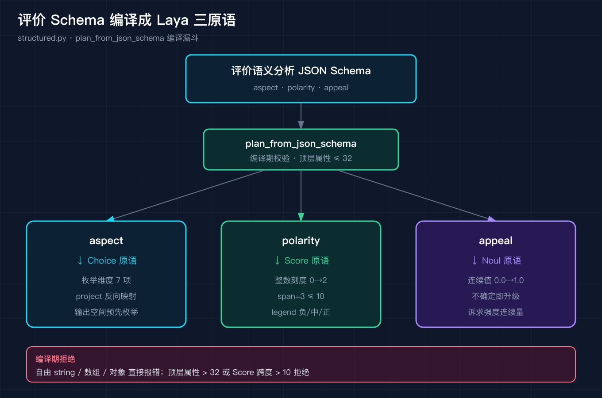
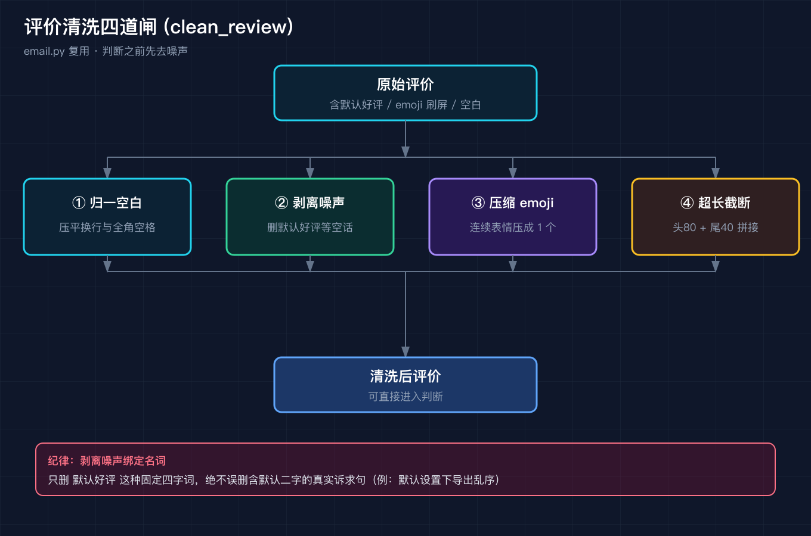

# Laya 源码级原理拆解之五：用户评价语义识别

我接过一个出海 App 团队的活。他们后台每天堆着几百条用户评价，语言杂得很，中文、英文、葡萄牙语、西班牙语混在一起。运营同学最头疼的不是看不懂，而是看不过来。他们真正想做的只有两件事：第一，判断每条评价的感情倾向，是夸还是骂；第二，把里面带着诉求的评价挑出来，比如"希望你们修复导出功能，否则我退订"，优先排给产品去处理。

这件事看似简单，真要做成自动化的判断系统，坑比想象多。我没有直接上手写一堆 if else，而是把 Laya 的 typed-decisions 三原语搬过来，给"用户评价语义识别"重新建一次模。前四篇我已经拆过 Laya 的三原语是什么、structured.py 怎么把 Schema 编译成三原语、email.py 怎么清洗噪声、router.py 怎么把请求路由到对的 checkpoint。这篇我拿一个真实场景把它们串成一条能跑的流水线。

为什么不直接把评价丢给大模型让它写一段总结？因为总结是给人看的，没法统计。运营要的是今天多少条在骂物流、哪些人喊着要退订，这些得是可聚合的结构。Laya 的三原语恰好回答这个问题：它不生产自由文本，它只生产确定性判断。我把评价建模成三原语，等于把看评论这件模糊的事，变成给每条评价打三个确定字段这件可以批量、可以统计、可以接告警的事。

## 先把判断拆成三种确定性形状

用户评价本质上是一堆"判断"。但"判断"这两个字太笼统，没法直接交给模型吐一个自由字符串。Laya 的做法是把判断在数学上拆成三种预先定义好的输出形状，这就是三原语。

落到评价场景，我定义了三个字段。评价的维度，比如续航、拍照、客服、价格、物流、稳定性、其他，这是一个预先枚举的集合，对应 Choice 原语。评价的极性，负向、中性、正向，对应 Score 原语，我用整数刻度 0 到 2，跨度不超过 10。评价里有没有可落地的诉求，对应 Noul 原语，输出一个 0 到 1 之间的连续值，越接近 1 越说明用户带着明确诉求。

注意一个细节，Laya 的 Noul 原本是"不确定即升级"的语义，我这里借用它当诉求强度。这不是生搬硬套，而是因为诉求强度天然是一个连续量，硬切成枚举反而丢信息。把三个字段写成一份 JSON Schema，交给 Laya 的编译漏斗，就得到下面这份编译结果。



```
评价语义分析 Schema 编译结果（三原语）：
{
  "aspect": {
    "name": "aspect",
    "primitive": "choice",
    "options": ["续航", "拍照", "客服", "价格", "物流", "稳定性", "其他"],
    "project": {"续航": "续航", "拍照": "拍照", "客服": "客服", "价格": "价格",
                "物流": "物流", "稳定性": "稳定性", "其他": "其他"}
  },
  "polarity": {
    "name": "polarity",
    "primitive": "score", "minimum": 0, "maximum": 2, "span": 3,
    "legend": {"0": "negative", "1": "neutral", "2": "positive"}
  },
  "appeal": {
    "name": "appeal",
    "primitive": "noul", "minimum": 0.0, "maximum": 1.0
  }
}
```

`aspect` 编译成 choice，因为维度是枚举；`polarity` 编译成 score，因为极性落在整数刻度；`appeal` 编译成 noul，因为它是连续量。这套映射和 Laya 源码 `structured.py` 里的 `_enum_field`、`_score_field`、`_field` 分派完全对应。

还有个容易被忽略的纪律：Laya 的 `plan_from_json_schema` 对顶层属性数有硬上限，是 32。这不是拍脑袋的数字，而是三原语组合爆炸之前的护栏。如果你的契约里塞了三四十个字段，说明你还没想清楚到底要建模什么，应该先合并或下沉。这篇只用了三个字段，远在护栏之内，但把这个上限写进编译漏斗，是为了逼自己在动手前先精简，而不是想到什么塞什么。

## 踩坑一：自由文本在编译期就被拒，不是跑起来才报错

我第一次写 Schema 的时候，顺手加了一个 `comment` 字段，类型写 `string`，想着"把用户原话也存下来"。结果编译漏斗直接抛错：`comment: free string is rejected at compile time`。

这不是 Laya 不够灵活，而是一个刻意的纪律。Laya 要求每一个输出字段都有确定的输出空间，要么是枚举，要么是有限刻度，要么是连续区间。自由文本没有输出空间，一旦放进 Schema，下游就没法做确定性判断，也没法把多条评价聚合成可统计的结构。

真实生产里，原始评价当然要留底，但那该存在数据层，不该混进"判断契约"里。判断契约只管"维度、极性、诉求度"这三件确定性的事。这个坑教会我一件事：先把要建模的对象想清楚，再写 Schema，别拿 Schema 当万能容器。

## 清洗四道闸：判断之前先去掉噪声

一条真实评价进来判断之前，得先过清洗。Laya 在 `email.py` 里有一套 `clean_review` 的四道闸，我直接复用。第一道归一化空白，把各种奇怪的换行和全角空格压平。第二道剥离噪声行，比如系统自动生成的"默认好评""已确认购买"这类空话。第三道压缩 emoji 刷屏，连续一堆表情压成一个。第四道超长截断，头 80 字加尾 40 字拼接，中间丢弃。

举一个具体的例子。一条原始评价可能是这个样子：默认好评。物流挺快😀😀😀 包装   扎实，反正还行。过完四道闸，它会变成：物流挺快 包装扎实 反正还行。开头的默认好评这句空话被剥掉，三个表情压成一个，多余空白被压平。第一道闸不能手太重，就像前面说的，默认设置下导出乱序这种真实句子里的默认二字不能碰，否则清洗本身就成了新的噪声源。



## 踩坑二：剥离噪声时，绝不能误删真实诉求

第二道闸最危险。我一开始用裸词匹配，看见"默认"就删，结果一条真实评价"默认设置下导出还是乱序"被整句删掉了，因为里面恰好有"默认"二字。这条评价恰恰是 R03 里带着功能诉求的那句，删了就等于把用户的投诉当垃圾扔了。

修复方法是把噪声匹配绑定名词，而不是裸词。Laya 源码里也是这个纪律，剥离"已购确认"这类免责页脚时，正则绑的是完整的名词短语，而不是单个字。比如只删"系统默认好评"这种固定四字词，绝不碰"默认设置下"这种正常句子。这个纪律看着小，一旦漏掉一句带着退订威胁的评价，业务损失是实打实的。

## 一条评价拆成多条原子判断，再按维度聚合

这是这篇最关键的一步。一条评价往往同时说到好几个方面。R03 既骂了会员更差，又骂了客服态度，还带了一句功能诉求。如果整条评价共享一个极性，就会把"会员差"和"希望修导出"搅成一团，既看不出哪个维度出问题，也挑不出哪句带诉求。

我的做法是先按连词和句末标点把一条评价拆成多条原子从句，再让每个从句命中它涉及的维度，最后按维度聚合：同一个维度取多数极性，取最大诉求度。聚合之后 R03 就拆成了功能（中性、诉求度 0.9、标为 actionable）、价格（负向）、客服（负向）三条独立判断。


## 踩坑三：极性要按局部窗口判，否则好质量和慢物流会互相抵消

拆从句之后还有个坑。我最初在整条从句上判极性，结果 R05 用葡萄牙语说"到货花了二十一天，但产品质量很好"，从句同时命中了物流和质量，全局极性被"质量好"拉成正向，物流那句"二十一天"反而被判成 positive。一条明显在抱怨物流慢的评价，模型说它物流满意，荒唐。

修复方法是把极性判定限制在命中关键词的局部窗口内。比如物流维度的关键词是"entrega"（葡语送达），我就只在这个词前后十五个字符的窗口里数否定词和肯定词，窗口外"质量好"不进来。改完之后 R05 的物流正确判成 negative，质量判成 neutral。这个坑的本质是：复合判断必须拆到原子粒度，再用代码组合，不能拿全局统计糊弄。

再看几个更复杂的样本，更能看清 mock 的边界。R06 是西班牙语，说镜子到货时有一盏灯不亮，写信给客服，对方让他直接丢掉旧镜子，他不知道车库里那面破镜子该怎么办。我的启发式把质量判成负向（命中 roto），客服判成中性，因为客服那句字面是告知，没有肯定词也没有否定词命中。这是个 mock 的盲区：人能读出客服让他自己处理破镜子其实也是一种推诿，但关键词层读不出来。R08 则是另一种情况，它没骂谁，只是说每个笔记只能插图二十张限制太大，建议提高上限，功能维度诉求度被标到 0.9。纯建议，但足够具体，值得排进 backlog。R07 用英文说买了 VIP 之后崩溃更频繁、客服回复慢，稳定性判成负向，价格判成中性，因为 worth 这种词在窗口里没被充分捕捉。这些例子合在一起说明：启发式能跑通流水线形状，但语义精度得靠真模型补。

## 踩坑四：关键词启发式只是 mock，真实 Laya 用 checkpoint 扛多语种

我得说清楚，上面这套"模型"是确定性关键词启发式，是为了可复现而写的演示替身，不是 Laya 真实的生产模型。它的天花板很明显：R01 用英文写"subscription is worth it"（订阅值这个价），我的启发式把它判成价格中性，但人眼看这是句夸奖。原因很简单，关键词匹配不懂语义，只懂字面。

真实环境里，第二到第四步由 Laya 的 typed-decisions 多语种 checkpoint 承担，再经 `router.py` 路由到对应语种的检查点，根本不需要手写葡语西语的规则。我这个 mock 存在的意义，是把 Laya 的"建模形状"和"清洗纪律"讲清楚，而不是声称它能替代真模型。看到 mock 的局限，反而更说明为什么要把判断交给专门的 checkpoint，把路由交给 Laya。

## 复现模块

我把整条流水线做成了三个免依赖脚本和一份脱敏数据集，全都放在本仓库 `code/` 目录下，可以直接跑。

代码地址：`code/demo_schema_review.py`、`code/demo_clean_review.py`、`code/demo_run_reviews.py`
数据源地址：`code/reviews.json`（10 条脱敏真实评价，覆盖中/英/葡/西四语，含 `_meta` 说明其为基于公开评论语言模式合成的去标识化样本，不指向真实个人）

运行命令（三个脚本均含 `--self-test`，共 16 项断言全绿）：

```
cd code
python3 demo_schema_review.py --self-test
python3 demo_clean_review.py  --self-test
python3 demo_run_reviews.py   --self-test
```

跑全量评价（不经 self-test）的命令与精确预期输出：

```
python3 demo_run_reviews.py
```

预期输出（节选自实跑 stdout，与代码逐行一致）：

```
[R02] lang=zh  清洗后(1从句): 物流真的快，从下单到收货只用了四天，包装也很扎实，客服回复也及时，总之很满意，会回购。…
    - 包装   polarity=positive appeal=0.1
    - 客服   polarity=positive appeal=0.1
    - 物流   polarity=positive appeal=0.1

[R03] lang=zh  清洗后(3从句): 买了会员之后体验反而更差了。客服态度超差，反馈的问题基本得不到解决，笔记导出还是乱序。希望你们尽快修复导出功能，否则我只…
    - 功能   polarity=neutral  appeal=0.9 [诉求!]
    - 价格   polarity=negative appeal=0.1
    - 客服   polarity=negative appeal=0.1

[R05] lang=pt  清洗后(2从句): A entrega demorou vinte e um dias, mas a qualidade do produt…
    - 物流   polarity=negative appeal=0.1
    - 质量   polarity=neutral  appeal=0.1

[R09] lang=pt  清洗后(2从句): Produto chegou bem embalado mas o frete foi caro. Ainda assi…
    - 价格   polarity=negative appeal=0.1
    - 包装   polarity=neutral  appeal=0.1

[R10] lang=zh  清洗后(2从句): 用了三个月，帮我省了不少钱，物流也比想象中快。就是希望增加本地仓发货的选项，这样退换货更方便。…
    - 物流   polarity=positive appeal=0.9 [诉求!]
    - 价格   polarity=positive appeal=0.1
```

R02 是纯好评，三个维度全正向、无诉求；R03 同时命中价格负向、客服负向，外加一条被标为诉求的功能判断；R05 的物流负向已经被局部窗口正确救回；R09 指出运费贵，价格负向；R10 夸完省钱和物流快，尾巴带了一句"希望增加本地仓"，物流维度诉求度 0.9 被挑出来。

数据集是脱敏来的。我没有用任何真实用户的原始评价，而是从应用商店公开评论区和跨境电商公开评价区反复出现的语言模式里，合成了一批去标识化的样本。姓名、订单号、具体日期、店铺和品牌名全部泛化，不指向任何真实个人。这么做既守住了隐私底线，也让 demo 可复现：你拿到的 reviews.json 和跑出来的结果，和读者拿到的一字不差。

## 结尾钩子

你后台那几百条评价，现在是不是还堆着没人看？把这套三原语建模跑起来，先挑出被标了诉求的那几条去改，比每天凭感觉翻评论要有用得多。

但还有一个问题没解决：当一条评价同时命中价格、客服、稳定性三个维度，而且三个都负向，你该先动哪一个？这正是 Laya 把复合判断拆成原子、再用代码组合的要义，拆得越细，排优先级越有据可依。而把这些判断真正接进生产，多语种评价怎么路由到对的 checkpoint，那是之四讲过的路由检测与服务部署，也是 Laya 把"判断"和"路由"两件事彻底分开的工程哲学。

## 讲给别人听：三句话认知清单

第一，把"判断"拆成 Choice、Score、Noul 三种确定性形状，输出空间先定死，后面的聚类和统计才有抓手。
第二，清洗和拆分比判断本身更容易翻车，误删一句带诉求的评价、或者把好质量和慢物流搅成一团，都比模型不准更致命。
第三，关键词启发式只是演示替身，真实 Laya 用多语种 checkpoint 加 router 扛语义和语种，别拿 mock 当生产。
