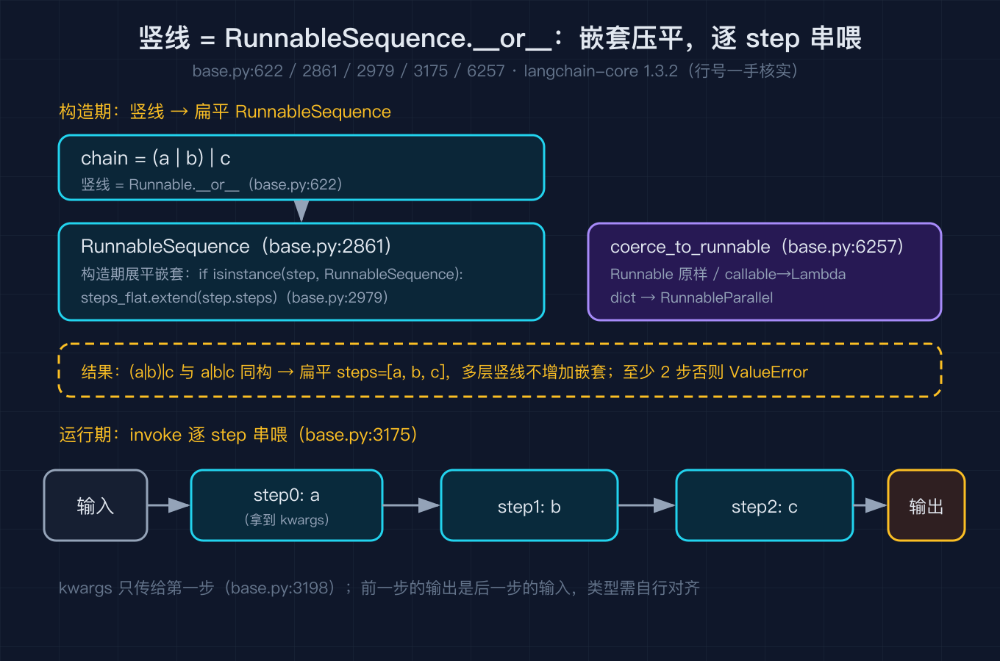
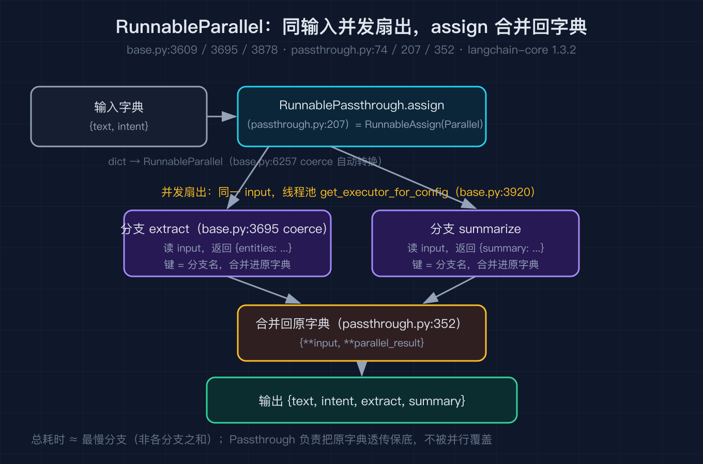
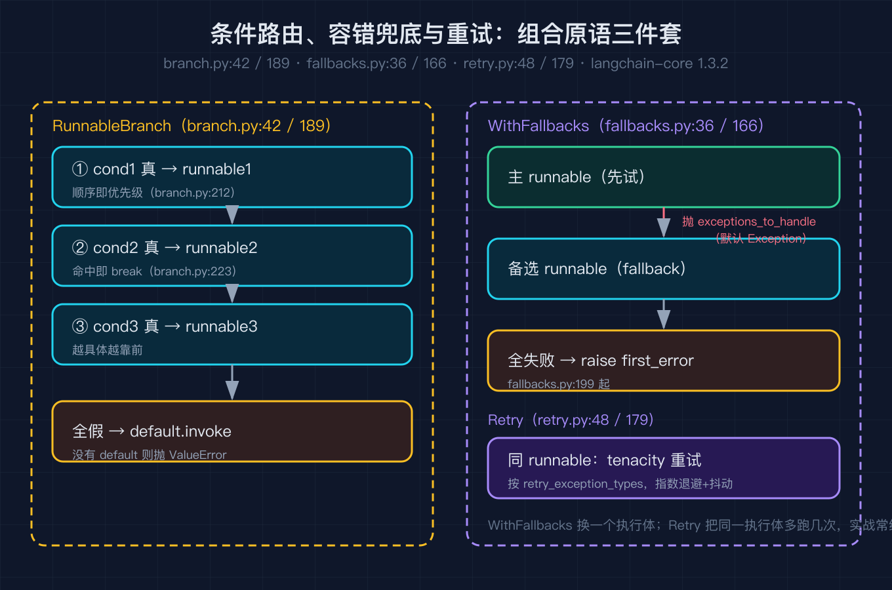

# LangChain 之二：组合原语深拆

我接过一个很普通的需求：把一段工单文本变成一个结构化的处理结果。先判断它是什么意图，比如退款还是催单；再并行做两件事，一件抽关键实体，一件生成一句话摘要；最后按意图把结果路由到不同的回复模板。如果某一步调用模型失败了，还要有兜底和重试。

如果手写，这串逻辑会散成十几个胶水函数和一堆 if else。LangChain 给出的答案不是再写一个框架，而是把上面这些动作抽象成几个组合原语，然后用一根竖线 `|` 把它们接起来。之一里我们看过整体架构，知道所有东西最终都是 `Runnable`。这一篇我逐个拆开这几个组合原语的源码形状，看它们到底在 `Runnable.__or__` 背后做了什么。

整篇我用一个贯穿案例：一个工单预处理流水线。它长这样。

```python
from langchain_core.runnables import RunnableLambda, RunnablePassthrough, RunnableBranch

router = RunnableBranch(
    (lambda x: x["intent"] == "refund", RunnableLambda(refund_reply)),
    (lambda x: x["intent"] == "urge", RunnableLambda(urge_reply)),
    default=RunnableLambda(general_reply),
)

chain = (
    RunnableLambda(classify)                               # 先分类意图
    | RunnablePassthrough.assign(extract=extract, summary=summarize)  # 并行抽取 + 摘要，回写
    | router                                               # 按意图路由
)
```

这段代码里出现了 `RunnableSequence`（竖线串起来的整条链）、`RunnableParallel`（assign 内部并行）、`RunnablePassthrough`（保底透传并回写字段）、`RunnableBranch`（条件路由）。下面我按它们被竖线粘合的顺序逐个拆。

## 一、竖线背后的真相：RunnableSequence

`|` 不是语法糖，它是 `Runnable.__or__` 这个方法（base.py:622）。它做了一件事：把自己和右边那个东西包成一个 `RunnableSequence`。

```python
# base.py:641
return RunnableSequence(self, coerce_to_runnable(other))
```

这里的 `coerce_to_runnable`（base.py:6257）是整篇的枢纽。它负责把任意东西变成 `Runnable`：已经是的就原样返回，是函数就包成 `RunnableLambda`，是字典就包成 `RunnableParallel`。这就是为什么你能在竖线里直接塞一个 `lambda` 或一个 `{...}`。

`RunnableSequence` 这个类定义在 base.py:2861。它最关键的设计在构造阶段（base.py:2975 起）：如果某个 step 本身又是一个 `RunnableSequence`，它会被展平，把对方的 steps 拆出来并到自己里面，而不是嵌套一层。

```python
# base.py:2979
if isinstance(step, RunnableSequence):
    steps_flat.extend(step.steps)
else:
    steps_flat.append(coerce_to_runnable(step))
```

所以 `(a | b) | c` 和 `a | b | c` 在内存里是同一个扁平的三步序列，不会因为多写了几次竖线就多出一层包装。构造结束还要求至少两步，否则直接 `ValueError`（base.py:2983）。

`RunnableSequence` 还重载了自己的 `__or__`（base.py:3121）。如果右边又是一个 `RunnableSequence`，它会把两边拆开再拼成一个新的扁平序列；否则就在尾部追加一步。这就是为什么无论你怎么用竖线拼接，最终都收敛成一条扁平链。

真正的执行在 `invoke`（base.py:3175）。它用一个 `for` 循环把上一步的输出喂给下一步，关键点有两个：第一，只有第一步会收到调用方传进来的那个 kwargs 字典，后续步骤不再传（base.py:3198）；第二，每一步都被标记成根运行的一个子运行，靠 `set_config_context` 把配置透传下去。

```python
# base.py:3192
for i, step in enumerate(self.steps):
    config = patch_config(config, callbacks=run_manager.get_child(f"seq:step:{i + 1}"))
    with set_config_context(config) as context:
        if i == 0:
            input_ = context.run(step.invoke, input_, config, **kwargs)
        else:
            input_ = context.run(step.invoke, input_, config)
```

也就是说，竖线链的语义是严格的串行管道：前一个的返回值就是后一个的输入，类型必须自己对齐。这一点我后面会用踩坑来提醒。



## 二、并行扇出：RunnableParallel

当一步需要同时做多件互不依赖的事，串行就浪费了。竖线链里嵌一个字典，就会被 `coerce_to_runnable` 变成 `RunnableParallel`（base.py:3609）。`RunnableParallel` 的构造（base.py:3695）把你给的字典每一个值都 `coerce_to_runnable` 一遍，键保留下来当作分支名。

它的 `invoke`（base.py:3878）用线程池把同一个输入广播给所有分支，各分支并发执行，最后按 key 把结果收拢成一个字典。

```python
# base.py:3920
with get_executor_for_config(config) as executor:
    futures = [executor.submit(_invoke_step, step, input, config, key)
               for key, step in steps.items()]
    output = {key: future.result() for key, future in zip(steps, futures, strict=False)}
```

因为所有分支拿的是同一份输入，且彼此独立，所以总耗时约等于最慢那一个分支，而不是各分支之和。这正是并行扇出的价值。

但并行只是把多个结果收集成字典，链子还要继续往下走。如果你希望把并行结果合并回原来的输入字典，而不是得到一个 `{分支名: 结果}` 的新字典，就要靠 `RunnablePassthrough.assign`。

## 三、保底透传与字段回写：RunnablePassthrough 和 assign

`RunnablePassthrough`（passthrough.py:74）做的事极简：它的 `invoke` 直接把输入原样返回（passthrough.py:226 里调用的是 `identity`）。它常出现在并行结构里，用来保证某一份数据不被改地流过。

更有用的是它的类方法 `assign`（passthrough.py:207）。`RunnablePassthrough.assign(extract=extract, summary=summarize)` 本质上等于 `RunnableAssign(RunnableParallel({"extract": ..., "summary": ...}))`（passthrough.py:223）。`RunnableAssign`（passthrough.py:352）先把并行结果算出来，再把这些结果合并回原始输入字典。

回到我的案例，第二步 `RunnablePassthrough.assign(extract=extract, summary=summarize)` 的效果是：输入字典带着 `text` 和刚算出的 `intent` 进来，并行算出 `extract` 和 `summary` 两个分支，最后输出的字典同时包含原来的字段加上这两个新字段。这样第三步 `router` 拿到的仍然是一份完整的工单数据，不会因为并行而丢掉前面的字段。



## 四、条件路由：RunnableBranch

流水走到某一步，经常要按输入的不同走不同分支。`RunnableBranch`（branch.py:42）就是干这个的。它接收一串 `(condition, runnable)` 二元组，外加一个 `default`。它的 `invoke`（branch.py:189）逻辑非常直白：从第一个分支开始顺序扫，用 `condition.invoke` 求值，谁第一个为真就执行谁并 `break`；如果全都假，就执行 `default`。

```python
# branch.py:212
for idx, branch in enumerate(self.branches):
    condition, runnable = branch
    expression_value = condition.invoke(input, config=patch_config(...))
    if expression_value:
        output = runnable.invoke(input, config=patch_config(...), **kwargs)
        break
else:
    output = self.default.invoke(input, config=patch_config(...), **kwargs)
```

这里有一个很容易被忽略的语义：分支的顺序就是优先级。第一个命中的分支会拦截后续所有分支，所以越具体的条件要写在越前面。我在踩坑一节会专门讲这个。

## 五、容错与重试：RunnableWithFallbacks 和 RunnableRetry

真实系统里模型调用会超时、会限流。LangChain 用两个原语处理这类失败。

`RunnableWithFallbacks`（fallbacks.py:36）的 `invoke`（fallbacks.py:166）按顺序尝试一串 runnable，捕获 `exceptions_to_handle`（默认是 `Exception`，见 fallbacks.py:92），一旦某个 runnable 抛出了被捕获的异常，就跳到下一个；如果全部失败，抛出第一个错误 `first_error`（fallbacks.py:199 起）。它适合「主模型挂了换备用模型」这种场景。

`RunnableRetry`（retry.py:48）则是另一个思路：同一个 runnable 失败就再试几次。它继承自 `RunnableBindingBase`，用 tenacity 把 `super().invoke` 包起来（retry.py:179）。重试参数由 `_kwargs_retrying`（retry.py:136）拼装：最多尝试次数映射成 `stop_after_attempt`，指数退避加抖动映射成 `wait_exponential_jitter`，要重试的异常类型映射成 `retry_if_exception_type`。

```python
# retry.py:179
for attempt in self._sync_retrying(reraise=True):
    with attempt:
        result = super().invoke(input_, self._patch_config(config, run_manager, attempt.retry_state), **kwargs)
```

顺带把底座说清：`RunnableRetry` 和 `with_fallbacks` 之所以能挂到任意 `Runnable` 上，是因为它们都继承自 `RunnableBindingBase`（base.py:5574）。这个基类把三样东西存成字段：被绑定的那个 runnable、要补的 kwargs、要补的 config。子类的 invoke 在调用被绑定对象时把这些补上去。`RunnableBinding`（base.py:6013）是最直接的实现，它更像给 runnable 套一层装饰器。你常用的 `model.bind(stop=["\n"])` 返回的其实就是一个新的 `RunnableBinding`，它的 `bound` 指向原模型，`kwargs` 里记着 `stop`。之后你再拿它去 invoke，它会在调用底层模型时自动把 `stop` 带进去，不用你每次手写。换言之，`bind` 不是改了模型，而是生成了一个带默认参数的新包装，原模型一尘不染。这也解释了为什么 `bind` 之后还能继续接竖线：binding 本身也是 `Runnable`。

两者的区别很清晰：`WithFallbacks` 是换一个执行体，`Retry` 是把同一个执行体多跑几次。实战里经常组合使用，比如先 `Retry` 抗瞬时抖动，再 `WithFallbacks` 换备用方案。



## 六个坑，都是真踩过的

第一，字典喂进竖线会被悄悄变成并行。很多人以为 `chain | {"a": f, "b": g}` 是在做某种合并，其实它直接变成了一个 `RunnableParallel`，两个分支会并发执行，而不是串行。如果你的 `f` 和 `g` 有依赖关系，这会变成一个隐蔽的 bug。要合并字段请用 `RunnablePassthrough.assign`。

第二，`RunnableBranch` 的 condition 顺序即优先级，不是「最匹配优先」。写在后面的条件哪怕更合适，也不会被考虑，因为第一个为真的分支就 `break` 了。把具体条件放在前面，通用条件放在后面，否则会出现「永远走不到后面分支」的路由错乱。

第三，`with_fallbacks` 的 `exceptions_to_handle` 默认是 `Exception`，这意味着任何异常（包括你代码里的逻辑 bug，比如 `KeyError`）都会被它吞掉并切到备用方案，导致真正的错误被掩盖。生产环境应该显式收窄成你确实想兜底的异常类型，比如 `(TimeoutError, ConnectionError)`。

第四，`RunnableRetry` 默认的重试类型要看 `retry_exception_types`，不是所有异常都会重试。如果你的模型抛出的是某种自定义异常或未被纳入的异常，重试根本不会触发。配置重试前先确认异常类型在名单里，否则你以为有重试，其实没有。

第五，`RunnableSequence` 只有第一步收到那个 kwargs。很多人习惯在链尾传 `config` 之外的额外参数，结果只有第一环拿到了，后面的环节一个都收不到。需要全程传递的上下文，应该老老实实放进输入字典里跟着数据流走。

第六，并行分支共享的是同一份输入引用。如果你的分支函数会原地修改输入字典（比如 `dict.pop`），多个分支并发跑时会发生竞态，结果时好时坏。并行分支里只做读取和返回新字典，不要原地改输入。

## 复现模块

这一篇的可运行复现脚本不依赖任何第三方库，也不需要 API key，纯标准库复刻了上面几个原语的核心行为，并用贯穿案例跑通端到端。

代码地址：本仓库 `2026-10-03-LangChain源码级原理拆解-之二/code/composite_primitives.py`，GitHub 仓库 `beverlyLee/ai-passage`（https://github.com/beverlyLee/ai-passage）。

数据源地址（一手源码，行号已逐一核对）：本地安装路径 `/Users/liboyang/Library/Python/3.13/lib/python/site-packages/langchain_core/runnables/`，对应 PyPI 发布包 `langchain-core==1.3.2`，上游仓库 `langchain-ai/langchain`。正文引用的每一处行号（base.py:2861 / 3175 / 3609 / 3878 / 6257、passthrough.py:74 / 207 / 226、branch.py:42 / 189、fallbacks.py:36 / 166、retry.py:48 / 136 / 179）均来自该版本。

运行命令：

```
cd 2026-10-03-LangChain源码级原理拆解-之二/code
python composite_primitives.py --self-test
```

精确预期输出（脚本实跑产生，逐行核对）：

```
self-test PASS
--- pipeline 端到端输出（与正文复现模块一致）---
extract = {'text': '我要退款订单号12345', 'intent': 'refund', 'entities': ['订单号12345']}
intent = refund
reply = 已为您发起退款，预计原路退回
summary = {'text': '我要退款订单号12345', 'intent': 'refund', 'summary': '我要退款订单号12345...'}
text = 我要退款订单号12345
```

输出里 `extract` 和 `summary` 两个 key 是并行分支名，`entities` 和 `summary` 是各自函数内部塞进字典的字段，正好印证了 assign 把并行结果合并回原输入字典这件事。

## 结尾钩子

这一篇我们把函数、字典、分支、兜底、重试全都塞进了同一根竖线，靠的是 `Runnable.__or__` 和 `coerce_to_runnable` 这套粘合层。可是有一个最核心的东西还没出现：模型本身。一个 ChatOpenAI 实例、一个 prompt 模板、一个输出解析器，它们形状千差万别，为什么也能无缝接进 `|` 里？`Runnable` 是靠什么把模型调用统一成 `invoke` 这一个形状的？这就是之三要拆的：模型与消息抽象。

如果你手边也在用 LangChain 拼链路，不妨把你那条最长的竖线打印成图（`chain.get_graph().draw_mermaid()`），对照这篇看每一步到底被粘成了哪个原语。你越是清楚竖线背后是 Sequence 还是 Parallel，越能在出问题时一秒钟定位到是哪一步的语义和你以为的不一样。
