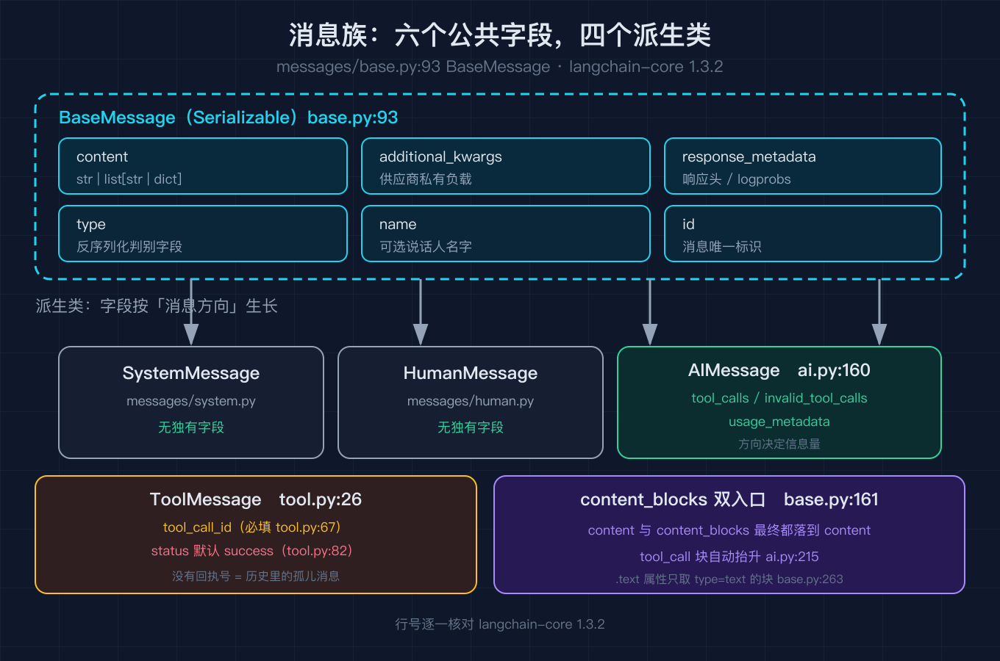
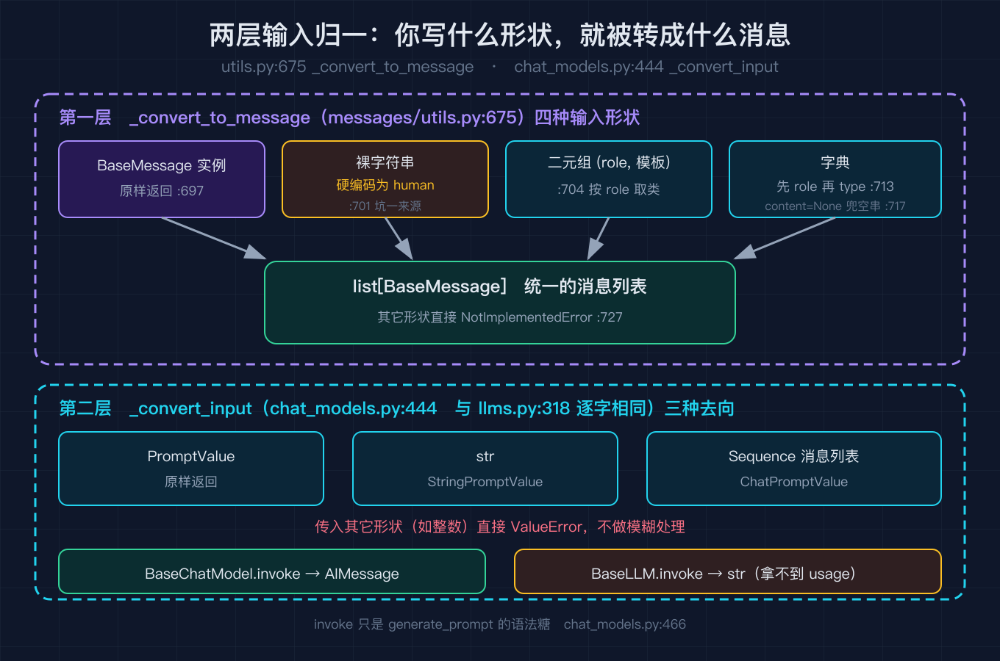
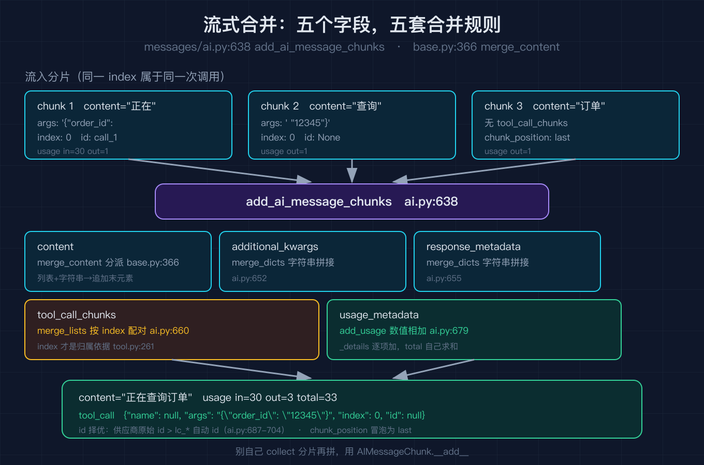

# LangChain 之三：模型与消息抽象

之二我们把 Runnable 这套组合原语拆完了，竖线怎么粘、并行怎么扇出、分支怎么路由，都对着 `langchain-core 1.3.2` 的源码逐行核对过。

但那些原语喂进去的到底长什么样，一直没细看。串起来的其实只有两种东西：一种是消息，一种是可以吃消息的模型。这篇就把这两层拆到底。

我拿一条退款工单当引子。工单系统里进来的是一段纯文本，用户说「我要退款订单号12345」。我想要的第一件事，是把它变成一个能被反复追加的对象，而不是一个每次拼接都要重新解析的字符串。这件事的分界线在哪，就是消息层要回答的问题。

## 一、消息族：六个公共字段撑起整个对话面

LangChain 的消息基类只有六个字段，全部定义在 `langchain_core/messages/base.py:93` 的 `BaseMessage` 里：

```python
class BaseMessage(Serializable):
    content: str | list[str | dict]          # base.py:103
    additional_kwargs: dict                    # base.py:106
    response_metadata: dict                    # base.py:114
    type: str                                  # base.py:117
    name: str | None = None                    # base.py:125
    id: str | None = Field(default=None, ...)  # base.py:135
```

我一开始觉得字段少到可疑。用户名字、消息 ID、供应商的原始负载，全塞在这六个里？后来发现这个设计是刻意的：`content` 只管正文，`additional_kwargs` 留给供应商塞私货（各家工具调用的原始编码都不一样），`response_metadata` 放响应头、logprobs、模型名这类诊断信息，而 `type` 是给反序列化用的判别字段。

这个六字段是一层薄壳，往下派生出的才是日常真正打交道的那些类。我工单流水线里用到四种：

| 类 | 定义位置 | 独有字段 |
| --- | --- | --- |
| `SystemMessage` | `messages/system.py` | 无 |
| `HumanMessage` | `messages/human.py` | 无 |
| `AIMessage` | `messages/ai.py:160` | `tool_calls`、`invalid_tool_calls`、`usage_metadata` |
| `ToolMessage` | `messages/tool.py:26` | `tool_call_id`（必填）、`status` |

注意一个不对称：`AIMessage` 挂了一堆额外字段，`HumanMessage` 和 `SystemMessage` 什么都没有。这不是设计偷懒，而是消息的方向决定了信息量。人类说话只有一个正文；模型说话除了正文，可能还会要求调工具（`tool_calls`）、参数解析失败（`invalid_tool_calls`）、花了多少 token（`usage_metadata`）。字段要长在信息多的一侧。

`ToolMessage` 那个必填的 `tool_call_id` 值得单独说。它是模型那边发起的调用的回执号。一次请求里模型可能要调三个工具，返回三条结果，全塞回对话历史里。如果没有这个 ID，你根本没法知道哪条结果对应哪次请求。所以 LangChain 把它设成必填（`tool.py:67`），没有就构造不出来。

`ToolMessage` 还有个 `status` 字段（`tool.py:82`），默认值是 `success`。这个设计比看起来重要：工具执行失败时，你必须显式把它改成 `error`。否则历史里躺着的会是一条声称成功的失败结果，模型读到了会当成真话继续往下推。

## 二、content_blocks：多模态为什么不能只靠 content



`content` 字段的类型是 `str | list[str | dict]`。字符串那一支是纯文本，列表那一支才是关键：每个元素是一个带 `type` 的字典，可以是文本块、图片块、工具调用块。

现在的写法更明确一点，构造消息时有两个入口（`base.py:161`）：

```python
def __init__(
    self,
    content: str | list[str | dict] | None = None,
    content_blocks: list[types.ContentBlock] | None = None,
    **kwargs: Any,
) -> None:
    if content_blocks is not None:
        super().__init__(content=content_blocks, **kwargs)
    else:
        super().__init__(content=content, **kwargs)
```

两个入口，最后都落到 `content` 这一个字段上。`content_blocks` 只是个更好用的写法，帮你把类型标注和 IDE 补全补上。

这个「双入口」的设计解决了一个很实际的痛点。我工单系统里用户会发截图，图片得跟文字一起传。如果只有 `content` 一个字符串字段，我就只能把图片 base64 拼进字符串里，模型侧还得自己从字符串里认图。拆成带 `type` 的块之后，图片就是独立的一块。

代价是取纯文本变麻烦了。所以 `BaseMessage` 提供了一个 `text` 属性（`base.py:263`），只把 `type == "text"` 的块拼起来。我在脚本里复刻了这个逻辑，喂一个文本块加一个图片块进去，`.text` 只吐出「看图」两个字，图片块被跳过。

这里还有一个容易漏掉的联动，在 `AIMessage` 的构造里（`ai.py:215`）：

```python
if content_blocks is not None:
    content_tool_calls = [
        block for block in content_blocks if block.get("type") == "tool_call"
    ]
    if content_tool_calls and "tool_calls" not in kwargs:
        kwargs["tool_calls"] = content_tool_calls
```

如果你用 `content_blocks` 的写法传了 `tool_call` 块，LangChain 会自动把它抬升成独立的 `tool_calls` 字段。你不用手写两遍。这是 1.0 之后新加的兼容层，历史代码里那些直接写 `tool_calls=` 的调用还能继续跑。

## 三、输入归一：为什么你写的字符串会被变成消息

我在工单流水线里经常临时塞一句话进对话。最开始我这么写：

```python
model.invoke("总结一下这个工单")
```



能跑。但我很快发现一个坑：这个字符串会被当成 human 消息。也就是说我问模型「总结一下」，模型看到的是「有人问：总结一下」，它不知道这是系统指令。

这不是我猜的，是源码里写死的。归一入口是 `messages/utils.py:675` 的 `_convert_to_message`，它接受四种形状：

```python
if isinstance(message, BaseMessage):
    message_ = message                                   # utils.py:697-698
elif isinstance(message, Sequence):
    if isinstance(message, str):
        message_ = _create_message_from_message_type("human", message)  # utils.py:701
    else:
        message_type_str, template = message             # utils.py:704
        message_ = _create_message_from_message_type(message_type_str, template)
elif isinstance(message, dict):
    msg_type = msg_kwargs.pop("role")                    # utils.py:713
    ...                                                  # 取不到再试 type
    msg_content = msg_kwargs.pop("content") or ""        # utils.py:717
```

四条分支，对应四种你可能写出来的输入。我脚本里 `[1]` 那段就把这四种都跑了一遍，输出是四种输入各自归一成的类。

有三个细节值得记：

第一，裸字符串硬编码成 `human`（`utils.py:701`）。想传系统消息必须显式用二元组或字典。

第二，字典分支先试 `role` 再试 `type`（`utils.py:713` 到 `utils.py:715`）。这两个键在不同来源的数据里都常见，`role` 是 OpenAI 风格，`type` 是 LangChain 自己的习惯。两个都支持，是为了能直接吃现成的 OpenAI 格式历史。

第三，`content` 取不到或者为 `None` 时兜成空串（`utils.py:717`），不抛错。这个容错是为了应对模型有时返回 `content: null`（纯工具调用时正文就是空的）这种情况。

最后一支 `else` 抛 `NotImplementedError`（`utils.py:727`）。我在 self-test 里专门试了传一个整数进去，确认它真的会炸，而不是悄悄吞掉。

## 四、模型层：BaseChatModel 和 BaseLLM 的差别只有一处

消息归一完，交给模型。模型层的入口是 `_convert_input`，我原本以为这是消息层的事，其实不是，它在 `language_models` 包里。

这个方法在两个地方各写了一遍，`chat_models.py:444` 和 `llms.py:318`，两段代码逐字相同：

```python
def _convert_input(self, model_input: LanguageModelInput) -> PromptValue:
    if isinstance(model_input, PromptValue):
        return model_input                    # PromptValue 原样返回
    if isinstance(model_input, str):
        return StringPromptValue(text=model_input)      # 字符串包一层
    if isinstance(model_input, Sequence):
        return ChatPromptValue(messages=convert_to_messages(model_input))  # 列表包一层
    raise ValueError(...)                     # 其它形状直接拒
```

三种输入，三种去向。纯字符串进 `StringPromptValue`，消息列表进 `ChatPromptValue`，已经是 `PromptValue` 的原样返回。非法形状（比如传个整数）直接 `ValueError`，不给你模糊处理的机会。

我脚本 `[2]` 那段验证了这个分流：传字符串得到 `StringPromptValue` 且展开成 1 条消息，传列表得到 `ChatPromptValue` 且展开成 2 条。

那既然两处代码一样，`BaseChatModel` 和 `BaseLLM` 到底差在哪？答案只有一个字，返回值。`chat_models.py:458` 的 `invoke` 返回 `AIMessage`，`llms.py:371` 的 `invoke` 返回 `str`。`BaseChatModel` 继承的是 `BaseLanguageModel[AIMessage]`，`BaseLLM` 继承的是 `BaseLanguageModel[str]`（`chat_models.py:267` 与 `llms.py:293`）。

这个差别带来的连带影响比看上去大。`AIMessage` 有 `tool_calls` 和 `usage_metadata`，`str` 什么都没有。所以你用 `BaseLLM` 的时候，想拿 token 用量，想让模型调工具，都做不到。这两个类不是新旧替代关系，是能力不同的两条路。老的 completion 接口返回纯文本，新的 chat 接口返回结构化消息。1.x 里 `BaseLLM` 依然在，但功能是 `BaseChatModel` 的子集。

`invoke` 内部还有一层我一开始没注意的转换（`chat_models.py:466` 到 `chat_models.py:482`）：它先把输入包成 `PromptValue` 传给 `generate_prompt`，拿到 `LLMResult`，再从 `generations[0][0].message` 里把消息抠出来。所以 `invoke` 只是 `generate_prompt` 的语法糖，后者才是批量调用的入口。想一次喂一批消息、拿多份结果，用 `generate_prompt`。

## 五、流式合并：分片怎么拼回一条完整消息

讲到这里，工单流水线能跑了。但我后来加了个流式输出，踩到了一堆坑，这一节就是那些坑的根源。



流式的做法是：模型吐出 `AIMessageChunk` 分片，你逐个收到，LangChain 帮你合并。但合并这件事的复杂度远超「字符串相加」。核心在 `messages/ai.py:638` 的 `add_ai_message_chunks`，它把五个字段分开处理：
```python
content = merge_content(left.content, *(o.content for o in others))        # ai.py:651
additional_kwargs = merge_dicts(left.additional_kwargs, ...)                # ai.py:652
response_metadata = merge_dicts(left.response_metadata, ...)                # ai.py:655
if raw_tool_calls := merge_lists(left.tool_call_chunks, ...):               # ai.py:660
    ...
if left.usage_metadata or any(o.usage_metadata is not None for o in others):
    usage_metadata = left.usage_metadata
    for other in others:
        usage_metadata = add_usage(usage_metadata, other.usage_metadata)    # ai.py:679
```

正文走 `merge_content`（`base.py:366`），它是一组分类型分派：

```python
if isinstance(merged, str):
    if isinstance(content, str):
        merged += content                      # 字符串 + 字符串 = 直接拼
    else:
        merged = [merged, *content]             # 字符串 + 列表 = 把字符串塞成列表首元素
elif isinstance(content, list):
    merged = merge_lists(cast("list", merged), content)   # 列表 + 列表 = 按 index 合
elif merged and isinstance(merged[-1], str):
    merged[-1] += content                       # 列表 + 字符串 = 追加到末元素
```

四个分支的顺序不能乱。最后那支尤其关键：列表后面来一个字符串，要追加到列表的最后一个字符串元素上，而不是新 push 一个元素。不然「你好」加「世界」会得到 `["你好", "世界"]` 两个碎片，而不是 `["你好世界"]`。这个设计的目的是让流式输出结束后，正文尽可能接近非流式的形状。我在 self-test 里专门测了这条。

usage_metadata 走 `add_usage`（`ai.py:721`），是数值相加，不是字符串拼接：

```python
out[key] = out.get(key, 0) + value
```

而且带 `_details` 后缀的嵌套字典要逐项加。`UsageMetadata` 的结构（`ai.py:104`）是这样的：

```python
{
    "input_tokens": 350,
    "output_tokens": 240,
    "total_tokens": 590,
    "input_token_details": {"audio": 10, "cache_creation": 200, "cache_read": 100},
    "output_token_details": {"audio": 10, "reasoning": 200},
}
```

注意 `total_tokens` 是自己加出来的，不是你给的。三个分片各带自己的 usage，合并后 `input_tokens` 求和、`output_tokens` 求和、`total_tokens` 也求和。我在 self-test 里验证过：左右各 10 和 5 的 `input_tokens` 合并后是 15，`total_tokens` 从 11 和 7 变成 18。

tool_call_chunks 是最麻烦的一个。工具调用参数是 JSON，模型流式吐出来是碎片：

```python
{"name": "query_order", "args": '{"order_id":', "index": 0, "id": "call_1"}
{"name": None,         "args": ' "12345"}',   "index": 0, "id": None}
```

两片要拼成 `args: '{"order_id": "12345"}'`，这是个合法 JSON。凭什么知道这两片属于同一次调用？靠 `index` 字段。`ToolCallChunk` 的文档字符串（`tool.py:261`）里明确写了这个规则：只有 `index` 相等且不为 `None` 才合并。

我把这段复刻在脚本里，`[5]` 那个演示喂了三个分片进去。注意第一个分片带完整 name 和 id，第二个分片这两个字段都是 `None`，合并后 name 和 args 都正确补齐了，但 id 变成了 `null`（因为分片流里 id 只在第一片给，后面不给）。这个行为和 `ai.py:687` 到 `ai.py:704` 那段 id 择优逻辑有关：LangChain 会在所有分片的 id 里挑一个最好的，优先级是供应商原始 id 高于 `lc_*` 自动生成的 id，全都没有才留 `None`。

## 六、六个我真踩过的坑

#### 坑一：裸字符串被当成 human 消息

前面说过，我用 `model.invoke("总结一下")` 意图是下指令，实际发出去的是用户提问。修法是显式写形状：`model.invoke(("system", "总结一下"))`。这个坑隐蔽在于它不报错，模型还真的会去「总结」你那句话。

#### 坑二：ToolMessage 忘了填 tool_call_id，构造直接 KeyError `tool.py:67` 把它设成必填。我一开始想构造一条假的工具结果做测试，写了 `ToolMessage("查询成功")`，直接炸。这个设计是故意的：没有回执号的消息在历史里是孤儿，模型读到会困惑。测试也得守规矩。

#### 坑三：工具失败忘了改 status，模型把失败当成功 `status` 默认 `success`（`tool.py:82`）。我有一个工具遇到下游超时抛了异常，我 catch 住之后构造 ToolMessage，忘了传 `status="error"`。结果是模型读到一条声称成功的失败结果，接着告诉用户「订单已查询成功」。修法很简单，工具包一层统一 try，失败时强制 `status="error"`。

#### 坑四：流式拼完 tool_call 拿到不合法 JSON，直接给模型会炸 上一节那个坑的延伸。如果分片合并的逻辑没走对（比如你手动把分片 collect 起来自己拼，而不是用 `+`），`args` 可能是 `{"order_id":` 就断了。修法是别自己拼，用 `AIMessageChunk.__add__`。

#### 坑五：把 trim_messages 的返回当成「最新的几条在最后面」

这个我错得很彻底。`trim_messages`（`utils.py:1082`）的 `strategy="last"` 语义是「保留最近的、丢掉最老的」，返回的是时序（最老在前、最新在后）。我一开始自己实现的时候，在循环里已经保证 `result` 是时序了，末尾又写了个 `reversed` 想「翻回来」，结果把顺序搞反了。self-test 里那条 `裁剪结果保持时序` 断言直接抓到了它。

顺便说 `trim_messages` 的 `token_counter` 有个偷懒默认值（`utils.py:2186`）：

```python
def count_tokens_approximately(
    messages, *, chars_per_token: float = 4.0, extra_tokens_per_message: float = 3.0, ...
)
```

每 4 个字符算 1 个 token，每条消息额外算 3 个。这是近似值，不是模型真实的分词结果。中文的话误差更大，因为一个汉字在真实分词里通常不止 1 个 token。默认这么设是因为它不花钱、不调模型，够用来做粗筛。要精确就把你的模型对象当 `token_counter` 传进去，让它真的去数。

#### 坑六：用 BaseLLM 拿不到 usage_metadata

前面第四节讲过返回值的差别。`str` 里没有结构化字段。我有个脚本统计每轮对话的 token 消耗，用 `BaseLLM` 时只能拿到一坨文本，想统计就得自己分词。后来换 `BaseChatModel` 直接读 `usage_metadata` 才干净。结论：新写的东西一律用 `BaseChatModel`，除非你明确知道自己在用老的 completion 接口。

## 七、复现模块

脚本地址（纯标准库，不依赖 langchain-core，不需要 API key）：

```
https://github.com/beverlyLee/ai-passage/tree/main/2026-10-04-LangChain%E6%BA%90%E7%A0%81%E7%BA%A7%E5%8E%9F%E7%90%86%E6%8B%86%E8%A7%A3-%E4%B9%8B%E4%B8%89/code
```

数据源（一手，对应本篇所有行号）：

```
langchain-ai/langchain 仓库的 langchain-core 包，PyPI 版本 1.3.2
messages/base.py  messages/ai.py  messages/tool.py  messages/utils.py
language_models/chat_models.py  language_models/llms.py
本地安装路径：/Users/liboyang/Library/Python/3.13/lib/python/site-packages/langchain_core
```

运行命令：

```bash
python messages_and_models.py --self-test
```

精确预期输出（关键段落，完整 39 行可复现）：

```
[5] 流式分片逐字合并（add_ai_message_chunks）
    分片数        3
    合并后正文    '正在查询订单'
    合并后 usage  {"input_tokens": 30, "output_tokens": 3, "total_tokens": 33}
    tool_call     [{"name": null, "args": "{\"order_id\": \"12345\"}", "index": 0, "id": null}]
    chunk_position last

[6] 近似 token 计数与裁剪（trim_messages）
    历史条数      6
    近似 token    27
    裁剪后条数    4
    裁剪后类型    ['ai', 'human', 'ai', 'human']

self-test PASS
```

这六段精确输出对应的是本篇四个机制的实测结果：五种输入形状归一、模型层 str 与列表的分流、`content_blocks` 里 `tool_call` 自动抬升、`ToolMessage` 必填回执号、分片按 `index` 拼回合法 JSON、`trim_messages` 保持时序。self-test 里有 30 条断言逐条覆盖这些行为，包括几个该抛异常的场景（整数输入、非消息形状、缺 `tool_call_id`）。

## 结尾钩子

消息层和模型层拆完，我的工单流水线现在能完整跑通了。但新问题立刻出现：用户问「我上个月买的那个」，指代的是三个月前一条已经被 `trim_messages` 丢掉的 `HumanMessage`。我用六个字段的消息存历史，存得住对话，存不住「这个」指的是哪一条。

顺带还有一个我没解决的：文档切分和检索全在 `langchain_core` 的另一个包里，跟消息层完全不搭界，但它俩怎么接起来我一直只有模糊印象。

下一篇（之四：检索与文档）我会把这两件事一起讲：文档怎么切、切完怎么变成消息流进模型、以及检索结果到底应该插在历史的哪个位置。如果你已经踩过其中的坑，评论区贴一下你遇到的现象，我下一篇挑典型的展开。
