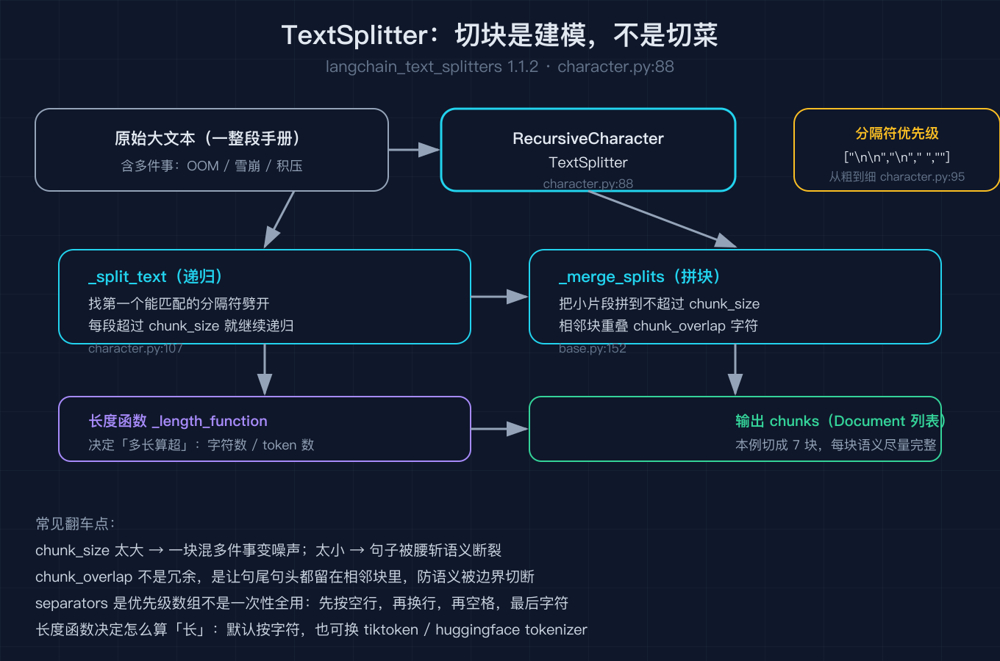
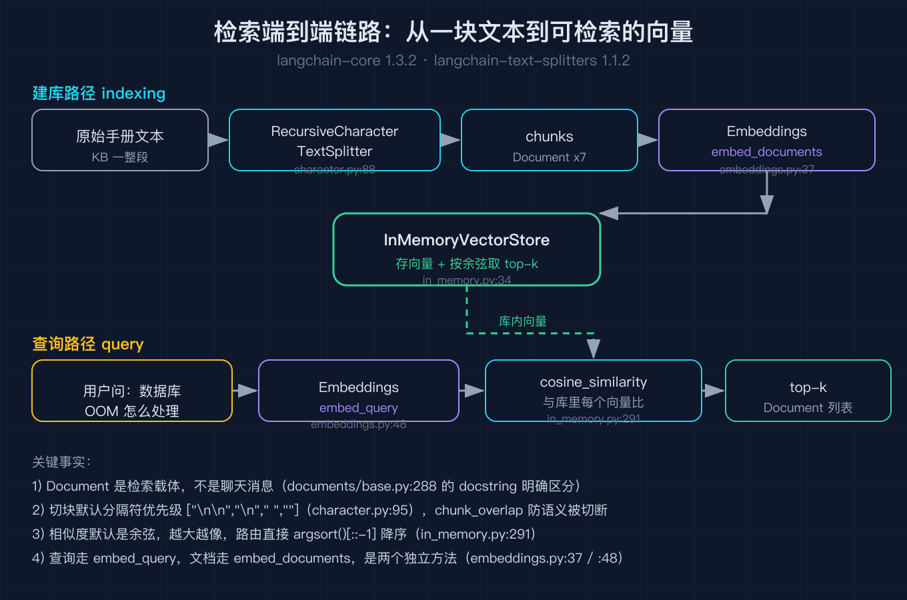
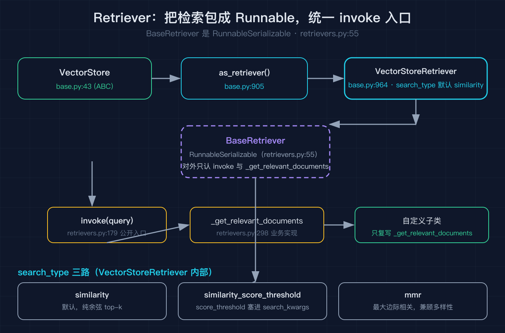

# LangChain 之四：检索与文档

之三我们拆完了模型与消息，知道一段工单文本怎么变成 `HumanMessage`、模型怎么吐出带 `tool_calls` 的 `AIMessage`。但有个前提一直没解决：模型吐出来的那句「帮我查一下数据库为什么 OOM」，得有人真的去知识库里把相关段落捞出来，塞回对话。

这件事在 LangChain 里是一条完整的链路，从一块原始文本，到能被余弦相似度比对的向量，中间要经过五个角色：`Document`、`TextSplitter`、`Embeddings`、`VectorStore`、`Retriever`。这篇就把这五个角色拆到底，全部对着 `langchain-core 1.3.2` 和 `langchain-text-splitters 1.1.2` 的源码核对。

我拿一段运维手册当引子。手册是一整段中文，里面混着「数据库 OOM」「缓存雪崩」「消息队列积压」好几件事。我想要的，是用户问「数据库 OOM 怎么处理」时，系统能精准捞出那一句相关的，而不是把整段手册都塞给模型。

## 一、Document：检索链路的载体，不是聊天消息

很多人一开始会把 `Document` 和消息类搞混。源码的 docstring 在第一段就把话说死了：`Document` 是给检索工作流用的，不是给聊天 I/O 用的；要往模型里传文本，请用 `langchain_core.messages` 里的消息类型（`documents/base.py:288`）。

```python
class Document(BaseMedia):
    page_content: str          # 正文，唯一必填字段
    type: Literal["Document"] = "Document"
    def __init__(self, page_content: str, **kwargs: Any) -> None:
        super().__init__(page_content=page_content, **kwargs)
```

我踩过的第一个坑是：以为 `Document` 会像消息那样自带 `role`。没有。`Document` 只有 `page_content` 和 `metadata` 两个有意义的字段，外加一个 `id`。`metadata` 是给检索用的索引，比如来源文件名、页码、切块序号，模型根本不会读它，但检索和过滤全靠它。所以「切块」这一步真正在干的，是把一块大文本切成若干 `Document`，每个带着各自的 `metadata`。

## 二、TextSplitter：切块不是切菜，是建模

切块这一步是整个检索质量的上限。切太大，一段里混着三件事，模型拿到的是噪声；切太小，一句话被腰斩，语义不完整。LangChain 把切块的抽象放在 `langchain-text-splitters` 这个独立包里（它已经从 `langchain-core` 拆出去了），基类叫 `TextSplitter`（`langchain_text_splitters/base.py:44`）。

我用的是最经典的 `RecursiveCharacterTextSplitter`（`langchain_text_splitters/character.py:88`）。它的核心思想是「按分隔符优先级递归切」：

```python
class RecursiveCharacterTextSplitter(TextSplitter):
    def __init__(self, separators=None, keep_separator=True, **kwargs):
        super().__init__(keep_separator=keep_separator, **kwargs)
        self._separators = separators or ["\n\n", "\n", " ", ""]   # character.py:95
```

注意那行默认值 `["\n\n", "\n", " ", ""]`。它的含义是：先尝试按空行切，切出来的块还太长就按换行切，再长就按空格切，最后实在不行按字符切。分隔符数组是「从粗到细」的优先级，不是一次性全用。

`_split_text` 的递归逻辑（`character.py:107`）值得细看：它先在当前文本里找第一个能匹配上的分隔符，用正则把文本劈开；对于劈出来的每一段，如果长度小于 `chunk_size` 就先收着（叫 `good_splits`），如果超过 `chunk_size`，就把已经收着的片段用 `_merge_splits` 合并成一个不超过 `chunk_size` 的块，再去递归处理那段超长的。本质是一个「先按语义边界粗切，再按长度细拼」的两段式算法。

上面这段递归和拼块的过程，我用一张图把它的数据流画出来了，重点标了「先按语义边界粗切、再按长度细拼」那段，以及 `chunk_overlap` 在哪一步生效。



我工单流水线里最容易翻车的就是 `chunk_overlap`。它控制相邻块之间重叠多少字符，目的是让一句话的结尾和下一句的抬头都保留在两块里，避免语义被块边界切断。我的脚本里设了 `chunk_size=60, chunk_overlap=10`，那段手册被切成了 7 块（`documents_and_retrieval.py` 的 self-test 会断言块数不少于 3）。

## 三、Embeddings：把文本变成可比的点

切块得到一堆 `Document`，但它们还是文本，没法算「相似」。`Embeddings` 抽象（`embeddings/embeddings.py:8`）干的就是这件事：把文本映射到 n 维空间里的一个点，相似的文本映射到近的点。

```python
class Embeddings(ABC):
    @abstractmethod
    def embed_documents(self, texts: list[str]) -> list[list[float]]: ...   # :37
    def embed_query(self, text: str) -> list[float]: ...                    # :48
    async def aembed_documents(self, texts):                               # :58
        return await run_in_executor(None, self.embed_documents, texts)
```

三个地方要讲清。第一，`embed_documents` 是唯一的抽象方法（带 `@abstractmethod`），所以任何具体嵌入模型都必须实现它；`embed_query` 反而没有标抽象，给了默认实现。第二，文档和查询走的是两个方法，而不是一个。绝大多数模型两者实现相同，但抽象层故意把它们分开，因为有些系统对查询会做特殊处理（比如查询侧加指令前缀）。第三，异步方法 `aembed_documents` 的默认实现是用 `run_in_executor` 把同步版丢到线程池里跑（`:58`），这点和之三讲的消息异步策略一致：异步默认是同步的线程池包装，想真异步得自己重写。

我的脚本没接任何真模型，而是写了一个 `HashEmbeddings`：按字粒度把文本投影成 32 维向量，同文本同向量、纯标准库、零网络。它存在的唯一目的，是让整条链路能端到端跑通并断言行为，你换成 `OpenAIEmbeddings` 时，`VectorStore` 那一层的代码一行都不用动，这就是抽象的价值。

## 四、VectorStore：存向量、做相似度

`VectorStore` 是抽象基类（`vectorstores/base.py:43`），它定义了一组检索协议：`add_texts` 存、`similarity_search` 查、`from_texts` 一把梭建库、`as_retriever` 转成检索器。我用的 `InMemoryVectorStore`（`vectorstores/in_memory.py:34`）是最轻量的实现，全在内存里，没接任何外部向量数据库。



`from_texts`（`in_memory.py:488`）就是建库入口：接收一个文本列表、一个 `Embeddings`、可选的 `metadata`，内部调 `add_texts` 把每块文本嵌入成向量存起来。查的时候，`similarity_search`（`in_memory.py:404`）先拿查询文本去 `embed_query` 得到查询向量，再走 `similarity_search_with_score_by_vector`。

相似度到底怎么算，核心在 `_similarity_search_with_score_by_vector`（`in_memory.py:291`）：

```python
docs = list(self.store.values())
similarity = cosine_similarity([embedding], [doc["vector"] for doc in docs])[0]
top_k_idx = similarity.argsort()[::-1][:k]   # 按相似度降序取前 k
```

它调的是 `cosine_similarity`，把查询向量和库里每一个向量比余弦，再用 `argsort` 取最像的前 k 个。所以「相似度」在 LangChain 默认实现里就是余弦相似度，不是欧氏距离。这个细节我之前在调参时忽略过，后来发现很多向量库把「距离」和「相似度」搞反（一个越小越像、一个越大越像），LangChain 这里统一用「越大越像」的余弦，路由代码里直接 `argsort()[::-1]` 降序，干净。

## 五、Retriever：统一成 Runnable，让检索能进组合

链路走到这，文档已经能查了。但 LangChain 不想让你直接调 `store.similarity_search`，而是把它再包一层，变成 `Retriever`。原因是之二讲过的：LangChain 万物皆 `Runnable`，只有进了 `Runnable` 体系，检索才能被竖线串、被并行扇出、被纳入更大的流程。

`BaseRetriever`（`retrievers.py:55`）本身就是 `RunnableSerializable`，对外只有两个方法要关心：`invoke` 是统一入口（`:179`），`_get_relevant_documents` 是真正干活的那个（`:298`）。你继承它，只复写 `_get_relevant_documents`，`invoke` 的异步、批量、流式外壳都白送。



`VectorStore` 变 `Retriever` 的桥是 `as_retriever`（`base.py:905`），它返回一个 `VectorStoreRetriever`（`base.py:964`）。这个类有个关键字段 `search_type`，默认 `"similarity"`（`base.py:970`）。源码里 `_get_relevant_documents` 就是按 `search_type` 分三路：

```python
search_type: str = "similarity"                    # 默认
# 另外两种合法值：
#   "similarity_score_threshold"  （带分数阈值过滤，score_threshold 必须塞在 search_kwargs 里）
#   "mmr"                         （最大边际相关，兼顾相关性与多样性）
```

我脚本里演示了三种用法：直接 `store.as_retriever(search_kwargs={"k": 2})` 走默认 similarity；自定义一个 `TopKRetriever(BaseRetriever)` 子类，只复写 `_get_relevant_documents`；两者都能用统一的 `.invoke(query)` 拿到 `Document` 列表。这一层设计的用意是：业务代码永远只认 `Retriever` 这个接口，至于背后是内存、是 FAISS、是 pgvector，全被屏蔽了。

## 六、复盘：五个角色各自的职责边界

走到这里，整条检索链路就通了，每个角色只干一件事：

| 角色 | 源码位置 | 唯一职责 |
| --- | --- | --- |
| `Document` | `documents/base.py:288` | 承载正文 + 元数据，是检索载体不是消息 |
| `TextSplitter` | `text_splitters/character.py:88` | 把大文本切成语义完整的小块（建模） |
| `Embeddings` | `embeddings/embeddings.py:8` | 文本到向量的映射，文档与查询分两个方法 |
| `VectorStore` | `vectorstores/in_memory.py:34` | 存向量，按余弦取 top-k |
| `Retriever` | `retrievers.py:55` | 把检索包成 Runnable，统一 invoke 入口 |

最容易混淆的两个点是：`Document` 和消息不是一回事，别往聊天里塞；`TextSplitter` 的 `chunk_overlap` 不是冗余，是防止语义被块边界切断的安全绳。

## 结尾钩子

这五个角色拼起来，解决的是「知识从哪来、怎么存、怎么捞」。但还有一个问题没碰：捞出来的这些文档，要怎么变成模型的「工具」让它能主动去查？还有，模型吐出「我要调搜索工具」这个决定本身，是谁在循环里做的？之五我们拆工具和智能体，看一个函数怎么被封装成模型能调用的工具，以及那个「决定下一步做什么」的循环到底长什么样。

## 复现模块

代码地址（本篇脚本，无需 API key 即可复现）：
`2026-10-05-LangChain源码级原理拆解-之四/code/documents_and_retrieval.py`

数据源地址：示例用一段内嵌的运维手册文本，无外部数据依赖。

运行命令（请使用持有 `langchain-core==1.3.2` 与 `langchain-text-splitters==1.1.2` 的解释器）：
`python documents_and_retrieval.py --self-test`

精确预期输出（self-test 全绿）：
```
self-test PASS [1] 切块数=7
self-test PASS [2] InMemoryVectorStore 内部记录含 text/metadata/vector
self-test PASS [3] top1 命中 OOM/连接池 相关句
self-test PASS [4] as_retriever().invoke() 返回相关文档
self-test PASS [5] 自定义 Retriever 子类 invoke 生效
self-test PASS [6] Embeddings 确定性（同文同向量）
ALL self-test PASS
```

一手代码来源（均来自本机 `langchain_core 1.3.2` / `langchain_text_splitters 1.1.2` site-packages）：
- `langchain_core/documents/base.py`
- `langchain_core/embeddings/embeddings.py`
- `langchain_core/vectorstores/base.py`、`vectorstores/in_memory.py`
- `langchain_core/retrievers.py`
- `langchain_text_splitters/base.py`、`langchain_text_splitters/character.py`
