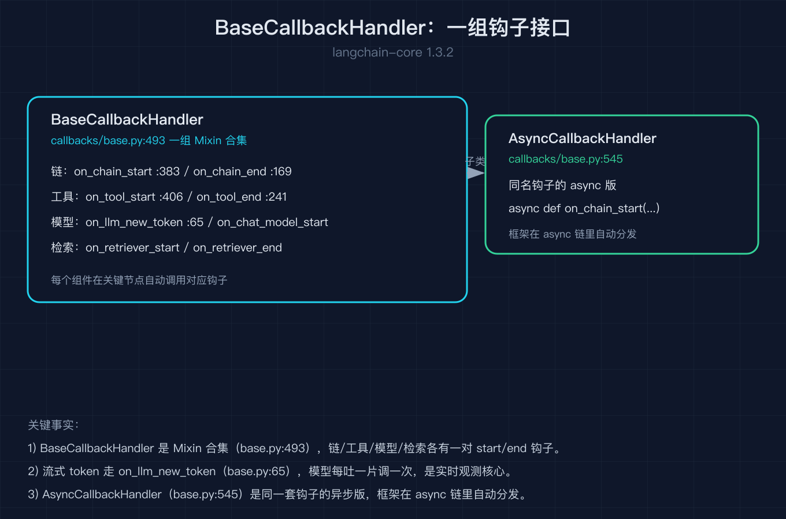
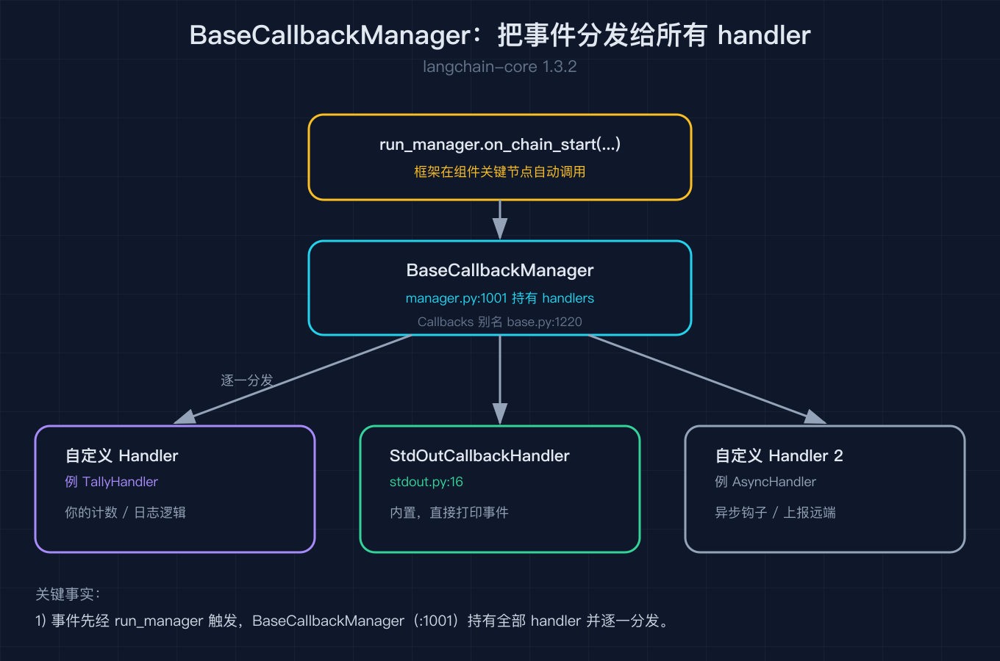
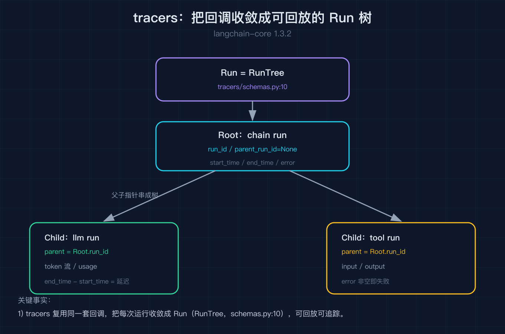

# LangChain 之七：回调与可观测

之六我们把历史存好、自动读写、塞进提示词，可这一切都发生在 `invoke` 内部。模型到底调了哪个工具、工具跑了多久、流式输出吐了哪些字、哪一步抛了异常，全藏在调用栈里看不见。这就引出可观测的问题：框架能不能在链、模型、工具的关键节点主动喊你一声？

这篇就拆回调与可观测，全部对着 `langchain-core 1.3.2` 的源码核对。核心是一句话：LangChain 把可观测做成一组钩子接口，框架在运行的关键节点自动调用它们，你写的 handler 想听哪个就实现哪个；一个管理器负责把事件广播给所有 handler；tracers 则把同样的事件收敛成一棵可回放的 Run 树。

我拿一个最简单的场景当引子。我跑一条链，想实时知道它什么时候开始、什么时候结束；我跑一个流式聊天模型，想把吐出来的每一个字都接住打印。这两件「旁观」的事，不用改链的代码，只要挂上回调就能做到。

## 一、BaseCallbackHandler：一组钩子接口

回调的入口是 `BaseCallbackHandler`（`callbacks/base.py:493`）。它不是一个要你全量实现的抽象类，而是一组钩子方法的合集，每个钩子对应框架运行中的一个节点：链开始 `on_chain_start`（`callbacks/base.py:383`）、链结束 `on_chain_end`（`:169`）、工具开始 `on_tool_start`（`:406`）、工具结束 `on_tool_end`（`:241`）、流式吐字 `on_llm_new_token`（`:65`）。你只挑关心的去重写，其余留空即可。

```python
class TallyHandler(BaseCallbackHandler):        # callbacks/base.py:493
    def on_chain_start(self, serialized, inputs, **kwargs): ...
    def on_chain_end(self, outputs, **kwargs): ...
    def on_tool_start(self, serialized, input_str, **kwargs): ...
    def on_tool_end(self, output, **kwargs): ...
    def on_llm_new_token(self, token, **kwargs): ...
```

挂法也轻：把 handler 放进 `config={"callbacks": [handler]}` 随调用传下去，框架在节点上自动调用对应的钩子，你什么都不用改。我在脚本里用一个计数 handler 把这些事件按发生顺序记进列表，断言里就能校验「链开始一定发生在链结束之前」，以及工具调用确实先后触发了 `on_tool_start` 与 `on_tool_end` 且拿到的输入就是我传进去那串。

我踩过的第一个坑出在流式钩子上。当我用假聊天模型逐字符吐出 `abc`，发现 handler 最后还会收到一个空字符串的 `on_llm_new_token`。这不是 bug：框架在流末会故意补发一个空内容的 token（`chunk_position="last"`），用来给接收方打上「这是最后一片」的标记（`language_models/chat_models.py:810` 同步、`chat_models.py:2049` 异步）。所以比对有效 token 前必须先过滤掉它，否则你会多出一个空字。



第二个坑是异步这支。除了同步的 `BaseCallbackHandler`，还有 `AsyncCallbackHandler`（`callbacks/base.py:545`），它的钩子全是 `async def`。如果你的链走 `ainvoke`，就必须挂异步 handler，挂同步的它不会报错但事件一个都不触发，排查起来很迷惑。两者是同一套接口的两个分支，异步的只是把钩子定义成协程。

## 二、BaseCallbackManager：把事件分发给所有 handler

钩子接口有了，那框架是怎么把「链开始了」这个事件同时送到你挂的若干个 handler 的？中间人是 `BaseCallbackManager`（`callbacks/base.py:1001`）。它不是站在你和我之间多出来的一层累赘，而是回调能「一对多」的关键：你往 `config` 里塞一个 handler 列表，管理器遍历它们挨个调用同一个钩子。

`Callbacks` 这个类型别名（`callbacks/base.py:1220`）写的就是它的合法形态：`list[BaseCallbackHandler] | BaseCallbackManager | None`。也就是说，你给 `config` 的可以是一个 handler 列表，也可以是一个现成的管理器，也可以什么都不给。框架在真正运行时会统一包成管理器再广播。

```python
Callbacks = list[BaseCallbackHandler] | BaseCallbackManager | None  # callbacks/base.py:1220
```

还有一个开箱即用的现成 handler 值得认识：`StdOutCallbackHandler`（`callbacks/stdout.py:16`）。它同样是 `BaseCallbackHandler` 的子类，做的事就是把这些事件直接打印到标准输出。我做最小可观测演示时懒得自己写，挂上它就够了，它把链、模型、工具的起止和流式字都打出来，不用改一行业务代码。

我踩过的第三个坑是 handler 里别干重活。钩子是在主调用流程里同步（或异步）被调用的，你在 `on_llm_new_token` 里每收到一个字就去发一次网络请求，整条流就被你拖慢了。handler 的定位是旁路观察者，适合记日志、打点、累积 token 数这类轻动作，重逻辑要么异步化，要么挪到链外部去。



## 三、tracers：把回调收敛成可回放的 Run 树

钩子适合「实时旁观」，但如果你想要的是「事后回放」整条调用，光有一堆打散的事件不够。tracers 就是在这个基础上做的收敛：它同样接住回调事件，但把它们组织成树状的 `Run`。这个 `Run` 类型在 `tracers/schemas.py:10` 里定义（它实际是 `RunTree` 的别名），每个节点记着起止时间、输入输出、耗时，以及和父节点的父子关系。

```
链 Run
├── 子链 Run（起止时间、输入输出、耗时）
│   └── LLM Run（每一次 on_llm_new_token 累积成完整输出）
└── 工具 Run（on_tool_start 的输入、on_tool_end 的输出）
```

这就是为什么 LangChain 既能实时打印，又能把整条调用在 LangSmith 这类平台上重放成树：底层是同一套回调事件，只是 tracers 多做了一步「按 run_id 与 parent_run_id 串成树」的工作。我在脚本里没有真连 LangSmith，而是断言 `BaseCallbackManager` 与 `Callbacks` 这些类型确实存在、`StdOutCallbackHandler` 是内置子类，把「回调骨架本身」从外部平台里剥离出来验证，真要接平台时回调代码一行都不用动。



到这里回调与可观测的骨架就清楚了，每一层只干一件事：handler 定义「听什么」，管理器负责「广播给谁」，tracer 负责「事后怎么串」。最容易混淆的两点：同步 handler 与异步 handler 不是一回事，异步链必须配异步 handler；流末那个空 token 是框架的正常标记，过滤掉再比对才对。

## 结尾钩子

可观测能让你看见流里吐出的每一个字，可那只是「看得见」。还剩最后一块没碰：流式输出到底是怎么从模型一路透传到 `stream()` 的调用方，中间那些 `AIMessageChunk` 是怎么被模型、`Runnable`、你的代码三者接力拼回来的；还有透传这件事，输入不经过改写直接穿过竖线又是什么机制。之八我们拆流式与透传，把这块拼图的最后一片补上。

## 复现模块

代码地址（本篇脚本，无需 API key 即可复现）：
`2026-10-06-LangChain源码级原理拆解-之七/code/callbacks_and_observability.py`

数据源地址：示例用内嵌的确定性假聊天模型、最小工具与内存 handler，无外部数据依赖。

运行命令（请使用持有 `langchain-core==1.3.2` 的解释器）：
`python callbacks_and_observability.py --self-test`

精确预期输出（self-test 全绿）：
```
self-test PASS [1] 同步 handler 捕获 chain_start 与 chain_end（顺序正确）
self-test PASS [2] 工具调用触发 on_tool_start / on_tool_end（输入正确）
self-test PASS [3] on_llm_new_token 逐字符触发，流式拼回 abc
self-test PASS [4] AsyncCallbackHandler 子类，异步链事件被捕获
self-test PASS [5] StdOutCallbackHandler 内置；BaseCallbackManager 与 Callbacks 类型存在
ALL self-test PASS
```

一手代码来源（均来自本机 `langchain_core 1.3.2` site-packages）：
- `langchain_core/callbacks/base.py`（`BaseCallbackHandler:493`、`AsyncCallbackHandler:545`、`on_llm_new_token:65`、`on_chain_start:383`、`on_tool_start:406`、`on_chain_end:169`、`on_tool_end:241`、`BaseCallbackManager:1001`、`Callbacks 别名:1220`）
- `langchain_core/callbacks/stdout.py`（`StdOutCallbackHandler:16`）
- `langchain_core/tracers/schemas.py`（`Run` 即 `RunTree:10`）
- `langchain_core/language_models/chat_models.py`（`BaseChatModel._llm_type:2205`、`stream:710`、流末空 token `:810` 同步 / `:2049` 异步）
