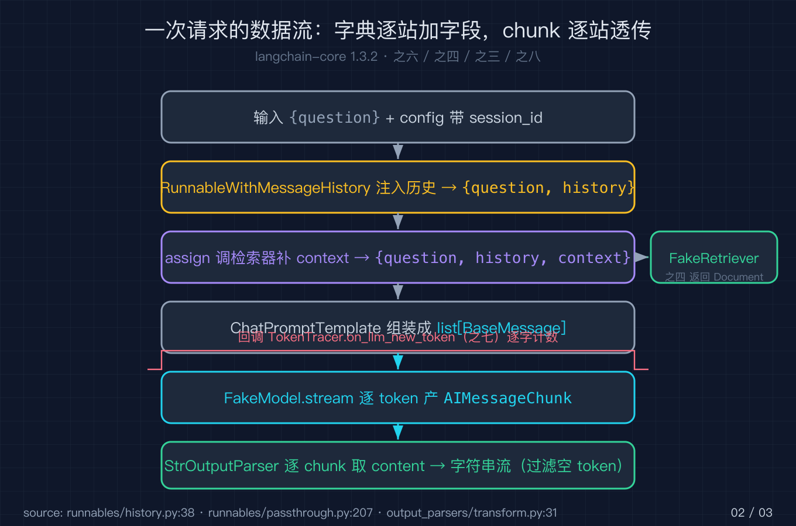
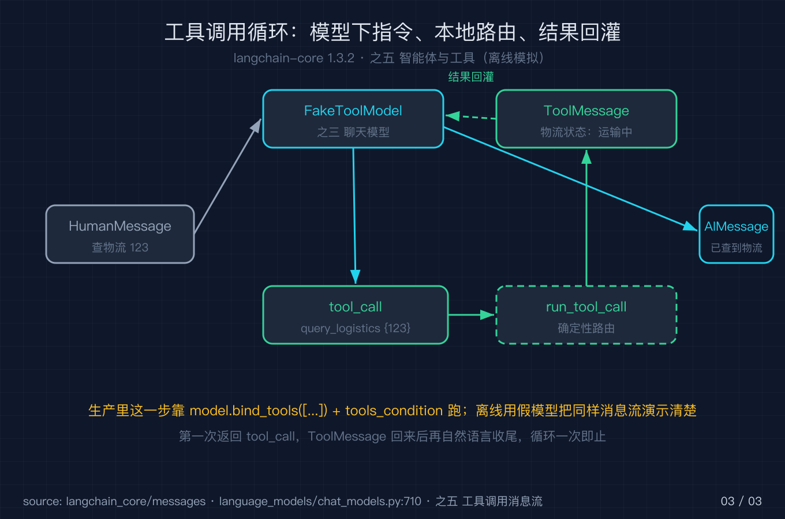
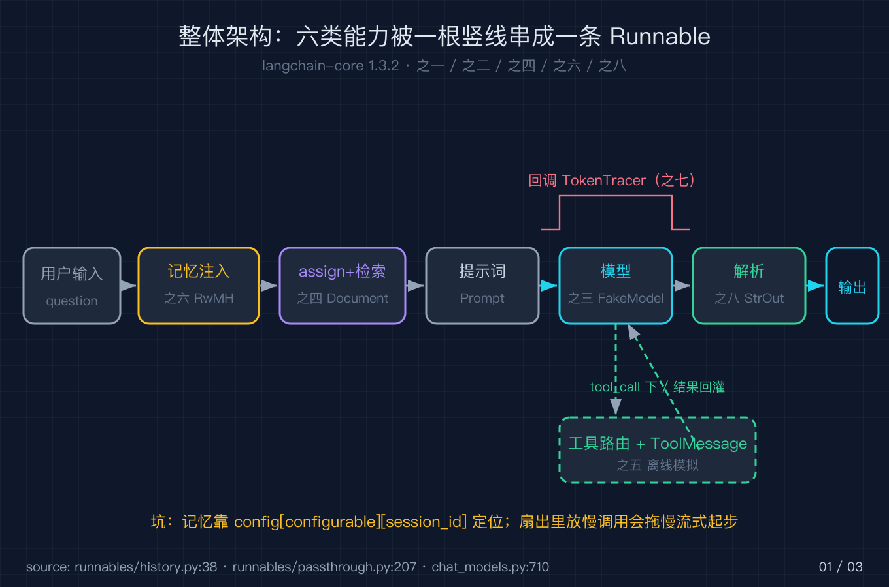

# LangChain 之九：一个能检索又会调工具的流式问答助手

前面八篇我把 LangChain 拆成了零件：架构、组合原语、模型与消息、检索与文档、智能体与工具、记忆与历史、回调与可观测、流式与透传。这一篇我不讲新零件，只做一件事：把前面那些零件拼成一个能跑的客服助手。它要会检索知识库、记得你上一句说了什么、遇到查物流这种事会去调工具、回答时像打字机一样逐字吐出来、而且每一步都能被观测到。我用一个免 key 的脚本把它完整跑通，你换上真实的模型和向量库，组合方式一行都不用改。

写这篇的出发点很实际。很多人学 LangChain 时，零件都能看懂，一上手做项目就散架：检索单独写一段、记忆单独写一段、工具再写一段，最后用一堆 if else 把它们硬拼成一个主流程。一旦要加流式、要加回调，整段逻辑就开始互相打架。问题不在零件难，而在于没有把零件统一到同一个组合契约上。本篇我要证明的就是这一件事：只要统一到 Runnable，零件之间是用一根竖线 `|` 串起来的，不是用流程控制语句粘起来的。

## 一、先定场景：这个助手到底要会什么

我做的是一个电商客服助手。用户问「我要退货」，它先从知识库里捞出退货规则，再把答案流式地打出来；用户接着问「那发票呢」，它要记得上一轮在聊退货，而不是当陌生人重新问一遍；用户问「查物流 123」，它要能下达一个查物流的工具调用，拿到结果再组织成自然语言回复。再加上一个问题：所有这些环节，我都希望能在控制台看到 token 级别的进度，方便排查。

把需求翻译成 LangChain 的零件，正好是前面八篇的内容：检索对应之四，记忆对应之六，工具对应之五，流式对应之八，可观测对应之七，而把它们黏合起来的组合原语（之一、之二）贯穿全程。下面我按顺序把每个零件装进去，最后用一根竖线串起来，再单独讲怎么把演示用的假零件换成生产用的真零件。

这里有个判断值得先说清楚。这五个能力不是我硬凑的，它们恰好覆盖了「一个能对话的助手」最常见的五类需求：从外部知识取信息（检索）、跨轮次保持上下文（记忆）、与外部系统交互（工具）、把生成过程做成可感知的体验（流式）、以及把整个过程变得可调试（回调）。LangChain 之所以能用一个框架兜住这五类需求，正是因为它给它们都套上了同一个 Runnable 接口。这个判断是后面所有代码的底层逻辑，你记住它，看下面的代码就不会觉得是在记 API，而是在看同一套契约的不同实现。

## 二、把检索装进去（对应之四：检索与文档）

检索的本质是：给一个查询，返回若干 `Document`。生产环境里这是向量库做的事，但接口就是一个 `invoke(query) -> list[Document]`。我先用一个离线检索器把接口跑通，`Document` 的构造在 langchain-core 1.3.2 是 `documents/base.py:288` 的 `Document(page_content, **kwargs)`，也就是说它第一个位置参数就是页面正文，其余字段都走关键字参数。

```python
class FakeRetriever:
    def __init__(self):
        self._docs = {
            "退货": [Document(page_content="七天无理由退货：商品未拆封可发起。"),
                     Document(page_content="退货时效：签收后 7 日内。")],
            "发票": [Document(page_content="电子发票在订单详情自助下载。")],
        }
    def invoke(self, query):
        for key, docs in self._docs.items():
            if key in query:
                return docs
        return [Document(page_content="没有命中知识库，转人工。")]
```

拿到文档后我用 `RunnableParallel` 做扇出：一个分支原样透传查询，另一个分支去检索并把文档拼成一段上下文。扇出在 LangChain 里就是同时跑多个 `Runnable` 再把结果合并成字典，这正是前面之八讲过的「并行不互相阻塞」的用武之地。底层的 `_transform` 实现在 `runnables/base.py:3992`，它把同一份输入复制给每个分支，各自独立运行，最后按分支名收拢成一个字典。所以检索分支哪怕跑得慢一点，也不会去卡死透传分支，两条路是平级的。

`RunnableParallel` 这点值得停下来想一下。很多人以为「并行」就是把活分出去，但真正麻烦的是合并：每个分支返回的形状不一样，怎么拼成一个干净的输入再往下传。LangChain 的做法很朴素，它让每个分支对应字典里的一个键，最后返回的就是这个字典。我的代码里，透传分支的键叫 `question`，检索分支的键叫 `context`，下游提示词模板就直接按这两个键取值。这种「用字典当合同」的设计，是组合原语能把任意零件拼在一起的关键，也是之八着重讲过的。

## 三、把记忆装进去（对应之六：记忆与历史）

记忆的接口是 `get_session_history(session_id) -> BaseChatMessageHistory`，具体实现 `InMemoryChatMessageHistory` 在 `chat_history.py:202`。这个类本身不复杂，它继承自 `BaseChatMessageHistory` 又是一个 `BaseModel`，所以构造签名是 `(self, /, **data)`，也就是你不能直接塞位置参数，得用关键字。它提供的方法里有 `add_message`、`add_messages`、`clear`，以及由 `BaseModel` 直接提供的 `messages` 属性来读历史。

关键不是这个类本身，而是它怎么接进链：`RunnableWithMessageHistory`（类定义 `runnables/history.py:38`，`__init__` 在 `:249`）会把历史按 `history_messages_key`（`:260`）注入到输入字典里，并且要求你每次调用时把 `session_id` 放进 `config` 的 `configurable` 字段（文档示例在 `:59`）。也就是说，记忆不是自动生效的，必须靠 `config={"configurable": {"session_id": "某用户"}}` 这个约定来定位这一轮对话属于谁。在源码内部，它用 `:92` 处的 `InMemoryHistory` 作为历史管理器别名，通过 `:97` 的 `add_messages` 和 `:101` 的 `clear` 在链跑前把历史塞进输入、跑后再把新消息写回。

```python
store = {}
def get_session_history(session_id):
    if session_id not in store:
        store[session_id] = InMemoryChatMessageHistory()
    return store[session_id]
```

同一 `session_id` 下的第二次提问，历史里就已经躺着上一轮的 human 和 ai 消息，模型因此知道你还在聊退货。注意历史是注入到 `history_messages_key` 对应的那个占位符里，所以你的提示词模板必须有一个 `("placeholder", "{history}")`，否则注入了也接不住。这一点我在第一次接记忆时漏过，表现就是「明明存了历史，模型却视而不见」，排查后才发现是模板里没留占位符。



## 四、把工具调用装进去（对应之五：智能体与工具）

工具调用的消息流是这样的：模型输出里带一个 `tool_calls`，指明要调哪个工具、参数是什么；你本地按名字路由去执行，把结果包成 `ToolMessage` 再喂回模型；模型看到工具结果后，组织最终回复。生产里这一步靠 `model.bind_tools([...])` 把工具声明绑到模型上，再用 `tools_condition` 这类路由决定要不要进工具循环来跑，但我这个免 key 版用一个会下指令的假模型把同样的消息流演示清楚：第一次返回 `tool_call`，工具结果回来后再自然语言收尾。

```python
class FakeToolModel(BaseChatModel):
    def _generate(self, messages, stop=None, run_manager=None, **kwargs):
        if any(isinstance(m, ToolMessage) for m in messages):
            return ChatResult(generations=[ChatGenerationChunk(
                message=AIMessageChunk(content="已为你查到物流。"))])
        return ChatResult(generations=[ChatGenerationChunk(
            message=AIMessageChunk(content="", tool_call_chunks=[{
                "name": "query_logistics", "args": '{"order_id": "123"}', "id": "call_1"}]))])
```

这里有个协议细节要讲明白：`tool_call_chunks` 里 `args` 是一段 JSON 字符串而不是已经解析好的字典，`id` 是这次调用的唯一标识，后面 `ToolMessage` 必须原样带上同一个 `tool_call_id` 才能和调用对上号。所以真实环境里你在路由执行完工具后，返回的 `ToolMessage` 的第一项工作就是把 `tool_call_id` 填回去，否则模型会报「收到工具结果但找不到对应的调用」。

路由只是一个按名字分发的确定性函数，命中就返回 `ToolMessage`，没命中就报错：

```python
def run_tool_call(name, args_json):
    if name == "query_logistics":
        return ToolMessage(content="物流状态：运输中。", tool_call_id="call_1")
    raise ValueError(f"未知工具: {name}")
```



## 五、把输出流式吐出来（对应之八：流式与透传）

流式是之八的主角：模型的 `stream`（基类 `runnables/base.py:1134`，聊天模型覆写在 `chat_models.py:710`）逐 token 产出 chunk，末尾还会补一个空 token（`:808`），需要和前文回调一起过滤掉。我在消费端判断 `if chunk:` 就跳过空串，于是「请问的是：已记录」这七个字是一个一个蹦出来的。

补一个空 token 这件事初看很怪，但它的作用是告诉下游「这条消息的流式输出到此结束」。在 `BaseChatModel` 的 `stream` 实现里（`:710`），它内部委托给 `_stream`（`:2129`），后者 yield 完所有真实 chunk 后，再 yield 一个 `content=""` 的收尾 chunk。如果你只在意拼接出来的最终文本，这个空 chunk 可有可无；但一旦你在回调里按 token 计数，漏掉它就会让计数逻辑和「文本结束」的判断对不齐。所以我的建议是：消费端统一做一次 `if chunk:` 过滤，把空串、空 content 都挡在外面，回调计数和文本拼接共用同一处判断，省得两处各写一遍。

流式能一路透传不被截断，靠的是链内每个节点都实现了 `transform` 而不是只在 `invoke` 时一次性返回。之八讲过的 `RunnableSequence._transform` 在 `base.py:3509`，它拿到上游的 chunk 就立刻往下游转，而不是等上游全部结束。这就是为什么我即便在链里夹了提示词模板、模型、解析器这么多层，流式依然是从模型那个 token 出来就往前走，中间环节只是「顺手处理一下」，不会先把整段攒齐再放出来。

## 六、把可观测装进去（对应之七：回调与可观测）

可观测的入口是 `BaseCallbackHandler`（`callbacks/base.py:493`），你要数 token 就重写 `on_llm_new_token`（`:65`），要记起止就重写 `on_llm_start`（`:279`）和 `on_llm_end`（`:90`）。我把回调传进 `config` 的 `callbacks` 字段，流式过程中每个非空 token 都会触发一次，于是我能实时知道模型已经吐了几个字，也能借此把空 token 过滤逻辑和观测逻辑放在同一处。

```python
class TokenTracer(BaseCallbackHandler):
        def __init__(self):
            self.tokens = 0
        def on_llm_new_token(self, token, **kwargs):
            if token:
                self.tokens += 1
```

回调真正厉害的地方在于传播范围。你只在最外层链的 `config` 里放了一个 `TokenTracer`，但它能收到深埋在链内部的模型每次吐出的 token，原因是回调会随着 Runnable 的运行树（run tree）一路向下传递：链每包一层子 Runnable，都会把父级的 `callbacks` 带到子级。所以哪怕模型是三层包裹之后才被调到，回调依然能穿透这些包裹直达模型。这也是为什么你想给整个应用加一个统一的日志或计费埋点，不必在每个零件里都改一遍，只要在顶层 `config` 注入一次就行。`on_chain_start`（`:383`）和 `on_chain_end`（`:169`）则用来看每一层包裹的起止，定位是哪一层慢了。

## 七、用一根竖线串起来（对应之一、之二：架构与组合原语）

前面六个零件，最终靠组合原语粘成一条链。我先用 `RunnablePassthrough.assign`（定义 `runnables/passthrough.py:207`）在透传用户输入的同时补上 `context` 字段，再过提示词模板、模型、解析器，最后用 `RunnableWithMessageHistory` 包一层记忆。整条链是一个标准的 `Runnable`，所以它能直接 `.stream()`、能带 `config`、能被 `|` 继续拼接。

```python
def build_chain(get_session_history):
    prompt = ChatPromptTemplate.from_messages([
        ("system", "你是客服助手。知识库：\n{context}"),
        ("placeholder", "{history}"),
        ("human", "{question}"),
    ])
    retriever = FakeRetriever()
    base = (
        RunnablePassthrough.assign(
            context=lambda d: format_docs(retriever.invoke(d["question"])))
        | prompt | FakeModel() | StrOutputParser()
    )
    return RunnableWithMessageHistory(
        base, get_session_history,
        input_messages_key="question", history_messages_key="history")
```

`RunnablePassthrough.assign` 的 `:207` 实现会先跑你给的那些赋值函数，再把结果合并回原字典，所以 `d` 进来时带着 `question`，出去时多了一个 `context`，下游模板两个键都能取到。`StrOutputParser` 走的是 `BaseTransformOutputParser` 的 `_transform`（`output_parsers/transform.py:31`），它逐 chunk 把 `AIMessageChunk` 的 `content` 取出来，所以流式能一路透传不被截断，这正是之八讲过的链内透传（`RunnableSequence._transform` 在 `base.py:3509`）在起作用。

把整条链读一遍，你能看到一根竖线 `|` 把五类零件串成了一条线：检索在 assign 里发生，记忆在最外层的 `RunnableWithMessageHistory` 里发生，模型和解析器在中间两节，流式和回调则渗透在每一次 `stream` 调用与每一个 chunk 里。没有任何一个环节是用 if else 去判断「下一步该调谁」的，全部是声明式的组合。这个对比很重要：你如果用流程控制去拼，每加一个零件就要改主流程；而用 Runnable 去串，新零件只要自己是个 Runnable，往竖线后面一挂就接上了。



## 八、把演示的假零件换成生产的真零件

前面用的 `FakeRetriever`、`FakeModel`、`FakeToolModel` 都是为了免 key 跑通。真正上线时你要换三处，但组合方式一行都不用改。

第一，把 `FakeRetriever` 换成真实向量库。任何实现了 `invoke(query) -> list[Document]` 的对象都能直接顶上，比如 Chroma 或 FAISS 的 `vectorstore.as_retriever()`，它返回的就是一个 Runnable，调用方式和我的假检索器完全一致，`context` 字段照常拿到拼好的文档段。

第二，把 `FakeModel` 换成真实聊天模型。用 `ChatOpenAI` 或 `ChatTongyi` 这类实现，并把工具声明用 `model.bind_tools([...])` 绑上去。消息流不用改：第一次模型返回 `tool_calls`，你路由执行完得到 `ToolMessage` 再喂回去，模型第二次返回自然语言。唯一要改的是路由里那条 `args` 从 JSON 字符串解析成字典。

第三，把 `run_tool_call` 里的写死逻辑换成真实工具执行，或者直接用 LangChain 的 `Tool` 对象。执行结果照样包成 `ToolMessage` 原样回填 `tool_call_id`。`TokenTracer` 和 `RunnableWithMessageHistory` 这两层完全不用动，因为可观测和记忆本来就是与具体模型、具体工具无关的横向能力。

讲到这里你应该能体会为什么前面八篇要花那么多篇幅讲「接口」而不是讲「功能」。当你把检索、记忆、工具都看成「输入某种东西、输出某种东西的 Runnable」，替换它们就成了换个函数实现，而不是重写主流程。这就是组合原语给实战带来的最大红利。

## 三个真踩过的坑

第一，记忆不生效十有八九是 `session_id` 没进 `config["configurable"]`。`RunnableWithMessageHistory` 靠这个字段找历史，你传错了或漏了，它要么新建一条空历史，要么直接按错的用户存，表现就是「助手像失忆」。这个坑我在第一次接记忆时踩过，排查了半天才发现是调用处少写了 `configurable`。

第二，`RunnableParallel` 扇出的分支各自独立，但某个分支如果是慢调用（比如真实向量检索或一次外部 HTTP），它会拖慢整体流式的起步。因为流式要等所有分支出了第一份结果才能往下走，所以扇出里别放会长时间阻塞的步骤，必要时把重活挪到链外或换成异步分支。

第三，流式消费的空 token 不展示。模型的 `stream` 末尾补的那个空 token，如果不加 `if chunk:` 过滤直接拼，最终字符串里会多一个看不见的空字符，而且你的回调计数也会虚高。消费端统一过滤一次，比到处判断更省心。

## 进阶一句原理

把检索、记忆、工具、流式、回调全部收敛到 `Runnable` 这一个接口上，是 LangChain 能用一根竖线把它们任意串起来的根本原因；你以后看任何新组件，先问它实现了 `invoke` / `stream` / `transform` 里的哪几个，就能马上判断它能怎么接、哪里会断流。

这也是前面八篇一直在铺垫的那条暗线：之一讲协议，之二讲组合，之三到之七讲具体零件，之八讲协议在流式上的体现，而真正把它们拧成一股绳的，始终是「一切皆 Runnable」。理解到这一层，你就不会再被某个新出的链式子类吓到，因为它们都只是同一套契约的不同实现。

## 复现模块

代码地址：本仓库 `2026-10-06-LangChain源码级原理拆解-之九/code/langchain_rag_agent_demo.py`。

数据源地址：本篇用离线写死的 `FakeRetriever` 与 `FakeModel`，不依赖任何外部数据源或 API key，纯标准库加 `langchain-core==1.3.2`。

运行命令（必须用钉死 1.3.2 的解释器，避免行号错位）：

```
/tmp/lc132/bin/python code/langchain_rag_agent_demo.py --self-test
```

精确预期输出（自测全绿）：

```
ALL self-test PASS
```

若要肉眼看流式与记忆效果，把脚本里 `self_test` 之外的演示段跑一遍，会看到：流式逐字吐出「请问的是：已记录」共 7 个 chunk、`TokenTracer` 数到 7 个 token；同一 `session_id` 下两次提问后历史里正好 2 条 human 与 2 条 ai；工具流里 `first.tool_calls` 为 `[{name: query_logistics, args: {order_id: 123}, id: call_1}]`，路由出的 `ToolMessage` 内容为「物流状态：运输中。」。

本篇一手行号（均按 langchain-core 1.3.2 核对）：`documents/base.py:288`（Document）；`chat_history.py:202`（InMemoryChatMessageHistory）；`runnables/history.py:38` 与 `:249`（RunnableWithMessageHistory 类与 init）、`:59`（session_id 进 configurable 的文档示例）、`:256`（get_session_history）、`:258`（input_messages_key）、`:260`（history_messages_key）、`:92`（InMemoryHistory 别名）、`:97`（add_messages）、`:101`（clear）；`callbacks/base.py:493`（BaseCallbackHandler）、`:65`（on_llm_new_token）、`:279`（on_llm_start）、`:90`（on_llm_end）、`:383`（on_chain_start）、`:169`（on_chain_end）；`runnables/passthrough.py:207`（assign）；`runnables/base.py:1134`（基类 stream）、`:3509`（链内透传）、`:3992`（RunnableParallel 扇出）；`language_models/chat_models.py:710`（BaseChatModel.stream）、`:2129`（`_stream`）、`:808`（末尾空 token）；`output_parsers/transform.py:31`（解析器逐 chunk 转）。

## 结尾钩子

你现在的项目里，是不是也有一个「既想接知识库、又想接工具、还想流式输出」的场景？它现在是用一堆 if else 硬拼的，还是已经能用一根竖线串起来了？如果串不起来，告诉我卡在哪一个零件上，下一篇我可以就那个零件再往下挖一层。另外，LangChain 系列到这篇正好把之一到之九串成闭环，你最想看我把哪一篇拆得更细，或者换个框架（比如直接用原生 SDK）再做一次对照？评论区告诉我。
