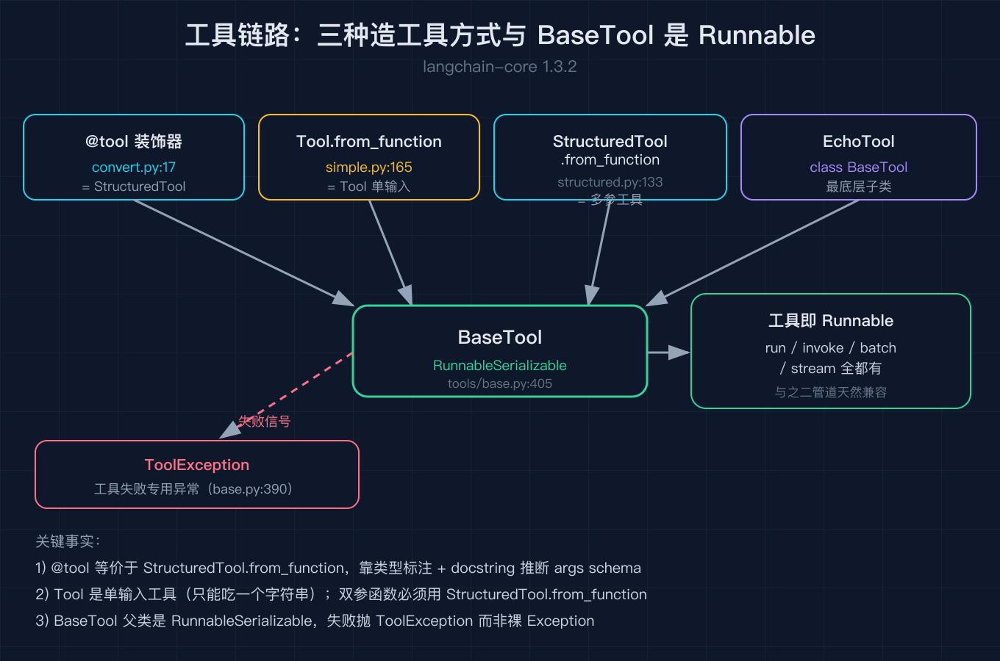
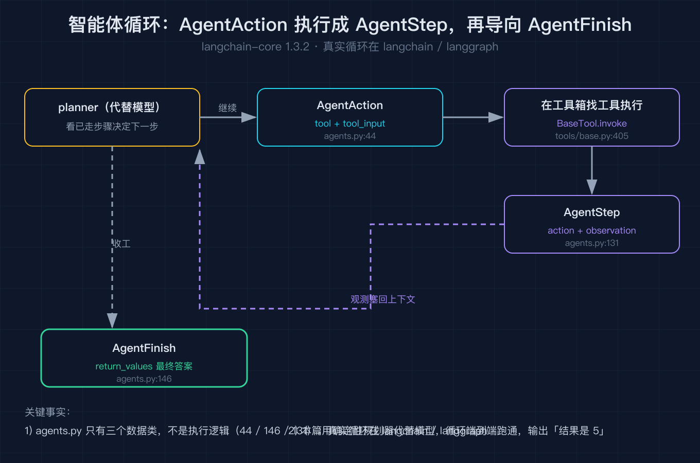
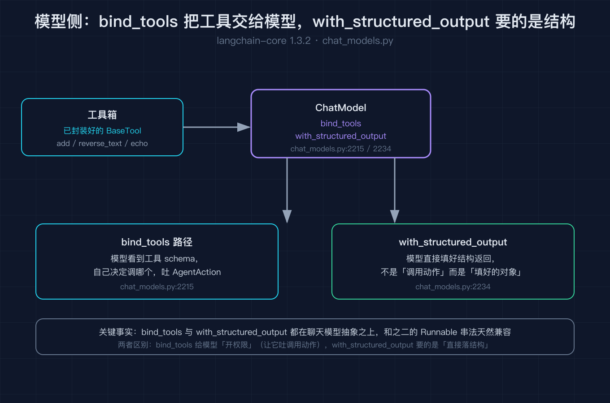

# LangChain 之五：智能体与工具

之四我们把检索链路拆完了，知道一段运维手册怎么切块、嵌入、入库，最后被 `Retriever` 包成 `Runnable` 捞出来。但之四留了两个问题一直没答：捞出来的文档要怎么变成模型的「工具」让它能主动去查？还有，模型吐出「我要调搜索工具」这个决定本身，是谁在循环里做的？

这篇就拆工具和智能体，全部对着 `langchain-core 1.3.2` 的源码核对。核心是一句话：一个普通函数怎么被封装成模型能调用的工具，以及那个「决定下一步做什么」的循环到底长什么样。

我拿一个最朴素的场景当引子。我写一个 `add(a, b)` 函数，想让模型在我说「帮我把 2 和 3 加起来」的时候，自己决定去调它，而不是我手动写死调用。这件事在 LangChain 里分两层：把函数变成工具，让模型能认；再跑一个循环，让模型吐出的「要调哪个工具」被真正执行。

## 一、@tool：一行装饰把函数变成工具

最简单的入口是 `@tool` 装饰器（`tools/convert.py:17`，它是一组重载，分别在 17 / 31 / 47 / 62 / 76）。你在一个普通函数上面加一行 `@tool`，它就不再是普通函数，而是一个 `StructuredTool` 实例。

```python
@tool
def add(a: int, b: int) -> int:
    """把两个整数相加。"""
    return a + b
```

为什么是 `StructuredTool` 而不是别的？看源码的返回类型就知道，`@tool` 内部走的就是 `StructuredTool.from_function` 那套。关键点在于：装饰器是靠函数的类型标注和 docstring 自动推断出 `args` 参数 schema 的。我的 `add` 有两个 `int` 参数，工具对象上就能查到 `args` 里同时有 `a` 和 `b`，模型拿到的也是结构化的入参描述，不是一个裸字符串。

我踩过的第一个坑是以为 `@tool` 只认 docstring 不认类型标注。不是。`add.name` 来自函数名、`add.description` 来自 docstring 第一行、`add.args` 来自参数标注，三者缺一不可。如果你的函数没有类型标注，schema 就退化，模型很难填对参数。

## 二、Tool 与 StructuredTool：单输入与多参数

`@tool` 给你的是 `StructuredTool`。那 `Tool` 又是啥？源码里 `Tool` 类在 `tools/simple.py:31`，`StructuredTool` 在 `tools/structured.py:40`，两者都是 `BaseTool`（`tools/base.py:405`）的子类。它们的关键区别我用一个真实翻车讲清楚。

`Tool.from_function`（`simple.py:165`）造的是「单输入工具」，它只能吃一个字符串，不会去解析多参数。`StructuredTool.from_function`（`structured.py:133`）才支持多个带类型的参数。我在脚本里一开始图省事，用 `Tool.from_function` 去包一个双参的 `_multiply(a, b)`，结果一调 `mul.invoke({"a": 4, "b": 5})` 直接炸：`Too many arguments to single-input tool multiply. Consider using StructuredTool instead.`

```python
# 双参函数必须用 StructuredTool.from_function
mul = StructuredTool.from_function(
    func=_multiply,
    name="multiply",
    description="两个整数相乘",
)
```

这条报错本身就是最好的教材：它在提醒你，工具的「长相」取决于你用什么工厂方法造它。`BaseTool` 是它们的共同父类，无论哪一种，最终都是 `BaseTool`。

## 三、BaseTool：工具本身也是 Runnable

`BaseTool` 的父类是 `RunnableSerializable`（`tools/base.py:405` 能看到泛型签名 `BaseTool(RunnableSerializable[str | dict | ToolCall, Any])`）。这意味着工具不是一个孤立的东西，它和之二的 `Runnable` 体系是一家人。

所以一个工具天然能 `run`、能 `invoke`、能进 `batch`、能接 `|` 管道。我的脚本里三种调用姿势都验证过：

```python
assert echo.run("hi") == "echo: hi"            # 字符串直传
assert echo.invoke("hi") == "echo: hi"         # Runnable 统一入口
assert mul.invoke({"a": 4, "b": 5}) == 20      # 结构化入参
```

还有一条容易被忽略的边界：`ToolException`（`tools/base.py:390`）。当工具执行失败（比如参数非法、内部出错），应当抛出这个专用异常，而不是随便抛个 `Exception`。它是给上层循环用的信号量，让 agent loop 能把「工具挂了」和「模型决策错了」区分开。



## 四、智能体循环：AgentAction / AgentFinish / AgentStep 是数据形状

工具备好了，轮到那个「决定下一步做什么」的循环。很多人以为这个循环在 `langchain-core` 里，甚至以为有个 `AgentExecutor` 类躺在 core 中。我在核对源码时确认了：core 里根本没有 agent loop 的实现。`langchain_core/agents.py` 不是个包，就是一个单文件，里面只有三个数据类：

```python
class AgentAction(Serializable):               # agents.py:44
    tool: str
    tool_input: dict | str
    log: str
    type: Literal["AgentAction"] = "AgentAction"

class AgentStep(Serializable):                 # agents.py:131
    action: AgentAction
    observation: Any

class AgentFinish(Serializable):                # agents.py:146
    return_values: dict
    log: str
```

它们是「数据形状」，不是「执行逻辑」。真实的循环在 `langchain` 或 `langgraph` 里：模型先吐一个 `AgentAction`（说我要调哪个工具、传什么参数），循环去工具箱里找到对应工具执行，把结果包成 `AgentStep` 塞回上下文，模型再看一眼决定下一步，直到吐出 `AgentFinish`（说可以收工了，这是最终答案）。



我的脚本不调任何大模型，而是用一个确定性的「规划器」代替模型，把这条循环端到端跑通：第一步规划器吐 `AgentAction(tool="add", tool_input={"a": 2, "b": 3})`，循环执行 `add` 得到观测 `5`，再吐 `AgentFinish(return_values={"output": "结果是 5"})`，循环结束。最终断言输出正好是 `结果是 5`。这样做的用意是：把「agent loop 这件事」从大模型里剥离出来，你能单独验证循环本身对不对，模型换成真的大模型时，循环代码一行都不用动。

## 五、模型侧怎么把工具交出去

工具在 core 这边备好，但要让模型「会调」它们，还得在模型侧做一件事：把工具列表交给模型。这在聊天模型里由 `bind_tools` 完成（`chat_models.py:2215`），它把工具 schema 挂到模型调用上；如果你想要的不是一个「调用动作」而是一个「填好的结构」，用 `with_structured_output`（`chat_models.py:2234`）。这两个方法是之三讲的聊天模型抽象之上的能力，它们和之二的 `Runnable` 串法天然兼容。这一层不属于 core 的工具抽象，但它是工具真正接入模型的桥，故在此点一句，不展开。



## 六、复盘：工具与智能体的职责边界

走到这里，工具和智能体的骨架就清楚了，每一层只干一件事：

| 角色 | 源码位置 | 唯一职责 |
| --- | --- | --- |
| `@tool` | `tools/convert.py:17` | 一行装饰，函数变 `StructuredTool` |
| `Tool` | `tools/simple.py:31` | 单输入工具，只能吃一个字符串 |
| `StructuredTool` | `tools/structured.py:40` | 多参数工具，按 schema 结构化入参 |
| `BaseTool` | `tools/base.py:405` | 共同父类，本身是 `Runnable` |
| `AgentAction/Finish/Step` | `agents.py:44 / 146 / 131` | agent loop 的数据形状，非执行逻辑 |
| `bind_tools` | `chat_models.py:2215` | 模型侧把工具交给大模型 |

最容易混淆的两个点：`Tool` 和 `StructuredTool` 不是同一个东西，双参函数必须用后者，这是 self-test 实打实踩过的坑；`agents.py` 里只有数据形状，真正的循环在 `langchain` 或 `langgraph`，core 不替你跑循环。

## 结尾钩子

工具能备、循环能跑，但还有一个问题没碰：那个循环每跑一圈，都会往上下文里塞东西，多轮之后历史越来越长，模型看着看着就乱了，而且同样的工具调用可能被重复触发、花掉不该花的钱。之六我们拆记忆与历史，看 LangChain 怎么把「对话历史」和「长期记忆」建模成可以增删改查的对象，以及上下文预算是怎么被管理的。

## 复现模块

代码地址（本篇脚本，无需 API key 即可复现）：
`2026-10-06-LangChain源码级原理拆解-之五/code/tools_and_agents.py`

数据源地址：示例用内嵌的纯函数工具，无外部数据依赖。

运行命令（请使用持有 `langchain-core==1.3.2` 的解释器）：
`python tools_and_agents.py --self-test`

精确预期输出（self-test 全绿）：
```
self-test PASS [1] @tool -> StructuredTool，含 name/description/args schema
self-test PASS [2] Tool.from_function.invoke() 返回正确结果
self-test PASS [3] 自定义 BaseTool 子类 run/invoke 生效
self-test PASS [4] AgentAction / AgentFinish / AgentStep 数据形状可构造
self-test PASS [5] 最小 agent loop：调 add(2,3) 后 AgentFinish，输出「结果是 5」
self-test PASS [6] ToolException 是工具失败专用异常（tools/base.py:390）
ALL self-test PASS
```

一手代码来源（均来自本机 `langchain_core 1.3.2` site-packages）：
- `langchain_core/tools/convert.py`、`langchain_core/tools/simple.py`、`langchain_core/tools/structured.py`
- `langchain_core/tools/base.py`
- `langchain_core/agents.py`
- `langchain_core/language_models/chat_models.py`
