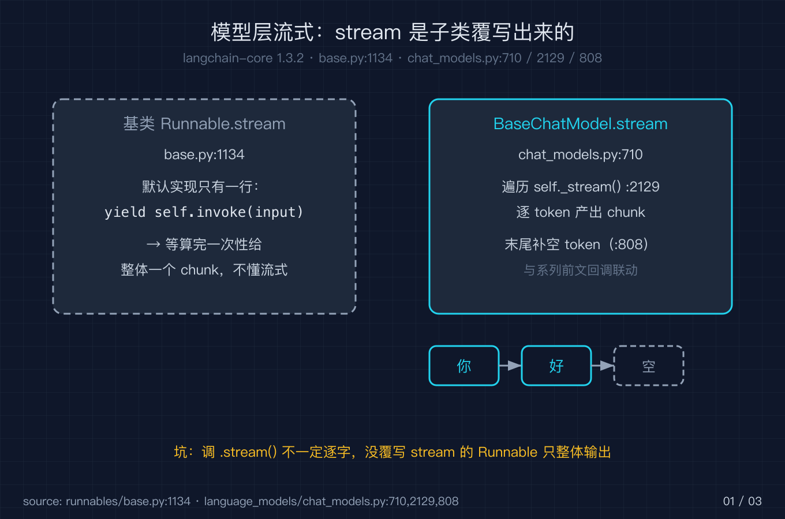
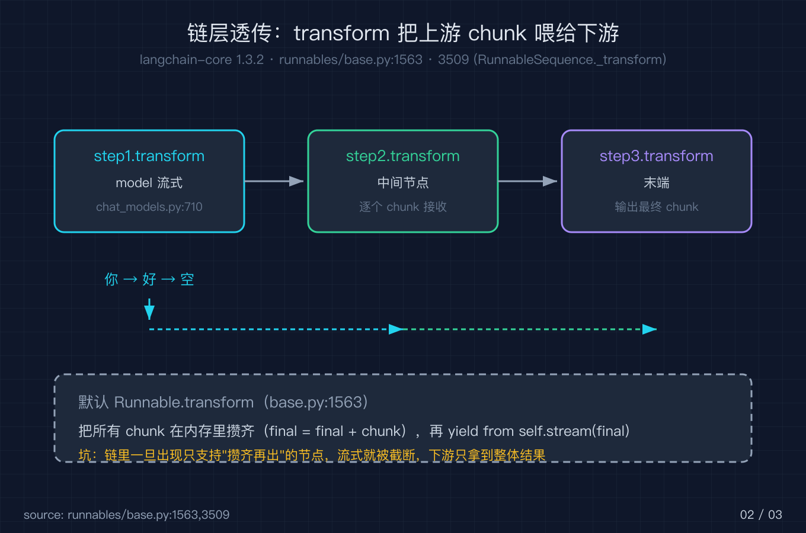
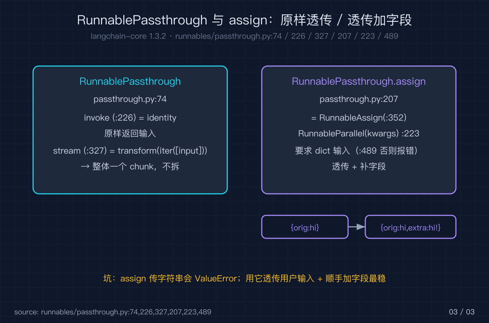

# LangChain 之八：流式与透传

我在之七讲回调与可观测时埋了一个伏笔：流末框架会补一个空 token，on_llm_new_token 在流尾会收到一格 content 为空、chunk_position 等于 last 的东西。当时我把它当成回调侧的坑来记。这一篇我把这件事追到源头，顺带把整个「流式」和「透传」一次性讲透。它们其实是同一件事的两面：流式是让数据一小块一小块往前走，透传是让这一小块原样或者不走样地穿过某个节点。

为什么这两件事值得单独成篇？因为前面七篇拆的模型、链、回调，最后都要靠流式和透传来让你真正「用得爽」。你写个聊天界面，要的是打字机式地把字蹦出来，而不是对着转圈圈等整个回答生成完。你写个检索增强问答，要的是模型边想边吐、前端边接边渲染。这些体感不来自某个新原语，而来自数据有没有一路透传下去。你只要看懂一层层谁把 chunk 往后传、谁把 chunk 攒齐了才放，就再也不会被「我明明写了 stream，为什么还是一股脑拿到结果」这类问题卡住。

流式还带来两个常被忽略的红利。一个是中途取消：用户关掉页面或者点了停止，取消信号顺着管道往回传，模型那一格没吐出来就不吐了，不用把整段生成完再丢弃。另一个是背压：下游处理得慢，上游吐出的 token 自然在管道里排队，不会把内存撑爆。这两个红利的前提，同样是数据得一小块一小块往前走，也就是这一篇要讲透的透传。我会先讲模型层是怎么把字一小块一小块吐出来的，再讲链是怎么把这些小块接力传下去的，最后讲那个看似不起眼、却天天在用的 RunnablePassthrough 和 assign。这个 LangChain 源码级系列到这里收尾，我也把最容易被误解的这一层补完。

我用的源码钉死在 langchain-core 1.3.2，下面每一个行号都对着这个版本。

## 一、模型层流式：stream 是子类覆写出来的

所有 Runnable 都继承自 runnables/base.py 里的 Runnable。它给了一个 stream 方法的默认实现，在 base.py:1134 定义，核心只有一行，就在 base.py:1153：

```python
yield self.invoke(input, config, **kwargs)
```

也就是说，基类眼里根本没有「流」，它把整次 invoke 当成一个 chunk 吐出来。这是整个系列里反复出现的一个套路：父类给个能跑但平庸的默认，真正的能力由子类覆写。BaseChatModel 就覆写了 stream，位置在 language_models/chat_models.py:710。它先判断模型到底支不支持流式，调 `_should_stream`（在 chat_models.py:718），不支持就退回 invoke 把整段答案当成一个 AIMessageChunk 吐出；支持才走真正的逐 token 循环。

进了流式分支后，方法先在 chat_models.py:725 到 760 搭好配置和回调管理器，回调里会调用 on_chat_model_start 通知链路「模型开始跑了」。真正的循环从 chat_models.py:773 开始，它遍历 `_stream(input_messages, stop=stop, **kwargs)`，把每个 ChatGenerationChunk 逐个吐出去。注意吐出去的不是 ChatGenerationChunk 本身，而是它的 `.message`（一个 AIMessageChunk），在 chat_models.py:794 这一行 `yield cast("AIMessageChunk", chunk.message)`。而 `_stream` 这个方法本身在 chat_models.py:2129，基类里只是个 raise NotImplementedError 的占位，真正的产出逻辑由具体模型（OpenAI、Ollama 之类）去覆写。换句话说，模型能不能逐字往外蹦，完全取决于这个子类有没有把 `_stream` 写好，框架只负责把 subclass 吐出来的 chunk 包成统一的 AIMessageChunk 再派发。

这里要分清两个类型：模型内部 yield 的是 ChatGenerationChunk（它额外带着生成层面的元信息），而 stream 对外吐的是它的 `.message`，也就是 AIMessageChunk。ChatGenerationChunk 在 chat_models.py:774 还会被补上 id（复用 run_id）和 response_metadata，这些在之三讲消息合并时已经埋过伏笔，流式只是把它们按格递出来。

循环里还有一段 v1 版本的兼容处理，在 chat_models.py:777 到 789：当 output_version 等于 v1 时，content 被当成 content_blocks，每个块会按类型分桶并赋上 index。这段不影响流式的基本形状，只是多模态或者结构化输出时保证块的序号不出错，你看到这儿知道有这么回事即可。

顺带厘清一个容易混的点：这个末尾空 token 是 BaseChatModel（聊天模型）的概念，因为它产出的是 AIMessageChunk 流、带 chunk_position 这套语义；之三讲的 BaseLLM 走的是字符串那一套，没有 chunk_position。也别指望 RunnableLambda 这类纯函数节点能「拆开」上游的流，它的 stream 就是基类默认实现，整体一个 chunk，因为它根本没有 `_stream` 或者覆写过的 transform 可以逐格产出。

重头戏在循环结束前，chat_models.py:799 到 813：如果已经吐过 token（yielded 为真），并且最后一格 chunk 是 AIMessageChunk、且它还没被标过 chunk_position，框架会补一个 content 为空、chunk_position 等于 last、id 复用 run_id 的 AIMessageChunk。这就是之七里那个空 token 的出生地。它存在的意义是给流一个明确的终止信号：下游和回调可以据此知道「这一轮生成结束了」，而不是去猜还有没有下一格。之七里 on_llm_new_token 在流尾收到的那个空调用，就是由这里发出来的。所以你在写流式回调时，比对有效 token 之前必须先过滤掉 content 为空且 chunk_position 为 last 的这一格，否则会把一个空串当成多出来的 token 处理。

异步一侧是同一个形状的镜像，astream 在 chat_models.py:839，它同样先过 `_should_stream(async_api=True)`（:847），再把输入归一成 messages（:855 到 856 的 `_convert_input(input).to_messages()`），之后沿 `_astream` 逐格吐。同步和异步只是入口不同，逐 token 与末尾补空 token 的行为完全一致。

我写了个最小可流式模型 FakeModel，把 `_stream` 覆写成逐字 yield 出「你」「好」两格。跑 fm.stream("hi") 拿到的 chunk 列表至少有三格：非空的两格加上末尾那格空 token。过滤掉空 content 后拼起来正是「你好」。这张图把这条从 `_stream` 到 stream 再到末尾空 token 的路径画全了。



## 二、链层透传：transform 把上游 chunk 喂给下游

单个模型会流式还不够。实际项目里模型几乎总是被竖线串起来，比如 `prompt | model | parser`。这时候 chunk 要穿过整条链，靠的是另一套机制，它和模型层的 stream 不是一回事，但目标一致：让小块一路往前传。

RunnableSequence 是竖线组合出来的序列，它在 base.py:3509 提供了 `_transform` 方法。关键就在 base.py:3516 到 3530：它先把链拆成 steps 列表（first、middle、last），然后进入循环，把每一步的 `step.transform(...)` 串起来，前一步的输出迭代器直接喂给下一步当输入（:3526 第一次、:3528 后续）。于是只要你链上每一步都正确实现了 transform，上游模型的每一格 token 就会一路透传到链尾，你在外面写 for chunk in chain.stream(...) 就能逐格拿到。这层管道才是链流式真正的骨架。

但坑也在这里。Runnable 基类那个默认的 transform（base.py:1563）干的事和默认 stream 一样平庸。它的注释在 base.py:1588 到 1590 写得直白：默认实现就是先把输入 buffer 起来、攒齐、再去调 stream。代码上它遍历整个 input，用加号运算符把一格一格拼成 final（:1601），如果类型不支持加法就保留最后一格（:1603）；循环结束后才 `yield from self.stream(final)`，也就是把攒好的整块一次性吐出。凡是你链上没有专门覆写 transform 的节点，一旦它的上游给了它一个迭代器，它就会先把所有 chunk 在内存里收齐，再作为一个整体往后传。

这就解释了为什么「链里某一步不是流式节点，整条链就退化成一次性输出」。比如你在 model 后面接一个纯函数式的 RunnableLambda，而那个 Lambda 没覆写 transform，那么模型吐出的每一格 token 会先被这个 Lambda 攒起来，等模型吐完，Lambda 才把整段结果交给下一步。流式在 Lambda 这一关被截断了。反过来看，RunnableParallel（并行分支）自己有 transform，它把同一个输入扇出给每个分支并分别按各自的流式能力吐出，所以并行分支里能流式的部分照样流式。异步一侧由 RunnableSequence 的 `_atransform`（base.py:3532）担同样的职责，只是换成了 AsyncIterator。异步这一侧之所以单独存在，是因为 Python 的同步迭代器和异步迭代器不能混用：你用 chain.astream 就必须整条链都走 atransform 与 astream 这条异步线，否则会在某个节点卡住。很多人只在同步侧调 stream 发现没问题，一上线改成 astream 就错位，根因就是某一步的异步 transform 没接上。

再具体一点：`prompt | model | parser` 里，prompt 这一步本来就只收一个完整输入、产一个完整提示词，它非流式是理所应当；model 在中间逐 token 吐；parser 这一步决定了你最后在链尾看到的节奏：如果 parser 覆写了 transform、收到一格就转一格（比如 StrOutputParser），你能紧接着模型看到逐格文本；如果 parser 是需要整段才能解析的类型（比如 JSON 解析器），它会先把模型的所有 token 攒齐再解析，那么你在链.stream 上要等到模型整段吐完才看到 parser 的输出。所以链.stream 对外表现出的「流不流」，取决于从模型到链尾最后一处还在逐格流转的节点，之后任何攒齐节点都会把节奏拉回一次性。我图里把这个「截断点」标红，提醒你排查流式失效时先找链里谁在攒齐。

把 parser 这一层讲具体一点。最常见的 StrOutputParser（output_parsers/string.py:8）本身没有覆写 transform，它继承的是 BaseTransformOutputParser（output_parsers/transform.py:28）的流式 transform。后者的 _transform 在 transform.py:31，对每个 chunk 调 parse_result 后立即 yield，所以 token 过来一个就转一个。它的 transform 在 transform.py:56，只是把输入和 _transform 一起丢给 _transform_stream_with_config。这就是为什么 model 后面接 StrOutputParser 能继续逐字出。反过来，需要整段才能解析的 parser（比如 cumulative 那一族，基类在 transform.py:99）会覆写 _transform 把 chunk 攒起来再解析，那它就成了一个新的截断点。所以判断一条链在哪一格被截断，parser 这一环和 Lambda 一样要单独看。

再说 RunnableParallel 到底怎么扇出。它确实覆写了 transform（base.py:4040），但真正干活的是 _transform（base.py:3992）。它先用 safetee 把输入迭代器复制成每份分支一份（base.py:4002），再用线程池让每个分支的 step.transform 并行跑（base.py:4005 那组 named_generators），最后用 wait 的 FIRST_COMPLETED 策略（base.py:4026）哪个分支先出 chunk 就先 yield 哪个，每份 chunk 包成 AddableDict 以分支名当键（base.py:4030）。所以并行里能流式的分支按自己的节奏吐，不会因为别的慢分支被拖成一次性。这也是为什么 assign 里那种 context 走检索、question 走 passthrough 的两条线能各走各的，互不阻塞。

理解到这一层，你就不必死记哪个原语能流、哪个不能流：只要顺着一条规则查，谁覆写了 transform 或 _stream、谁还在用基类的攒齐默认实现，流式就在前者那一格活着，在后者那一格断掉。

落地到一个能跑的小例子：chain = RunnableLambda(lambda x: x) | FakeModel() | RunnableLambda(lambda m: m.content)。chain.stream("hi") 吐出来的就是模型那几格（含末尾空 token）。最前面的 RunnableLambda 因为只是整体一个 chunk，不影响后面模型继续逐格；可一旦你在模型后面接一个没覆写 transform 的解析节点，那一层就会先把 token 攒齐再解析，链尾看到的流就被截断在解析节点之前。所以排错时从链尾往回数，第一个还在逐格流转的节点之后那一步，往往就是元凶。



## 三、RunnablePassthrough 与 assign：透传与字段回写

把一个东西原样放过去，在组合里是高频操作。RunnablePassthrough 就是干这个的，定义在 passthrough.py:74。它的 invoke 在 passthrough.py:226，核心是在 :233 调 identity 原样返回，你喂什么它就回什么。它本身还留了个 func 和 afunc 的钩子（:137 到 145 的参数、:153 的 `__init__`），让你能在透传的同时对输入做点副作用（记日志、打点），但返回出去的仍然是那个原值，不会被函数改写。它的 stream 在 passthrough.py:327，实现是直接 `return self.transform(iter([input]), config, **kwargs)`，也就是说它把整个输入包成一个单元素迭代器走 transform，所以单独对 RunnablePassthrough 调 stream，拿到的是整体一个 chunk，不是逐格。它的 transform 在 passthrough.py:253，没挂 func 时直接 yield identity 的 chunk；挂了 func 时它会先把所有 chunk 攒成 final，循环结束后才去调 func（:263 到 281）。所以 passthrough 自己不制造「流」，它是个忠实的搬运工，保持输入原封不动。

也正因为它原封不动，RunnablePassthrough 常被拿来给链路「抽血」做观测：在竖线中间插一个带 func 的 passthrough，func 里把当前这个值记下来或者发到别的系统，但链路里流过的数据完全不受影响。这种「tap」模式比手写一个会改值的 Lambda 安全得多，因为你永远不会误改流经的数据形状。

更有用的是 assign，它是 RunnablePassthrough 的类方法，在 passthrough.py:207，返回的是 `RunnableAssign(RunnableParallel[dict](kwargs))`（:223）。RunnableAssign 定义在 passthrough.py:352，它做的事是把收到的 dict 和并行分支算出来的新字段合并成更大的 dict。这里有个硬约束：输入必须是个 dict，否则在 passthrough.py:487 到 489 直接抛 ValueError，文案就是「The input to RunnablePassthrough.assign() must be a dict.」。原因也清楚：RunnableParallel 需要 dict 才能把每个键扇出成一条分支。我第一次踩这个时，把一个字符串喂给 assign 出来的链，堆栈里就是这个错，折腾半天才反应过来 assign 只认 dict，传字符串它根本没法 fan-out。

assign 还有一个容易想多的点：同时 assign 多个字段时不用操心顺序。RunnableParallel 的各分支是并发求值的，最终合并只看键名、不看重轻，所以 `RunnablePassthrough.assign(a=..., b=...)` 和反过来写，输出字典的字段都一样。想看清楚结构，RunnableAssign 的 get_graph（passthrough.py:468）会在可视化里给 mapper 额外加一个 passthrough 节点，再把它连回 output 节点，你一眼就能看出「原值透传 + 分支补字段」这两条线是怎么合流的。

assign 的 stream 行为也值得记住：它的 transform 在 passthrough.py:575 到 582，先把原始 dict 里不在映射键集合里的字段作为第一个 chunk 透传出去，再把并行分支算好的新字段作为第二个 chunk 补上。所以你拿到的是两个 chunk，而不是一个合并好的 dict。如果你在同步 invoke 下看到的是一个合并后的 dict，到了流式下会分成两段，别误以为丢了原输入，那只是流式把「透传原值」和「补字段」分两次投递而已。一个常见用法是 `{"context": retriever, "question": RunnablePassthrough()} | prompt`，让用户的提问原样穿过，同时并行走检索拿 context，再一起喂给提示词。这张图把 RunnablePassthrough 和 RunnableAssign 的形状摆在一起。



## 三个真踩过的坑

坑一：以为调了 Runnable.stream 就能逐格拿结果。真相是基类默认实现就是 yield invoke，整体一个 chunk。只有覆写了 `_stream` 的模型、或者覆写了 transform 的节点才真流式。你在调试时先确认你拿到的那一层到底是不是被覆写过，而不是只看外层有没有写 stream。

坑二：链里混进了一个没覆写 transform 的节点，模型的逐 token 流被它攒齐再放，整条链退化成一次性输出。排查顺序是从链尾往链头找，看哪一步的 transform 还是基类默认实现，那个节点就是截断点。

坑三：把字符串喂给 assign 出来的链，直接 ValueError。assign 只认 dict 输入，而且它的 stream 是分两段出（先原 dict 再补字段），别在流式下误判成数据丢失。

## 复现模块

源码版本：langchain-core 1.3.2（pip install "langchain_core==1.3.2"），解释器钉死这个版本，默认环境的更高版本行号会对不上。

代码地址：本篇目录下 code/streaming_and_passthrough.py（FakeModel 免 key 可复现，含 5 条断言）。

运行命令：

```bash
/tmp/lc132/bin/python code/streaming_and_passthrough.py --self-test
```

精确预期输出：

```
ALL self-test PASS
```

五条断言分别覆盖：模型层流式加末尾空 token 过滤、RunnablePassthrough 原样返回加 stream 整体一个 chunk、assign 要求 dict 输入加透传补字段（含非 dict 触发 ValueError）、链中 passthrough 透传上游 chunk 给下游、基类 Runnable.stream 默认等于 yield invoke。

一手代码来源（langchain-core 1.3.2）：runnables/base.py:1134、1153、1563、1588、3509、3516、3521、3526、3530、3532；language_models/chat_models.py:710、718、773、777、799、807、839、855、2129；runnables/passthrough.py:74、137、153、207、223、226、233、253、327、352、487、575；runnables/base.py:3992、4040；output_parsers/transform.py:28、31、56、99；output_parsers/string.py:8。

## 结尾钩子

我追到这一步，算是把之七那个流末空 token 的来历补完了，也把「为什么我的 stream 不流」这类问题一次性拆穿：流不流，取决于从模型 `_stream` 到链 `_transform` 再到每个节点的 `transform` 有没有一路透传下去，任何一个攒齐再出的节点都会让前面的努力白费。你最近有没有被某条链的流式突然「卡成一坨」卡住过？把你那条链的组件顺序发我，我帮你看是哪一步在攒齐。这个 LangChain 源码级系列到这里收尾，如果还想看某个我没拆到的原语，评论区点名。
