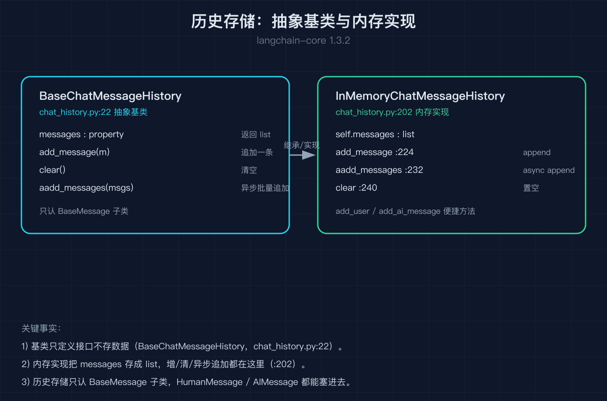
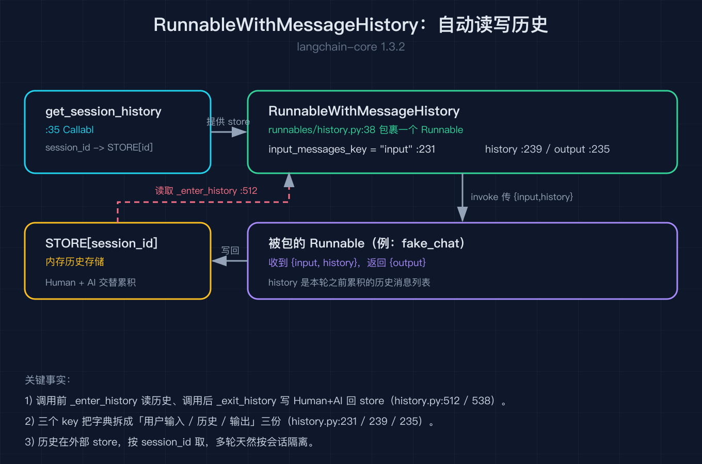
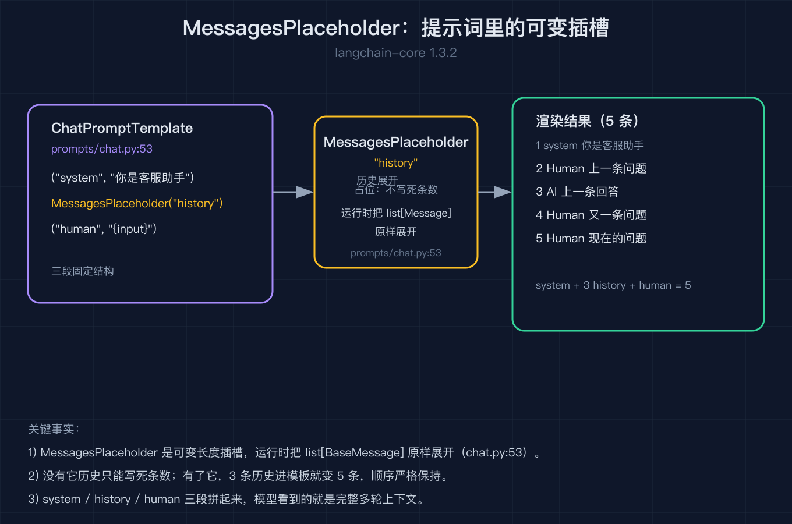

# LangChain 之六：记忆与历史

之五我们把工具和智能体的数据形状拆完了。之五结尾留了一个没接住的问题：那个 agent loop 每跑一圈，都会往上下文里塞东西，多轮之后历史越来越长，模型看着看着就乱了，同样的工具调用还可能被重复触发。这件事的上游解法，是把「对话历史」和「长期记忆」建模成可以增删改查的对象，再在每次调用前后自动读写它们。

这篇就拆记忆与历史，全部对着 `langchain-core 1.3.2` 的源码核对。核心是一句话：历史在 LangChain 里不是一个藏着的状态，而是一个你随手能拿到的对象，你可以往里加消息、清掉、按规则截断，也可以把它插进提示词的可变插槽。

我拿一个客服多轮对话当引子。用户第一句说「我的订单怎么还没到」，模型回了；第二句说「帮我催一下」，模型得知道第一句说的订单才能接得上。这条「接得上」的能力，靠的就是把两轮之间的消息存进一个历史对象，第三轮再把它们取出来。

## 一、BaseChatMessageHistory 与 InMemoryChatMessageHistory：历史是能增删改查的对象

很多人以为对话历史是框架藏在某个全局变量里的魔法状态。不是。`langchain_core` 把历史抽象成一个类：`BaseChatMessageHistory`（`chat_history.py:22`），它就是一个普通的抽象基类，定义了「往里加消息」「读出全部消息」「清空」这几个动作。

```python
class BaseChatMessageHistory(ABC):            # chat_history.py:22
    messages: list[BaseMessage]

    def add_message(self, message: BaseMessage) -> None: ...
    def clear(self) -> None: ...
```

最常用的是它的内存实现 `InMemoryChatMessageHistory`（`chat_history.py:202`），它把消息存在 Python 列表里。`add_message` 就是往列表尾追加一条（`chat_history.py:224`），`clear` 就是把列表清空（`chat_history.py:240`）。你还能用 `add_user_message` 和 `add_ai_message` 这两个便捷方法，它们背后还是调 `add_message`。

我踩过的第一个坑是以为历史会自动被框架记住。不会。`InMemoryChatMessageHistory` 就是个本地列表，进程一重启就没了，多进程或多实例之间也不共享。它适合演示和小场景，真要持久化，你得自己写 `BaseChatMessageHistory` 的子类去接数据库或 Redis。框架只定义了「增删改查」的接口，存在哪里完全是你自己的事。



还有一个异步入口值得点一句：`aadd_messages`（`chat_history.py:232`）。它是 `add_messages` 的异步版本，能一次塞进多条，且和异步链路的 `ainvoke` 配套。如果你的存储是异步的（比如异步数据库驱动），就用它，别在异步链里硬塞同步的 `add_message`。

## 二、RunnableWithMessageHistory：每次调用前后自动读写历史

光有历史对象还不够，你总不能每轮都手写「取历史、拼进输入、跑链、把新消息存回去」。LangChain 把这个样板动作包成了 `RunnableWithMessageHistory`（`runnables/history.py:38`），它也是一个 `Runnable`，可以像之二的竖线一样被组合。

它的工作方式是这样的：你给它一个「从 session_id 拿到历史对象」的工厂函数，再告诉它输入里哪个字段是用户本轮的话、哪个字段放历史、哪个字段放输出。之后每次 `invoke`，它自动做四件事：

1. 用你提供的 `session_id` 通过工厂函数拿到这一轮的历史对象。
2. 读历史，按你指定的 `history_messages_key` 作为独立字段喂给里面那条链（`runnables/history.py:239` 和 `:326` 的 `messages_key` 取法）。
3. 跑链，拿到输出。
4. 把本轮的「用户消息 + 模型回复」写回历史对象，这样下一轮就能读到。

```python
def fake_chat(inputs: dict) -> dict:
    human = inputs["input"]
    history = inputs["history"]          # 本轮之前累积的历史
    return {"output": f"回应[{len(history)}]:{human}"}

STORE: dict[str, InMemoryChatMessageHistory] = {}

def get_session_history(session_id: str) -> InMemoryChatMessageHistory:
    if session_id not in STORE:
        STORE[session_id] = InMemoryChatMessageHistory()
    return STORE[session_id]

chain = RunnableWithMessageHistory(
    RunnableLambda(fake_chat),
    get_session_history,
    input_messages_key="input",
    history_messages_key="history",
    output_messages_key="output",
)
```

我踩过的第二个坑出在工厂函数 `get_session_history` 的签名上。它怎么知道你要 `session_id` 这个参数名？答案是反射：`RunnableWithMessageHistory` 内部用 `inspect.signature` 去读你的工厂函数的参数名（`runnables/history.py:619` 的 `_get_parameter_names`）。所以你的第一个参数必须就叫 `session_id`，顺序也对，框架才能把会话标识正确填进去。我一开始随手写成 `get_history(sid)`，结果框架拿不到参数，直接报错。



这里有个容易被忽略的细节：历史对象是以「独立字段」喂进链的，不是和用户输入拼成一条长文本。正因为如此，我脚本里的假模型才能用 `inputs["history"]` 直接拿到消息列表，算出自己当前看到了几条历史。这也意味着历史和本轮回复在存储里是分开记的，顺序、谁先谁后都清清楚楚，排查「为什么模型忘了上一句」时可以直接打印 `STORE[session_id].messages` 看个明白。

## 三、MessagesPlaceholder：在提示词里给历史留一个可变插槽

历史对象有了，自动读写也有了，还差最后一块拼图：怎么把历史消息塞进发给模型的提示词。模型不吃「对象」，它吃的是一条条的 `BaseMessage`。`MessagesPlaceholder`（`prompts/chat.py:53`）就是干这个的：它在提示词模板里占一个位置，渲染时把一整段可变长度的消息列表插进去。

```python
prompt = ChatPromptTemplate.from_messages([
    ("system", "你是客服助手"),
    MessagesPlaceholder("history"),     # 历史消息插这里
    ("human", "{input}"),
])

rendered = prompt.format_messages(
    history=[HumanMessage(content="上一条问题"), AIMessage(content="上一条回答"),
             HumanMessage(content="又一条问题")],
    input="现在的问题",
)
# 渲染结果：system(1) + history(3) + human(1) = 5 条消息
```

`MessagesPlaceholder` 的变量名必须和你在 `RunnableWithMessageHistory` 里设的 `history_messages_key` 对上，否则历史消息填不进模板。我踩过的第三个坑就是两边名字写岔了：历史对象里有数据，模板里却是个空位。所以这三处的名字要连成一条线：工厂函数存的字段、`history_messages_key` 指定的字段、`MessagesPlaceholder` 的变量名，三者一致才通。



为什么是「可变插槽」而不是把历史写死？因为历史长度每轮都在变，你不可能事先数好有几轮。插槽的好处是历史和提示词的其余部分解耦：系统提示词固定，本轮回复发在最后，中间那一段永远由当时的历史动态填充。这也正好接上之五结尾担心的「上下文越来越长」：下一次我们要谈的就是怎么在把历史塞进这个插槽之前，按预算裁剪它。

## 结尾钩子

历史能被存、能自动读写、能塞进提示词，可还有一个问题：这一切发生在 `invoke` 内部，你其实看不到中间过程。模型到底调了哪个工具、工具跑了多久、流式输出吐了哪些字、哪一步抛了异常，全藏在调用栈里。之七我们拆回调与可观测，看 LangChain 怎么用一组钩子把链、模型、工具、检索器的关键节点暴露出来，让你既能实时打印，也能把整条调用收敛成一棵可回放的 Run 树。

## 复现模块

代码地址（本篇脚本，无需 API key 即可复现）：
`2026-10-06-LangChain源码级原理拆解-之六/code/memory_and_history.py`

数据源地址：示例用内嵌的内存历史存储与确定性假链，无外部数据依赖。

运行命令（请使用持有 `langchain-core==1.3.2` 的解释器）：
`python memory_and_history.py --self-test`

精确预期输出（self-test 全绿）：
```
self-test PASS [1] InMemoryChatMessageHistory 继承基类，增改查清空正确
self-test PASS [2] aadd_messages 异步追加，历史条数正确
self-test PASS [3] RunnableWithMessageHistory 三轮累积 6 条且顺序正确
self-test PASS [4] MessagesPlaceholder 把可变长度历史插进提示词
ALL self-test PASS
```

一手代码来源（均来自本机 `langchain_core 1.3.2` site-packages）：
- `langchain_core/chat_history.py`（`BaseChatMessageHistory:22`、`InMemoryChatMessageHistory:202`、`add_message:224`、`aadd_messages:232`、`clear:240`）
- `langchain_core/runnables/history.py`（`RunnableWithMessageHistory:38`、`history_messages_key:239`、`messages_key 取法:326`、`_get_parameter_names:619`）
- `langchain_core/prompts/chat.py`（`MessagesPlaceholder:53`）
