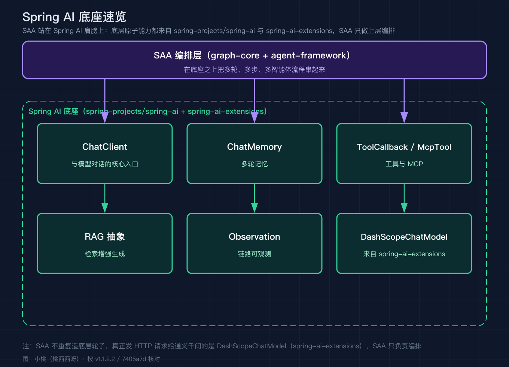
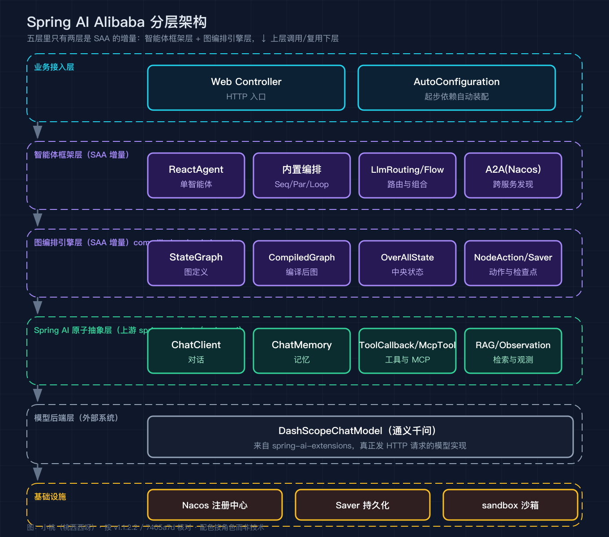
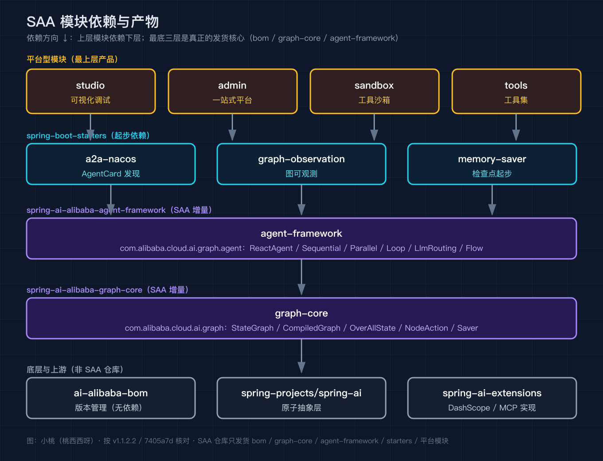
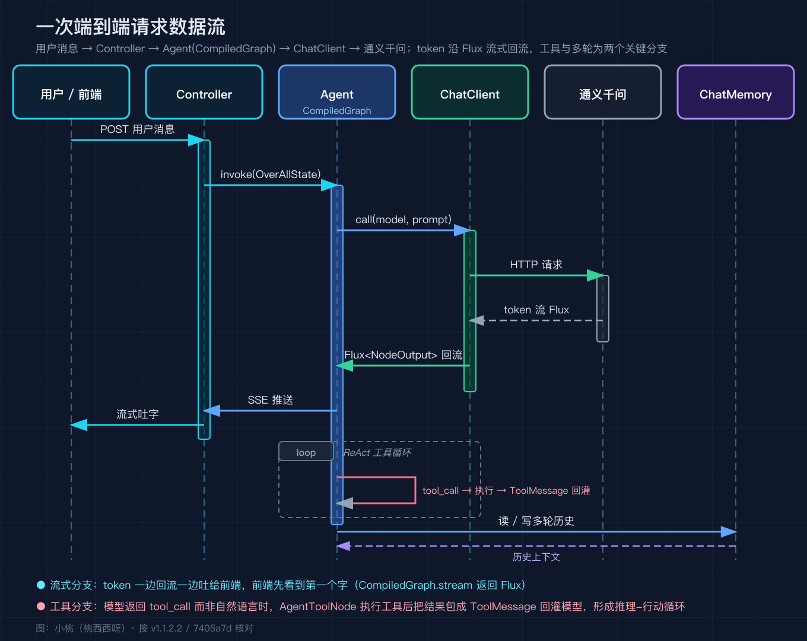
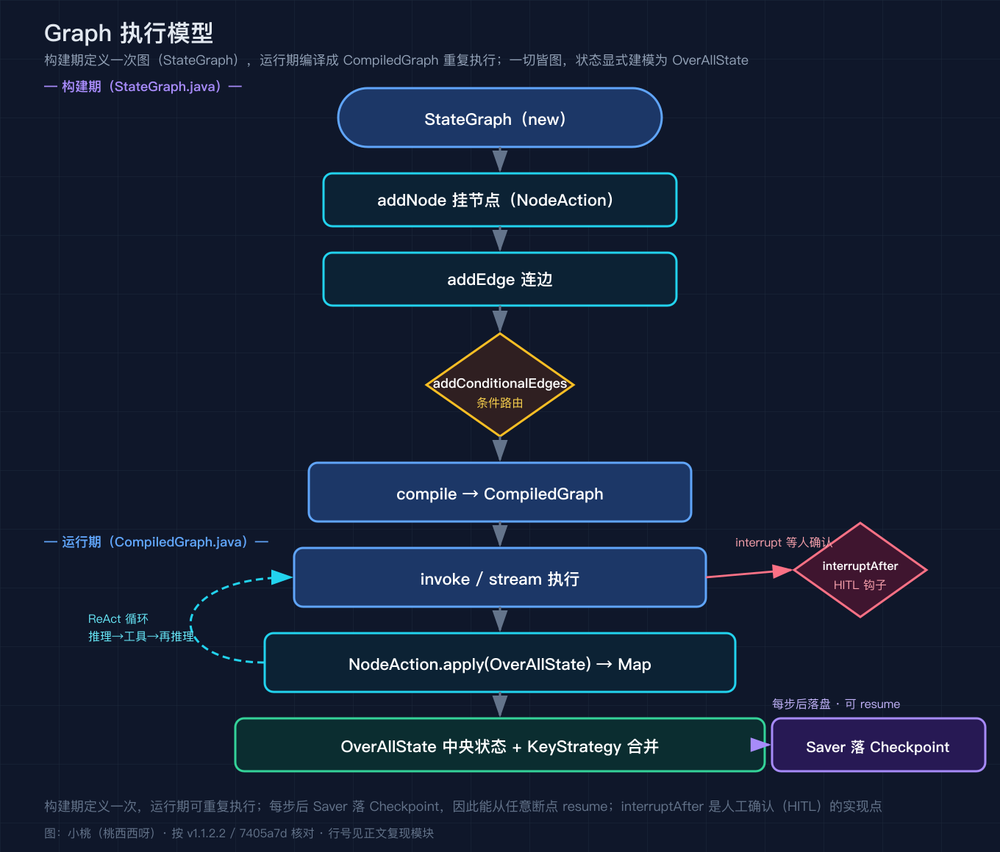

# Spring AI Alibaba 之一：整体概览与分层架构，看清它在 Spring AI 之上到底加了什么

我写这个系列，是因为 Spring AI Alibaba（简称 SAA）在中文社区里被讲得很多，但多数文章停在注解和示例层面，很少有人把它的核心增量从源码里拆出来看。SAA 是什么，一句话说清楚：它是基于 Spring AI 构建的 Java 智能体应用开发框架，真正区别于 Spring AI 原生的部分，是两层东西，一层叫 graph-core 的图编排引擎，另一层叫 agent-framework 的多智能体框架。底层和模型对话、记忆、工具这些原子能力，仍然来自 Spring AI 和 Spring AI Extensions。所以这一篇我先把全栈摊开，后面八篇再逐点深拆。本文所有源码事实都按 tag v1.1.2.2（提交 7405a7d）逐一核对，路径与行号都标在正文里，方便你直接跳转。

## 它站在谁的肩膀上：Spring AI 底座

SAA 不重复造底层轮子。和模型对话的 ChatClient、做记忆的 ChatMemory、调工具的 ToolCallback、接 MCP 的 McpTool、做检索增强的 RAG 抽象、以及可观测的 Observation，这些都在上游的 spring-projects/spring-ai 和它的扩展仓 spring-ai-extensions 里。SAA 在它们之上做编排。换句话说，你用 SAA 写智能体，最后真正发 HTTP 请求给通义千问的，还是 Spring AI 的 DashScopeChatModel（来自 spring-ai-extensions），SAA 只是把多轮、多步、多智能体的流程串起来。这张基石速览图我把上层和底座的边界画出来，后面不再单列一篇讲底座，只在此一笔带过。

我把这几个底座抽象逐一说清楚，因为它们是后面所有编排的原子，你不认识它们就谈不上看懂 SAA。ChatClient 是和模型对话的统一门面，你调一次它发一次请求，SAA 的智能体最后也通过它发请求给通义千问。ChatMemory 负责多轮上下文的存取，按会话键把历史消息存起来，关掉再开还能续上。ToolCallback 是把一个 Java 方法暴露成模型可调工具的契约，McpTool 是把它接到 MCP 协议上，让模型能调远端的标准 MCP 服务端。RAG 抽象把文档切块、向量化、检索、重排串成一条可注入上下文的链路。Observation 是 Micrometer 体系下的可观测埋点，每次模型调用和工具调用的耗时、token 量都被它记成指标。SAA 的编排层正是站在这些确定性的原子能力之上，才敢把流程从一步拉长到几十步。

## 分层架构：五层里只有两层是 SAA 的增量

我把 SAA 的全栈画成五层。从上到下依次是业务接入层、智能体框架层、图编排引擎层、Spring AI 原子抽象层、模型后端层，最底下还有一层基础设施。其中智能体框架层和图编排引擎层是 SAA 自己写的增量，原子抽象层是 Spring AI 的，模型后端和基础设施是外部系统。

这张图里我要强调一个判断。很多人把 SAA 当成一个聊天封装库来用，这是看小了它。SAA 最有价值的部分是 graph-core：它把一次智能体执行建模成一张有状态的图，节点是动作，边是路由，整张图的中间状态全部落进一个可序列化的 OverAllState 里，并且支持把状态快照存到数据库、支持在执行中途打断等人确认。这套机制让长流程、可恢复、可审计的智能体在 Spring 生态里第一次有了标准实现。后面我会用一整篇（之三）专门拆 graph-core。

为什么是这五层而不是更扁平的结构，我谈一下自己的判断。业务接入层用 Spring Boot 的自动配置把智能体装进你的应用，几乎零配置就能起一个能对话的端点。智能体框架层把最常见的编排套路预实现成类，省得你每次都从零画整张图。图编排引擎层是最硬核的一层，它只定义状态、节点、边、检查点这些原语，完全不关心你做的是客服还是代码助手。原子抽象层是上游 Spring AI 的，SAA 不碰它，只在上面复用。模型后端和基础设施是外部依赖，SAA 通过标准接口隔离，换模型或者换注册中心都不用改编排逻辑。这种分层让每一层都能独立演进，也是 SAA 能持续往上叠新能力而不崩盘的根本原因。

## 模块依赖与产物：真实模块和核心类

SAA 是一个多模块工程。我把主仓里真正发货的模块和它们的依赖顺序画出来。最底层是 spring-ai-alibaba-bom 做依赖版本管理，往上是 spring-ai-alibaba-graph-core，再往上是 spring-ai-alibaba-agent-framework，然后是 spring-boot-starters 下的一批起步依赖，最上面是 studio、admin、sandbox、tools 这几个平台型模块。

我在图上标了每个核心模块的关键类，方便你后面按图索骥。graph-core 的入口是 com.alibaba.cloud.ai.graph 包下的 StateGraph（StateGraph.java:43 是类声明，addNode 在 230、242、255 行，addEdge 在 362、382、392 行，addConditionalEdges 在 411、441、456 行，compile 在 517 和 531 行）。它编译出 CompiledGraph（CompiledGraph.java:58 是类声明，invoke 在 639、650、661 行，stream 在 567、578、607、616、627 行，返回的是 reactor 的 Flux<NodeOutput>，也就是说流式是第一等公民）。中央状态是 OverAllState（OverAllState.java:77 是 final class 且 implements Serializable，data 方法在 474 行，键策略合并 registerKeyAndStrategy 在 234 和 244 行）。检查点持久化是 Saver 一族：MemorySaver、VersionedMemorySaver、FileSystemSaver、RedisSaver、PostgresSaver、MysqlSaver、MongoSaver、OracleSaver，分布在 checkpoint/savers 各个子包下。图还能直接导出 PlantUML 和 Mermaid（PlantUMLGenerator.java:24、MermaidGenerator.java:31，都继承 DiagramGenerator）。

agent-framework 在 graph-core 之上，包名是 com.alibaba.cloud.ai.graph.agent。ReactAgent 直接 extends BaseAgent，并在 initGraph 里 new 出一个 StateGraph（ReactAgent.java:96 是类声明，:117 是构造，:304 是 initGraph，:328 是 new StateGraph，:287 是 getStateGraph），这从源码层面证实了我的判断：ReactAgent 不是另起炉灶，它就是一张编译好的 StateGraph。内置的多智能体编排类也都在 flow/agent 包下：SequentialAgent、ParallelAgent、LoopAgent、LlmRoutingAgent、FlowAgent。注意没有一个叫 SupervisorAgent 或 RoutingAgent 的类，社区里流传的清单在这里对不上，落稿以源码为准。

spring-boot-starters 这批起步依赖是把上面三块能力接进 Spring Boot 的胶水层，我列一下主仓里真实存在的几个。starter-a2a-nacos 把 A2A 能力和 Nacos 注册发现绑在一起，引这一个依赖就能用 AgentCard 去发现远端智能体。starter-graph-observation 把 graph-core 的执行埋点接到 Micrometer 和 Spring AI 的 Observation 体系，智能体每一步节点的耗时、token 消耗都能被 Prometheus 这类后端收走。starter-builtin-nodes 预置了一批常用节点实现，比如各类工具节点和模型节点，少写样板代码。starter-agentscope 接的是阿里内部的 agent scope 运行时，starter-config-nacos 负责把智能体的配置中心放到 Nacos。这些 starter 的存在说明 SAA 的打法很清楚：核心引擎保持纯粹，工程接入的脏活交给起步依赖去干。

## 一次端到端请求怎么走：数据流与流式

讲了静态结构，再看动态。我把一次请求从用户进来到回复出去的完整链路画成时序图。用户的消息先进 Controller，SAA 把它交给 Agent（本质是一张 CompiledGraph），Agent 通过 Spring AI 的 ChatClient 调 DashScopeChatModel，模型侧的 token 通过 reactor 的 Flux 一边回流一边吐给前端，回复前后 Advisor 负责日志和上下文装配，多轮历史写进 ChatMemory。

这张图里有两个分支值得你提前记住，因为它们是后面深拆的重点。第一个是工具分支：如果模型返回的是 tool_call 而不是自然语言，AgentToolNode 会执行对应的工具，把结果包成 ToolMessage 再喂回模型，形成推理、行动、再推理的循环。第二个是流式分支：CompiledGraph.stream 返回 Flux<NodeOutput>，节点产出按流式逐块往外推，所以哪怕是长链路，前端也能先看到第一个字。这两个分支是之四（ReAct 循环）和后续流式章节的铺垫。

我再补三个时序图里一眼看不全的细节。第一，请求进来后 Agent 不是直接调模型，前后会经过 Spring AI 的 Advisor 链，比如把系统提示词拼进去、把 ChatMemory 里的历史读出来、把模型返回的 token 落日志，这些都是通过 Advisor 在不动业务代码的前提下织入的。第二，多轮对话的上下文存在 ChatMemory，每次推理前读、推理后写，所以你关掉再开，智能体还认得上一轮你说了什么。第三，流式不是图自己发明的，它来自 reactor：CompiledGraph.stream 返回 Flux<NodeOutput>，每个 NodeOutput 都带着当前节点名、智能体名、这一步的 token 用量和最新的 OverAllState，前端订阅这个 Flux 就能逐块渲染，断在哪一块也看得清。

## Graph 执行模型：为后面深拆预热

我把 Graph 的运行时模型单独画一张图，因为它既是 SAA 的心脏，也是后面三篇（graph-core、ReactAgent、上下文工程）共同的主角。一个 StateGraph 由 addNode 挂节点、addEdge 连边、addConditionalEdges 加条件路由，compile 之后变成 CompiledGraph。每个节点是一个 NodeAction，它的契约极简，就是 apply(OverAllState state) 返回 Map<String, Object>（NodeAction.java:23 是接口，:25 是 apply 签名）。所有节点的读写都围绕同一个 OverAllState，键的合并方式由 KeyStrategy 决定，这就是为什么图可以并行分支又能在汇合点安全合并。状态在每步之后通过 Saver 落盘成 Checkpoint，所以图能从任意断点 resume。InterruptableAction 提供 interrupt 和 interruptAfter 两个钩子（InterruptableAction.java:67 是 interruptAfter 默认方法），这就是人工确认节点（human in the loop）的实现点。

节点的产出怎么写回状态，这里有个容易被忽略的关键点。OverAllState 里每个键都配一个 KeyStrategy，决定新值和旧值怎么合并。源码里给了三种：REPLACE 直接覆盖，APPEND 把新值追加到列表尾部，MERGE 做深度合并。正是这个机制，让并行分支各写各的键、汇合时不会互相踩，也让你能控制哪些状态是累加的、哪些是一次性的。检查点这一侧，Saver 一族的差异在工程落地：MemorySaver 最简单，状态放在 JVM 堆里，进程一重启就没了，适合本地调试；FileSystemSaver 落本地磁盘；RedisSaver 适合分布式部署，状态共享在 Redis；PostgresSaver、MysqlSaver、MongoSaver、OracleSaver 则是把 Checkpoint 存进各自的数据库，满足不同团队已有的存储选型。选哪个 Saver，本质是选状态的生命周期和一致性边界。

## 内置智能体与编排模式：真实清单

SAA 在 graph-core 之上，把常见编排模式预先实现成了类，你基本不用自己画整张图。我列一下源码里真实存在的：

- ReactAgent：推理加行动循环，最通用的单智能体形态，下一整篇（之四）拆它。
- SequentialAgent：串行串联多个子智能体，前一个的输出是后一个的输入。
- ParallelAgent：并行扇出多个子智能体，汇合后合并结果。
- LoopAgent：循环执行，直到某个终止条件满足。
- LlmRoutingAgent：由 LLM 决定把任务路由给哪个子智能体，对应社区常说的 Routing 模式。
- FlowAgent：把上述模式组合成更灵活的流程编排。

多智能体之间要协作，SAA 给了 A2A（Agent to Agent）能力。它在 spring-ai-alibaba-starter-a2a-nacos 这个起步依赖里，用 Nacos 做 AgentCard 的服务发现（NacosAgentCardProvider.java），远端智能体通过 A2aRemoteAgent 调用。也就是说，跨服务的智能体协作在 Spring 生态里是通过 AgentCard 加注册中心落地的，不是靠硬编码 URL。

这几个编排类各自适合什么场景，我顺手点一下。SequentialAgent 适合流水线型任务，比如先抽取、再总结、最后翻译，上一环的输出天然是下一环的输入。ParallelAgent 适合互相独立又能合并的，比如让三个子智能体分别从不同角度分析一份材料，最后汇成一份综合意见。LoopAgent 适合需要反复迭代的，比如写代码、跑测试、看报错、再改，循环到通过为止。LlmRoutingAgent 适合入口分发，用户一句话进来，由 LLM 判断该转给售后、技术还是销售哪个专门的子智能体。FlowAgent 则是把这些基本套路再组合，写更复杂的编排。它们底层都是 StateGraph，区别只在节点和边的接法，所以你读懂之三的图编排引擎，这五个类基本就是搭积木。

## 上下文工程与可观测：让智能体能落地生产

长链路智能体真正难的是上下文管理，不是能不能调通。SAA 把这部分做成了可插拔的拦截器和钩子。拦截器在 agent/interceptor 包下，源码里能看到的真实实现有 toolretry（工具失败重试）、toolselection（动态选工具）、contextediting（上下文编辑）、modelretry（模型调用重试）、modelfallback（模型降级）、todolist、toolemulator、toolerror。钩子在 agent/hook 包下，有 summarization（长上下文压缩）、modelcalllimit（限流）、returndirect、shelltool、hip、pii 等。这些就是之七（上下文工程与 HITL）要展开的内容。可观测和运维则由 studio（可视化调试）、admin（一站式平台，含评估与 MCP 管理）、sandbox（工具执行的隔离沙箱）承担。

我对这些拦截器和钩子补一句具体的，因为它们是长链路能不能上生产的分水岭。summarization 钩子在上下文超过阈值时把早期历史压缩成摘要，避免 token 越堆越贵、越堆越容易让模型失忆。modelcalllimit 是给模型调用设上限，防止某个失控循环把额度打爆。pii 钩子负责在输入输出里识别并脱敏个人信息，这类能力在涉及用户隐私的场景里是刚需。toolretry 和 modelretry 是失败自愈，工具或模型偶发报错时按策略重试，而不是把异常直接抛给用户。这些能力都以插件形态挂在编排框架上，你按需开启，不开就不计入链路，所以既能给生产级兜底又不污染简单场景。

## 进阶一句原理

如果你只带走一句话，我建议是：在 SAA 里一切皆图，一个智能体本质就是一张编译后的 StateGraph，它和一条普通的 LangChain 链最大的不同，是状态被显式建模成 OverAllState 并支持检查点与人机中断，这让长流程第一次有了可恢复和可审计的工程底座。

我用一个具体场景把这句话压实。假设你要做一个三十步的售后处理智能体，前二十步都是常规的分类、查单、调接口，到第廿一步要调用一个外部风控接口，而这个接口刚好超时抛错。普通链的做法是整条重试，前面二十步的模型调用和工具调用全部重跑一遍，token 和耗时翻倍，而且如果其中某些步骤是有副作用的（比如已经下发了退款指令），重跑还会带来二次副作用。SAA 的做法是，第廿一步之前的每一步结束都已经在 Saver 里落了 Checkpoint，失败时你只从 Checkpoint 恢复第廿一步，前面二十步的中间状态直接从 OverAllState 取，不用重算。再进一步，如果第廿五步是一个需要人拍板的高风险操作，InterruptableAction 会在那一步挂起，把当前状态冻结，等你（或你的值班同事）在 admin 界面点确认，再带着确认结果 resume。这两件事普通链很难干净地做，而在 SAA 里是图引擎的内置能力。所以这篇概览真正想让你记住的，不是有哪些类，而是状态被当成了第一等公民这件事，后面的之三到之八都是在展开它。

## 复现模块

- 主仓库：https://github.com/alibaba/spring-ai-alibaba
- 本文核对基准：tag v1.1.2.2，提交 7405a7d（注意该 tag 是注解标签，实际指向 7405a7d，clone 时会看到 detached HEAD 提示，属正常）
- 克隆命令：git clone --depth 1 --branch v1.1.2.2 --single-branch https://github.com/alibaba/spring-ai-alibaba.git
- 关键一手文件与行号（均在提交 7405a7d）：
  - graph-core：com/alibaba/cloud/ai/graph/StateGraph.java:43/230/242/255/362/382/392/411/441/456/517/531
  - graph-core：com/alibaba/cloud/ai/graph/OverAllState.java:77/234/244/474
  - graph-core：com/alibaba/cloud/ai/graph/CompiledGraph.java:58/72/567/578/607/616/627/639/650/661
  - graph-core：com/alibaba/cloud/ai/graph/action/NodeAction.java:23/25
  - graph-core：com/alibaba/cloud/ai/graph/action/InterruptableAction.java:67
  - graph-core：com/alibaba/cloud/ai/graph/diagram/PlantUMLGenerator.java:24、MermaidGenerator.java:31
  - agent-framework：com/alibaba/cloud/ai/graph/agent/ReactAgent.java:96/117/287/304/328
  - agent-framework：flow/agent 包下的 SequentialAgent.java / ParallelAgent.java / LoopAgent.java / LlmRoutingAgent.java / FlowAgent.java
  - A2A：spring-boot-starters/spring-ai-alibaba-starter-a2a-nacos 下的 NacosAgentCardProvider.java、A2aRemoteAgent.java

如果想直接跑起来看效果，主仓的 examples 模块下有一批可运行样例，路径在 examples/documentation/src/main/java/com/alibaba/cloud/ai/examples/documentation/framework 下，advanced 子目录里就有 a2a 这类进阶编排的完整演示。把仓库克隆下来后，按各样例的 README 起本地服务，就能在日志里看到 StateGraph 的节点执行顺序和每个 Checkpoint 的落盘。建议你在读后面几篇时，对照这些样例边读边断点，比单纯看文字快得多。

## 这个系列怎么排

之一整体概览（本篇）；之二 Spring AI 底座与原子抽象一笔带过；之三 graph-core 源码深拆；之四 ReactAgent 与 ReAct 循环；之五 内置编排模式 Sequential/Parallel/Loop/LlmRouting/Flow 与 A2A；之六 上下文工程与 HITL；之七 可观测性 studio/admin/sandbox；之八 沙箱与工具安全；之九 实战收尾。每篇都按同一基准（提交 7405a7d）核对，配图沿用深色技术图风格。

## 结尾钩子

你用过 SAA 或 Spring AI 写过智能体吗，最卡你的地方是编排链路太长不好调试，还是上下文一多就失控。留言告诉我你踩过的坑，下一篇我直接拿之三的 graph-core 来讲，为什么状态建模能把这些坑一次性填上。
