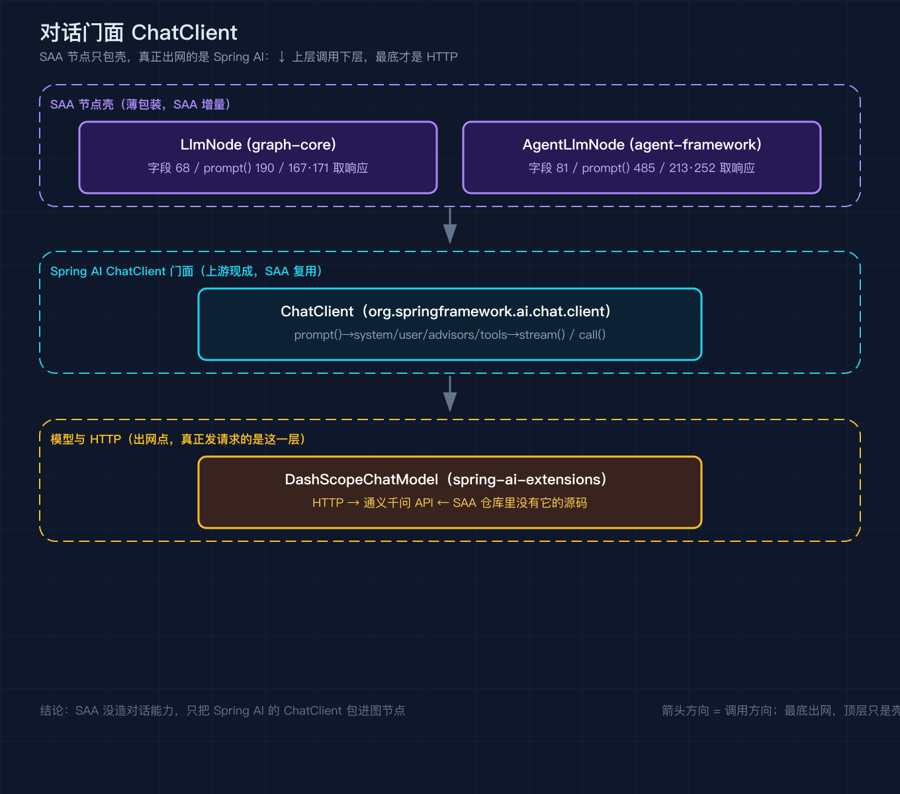
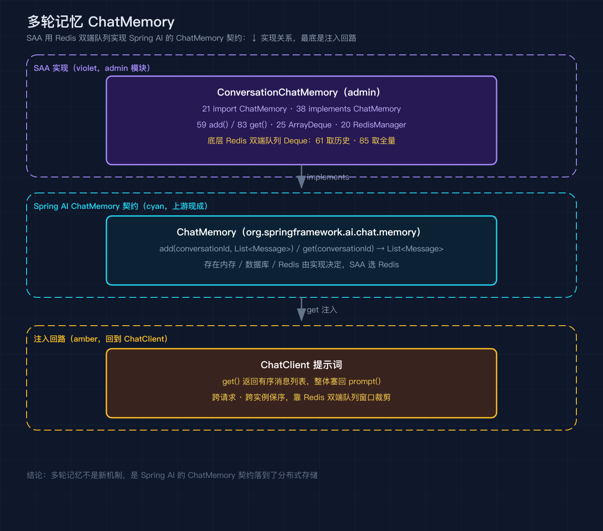
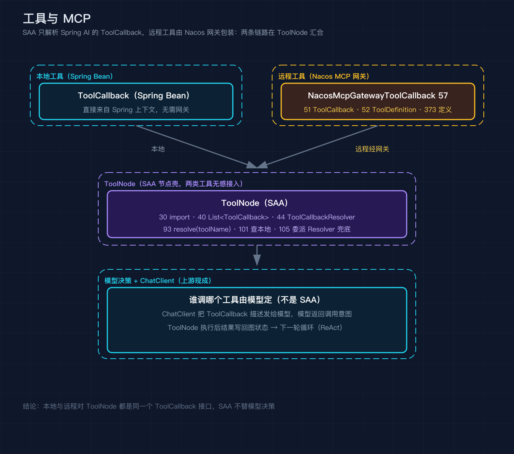
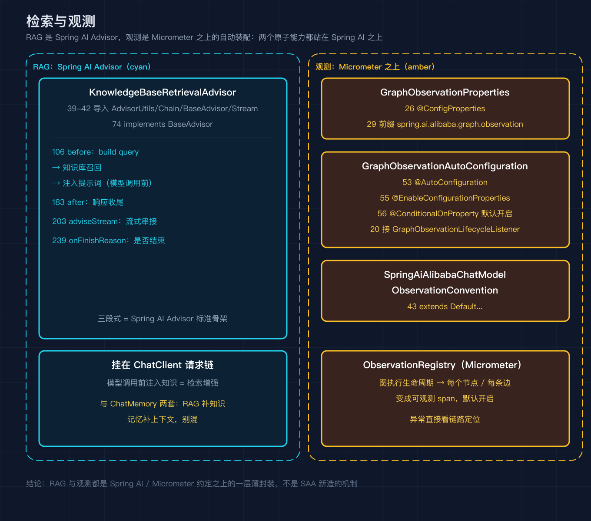

# Spring AI Alibaba 之二：Spring AI 底座与原子抽象一笔带过，看清 SAA 在之上加了什么编排

我第一次翻开 SAA 的 graph-core 源码，本以为要啃一堆新概念，结果 `LlmNode.java` 第一行的 import 就是 `org.springframework.ai.chat.client.ChatClient`。再往下翻，给智能体加记忆用的 `ConversationChatMemory` 实现的也是 `org.springframework.ai.chat.memory.ChatMemory`，连工具节点 `ToolNode` 解析的都是 `org.springframework.ai.tool.ToolCallback`。那一刻我彻底明白：SAA 几乎没有自己造轮子，它把对话、记忆、工具、检索、观测这五个最重的活，全部交给了 Spring AI，自己只做一件事，就是把这些原子能力用状态图编排起来。

后来我想给一个 SAA 智能体加个查订单的工具，按惯例去翻 SAA 的工具文档，结果翻到 `ToolNode` 一看，它要的不是 SAA 自己定义的某种工具格式，而是直接吃 Spring AI 的 `ToolCallback`。这下我更确定了：要在 SAA 里加工具，其实就是在 Spring AI 里加工具，SAA 只是把它接进图里。这篇我刻意不展开讲 Spring AI 本身怎么用，那够写好几篇。我只把 SAA 用到的五个原子抽象点一遍，每个都标好它在 SAA 源码里的真实落点，让你读 SAA 时第一眼就能分清：哪一层是上游 Spring AI 现成的，哪一层才是 SAA 自己的增量。很多人读不懂 SAA，往往不是因为它难，而是因为绕过了它脚下的 Spring AI。读完这篇你会有个判断：SAA 值不值得用，取决于你要不要那层编排，要的话它省你的事，不要的话它只是个更厚的壳。所以这篇的读法应该是：把它当一张地图，左边写 Spring AI，右边写 SAA，你只要看清楚箭头从哪指向哪。

## 版本基准先钉死

读 SAA 之前得先认领它的版本关系，这一步绕不开。SAA 主仓 `pom.xml:99` 写着 `<spring-ai.version>1.1.2</spring-ai.version>`，紧挨着 `pom.xml:100` 还有 `<spring-ai-alibaba-extensions.version>1.1.2.2</spring-ai-alibaba-extensions.version>`，`pom.xml:225` 到 `228` 通过 `spring-ai-bom` 把整个 Spring AI 依赖树锁死在这个版本上。也就是说，本篇核对所用的 SAA `v1.1.2.2` 实际提交 `7405a7d`，底层绑定的就是 Spring AI `1.1.2`，而通义千问等模型适配则在 `spring-ai-alibaba-extensions` 那个 `1.1.2.2` 里。

这个版本号之所以重要，是因为 Spring AI 自己迭代很快，接口经常变。`ChatClient`、`ChatMemory`、`ToolCallback` 这些抽象在不同小版本里方法签名可能微调，如果你拿着 Spring AI 1.0 的文档去读 SAA 1.1.2.2 的源码，就会对不上号。所谓 BOM，就是一张依赖版本清单，谁引入它谁就统一用同一套版本，避免同一个 `org.springframework.ai` 下的包出现两个版本互相打架。同样道理，`spring-ai-alibaba-extensions` 那个 `1.1.2.2` 也不是 SAA 的版本，而是阿里对 Spring AI 的扩展（比如各家大模型适配）的版本，它和 SAA 自己的 `v1.1.2.2` 同名只是巧合，别当成一回事。顺带一提，如果你本地想确认某个 `ChatClient` 到底长什么样，不用翻 SAA，直接去 Maven 仓库里 `org/springframework/ai/spring-ai-client/1.1.2` 下找 `ChatClient.java` 就行。SAA 仓库里搜不到它的定义，因为它根本不在 SAA 里，这正是这篇要传达的核心：SAA 调用的都是别人定义好的契约。

## 对话门面 ChatClient

SAA 里真正发 HTTP 请求给通义千问的，是 Spring AI 的 `DashScopeChatModel`（来自 spring-ai-extensions 扩展包），SAA 自己不碰网络层，它只包了一层节点。如果你好奇通义千问适配到底藏在哪，可以在 `spring-ai-alibaba-extensions` 里 `grep -rn "implements ChatModel"` 找到 `DashScopeChatModel`，它就是真正发 HTTP 的那个类，SAA 仓库里同样没有它的源码，又一次印证了这篇的主线：SAA 调用的是别人实现的契约。看 `spring-ai-alibaba-starter-builtin-nodes` 里的 `LlmNode.java`：`28` 行 import 了 `ChatClient`，`68` 行把 `ChatClient` 作为字段持有，`190` 行调用 `chatClient.prompt()` 构造请求，`167` 行走 `stream().chatResponse()`、`171` 行走 `call().chatResponse()` 拿响应。换句话说，SAA 的 LLM 节点就是个薄壳，真正跟模型对话的流畅 API 全是 Spring AI 的 `ChatClient` 门面。

`LlmNode` 的构造器在 `76` 和 `83` 两行，两个构造器的差别只在是否把 `List<Advisor>` 和 `List<ToolCallback>` 一并收进来，一个带工具与顾问、一个从别处注入，无论哪种，最终都是把 `ChatClient` 包好、再用 `stream` 布尔决定走流式还是一次性，`166` 行是 `stream(state)` 方法本身，它内部就是 `167` 行那条 `stream().chatResponse()`，`171` 行的 `call().chatResponse()` 则是一次性取结果的另一条路径。在 `spring-ai-alibaba-agent-framework` 模块里，`AgentLlmNode.java:29` 同样 import 了 `ChatClient`，`30` 行还 import 了 `DefaultChatClient` 作兜底，`81` 行持有它，`109` 行构造器从 `builder.chatClient` 取值，`473` 行是 `buildChatClientRequestSpec(ModelRequest, RunnableConfig)`，签名里多了一个运行时配置，说明它把图的模型请求和本次运行的 `RunnableConfig` 一起喂给 `ChatClient`，`485` 行用 `chatClient.prompt()` 构造请求，`213` 行 `stream().chatResponse()`、`252` 行 `call().chatResponse()`。两套 LLM 节点走的都是同一条路：上接图编排传进来的状态与提示词，下接 Spring AI 的 `ChatClient`，再往下才是具体的 `ChatModel`。

这里值得点一句 `ChatClient` 本身的设计。`prompt()` 返回的是一个请求构造器，你可以链式挂上 `system(...)`、`user(...)`、`advisors(...)`、`tools(...)`，最后用 `call()` 拿一次性响应或者用 `stream()` 拿流式响应。SAA 的 `buildChatClientRequestSpec` 干的事，就是从图的全局状态里取出提示词和工具，填进这个构造器。SAA 之所以敢把这一层做得这么薄，是因为 `ChatClient` 已经把这些编排细节包圆了，它没必要重造。`stream` 和 `call` 也不是二选一的功能开关，而是两种取结果的方式：流式适合智能体在终端或网页上逐字吐字，体验更顺；一次性 `call` 适合批量或评测。两套节点把这两种方式留成了同一个布尔开关，但真正的网络请求始终在 Spring AI 那一层发出。这张图把这条链路画清楚：SAA 节点在最上，Spring AI 的门面在中间，模型与 HTTP 在最下。



## 多轮记忆 ChatMemory

智能体要记住上一轮说了什么，靠的是 Spring AI 的 `ChatMemory` 接口。SAA 没有另起炉灶，而是给了一个 Redis 背书的实现。`spring-ai-alibaba-admin` 下的 `ConversationChatMemory.java:21` import 了 `ChatMemory`，`38` 行 `implements ChatMemory`，`59` 行实现 `add(...)` 写消息，`83` 行实现 `get(...)` 读消息。它底层用的是 `ArrayDeque`（`25` 行）也就是 `Deque`（`26` 行），实际落库到 Redis：消息先以双端队列的形式存进 `RedisManager`，`61` 行取历史、`85` 行取全量。

具体看 `add` 这个方法，`59` 行进来后第一件事是 `61` 行从 Redis 里把已存在的 `Deque<Message>` 取出来，如果取不到就在 `64` 行 `new ArrayDeque<>()` 新建一个，再把本次的 `messages` 追加进去，最后整体写回 Redis。`get` 则在 `83` 行从 Redis 取回整条 `Deque`，`85` 行拿到的是全部历史。这里值得多想一层。Spring AI 的 `ChatMemory` 契约本来就只定义了 `add` 和 `get` 两个方法，按会话 ID 存取消息列表，至于消息存在内存、数据库还是 Redis，完全由实现决定。SAA 选 Redis 是顺理成章的：智能体一旦要横向扩展、多实例部署，内存版的记忆就失效了，而 Redis 双端队列既能保序，又能方便地做窗口裁剪，把最老的对话挤出去。你不会希望一个跑在十台机器上的智能体，用户这次问 A 机器、下次问 B 机器就忘了之前说过什么。消息进了 `Deque` 之后，顺序就是对话顺序：用户消息、助手消息、工具消息交替排列，`get` 返回的就是这个有序列表，SAA 再把它整体塞回 `ChatClient` 的提示词里。之所以用双端队列而不是普通列表，是因为窗口裁剪从队首弹 oldest 是常数时间，对话越长越能看出差别。所以你看到 SAA 能跨请求、跨实例保持上下文，本质是 Spring AI 的 `ChatMemory` 契约加上 SAA 的 Redis 实现，不是什么新机制，只是把一个标准接口落到了分布式存储上。



## 工具与 MCP

让智能体调用外部工具，Spring AI 的抽象是 `ToolCallback`。SAA 的 `ToolNode.java` 直接消费它：`30` 行 import `ToolCallback`、`31` 行 import `ToolCallbackResolver`，`40` 行把 `List<ToolCallback>` 作为字段，`44` 行持有 `ToolCallbackResolver`，`46` 和 `50` 是两个构造器，`55` 和 `59` 是 setter，`93` 行在真正执行工具时调用 `resolve(toolName)`，`101` 和 `105` 行的 `resolve` 方法先查本地 `ToolCallback` 列表，查不到再委派给 `ToolCallbackResolver`。这套解析逻辑跟 Spring AI 自带的 `ToolCallingManager` 几乎是一个思路，SAA 只是把它接进了图节点，让工具调用成为图里的一个普通步骤。值得看清的是 `93` 行那个 `resolve` 的调用时机：它只在模型已经返回了工具调用意图之后才发生，也就是模型说我要调 `getOrder`，`ToolNode` 才按这个名字去 `101` 行的本地列表里找，找不到就走 `105` 行交给 `ToolCallbackResolver` 去更上层的上下文里找，比如从 Spring 容器按 bean 名解析。工具真正执行完，`ToolNode` 会把返回值写回图的全局状态，下一轮循环时模型就能看到这次调用的结果，这正是后面之四要讲的 ReAct 循环里思考步与工具步交替的底：一次图循环，先让模型想，再让 `ToolNode` 执行，再把结果塞回，模型接着想，直到不再调用工具为止。SAA 在这里没有发明任何新协议，它只是把 Spring AI 的工具执行接成了图里的普通一步。

当工具来自远程 MCP 服务时，SAA 用 `NacosMcpGatewayToolCallback` 把远端工具包装成 Spring AI 的 `ToolCallback`。`spring-ai-alibaba-starter-config-nacos` 下的这个类：`51` 行 import `ToolCallback`、`52` 行 import `ToolDefinition`，`57` 行 `implements ToolCallback`，`373` 行实现 `getToolDefinition()` 暴露工具元信息。它内部通过 Nacos MCP 网关把调用转发出去，但对上层来说，它和一个本地 `ToolCallback` 没有区别。这一点很关键：SAA 让工具既能来自本地 Spring Bean，也能来自远端 MCP 网关，而节点侧完全无感，因为不管本地还是远程，进来的都是同一个 `ToolCallback` 接口。模型怎么知道该调哪个工具？不是 SAA 决定的，而是 Spring AI 在把 `ToolCallback` 列表交给 `ChatClient` 时，把这些工具的描述一起发给模型，由模型自己判断是否调用、调用哪个、传什么参数。`ToolNode` 只是在模型返回了调用意图之后，负责按名字找到对应的 `ToolCallback` 并执行。SAA 不替模型做决策，它只是执行者。为什么要把工具放到远程网关？因为智能体的价值常常在工具，而工具团队和智能体团队可能不是一拨人。通过 Nacos MCP 网关，工具可以独立注册、独立扩缩容、独立灰度，智能体这边只管按名字解析调用，不用把工具代码打进自己的包里。SAA 在这里做的只是把远程工具翻译成 Spring AI 认得的形式，真正的远程协议细节由网关封装。这也是 MCP 在这套架构里真正的意义：工具不再是智能体代码的一部分，而是一组可被独立治理的网络服务，SAA 通过 `ToolCallback` 这一个统一接口把它们都接进图，本地和远程对节点来说没有分别。这张图把本地与远程两条工具链路并排画出来。



## 检索与观测

RAG 在 SAA 里也不是新东西，它就是 Spring AI 的 Advisor 机制。`spring-ai-alibaba-admin` 下的 `KnowledgeBaseRetrievalAdvisor.java`：`39` 到 `42` 行分别 import 了 `AdvisorUtils`、`AdvisorChain`、`BaseAdvisor`、`StreamAdvisorChain`，`74` 行 `implements BaseAdvisor`，`106` 行实现 `before(...)` 注入检索到的知识，`183` 行实现 `after(...)` 收尾，`203` 行 `adviseStream(...)` 串起流式链路，`239` 行用 `AdvisorUtils.onFinishReason()` 判断模型是否要结束。`before` 方法第一步就是拼检索语句（`106` 行的注释直接写着 build query），然后去知识库召回相关片段，再把这些片段塞进 `ChatClientRequest` 的提示词里，这正好发生在真正调用模型之前。`adviseStream`（`203` 行）是流式版本，它把同样的检索增强在模型一边吐字一边串进去；`after`（`183` 行）则在响应收尾后做清理或后处理；`239` 行用 `AdvisorUtils.onFinishReason()` 判断模型是否发出了结束信号，决定链路是继续还是收口。三段式（before 注入、after 收尾、adviseStream 串流）是 Spring AI Advisor 的标准骨架，SAA 没有改它，只是把知识库召回这段逻辑填进了 before。注意它和 `ChatMemory` 是两套东西：记忆管的是多轮对话历史，RAG 管的是外部知识注入，一个补上下文，一个补知识，别混了。

观测这一侧，SAA 在 `spring-ai-alibaba-starter-graph-observation` 里给了自动装配。`GraphObservationProperties.java:26` 用 `@ConfigurationProperties(prefix = ...)` 绑定配置，`27` 行定义类，`29` 行把前缀定为 `spring.ai.alibaba.graph.observation`。`GraphObservationAutoConfiguration.java:53` 标 `@AutoConfiguration`，`54` 行 `@ConditionalOnClass` 要求类路径上有 `StateGraph` 和 `ObservationRegistry` 才生效，`55` 行 `@EnableConfigurationProperties` 启用上面的配置类，`56` 行 `@ConditionalOnProperty` 控制开关，默认开启，它还会把 `GraphObservationLifecycleListener`（`20` 行 import 进来的那个类）等处理器接进 `ObservationRegistry`。`SpringAiAlibabaChatModelObservationConvention.java:43` 继承 `DefaultChatModelObservationConvention`，给模型调用加上 SAA 自己的观测语义。可观测性同样是站在 Micrometer Observation 和 Spring AI 的约定之上，SAA 只是补了一层针对图执行的指标与链路，让你能看清一次智能体运行里每个节点花了多久、走了哪条边。观测默认开启而不是默认关闭，是个很务实的选择：智能体跑起来之后，你最怕的就是它卡在某一步你却看不见，把 graph 的生命周期、每个节点、每条边都变成可观测的 span，一旦某次运行异常，你直接看链路就能定位是 LLM 慢了、工具报错了还是分支走错了，不用加一堆日志。



## SAA 在之上加了什么编排

把五个原子抽象摆在一起看，结论很清楚：对话、记忆、工具、检索、观测全部来自 Spring AI，SAA 没有替换其中任何一个。它真正新增的是两层：底层的 graph-core 用状态图把节点（LLM、工具、条件分支）串成可回放、可持久化的工作流；上层的 agent-framework 在图之上做 ReactAgent 单智能体和多智能体编排。换句话说，SAA 扮演的是编排者的角色，原子能力是借来的，编排逻辑才是它自己的。

具体落到代码，这五个原子被编排的位置分别是：LLM 节点（`graph-core` 的 `LlmNode` 与 `agent-framework` 的 `AgentLlmNode`）调用 `ChatClient`；记忆由 admin 的 `ConversationChatMemory` 在会话开始时注入、结束时回写；工具由 `ToolNode` 与 Nacos 网关回调统一接入；RAG 作为 Advisor 挂在 `ChatClient` 请求链上；观测由 graph-observation starter 在应用启动时就位。SAA 把它们缝成一张图，缝法才是它的本事。这里多说一句为什么是图而不是一串 if else：graph-core 把每一步的输入输出都记成了图的全局状态，出错时能从某一步重放，也能把整张图的状态落库后在另一个进程里断点恢复，这恰恰是单纯手写 `ChatClient` 调用链做不到的。把原子能力借来不难，难的是让它们在一张可持久化、可观测的图里有序流转，这才是 SAA 真正的增量所在。所以读到这篇结尾，我希望你记住的不是五个类的名字，而是这条界线：下面的能力全是 Spring AI 现成的，上面那层编排才是 SAA 自己长出来的东西。这种薄包装的好处是学习成本低，你本来就懂 Spring AI，就能直接读懂 SAA 大半；代价是 SAA 的价值不那么显眼，得钻进 graph-core 才能看清它到底编排了什么。我自己的判断是，如果你只是想用 Spring AI 跑一个简单智能体，直接调 `ChatClient` 加几个 `ToolCallback` 就够了；但当你需要把多个步骤串成有状态、可中断、可恢复的复杂流程，SAA 那两层编排才开始值钱。下一篇我就钻进 graph-core，看这个状态图引擎到底是怎么把上面这些原子节点连起来并跑起来的。

## 复现模块

代码地址：https://github.com/alibaba/spring-ai-alibaba （tag v1.1.2.2，提交 7405a7d）
数据源地址：同一个仓库的源码即数据源，无需额外数据集

运行命令（在能访问 GitHub 的环境执行）：

```
git clone https://github.com/alibaba/spring-ai-alibaba.git
cd spring-ai-alibaba
git checkout 7405a7d
grep -n "spring-ai.version" pom.xml
```

精确预期输出（逐行核对，注意行首 99 与版本号）：

```
99:        <spring-ai.version>1.1.2</spring-ai.version>
```

要核对五个原子抽象的落点，把上面的 `grep` 换成对应文件路径与关键字即可，本篇所有行号均来自该提交的真实源码，已逐一 `grep` 复核。例如核对 `ChatClient` 门面可用 `grep -n "ChatClient" spring-boot-starters/spring-ai-alibaba-starter-builtin-nodes/src/main/java/com/alibaba/cloud/ai/graph/node/LlmNode.java`。

## 这个系列怎么排

之一 整体概览与分层架构（已发）
之二 Spring AI 底座与原子抽象一笔带过（本篇）
之三 graph-core 状态图引擎深拆
之四 ReactAgent 与 ReAct 循环
之五 内置编排与 A2A 多智能体
之六 上下文工程与人在回路
之七 可观测：studio、admin、sandbox
之八 沙箱与工具安全
之九 实战收尾

## 结尾钩子

我当初以为 SAA 是一套全新的智能体框架，结果拆完发现它的五个核心能力全是 Spring AI 现成的，真正值钱的是那两层编排。你读到这儿，不妨回去看一眼你项目里用的 `ChatClient` 和 `ChatMemory`，它们是哪个版本的 Spring AI 绑定的？如果你也在做智能体，你是直接调 Spring AI，还是像 SAA 这样在外面套一层图编排？评论区聊聊你的做法，下一篇之三我们直接钻进 graph-core 看状态图怎么跑。
