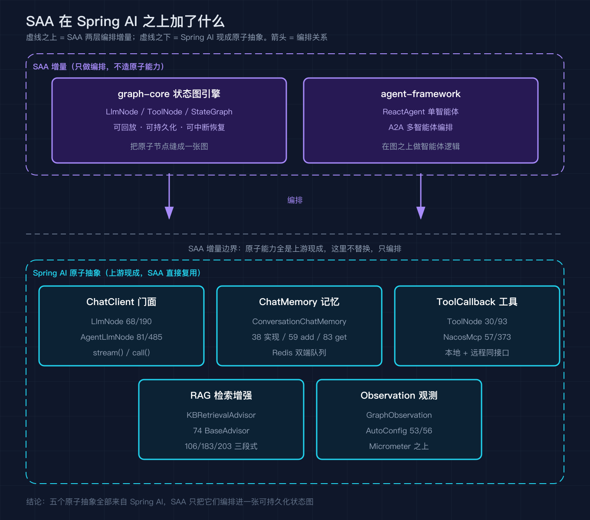

# Spring AI Alibaba 之二：Spring AI 底座与原子抽象一笔带过，看清 SAA 在之上加了什么编排

我翻开 SAA 源码的第一反应是：五个最重的能力，import 的全是 `org.springframework.ai`。这篇不展开讲 Spring AI 怎么用，那够写好几篇；我只把 SAA 用到的五个原子抽象点一遍，每个标好源码落点，让你一眼分清：哪些是 Spring AI 现成的，哪层才是 SAA 自己加的编排。很多人读不懂 SAA，往往不是因为它难，而是绕过了它脚下的 Spring AI。所以这篇的读法，是把它当一张地图：左边写 Spring AI，右边写 SAA，只看箭头从哪指向哪。

## 版本基准

读源码先钉版本：SAA `v1.1.2.2`（提交 `7405a7d`）在 `pom.xml:99` 锁定 `spring-ai.version=1.1.2`，`:100` 锁定扩展包同号，`spring-ai-bom` 在 `:225` 把整棵 Spring AI 依赖树锁死。本篇所有行号都出自这个提交；模型适配（如发 HTTP 的 `DashScopeChatModel`）则活在 `spring-ai-alibaba-extensions` 里，SAA 仓库本身搜不到它的定义。顺带提醒：Spring AI 迭代快、接口常变，拿着 1.0 的文档读 1.1.2.2 的源码会对不上号，行号以本篇锁定的提交为准。

## 总览：谁是现成的，谁是 SAA 加的



先看这张地图。SAA 在 Spring AI 之上只加了 graph-core 与 agent-framework 两层编排，五个原子抽象全是上游现成的。后面每个小节拆一个原子，最后回看这张图收束。虚线就是 SAA 的边界：跨过它往下的能力，SAA 一律复用，不重造。

## 对话门面 ChatClient

`LlmNode`（`graph-core`）与 `AgentLlmNode`（`agent-framework`）只持有 `ChatClient` 字段并封装请求（`:68`/`:81`），真正出网的是 Spring AI 的 `ChatClient` 门面，最底是 `DashScopeChatModel` 发 HTTP。SAA 把 `prompt()→advisors/tools→stream()/call()` 这套流畅 API 原样包进节点，自己不碰网络层。值得点一句：`ChatClient` 把 system/user/advisors/tools 的组装都收在门面里，SAA 只需从图状态取提示词和工具填进去，所以这一层敢做得极薄。`stream` 与 `call` 不是功能开关，而是两种取结果方式：流式适合逐字吐字，一次性 `call` 适合批量或评测。


## 多轮记忆 ChatMemory

跨轮记忆靠 Spring AI 的 `ChatMemory` 契约（只有 `add`/`get` 两个方法），SAA 用 `ConversationChatMemory`（`admin` 模块，`:38` 实现、`:59` 写 / `:83` 读）把它落到 Redis 双端队列。SAA 选 Redis 而非内存，是因为智能体一旦横向扩缩，内存记忆在多实例间就会失联；双端队列既保序又便于窗口裁剪。模型与记忆是两套：`get` 回来的是有序消息列表，SAA 整体塞回提示词。双端队列里用户、助手、工具消息按对话顺序交替排列，`get` 返回的正是这个有序列表。


## 工具与 MCP

工具侧，SAA 直接消费 Spring AI 的 `ToolCallback`：`ToolNode` 在模型返回调用意图后才按名 `resolve`（`ToolNode.java:93`/`:101`），本地查不到再委派 `ToolCallbackResolver`。远程工具由 `NacosMcpGatewayToolCallback`（`:57`/`:373`）翻成同一个 `ToolCallback`，本地与远程对节点透明，这正是后面之四 ReAct 循环里「想一步、做一步」的底：结果写回全局状态，下一轮模型就能看到。SAA 不替模型决策，它只是执行者；MCP 网关的意义是让工具成为可独立治理的网络服务。模型怎么知道调哪个工具？不是 SAA 决定，是 Spring AI 把 `ToolCallback` 的描述随请求发给模型，由模型自选并填参。


## 检索与观测

RAG 也是 Spring AI 的 `BaseAdvisor`：`KnowledgeBaseRetrievalAdvisor`（`:74`）用 `before` 注入、`adviseStream` 串流、`after` 收尾（`:106`/`:203`/`:183`），三段式是 Advisor 标准骨架。观测则在 Micrometer 之上自动装配（`GraphObservationAutoConfiguration:53` 默认开启），把图执行的每个节点、每条边变成可定位的 span。注意 RAG 补知识、记忆补上下文，两套别混。观测默认开启而非关闭是务实选择：智能体最怕卡在某一步却看不见，把图生命周期变成 span，异常直接看链路定位。RAG 在模型调用前注入知识，记忆在每轮开头回写历史，二者都挂在 `ChatClient` 请求链上但职责不同。


## 收束：界线在哪

把五张图并起来看，界线很清楚：对话、记忆、工具、检索、观测全来自 Spring AI，SAA 一个没替换；它真正长出来的是 graph-core 把节点串成可持久化状态图、agent-framework 在其上做单智能体与多智能体编排。所以 SAA 的价值不在原子能力，而在那层编排，这层薄，恰恰是它学习成本低的原因：你懂 Spring AI，就能读懂 SAA 大半。反过来，如果你只是跑个简单智能体，直接调 `ChatClient` 加几个 `ToolCallback` 就够了；只有当流程变成有状态、可中断、可恢复，那两层编排才开始值钱。

## 复现模块

代码地址：https://github.com/alibaba/spring-ai-alibaba （tag v1.1.2.2，提交 7405a7d）
数据源地址：同一个仓库的源码即数据源，无需额外数据集

运行命令（在能访问 GitHub 的环境执行）：

```
git clone https://github.com/alibaba/spring-ai-alibaba.git
cd spring-ai-alibaba
git checkout 7405a7d
grep -n "spring-ai.version" pom.xml
```

精确预期输出（逐行核对，注意行首 99 与版本号）：

```
99:        <spring-ai.version>1.1.2</spring-ai.version>
```

本篇所有行号均来自该提交的真实源码，已逐一 `grep` 复核。要核对某个原子抽象的落点，把上面 `grep` 换成对应文件路径与关键字即可。

## 这个系列怎么排

之一 整体概览与分层架构（已发）
之二 Spring AI 底座与原子抽象一笔带过（本篇）
之三 graph-core 状态图引擎深拆
之四 ReactAgent 与 ReAct 循环
之五 内置编排与 A2A 多智能体
之六 上下文工程与人在回路
之七 可观测：studio、admin、sandbox
之八 沙箱与工具安全
之九 实战收尾

## 结尾钩子

你项目里用的 `ChatClient`、`ChatMemory` 是哪个 Spring AI 版本绑定的？是直接调 Spring AI，还是像 SAA 这样在外面套一层图编排？评论区聊聊你的做法，下一篇之三我们直接钻进 graph-core 看状态图怎么把上面的原子节点跑起来。
