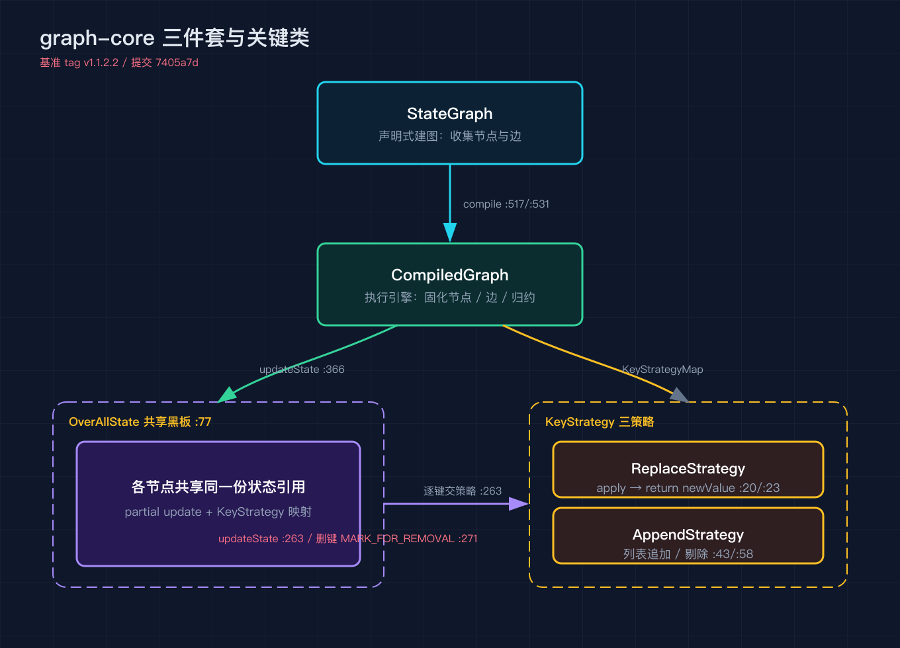
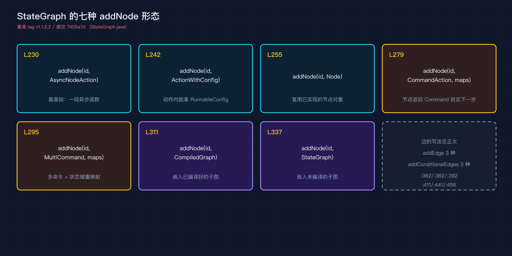
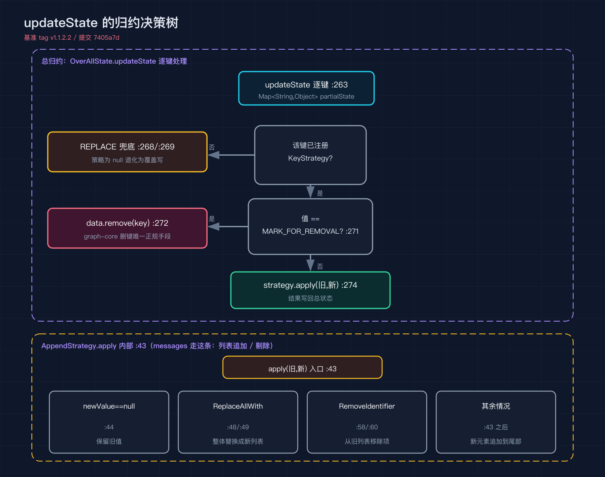
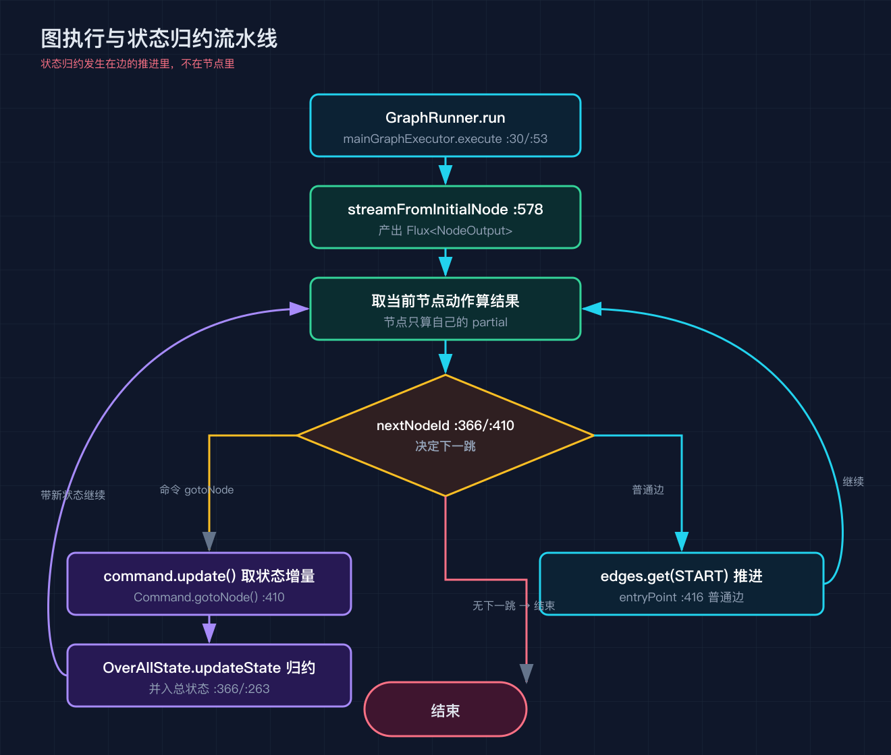

# Spring AI Alibaba 之三：graph-core 状态图引擎深拆

基准是 tag v1.1.2.2，提交 7405a7d。这一篇里我提到的每一个文件、每一个行号，都是我在这个提交上用 grep 对着源码核过的，没核实过的我不写。

graph-core 是 SAA 真正落地的第一个增量层。它干的事很单纯，把智能体的流程建模成一张有向图：节点是动作，边是路由，整张图共享一块叫 OverAllState 的状态黑板。之上的 agent-framework 里那个 ReactAgent，不过是这张图的一种固定拼法。所以我想先把引擎本身拆清楚，之四再看 ReactAgent 怎么用这些零件把 ReAct 拼出来。

## 一、三件套各自是什么

StateGraph（StateGraph.java:43）是建图阶段的入口。它不执行，只负责声明：你调它的方法往里塞节点和边，它帮你收集起来。等一切就绪，调 compile 把它固化成一张能跑的图。

OverAllState（OverAllState.java:77）是整张图的共享黑板。图跑起来的时候，每个节点拿到的都是这块状态的一份引用，它自己只往里写一份 partial update，至于这份增量怎么并回总状态，由 KeyStrategy 决定。默认的输入键 input 用 ReplaceStrategy（OverAllState.java:145、:155、:167、:180 四处构造都先注册了它）。

CompiledGraph（CompiledGraph.java:58）是真正跑起来的执行引擎。compile 之后，节点动作、边路由、状态归约策略都被钉死，不能再改。它内部用 Node.ActionFactory 存工厂函数而不是实例，这一点是为了线程安全（CompiledGraph.java:88 那句注释写得很直白）。

把三件事拆开之后你会发现，graph-core 其实是个通用的图编排内核，跟「智能体」没绑定。它不知道什么叫大模型、什么叫工具，它只知道节点、边、共享状态。ReactAgent 之所以能站在它肩上，是因为有人替它把模型节点和工具节点定义好了，再用这张图的规则拼起来。

## 二、建图 API 到底给了多少种写法

StateGraph 的 addNode 一共七种形态，我列在下图里对照着看会更清楚：

七种 addNode（StateGraph.java:230、:242、:255、:279、:295、:311、:337）分别对应不同的动作表达方式。最常见的两种，一种是直接给一个 AsyncNodeAction（:230），节点就是一段异步函数；另一种是给一个已经实现的 Node 对象（:255），把动作封装好再塞进来。

还有带 RunnableConfig 的版本（:242），节点执行时你能拿到运行配置。再往后三种是命令式动作：AsyncCommandAction（:279）和 AsyncMultiCommandAction（:295）允许节点返回一个 Command，也就是节点自己决定下一步去哪、以及要带什么状态增量；多命令那个配合 mappings 参数，可以把状态里的键重映射到子图。最后两种（:311、:337）是子图，你可以把一张已经编译好的 CompiledGraph，或者一张还没编译的 StateGraph，直接当一个节点嵌进去。

边的写法也有三套。addEdge 有普通点对点（:362）、多源汇一（:382）、一分多（:392）三种。条件边 addConditionalEdges 同样是三种入口（:411、:441、:456）：给一个 AsyncCommandAction 条件、一个 AsyncEdgeAction 条件、或者带配置的 AsyncEdgeActionWithConfig。它们的共同点是都要传一个 Map，把条件的输出值映射到具体的目标节点名。

建完图调 compile。不带参数的版本（StateGraph.java:531）会先建一个 MemorySaver 当默认存档器，再走带配置的那条（:517）。带配置的 compile 会先 validateGraph 做结构校验，然后 new 一个 CompiledGraph（:517 返回处）。

这里有个容易看漏的点：迭代上限。CompiledGraph 字段上写着 maxIterations 默认 25（CompiledGraph.java:89），但构造时立刻被覆盖成 compileConfig.recursionLimit()（:99），而 CompileConfig 的 recursionLimit 默认是 100（CompileConfig.java:57、:63）。所以你用默认配置编译出来的图，实际循环上限是 100，不是 25。25 只是字段初始值，编译这一步把它顶掉了。

图建好之后，StateGraph 还留了一个 getGraph 方法（:545、:558、:570）能导出 GraphRepresentation，可以拿去做可视化。ReactAgent 后面在 debug 时也会用到这条能力，把拼出来的图dump 成 Mermaid 看。

## 三、状态怎么并回总状态：KeyStrategy 三策略

节点不自己决定状态怎么写。它只抛一份 partial map，OverAllState.updateState（OverAllState.java:263）逐键交给对应的 KeyStrategy。如果某个键没注册策略，框架不会报错，而是退化成 REPLACE（:268、:269），这是最安全的兜底。

三个内置策略在 KeyStrategy 接口上以常量形式给出（KeyStrategy.java:36、:38、:40）：REPLACE 指向 ReplaceStrategy，APPEND 指向 AppendStrategy，MERGE 指向 MergeStrategy。

ReplaceStrategy 最简单（ReplaceStrategy.java:20、:23），apply 方法只有一行，直接 return newValue，也就是覆盖写。

AppendStrategy 处理列表追加（AppendStrategy.java:31、:43）。它的规则我画成一棵决策树，对着看：

归约的入口在 OverAllState.updateState（:263），对每个键走三步判断。第一步看这个键有没有注册策略，没有就用 REPLACE 兜底。第二步看值是不是 MARK_FOR_REMOVAL（:271），是的话直接 data.remove(key)（:272），这是 graph-core 删键的唯一正规手段。第三步才是正常归约，调 strategy.apply(旧值, 新值) 把结果写回（:274）。

AppendStrategy.apply 内部还有一层判断（:43 起）：newValue 为 null 时直接返回旧值（:44），意思是这次节点没产出这个键，那就别碰旧值。newValue 是 ReplaceAllWith 包裹的，就整体替换成新列表（:48、:49）。newValue 是 RemoveIdentifier，就从旧列表里把对应项抠掉（:58、:60）。剩下的情况才是真正的追加，把新元素并到旧列表尾部。

这套机制让 messages 这种会不断生长的键可以安全累加，节点不用自己读旧列表再写回去。你只要往 messages 里 append 新消息，框架负责把它接到总状态后面。这一点在之四会看到 ReactAgent 怎么用它。

## 四、图到底怎么跑起来

入口是 GraphRunner.run（GraphRunner.java:48），它返回的是一个 Flux，真正干活的是最后一句 mainGraphExecutor.execute（:53）。执行器从入口节点开始，调 CompiledGraph.streamFromInitialNode（CompiledGraph.java:578）产出 Flux<NodeOutput>，逐个节点往后推。

每到一个节点，执行器取该节点的动作算结果，然后走 nextNodeId 决定下一跳。这个函数有两个重载，一个吃 EdgeValue（:366），一个吃字符串（:410）。路由值里如果是个常量 id，就直接 new Command(route.id(), state)（:373）奔过去。如果是条件边，就去算那个条件，拿到 goto 的目标。这里还有个分支：如果边条件是多命令的（isMultiCommand），框架不会把多个目标硬塞给单目标边，而是路由到一个 ConditionalParallelNode（:380、:382），由它内部把多个动作并行跑掉。

入口从哪来？getEntryPoint（:415）里一句 entryPoint = this.edges.get(START)（:416），也就是 START 节点在边表里指向的那个节点。普通的无条件边靠相邻边表往前推，条件边靠 nextNodeId 算。

图里还有并行节点这一说。compile 阶段，如果你用了一分多的 addEdge（:392），或者多命令动作，框架会生成 ParallelNode（:240）或 ConditionalParallelNode（:153 到 :186）。前者把多个目标节点的动作并发执行，后者在并发的基础上再处理命令式路由。它们对外也只是一段接受状态、返回状态加跳转的节点，所以子图、并行、路由这三件事在 graph-core 里是同一套机制。

状态归约发生在边的推进里，不在节点里，这一点我反复说是因为它真的很重要。节点只负责算自己的 partial，框架负责把它并回总状态再决定去哪。这也就是为什么子图能无缝嵌进来：子图对外暴露的接口，和单个节点一模一样。

还有一条容易被忽略的线：checkpoint 与中断。CompileConfig 支持 saverConfig，默认 compile 会给一个 MemorySaver；它还支持 interruptsBefore 和 interruptsAfter，也就是在指定节点前后把执行挂起（那个中断常量叫 INTERRUPT_AFTER，定义在 CompiledGraph.java:60）。这让长流程能中途停下来等人确认，之六讲 HITL 的时候会再碰这条线。

## 五、复现模块

本篇附 code/verify_sources.py，把上面引用的每个文件、每个行号都用 git 在 7405a7d 上重新 grep 核对一次，跑通就证明行号没漂。无外部依赖，纯标准库就能跑。

## 六、系列排期

之一整体概览（已发）/ 之二 Spring AI 底座（已发）/ 之三本篇 graph-core / 之四 ReactAgent 与 ReAct 循环 / 之五内置编排与 A2A / 之六上下文工程与 HITL / 之七可观测 studio admin sandbox / 之八沙箱与工具安全 / 之九实战收尾。

## 七、结尾钩子

之一我说 ReactAgent 不过是 graph-core 的一种固定拼法，你有没有想过，框架为什么要把节点和边做成声明式再编译，而不是直接写个 while 循环把模型调用和工具调用串起来？答案藏在 nextNodeId 把状态归约和路由拆开的那一刻：正因为归约不在节点里，子图才能随便嵌、并行节点才能并进来。之四我们把 ReactAgent 的图拆开，看它怎么用这套通用引擎拼出 ReAct。你在自己的项目里用状态机还是直接堆 if else，评论区聊聊。
