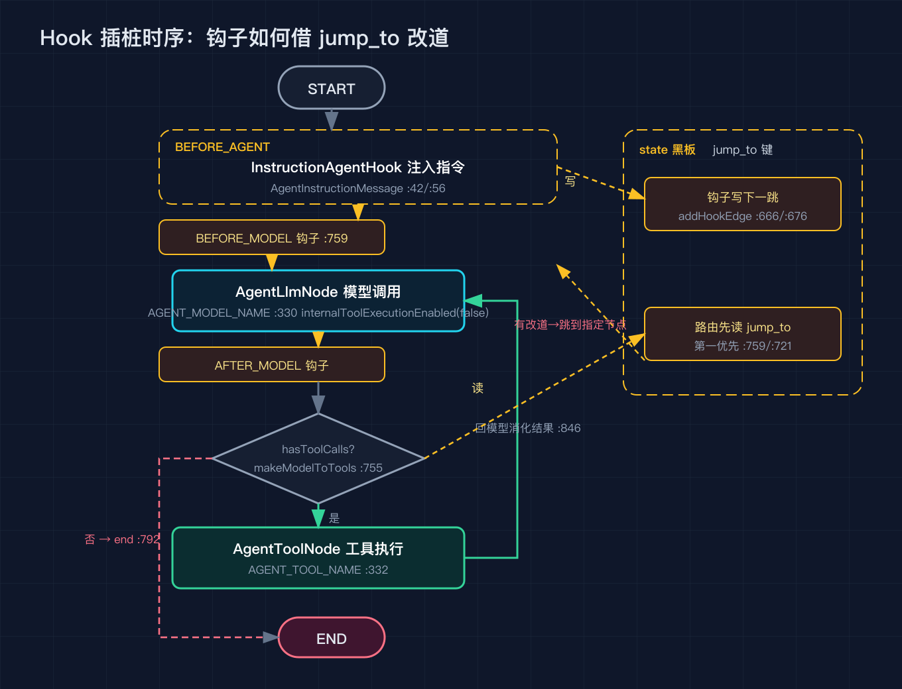
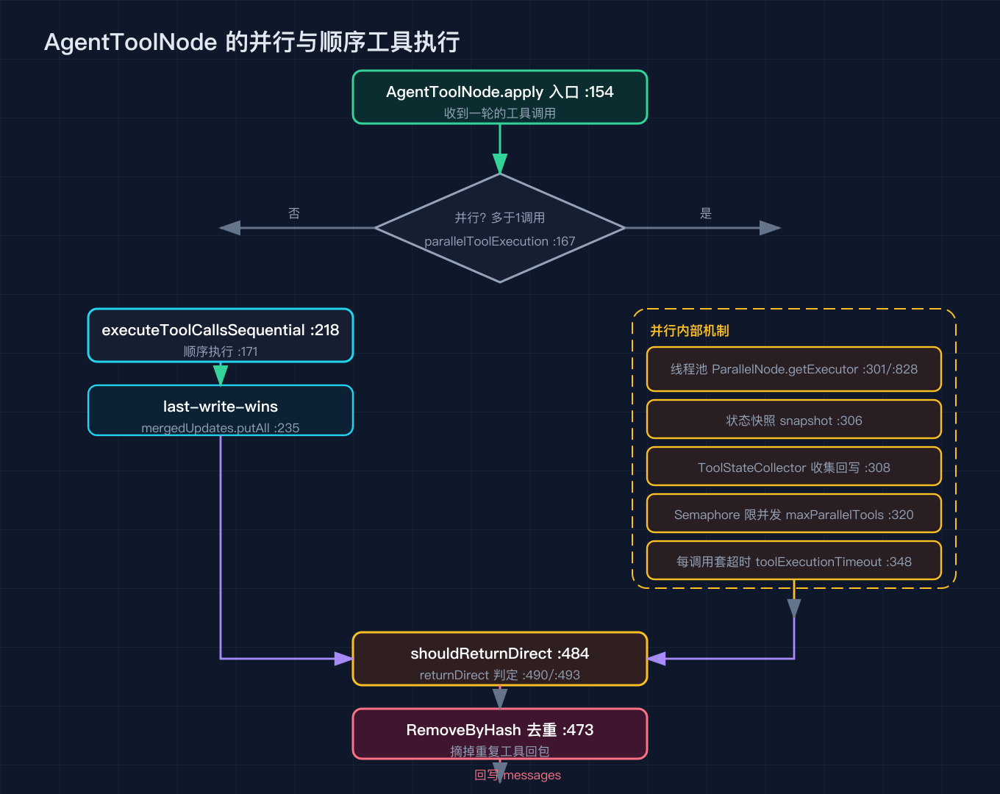

# Spring AI Alibaba 之四：拆开 ReactAgent 的图，看 ReAct 循环怎么拼出来

基准是 tag v1.1.2.2，提交 7405a7d。这一篇我提到的每个文件、每一行，都在这个提交上用 grep 对着源码核过，没核实过的不写。

之三把 graph-core 拆完，我说 ReactAgent 不过是把状态图引擎做的一种固定拼法。这一篇就把它真正拆开，看那张图是怎么从代码里长出来的。ReactAgent 这个类本身不复杂，复杂的是它把 ReAct 这个「模型想一下、调个工具、再想一下」的循环，翻译成图引擎能跑的节点和边。

## 一、initGraph 全貌

ReactAgent 的图在 initGraph 里组装（ReactAgent.java:304）。先看这张全貌图，下面逐段对。

入口第一行就把 InstructionAgentHook 钉了进去（:312，create 在 :86）。这个钩子后面专门讲，现在只需记住它一定在，而且挂在 BEFORE_AGENT 位置（InstructionAgentHook.java:42）。

接着 new 一个 StateGraph，状态键策略工厂交给 buildMessagesKeyStrategyFactory（:733）。这个工厂决定了 messages 这种会一直生长的键怎么归约，之三讲过的 AppendStrategy 在这里被用上了。

然后加节点。模型节点 AGENT_MODEL_NAME 包的是 AgentLlmNode（:330，AgentLlmNode.java:64）。工具节点 AGENT_TOOL_NAME 包的是 AgentToolNode（:332，AgentToolNode.java:98），但只有 hasTools 为真才加（:154，判断 toolNode.getToolCallbacks 非空且不是空列表）。没有工具，就只剩一个模型节点，自然也没有循环。

节点加完，开始处理钩子和出入口。filterHooksByPosition 按四种位置把钩子分桶（:339 到 :342）：BEFORE_AGENT、AFTER_AGENT、BEFORE_MODEL、AFTER_MODEL（HookPosition.java:25/:30/:35/:40）。然后 determineEntryNode、determineLoopEntryNode、determineLoopExitNode、determineExitNode 四个函数分别算出图的入口、循环入口、循环出口、总出口（:389/:390/:391/:392）。最后 addEdge(START, entryNode) 把起点接到入口（:395）。

如果 hasTools 为真，再调 setupToolRouting 把工具相关的两条条件边接上（:579/:580）。到这一步，一张能跑的 ReAct 图就齐了。

## 二、钩子不是另开节点，是借 jump_to 插桩

这是 ReactAgent 里我最想讲清楚的一点。它没把钩子做成单独节点塞进主循环，而是借状态里的 jump_to 键改道。

四种 HookPosition 决定钩子挂在循环的哪个切口：BEFORE_AGENT 在整轮开始前，AFTER_AGENT 在整轮结束后，BEFORE_MODEL 在每次调模型前，AFTER_MODEL 在每次调模型后。InstructionAgentHook 是框架必注入的，它挂在 BEFORE_AGENT，作用是在消息列表最前面插一条 AgentInstructionMessage，把系统指令交给模型（InstructionAgentHook.java:48/:56）。

挂法在 chainHook 一族（:563/:566/:570/:575）和 setupHookEdges（:550）里。每个钩子节点执行完后，会把想去的下一跳写进 state.value("jump_to")（:676，addHookEdge 在 :666 负责接线）。之后路由到下一跳时，第一件事就是读这个键（makeModelToTools 在 :759 也读），所以 beforeModel 钩子能在模型前把流程改道，afterModel 钩子能在模型后改道，而不用动主循环一行代码。

Hook 接口本身留了三个默认方法：canJumpTo 决定能不能改道（Hook.java:153），getKeyStrategys 给钩子自己的状态键注册归约策略（:172），getHookPositions 读的是类上的 @HookPositions 注解（:195）。也就是说一个钩子想插在哪、能不能改道，都是声明式的，框架在 initGraph 时一次性收好。

## 三、messages 为什么能一直追加而不被覆盖

这点和之三的 KeyStrategy 是连着的。buildMessagesKeyStrategyFactory 里把 messages 这个键直接绑到 AppendStrategy（:739）。所以 AgentLlmNode 每次往 messages 里丢一条新消息，框架会把它接到总状态后面，而不是整体替换（它在 apply 里写的就是 messages，:285，顺带把 token 用量记成 _TOKEN_USAGE_，:284）。你以后自己写 Agent，想让某个键累加，就得照着这个工厂把自己要的键也注册成 APPEND，否则默认走 REPLACE，新值会把旧值冲掉。

## 四、两条边把 ReAct 串成环

模型到工具的边由 makeModelToTools 路由（:755）。它先看 jump_to（:759，钩子改道的第一优先级），有就按 model、end、tool 三选一走（JumpTo.java:26/:27/:28，resolveJump 在 :721/:726 翻译成具体节点名）。没有改道，就退到第二优先级：取 messages 最后一条消息（:779），如果它是 AssistantMessage 且 hasToolCalls（:789），奔 AGENT_TOOL_NAME（:790）；否则奔 endDestination，也就是结束（:792）。还有一个 ToolResponseMessage 分支（:794），它会核对上一条 AssistantMessage 请求的工具 id 和实际执行回来的工具 id 是不是对得上（:807/:811/:815），防止状态被残缺的工具结果改坏。

工具回到模型的边由 makeToolsToModelEdge 路由（:828）。它取最后一条 ToolResponseMessage（:831），正常情况直接回到模型节点 loopEntryNode（:846），让模型消化工具结果再决定下一步。这里有个值得记一笔的点：return_direct 的判定目前写着 return false; // FIXME（:836）。也就是说官方此刻还没接上「工具执行完直接结束」这条路，循环退出只能靠模型不再要工具。你哪天想让某个工具跑完就收尾，得自己接这行。

两条边通过 addConditionalEdges 接起来（:715 模型出 / :718 工具回），目的地映射把 AGENT_TOOL_NAME、exitNode、loopEntryNode 都登记上，图的闭环就成形了。

## 五、两个节点的执行细节

模型节点 AgentLlmNode 有个容易被忽略的设计：它禁用了框架内部的工具执行。buildChatOptions 里把 internalToolExecutionEnabled(false) 设了不止一处（:353/:362/:364/:495/:505）。原因很直白，工具调用要交给 AgentToolNode 走图引擎的路由，不能让模型节点自己悄悄把工具跑了。它还会维护一个迭代计数（:143，键名 _MODEL_ITERATION_，:66），每跑一轮加一写到状态里，这样上层能知道循环到第几圈。

工具节点 AgentToolNode 的设计更值得看。它支持并行执行工具（:167，条件是 parallelToolExecution 且这一轮工具调用多于一个，否则走顺序 :171）。并行分支 executeToolCallsParallel（:290）里，它先拿一个线程池（getToolExecutor :301/:828，底层走 ParallelNode.getExecutor），给状态拍了张快照（:306），用一个 ToolStateCollector 收集每个工具写回的状态（:308），再用 Semaphore 限住并发数（:320，上限来自 maxParallelTools 字段 :108），每个工具调用都套了超时（:348，超时来自 toolExecutionTimeout :110）。顺序分支 executeToolCallsSequential（:218）则是后写覆盖先写（:235 的 mergedUpdates.putAll 就是 last-write-wins）。两个分支最后都过 shouldReturnDirect 看工具有没有要求直出（:484/:490/:493），并用 RemoveByHash 把重复的工具回包从消息里摘掉（:473），避免同一条工具响应被反复拼进 messages。

## 六、复现模块

本篇附 code/verify_sources.py，把上面引用的每个文件、每一行都在 7405a7d 上重新 grep 核对一遍，跑通就证明行号没漂。纯标准库，无外部依赖。

## 七、系列排期

之一整体概览（已发）/ 之二 Spring AI 底座（已发）/ 之三 graph-core（已发）/ 之四本篇 ReactAgent / 之五内置编排与 A2A / 之六上下文工程与 HITL / 之七可观测 studio admin sandbox / 之八沙箱与工具安全 / 之九实战收尾。

## 八、结尾钩子

这一篇把 ReactAgent 拆开之后，你会看到 ReAct 循环被翻译成了「两个节点加两条边」，而钩子是用 jump_to 这种状态键插进来的，不是硬写进主循环。我最有兴趣的是那个 FIXME（:836 的 return_direct 还没接），它说明框架设计者也想把「工具跑完直接收尾」做成一等公民，只是还没做。你在自己的项目里写循环的时候，是愿意把这种分支提前留好接口，还是等真的需要了再改？评论区聊聊。
